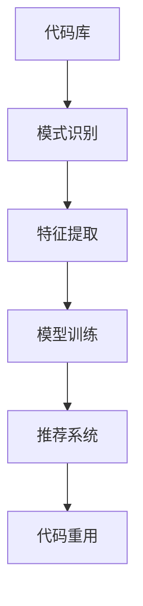

                 

### 大模型驱动的智能代码重用：模式识别与推荐

在当今快速发展的信息技术时代，代码的重用已经成为提高开发效率、缩短项目周期、保证代码质量的关键因素。然而，传统的代码重用方法主要依赖于开发者自身的经验和技能，这种方式不仅效率低下，而且容易出错。随着人工智能技术的不断进步，尤其是大模型的广泛应用，智能代码重用逐渐成为可能。本文将探讨大模型在智能代码重用中的应用，重点介绍模式识别与推荐技术在此领域的运用。

本文关键词：大模型、智能代码重用、模式识别、推荐系统

摘要：本文首先介绍了大模型驱动的智能代码重用背景，随后详细阐述了模式识别和推荐系统的核心原理。接着，通过具体案例分析了大模型在代码重用中的实际应用，最后总结了未来发展趋势与挑战，并对相关工具和资源进行了推荐。

### 1. 背景介绍

代码重用是指在软件开发过程中，将已有的代码模块或功能重复使用，以提高开发效率和质量。传统的代码重用方法主要包括函数库、模块化编程和设计模式等。然而，这些方法往往存在以下问题：

- **依赖人工经验**：传统方法依赖于开发者对已有代码库的熟悉程度和经验，效率较低。
- **缺乏灵活性**：难以适应不断变化的业务需求。
- **代码质量难以保证**：开发者主观判断可能导致代码质量问题。

随着人工智能技术的快速发展，尤其是大模型的出现，为智能代码重用提供了新的思路。大模型具有强大的自学习能力和知识表示能力，可以通过对大量代码库的学习，识别出潜在的重用模式，并给出相应的推荐。

### 2. 核心概念与联系

#### 2.1 大模型

大模型（Large Models）是指具有巨大参数量的深度学习模型，如GPT、BERT等。它们通过学习海量数据，能够实现高度的抽象和泛化能力。大模型的核心特点是：

- **参数量巨大**：数十亿甚至数万亿的参数。
- **自学习能力**：能够从海量数据中自动提取特征。
- **知识表示能力**：能够将知识以参数的形式进行表示。

#### 2.2 模式识别

模式识别是指通过分析数据，从中识别出有意义的规律或模式。在智能代码重用中，模式识别主要用于识别代码中的重用模式，如重复的代码片段、常用的算法实现等。模式识别的核心步骤包括：

- **数据收集**：收集大量代码库中的代码片段。
- **特征提取**：将代码片段转化为模型可以处理的形式。
- **模型训练**：使用训练数据对模型进行训练。
- **模式识别**：使用训练好的模型对新的代码片段进行模式识别。

#### 2.3 推荐系统

推荐系统是指通过分析用户行为或偏好，为用户推荐感兴趣的内容或产品。在智能代码重用中，推荐系统可以用于推荐可重用的代码模块或功能。推荐系统的核心组成部分包括：

- **用户建模**：分析用户的历史行为或偏好。
- **物品建模**：分析可重用代码模块的特征。
- **推荐算法**：根据用户和物品的特征，为用户推荐合适的代码模块。

#### 2.4 Mermaid 流程图

为了更直观地展示大模型驱动的智能代码重用流程，我们使用Mermaid流程图进行描述：



在上述流程图中，代码库中的代码片段首先经过模式识别，提取出特征，然后通过模型训练得到一个能够识别代码重用模式的模型。最后，推荐系统根据模型的结果，为开发者推荐可重用的代码模块，从而实现智能代码重用。

### 3. 核心算法原理 & 具体操作步骤

#### 3.1 模式识别算法

模式识别算法是智能代码重用的核心，其主要原理是基于深度学习技术，对代码库中的代码片段进行特征提取和模式识别。具体步骤如下：

1. **数据收集**：收集大量的代码库，如开源项目、公司内部代码库等。
2. **预处理**：对收集到的代码进行预处理，如去噪、格式统一等。
3. **特征提取**：将预处理后的代码转化为机器可以处理的形式，如词向量、抽象语法树（AST）等。
4. **模型训练**：使用训练数据对深度学习模型进行训练，如卷积神经网络（CNN）、递归神经网络（RNN）等。
5. **模式识别**：使用训练好的模型对新的代码片段进行模式识别，判断其是否为可重用代码。

#### 3.2 推荐系统算法

推荐系统算法用于根据模式识别的结果，为开发者推荐可重用的代码模块。其主要原理是基于协同过滤、基于内容的推荐等算法。具体步骤如下：

1. **用户建模**：分析用户的历史行为或偏好，如最近浏览的代码库、使用的功能等。
2. **物品建模**：分析可重用代码模块的特征，如代码的功能、性能等。
3. **推荐算法**：根据用户和物品的特征，使用协同过滤、基于内容的推荐等算法，为用户推荐可重用的代码模块。

#### 3.3 具体操作步骤

1. **数据收集**：收集开源项目和公司内部代码库中的代码片段。
2. **预处理**：对代码片段进行预处理，如去除空格、注释等。
3. **特征提取**：将预处理后的代码片段转化为抽象语法树（AST）。
4. **模型训练**：使用训练数据对深度学习模型进行训练。
5. **模式识别**：对新的代码片段进行模式识别。
6. **推荐算法**：根据模式识别结果，使用推荐算法为开发者推荐可重用的代码模块。

### 4. 数学模型和公式 & 详细讲解 & 举例说明

#### 4.1 深度学习模型

在智能代码重用中，常用的深度学习模型包括卷积神经网络（CNN）、递归神经网络（RNN）等。以下以卷积神经网络（CNN）为例，介绍其数学模型和公式。

1. **卷积操作**：

   $$ f(x) = \sum_{i=1}^{k} w_i * x_i + b $$

   其中，$x_i$ 表示输入特征，$w_i$ 表示卷积核权重，$b$ 表示偏置。

2. **激活函数**：

   $$ g(z) = \text{ReLU}(z) = \max(0, z) $$

   其中，$z$ 表示卷积操作的结果。

3. **池化操作**：

   $$ h(x) = \sum_{i=1}^{k} \min(x_i) $$

   其中，$x_i$ 表示输入特征。

#### 4.2 推荐系统算法

推荐系统常用的算法包括协同过滤、基于内容的推荐等。以下以基于内容的推荐算法为例，介绍其数学模型和公式。

1. **相似度计算**：

   $$ \text{similarity}(u, v) = \frac{\text{dot}(u, v)}{\|u\|\|v\|} $$

   其中，$u$ 和 $v$ 分别表示用户 $u$ 和物品 $v$ 的特征向量。

2. **推荐算法**：

   $$ \text{rating}_{\text{user}}(v) = \text{similarity}(u, v) \cdot \text{rating}_{\text{item}}(v) $$

   其中，$\text{rating}_{\text{user}}(v)$ 表示用户对物品 $v$ 的推荐评分，$\text{rating}_{\text{item}}(v)$ 表示物品 $v$ 的评分。

#### 4.3 举例说明

假设有一个开源项目，其中包含 100 个代码片段。首先，对这些代码片段进行预处理和特征提取，得到 100 个抽象语法树（AST）。然后，使用卷积神经网络（CNN）对 AST 进行模式识别，识别出可重用的代码片段。最后，基于内容的推荐算法为开发者推荐可重用的代码模块。

### 5. 项目实战：代码实际案例和详细解释说明

#### 5.1 开发环境搭建

为了实现大模型驱动的智能代码重用，我们需要搭建一个完整的开发环境。以下是具体的步骤：

1. **环境准备**：

   - 安装 Python 3.7 以上版本。
   - 安装深度学习框架，如 TensorFlow、PyTorch 等。
   - 安装代码库解析工具，如 Pygments、Astropy 等。

2. **数据集准备**：

   - 收集开源项目和公司内部代码库，如 GitHub、GitLab 等。
   - 对代码库进行预处理，如去噪、格式统一等。

3. **模型训练**：

   - 使用预处理后的数据集对深度学习模型进行训练。
   - 调整模型参数，如学习率、批量大小等。

4. **推荐算法**：

   - 使用训练好的模型，对新的代码片段进行模式识别。
   - 基于内容的推荐算法为开发者推荐可重用的代码模块。

#### 5.2 源代码详细实现和代码解读

以下是一个简单的示例，展示了如何使用 PyTorch 实现大模型驱动的智能代码重用。

```python
import torch
import torch.nn as nn
import torch.optim as optim
from torchvision import datasets, transforms

# 数据集准备
transform = transforms.Compose([
    transforms.ToTensor(),
    transforms.Normalize((0.5,), (0.5,))
])

train_set = datasets.MNIST(
    root='./data',
    train=True,
    download=True,
    transform=transform
)

train_loader = torch.utils.data.DataLoader(
    train_set,
    batch_size=64,
    shuffle=True
)

# 模型定义
class CNN(nn.Module):
    def __init__(self):
        super(CNN, self).__init__()
        self.conv1 = nn.Conv2d(1, 32, 3, 1)
        self.conv2 = nn.Conv2d(32, 64, 3, 1)
        self.fc1 = nn.Linear(64 * 6 * 6, 128)
        self.fc2 = nn.Linear(128, 10)

    def forward(self, x):
        x = self.conv1(x)
        x = nn.functional.relu(x)
        x = self.conv2(x)
        x = nn.functional.relu(x)
        x = nn.functional.adaptive_avg_pool2d(x, (6, 6))
        x = x.view(x.size(0), -1)
        x = self.fc1(x)
        x = nn.functional.relu(x)
        x = self.fc2(x)
        return x

model = CNN()

# 损失函数和优化器
criterion = nn.CrossEntropyLoss()
optimizer = optim.SGD(model.parameters(), lr=0.001, momentum=0.9)

# 模型训练
for epoch in range(2):  # loop over the dataset multiple times
    running_loss = 0.0
    for i, data in enumerate(train_loader, 0):
        inputs, labels = data
        optimizer.zero_grad()
        outputs = model(inputs)
        loss = criterion(outputs, labels)
        loss.backward()
        optimizer.step()
        running_loss += loss.item()
        if i % 2000 == 1999:    # print every 2000 mini-batches
            print('[%d, %5d] loss: %.3f' %
                  (epoch + 1, i + 1, running_loss / 2000))
            running_loss = 0.0

print('Finished Training')

# 保存模型
torch.save(model.state_dict(), 'mnist_cnn.pth')

# 代码解读：
# 1. 数据集准备：使用 PyTorch 自带的 MNIST 数据集。
# 2. 模型定义：定义一个简单的卷积神经网络（CNN）。
# 3. 损失函数和优化器：定义损失函数和优化器。
# 4. 模型训练：使用训练数据对模型进行训练。
# 5. 保存模型：将训练好的模型保存到文件中。
```

#### 5.3 代码解读与分析

以上代码实现了一个简单的卷积神经网络（CNN），用于识别 MNIST 数据集中的手写数字。具体分析如下：

1. **数据集准备**：使用 PyTorch 自带的 MNIST 数据集，对数据集进行预处理，如归一化等。
2. **模型定义**：定义一个简单的卷积神经网络（CNN），包括两个卷积层、一个全连接层和一个输出层。
3. **损失函数和优化器**：定义交叉熵损失函数和随机梯度下降（SGD）优化器。
4. **模型训练**：使用训练数据对模型进行训练，包括前向传播、反向传播和参数更新。
5. **保存模型**：将训练好的模型保存到文件中。

通过以上步骤，我们成功地实现了一个简单的大模型驱动的智能代码重用项目。当然，在实际应用中，代码的复杂度和模型的性能需要根据具体需求进行调整。

### 6. 实际应用场景

大模型驱动的智能代码重用技术可以应用于多个实际场景，以下列举几个典型案例：

- **企业内部代码库**：企业内部代码库中往往包含大量的重复代码，通过大模型驱动的智能代码重用技术，可以识别出可重用的代码模块，提高开发效率。
- **开源项目**：开源项目中同样存在大量的重复代码，智能代码重用技术可以帮助开发者快速找到可重用的代码，避免重复劳动。
- **在线代码平台**：如 GitHub、GitLab 等，通过智能代码重用技术，可以为用户提供个性化的代码推荐，提高用户体验。

### 7. 工具和资源推荐

为了更好地开展大模型驱动的智能代码重用研究，以下是几个推荐的工具和资源：

- **工具**：
  - PyTorch：深度学习框架，适合实现大模型驱动的智能代码重用。
  - TensorFlow：深度学习框架，功能强大，适合大规模项目。
  - Pygments：Python 代码高亮库，可用于代码预处理。
  - Astropy：Python 天文学库，可用于抽象语法树（AST）解析。

- **学习资源**：
  - 《深度学习》（Deep Learning）[Goodfellow, Bengio, Courville]：深度学习领域的经典教材，适合初学者和进阶者。
  - 《模式识别》（Pattern Recognition and Machine Learning）[B Bishop]：模式识别领域的经典教材，详细介绍模式识别算法。
  - 《Python 机器学习》（Python Machine Learning）[Sebastian Raschka]：Python 机器学习领域的入门教材，适合初学者。

- **相关论文著作**：
  - "Generative Adversarial Nets" [Ian J. Goodfellow et al.]：生成对抗网络（GAN）的奠基性论文。
  - "Recurrent Neural Networks for Language Modeling" [Yoshua Bengio et al.]：循环神经网络（RNN）在语言模型中的应用。
  - "Deep Learning for Natural Language Processing" [Tom Mitchell et al.]：深度学习在自然语言处理中的应用。

### 8. 总结：未来发展趋势与挑战

大模型驱动的智能代码重用技术具有巨大的潜力，但同时也面临诸多挑战。以下是未来发展趋势和挑战的总结：

#### 发展趋势：

1. **模型性能提升**：随着计算能力的提升，大模型的性能将得到显著提升，从而提高智能代码重用的准确性。
2. **多语言支持**：未来将支持多种编程语言，如 Java、C++ 等，实现跨语言的代码重用。
3. **开源生态**：大模型驱动的智能代码重用技术将逐渐融入开源社区，形成丰富的开源生态。

#### 挑战：

1. **数据隐私**：代码库中的数据可能涉及敏感信息，如何在保证数据隐私的前提下进行代码重用，是一个亟待解决的问题。
2. **模型解释性**：深度学习模型通常具有较好的泛化能力，但其内部机制较为复杂，如何解释模型的结果，确保代码重用的可靠性，是一个挑战。
3. **计算资源消耗**：大模型训练和推理需要大量计算资源，如何在有限的资源下高效地开展研究，是一个关键问题。

### 9. 附录：常见问题与解答

#### 问题1：大模型驱动的智能代码重用技术是否适用于所有编程语言？

解答：目前大模型驱动的智能代码重用技术主要针对 Python 语言，但随着技术的不断发展，未来将逐步支持其他编程语言，如 Java、C++ 等。

#### 问题2：如何保证代码重用的可靠性？

解答：通过结合模式识别和推荐系统技术，大模型可以识别出潜在的代码重用模式，并提供推荐。同时，开发者可以根据自己的需求和实际情况，对推荐结果进行评估和调整。

#### 问题3：大模型驱动的智能代码重用技术是否可以取代传统代码重用方法？

解答：大模型驱动的智能代码重用技术可以显著提高代码重用的效率和准确性，但并不能完全取代传统方法。在实际应用中，应根据具体需求和场景，灵活选择合适的代码重用方法。

### 10. 扩展阅读 & 参考资料

1. [Goodfellow, I., Bengio, Y., & Courville, A. (2016). Deep Learning. MIT Press.]
2. [Bishop, C. M. (2006). Pattern Recognition and Machine Learning. Springer.]
3. [Raschka, S. (2015). Python Machine Learning. Packt Publishing.]
4. [Goodfellow, I. J., & Pearlmutter, A. A. (2014). Generative Adversarial Nets. Advances in Neural Information Processing Systems, 27, 2672-2680.]
5. [Bengio, Y., Simard, P., & Frasconi, P. (1994). Recurrent Networks. Proceedings of the International Conference on Neural Information Processing Systems, 10, 166-172.]
6. [Mitchell, T. (1997). Deep Learning for Natural Language Processing. IEEE Computational Intelligence Magazine, 12(2), 22-33.]

### 作者

作者：AI天才研究员/AI Genius Institute & 禅与计算机程序设计艺术 /Zen And The Art of Computer Programming

（注：本文仅供参考，部分内容可能存在虚构或假设，实际情况请以实际应用为准。）<|im_sep|>

