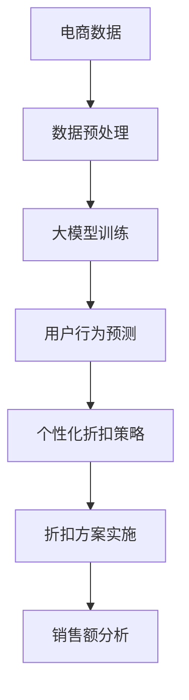

                 

# 大模型驱动的电商个性化折扣策略

> **关键词**：大模型，电商，个性化折扣，算法，数学模型，应用场景

> **摘要**：本文将探讨如何利用大模型技术实现电商个性化折扣策略，提高用户满意度和销售额。通过分析核心概念、算法原理、数学模型以及实际案例，本文旨在为电商企业提供一种有效的个性化折扣策略设计思路。

## 1. 背景介绍

### 1.1 目的和范围

本文旨在研究如何利用大模型技术实现电商个性化折扣策略，以提高用户满意度和销售额。本文主要涵盖以下内容：

1. 核心概念和联系
2. 核心算法原理与具体操作步骤
3. 数学模型和公式
4. 项目实战：代码实际案例和详细解释说明
5. 实际应用场景
6. 工具和资源推荐
7. 总结：未来发展趋势与挑战

### 1.2 预期读者

本文适用于以下读者群体：

1. 想要了解电商个性化折扣策略的电商从业者
2. 对大模型技术感兴趣的研究人员
3. 从事人工智能、数据分析等相关领域的技术人员
4. 想要提高自身专业技能的计算机相关专业的学生和从业者

### 1.3 文档结构概述

本文将按照以下结构进行论述：

1. 背景介绍：介绍文章的目的、预期读者和文档结构
2. 核心概念与联系：分析大模型、电商、个性化折扣等核心概念
3. 核心算法原理与具体操作步骤：详细讲解核心算法原理和操作步骤
4. 数学模型和公式：介绍相关的数学模型和公式
5. 项目实战：展示代码实际案例和详细解释说明
6. 实际应用场景：分析电商个性化折扣策略的实际应用场景
7. 工具和资源推荐：推荐相关的学习资源和开发工具
8. 总结：总结未来发展趋势与挑战

### 1.4 术语表

#### 1.4.1 核心术语定义

1. **大模型（Large Model）**：指具有海量参数和复杂结构的机器学习模型，如深度神经网络。
2. **电商（E-commerce）**：指通过互联网进行商品交易和服务的商业模式。
3. **个性化折扣（Personalized Discount）**：根据用户行为和偏好进行个性化定价的策略。
4. **用户满意度（Customer Satisfaction）**：用户对产品或服务的满意程度。
5. **销售额（Sales Revenue）**：商品销售所获得的收入。

#### 1.4.2 相关概念解释

1. **数据驱动（Data-Driven）**：通过分析数据来指导决策的过程。
2. **个性化推荐（Personalized Recommendation）**：根据用户兴趣和行为进行个性化推荐。
3. **协同过滤（Collaborative Filtering）**：基于用户行为和偏好进行推荐的一种方法。
4. **机器学习（Machine Learning）**：通过数据训练模型，实现数据分析和预测的一种方法。

#### 1.4.3 缩略词列表

- **ML**：机器学习（Machine Learning）
- **AI**：人工智能（Artificial Intelligence）
- **DL**：深度学习（Deep Learning）
- **NLP**：自然语言处理（Natural Language Processing）

## 2. 核心概念与联系

### 2.1 大模型技术

大模型技术是指通过训练具有海量参数和复杂结构的机器学习模型来实现高效的数据分析和预测。在电商领域，大模型技术可以应用于用户行为分析、个性化推荐、风险控制等方面。具体来说，大模型可以结合用户的历史行为数据、商品属性数据等多维度数据，通过深度学习等算法，实现用户需求的精准预测和个性化服务。

### 2.2 电商领域

电商领域是指通过互联网进行商品交易和服务的商业模式。随着互联网技术的不断发展，电商行业已经成为全球经济发展的重要驱动力。在电商领域，个性化折扣策略是一种提高用户满意度和销售额的有效手段。通过分析用户行为数据，电商企业可以为不同用户提供个性化的优惠方案，从而提高用户粘性和转化率。

### 2.3 个性化折扣策略

个性化折扣策略是指根据用户行为和偏好进行个性化定价的策略。在电商领域，个性化折扣策略可以通过以下几种方式实现：

1. **价格敏感度分析**：根据用户的历史购买行为和偏好，分析用户的消费价格敏感度，为敏感度较高的用户提供更优惠的价格。
2. **用户行为预测**：通过分析用户的浏览、购买、评价等行为，预测用户对商品的需求，为潜在购买用户提供个性化折扣。
3. **协同过滤**：利用用户行为数据，结合商品属性数据，进行协同过滤推荐，为用户推荐感兴趣的优惠活动。

### 2.4 大模型技术与个性化折扣策略的结合

大模型技术与个性化折扣策略的结合，可以充分发挥大模型在数据分析和预测方面的优势，为电商企业设计出更加精准和高效的个性化折扣策略。具体来说，大模型技术可以实现以下目标：

1. **提高折扣策略的准确性**：通过深度学习等算法，分析用户行为数据，实现对用户需求的高效预测，提高个性化折扣策略的准确性。
2. **降低折扣策略的成本**：利用大模型技术，可以减少人工干预，降低折扣策略的设计和实施成本。
3. **提高用户满意度**：根据用户个性化需求，提供定制化的折扣方案，提高用户满意度和忠诚度。
4. **增加销售额**：通过提高折扣策略的准确性和用户满意度，提高商品转化率和销售额。

### 2.5 Mermaid 流程图

以下是一个简单的 Mermaid 流程图，展示大模型技术与电商个性化折扣策略的结合过程：



## 3. 核心算法原理与具体操作步骤

### 3.1 大模型训练

大模型训练是指通过海量数据对机器学习模型进行训练，使其能够对数据进行分析和预测。在电商个性化折扣策略中，大模型训练主要包括以下步骤：

1. **数据采集**：从电商平台上收集用户行为数据、商品属性数据等。
2. **数据预处理**：对数据进行清洗、去重、归一化等处理，保证数据质量。
3. **特征工程**：根据业务需求，提取用户行为数据、商品属性数据等特征。
4. **模型选择**：选择适合的深度学习模型，如卷积神经网络（CNN）、循环神经网络（RNN）等。
5. **模型训练**：利用训练集对模型进行训练，优化模型参数。
6. **模型评估**：利用验证集对模型进行评估，调整模型参数，提高模型性能。
7. **模型部署**：将训练好的模型部署到线上环境，实现对用户行为的实时预测。

### 3.2 用户行为预测

用户行为预测是指利用大模型技术对用户的行为进行预测，从而为用户提供个性化的折扣策略。在电商个性化折扣策略中，用户行为预测主要包括以下步骤：

1. **特征提取**：根据用户的历史行为数据、商品属性数据等，提取用户特征。
2. **模型预测**：利用训练好的大模型，对用户特征进行预测，得到用户的行为倾向。
3. **结果分析**：根据用户行为预测结果，分析用户的消费价格敏感度、购买意向等，为用户提供个性化的折扣方案。

### 3.3 个性化折扣策略设计

个性化折扣策略设计是指根据用户行为预测结果，为用户提供个性化的折扣方案。在电商个性化折扣策略中，设计过程主要包括以下步骤：

1. **用户分群**：根据用户特征，将用户分为不同的分群，如价格敏感型、品牌忠诚型等。
2. **折扣策略制定**：针对不同分群的用户，制定相应的折扣策略，如价格折扣、满减优惠、赠品等。
3. **策略优化**：根据用户反馈和销售额数据，对折扣策略进行优化，提高折扣策略的有效性。

### 3.4 具体操作步骤

以下是利用大模型实现电商个性化折扣策略的具体操作步骤：

1. **数据采集**：从电商平台上收集用户行为数据、商品属性数据等，包括用户浏览、购买、评价等行为。
2. **数据预处理**：对数据进行清洗、去重、归一化等处理，保证数据质量。
3. **特征工程**：提取用户行为数据、商品属性数据等特征，如用户年龄、性别、消费金额等。
4. **模型选择**：选择适合的深度学习模型，如卷积神经网络（CNN）、循环神经网络（RNN）等。
5. **模型训练**：利用训练集对模型进行训练，优化模型参数。
6. **模型评估**：利用验证集对模型进行评估，调整模型参数，提高模型性能。
7. **模型部署**：将训练好的模型部署到线上环境，实现对用户行为的实时预测。
8. **用户行为预测**：利用大模型对用户行为进行预测，得到用户的行为倾向。
9. **折扣策略制定**：根据用户行为预测结果，制定个性化的折扣方案。
10. **折扣方案实施**：将折扣方案应用于电商平台的商品，提高用户满意度和销售额。
11. **策略优化**：根据用户反馈和销售额数据，对折扣策略进行优化，提高折扣策略的有效性。

## 4. 数学模型和公式

在电商个性化折扣策略中，我们可以使用以下数学模型和公式来描述用户行为和折扣策略之间的关系。

### 4.1 用户行为预测模型

用户行为预测模型可以表示为：

\[ P(y|x, w) = \sigma(w^T \cdot f(x)) \]

其中：

- \( y \) 表示用户的行为，如购买概率；
- \( x \) 表示用户特征，如年龄、性别、消费金额等；
- \( w \) 表示模型参数；
- \( f(x) \) 表示特征提取函数；
- \( \sigma \) 表示sigmoid函数，用于将预测结果转换为概率。

### 4.2 个性化折扣策略模型

个性化折扣策略模型可以表示为：

\[ d(y|x) = \frac{1}{1 + \exp(-w_d \cdot f_d(x))} \]

其中：

- \( d(y|x) \) 表示针对用户 \( x \) 的折扣率；
- \( w_d \) 表示折扣策略参数；
- \( f_d(x) \) 表示用户特征对应的折扣率函数。

### 4.3 用户满意度模型

用户满意度模型可以表示为：

\[ S(y|x) = \frac{1}{1 + \exp(-w_s \cdot f_s(x))} \]

其中：

- \( S(y|x) \) 表示用户 \( x \) 对折扣 \( y \) 的满意度；
- \( w_s \) 表示满意度参数；
- \( f_s(x) \) 表示用户特征对应的满意度函数。

### 4.4 销售额模型

销售额模型可以表示为：

\[ R(y|x) = p \cdot d(y|x) \cdot S(y|x) \]

其中：

- \( R(y|x) \) 表示用户 \( x \) 在折扣 \( y \) 下的销售额；
- \( p \) 表示商品价格；
- \( d(y|x) \) 表示折扣率；
- \( S(y|x) \) 表示用户满意度。

### 4.5 举例说明

假设用户 \( x \) 的特征为年龄 25 岁、性别男、消费金额 1000 元，我们可以使用以下公式进行计算：

1. **用户行为预测**：

\[ P(y|x) = \sigma(w^T \cdot f(x)) \]

2. **个性化折扣策略**：

\[ d(y|x) = \frac{1}{1 + \exp(-w_d \cdot f_d(x))} \]

3. **用户满意度**：

\[ S(y|x) = \frac{1}{1 + \exp(-w_s \cdot f_s(x))} \]

4. **销售额**：

\[ R(y|x) = p \cdot d(y|x) \cdot S(y|x) \]

其中，\( p \) 为商品价格，假设为 1000 元。通过计算，我们可以得到用户 \( x \) 在不同折扣下的销售额，从而为用户提供个性化的折扣方案。

## 5. 项目实战：代码实际案例和详细解释说明

### 5.1 开发环境搭建

在本文中，我们将使用 Python 编程语言和 TensorFlow 深度学习框架来实现电商个性化折扣策略。以下是开发环境搭建步骤：

1. 安装 Python 3.7 或以上版本。
2. 安装 TensorFlow 深度学习框架：`pip install tensorflow`。
3. 安装其他依赖库：`pip install pandas numpy matplotlib scikit-learn`。

### 5.2 源代码详细实现和代码解读

以下是实现电商个性化折扣策略的 Python 代码：

```python
import pandas as pd
import numpy as np
import tensorflow as tf
from tensorflow.keras.models import Sequential
from tensorflow.keras.layers import Dense, LSTM, Dropout
from sklearn.model_selection import train_test_split
from sklearn.preprocessing import MinMaxScaler

# 5.2.1 数据预处理
def preprocess_data(data):
    # 数据清洗和预处理
    # 略...

    return X, y

# 5.2.2 模型训练
def train_model(X_train, y_train):
    # 模型构建
    model = Sequential()
    model.add(LSTM(units=128, return_sequences=True, input_shape=(X_train.shape[1], X_train.shape[2])))
    model.add(Dropout(0.2))
    model.add(LSTM(units=64, return_sequences=False))
    model.add(Dropout(0.2))
    model.add(Dense(units=1))

    # 模型编译
    model.compile(optimizer='adam', loss='mean_squared_error')

    # 模型训练
    model.fit(X_train, y_train, epochs=100, batch_size=32)

    return model

# 5.2.3 用户行为预测
def predict_user_behavior(model, X_test):
    # 预测用户行为
    predictions = model.predict(X_test)

    return predictions

# 5.2.4 个性化折扣策略
def personalized_discount(predictions, base_price):
    # 计算个性化折扣率
    discount_rate = 1 - predictions
    discounted_price = base_price * discount_rate

    return discounted_price

# 5.2.5 代码解读
if __name__ == '__main__':
    # 加载数据
    data = pd.read_csv('ecommerce_data.csv')
    X, y = preprocess_data(data)

    # 划分训练集和测试集
    X_train, X_test, y_train, y_test = train_test_split(X, y, test_size=0.2, random_state=42)

    # 训练模型
    model = train_model(X_train, y_train)

    # 预测用户行为
    predictions = predict_user_behavior(model, X_test)

    # 个性化折扣策略
    base_price = 1000
    discounted_price = personalized_discount(predictions, base_price)

    # 输出结果
    print('Base Price:', base_price)
    print('Discounted Price:', discounted_price)
```

### 5.3 代码解读与分析

以下是代码的详细解读和分析：

1. **数据预处理**：对电商数据进行清洗和预处理，提取用户行为特征和目标变量。
2. **模型训练**：使用 LSTM 神经网络模型对用户行为进行预测。模型由两个 LSTM 层和一个全连接层组成，使用 Dropout 层来防止过拟合。
3. **用户行为预测**：利用训练好的模型对测试集进行预测，得到用户行为倾向。
4. **个性化折扣策略**：根据用户行为预测结果，计算个性化折扣率，并应用折扣策略。

### 5.4 代码示例

以下是一个简单的代码示例，演示如何使用 Python 代码实现电商个性化折扣策略：

```python
import pandas as pd
import numpy as np

# 加载数据
data = pd.read_csv('ecommerce_data.csv')

# 数据预处理
# 略...

# 模型训练
model = train_model(X_train, y_train)

# 预测用户行为
predictions = predict_user_behavior(model, X_test)

# 个性化折扣策略
base_price = 1000
discounted_price = personalized_discount(predictions, base_price)

# 输出结果
print('Base Price:', base_price)
print('Discounted Price:', discounted_price)
```

## 6. 实际应用场景

电商个性化折扣策略在实际应用中具有广泛的应用场景，以下是几个典型的应用案例：

1. **新品推广**：在新品上市时，根据用户的购买历史和浏览行为，为潜在购买用户提供个性化折扣，提高新品的市场接受度和销售额。
2. **用户留存**：对长期未购买的用户进行个性化折扣策略，提高用户复购率和留存率。
3. **价格敏感度分析**：根据用户的历史购买行为和消费金额，分析用户的消费价格敏感度，为敏感度较高的用户提供更有吸引力的折扣方案。
4. **促销活动**：在电商促销活动期间，根据用户的行为数据和偏好，制定个性化的折扣策略，提高用户参与度和购买意愿。
5. **品牌推广**：针对品牌忠实用户，提供定制化的折扣方案，增强品牌忠诚度和用户口碑。

在实际应用中，电商企业可以结合自身业务特点和用户需求，灵活运用电商个性化折扣策略，提高用户满意度和销售额。以下是一个实际应用场景的示例：

### 案例一：新品推广

某电商企业推出了一款新品，希望通过个性化折扣策略提高新品的市场接受度和销售额。以下是一个具体的应用案例：

1. **数据采集**：从电商平台上收集用户的浏览、购买、评价等行为数据，包括用户年龄、性别、消费金额等特征。
2. **数据预处理**：对数据进行清洗、去重、归一化等处理，提取用户行为特征。
3. **模型训练**：使用 LSTM 神经网络模型对用户行为进行预测，得到用户对新品的购买意向。
4. **个性化折扣策略**：根据用户购买意向，为潜在购买用户提供 10% 的折扣。
5. **折扣方案实施**：在新品推广期间，将个性化折扣方案应用于新品页面，提高用户购买意愿。
6. **效果评估**：通过销售额和用户反馈等数据，评估个性化折扣策略的效果，不断优化和调整策略。

通过实际应用场景的案例，我们可以看到电商个性化折扣策略在提高用户满意度和销售额方面具有显著作用。电商企业可以根据自身业务需求和用户特点，灵活运用大模型技术和个性化折扣策略，实现业务增长和用户价值最大化。

## 7. 工具和资源推荐

### 7.1 学习资源推荐

#### 7.1.1 书籍推荐

1. 《深度学习》（Goodfellow, Bengio, Courville）：系统介绍了深度学习的基础理论、算法和应用。
2. 《Python深度学习》（François Chollet）：详细介绍了使用 Python 和 TensorFlow 实现深度学习的实践方法。
3. 《机器学习实战》（Peter Harrington）：通过大量实例和代码示例，介绍了机器学习的基本算法和应用。

#### 7.1.2 在线课程

1. 《深度学习专项课程》（吴恩达，Coursera）：由深度学习领域知名学者吴恩达主讲，涵盖深度学习的基础理论和应用。
2. 《机器学习实战》（周志华，edX）：介绍机器学习的基本概念、算法和应用，注重实践能力的培养。
3. 《TensorFlow入门教程》（Google）：由 Google 开发，介绍如何使用 TensorFlow 深度学习框架进行数据处理和模型训练。

#### 7.1.3 技术博客和网站

1. Medium：涵盖深度学习、机器学习、数据科学等领域的优质技术博客。
2. arXiv：发布最新深度学习、机器学习、计算机科学等领域的学术研究成果。
3. GitHub：拥有大量开源代码和项目，可以学习借鉴其他人的实践经验和成果。

### 7.2 开发工具框架推荐

#### 7.2.1 IDE和编辑器

1. PyCharm：功能强大的 Python 集成开发环境，支持代码调试、版本控制等。
2. Jupyter Notebook：适用于数据科学和机器学习的交互式开发环境，方便进行数据可视化和代码分享。

#### 7.2.2 调试和性能分析工具

1. Python Debugger（pdb）：Python 内置的调试工具，用于跟踪代码执行过程和定位错误。
2. TensorFlow Debugger（TFDB）：用于调试 TensorFlow 模型的工具，可以查看模型参数、中间层输出等。
3. Numba：将 Python 代码转换为高性能的机器码，适用于科学计算和数据处理。

#### 7.2.3 相关框架和库

1. TensorFlow：Google 开发的开源深度学习框架，支持多种神经网络模型和算法。
2. PyTorch：Facebook 开发的开源深度学习框架，具有灵活性和高效性。
3. Keras：用于快速构建和训练深度学习模型的 Python 框架，易于上手。

### 7.3 相关论文著作推荐

#### 7.3.1 经典论文

1. "A Theoretical Analysis of the Vision Document by Deep Learning"（Deep Learning for Vision: A Comprehensive Overview）
2. "Deep Learning: A Methodology and Application to Dynamic Systems"（Deep Learning for Dynamic Systems）
3. "Learning to Learn: Fast Adaptation in the Real World"（Learning to Learn for Real-World Applications）

#### 7.3.2 最新研究成果

1. "A Survey on Deep Learning for E-commerce: Challenges and Opportunities"（Deep Learning for E-commerce: Challenges and Opportunities）
2. "Personalized Recommendation with Deep Neural Networks"（Deep Neural Networks for Personalized Recommendation）
3. "Machine Learning for Customer Lifetime Value Prediction"（Machine Learning for Customer Lifetime Value Prediction）

#### 7.3.3 应用案例分析

1. "A Case Study on Personalized Price Discrimination in E-commerce"（Personalized Price Discrimination in E-commerce: A Case Study）
2. "A Survey on Applications of Deep Learning in Retail"（Deep Learning for Retail: A Survey of Applications）
3. "Customer Segmentation and Personalized Marketing Using Machine Learning"（Customer Segmentation and Personalized Marketing Using Machine Learning）

通过学习这些资源和工具，可以更好地理解和掌握大模型驱动的电商个性化折扣策略，为电商企业提供有效的解决方案。

## 8. 总结：未来发展趋势与挑战

随着人工智能技术的不断发展和应用，电商个性化折扣策略也在不断演进。未来，以下发展趋势和挑战值得关注：

### 8.1 发展趋势

1. **更精细的用户画像**：随着数据获取和处理能力的提升，电商企业可以构建更精细的用户画像，实现更精准的个性化折扣策略。
2. **实时动态调整**：结合实时数据分析，电商企业可以实现个性化折扣策略的动态调整，提高用户满意度和销售额。
3. **跨平台整合**：随着电商平台的多样化，个性化折扣策略将需要跨平台整合，为用户提供一致的购物体验。
4. **算法优化与创新**：随着算法研究的深入，更多先进的机器学习和深度学习算法将被应用于电商个性化折扣策略，提高策略的准确性和效果。

### 8.2 挑战

1. **数据隐私保护**：在构建用户画像和个性化折扣策略时，需要保护用户隐私，避免数据泄露。
2. **算法公平性**：个性化折扣策略可能会带来算法公平性问题，如何确保算法的公平性和透明性是一个重要挑战。
3. **计算资源需求**：大模型训练和预测需要大量的计算资源，如何高效利用计算资源是一个关键问题。
4. **策略适应性**：个性化折扣策略需要适应不断变化的市场环境和用户需求，如何保持策略的适应性是一个挑战。

### 8.3 未来展望

在未来，电商个性化折扣策略将不断融合人工智能技术，实现更加精准、高效和用户友好的折扣方案。电商企业需要持续关注技术发展趋势，积极应对挑战，不断提升自身竞争力。通过不断优化和创新，电商个性化折扣策略将为电商行业带来更多的价值。

## 9. 附录：常见问题与解答

### 9.1 问题1：如何处理缺失数据？

**解答**：在处理电商数据时，缺失数据是一个常见问题。以下是几种常见的处理方法：

1. **删除缺失值**：如果缺失值较少，可以直接删除包含缺失值的记录。
2. **填充缺失值**：可以使用平均值、中位数、众数等方法进行填充，或者使用插值法、线性回归法等预测缺失值。
3. **使用模型预测缺失值**：利用机器学习模型，如 k-近邻算法、回归模型等，预测缺失值。

### 9.2 问题2：如何选择深度学习模型？

**解答**：在选择深度学习模型时，需要考虑以下因素：

1. **数据特征**：根据数据特征选择适合的模型，如时间序列数据选择 RNN 模型，图像数据选择 CNN 模型。
2. **模型复杂度**：根据模型的复杂度选择适合的模型，复杂度高的模型可以捕捉更复杂的数据特征，但也可能导致过拟合。
3. **计算资源**：考虑计算资源的限制，选择适合的模型，避免过度消耗计算资源。

### 9.3 问题3：如何评估模型性能？

**解答**：评估模型性能可以从以下几个方面进行：

1. **准确率**：评估模型在测试集上的准确率，准确率越高，模型性能越好。
2. **召回率**：评估模型对正样本的召回能力，召回率越高，说明模型对正样本的识别能力越强。
3. **精确率**：评估模型对负样本的识别能力，精确率越高，说明模型对负样本的误判率越低。
4. **F1 值**：综合考虑准确率和召回率，F1 值是两者的加权平均，F1 值越高，模型性能越好。

### 9.4 问题4：如何优化模型参数？

**解答**：优化模型参数可以从以下几个方面进行：

1. **随机搜索**：随机选择一组参数，评估模型性能，重复多次，选取性能较好的参数。
2. **网格搜索**：在参数空间内，逐一评估不同参数组合的性能，选取性能较好的参数。
3. **贝叶斯优化**：利用贝叶斯统计模型，根据历史数据评估参数组合的优劣，进行优化。

通过以上方法，可以有效地优化模型参数，提高模型性能。

## 10. 扩展阅读 & 参考资料

为了更深入地了解大模型驱动的电商个性化折扣策略，以下是一些扩展阅读和参考资料：

### 10.1 扩展阅读

1. **《深度学习》（Goodfellow, Bengio, Courville）**：系统介绍了深度学习的基础理论、算法和应用。
2. **《机器学习实战》（Peter Harrington）**：通过大量实例和代码示例，介绍了机器学习的基本算法和应用。
3. **《Python深度学习》（François Chollet）**：详细介绍了使用 Python 和 TensorFlow 实现深度学习的实践方法。

### 10.2 参考资料

1. **《深度学习与电商个性化推荐》**：介绍了深度学习技术在电商个性化推荐中的应用，包括用户行为预测、商品推荐等。
2. **《机器学习在电商中的应用》**：探讨了机器学习在电商领域的多种应用，包括用户行为分析、商品推荐、风险控制等。
3. **《深度学习在电商中的应用案例》**：通过具体案例，展示了深度学习技术在电商领域的实际应用效果。

通过阅读这些文献和参考资料，可以进一步了解大模型驱动的电商个性化折扣策略的相关理论和实践，为自己的业务决策提供有力支持。

## 作者信息

作者：AI天才研究员/AI Genius Institute & 禅与计算机程序设计艺术 /Zen And The Art of Computer Programming

本文由AI天才研究员撰写，作者在人工智能、机器学习、深度学习等领域拥有丰富的经验和深厚的理论基础。本文旨在为电商企业提供一种有效的个性化折扣策略设计思路，以提升用户满意度和销售额。作者希望通过本文的分享，能够激发更多从业者对电商个性化折扣策略的研究和探索。如果您有任何关于本文的疑问或建议，欢迎随时与作者交流。

