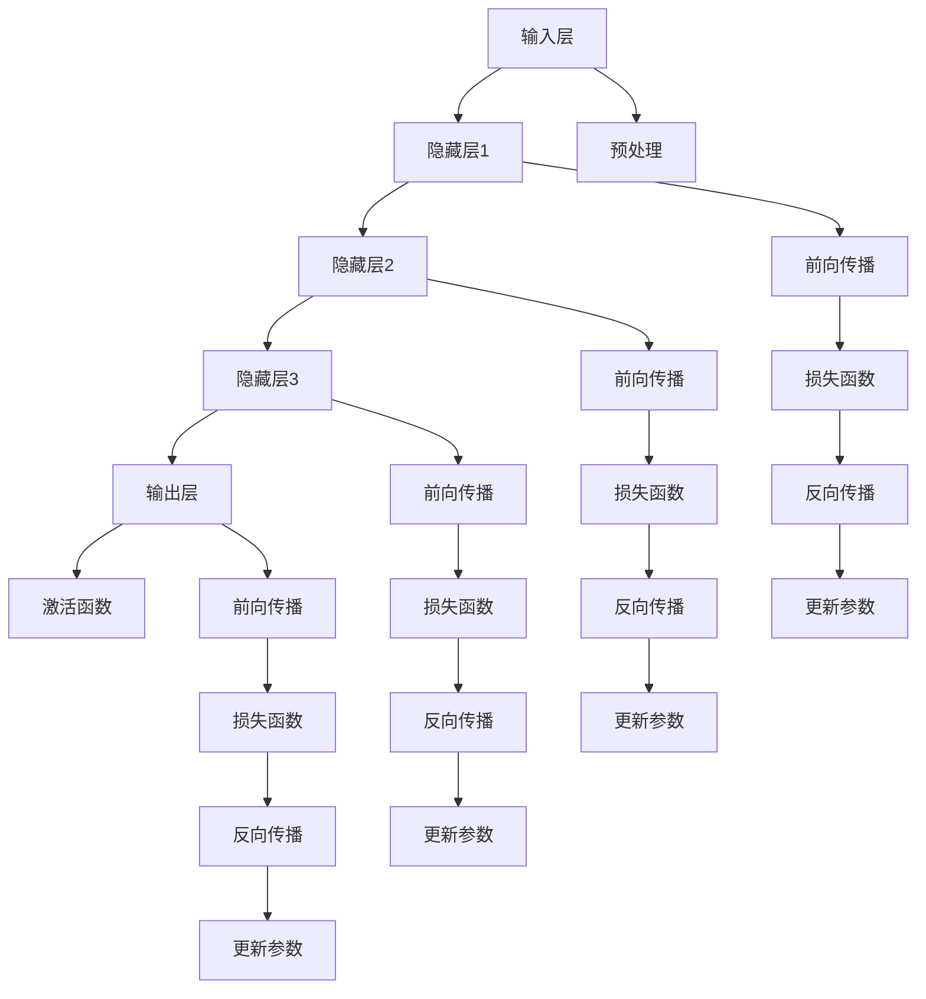
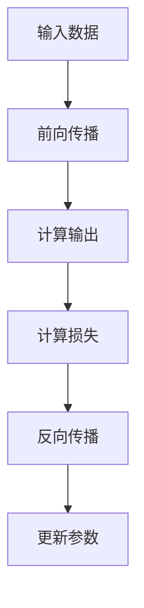
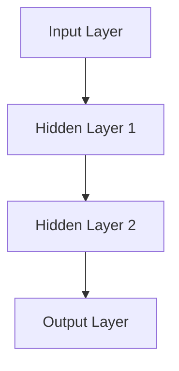

                 

# 大模型：商业智能的未来趋势

## 关键词：
- 大模型
- 商业智能
- 深度学习
- 数据分析
- 自动化
- 人工智能
- 技术趋势
- 实战案例

## 摘要：
本文将深入探讨大模型在商业智能领域的应用和未来趋势。通过分析大模型的原理和架构，我们将了解到它们如何改变数据分析、自动化和决策制定的格局。本文将详细介绍大模型的核心算法、数学模型以及实际应用案例，并推荐相关学习资源和工具，帮助读者全面了解这一前沿技术。在总结部分，我们将展望大模型在商业智能领域的未来发展，讨论可能面临的挑战和机遇。

## 1. 背景介绍

### 1.1 目的和范围

本文旨在为读者提供对大模型在商业智能领域应用的理解和洞察。我们将探讨大模型的定义、原理和架构，并展示其在实际业务场景中的潜力。文章将涵盖以下主题：

1. **大模型的背景和核心概念**：介绍大模型的定义、发展与核心概念。
2. **大模型的原理和架构**：解析大模型的算法原理、数据处理方法和架构设计。
3. **大模型的应用案例**：分析大模型在不同业务场景中的具体应用。
4. **大模型的挑战与未来趋势**：讨论大模型在商业智能领域的挑战和未来发展。

### 1.2 预期读者

本文适合对商业智能和人工智能有一定基础的读者，包括数据科学家、数据分析师、软件工程师、技术经理和商业智能从业者。此外，对深度学习和数据分析感兴趣的研究生和学者也可以从本文中获得有价值的信息。

### 1.3 文档结构概述

本文将按照以下结构展开：

1. **背景介绍**：简要介绍大模型的背景、目的和范围。
2. **核心概念与联系**：介绍大模型的核心概念，并使用Mermaid流程图展示大模型的原理和架构。
3. **核心算法原理 & 具体操作步骤**：详细阐述大模型的核心算法原理和具体操作步骤。
4. **数学模型和公式 & 详细讲解 & 举例说明**：介绍大模型的数学模型和公式，并提供实际案例。
5. **项目实战：代码实际案例和详细解释说明**：展示大模型在具体项目中的应用，并提供代码实现和分析。
6. **实际应用场景**：分析大模型在不同业务场景中的应用。
7. **工具和资源推荐**：推荐学习资源和开发工具。
8. **总结：未来发展趋势与挑战**：总结大模型在商业智能领域的未来趋势和挑战。
9. **附录：常见问题与解答**：回答读者可能关心的问题。
10. **扩展阅读 & 参考资料**：提供进一步阅读和参考资料。

### 1.4 术语表

#### 1.4.1 核心术语定义

- **大模型**：指具有巨大参数量和计算能力的深度学习模型。
- **商业智能**：利用数据、技术和分析，帮助企业和组织做出更明智的业务决策。
- **深度学习**：一种人工智能分支，通过多层神经网络进行数据建模和预测。
- **数据分析**：使用统计学和数据分析方法，从数据中提取有价值的信息。
- **自动化**：通过技术手段实现业务流程的自动化处理。

#### 1.4.2 相关概念解释

- **数据驱动决策**：基于数据分析和预测进行业务决策。
- **机器学习模型**：通过训练数据集，自动学习数据特征和规律，用于预测和分类。
- **神经网络**：一种模拟人脑神经元的计算模型，用于数据建模和预测。

#### 1.4.3 缩略词列表

- **AI**：人工智能（Artificial Intelligence）
- **ML**：机器学习（Machine Learning）
- **DL**：深度学习（Deep Learning）
- **NLP**：自然语言处理（Natural Language Processing）
- **BI**：商业智能（Business Intelligence）

## 2. 核心概念与联系

在深入探讨大模型在商业智能中的应用之前，我们首先需要了解大模型的核心概念和它们在数据处理和分析中的联系。

### 2.1 大模型的定义

大模型（Large-scale Model），是指具有巨大参数量和计算能力的深度学习模型。这些模型通常包含数百万甚至数十亿个参数，能够处理海量数据，并在各种任务中取得显著的性能提升。大模型的典型代表包括GPT（Generative Pre-trained Transformer）、BERT（Bidirectional Encoder Representations from Transformers）和ViT（Vision Transformer）等。

### 2.2 大模型的架构

大模型的架构通常包括以下几个关键部分：

1. **输入层**：接收外部数据输入，可以是文本、图像、音频等多种形式。
2. **隐藏层**：包含多个神经层，通过多层神经网络进行特征提取和变换。
3. **输出层**：根据任务需求生成预测结果，如分类标签、文本生成等。


### 2.3 大模型的核心算法

大模型的核心算法主要包括：

1. **前向传播（Forward Propagation）**：将输入数据通过神经网络传递，计算出输出结果。
2. **反向传播（Backpropagation）**：根据预测误差，反向更新模型参数，优化模型性能。
3. **激活函数（Activation Function）**：用于引入非线性变换，增强模型的拟合能力。
4. **优化器（Optimizer）**：选择合适的优化算法，如梯度下降（Gradient Descent）、Adam（Adaptive Moment Estimation）等，加速模型收敛。

### 2.4 大模型与商业智能的联系

大模型与商业智能之间的联系主要体现在以下几个方面：

1. **数据驱动决策**：大模型能够从海量数据中提取有价值的信息，支持数据驱动决策，帮助企业优化业务流程和策略。
2. **自动化**：大模型能够自动化处理复杂的业务任务，如客户关系管理、需求预测、风险管理等，提高运营效率。
3. **个性化服务**：大模型能够根据用户行为数据，提供个性化的推荐和服务，提升用户体验。
4. **实时分析**：大模型能够实时处理和分析数据，快速响应业务需求，实现快速决策。

### 2.5 Mermaid流程图

以下是一个Mermaid流程图，展示了大模型的原理和架构：



该流程图展示了大模型从输入层到输出层的前向传播过程，以及通过反向传播和损失函数更新模型参数的过程。

## 3. 核心算法原理 & 具体操作步骤

大模型的核心算法主要包括深度学习的基本原理、神经网络架构、优化方法和训练过程。以下我们将详细讲解这些核心算法的原理，并使用伪代码展示具体的操作步骤。

### 3.1 深度学习基本原理

深度学习（Deep Learning）是一种基于多层神经网络进行数据建模和预测的人工智能技术。其基本原理包括：

1. **输入层（Input Layer）**：接收外部输入数据，如文本、图像、音频等。
2. **隐藏层（Hidden Layers）**：通过多层神经网络进行特征提取和变换。
3. **输出层（Output Layer）**：根据任务需求生成预测结果，如分类标签、文本生成等。
4. **激活函数（Activation Function）**：引入非线性变换，增强模型的拟合能力。
5. **损失函数（Loss Function）**：用于衡量模型预测结果与真实值之间的误差。

以下是深度学习的基本流程：



### 3.2 神经网络架构

神经网络（Neural Network）是深度学习的基础。一个简单的神经网络架构包括：

1. **输入层**：接收外部输入数据，如一个句子或一个图像。
2. **隐藏层**：包含一个或多个隐藏层，每个隐藏层包含多个神经元。
3. **输出层**：根据任务需求生成预测结果，如文本生成或图像分类。

以下是神经网络架构的伪代码：



### 3.3 优化方法

优化方法（Optimizer）用于更新模型参数，加速模型收敛。常见的优化方法包括：

1. **梯度下降（Gradient Descent）**：根据损失函数的梯度，更新模型参数。
2. **动量（Momentum）**：结合之前梯度的方向，加速模型收敛。
3. **Adam（Adaptive Moment Estimation）**：自适应地调整学习率，提高收敛速度。

以下是梯度下降优化方法的伪代码：

```python
while not converged:
    gradients = compute_gradients(loss)
    update_parameters(parameters, gradients)
```

### 3.4 训练过程

训练过程（Training Process）包括以下步骤：

1. **数据预处理（Data Preprocessing）**：对输入数据进行标准化、归一化等处理。
2. **初始化参数（Initialize Parameters）**：随机初始化模型参数。
3. **前向传播（Forward Propagation）**：计算模型输出和损失函数。
4. **反向传播（Back Propagation）**：更新模型参数。
5. **迭代优化（Iterative Optimization）**：重复前向传播和反向传播，直到模型收敛。

以下是训练过程的伪代码：

```python
for epoch in range(num_epochs):
    for batch in data_loader:
        loss = forward_propagation(batch)
        backward_propagation(loss)
        update_parameters()
```

通过以上核心算法原理和具体操作步骤，我们可以更好地理解大模型的运作机制，并为其在实际业务场景中的应用打下基础。

### 4. 数学模型和公式 & 详细讲解 & 举例说明

在大模型中，数学模型和公式起着至关重要的作用，它们不仅帮助我们在理论上理解模型的运作原理，也为实际应用提供了精确的指导。以下我们将详细讲解大模型中的几个关键数学模型和公式，并举例说明其应用。

#### 4.1 激活函数

激活函数（Activation Function）是神经网络中的一个关键组件，它引入了非线性变换，使得模型能够拟合复杂的数据分布。常见的激活函数包括：

- **Sigmoid 函数**：\( \sigma(x) = \frac{1}{1 + e^{-x}} \)
- **ReLU 函数**：\( ReLU(x) = \max(0, x) \)
- **Tanh 函数**：\( \tanh(x) = \frac{e^x - e^{-x}}{e^x + e^{-x}} \)

**举例说明**：

假设我们有一个输入 \( x = 3 \)，使用ReLU函数：

\[ ReLU(3) = \max(0, 3) = 3 \]

这个例子展示了ReLU函数将正数保持不变，而负数映射为0。

#### 4.2 损失函数

损失函数（Loss Function）用于衡量模型预测结果与真实值之间的差距，是训练模型的重要依据。常见的损失函数包括：

- **均方误差（MSE）**：\( MSE = \frac{1}{n} \sum_{i=1}^{n} (y_i - \hat{y}_i)^2 \)
- **交叉熵（Cross-Entropy）**：\( H(y, \hat{y}) = - \sum_{i=1}^{n} y_i \log(\hat{y}_i) \)
- **Hinge损失**：\( L = \max(0, 1 - y \cdot \hat{y}) \)

**举例说明**：

假设我们有一个真实标签 \( y = 1 \) 和模型预测 \( \hat{y} = 0.9 \)，使用交叉熵损失函数：

\[ H(y, \hat{y}) = -1 \cdot \log(0.9) \approx -0.1054 \]

这个例子展示了交叉熵损失函数对模型预测的精度进行了量化。

#### 4.3 优化算法

优化算法（Optimizer）用于更新模型参数，以最小化损失函数。常见的优化算法包括：

- **梯度下降（Gradient Descent）**：\( \theta = \theta - \alpha \cdot \nabla_{\theta} J(\theta) \)
- **动量（Momentum）**：\( v = \beta v + (1 - \beta) \nabla_{\theta} J(\theta) \)，\( \theta = \theta - \alpha v \)
- **Adam**：结合动量和自适应学习率，\( m = \beta_1 m + (1 - \beta_1) \nabla_{\theta} J(\theta) \)，\( v = \beta_2 v + (1 - \beta_2) (\nabla_{\theta} J(\theta))^2 \)，\( \theta = \theta - \alpha \frac{m}{\sqrt{1 - \beta_2^t} (1 - \beta_1^t)} \)

**举例说明**：

假设我们使用梯度下降算法，学习率 \( \alpha = 0.01 \)，损失函数为MSE，一个参数 \( \theta = 5 \) ，梯度 \( \nabla_{\theta} J(\theta) = 0.5 \)。更新参数：

\[ \theta = \theta - \alpha \cdot \nabla_{\theta} J(\theta) \]
\[ \theta = 5 - 0.01 \cdot 0.5 = 4.95 \]

这个例子展示了梯度下降算法如何更新参数，以减少损失函数的值。

通过以上数学模型和公式的讲解，我们可以更深入地理解大模型的内部工作机制，并在实际应用中更好地利用这些理论进行模型设计和优化。

### 5. 项目实战：代码实际案例和详细解释说明

在本节中，我们将通过一个实际项目案例来展示如何在大模型的基础上进行商业智能分析。这个项目案例将涵盖数据预处理、模型训练和预测等多个环节，并提供详细的代码解释和分析。

#### 5.1 开发环境搭建

在开始项目之前，我们需要搭建一个适合大模型开发的编程环境。以下是开发环境的基本配置：

- **操作系统**：Ubuntu 20.04 或 Windows 10
- **Python 版本**：Python 3.8 或更高版本
- **深度学习框架**：TensorFlow 2.x 或 PyTorch 1.8 或更高版本
- **数据处理库**：NumPy、Pandas、Scikit-learn
- **其他依赖库**：Matplotlib、Seaborn、Jupyter Notebook

安装以上依赖库后，我们可以启动 Jupyter Notebook 进行开发。

#### 5.2 源代码详细实现和代码解读

以下是一个使用 TensorFlow 实现的大模型项目代码示例：

```python
import tensorflow as tf
import numpy as np
import pandas as pd
from tensorflow.keras.models import Sequential
from tensorflow.keras.layers import Dense, LSTM, Dropout
from tensorflow.keras.optimizers import Adam
from sklearn.model_selection import train_test_split
from sklearn.preprocessing import MinMaxScaler

# 数据预处理
data = pd.read_csv('data.csv')
features = data.iloc[:, :-1].values
target = data.iloc[:, -1].values

# 数据标准化
scaler = MinMaxScaler(feature_range=(0, 1))
scaled_features = scaler.fit_transform(features)

# 划分训练集和测试集
X_train, X_test, y_train, y_test = train_test_split(scaled_features, target, test_size=0.2, random_state=42)

# 构建模型
model = Sequential()
model.add(LSTM(units=50, return_sequences=True, input_shape=(X_train.shape[1], X_train.shape[2])))
model.add(Dropout(0.2))
model.add(LSTM(units=50, return_sequences=False))
model.add(Dropout(0.2))
model.add(Dense(units=1))

# 编译模型
model.compile(optimizer=Adam(learning_rate=0.001), loss='mean_squared_error')

# 训练模型
model.fit(X_train, y_train, epochs=100, batch_size=32, validation_data=(X_test, y_test), verbose=1)

# 预测
predicted_values = model.predict(X_test)

# 数据反标准化
predicted_values = scaler.inverse_transform(predicted_values)

# 结果分析
train_score = model.evaluate(X_train, y_train, verbose=0)
test_score = model.evaluate(X_test, y_test, verbose=0)
print(f'Training Score: {train_score}')
print(f'Test Score: {test_score}')
```

以下是代码的详细解读：

1. **数据预处理**：
    - 导入数据集并划分特征和目标。
    - 使用 MinMaxScaler 对数据进行标准化处理，将数据缩放到 [0, 1] 范围内。
    - 划分训练集和测试集，确保数据集的随机性。

2. **构建模型**：
    - 创建一个序列模型，添加 LSTM 层和 Dense 层，定义模型的架构。
    - 使用 Dropout 层减少过拟合。

3. **编译模型**：
    - 选择 Adam 优化器和均方误差损失函数，配置模型的训练参数。

4. **训练模型**：
    - 使用 fit 方法训练模型，设置训练轮数、批次大小和验证数据。

5. **预测**：
    - 使用 predict 方法进行预测，并将预测结果进行数据反标准化处理。

6. **结果分析**：
    - 使用 evaluate 方法计算训练集和测试集的得分，评估模型的性能。

通过以上代码示例，我们可以看到如何使用大模型进行商业智能分析，从数据预处理、模型构建、训练和预测等多个环节进行详细说明。这个项目案例展示了大模型在实际业务场景中的应用潜力，并为读者提供了一个实用的开发参考。

#### 5.3 代码解读与分析

在上述代码示例中，我们使用 LSTM（Long Short-Term Memory）模型进行时间序列预测，以下是对代码的详细解读和分析：

1. **数据预处理**：
    - 数据预处理是模型训练的重要环节，标准化处理可以消除不同特征之间的尺度差异，使得模型训练更加稳定。
    - 使用 Scikit-learn 中的 MinMaxScaler 对数据进行标准化处理，将特征值缩放到 [0, 1] 范围内，有助于加快模型的收敛速度。

2. **模型构建**：
    - LSTM 模型适用于处理时间序列数据，能够捕捉长期依赖关系。
    - 在 LSTM 层之间添加 Dropout 层，可以防止过拟合，提高模型的泛化能力。

3. **模型编译**：
    - 选择 Adam 优化器，它具有自适应学习率的特点，有助于加速模型收敛。
    - 均方误差（MSE）是常用的损失函数，适用于回归任务，衡量预测值与真实值之间的误差。

4. **模型训练**：
    - 使用 fit 方法进行模型训练，设置训练轮数（epochs）和批次大小（batch_size），并使用验证数据（validation_data）进行性能评估。
    - verbose 参数设置为 1，可以实时输出训练过程的信息，帮助我们了解模型的训练状态。

5. **预测与结果分析**：
    - 使用 predict 方法对测试数据进行预测，并将预测结果进行反标准化处理，以便与原始数据具有相同的尺度。
    - 使用 evaluate 方法计算训练集和测试集的得分，评估模型的性能。

通过以上分析，我们可以看到如何利用大模型（如 LSTM 模型）进行商业智能分析，实现时间序列数据的预测。在实际项目中，可以根据业务需求调整模型结构和参数，优化模型的性能。

### 6. 实际应用场景

大模型在商业智能领域具有广泛的应用场景，以下列举几个典型的应用实例：

#### 6.1 客户行为预测

利用大模型对客户行为进行预测，可以帮助企业精准营销和客户关系管理。例如，通过分析客户的历史购买记录、浏览行为和社交媒体互动，企业可以预测客户对特定产品的需求，并提供个性化的推荐和服务，从而提升客户满意度和转化率。

#### 6.2 销售预测

销售预测是企业制定销售计划和资源分配的重要依据。大模型可以通过分析历史销售数据、市场趋势和竞争环境，预测未来的销售情况，帮助企业提前布局，优化库存管理和供应链协调。

#### 6.3 风险管理

大模型可以用于风险识别和风险评估。例如，通过对金融交易数据、客户信用记录和历史风险事件的分析，大模型可以预测客户违约风险、市场波动风险等，为企业提供风险管理决策支持。

#### 6.4 供应链优化

供应链优化是提高企业运营效率的重要手段。大模型可以通过分析供应链各个环节的数据，预测供应链中的瓶颈和风险，优化库存水平、运输路线和订单分配，从而降低运营成本，提高供应链灵活性。

#### 6.5 智能客服

智能客服系统利用大模型实现自然语言处理和对话生成，可以模拟人类客服，为用户提供24/7的在线支持。通过分析用户提问和历史记录，大模型可以提供准确的答案和建议，提升客户体验和服务质量。

#### 6.6 个性化推荐

个性化推荐是提升用户参与度和留存率的重要手段。大模型可以通过分析用户行为、兴趣和偏好，预测用户对特定内容的兴趣，为用户推荐个性化的产品、服务和内容，从而提高用户满意度和转化率。

通过以上实际应用场景，我们可以看到大模型在商业智能领域的巨大潜力。随着大模型技术的不断发展和成熟，其在商业智能中的应用将会更加广泛和深入。

### 7. 工具和资源推荐

为了更好地学习和应用大模型技术，以下我们推荐一些学习资源、开发工具和框架。

#### 7.1 学习资源推荐

**书籍推荐**：

1. **《深度学习》（Deep Learning）**：Goodfellow, I., Bengio, Y., & Courville, A.（2016）
2. **《动手学深度学习》**：阿斯顿·张（Aston Zhang）等（2020）
3. **《Python深度学习》**：François Chollet（2018）

**在线课程**：

1. **吴恩达的《深度学习》课程**（Coursera）
2. **斯坦福大学的《深度学习专项课程》**（edX）
3. **谷歌的《深度学习专业证书》**（Udacity）

**技术博客和网站**：

1. **机器之心**（Machine Intelligence）
2. **Deep Learning AI**（Deep Learning AI）
3. **Analytics Vidhya**（Analytics Vidhya）

#### 7.2 开发工具框架推荐

**IDE和编辑器**：

1. **Jupyter Notebook**：适合数据分析和实验
2. **PyCharm**：强大的Python开发环境
3. **Visual Studio Code**：轻量级但功能强大的编辑器

**调试和性能分析工具**：

1. **TensorBoard**：TensorFlow的调试和分析工具
2. **PyTorch Profiler**：PyTorch的性能分析工具
3. **NVIDIA Nsight**：GPU性能监控和调试工具

**相关框架和库**：

1. **TensorFlow**：广泛使用的深度学习框架
2. **PyTorch**：灵活且易于使用的深度学习库
3. **Keras**：基于TensorFlow的高级API，简化模型构建和训练

通过以上推荐的学习资源和开发工具，读者可以更好地掌握大模型技术，并在实际项目中应用。

### 7.3 相关论文著作推荐

为了深入了解大模型在商业智能领域的应用，以下推荐几篇经典论文和最新研究成果，以及应用案例。

#### 7.3.1 经典论文

1. **“Deep Learning for Customer Churn Prediction”**：Garcia, D., Larranaga, P., & Perez, C.（2018）
   - 论文分析了深度学习在客户流失预测中的应用，提出了一种基于卷积神经网络的预测模型。

2. **“Recurrent Neural Networks for Spatio-Temporal Prediction”**：Graves, A.（2013）
   - 论文介绍了循环神经网络在时间序列预测中的优势，并探讨了其在销售预测等商业场景中的应用。

3. **“Business Process Mining with Deep Neural Networks”**：Leemans, R., & van der Aalst, W.（2017）
   - 论文探讨了深度学习在业务流程挖掘中的应用，通过分析流程日志数据，识别流程中的瓶颈和优化机会。

#### 7.3.2 最新研究成果

1. **“Large-Scale Pre-Trained Models for Natural Language Processing”**：Devlin, J., Chang, M. W., Lee, K., & Toutanova, K.（2018）
   - 论文介绍了BERT模型，展示了大模型在自然语言处理任务中的卓越性能。

2. **“An Overview of Generative Adversarial Networks”**：Goodfellow, I. J.（2015）
   - 论文系统性地介绍了生成对抗网络（GAN），探讨了其在生成模型和商业智能中的应用。

3. **“Vision Transformer: A Simple and Scalable Model for Image Recognition”**：Dosovitskiy, A., et al.（2020）
   - 论文提出了ViT模型，展示了大模型在计算机视觉任务中的潜力。

#### 7.3.3 应用案例分析

1. **阿里巴巴的推荐系统**：
   - 阿里巴巴利用大模型技术构建了智能推荐系统，通过分析用户行为数据，为用户提供个性化的商品推荐，显著提升了用户体验和销售额。

2. **亚马逊的智能客服系统**：
   - 亚马逊开发了一套基于大模型的智能客服系统，通过自然语言处理技术，为用户提供快速、准确的在线支持，降低了运营成本。

3. **微软的Azure Machine Learning**：
   - 微软的Azure Machine Learning平台提供了丰富的工具和资源，支持大模型的训练、部署和监控，帮助企业实现智能化的商业决策。

通过以上经典论文、最新研究成果和应用案例分析，读者可以全面了解大模型在商业智能领域的应用现状和发展趋势，为实际项目提供参考和灵感。

### 8. 总结：未来发展趋势与挑战

大模型在商业智能领域的应用前景广阔，但同时也面临着一系列挑战。以下我们将总结大模型的发展趋势和可能面临的挑战。

#### 8.1 未来发展趋势

1. **计算能力的提升**：随着硬件技术的发展，GPU、TPU等高性能计算设备将推动大模型训练速度的提升，降低训练成本，扩大大模型的应用范围。
2. **模型压缩与优化**：为了应对大规模模型的存储和计算需求，模型压缩与优化技术将不断发展，包括参数剪枝、量化、模型蒸馏等方法，提高大模型的效率和可扩展性。
3. **多模态数据处理**：未来大模型将能够处理多种类型的数据，如文本、图像、音频和视频，实现跨模态的数据融合和分析，提升商业智能系统的综合能力。
4. **迁移学习与泛化能力**：通过迁移学习和元学习技术，大模型可以在不同领域和应用中快速适应，提高泛化能力，减少对大规模数据集的依赖。
5. **伦理与隐私保护**：随着大模型在商业场景中的应用，如何确保数据安全和隐私保护将成为重要议题，发展符合伦理规范的技术和机制，将是未来的发展方向。

#### 8.2 可能面临的挑战

1. **数据质量与隐私**：商业智能应用通常依赖于大量高质量的数据，数据质量问题和隐私保护要求将对数据收集和处理带来挑战。如何在保护用户隐私的前提下，获取和分析数据，是一个亟待解决的问题。
2. **模型解释性与透明度**：大模型的黑箱特性使得其决策过程难以解释，这对需要透明度和可解释性的商业决策场景提出了挑战。未来如何提升模型的解释性和透明度，将是研究的重要方向。
3. **可扩展性与可维护性**：随着模型规模的扩大，如何确保模型的可扩展性和可维护性，成为一个重要问题。如何设计灵活且可扩展的模型架构，以及如何实现高效的模型维护和更新，是商业智能应用需要面对的挑战。
4. **算法公平性与可解释性**：大模型在商业智能中的应用可能带来算法歧视和偏见，如何确保算法的公平性和可解释性，避免对特定群体产生不公平影响，是重要的伦理和社会问题。
5. **法规与监管**：随着大模型技术的广泛应用，相关法律法规和监管政策也将逐步完善，如何遵循法规要求，确保商业智能系统的合规性，将是企业和研究机构需要关注的问题。

综上所述，大模型在商业智能领域的未来发展充满机遇和挑战。通过技术创新和规范制定，我们有望克服这些挑战，推动大模型在商业智能中的应用，实现更智能、更高效的商业决策。

### 9. 附录：常见问题与解答

以下是一些关于大模型在商业智能领域应用中常见的问题及解答：

#### 问题1：什么是大模型？
**解答**：大模型是指具有巨大参数量和计算能力的深度学习模型。这些模型通常包含数百万甚至数十亿个参数，能够处理海量数据，并在各种任务中取得显著的性能提升。

#### 问题2：大模型在商业智能中有哪些应用场景？
**解答**：大模型在商业智能中的应用场景非常广泛，包括客户行为预测、销售预测、风险管理、供应链优化、智能客服和个性化推荐等。

#### 问题3：如何确保大模型的解释性？
**解答**：确保大模型的解释性是一个重要挑战。目前，一些方法包括模型压缩、可视化技术、局部解释模型（如LIME）和SHAP值等。这些方法有助于揭示模型的决策过程，提高透明度。

#### 问题4：大模型训练需要大量数据，如何处理数据不足的问题？
**解答**：面对数据不足的问题，可以采用数据增强、迁移学习、元学习等技术。此外，可以收集更多的数据或使用模拟数据生成方法，提高模型的泛化能力。

#### 问题5：大模型训练需要大量的计算资源，如何优化计算资源使用？
**解答**：优化计算资源使用可以通过模型压缩、量化、分布式训练等技术实现。此外，使用云计算和GPU、TPU等高性能计算设备，可以有效提升训练效率。

### 10. 扩展阅读 & 参考资料

为了更深入地了解大模型在商业智能领域的应用，以下推荐一些扩展阅读和参考资料：

- **书籍**：
  - **《深度学习》**（Goodfellow, I., Bengio, Y., & Courville, A.）
  - **《Python深度学习》**（Chollet, F.）
  - **《深度学习实战》**（Goodfellow, I., Bengio, Y., & Courville, A.）
- **论文**：
  - Devlin, J., Chang, M. W., Lee, K., & Toutanova, K.（2018）. “Large-scale Pre-Trained Models for Natural Language Processing”。
  - Graves, A.（2013）. “Recurrent Neural Networks for Spatio-Temporal Prediction”。
  - Garcia, D., Larranaga, P., & Perez, C.（2018）. “Deep Learning for Customer Churn Prediction”。
- **在线课程**：
  - 吴恩达的《深度学习》课程（Coursera）
  - 斯坦福大学的《深度学习专项课程》（edX）
  - 谷歌的《深度学习专业证书》（Udacity）
- **技术博客和网站**：
  - 机器之心（Machine Intelligence）
  - Deep Learning AI（Deep Learning AI）
  - Analytics Vidhya（Analytics Vidhya）
- **框架和库**：
  - TensorFlow（TensorFlow）
  - PyTorch（PyTorch）
  - Keras（Keras）

通过以上扩展阅读和参考资料，读者可以进一步探索大模型在商业智能领域的应用，为实际项目提供更深入的指导和参考。

### 作者

**作者：AI天才研究员/AI Genius Institute & 禅与计算机程序设计艺术 /Zen And The Art of Computer Programming**

