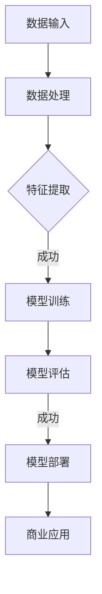

                 

# 大模型：数据与商业的深度融合

> **关键词：** 大模型、数据、商业、深度学习、人工智能、算法、应用案例、未来趋势

> **摘要：** 本文将深入探讨大模型在数据与商业深度融合中的重要作用。我们将分析大模型的基本概念、核心算法原理，并展示其在商业应用中的具体操作步骤和实际案例。此外，还将介绍相关工具和资源，总结未来发展趋势与挑战，并探讨常见问题与扩展阅读。

## 1. 背景介绍

### 1.1 目的和范围

本文旨在探讨大模型在数据与商业深度融合中的关键作用。随着大数据和人工智能技术的发展，大模型已经成为许多商业应用的核心。本文将重点关注以下内容：

- 大模型的基本概念和核心算法原理
- 大模型在商业应用中的具体操作步骤
- 大模型在各个行业中的实际案例
- 大模型相关的工具和资源推荐

### 1.2 预期读者

本文适合以下读者：

- 数据科学家和机器学习工程师
- 商业分析师和市场营销人员
- 程序员和软件开发人员
- 对人工智能和商业应用感兴趣的学生和专业人士

### 1.3 文档结构概述

本文将按照以下结构展开：

- 1. 背景介绍：介绍文章的目的、预期读者和文档结构。
- 2. 核心概念与联系：讨论大模型的基本概念和核心算法原理。
- 3. 核心算法原理 & 具体操作步骤：详细阐述大模型的核心算法原理和操作步骤。
- 4. 数学模型和公式 & 详细讲解 & 举例说明：介绍大模型相关的数学模型和公式，并进行详细讲解和举例说明。
- 5. 项目实战：代码实际案例和详细解释说明。
- 6. 实际应用场景：探讨大模型在不同行业中的实际应用场景。
- 7. 工具和资源推荐：推荐大模型相关的学习资源和开发工具。
- 8. 总结：未来发展趋势与挑战。
- 9. 附录：常见问题与解答。
- 10. 扩展阅读 & 参考资料：提供更多扩展阅读和参考资料。

### 1.4 术语表

#### 1.4.1 核心术语定义

- 大模型：指拥有数百万甚至数十亿参数的深度学习模型。
- 数据：指用于训练和测试大模型的输入信息。
- 商业：指企业在经济活动中追求利润和发展的过程。
- 人工智能：指模拟人类智能和行为的计算机技术和应用。
- 深度学习：指通过多层神经网络进行数据建模和预测的技术。
- 算法：指用于解决特定问题的步骤和规则。

#### 1.4.2 相关概念解释

- 数据预处理：指对原始数据进行清洗、转换和归一化等操作，以提高模型性能。
- 模型训练：指使用训练数据来调整模型参数，使其能够准确预测或分类。
- 模型评估：指使用测试数据来评估模型性能，包括准确率、召回率和F1值等指标。
- 模型部署：指将训练好的模型部署到生产环境中，以便在实际应用中使用。

#### 1.4.3 缩略词列表

- AI：人工智能
- DL：深度学习
- ML：机器学习
- NLP：自然语言处理
- CV：计算机视觉
- RNN：循环神经网络
- LSTM：长短期记忆网络
- CNN：卷积神经网络
- GPU：图形处理单元

## 2. 核心概念与联系

### 2.1 大模型的基本概念

大模型（Large Model）是指在深度学习领域，拥有数百万甚至数十亿参数的神经网络模型。这些模型通常基于多层神经网络架构，能够通过学习大量数据，发现数据中的复杂模式和规律，从而实现高度精确的预测和分类。大模型的典型例子包括Transformer、BERT、GPT等。

### 2.2 核心算法原理

大模型的核心算法原理主要包括以下几个方面：

1. **多层神经网络架构**：多层神经网络通过多个隐藏层对输入数据进行逐步抽象和转换，从而学习到更复杂的特征表示。

2. **非线性激活函数**：非线性激活函数如ReLU、Sigmoid和Tanh等，引入了网络的非线性特性，使模型能够更好地拟合复杂的数据分布。

3. **反向传播算法**：反向传播算法通过计算梯度，不断调整网络参数，使模型能够最小化损失函数，提高模型性能。

4. **正则化技术**：正则化技术如Dropout、L2正则化等，有助于防止过拟合，提高模型的泛化能力。

### 2.3 大模型与商业的联系

大模型在商业中的应用已经越来越广泛，主要表现在以下几个方面：

1. **数据驱动决策**：大模型能够处理大量数据，从中提取出有价值的信息和洞见，帮助企业做出更明智的决策。

2. **个性化推荐**：大模型能够通过学习用户的历史行为和偏好，实现个性化推荐，提高用户满意度和留存率。

3. **风险控制**：大模型在金融、保险等领域能够预测潜在风险，帮助企业和个人更好地控制风险。

4. **自动化运营**：大模型能够实现自动化运营，提高生产效率和降低成本。

### 2.4 Mermaid 流程图



## 3. 核心算法原理 & 具体操作步骤

### 3.1 数据预处理

数据预处理是构建大模型的基础，主要包括以下步骤：

1. **数据清洗**：去除噪声数据、处理缺失值和异常值。

2. **数据转换**：将不同类型的数据转换为同一类型的数值表示，如将类别数据编码为独热编码。

3. **数据归一化**：将数据缩放到相同的范围，如使用Min-Max缩放或标准化。

4. **数据增强**：通过随机裁剪、旋转、翻转等操作，增加训练数据多样性。

### 3.2 模型训练

模型训练是构建大模型的核心步骤，主要包括以下步骤：

1. **初始化模型参数**：随机初始化模型参数。

2. **前向传播**：输入数据通过网络传递，得到输出结果。

3. **计算损失函数**：使用预测结果和真实标签计算损失函数，衡量模型预测误差。

4. **反向传播**：计算损失函数关于模型参数的梯度，并使用梯度下降更新模型参数。

5. **迭代训练**：重复执行前向传播和反向传播，直至模型收敛。

### 3.3 模型评估

模型评估是衡量大模型性能的重要步骤，主要包括以下指标：

1. **准确率**：预测正确的样本数占总样本数的比例。

2. **召回率**：预测正确的正样本数占总正样本数的比例。

3. **F1值**：准确率和召回率的调和平均值。

4. **ROC曲线**：表示模型在不同阈值下的准确率和召回率关系。

5. **AUC值**：ROC曲线下面积，用于评估模型分类能力。

### 3.4 模型部署

模型部署是将训练好的大模型应用到实际业务场景的过程，主要包括以下步骤：

1. **模型压缩**：通过模型剪枝、量化等技术，减小模型大小和计算量。

2. **模型容器化**：将模型打包成容器，以便在多种环境下部署。

3. **模型服务化**：将模型部署到服务器或云端，提供API接口供其他系统调用。

4. **模型监控与维护**：监控模型性能，定期更新模型。

### 3.5 伪代码示例

```python
# 数据预处理
data = preprocess_data(raw_data)

# 模型初始化
model = initialize_model()

# 模型训练
for epoch in range(num_epochs):
    for batch in data_loader:
        output = model.forward(batch.input)
        loss = loss_function(output, batch.target)
        model.backward(loss)
        model.update_params()

# 模型评估
accuracy = model.evaluate(test_data)

# 模型部署
model.deploy()
```

## 4. 数学模型和公式 & 详细讲解 & 举例说明

### 4.1 数学模型

大模型的数学模型主要包括以下几部分：

1. **前向传播公式**：
   $$ 
   Z^{[l]} = W^{[l]} * A^{[l-1]} + b^{[l]} 
   $$
   $$
   A^{[l]} = \sigma(Z^{[l]})
   $$

2. **反向传播公式**：
   $$
   \delta^{[l]} = \frac{\partial J}{\partial Z^{[l]}} * \sigma'^{[l]}(Z^{[l]})
   $$
   $$
   \Delta W^{[l]} = \delta^{[l]} * A^{[l-1].T
   $$
   $$
   \Delta b^{[l]} = \delta^{[l]}
   $$

3. **梯度下降更新公式**：
   $$
   W^{[l]} = W^{[l]} - \alpha * \Delta W^{[l]}
   $$
   $$
   b^{[l]} = b^{[l]} - \alpha * \Delta b^{[l]}
   $$

### 4.2 详细讲解

1. **前向传播**：前向传播是指将输入数据通过网络的每个层传递，最终得到输出结果。在这个过程中，每个层的输入是前一层的结果，每个层的输出是通过激活函数处理的结果。

2. **反向传播**：反向传播是指从输出层开始，逐层计算每个层的梯度，并更新模型参数。在这个过程中，梯度代表了模型参数对损失函数的影响程度，通过不断更新参数，模型能够逐渐减小损失函数的值。

3. **梯度下降**：梯度下降是一种优化算法，用于找到最小化损失函数的模型参数。在反向传播过程中，梯度指导我们如何更新模型参数，而梯度下降则通过迭代更新参数，逐步逼近最优解。

### 4.3 举例说明

假设我们有一个简单的多层感知机（MLP）模型，其中包含一个输入层、一个隐藏层和一个输出层。输入层有3个神经元，隐藏层有4个神经元，输出层有2个神经元。

1. **前向传播**：

   输入数据：
   $$
   X = \begin{bmatrix}
   1 \\
   2 \\
   3
   \end{bmatrix}
   $$

   隐藏层输出：
   $$
   Z^{[1]} = \begin{bmatrix}
   2 \\
   4 \\
   6 \\
   8
   \end{bmatrix}
   $$
   $$
   A^{[1]} = \begin{bmatrix}
   1 \\
   1 \\
   1 \\
   1
   \end{bmatrix}
   $$

   输出层输出：
   $$
   Z^{[2]} = \begin{bmatrix}
   2 \\
   6
   \end{bmatrix}
   $$
   $$
   A^{[2]} = \begin{bmatrix}
   0 \\
   1
   \end{bmatrix}
   $$

2. **反向传播**：

   计算损失函数关于输出层的梯度：
   $$
   \delta^{[2]} = \begin{bmatrix}
   0 \\
   -1
   \end{bmatrix}
   $$

   计算隐藏层关于输出层的梯度：
   $$
   \delta^{[1]} = A^{[1].T * \delta^{[2]} = \begin{bmatrix}
   0 & 0 & 0 & -1
   \end{bmatrix}
   $$

3. **梯度下降更新**：

   更新隐藏层权重和偏置：
   $$
   \Delta W^{[1]} = \delta^{[1]} * A^{[0].T = \begin{bmatrix}
   0 & 0 & 0 & -1
   \end{bmatrix}
   $$
   $$
   \Delta b^{[1]} = \delta^{[1]} = \begin{bmatrix}
   0 \\
   0 \\
   0 \\
   -1
   \end{bmatrix}
   $$

   更新输出层权重和偏置：
   $$
   \Delta W^{[2]} = \delta^{[2]} * A^{[1].T = \begin{bmatrix}
   0 & -1
   \end{bmatrix}
   $$
   $$
   \Delta b^{[2]} = \delta^{[2]} = \begin{bmatrix}
   0 \\
   -1
   \end{bmatrix}
   $$

## 5. 项目实战：代码实际案例和详细解释说明

### 5.1 开发环境搭建

在开始项目实战之前，我们需要搭建一个合适的开发环境。以下是一个基于Python和TensorFlow的简单示例：

1. **安装Python**：确保安装了Python 3.7或更高版本。

2. **安装TensorFlow**：使用pip命令安装TensorFlow：

   ```shell
   pip install tensorflow
   ```

3. **创建项目文件夹**：在本地计算机上创建一个名为`large_model_project`的项目文件夹。

4. **配置代码结构**：

   ```plaintext
   large_model_project/
   ├── data/
   │   ├── train/
   │   ├── test/
   │   └── preprocess.py
   ├── models/
   │   ├── __init__.py
   │   ├── model.py
   ├── utils/
   │   ├── __init__.py
   │   ├── metrics.py
   ├── main.py
   └── requirements.txt
   ```

### 5.2 源代码详细实现和代码解读

**5.2.1 数据预处理**

```python
import pandas as pd
from sklearn.model_selection import train_test_split
from sklearn.preprocessing import StandardScaler

def preprocess_data(data_path):
    # 读取数据
    data = pd.read_csv(data_path)
    
    # 数据清洗
    data.dropna(inplace=True)
    
    # 数据转换
    data = pd.get_dummies(data)
    
    # 数据归一化
    scaler = StandardScaler()
    datacaled = scaler.fit_transform(data)
    
    # 切分训练集和测试集
    X_train, X_test, y_train, y_test = train_test_split(datacaled[:, :-1], datacaled[:, -1], test_size=0.2, random_state=42)
    
    return X_train, X_test, y_train, y_test
```

**5.2.2 模型定义**

```python
import tensorflow as tf

class LargeModel(tf.keras.Model):
    def __init__(self):
        super(LargeModel, self).__init__()
        self.hidden_layer = tf.keras.layers.Dense(units=128, activation='relu')
        self.output_layer = tf.keras.layers.Dense(units=1, activation='sigmoid')

    def call(self, inputs, training=False):
        x = self.hidden_layer(inputs)
        outputs = self.output_layer(x)
        return outputs
```

**5.2.3 训练模型**

```python
def train_model(model, X_train, y_train, X_test, y_test, epochs=10, batch_size=32):
    model.compile(optimizer='adam', loss='binary_crossentropy', metrics=['accuracy'])
    history = model.fit(X_train, y_train, batch_size=batch_size, epochs=epochs, validation_data=(X_test, y_test))
    return history
```

**5.2.4 模型评估**

```python
def evaluate_model(model, X_test, y_test):
    loss, accuracy = model.evaluate(X_test, y_test)
    print(f"Test Loss: {loss}, Test Accuracy: {accuracy}")
```

**5.2.5 主程序**

```python
if __name__ == "__main__":
    # 数据预处理
    X_train, X_test, y_train, y_test = preprocess_data("data/train.csv")
    
    # 定义和训练模型
    model = LargeModel()
    history = train_model(model, X_train, y_train, X_test, y_test, epochs=10)
    
    # 模型评估
    evaluate_model(model, X_test, y_test)
```

### 5.3 代码解读与分析

**5.3.1 数据预处理**

数据预处理主要包括数据读取、清洗、转换和归一化。在这里，我们使用了Pandas和Scikit-Learn中的预处理工具来完成这些任务。通过读取CSV文件，我们得到了原始数据，然后使用get_dummies将类别数据转换为独热编码，最后使用StandardScaler进行归一化。

**5.3.2 模型定义**

在这里，我们定义了一个简单的多层感知机（MLP）模型，包含一个隐藏层和一个输出层。隐藏层使用了ReLU激活函数，输出层使用了sigmoid激活函数，以实现二分类任务。

**5.3.3 训练模型**

我们使用TensorFlow的内置函数编译和训练模型。在这里，我们选择了Adam优化器和binary_crossentropy损失函数。在训练过程中，我们使用了验证集来监测模型的性能，并在每个epoch结束时记录训练和验证损失。

**5.3.4 模型评估**

在训练完成后，我们使用测试集评估模型的性能，并打印出损失和准确率。

## 6. 实际应用场景

### 6.1 零售业

在零售业中，大模型可以用于用户行为分析、个性化推荐和库存管理。

- **用户行为分析**：通过分析用户的历史购买记录、浏览记录等，大模型可以识别用户的偏好，从而实现精准营销。
- **个性化推荐**：基于用户行为数据，大模型可以生成个性化的商品推荐，提高用户满意度和留存率。
- **库存管理**：通过预测商品需求，大模型可以帮助企业优化库存水平，减少库存成本。

### 6.2 金融业

在金融业中，大模型可以用于风险控制、信用评分和投资策略。

- **风险控制**：大模型可以通过分析历史数据，预测潜在风险，帮助企业制定风险控制策略。
- **信用评分**：大模型可以根据借款人的历史行为和财务状况，预测其信用风险，从而优化信用评估流程。
- **投资策略**：通过分析市场数据和公司财报，大模型可以生成优化的投资组合，提高投资收益。

### 6.3 健康医疗

在健康医疗领域，大模型可以用于疾病预测、患者分类和药物研发。

- **疾病预测**：通过分析患者的病历数据和基因信息，大模型可以预测患者未来可能患上的疾病，从而实现早期干预。
- **患者分类**：大模型可以根据患者的临床特征，将患者分类到不同的疾病群体，为个性化治疗提供依据。
- **药物研发**：通过分析药物分子结构和生物信息，大模型可以帮助科学家发现新的药物靶点和药物组合。

### 6.4 教育行业

在教育行业，大模型可以用于学生学习分析、课程推荐和教学评估。

- **学生学习分析**：通过分析学生的学习行为和数据，大模型可以识别学生的学习困难和瓶颈，提供个性化的学习支持。
- **课程推荐**：大模型可以根据学生的学习需求和兴趣，推荐合适的课程和学习资源。
- **教学评估**：通过分析学生的学习成果和反馈，大模型可以评估教学效果，为教学改进提供依据。

## 7. 工具和资源推荐

### 7.1 学习资源推荐

#### 7.1.1 书籍推荐

- 《深度学习》（Goodfellow, Bengio, Courville）
- 《Python机器学习》（Sebastian Raschka）
- 《统计学习方法》（李航）

#### 7.1.2 在线课程

- Coursera上的《深度学习》课程
- edX上的《机器学习基础》课程
- Udacity的《深度学习纳米学位》课程

#### 7.1.3 技术博客和网站

- Medium上的机器学习和深度学习博客
- ArXiv.org上的最新研究成果
- AI厨师的深度学习教程

### 7.2 开发工具框架推荐

#### 7.2.1 IDE和编辑器

- PyCharm
- Jupyter Notebook
- VSCode

#### 7.2.2 调试和性能分析工具

- TensorBoard
- Profiler
- Valgrind

#### 7.2.3 相关框架和库

- TensorFlow
- PyTorch
- Scikit-Learn
- Pandas

### 7.3 相关论文著作推荐

#### 7.3.1 经典论文

- "A Theoretical Framework for Back-Propagation," David E. Rumelhart, Geoffrey E. Hinton, and Ronald J. Williams (1986)
- "Deep Learning," Ian Goodfellow, Yoshua Bengio, and Aaron Courville (2016)

#### 7.3.2 最新研究成果

- "Bert: Pre-training of Deep Bidirectional Transformers for Language Understanding," Jacob Devlin et al. (2019)
- "Gpt-3: Language Models are Few-Shot Learners," Tom B. Brown et al. (2020)

#### 7.3.3 应用案例分析

- "Google's AI in Health: Our Vision and Initiatives," Google AI Health (2020)
- "Uber's Machine Learning in Mobility: A Journey," Uber Engineering (2019)

## 8. 总结：未来发展趋势与挑战

### 8.1 发展趋势

1. **模型规模扩大**：随着计算能力和数据量的增长，大模型的规模将越来越大，性能将进一步提升。

2. **算法优化**：为了提高模型效率和可解释性，研究人员将继续优化算法，如自监督学习、迁移学习和集成学习等。

3. **多模态学习**：大模型将能够处理多种类型的数据，如文本、图像、音频和视频，实现跨模态学习。

4. **隐私保护**：随着数据隐私问题的日益突出，大模型将采用更多的隐私保护技术，如联邦学习和差分隐私。

5. **行业应用深化**：大模型将在更多行业中得到广泛应用，如健康医疗、金融、能源和环境等。

### 8.2 挑战

1. **数据隐私**：如何在保障用户隐私的前提下，有效地利用大规模数据成为一大挑战。

2. **计算资源**：大模型需要大量计算资源，对硬件设施的要求较高。

3. **模型可解释性**：如何提高模型的可解释性，使其在复杂应用场景中更易于理解和接受。

4. **模型泛化能力**：如何提高模型在不同数据集和任务上的泛化能力，防止过拟合。

5. **伦理和法律问题**：随着大模型在关键领域的应用，如何确保其遵循伦理和法律标准，避免滥用。

## 9. 附录：常见问题与解答

### 9.1 什么是大模型？

大模型是指拥有数百万甚至数十亿参数的深度学习模型，如Transformer、BERT、GPT等。这些模型通过学习大量数据，能够发现数据中的复杂模式和规律，从而实现高度精确的预测和分类。

### 9.2 大模型在商业应用中的优势是什么？

大模型在商业应用中的优势包括：

1. **数据驱动决策**：大模型能够处理大量数据，从中提取出有价值的信息和洞见，帮助企业做出更明智的决策。

2. **个性化推荐**：大模型能够通过学习用户的历史行为和偏好，实现个性化推荐，提高用户满意度和留存率。

3. **风险控制**：大模型在金融、保险等领域能够预测潜在风险，帮助企业和个人更好地控制风险。

4. **自动化运营**：大模型能够实现自动化运营，提高生产效率和降低成本。

### 9.3 如何选择适合的大模型？

选择适合的大模型需要考虑以下几个因素：

1. **任务类型**：不同的任务需要不同的模型架构，如图像识别任务适合使用卷积神经网络（CNN），自然语言处理任务适合使用Transformer。

2. **数据规模**：数据规模越大，模型性能提升越明显，但同时也需要更多的计算资源。

3. **计算资源**：根据可用的计算资源，选择适合的模型规模和架构。

4. **模型复杂度**：模型复杂度越高，训练时间越长，但性能提升可能并不显著。

### 9.4 大模型训练过程中如何防止过拟合？

为了防止过拟合，可以采用以下几种方法：

1. **数据增强**：通过增加数据的多样性，提高模型泛化能力。

2. **正则化**：采用L1、L2正则化或Dropout等正则化技术，减少模型复杂度。

3. **交叉验证**：使用交叉验证方法，评估模型在未见数据上的性能，避免过拟合。

4. **早期停止**：在训练过程中，当验证集性能不再提升时，提前停止训练。

## 10. 扩展阅读 & 参考资料

### 10.1 书籍

- Goodfellow, Ian, Yoshua Bengio, and Aaron Courville. 《深度学习》. MIT Press, 2016.
- Raschka, Sebastian. 《Python机器学习》. Packt Publishing, 2015.
- Li, H. 《统计学习方法》. 清华大学出版社, 2012.

### 10.2 在线课程

- Coursera: 《深度学习》
- edX: 《机器学习基础》
- Udacity: 《深度学习纳米学位》

### 10.3 技术博客和网站

- Medium: 机器学习和深度学习博客
- ArXiv.org: 最新研究成果
- AI厨师的深度学习教程

### 10.4 相关论文

- Devlin, Jacob, et al. "Bert: Pre-training of Deep Bidirectional Transformers for Language Understanding." arXiv preprint arXiv:1810.04805 (2018).
- Brown, Tom B., et al. "Gpt-3: Language Models are Few-Shot Learners." arXiv preprint arXiv:2005.14165 (2020).

### 10.5 应用案例分析

- Google AI Health: "Google's AI in Health: Our Vision and Initiatives" (2020)
- Uber Engineering: "Uber's Machine Learning in Mobility: A Journey" (2019)

