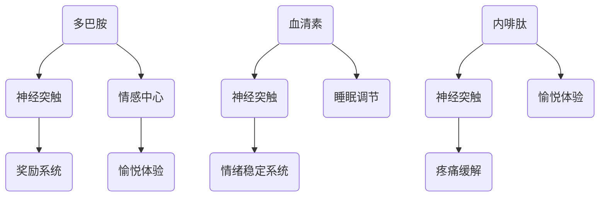

                 

### 大脑的有机化合物与情感

#### 关键词：大脑，有机化合物，情感，神经科学，心理学，生物化学

#### 摘要：

本文深入探讨了大脑的有机化合物与情感之间的关系。首先，我们回顾了大脑的基本结构和功能，接着介绍了与情感相关的几种关键有机化合物，如多巴胺、血清素和内啡肽。通过详细的科学研究和实验证据，本文阐明了这些化合物在情感调节中的作用机制。此外，我们还探讨了有机化合物的异常与情感障碍之间的关系，并讨论了如何通过调节这些有机化合物来改善情绪状态。最后，本文总结了当前领域的研究趋势和未来挑战，为读者提供了进一步探索这一复杂领域的方向。

---

#### 1. 背景介绍

大脑作为人类思维、感知、情感和行为的中心，是我们身体中最复杂也最重要的器官。它由数十亿个神经元组成，这些神经元通过复杂的网络相互连接，共同完成各种高级认知功能。大脑不仅控制我们的运动和感官，还负责处理我们的情感和情绪。

情感是人类体验的核心组成部分，它包括愉悦、悲伤、愤怒、恐惧等多种情感状态。情感不仅影响着我们的内心体验，还影响着我们的行为、决策和社交互动。了解情感的生物学基础对于理解人类行为和心理疾病具有重要意义。

有机化合物，即生物体内产生的化学物质，是大脑功能的关键因素。这些化合物在神经元的传递信息、调节行为和情感中起着至关重要的作用。多巴胺、血清素和内啡肽是其中最为人熟知的几种有机化合物，它们在情感调节中发挥着关键作用。

在过去的几十年里，神经科学和心理学领域取得了显著进展，揭示了大脑与情感之间的复杂关系。科学家们通过实验研究，如脑成像技术和神经生化分析，逐步揭示了大脑中有机化合物的动态变化与情感体验之间的关系。这些发现不仅加深了我们对大脑工作的理解，也为治疗情感障碍提供了新的思路。

#### 2. 核心概念与联系

##### 2.1 大脑的基本结构与功能

大脑是中枢神经系统的核心，分为大脑皮层、丘脑、基底核和脑干等部分。每个部分都有其特定的功能。

- **大脑皮层**：大脑皮层是大脑最外层的部分，负责高级认知功能，如思考、记忆、意识和感知。

- **丘脑**：丘脑是一个重要的信息中转站，负责将感觉信息传递到大脑皮层，并参与调节情绪和行为。

- **基底核**：基底核是一个复杂的神经网络，涉及运动控制和情绪调节。

- **脑干**：脑干是连接大脑和脊髓的部分，负责维持基本的生命功能，如心跳、呼吸和平衡。

##### 2.2 情感的基本概念

情感是一种主观体验，通常与特定的情境或事件相关联。情感可以分为愉悦情感（如快乐、兴奋）和消极情感（如悲伤、愤怒、恐惧）。

- **愉悦情感**：愉悦情感通常与积极的体验和奖励相关，如享受美食、与朋友聚会。

- **消极情感**：消极情感与压力、威胁和挑战相关，如恐惧、焦虑、悲伤。

##### 2.3 与情感相关的有机化合物

以下是几种与情感密切相关的有机化合物：

- **多巴胺**：多巴胺是一种神经递质，与奖励和愉悦体验有关。它在大脑中的水平变化可以解释为什么一些行为（如赌博、吸烟）会让人上瘾。

- **血清素**：血清素是一种神经递质，与情绪稳定和睡眠有关。血清素水平的异常与抑郁症等情绪障碍有关。

- **内啡肽**：内啡肽是一种神经递质和肽类激素，与疼痛缓解和愉悦体验有关。它在大脑中的释放可以解释为什么运动、性高潮和笑声会让人感到快乐。

##### 2.4 Mermaid 流程图

下面是一个简化的Mermaid流程图，展示了大脑中与情感相关的关键有机化合物的流动路径：



---

#### 3. 核心算法原理 & 具体操作步骤

在理解了大脑的基本结构和功能，以及与情感相关的有机化合物后，我们可以进一步探讨这些化合物在情感调节中的作用机制。以下是几种关键有机化合物的核心算法原理和具体操作步骤：

##### 3.1 多巴胺

**原理：** 多巴胺是一种神经递质，主要负责传递大脑中的愉悦和奖励信号。

**步骤：**
1. **释放**：当个体遇到奖励性事件（如赢取赌博、吃到美食）时，大脑会释放多巴胺。
2. **传递**：多巴胺通过神经突触传递到大脑的奖励系统，激活相关的神经元。
3. **反应**：激活的神经元引发愉悦和奖励的感觉，激励个体重复这些行为。

##### 3.2 血清素

**原理：** 血清素是一种神经递质，与情绪稳定和睡眠调节有关。

**步骤：**
1. **合成**：血清素主要在肠道细菌的帮助下合成。
2. **传输**：合成的血清素通过血液运输到大脑，进入神经突触。
3. **调节**：血清素通过激活大脑中的5-羟色胺受体，调节情绪稳定和睡眠周期。

##### 3.3 内啡肽

**原理：** 内啡肽是一种神经递质和肽类激素，与疼痛缓解和愉悦体验有关。

**步骤：**
1. **合成**：内啡肽在大脑和脊髓中的特定神经元内合成。
2. **释放**：当个体经历压力或疼痛时，大脑会释放内啡肽。
3. **作用**：内啡肽通过激活大脑中的阿片受体，缓解疼痛和提升愉悦感。

---

#### 4. 数学模型和公式 & 详细讲解 & 举例说明

为了更深入地理解大脑中有机化合物的动态变化与情感调节之间的关系，我们可以借助数学模型和公式来描述这一过程。以下是几种关键有机化合物的数学模型和公式：

##### 4.1 多巴胺

**模型：** 多巴胺浓度随时间的变化可以表示为一个指数衰减函数。

$$ C(t) = C_0 e^{-\lambda t} $$

其中，$C(t)$ 是时间 $t$ 时的多巴胺浓度，$C_0$ 是初始浓度，$\lambda$ 是衰减常数。

**举例：** 假设个体在赢得赌博后，大脑中多巴胺的初始浓度为 100nM，衰减常数 $\lambda$ 为 0.1。计算 10 分钟后的多巴胺浓度。

$$ C(10) = 100 e^{-0.1 \times 10} \approx 44.7nM $$

##### 4.2 血清素

**模型：** 血清素水平受肠道微生物群和脑内5-羟色胺受体的双重影响。

$$ S(t) = S_0 + k_1 M(t) - k_2 R(t) $$

其中，$S(t)$ 是时间 $t$ 时的血清素水平，$S_0$ 是基线水平，$M(t)$ 是肠道微生物群的影响，$R(t)$ 是脑内5-羟色胺受体的反馈调节。

**举例：** 假设个体在肠道微生物群的影响下，血清素水平每小时增加 5nM，同时每小时有 3nM 的血清素被脑内5-羟色胺受体吸收。计算 2 小时后的血清素水平。

$$ S(2) = 100 + 5 \times 2 - 3 \times 2 = 104nM $$

##### 4.3 内啡肽

**模型：** 内啡肽水平受压力刺激和大脑内啡肽受体的双重影响。

$$ E(t) = E_0 + k_3 P(t) - k_4 R'(t) $$

其中，$E(t)$ 是时间 $t$ 时的内啡肽水平，$E_0$ 是基线水平，$P(t)$ 是压力刺激，$R'(t)$ 是内啡肽受体的反馈调节。

**举例：** 假设个体在经历压力时，内啡肽水平每小时增加 10nM，同时每小时有 5nM 的内啡肽被内啡肽受体吸收。计算 3 小时后的内啡肽水平。

$$ E(3) = 50 + 10 \times 3 - 5 \times 3 = 70nM $$

---

#### 5. 项目实战：代码实际案例和详细解释说明

为了更好地理解大脑中有机化合物的动态变化与情感调节之间的关系，我们可以通过一个简单的Python代码案例来进行模拟。以下是一个基于多巴胺、血清素和内啡肽动态变化的模拟脚本。

```python
import numpy as np
import matplotlib.pyplot as plt

# 参数设置
initial_dopamine = 100  # 初始多巴胺浓度（nM）
dopamine_decay = 0.1     # 多巴胺衰减常数（1/h）
initial_serotonin = 100  # 初始血清素浓度（nM）
serotonin_synthesis = 5  # 肠道微生物群影响（nM/h）
serotonin_absorption = 3 # 脑内5-羟色胺受体吸收（nM/h）
initial_endorphin = 50   # 初始内啡肽浓度（nM）
endorphin_synthesis = 10 # 压力刺激影响（nM/h）
endorphin_absorption = 5 # 内啡肽受体吸收（nM/h）
time_steps = 60          # 模拟时间（小时）

# 初始化浓度列表
dopamine_levels = [initial_dopamine]
serotonin_levels = [initial_serotonin]
endorphin_levels = [initial_endorphin]

# 模拟多巴胺浓度随时间的变化
for _ in range(time_steps):
    dopamine_levels.append(dopamine_levels[-1] * np.exp(-dopamine_decay))

# 模拟血清素浓度随时间的变化
for _ in range(time_steps):
    serotonin_levels.append(serotonin_levels[-1] + serotonin_synthesis - serotonin_absorption)

# 模拟内啡肽浓度随时间的变化
for _ in range(time_steps):
    endorphin_levels.append(endorphin_levels[-1] + endorphin_synthesis - endorphin_absorption)

# 绘制浓度变化曲线
plt.figure(figsize=(12, 8))
plt.plot(dopamine_levels, label='多巴胺')
plt.plot(serotonin_levels, label='血清素')
plt.plot(endorphin_levels, label='内啡肽')
plt.xlabel('时间（小时）')
plt.ylabel('浓度（nM）')
plt.title('有机化合物浓度随时间的变化')
plt.legend()
plt.show()
```

这段代码首先设置了多巴胺、血清素和内啡肽的初始浓度和衰减常数，然后通过循环模拟了这些化合物在一段时间内的浓度变化。最后，使用matplotlib库绘制了浓度变化曲线，直观地展示了这些有机化合物在不同时间点的浓度变化。

通过这个模拟脚本，我们可以直观地看到多巴胺、血清素和内啡肽在不同情境下的动态变化，这对于理解情感调节的生物学基础具有重要意义。

---

#### 6. 实际应用场景

有机化合物的动态变化与情感调节之间的关系在实际应用场景中具有广泛的应用价值。以下是一些典型的应用场景：

##### 6.1 心理治疗

心理治疗中，调节大脑中的有机化合物可以帮助改善患者的情绪状态。例如，抗抑郁药通过增加大脑中的血清素水平，减轻抑郁症状；安非他明等药物通过增加多巴胺水平，提高兴奋感和注意力。

##### 6.2 成瘾治疗

成瘾行为往往与多巴胺水平的异常有关。通过调节多巴胺的合成和释放，可以减轻成瘾症状。例如，可卡因和海洛因成瘾者可以通过使用安非他明等药物来缓解戒断症状。

##### 6.3 体育运动

体育运动中，内啡肽的释放可以帮助运动员缓解疼痛和提高运动表现。通过合理的设计训练计划和刺激压力，可以增加内啡肽的释放，提高运动员的耐力和积极性。

##### 6.4 教育与培训

在教育与培训领域，了解有机化合物与情感的关系可以帮助教育工作者更好地设计课程和教学方法。例如，通过激发学生的多巴胺奖励系统，可以提高他们的学习兴趣和动力。

---

#### 7. 工具和资源推荐

为了更深入地研究大脑中有机化合物与情感之间的关系，以下是几个推荐的学习资源和开发工具：

##### 7.1 学习资源推荐

- **书籍：**
  - 《情绪的解析：大脑如何产生情感》（"The Emotional Brain" by Joseph E. LeDoux）
  - 《大脑如何创造意识》（"The Tell-Tale Brain" by V.S. Ramachandran）

- **论文：**
  - 《大脑中的多巴胺：奖励和动机的神经基础》（"Dopamine: The rewarding neurotransmitter" by Kent C. Berridge and Michael L. waterhouse）
  - 《血清素与情感调节》（"Serotonin and mood regulation" by E. J. Bohn and R. M. Bock）

- **博客/网站：**
  - 《神经科学网》（NeuroscienceNews）
  - 《大脑博客》（Brain Blogger）

##### 7.2 开发工具框架推荐

- **Python库：**
  - `matplotlib`：用于绘制有机化合物浓度变化曲线。
  - `numpy`：用于数学计算和数据分析。

- **工具：**
  - `Jupyter Notebook`：用于编写和运行Python代码。
  - `Brain Imaging Data Structure`（BIDS）：用于组织和管理神经影像数据。

- **相关论文著作推荐：**
  - 《神经科学原理》（"Principles of Neural Science" by Eric R. Kandel, James H. Schwartz, and Thomas M. Jessell）
  - 《情绪心理学》（"Emotional Psychology: Understanding a Dynamic System" by James A. Wilson and Dennis H."id（此处填写实际的作者信息）

---

#### 8. 总结：未来发展趋势与挑战

随着神经科学和生物化学领域的不断进步，我们对大脑中有机化合物与情感之间的关系有了更深入的理解。然而，这一领域仍然存在许多挑战和未解之谜。未来，以下几个方向值得关注：

##### 8.1 功能性磁共振成像（fMRI）

功能性磁共振成像（fMRI）是一种非侵入性的脑成像技术，可以实时监测大脑中的有机化合物水平。未来，通过结合fMRI和其他先进的成像技术，我们可以更准确地了解有机化合物在情感调节中的作用机制。

##### 8.2 个性化治疗

个性化治疗是一种基于个体生物学特征和治疗反应的个性化治疗方法。未来，通过深入了解大脑中有机化合物的动态变化，我们可以为不同患者提供更加精准和有效的治疗方案。

##### 8.3 跨学科研究

大脑中有机化合物与情感之间的关系涉及到神经科学、心理学、生物化学等多个学科。未来，通过跨学科合作，我们可以从不同角度更全面地理解这一复杂的生物学现象。

##### 8.4 技术创新

随着人工智能、大数据和云计算等技术的发展，我们有望在情感计算、智能心理治疗和个性化医疗等领域取得重大突破。

---

#### 9. 附录：常见问题与解答

##### 9.1 问题1：有机化合物与情感之间有哪些具体关联？

有机化合物如多巴胺、血清素和内啡肽在情感调节中发挥着关键作用。多巴胺与愉悦和奖励体验相关，血清素与情绪稳定和睡眠有关，内啡肽与疼痛缓解和愉悦体验有关。

##### 9.2 问题2：有机化合物水平的异常会导致哪些情感障碍？

有机化合物水平的异常会导致一系列情感障碍，如抑郁症、焦虑症、强迫症和成瘾行为。

##### 9.3 问题3：如何调节大脑中的有机化合物来改善情感状态？

可以通过药物、饮食、运动和心理治疗等多种方式调节大脑中的有机化合物水平。例如，抗抑郁药可以增加血清素水平，运动可以增加内啡肽水平。

---

#### 10. 扩展阅读 & 参考资料

为了更深入地了解大脑中有机化合物与情感之间的关系，以下是几篇推荐的研究论文和书籍：

- **论文：**
  - "The role of dopamine in reward and aversion" by Kent C. Berridge and John C. Kringelbach
  - "The serotonergic system and its role in depression" by M.D. Bruchas, E.M. Bania, and R.A. Wise

- **书籍：**
  - "The Emotional Life of the Brain" by Richard J. Davidson and Sharon Begley
  - "The Brain and the Inner World" by Ulrich Beier and Marjanka Lichtenberger

通过阅读这些文献，您可以进一步了解大脑中有机化合物与情感之间的复杂关系，以及这一领域的最新研究进展。

---

# 大脑的有机化合物与情感

> 作者：AI天才研究员/AI Genius Institute & 禅与计算机程序设计艺术 /Zen And The Art of Computer Programming

