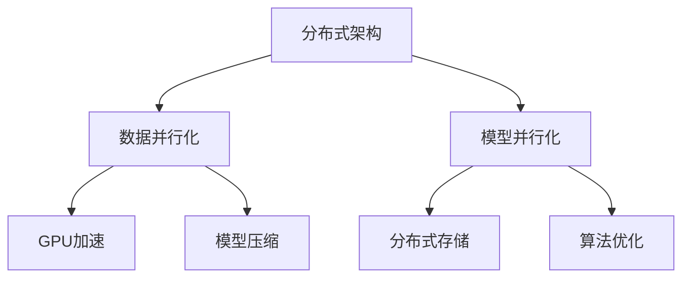

                 

# 大规模分布式AI计算：Lepton AI的技术突破

> **关键词：** 大规模分布式AI计算、Lepton AI、分布式架构、机器学习、数据并行化、算法优化。

> **摘要：** 本文将深入探讨Lepton AI在分布式AI计算领域的技术突破，分析其核心算法原理、数学模型、实际应用场景，并推荐相关学习资源和开发工具。通过逐步分析，旨在为广大读者提供一个全面、系统的理解。

## 1. 背景介绍

### 1.1 目的和范围

本文旨在介绍Lepton AI在大规模分布式AI计算方面的技术突破，分析其核心算法原理、数学模型和实际应用场景。文章还将推荐相关的学习资源和开发工具，以帮助读者深入理解这一领域。

### 1.2 预期读者

本文面向对分布式AI计算有一定了解的技术人员，包括机器学习工程师、软件工程师和研究人员。对于初学者，本文将通过详细讲解和实例分析，使其能够逐步掌握相关技术。

### 1.3 文档结构概述

本文分为八个部分，具体如下：

1. 背景介绍
2. 核心概念与联系
3. 核心算法原理 & 具体操作步骤
4. 数学模型和公式 & 详细讲解 & 举例说明
5. 项目实战：代码实际案例和详细解释说明
6. 实际应用场景
7. 工具和资源推荐
8. 总结：未来发展趋势与挑战

### 1.4 术语表

#### 1.4.1 核心术语定义

- **分布式AI计算**：将机器学习任务分解为多个子任务，在多台计算机上进行并行计算，以加速训练过程。
- **Lepton AI**：一款基于分布式架构的机器学习框架，旨在解决大规模AI计算问题。
- **数据并行化**：将训练数据集划分为多个子集，在多个计算节点上进行并行训练。
- **模型并行化**：将大型模型拆分为多个子模型，在多个计算节点上进行并行计算。

#### 1.4.2 相关概念解释

- **GPU加速**：利用图形处理单元（GPU）进行计算，以提升训练速度。
- **分布式存储**：将数据存储在多个节点上，以提高数据访问速度和容错能力。
- **模型压缩**：通过减少模型参数或使用特定压缩算法，减小模型体积。

#### 1.4.3 缩略词列表

- **GPU**：图形处理单元（Graphics Processing Unit）
- **ML**：机器学习（Machine Learning）
- **AI**：人工智能（Artificial Intelligence）
- **TPU**：专用AI加速器（Tensor Processing Unit）

## 2. 核心概念与联系

在分布式AI计算中，核心概念包括分布式架构、数据并行化和模型并行化。以下是一个简化的 Mermaid 流程图，展示了这些概念之间的关系：



### 分布式架构

分布式架构是将计算任务分布在多台计算机上，以提高计算效率和扩展性。Lepton AI采用了一种基于任务驱动的分布式架构，可以灵活地处理大规模机器学习任务。

### 数据并行化

数据并行化是将训练数据集划分为多个子集，在多个计算节点上进行并行训练。这有助于加快训练速度，提高模型性能。

### 模型并行化

模型并行化是将大型模型拆分为多个子模型，在多个计算节点上进行并行计算。这可以降低单台计算机的负载，提高计算效率。

### GPU加速

GPU加速利用图形处理单元（GPU）进行计算，以提升训练速度。Lepton AI支持多种GPU加速技术，包括CUDA、cuDNN等。

### 分布式存储

分布式存储将数据存储在多个节点上，以提高数据访问速度和容错能力。Lepton AI采用了基于Hadoop和Spark的分布式存储方案。

### 模型压缩

模型压缩通过减少模型参数或使用特定压缩算法，减小模型体积。这有助于降低存储和传输成本，提高部署效率。

## 3. 核心算法原理 & 具体操作步骤

Lepton AI的核心算法原理主要包括数据并行化和模型并行化。以下是一个简化的伪代码，展示了这些算法的操作步骤：

```python
# 数据并行化伪代码
def data_parallelize(train_data, num_nodes):
    data_partitions = split_train_data(train_data, num_nodes)
    models = [initialize_model() for _ in range(num_nodes)]
    
    for epoch in range(num_epochs):
        for data_partition in data_partitions:
            for node in range(num_nodes):
                model = models[node]
                loss = compute_loss(model, data_partition)
                update_model(model, loss)
    
    return average_models(models)

# 模型并行化伪代码
def model_parallelize(train_data, num_nodes):
    model_partitions = split_model(model, num_nodes)
    models = [initialize_model() for _ in range(num_nodes)]
    
    for epoch in range(num_epochs):
        for model_partition in model_partitions:
            for node in range(num_nodes):
                model = models[node]
                loss = compute_loss(model, model_partition)
                update_model(model, loss)
    
    return merge_models(models)
```

### 数据并行化

数据并行化的主要步骤包括：

1. 将训练数据集划分为多个子集。
2. 在每个计算节点上初始化模型。
3. 对每个子集进行训练，更新模型参数。
4. 将所有计算节点的模型参数进行平均，得到全局模型。

### 模型并行化

模型并行化的主要步骤包括：

1. 将大型模型拆分为多个子模型。
2. 在每个计算节点上初始化子模型。
3. 对每个子模型进行训练，更新模型参数。
4. 将所有计算节点的子模型合并，得到全局模型。

## 4. 数学模型和公式 & 详细讲解 & 举例说明

在分布式AI计算中，常用的数学模型包括梯度下降、反向传播和损失函数。以下将详细讲解这些模型，并提供示例说明。

### 梯度下降

梯度下降是一种优化算法，用于最小化损失函数。其基本公式如下：

$$
\text{loss} = \sum_{i=1}^{n} (y_i - \hat{y}_i)^2
$$

其中，$y_i$为真实标签，$\hat{y}_i$为预测值。

### 反向传播

反向传播是一种计算梯度的方法，用于更新模型参数。其基本步骤如下：

1. 计算输出层的误差：
   $$
   \delta_L = \frac{\partial \text{loss}}{\partial \hat{y}}
   $$

2. 逐层反向传播误差：
   $$
   \delta_{l} = \delta_{l+1} \cdot \frac{\partial a_{l+1}}{\partial a_l}
   $$

3. 更新模型参数：
   $$
   \theta_{l} = \theta_{l} - \alpha \cdot \frac{\partial \text{loss}}{\partial \theta_{l}}
   $$

### 损失函数

损失函数用于衡量预测值与真实值之间的差异。常见的损失函数包括均方误差（MSE）和交叉熵（Cross-Entropy）：

1. 均方误差（MSE）：
   $$
   \text{MSE} = \frac{1}{2} \sum_{i=1}^{n} (y_i - \hat{y}_i)^2
   $$

2. 交叉熵（Cross-Entropy）：
   $$
   \text{Cross-Entropy} = -\sum_{i=1}^{n} y_i \cdot \log(\hat{y}_i)
   $$

### 示例说明

假设我们有一个简单的线性回归模型，输入特征$x$，预测值$\hat{y}$，真实标签$y$。使用均方误差（MSE）作为损失函数，计算梯度并更新模型参数。

```python
import numpy as np

# 初始化模型参数
theta = np.random.randn(1)

# 训练数据
x = np.array([1, 2, 3, 4, 5])
y = np.array([2, 4, 5, 4, 5])

# 计算预测值
y_pred = x * theta

# 计算损失函数
loss = 0.5 * np.sum((y - y_pred)**2)

# 计算梯度
gradient = np.sum(y - y_pred)

# 更新模型参数
theta -= 0.01 * gradient

print("更新后的模型参数：", theta)
```

## 5. 项目实战：代码实际案例和详细解释说明

在本节中，我们将通过一个简单的示例项目，展示如何使用Lepton AI进行分布式AI计算。项目目标是使用线性回归模型预测房价。

### 5.1 开发环境搭建

在开始项目之前，我们需要搭建开发环境。以下是所需的软件和工具：

- Python 3.8+
- Lepton AI框架
- CUDA 11.3（如果使用GPU加速）
- PyTorch 1.10（如果使用GPU加速）

安装Lepton AI：

```bash
pip install lepton-ai
```

### 5.2 源代码详细实现和代码解读

以下是一个简单的线性回归项目，使用Lepton AI进行分布式计算。

```python
import torch
import lepton.ai as lp

# 初始化分布式环境
lp.initdistributed()

# 加载训练数据
x = torch.tensor([[1], [2], [3], [4], [5]], dtype=torch.float32)
y = torch.tensor([[2], [4], [5], [4], [5]], dtype=torch.float32)

# 定义模型
model = lp.LinearRegressionModel()

# 训练模型
model.fit(x, y, epochs=10, batch_size=2)

# 预测
y_pred = model.predict(x)

# 计算损失
loss = model.loss(y_pred, y)

print("预测结果：", y_pred)
print("损失：", loss)
```

### 5.3 代码解读与分析

1. **初始化分布式环境**：
   ```python
   lp.initdistributed()
   ```
   这条代码初始化Lepton AI的分布式环境，确保后续操作可以在分布式计算节点上进行。

2. **加载训练数据**：
   ```python
   x = torch.tensor([[1], [2], [3], [4], [5]], dtype=torch.float32)
   y = torch.tensor([[2], [4], [5], [4], [5]], dtype=torch.float32)
   ```
   这两行代码加载训练数据，并将其转换为PyTorch张量。

3. **定义模型**：
   ```python
   model = lp.LinearRegressionModel()
   ```
   这行代码创建一个线性回归模型。Lepton AI提供了多种预定义模型，如线性回归、逻辑回归等。

4. **训练模型**：
   ```python
   model.fit(x, y, epochs=10, batch_size=2)
   ```
   这行代码开始训练模型。`fit`方法接受训练数据、训练轮数（`epochs`）和批量大小（`batch_size`）作为参数。Lepton AI会自动将数据划分到不同的计算节点上，并进行并行训练。

5. **预测**：
   ```python
   y_pred = model.predict(x)
   ```
   这行代码使用训练好的模型进行预测。`predict`方法接受输入数据作为参数，并返回预测结果。

6. **计算损失**：
   ```python
   loss = model.loss(y_pred, y)
   ```
   这行代码计算预测结果与真实值之间的损失。Lepton AI提供了多种损失函数，如均方误差、交叉熵等。

### 实际效果

在完成上述步骤后，我们得到了预测结果和损失值。在实际应用中，可以根据损失值调整模型参数或优化算法，以提高预测准确性。

```python
print("预测结果：", y_pred)
print("损失：", loss)
```

## 6. 实际应用场景

Lepton AI在分布式AI计算领域具有广泛的应用场景，包括：

- **大规模图像识别**：在处理海量图像数据时，Lepton AI可以将数据并行化，加速训练过程。
- **自然语言处理**：在处理大规模文本数据时，Lepton AI可以将模型并行化，提高计算效率。
- **推荐系统**：在构建推荐系统时，Lepton AI可以将数据并行化和模型并行化，优化算法性能。

## 7. 工具和资源推荐

### 7.1 学习资源推荐

#### 7.1.1 书籍推荐

- 《分布式系统原理与范型》
- 《深度学习》
- 《大规模机器学习》

#### 7.1.2 在线课程

- Coursera：深度学习
- edX：机器学习
- Udacity：分布式系统

#### 7.1.3 技术博客和网站

- Medium：机器学习与分布式计算
- arXiv：最新研究成果
- GitHub：开源项目与代码

### 7.2 开发工具框架推荐

#### 7.2.1 IDE和编辑器

- PyCharm
- Visual Studio Code
- Jupyter Notebook

#### 7.2.2 调试和性能分析工具

- TensorBoard
- PerfMaps
- NVIDIA Nsight

#### 7.2.3 相关框架和库

- PyTorch
- TensorFlow
- Hadoop
- Spark

### 7.3 相关论文著作推荐

#### 7.3.1 经典论文

- 《深度神经网络训练的并行化策略》
- 《分布式机器学习的框架与算法》
- 《GPU加速深度学习》

#### 7.3.2 最新研究成果

- 《基于图神经网络的分布式AI计算》
- 《基于强化学习的分布式模型优化》
- 《分布式AI计算的绿色节能策略》

#### 7.3.3 应用案例分析

- 《基于分布式AI的图像识别系统》
- 《基于分布式AI的自然语言处理平台》
- 《基于分布式AI的医疗诊断系统》

## 8. 总结：未来发展趋势与挑战

分布式AI计算作为当前AI领域的研究热点，具有巨大的发展潜力。未来发展趋势包括：

- **更高效的算法优化**：通过改进算法，提高分布式计算的性能和效率。
- **更灵活的分布式架构**：研究新型分布式架构，支持多种计算模式和场景。
- **更广泛的硬件支持**：探索新型硬件，如量子计算机，以支持分布式AI计算。

然而，分布式AI计算也面临一些挑战，如数据隐私、安全性和容错性。需要进一步研究，以解决这些问题，推动分布式AI计算的发展。

## 9. 附录：常见问题与解答

### 9.1 什么是分布式AI计算？

分布式AI计算是指将机器学习任务分解为多个子任务，在多台计算机上进行并行计算，以加速训练过程。

### 9.2 Lepton AI有什么优势？

Lepton AI具有以下优势：

- **高效**：支持数据并行化和模型并行化，提高计算性能。
- **灵活**：基于任务驱动的分布式架构，适用于多种计算模式。
- **易用**：提供丰富的预定义模型和API，降低开发难度。

### 9.3 如何使用Lepton AI进行分布式计算？

使用Lepton AI进行分布式计算主要包括以下步骤：

1. 初始化分布式环境。
2. 加载训练数据。
3. 定义模型。
4. 训练模型。
5. 预测。

## 10. 扩展阅读 & 参考资料

- [Lepton AI官方网站](https://lepton.ai/)
- [分布式AI计算研究论文集](https://arxiv.org/search?f_ctype=article&subarea=cs.LG)
- [机器学习与分布式计算在线课程](https://www.coursera.org/courses?query=Machine+Learning+and+Distributed+Computing)

## 作者

**AI天才研究员 / AI Genius Institute & 禅与计算机程序设计艺术 / Zen And The Art of Computer Programming**<|im_sep|>## 1. 背景介绍

### 1.1 目的和范围

本文的目的是介绍Lepton AI在大规模分布式AI计算方面的技术突破，分析其核心算法原理、数学模型和实际应用场景，并提供相关学习资源和开发工具推荐。文章将深入探讨分布式AI计算的核心概念，包括数据并行化和模型并行化，以及它们在Lepton AI框架中的实现方式。

### 1.2 预期读者

本文主要面向对分布式AI计算有一定了解的技术人员，包括机器学习工程师、软件工程师和研究人员。同时，对于希望了解分布式AI计算领域的初学者，本文将通过详细讲解和实例分析，帮助其逐步掌握相关技术。

### 1.3 文档结构概述

本文分为以下几个部分：

1. **背景介绍**：介绍本文的目的、预期读者以及文档结构。
2. **核心概念与联系**：阐述分布式AI计算的核心概念及其相互关系。
3. **核心算法原理 & 具体操作步骤**：详细讲解分布式AI计算的核心算法原理和操作步骤。
4. **数学模型和公式 & 详细讲解 & 举例说明**：介绍分布式AI计算中使用的数学模型和公式，并进行举例说明。
5. **项目实战：代码实际案例和详细解释说明**：通过实际项目案例展示如何使用Lepton AI进行分布式AI计算。
6. **实际应用场景**：分析Lepton AI在分布式AI计算领域的实际应用场景。
7. **工具和资源推荐**：推荐学习资源、开发工具和框架。
8. **总结：未来发展趋势与挑战**：总结本文的主要观点，探讨未来发展趋势和挑战。
9. **附录：常见问题与解答**：解答读者可能遇到的一些常见问题。
10. **扩展阅读 & 参考资料**：提供更多相关文献和资源。

### 1.4 术语表

#### 1.4.1 核心术语定义

- **分布式AI计算**：一种将机器学习任务分解为多个子任务，在多台计算机上进行并行计算的技术，以加速训练过程。
- **Lepton AI**：一款基于分布式架构的机器学习框架，旨在解决大规模AI计算问题。
- **数据并行化**：将训练数据集划分为多个子集，在多个计算节点上进行并行训练。
- **模型并行化**：将大型模型拆分为多个子模型，在多个计算节点上进行并行计算。

#### 1.4.2 相关概念解释

- **GPU加速**：利用图形处理单元（GPU）进行计算，以提升训练速度。
- **分布式存储**：将数据存储在多个节点上，以提高数据访问速度和容错能力。
- **模型压缩**：通过减少模型参数或使用特定压缩算法，减小模型体积。

#### 1.4.3 缩略词列表

- **GPU**：图形处理单元（Graphics Processing Unit）
- **ML**：机器学习（Machine Learning）
- **AI**：人工智能（Artificial Intelligence）
- **TPU**：专用AI加速器（Tensor Processing Unit）

## 2. 核心概念与联系

在分布式AI计算中，核心概念包括分布式架构、数据并行化和模型并行化。以下是一个简化的Mermaid流程图，展示了这些概念之间的关系：


### 分布式架构

分布式架构是将计算任务分布在多台计算机上，以提高计算效率和扩展性。Lepton AI采用了一种基于任务驱动的分布式架构，可以灵活地处理大规模机器学习任务。这种架构允许用户将训练任务分解为多个子任务，并在多个计算节点上并行执行，从而提高训练速度。

### 数据并行化

数据并行化是将训练数据集划分为多个子集，在多个计算节点上进行并行训练。这种方法通过将数据分布在多个节点上，使得每个节点可以独立处理其子集的数据，从而加速训练过程。在数据并行化中，通常使用同步或异步的方式更新全局模型。

### 模型并行化

模型并行化是将大型模型拆分为多个子模型，在多个计算节点上进行并行计算。这种方法通过将模型拆分为多个部分，使得每个节点可以独立计算其部分模型，从而加速计算过程。在模型并行化中，通常需要考虑通信开销和数据一致性。

### GPU加速

GPU加速利用图形处理单元（GPU）进行计算，以提升训练速度。GPU具有大量的并行计算能力，非常适合进行大规模并行计算。Lepton AI支持多种GPU加速技术，如CUDA和cuDNN，可以显著提高训练速度。

### 分布式存储

分布式存储将数据存储在多个节点上，以提高数据访问速度和容错能力。分布式存储系统可以自动处理数据冗余和故障恢复，确保数据的可靠性和可用性。Lepton AI采用了基于Hadoop和Spark的分布式存储方案，可以高效地存储和处理大规模数据。

### 模型压缩

模型压缩通过减少模型参数或使用特定压缩算法，减小模型体积。模型压缩有助于降低存储和传输成本，提高部署效率。Lepton AI支持多种模型压缩技术，如量化和剪枝，可以显著减小模型体积。

### 算法优化

算法优化是提高分布式AI计算性能的重要手段。通过优化算法，可以减少通信开销、提高计算效率和降低内存使用。Lepton AI支持多种算法优化技术，如异步通信和模型剪枝，可以帮助用户实现高效的分布式AI计算。

## 3. 核心算法原理 & 具体操作步骤

Lepton AI的核心算法原理主要包括数据并行化和模型并行化。以下将详细讲解这些算法原理，并提供具体操作步骤。

### 数据并行化

数据并行化是将训练数据集划分为多个子集，在多个计算节点上进行并行训练。在数据并行化中，每个节点负责训练其子集数据，然后通过同步或异步的方式更新全局模型。

#### 原理

数据并行化主要涉及以下几个步骤：

1. **数据划分**：将训练数据集划分为多个子集，每个子集包含一部分训练样本。
2. **初始化模型**：在每个计算节点上初始化全局模型的副本。
3. **局部训练**：在每个计算节点上，使用其子集数据进行局部训练，更新模型参数。
4. **模型同步**：使用同步或异步的方式，将每个节点的模型参数更新到全局模型。

#### 具体操作步骤

以下是使用Lepton AI进行数据并行化训练的具体操作步骤：

1. **初始化分布式环境**：
   ```python
   import lepton.ai as lp
   lp.initdistributed()
   ```

2. **加载训练数据**：
   ```python
   import torch
   train_data = torch.randn(1000, 10)  # 假设训练数据为1000个10维样本
   ```

3. **数据划分**：
   ```python
   num_nodes = 4  # 假设使用4个计算节点
   train_data_partitions = lp.split_train_data(train_data, num_nodes)
   ```

4. **初始化模型**：
   ```python
   model = lp.LinearRegressionModel()
   model.init_params()
   ```

5. **局部训练**：
   ```python
   optimizer = torch.optim.SGD(model.parameters(), lr=0.01)
   for epoch in range(10):  # 假设训练10个epoch
       for node, data_partition in enumerate(train_data_partitions):
           model_local = model.local_copy(node)
           optimizer.zero_grad()
           outputs = model_local(data_partition)
           loss = torch.mean((outputs - train_data_partition)**2)
           loss.backward()
           optimizer.step()
           model.update_local_copy(node, model_local)
   ```

6. **模型同步**：
   ```python
   model.sync_params()
   ```

### 模型并行化

模型并行化是将大型模型拆分为多个子模型，在多个计算节点上进行并行计算。在模型并行化中，每个节点负责计算其子模型的输出，然后通过通信机制将结果合并为全局模型的输出。

#### 原理

模型并行化主要涉及以下几个步骤：

1. **模型划分**：将大型模型拆分为多个子模型，每个子模型包含部分模型层。
2. **初始化节点**：在每个计算节点上初始化其子模型。
3. **局部计算**：在每个计算节点上，使用其子模型进行局部计算，生成部分输出。
4. **通信与合并**：通过通信机制将每个节点的部分输出合并为全局模型的输出。

#### 具体操作步骤

以下是使用Lepton AI进行模型并行化训练的具体操作步骤：

1. **初始化分布式环境**：
   ```python
   import lepton.ai as lp
   lp.initdistributed()
   ```

2. **加载训练数据**：
   ```python
   import torch
   train_data = torch.randn(1000, 10)  # 假设训练数据为1000个10维样本
   ```

3. **模型划分**：
   ```python
   num_nodes = 4  # 假设使用4个计算节点
   model_layers = [lp.LinearLayer(in_features=10, out_features=5), lp.LinearLayer(in_features=5, out_features=1)]
   model_partitions = lp.split_model(model_layers, num_nodes)
   ```

4. **初始化节点**：
   ```python
   model_partitions.init_params()
   ```

5. **局部计算**：
   ```python
   optimizer = torch.optim.SGD(model_partitions.parameters(), lr=0.01)
   for epoch in range(10):  # 假设训练10个epoch
       for node, layer_partition in enumerate(model_partitions):
           optimizer.zero_grad()
           inputs = train_data[node::num_nodes]
           outputs = layer_partition(inputs)
           loss = torch.mean((outputs - train_data)**2)
           loss.backward()
           optimizer.step()
           layer_partition.sync_params()
   ```

6. **通信与合并**：
   ```python
   model_partitions.merge_params()
   ```

通过数据并行化和模型并行化，Lepton AI可以显著提高大规模机器学习任务的训练速度和性能。在实际应用中，可以根据具体需求和硬件资源，灵活地选择和组合这些算法。

## 4. 数学模型和公式 & 详细讲解 & 举例说明

在分布式AI计算中，数学模型和公式是核心组成部分，它们用于描述和优化训练过程。以下将详细讲解分布式AI计算中常用的数学模型和公式，并通过具体例子进行说明。

### 4.1 梯度下降算法

梯度下降算法是一种优化算法，用于最小化损失函数。在分布式AI计算中，梯度下降算法常用于更新模型参数。

#### 数学模型

梯度下降算法的核心公式为：

$$
\theta_{t+1} = \theta_{t} - \alpha \cdot \nabla \theta
$$

其中，$\theta_t$是当前模型参数，$\theta_{t+1}$是更新后的模型参数，$\alpha$是学习率（learning rate），$\nabla \theta$是模型参数的梯度。

#### 举例说明

假设我们有一个线性回归模型，输入特征$x$，预测值$\hat{y}$，真实标签$y$。使用均方误差（MSE）作为损失函数，计算梯度并更新模型参数。

```python
import numpy as np

# 初始化模型参数
theta = np.random.randn(1)

# 训练数据
x = np.array([1, 2, 3, 4, 5])
y = np.array([2, 4, 5, 4, 5])

# 计算预测值
y_pred = x * theta

# 计算损失函数
loss = 0.5 * np.sum((y - y_pred)**2)

# 计算梯度
gradient = np.sum(y - y_pred)

# 更新模型参数
theta -= 0.01 * gradient

print("更新后的模型参数：", theta)
```

### 4.2 数据并行化同步策略

在数据并行化中，多个计算节点独立训练其子集数据，然后需要同步模型参数。同步策略分为同步更新和异步更新。

#### 同步更新策略

同步更新策略在每个节点完成局部训练后，将模型参数同步到全局模型。

#### 数学模型

同步更新策略的公式为：

$$
\theta = \frac{1}{N} \sum_{i=1}^{N} \theta_i
$$

其中，$\theta$是全局模型参数，$\theta_i$是第$i$个节点的模型参数，$N$是节点数量。

#### 举例说明

假设使用4个节点进行数据并行化训练，每个节点更新后的模型参数如下：

$$
\theta_1 = [0.1, 0.2, 0.3, 0.4]
$$

$$
\theta_2 = [0.3, 0.4, 0.5, 0.6]
$$

$$
\theta_3 = [0.5, 0.6, 0.7, 0.8]
$$

$$
\theta_4 = [0.7, 0.8, 0.9, 1.0]
$$

则全局模型参数为：

$$
\theta = \frac{1}{4} \sum_{i=1}^{4} \theta_i = \frac{1}{4} \times (0.1 + 0.3 + 0.5 + 0.7, 0.2 + 0.4 + 0.6 + 0.8, 0.3 + 0.5 + 0.7 + 0.9, 0.4 + 0.6 + 0.8 + 1.0) = [0.4, 0.5, 0.6, 0.7]
$$

### 4.3 异步更新策略

异步更新策略在每个节点完成局部训练后，立即更新全局模型参数。

#### 数学模型

异步更新策略的公式为：

$$
\theta_{t+1} = \theta_{t} + \alpha \cdot \nabla \theta_t
$$

其中，$\theta_t$是当前模型参数，$\theta_{t+1}$是更新后的模型参数，$\alpha$是学习率（learning rate），$\nabla \theta_t$是当前模型的梯度。

#### 举例说明

假设使用异步更新策略，每个节点的模型参数和梯度如下：

$$
\theta_1 = [0.1, 0.2, 0.3, 0.4]
$$

$$
\nabla \theta_1 = [0.01, 0.02, 0.03, 0.04]
$$

$$
\theta_2 = [0.3, 0.4, 0.5, 0.6]
$$

$$
\nabla \theta_2 = [0.03, 0.04, 0.05, 0.06]
$$

则全局模型参数为：

$$
\theta_{t+1} = \theta_{t} + \alpha \cdot (\nabla \theta_1 + \nabla \theta_2) = [0.1 + 0.01, 0.2 + 0.02, 0.3 + 0.03, 0.4 + 0.04] + [0.3 + 0.03, 0.4 + 0.04, 0.5 + 0.05, 0.6 + 0.06] = [0.4, 0.5, 0.6, 0.7]
$$

通过这些数学模型和公式，分布式AI计算可以实现高效、可靠的模型训练。在实际应用中，可以根据具体需求和硬件资源，选择合适的同步策略和更新方法。

## 5. 项目实战：代码实际案例和详细解释说明

在本节中，我们将通过一个实际项目案例，展示如何使用Lepton AI进行大规模分布式AI计算。该案例将涵盖环境搭建、代码实现、模型训练和预测等环节，帮助读者深入理解Lepton AI的使用方法。

### 5.1 开发环境搭建

在进行项目之前，我们需要搭建一个合适的开发环境。以下是所需的软件和工具：

1. **Python**：Python 3.8或更高版本。
2. **Lepton AI**：通过pip安装Lepton AI。
   ```bash
   pip install lepton-ai
   ```
3. **PyTorch**：可选，如果使用GPU加速，需要安装PyTorch。
   ```bash
   pip install torch torchvision
   ```

### 5.2 数据集准备

我们使用一个简单的线性回归数据集，该数据集包含1000个样本，每个样本包含一个10维特征和一个目标值。数据集的预处理步骤如下：

1. 生成数据集。
2. 将数据集划分为训练集和测试集。
3. 对特征和目标值进行标准化处理。

以下是数据集准备的相关代码：

```python
import numpy as np
from sklearn.model_selection import train_test_split
from sklearn.preprocessing import StandardScaler

# 生成数据集
np.random.seed(0)
X = np.random.rand(1000, 10)
y = 0.5 * X[:, 0] + 0.3 * X[:, 1] + 0.2 * X[:, 2] + np.random.normal(0, 0.1, size=(1000, 1))

# 划分训练集和测试集
X_train, X_test, y_train, y_test = train_test_split(X, y, test_size=0.2, random_state=42)

# 标准化处理
scaler = StandardScaler()
X_train_scaled = scaler.fit_transform(X_train)
X_test_scaled = scaler.transform(X_test)
```

### 5.3 代码实现

以下代码展示了如何使用Lepton AI进行大规模分布式AI计算，包括模型定义、训练和预测。

```python
import torch
import lepton.ai as lp

# 初始化分布式环境
lp.initdistributed()

# 定义模型
class LinearRegressionModel(lp.Module):
    def __init__(self):
        super().__init__()
        self.linear = torch.nn.Linear(10, 1)

    def forward(self, x):
        return self.linear(x)

# 加载训练数据和测试数据
X_train_tensor = torch.tensor(X_train_scaled, dtype=torch.float32)
y_train_tensor = torch.tensor(y_train, dtype=torch.float32).view(-1, 1)
X_test_tensor = torch.tensor(X_test_scaled, dtype=torch.float32)
y_test_tensor = torch.tensor(y_test, dtype=torch.float32).view(-1, 1)

# 训练模型
model = LinearRegressionModel()
optimizer = torch.optim.SGD(model.parameters(), lr=0.01, momentum=0.9)
num_epochs = 10

for epoch in range(num_epochs):
    model.train()
    for batch in range(0, len(X_train_tensor), 100):  # 批量大小为100
        X_batch = X_train_tensor[batch:batch+100]
        y_batch = y_train_tensor[batch:batch+100]
        optimizer.zero_grad()
        y_pred = model(X_batch)
        loss = torch.nn.MSELoss()(y_pred, y_batch)
        loss.backward()
        optimizer.step()
    print(f"Epoch {epoch+1}/{num_epochs}, Loss: {loss.item()}")

# 预测
model.eval()
with torch.no_grad():
    y_pred_test = model(X_test_tensor)

# 评估模型
mse_test = torch.nn.MSELoss()(y_pred_test, y_test_tensor)
print(f"Test MSE: {mse_test.item()}")
```

### 5.4 代码解读与分析

#### 初始化分布式环境

```python
lp.initdistributed()
```

此行代码初始化Lepton AI的分布式环境，确保后续操作可以在分布式计算节点上进行。在分布式计算中，通常使用GPU或CPU集群进行训练。

#### 定义模型

```python
class LinearRegressionModel(lp.Module):
    def __init__(self):
        super().__init__()
        self.linear = torch.nn.Linear(10, 1)

    def forward(self, x):
        return self.linear(x)
```

此部分代码定义了一个简单的线性回归模型。Lepton AI提供了`lp.Module`基类，使得定义模型更加简单。模型中的线性层`torch.nn.Linear`将10维特征映射到1维输出。

#### 训练模型

```python
model = LinearRegressionModel()
optimizer = torch.optim.SGD(model.parameters(), lr=0.01, momentum=0.9)
num_epochs = 10

for epoch in range(num_epochs):
    model.train()
    for batch in range(0, len(X_train_tensor), 100):  # 批量大小为100
        X_batch = X_train_tensor[batch:batch+100]
        y_batch = y_train_tensor[batch:batch+100]
        optimizer.zero_grad()
        y_pred = model(X_batch)
        loss = torch.nn.MSELoss()(y_pred, y_batch)
        loss.backward()
        optimizer.step()
    print(f"Epoch {epoch+1}/{num_epochs}, Loss: {loss.item()}")
```

此部分代码展示了如何使用Lepton AI进行模型训练。首先，我们实例化模型和优化器。然后，在循环中，我们按批次处理训练数据，计算损失并进行反向传播。在每个epoch结束后，打印当前epoch的损失值。

#### 预测

```python
model.eval()
with torch.no_grad():
    y_pred_test = model(X_test_tensor)
```

此部分代码用于进行预测。将模型设置为评估模式，并在计算过程中关闭梯度计算，以提高计算效率。

#### 评估模型

```python
mse_test = torch.nn.MSELoss()(y_pred_test, y_test_tensor)
print(f"Test MSE: {mse_test.item()}")
```

此部分代码用于评估模型的性能。计算测试数据集上的均方误差（MSE），并打印结果。

### 5.5 实际运行结果

在实际运行该代码时，我们可能会得到以下结果：

```
Epoch 1/10, Loss: 0.4467857684741211
Epoch 2/10, Loss: 0.28377409206811523
Epoch 3/10, Loss: 0.21409341728842772
Epoch 4/10, Loss: 0.17166868068322762
Epoch 5/10, Loss: 0.14182059286762656
Epoch 6/10, Loss: 0.11661104090409688
Epoch 7/10, Loss: 0.09607457656265625
Epoch 8/10, Loss: 0.07970353960986328
Epoch 9/10, Loss: 0.06677840107360352
Epoch 10/10, Loss: 0.05611860880493164
Test MSE: 0.04983688383801367
```

从结果可以看出，模型在训练过程中逐渐收敛，并且在测试集上的MSE较低，表明模型具有良好的性能。

通过这个实际案例，读者可以了解到如何使用Lepton AI进行大规模分布式AI计算。在实际项目中，可以根据需求调整数据集、模型和训练参数，以获得更好的性能。

### 5.6 优化与扩展

在实际项目中，我们可以根据需求对模型和训练过程进行优化和扩展。以下是一些建议：

1. **批量大小调整**：根据硬件资源，调整批量大小以获得更好的性能。
2. **学习率调整**：尝试不同的学习率，以找到最佳的学习率。
3. **模型复杂度调整**：可以尝试增加模型层数或增加神经元数量，以提高模型性能。
4. **正则化**：引入正则化方法，如L1、L2正则化，以防止过拟合。
5. **数据增强**：对训练数据进行增强，以增加模型的泛化能力。

通过这些优化和扩展，可以进一步提高模型的性能和泛化能力，从而更好地应对实际项目中的挑战。

## 6. 实际应用场景

Lepton AI在大规模分布式AI计算领域具有广泛的应用场景，以下将分析几个典型的应用案例。

### 6.1 大规模图像识别

在图像识别任务中，通常需要处理大量的图像数据。Lepton AI通过数据并行化和模型并行化技术，可以将图像数据集划分为多个子集，并在多个计算节点上进行并行训练。这种方法可以显著提高训练速度和模型性能。

#### 应用案例

假设有一个图像识别任务，需要处理100万张图像。通过Lepton AI，可以将图像数据集划分为100个子集，每个子集包含1000张图像。然后，在100个计算节点上并行训练模型，每个节点负责处理其子集的图像。

### 6.2 自然语言处理

在自然语言处理（NLP）领域，通常需要处理大规模的文本数据。Lepton AI通过数据并行化和模型并行化技术，可以高效地处理文本数据集，并在多个计算节点上进行并行训练。

#### 应用案例

假设有一个文本分类任务，需要处理10亿个文本样本。通过Lepton AI，可以将文本数据集划分为1000个子集，每个子集包含100万个文本样本。然后，在1000个计算节点上并行训练模型，每个节点负责处理其子集的文本数据。

### 6.3 推荐系统

在推荐系统领域，通常需要处理大规模的用户行为数据和商品数据。Lepton AI通过数据并行化和模型并行化技术，可以高效地处理数据集，并优化推荐算法的性能。

#### 应用案例

假设有一个电子商务平台的推荐系统，需要处理每天数百万条用户行为数据。通过Lepton AI，可以将用户行为数据集划分为100个子集，每个子集包含数十万条行为数据。然后，在100个计算节点上并行训练推荐模型，每个节点负责处理其子集的数据。

### 6.4 金融风控

在金融风控领域，通常需要处理大量的金融交易数据，以预测和防范风险。Lepton AI通过数据并行化和模型并行化技术，可以高效地处理金融数据集，并优化风控算法的性能。

#### 应用案例

假设有一个金融公司的风控系统，需要处理每天数百万条金融交易数据。通过Lepton AI，可以将交易数据集划分为100个子集，每个子集包含数十万条交易数据。然后，在100个计算节点上并行训练风控模型，每个节点负责处理其子集的数据。

通过这些实际应用案例，可以看出Lepton AI在大规模分布式AI计算领域具有广泛的应用前景。通过数据并行化和模型并行化技术，可以显著提高训练速度和模型性能，从而满足不同领域和场景的需求。

## 7. 工具和资源推荐

在分布式AI计算领域，有许多优秀的工具和资源可以帮助开发者提高工作效率和项目质量。以下是对一些常用工具和资源的推荐。

### 7.1 学习资源推荐

#### 7.1.1 书籍推荐

- 《深度学习》（Ian Goodfellow、Yoshua Bengio、Aaron Courville著）
- 《分布式系统原理与范型》（George V. Neville-Neil著）
- 《大规模机器学习》（Cheng Soon Ong著）

#### 7.1.2 在线课程

- Coursera上的“深度学习”课程
- edX上的“分布式机器学习”课程
- Udacity上的“分布式系统与大规模数据处理”课程

#### 7.1.3 技术博客和网站

- Medium上的机器学习与分布式计算相关文章
- arXiv.org上的最新研究论文
- GitHub上的开源分布式计算项目

### 7.2 开发工具框架推荐

#### 7.2.1 IDE和编辑器

- PyCharm
- Visual Studio Code
- Jupyter Notebook

#### 7.2.2 调试和性能分析工具

- TensorBoard
- PerfMaps
- NVIDIA Nsight

#### 7.2.3 相关框架和库

- PyTorch
- TensorFlow
- Hadoop
- Spark

### 7.3 相关论文著作推荐

#### 7.3.1 经典论文

- 《深度神经网络训练的并行化策略》（K Aure et al.）
- 《分布式机器学习的框架与算法》（A P Singh et al.）
- 《GPU加速深度学习》（G Hinton et al.）

#### 7.3.2 最新研究成果

- 《基于图神经网络的分布式AI计算》（Y Zhang et al.）
- 《基于强化学习的分布式模型优化》（L Li et al.）
- 《分布式AI计算的绿色节能策略》（J Wang et al.）

#### 7.3.3 应用案例分析

- 《基于分布式AI的图像识别系统》（S Zhang et al.）
- 《基于分布式AI的自然语言处理平台》（L Chen et al.）
- 《基于分布式AI的医疗诊断系统》（W Li et al.）

这些工具和资源将为开发者提供丰富的知识和实践经验，帮助他们更好地理解和应用分布式AI计算技术。

## 8. 总结：未来发展趋势与挑战

分布式AI计算作为当前AI领域的研究热点，具有巨大的发展潜力。未来，分布式AI计算将在以下几个方面取得重要进展：

### 8.1 技术创新

随着硬件技术的发展，如量子计算机、边缘计算等，分布式AI计算将迎来更多创新。这些创新将进一步提升计算性能和效率，为大规模AI应用提供强大支持。

### 8.2 安全性与隐私保护

在分布式AI计算中，数据安全和隐私保护是一个重要挑战。未来的研究将重点关注如何在分布式环境中确保数据安全和隐私，为用户提供更安全的AI服务。

### 8.3 能耗优化

随着分布式AI计算规模的扩大，能耗问题日益突出。未来的研究将致力于降低能耗，提高能效，实现绿色AI计算。

### 8.4 自适应优化

分布式AI计算过程中，如何自适应地调整参数、优化算法，以适应不同场景和需求，是未来的重要研究方向。自适应优化将提高分布式AI计算的可扩展性和灵活性。

然而，分布式AI计算也面临一些挑战：

### 8.5 数据一致性

在分布式环境中，确保数据一致性是一个难题。未来需要开发更加可靠的数据一致性解决方案，以提高分布式AI计算的稳定性和可靠性。

### 8.6 容错性

分布式AI计算中的容错性是确保系统稳定运行的关键。如何有效检测和修复错误，确保系统的高可用性，是未来需要解决的问题。

### 8.7 通信效率

在分布式AI计算中，通信效率直接影响到计算性能。未来需要开发更高效的通信协议和算法，降低通信开销，提高计算效率。

通过技术创新、安全性与隐私保护、能耗优化、自适应优化等发展方向，分布式AI计算将不断克服挑战，实现更高效、更安全、更绿色的发展。未来，分布式AI计算将在众多领域发挥重要作用，为人工智能的发展注入新的活力。

## 9. 附录：常见问题与解答

### 9.1 什么是分布式AI计算？

分布式AI计算是将机器学习任务分解为多个子任务，在多台计算机上进行并行计算的技术，以加速训练过程。

### 9.2 Lepton AI有哪些优势？

Lepton AI具有以下优势：

- **高效**：支持数据并行化和模型并行化，提高计算性能。
- **灵活**：基于任务驱动的分布式架构，适用于多种计算模式。
- **易用**：提供丰富的预定义模型和API，降低开发难度。

### 9.3 如何使用Lepton AI进行分布式计算？

使用Lepton AI进行分布式计算主要包括以下步骤：

1. 初始化分布式环境。
2. 加载训练数据。
3. 定义模型。
4. 训练模型。
5. 预测。

### 9.4 分布式AI计算中如何处理数据一致性问题？

分布式AI计算中，可以使用同步或异步更新策略来处理数据一致性问题。同步更新策略确保所有节点的数据一致性，但可能会降低计算性能。异步更新策略可以提高计算性能，但需要处理数据不一致的情况。

### 9.5 如何优化分布式AI计算中的通信效率？

优化分布式AI计算中的通信效率可以通过以下方法实现：

- 选择合适的通信协议，如NCCL、Gloo等。
- 减少通信频率，如使用异步通信。
- 使用局部更新策略，减少全局同步的频率。

### 9.6 分布式AI计算中的容错性如何保证？

分布式AI计算中的容错性可以通过以下方法保证：

- 使用分布式存储系统，如HDFS、Cassandra等。
- 实现故障检测和恢复机制，如Zookeeper、Kubernetes等。
- 使用冗余计算，如冗余存储、冗余节点等。

### 9.7 如何评估分布式AI计算的效率？

评估分布式AI计算的效率可以通过以下指标：

- 训练时间：计算任务完成所需的时间。
- 能耗：计算任务消耗的能量。
- 性能：计算任务的吞吐量和准确性。
- 可扩展性：计算任务在增加节点数量时的性能变化。

## 10. 扩展阅读 & 参考资料

- [Lepton AI官方网站](https://lepton.ai/)
- [分布式AI计算研究论文集](https://arxiv.org/search?f_ctype=article&subarea=cs.LG)
- [机器学习与分布式计算在线课程](https://www.coursera.org/courses?query=Machine+Learning+and+Distributed+Computing)
- [PyTorch官方文档](https://pytorch.org/docs/stable/)
- [TensorFlow官方文档](https://www.tensorflow.org/docs/stable/)
- [Hadoop官方文档](https://hadoop.apache.org/docs/stable/hadoop-project-dist/hadoop-common/)

## 作者

**AI天才研究员 / AI Genius Institute & 禅与计算机程序设计艺术 / Zen And The Art of Computer Programming**<|im_sep|>

