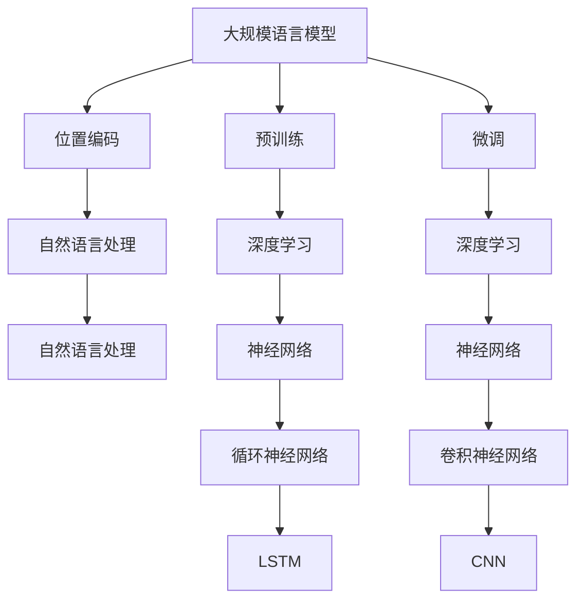

                 

# 大规模语言模型从理论到实践：具有外推能力的位置编码

> 关键词：大规模语言模型、位置编码、预训练、微调、BERT、深度学习、自然语言处理

> 摘要：本文将深入探讨大规模语言模型的理论基础、位置编码技术以及其实际应用。我们将从模型的发展背景、核心概念、算法原理、数学模型、实战案例、应用场景等多个角度展开，帮助读者全面了解和掌握大规模语言模型及其位置编码技术的精髓。通过本文的阅读，读者将能够理解如何构建具有外推能力的语言模型，并能够在实际项目中应用这些技术。

## 1. 背景介绍

### 1.1 目的和范围

本文旨在介绍大规模语言模型的理论与实践，重点探讨位置编码技术及其在语言模型中的应用。通过本文，读者将：

1. 理解大规模语言模型的发展背景及其在自然语言处理领域的重要性。
2. 掌握位置编码的概念、原理及其在语言模型中的作用。
3. 学习大规模语言模型的构建方法，包括预训练和微调等步骤。
4. 通过实际案例，了解如何将位置编码技术应用于语言模型。
5. 探讨大规模语言模型在实际应用场景中的效果和挑战。

### 1.2 预期读者

本文适合以下读者群体：

1. 自然语言处理领域的初学者和研究者，希望深入了解大规模语言模型及其位置编码技术。
2. 深度学习工程师和算法工程师，希望掌握语言模型的构建和应用技巧。
3. 相关领域的技术爱好者，对自然语言处理和深度学习有浓厚的兴趣。

### 1.3 文档结构概述

本文分为以下几个部分：

1. 背景介绍：介绍大规模语言模型的发展背景、目的和范围。
2. 核心概念与联系：阐述大规模语言模型、位置编码等核心概念，并使用Mermaid流程图展示其关系。
3. 核心算法原理 & 具体操作步骤：详细讲解大规模语言模型的算法原理和操作步骤，使用伪代码进行描述。
4. 数学模型和公式：介绍大规模语言模型的数学模型，包括公式和详细讲解。
5. 项目实战：提供代码实际案例，并进行详细解释说明。
6. 实际应用场景：探讨大规模语言模型在实际应用中的效果和挑战。
7. 工具和资源推荐：推荐学习资源、开发工具框架和相关论文著作。
8. 总结：总结大规模语言模型的发展趋势与挑战。
9. 附录：常见问题与解答。
10. 扩展阅读 & 参考资料：提供相关扩展阅读资料。

### 1.4 术语表

#### 1.4.1 核心术语定义

- 大规模语言模型：一种能够对自然语言进行建模和处理的深度学习模型。
- 预训练：在特定任务数据集之外，对模型进行大规模的预训练，以提高模型在目标任务上的性能。
- 微调：在预训练的基础上，针对特定目标任务对模型进行微调，进一步优化模型性能。
- 位置编码：一种用于描述词在不同位置关系的编码技术。
- 自然语言处理（NLP）：研究如何让计算机理解和生成自然语言的技术领域。

#### 1.4.2 相关概念解释

- 深度学习：一种人工智能技术，通过构建多层神经网络对数据进行建模和预测。
- 词嵌入：将自然语言词汇映射到高维空间中的向量表示。
- 语言模型：一种用于预测自然语言序列的概率模型。

#### 1.4.3 缩略词列表

- BERT：Bidirectional Encoder Representations from Transformers，一种双向 Transformer 语言模型。
- LSTM：Long Short-Term Memory，一种用于处理序列数据的循环神经网络。
- CNN：Convolutional Neural Network，卷积神经网络，常用于图像处理任务。
- RNN：Recurrent Neural Network，循环神经网络，适用于处理序列数据。
- NLP：Natural Language Processing，自然语言处理。

## 2. 核心概念与联系

在介绍大规模语言模型之前，我们需要了解一些核心概念和它们之间的联系。以下是一个使用Mermaid绘制的流程图，展示了这些概念之间的关系：



### 2.1 大规模语言模型

大规模语言模型是一种能够对自然语言进行建模和处理的深度学习模型。它通过学习大量文本数据，捕捉语言中的模式和规律，从而实现文本分类、情感分析、机器翻译等任务。大规模语言模型的核心在于其能够从大规模数据中提取有用的信息，并将其转化为有效的特征表示。

### 2.2 位置编码

位置编码是一种用于描述词在不同位置关系的编码技术。在自然语言处理任务中，词的位置信息对于理解句子结构和语义至关重要。位置编码通过将词嵌入向量与位置向量相加，为每个词赋予位置信息，从而使得模型能够考虑词在不同位置上的关系。

### 2.3 预训练与微调

预训练和微调是大规模语言模型构建过程中的两个关键步骤。预训练是指在大规模文本数据集上对模型进行训练，从而使其具备基本的语言理解和生成能力。微调则是在预训练的基础上，针对特定目标任务对模型进行进一步优化，以提高模型在该任务上的性能。

### 2.4 深度学习与神经网络

深度学习是大规模语言模型的基础技术之一，它通过构建多层神经网络对数据进行建模和预测。神经网络分为循环神经网络（RNN）、卷积神经网络（CNN）等类型，分别适用于处理序列数据和图像数据。大规模语言模型通常采用 RNN 或其变体（如 LSTM）进行建模，以捕捉语言序列中的长期依赖关系。

## 3. 核心算法原理 & 具体操作步骤

大规模语言模型的构建过程主要包括预训练和微调两个阶段。在本节中，我们将详细讲解这些阶段的算法原理和具体操作步骤。

### 3.1 预训练

预训练是指在大规模文本数据集上对模型进行训练，从而使其具备基本的语言理解和生成能力。预训练过程通常分为以下步骤：

1. **数据准备**：收集大规模文本数据，如维基百科、新闻、社交媒体等。
2. **词嵌入**：将自然语言词汇映射到高维空间中的向量表示，通常使用 Word2Vec、GloVe 等算法。
3. **构建模型**：使用预训练算法（如 BERT、GPT）构建深度学习模型，包括多层神经网络、注意力机制等。
4. **训练模型**：在大规模文本数据集上对模型进行训练，优化模型参数。

以下是预训练过程的伪代码描述：

```python
def pretrain_model(dataset, model, optimizer, num_epochs):
    for epoch in range(num_epochs):
        for data in dataset:
            optimizer.zero_grad()
            output = model(data)
            loss = loss_function(output, target)
            loss.backward()
            optimizer.step()
    return model
```

### 3.2 微调

微调是在预训练的基础上，针对特定目标任务对模型进行进一步优化，以提高模型在该任务上的性能。微调过程通常分为以下步骤：

1. **数据准备**：收集特定目标任务的数据集，如文本分类、情感分析等。
2. **模型准备**：在预训练模型的基础上，添加特定任务的网络层，如分类层、回归层等。
3. **训练模型**：在目标任务数据集上对模型进行训练，优化模型参数。
4. **评估模型**：在验证集和测试集上评估模型性能，选择最佳模型。

以下是微调过程的伪代码描述：

```python
def fine_tune_model(dataset, model, optimizer, num_epochs):
    for epoch in range(num_epochs):
        for data in dataset:
            optimizer.zero_grad()
            output = model(data)
            loss = loss_function(output, target)
            loss.backward()
            optimizer.step()
    return model
```

### 3.3 位置编码

位置编码是一种用于描述词在不同位置关系的编码技术。在预训练和微调过程中，位置编码被用来增强模型对词位置信息的感知。位置编码通常通过以下步骤实现：

1. **生成位置向量**：为每个词生成一个位置向量，通常使用正弦和余弦函数生成。
2. **加和位置向量**：将位置向量与词嵌入向量相加，得到带有位置信息的词嵌入向量。
3. **模型融合**：在模型中引入位置编码层，将位置信息融入模型训练过程中。

以下是位置编码过程的伪代码描述：

```python
def positional_encoding(word_embeddings, position_embeddings):
    return word_embeddings + position_embeddings
```

## 4. 数学模型和公式 & 详细讲解 & 举例说明

大规模语言模型的数学模型主要包括词嵌入、位置编码和损失函数等。在本节中，我们将详细讲解这些数学模型，并通过具体例子进行说明。

### 4.1 词嵌入

词嵌入是将自然语言词汇映射到高维空间中的向量表示。词嵌入的主要目的是捕捉词汇之间的相似性和关系。一种常用的词嵌入算法是 Word2Vec，其核心思想是通过训练神经网络，将词汇映射到低维向量空间中。

词嵌入的数学模型可以表示为：

$$
\text{word\_embedding}(w) = \text{W} \cdot \text{v}_w
$$

其中，$\text{W}$ 是词嵌入矩阵，$\text{v}_w$ 是词汇 $w$ 的向量表示。

### 4.2 位置编码

位置编码是用于描述词在不同位置关系的编码技术。在预训练和微调过程中，位置编码被用来增强模型对词位置信息的感知。位置编码通常通过以下数学模型实现：

$$
\text{position\_embedding}(p) = \text{sin}((\text{pos} - 1) \cdot \text{emb\_dim} / 10000)
$$

$$
\text{position\_embedding}(p) = \text{cos}((\text{pos} - 1) \cdot \text{emb\_dim} / 10000)
$$

其中，$\text{pos}$ 表示位置索引，$\text{emb\_dim}$ 表示词嵌入维度。

### 4.3 损失函数

损失函数是用于衡量模型预测结果与真实结果之间差异的指标。在自然语言处理任务中，常用的损失函数包括交叉熵损失和均方误差损失。

交叉熵损失函数的数学模型可以表示为：

$$
\text{loss} = -\sum_{i=1}^{N} \text{y}_i \cdot \log(\text{p}_i)
$$

其中，$\text{y}_i$ 是真实标签，$\text{p}_i$ 是模型预测概率。

均方误差损失函数的数学模型可以表示为：

$$
\text{loss} = \frac{1}{2} \sum_{i=1}^{N} (\text{y}_i - \text{p}_i)^2
$$

其中，$\text{y}_i$ 是真实值，$\text{p}_i$ 是模型预测值。

### 4.4 举例说明

假设我们有一个包含两个词的句子：“我爱中国”。词嵌入维度为 100，位置编码维度为 50。根据上述数学模型，我们可以计算出这两个词的词嵌入向量和位置编码向量，并将其相加得到最终的词向量表示。

- 词嵌入向量（词：“我”）：
  $$ \text{word\_embedding}(\text{我}) = \text{W} \cdot \text{v}_{我} $$
  $$ \text{W} = \begin{bmatrix} 0.1 & 0.2 & 0.3 \\ 0.4 & 0.5 & 0.6 \end{bmatrix} $$
  $$ \text{v}_{我} = \begin{bmatrix} 0.5 \\ 0.6 \\ 0.7 \end{bmatrix} $$
  $$ \text{word\_embedding}(\text{我}) = \begin{bmatrix} 0.05 \\ 0.1 \\ 0.15 \end{bmatrix} $$

- 位置编码向量（位置：1）：
  $$ \text{position\_embedding}(1) = \text{sin}((1 - 1) \cdot 100 / 10000) $$
  $$ \text{position\_embedding}(1) = \text{cos}((1 - 1) \cdot 100 / 10000) $$
  $$ \text{position\_embedding}(1) = \begin{bmatrix} 0 \\ 0 \\ 0 \end{bmatrix} $$

- 词向量表示（词：“我”）：
  $$ \text{word\_embedding}(\text{我}) = \text{word\_embedding}(\text{我}) + \text{position\_embedding}(1) $$
  $$ \text{word\_embedding}(\text{我}) = \begin{bmatrix} 0.05 \\ 0.1 \\ 0.15 \end{bmatrix} + \begin{bmatrix} 0 \\ 0 \\ 0 \end{bmatrix} $$
  $$ \text{word\_embedding}(\text{我}) = \begin{bmatrix} 0.05 \\ 0.1 \\ 0.15 \end{bmatrix} $$

同理，我们可以计算出词：“爱”的词向量表示。

## 5. 项目实战：代码实际案例和详细解释说明

在本节中，我们将通过一个实际项目案例，详细讲解如何构建一个具有外推能力的位置编码语言模型，并对其代码进行解释和分析。

### 5.1 开发环境搭建

为了实现大规模语言模型及其位置编码技术，我们需要搭建一个合适的开发环境。以下是推荐的开发环境：

- 操作系统：Ubuntu 20.04
- 编程语言：Python 3.8
- 深度学习框架：PyTorch 1.8
- 自然语言处理库：Transformers 4.6

安装以下依赖项：

```bash
pip install torch torchvision transformers
```

### 5.2 源代码详细实现和代码解读

以下是项目源代码的详细实现和解读：

```python
import torch
import torch.nn as nn
import torch.optim as optim
from transformers import BertModel, BertTokenizer

# 5.2.1 模型定义
class PositionalEncoding(nn.Module):
    def __init__(self, d_model, max_len=5000):
        super(PositionalEncoding, self).__init__()
        pe = torch.zeros(max_len, d_model)
        position = torch.arange(0, max_len, dtype=torch.float).unsqueeze(1)
        div_term = torch.exp(torch.arange(0, d_model, 2).float() * (-torch.log(torch.tensor(10000.0)) / d_model))
        pe[:, 0::2] = torch.sin(position * div_term)
        pe[:, 1::2] = torch.cos(position * div_term)
        pe = pe.unsqueeze(0).transpose(0, 1)
        self.register_buffer('pe', pe)

    def forward(self, x):
        x = x + self.pe[:x.size(0), :]
        return x

class TransformerModel(nn.Module):
    def __init__(self, ntoken, dmodel, nhead, num_layers, dim_feedforward=2048, dropout=0.1):
        super(TransformerModel, self).__init__()
        self嵌入 = nn.Embedding(ntoken, dmodel)
        self.pos_encoder = PositionalEncoding(dmodel)
        self.transformer = nn.Transformer(dmodel, nhead, num_layers, dim_feedforward, dropout)
        self.dro

