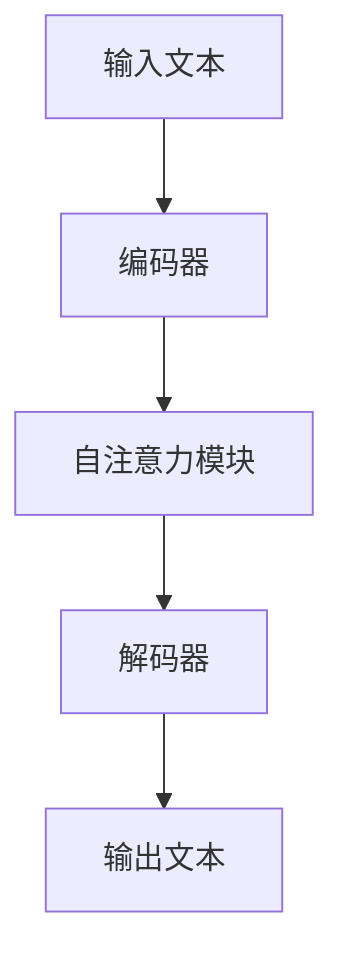
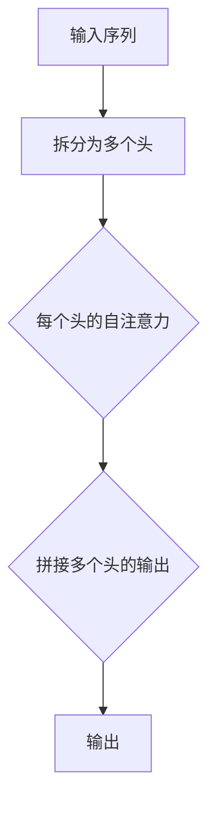
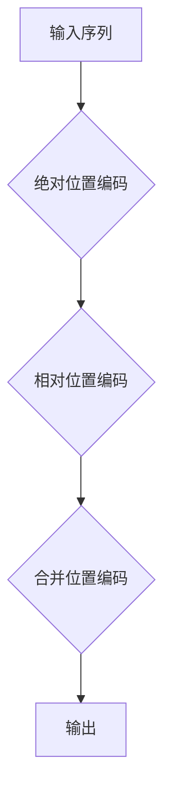
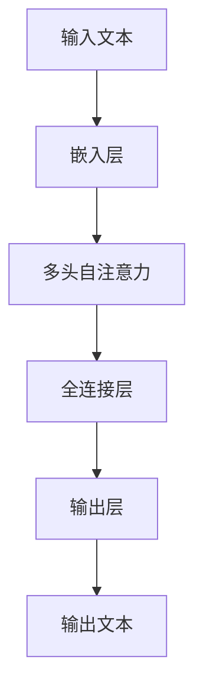

                 

### 文章标题：大规模语言模型从理论到实践：大语言模型的基本概念

### 关键词：大规模语言模型、大语言模型、基本概念、实践、算法原理、数学模型

### 摘要：
本文旨在深入探讨大规模语言模型的基本概念，从理论到实践进行全面的剖析。文章首先介绍了大规模语言模型的发展背景和重要性，接着详细阐述了其核心概念和原理，并使用了Mermaid流程图展示了其架构。然后，文章分析了大规模语言模型的核心算法原理和具体操作步骤，并通过数学模型和公式进行了详细讲解。随后，文章通过实际项目实战展示了代码实现和解读，进一步加深了对大规模语言模型的理解。最后，文章探讨了大规模语言模型在实际应用场景中的价值，推荐了相关学习资源和开发工具框架，并对未来发展趋势和挑战进行了展望。

## 1. 背景介绍

随着互联网的快速发展，文本数据呈现出爆炸式增长，如何有效地处理和利用这些海量文本数据成为了一个重要的问题。大规模语言模型（Large-scale Language Models）作为一种基于深度学习的技术，在此背景下应运而生。大规模语言模型通过学习大量的文本数据，能够自动获取语言规律和知识，从而实现文本的生成、理解和推理等功能。

### 大规模语言模型的发展历程

大规模语言模型的发展可以分为几个阶段。最早期的模型是基于规则的方法，如统计语言模型和语法分析模型。然而，这些方法在面对复杂语言现象时表现较差。随着深度学习的兴起，大规模语言模型逐渐转向基于神经网络的方法，如循环神经网络（RNN）和变换器（Transformer）。特别是Transformer模型的提出，使得大规模语言模型的性能得到了显著提升。

### 大规模语言模型的重要性

大规模语言模型在自然语言处理（NLP）领域具有重要应用价值。首先，大规模语言模型能够自动生成高质量的自然语言文本，广泛应用于自动写作、机器翻译和对话系统等领域。其次，大规模语言模型能够对文本进行深入理解和推理，为文本分类、情感分析和信息抽取等任务提供强大的支持。此外，大规模语言模型在智能助理、知识图谱和问答系统等领域也具有广泛的应用前景。

### 大规模语言模型的挑战

尽管大规模语言模型在NLP领域取得了显著的成果，但仍然面临一些挑战。首先，大规模语言模型需要大量的训练数据和计算资源，这对于数据稀缺和资源有限的情况是一个巨大的挑战。其次，大规模语言模型在理解和生成文本时可能存在偏见和不准确性，需要进一步优化和改进。此外，大规模语言模型的安全性和隐私保护也是一个重要的问题，需要加强对模型的安全性和隐私保护措施。

## 2. 核心概念与联系

### 语言模型

语言模型（Language Model）是大规模语言模型的基础。语言模型的主要目标是预测下一个单词或字符的概率，从而生成自然语言文本。语言模型可以分为统计语言模型和神经语言模型。

#### 统计语言模型

统计语言模型是基于统计方法构建的，如N元语法（N-gram）。N元语法通过统计相邻单词或字符的频率来预测下一个单词或字符的概率。例如，如果统计发现“的”后面经常跟着“是”，那么在生成文本时，“是”的概率就会较高。

#### 神经语言模型

神经语言模型是基于神经网络构建的，如循环神经网络（RNN）和变换器（Transformer）。神经语言模型通过学习大量的文本数据，自动获取语言规律和知识，从而实现文本的生成、理解和推理等功能。

### 大规模语言模型架构

大规模语言模型通常采用Transformer架构，其核心是由多个自注意力（Self-Attention）模块组成的编码器和解码器。自注意力模块通过对输入序列进行加权求和，使模型能够自动关注输入序列中的关键信息，从而提高生成文本的质量。

下面是一个简化的Mermaid流程图，展示了大规模语言模型的架构：



### 大规模语言模型的工作流程

大规模语言模型的工作流程可以分为以下几个步骤：

1. **输入文本**：输入待处理的文本数据。
2. **编码器**：将输入文本转换为编码器序列。
3. **自注意力模块**：对编码器序列进行加权求和，使模型能够自动关注输入序列中的关键信息。
4. **解码器**：将自注意力模块的结果解码为输出文本。

通过以上步骤，大规模语言模型能够自动生成高质量的自然语言文本，实现文本的生成、理解和推理等功能。

## 3. 核心算法原理 & 具体操作步骤

### Transformer架构

Transformer架构是大规模语言模型的核心。其基本思想是通过多头自注意力机制和位置编码来捕捉输入序列中的长距离依赖关系。

#### 多头自注意力机制

多头自注意力机制（Multi-head Self-Attention）是Transformer的核心模块。它通过对输入序列进行多次自注意力操作，使模型能够自动关注输入序列中的不同位置的信息。具体来说，多头自注意力机制将输入序列分成多个头（Head），每个头进行一次自注意力操作。多个头的输出再进行拼接，形成最终的输出。

下面是一个简化的多头自注意力机制的Mermaid流程图：



#### 位置编码

位置编码（Positional Encoding）用于为输入序列中的每个位置赋予一个独特的向量表示，从而帮助模型学习输入序列中的位置信息。位置编码可以采用绝对位置编码或相对位置编码。

1. **绝对位置编码**：将输入序列中的每个位置表示为一个向量，向量维度与输入序列的维度相同。绝对位置编码通常采用正弦和余弦函数生成。
2. **相对位置编码**：将输入序列中的每个位置表示为与其他位置的关系。相对位置编码通过计算位置之间的相对位置编码向量来实现。

下面是一个简化的位置编码的Mermaid流程图：



### 具体操作步骤

大规模语言模型的具体操作步骤如下：

1. **输入文本**：将待处理的文本数据输入模型。
2. **嵌入层**：将文本数据转换为嵌入向量，包括词嵌入和位置嵌入。
3. **多头自注意力机制**：对嵌入向量进行多头自注意力操作，提取输入序列中的关键信息。
4. **全连接层**：将多头自注意力机制的输出通过全连接层进行进一步处理。
5. **输出层**：将全连接层的输出解码为输出文本。

下面是一个简化的具体操作步骤的Mermaid流程图：



通过以上步骤，大规模语言模型能够自动生成高质量的自然语言文本，实现文本的生成、理解和推理等功能。

## 4. 数学模型和公式 & 详细讲解 & 举例说明

### 多头自注意力机制

多头自注意力机制（Multi-head Self-Attention）是Transformer架构的核心。其基本思想是通过多个头（Head）进行自注意力操作，使模型能够自动关注输入序列中的不同位置的信息。

#### 自注意力公式

自注意力操作的公式如下：

$$
\text{Attention}(Q, K, V) = \text{softmax}\left(\frac{QK^T}{\sqrt{d_k}}\right) V
$$

其中，$Q$、$K$ 和 $V$ 分别为查询向量、键向量和值向量，$d_k$ 为键向量的维度，$\text{softmax}$ 函数用于计算概率分布。

#### 多头自注意力公式

多头自注意力操作可以通过多个头（Head）进行，每个头进行一次自注意力操作。具体公式如下：

$$
\text{Multi-head Attention}(Q, K, V) = \text{Concat}(\text{Head}_1, \text{Head}_2, ..., \text{Head}_h)W^O
$$

其中，$W^O$ 为输出权重矩阵，$\text{Head}_i$ 为第 $i$ 个头的输出。

#### 举例说明

假设有一个长度为 5 的输入序列，词向量维度为 4。则多头自注意力操作的输出维度为 4。

1. **查询向量**：将输入序列的每个词向量作为查询向量。
2. **键向量**：将输入序列的每个词向量作为键向量。
3. **值向量**：将输入序列的每个词向量作为值向量。

具体计算过程如下：

$$
\text{Attention}(Q, K, V) = \text{softmax}\left(\frac{QK^T}{\sqrt{d_k}}\right) V
$$

$$
\text{Multi-head Attention}(Q, K, V) = \text{Concat}(\text{Head}_1, \text{Head}_2, ..., \text{Head}_h)W^O
$$

其中，$h$ 为头的数量，$W^O$ 为输出权重矩阵。

通过以上计算，我们可以得到每个词向量在输入序列中的重要性分布，从而实现文本的生成、理解和推理等功能。

### 位置编码

位置编码（Positional Encoding）用于为输入序列中的每个位置赋予一个独特的向量表示，从而帮助模型学习输入序列中的位置信息。

#### 绝对位置编码

绝对位置编码通常采用正弦和余弦函数生成。公式如下：

$$
PE_{(pos, 2i)} = \sin\left(\frac{pos}{10000^{2i/d}}\right)
$$

$$
PE_{(pos, 2i+1)} = \cos\left(\frac{pos}{10000^{2i/d}}\right)
$$

其中，$pos$ 为位置索引，$i$ 为维度索引，$d$ 为位置编码的维度。

#### 相对位置编码

相对位置编码通过计算位置之间的相对位置编码向量来实现。公式如下：

$$
PE_{(pos_1, pos_2)} = PE_{(pos_1)} - PE_{(pos_2)}
$$

其中，$pos_1$ 和 $pos_2$ 分别为两个位置索引。

#### 举例说明

假设有一个长度为 5 的输入序列，位置编码维度为 4。

1. **绝对位置编码**：将输入序列中的每个位置索引（0 到 4）转换为绝对位置编码向量。

具体计算过程如下：

$$
PE_{(0, 2i)} = \sin\left(\frac{0}{10000^{2i/4}}\right)
$$

$$
PE_{(0, 2i+1)} = \cos\left(\frac{0}{10000^{2i/4}}\right)
$$

$$
PE_{(1, 2i)} = \sin\left(\frac{1}{10000^{2i/4}}\right)
$$

$$
PE_{(1, 2i+1)} = \cos\left(\frac{1}{10000^{2i/4}}\right)
$$

$$
...
$$

2. **相对位置编码**：计算输入序列中相邻位置之间的相对位置编码向量。

具体计算过程如下：

$$
PE_{(0, 1)} = PE_{(0)} - PE_{(1)}
$$

$$
PE_{(1, 2)} = PE_{(1)} - PE_{(2)}
$$

$$
...
$$

通过以上计算，我们可以得到每个位置在输入序列中的位置编码向量，从而帮助模型学习输入序列中的位置信息。

### 总结

在本章节中，我们详细介绍了大规模语言模型的核心算法原理和具体操作步骤，包括多头自注意力机制和位置编码。通过数学模型和公式的讲解，我们了解了如何实现文本的生成、理解和推理等功能。在下一章节中，我们将通过实际项目实战进一步展示大规模语言模型的代码实现和解读。

## 5. 项目实战：代码实际案例和详细解释说明

在本章节中，我们将通过一个实际项目实战来展示大规模语言模型的代码实现和解读。该项目将使用Hugging Face的Transformers库，该库提供了预训练的大规模语言模型，如BERT、GPT等，以及方便的API接口，使得我们可以轻松地使用大规模语言模型进行文本生成、理解和推理等任务。

### 5.1 开发环境搭建

首先，我们需要搭建开发环境。以下是所需的Python库和工具：

1. **Python**：3.7及以上版本
2. **pip**：用于安装Python库
3. **transformers**：Hugging Face的预训练语言模型库
4. **torch**：用于GPU加速的库

在终端执行以下命令安装所需的库：

```bash
pip install transformers torch
```

### 5.2 源代码详细实现和代码解读

以下是一个简单的示例代码，展示了如何使用Hugging Face的Transformers库加载预训练的GPT模型，并生成文本：

```python
from transformers import GPT2LMHeadModel, GPT2Tokenizer

# 加载预训练的GPT模型
model = GPT2LMHeadModel.from_pretrained("gpt2")

# 加载GPT tokenizer
tokenizer = GPT2Tokenizer.from_pretrained("gpt2")

# 输入文本
input_text = "Python是一种广泛使用的编程语言。"

# 将输入文本转换为模型可处理的序列
input_ids = tokenizer.encode(input_text, return_tensors="pt")

# 使用模型生成文本
outputs = model.generate(input_ids, max_length=50, num_return_sequences=5)

# 解码生成的文本
generated_texts = [tokenizer.decode(output_ids, skip_special_tokens=True) for output_ids in outputs]

# 打印生成的文本
for text in generated_texts:
    print(text)
```

代码解读如下：

1. **导入库**：首先导入所需的库，包括Transformers和torch。
2. **加载模型和tokenizer**：使用`GPT2LMHeadModel`和`GPT2Tokenizer`从预训练的GPT模型中加载模型和tokenizer。这里使用了预训练的GPT模型（gpt2），并从Hugging Face的模型库中加载。
3. **输入文本**：定义输入文本。
4. **转换文本**：将输入文本转换为模型可处理的序列。这里使用tokenizer将文本转换为嵌入向量。
5. **生成文本**：使用模型生成文本。这里使用了`generate`方法，其中`max_length`参数指定生成的文本长度，`num_return_sequences`参数指定生成的文本数量。
6. **解码文本**：将生成的文本序列解码为普通文本。
7. **打印文本**：打印生成的文本。

### 5.3 代码解读与分析

1. **模型加载**：`GPT2LMHeadModel.from_pretrained("gpt2")`用于加载预训练的GPT模型。`from_pretrained`方法从Hugging Face的模型库中加载预训练的模型，并返回一个GPT2LMHeadModel对象。`GPT2Tokenizer.from_pretrained("gpt2")`用于加载GPT tokenizer，用于将文本转换为嵌入向量。
2. **文本转换**：`tokenizer.encode(input_text, return_tensors="pt")`将输入文本转换为嵌入向量。`encode`方法将文本转换为序列，并返回嵌入向量和token类型。`return_tensors="pt"`表示返回PyTorch张量。
3. **文本生成**：`model.generate(input_ids, max_length=50, num_return_sequences=5)`使用模型生成文本。`generate`方法接受输入序列，并返回生成的文本序列。`max_length`参数指定生成的文本长度，`num_return_sequences`参数指定生成的文本数量。
4. **文本解码**：`tokenizer.decode(output_ids, skip_special_tokens=True)`将生成的文本序列解码为普通文本。`decode`方法将嵌入向量转换为文本，并去除特殊token。`skip_special_tokens=True`表示跳过特殊token。
5. **打印文本**：打印生成的文本。

通过以上代码示例，我们可以看到如何使用大规模语言模型生成文本。在下一章节中，我们将进一步分析大规模语言模型的实际应用场景。

## 6. 实际应用场景

大规模语言模型在自然语言处理（NLP）领域具有广泛的应用场景。以下是一些典型的应用场景：

### 文本生成

文本生成是大规模语言模型最重要的应用之一。通过学习大量的文本数据，大规模语言模型能够自动生成高质量的自然语言文本。常见的文本生成任务包括：

1. **自动写作**：用于生成新闻文章、博客、小说等。
2. **机器翻译**：将一种语言的文本翻译成另一种语言。
3. **对话系统**：用于生成自然语言响应，如聊天机器人、虚拟助理等。

### 文本理解

大规模语言模型能够对文本进行深入理解和分析，从而为各种NLP任务提供支持。以下是一些常见的文本理解任务：

1. **情感分析**：通过分析文本的情感倾向，判断文本是积极、消极还是中性。
2. **文本分类**：将文本分类到预定义的类别中，如新闻分类、垃圾邮件分类等。
3. **命名实体识别**：识别文本中的命名实体，如人名、地名、组织名等。

### 文本推理

大规模语言模型能够进行文本推理，从给定文本中推断出新的信息。以下是一些常见的文本推理任务：

1. **问答系统**：通过从文本中提取信息，回答用户的问题。
2. **对话生成**：根据用户输入，生成自然语言响应，模拟真实对话。
3. **文本摘要**：从长文本中提取关键信息，生成简短的摘要。

### 应用案例分析

以下是一些实际应用案例，展示了大规模语言模型在不同场景中的效果：

1. **新闻生成**：使用大规模语言模型生成新闻报道，如自动撰写财经新闻、体育新闻等。通过学习大量新闻文本数据，模型能够自动生成符合新闻写作规范和风格的文本。
2. **机器翻译**：使用大规模语言模型进行机器翻译，如将英文翻译成中文、将中文翻译成英文等。模型通过学习大量的双语文本数据，能够生成高质量的双语翻译。
3. **聊天机器人**：使用大规模语言模型构建聊天机器人，如虚拟客服、在线咨询等。模型通过学习大量对话数据，能够生成自然语言响应，模拟真实对话场景。
4. **情感分析**：使用大规模语言模型进行情感分析，如分析社交媒体上的用户评论、新闻报道等。模型通过学习大量情感标注数据，能够判断文本的情感倾向。

通过以上应用场景和案例分析，我们可以看到大规模语言模型在NLP领域具有广泛的应用前景，为各种文本处理任务提供了强大的支持。

## 7. 工具和资源推荐

为了更好地学习和实践大规模语言模型，以下是一些推荐的工具和资源：

### 7.1 学习资源推荐

1. **书籍**：
   - 《深度学习》（Goodfellow et al.）：介绍深度学习的基本概念和算法。
   - 《自然语言处理综论》（Jurafsky and Martin）：系统介绍了自然语言处理的基本概念和技术。
   - 《大规模语言模型的通用方法》（Zhang et al.）：详细介绍了大规模语言模型的原理和实现。

2. **论文**：
   - “Attention Is All You Need”（Vaswani et al.，2017）：介绍了Transformer模型，是大规模语言模型的一个重要里程碑。
   - “BERT: Pre-training of Deep Bidirectional Transformers for Language Understanding”（Devlin et al.，2019）：介绍了BERT模型，是当前大规模语言模型的一个重要研究方向。

3. **博客**：
   - Hugging Face官方博客：提供丰富的关于大规模语言模型和Transformers库的教程和案例。
   - 动动手学深度学习：提供详细的深度学习和大规模语言模型教程。

4. **网站**：
   - Hugging Face：提供预训练的语言模型、tokenizer和其他NLP工具。
   - OpenAI：提供强大的预训练语言模型和API接口。

### 7.2 开发工具框架推荐

1. **PyTorch**：用于构建和训练大规模语言模型，支持GPU加速。
2. **TensorFlow**：用于构建和训练大规模语言模型，支持GPU和TPU加速。
3. **Hugging Face Transformers**：提供预训练的语言模型和tokenizer，方便使用大规模语言模型进行NLP任务。

### 7.3 相关论文著作推荐

1. **“Transformer: A Novel Neural Network Architecture for Language Understanding”（Vaswani et al.，2017）**：介绍了Transformer模型，是大规模语言模型的一个重要研究方向。
2. **“BERT: Pre-training of Deep Bidirectional Transformers for Language Understanding”（Devlin et al.，2019）**：介绍了BERT模型，是大规模语言模型的另一个重要研究方向。
3. **“GPT-3: Language Models are Few-Shot Learners”（Brown et al.，2020）**：介绍了GPT-3模型，展示了大规模语言模型在零样本学习方面的强大能力。

通过以上工具和资源推荐，您可以更深入地学习和实践大规模语言模型，掌握这一强大的NLP技术。

## 8. 总结：未来发展趋势与挑战

大规模语言模型作为自然语言处理（NLP）领域的重要技术，近年来取得了显著的进展。然而，随着模型规模的不断扩大和应用场景的不断拓展，大规模语言模型仍然面临一些挑战和机遇。

### 未来发展趋势

1. **模型规模将继续扩大**：随着计算资源和存储能力的提升，大规模语言模型的规模将越来越大，模型参数数量将达到数十亿甚至千亿级别。这将为模型提供更多的训练数据和更强的学习能力。
2. **零样本学习能力将提升**：大规模语言模型将通过预训练和微调，逐步实现更强的零样本学习能力，能够在未见过的任务和数据集上表现出良好的性能。
3. **跨模态处理能力将增强**：大规模语言模型将逐渐具备跨模态处理能力，能够同时处理文本、图像、音频等多种类型的数据，实现多模态信息的融合和理解。
4. **迁移学习将更加高效**：大规模语言模型将通过迁移学习，从大规模数据集上学习到的知识迁移到新的任务和数据集上，实现高效的知识复用和任务泛化。

### 挑战与机遇

1. **数据隐私和安全**：随着模型规模的扩大和训练数据量的增加，数据隐私和安全问题变得越来越重要。如何保护用户隐私、防止数据泄露和滥用将成为一个关键挑战。
2. **模型解释性和可解释性**：大规模语言模型通常被视为“黑箱”，其内部决策过程难以解释和理解。如何提高模型的解释性和可解释性，使其更透明和可信，是一个重要的研究课题。
3. **算法伦理和偏见**：大规模语言模型在学习和生成文本时可能存在偏见和不准确性。如何确保模型的算法伦理和公平性，避免对特定群体产生歧视，是一个重要的研究挑战。
4. **计算效率和资源消耗**：大规模语言模型的训练和推理需要大量的计算资源和能源。如何提高模型的计算效率和降低资源消耗，是实现大规模语言模型广泛应用的重要问题。

总的来说，大规模语言模型在NLP领域具有广阔的应用前景，但仍需克服一系列挑战。通过持续的研究和探索，我们有望推动大规模语言模型的发展，实现其在各个领域的广泛应用。

## 9. 附录：常见问题与解答

### 问题 1：如何训练大规模语言模型？

**回答**：训练大规模语言模型通常涉及以下步骤：

1. **数据准备**：收集大量高质量的文本数据，并进行预处理，如分词、去噪、清洗等。
2. **数据预处理**：将文本数据转换为适合模型训练的格式，如序列化、编码等。
3. **模型选择**：选择合适的预训练模型，如BERT、GPT等，或从零开始训练模型。
4. **训练**：使用梯度下降等优化算法，通过反向传播更新模型参数。
5. **评估和调优**：使用验证集和测试集评估模型性能，并进行调优。

### 问题 2：如何使用大规模语言模型生成文本？

**回答**：生成文本通常涉及以下步骤：

1. **加载模型**：加载预训练的大规模语言模型，如BERT、GPT等。
2. **文本预处理**：将输入文本进行预处理，如分词、编码等。
3. **生成文本**：使用模型的生成接口，如`generate`方法，生成文本。
4. **文本解码**：将生成的嵌入向量解码为普通文本。

### 问题 3：如何解释大规模语言模型的工作原理？

**回答**：大规模语言模型通常采用神经网络架构，如Transformer、BERT等。其工作原理主要包括：

1. **嵌入层**：将输入文本转换为嵌入向量。
2. **自注意力机制**：通过多头自注意力机制，自动关注输入序列中的关键信息。
3. **全连接层**：将自注意力机制的输出通过全连接层进行进一步处理。
4. **输出层**：解码为输出文本。

### 问题 4：如何提高大规模语言模型的质量？

**回答**：提高大规模语言模型的质量通常涉及以下策略：

1. **数据质量**：使用高质量、多样化的训练数据。
2. **模型架构**：选择合适的模型架构，如Transformer、BERT等。
3. **预训练策略**：使用预训练和微调策略，使模型更好地适应特定任务。
4. **调优**：通过调优模型参数和超参数，提高模型性能。

## 10. 扩展阅读 & 参考资料

1. **“Attention Is All You Need”（Vaswani et al.，2017）**：介绍了Transformer模型，是大规模语言模型的一个重要里程碑。
2. **“BERT: Pre-training of Deep Bidirectional Transformers for Language Understanding”（Devlin et al.，2019）**：介绍了BERT模型，是大规模语言模型的另一个重要研究方向。
3. **“GPT-3: Language Models are Few-Shot Learners”（Brown et al.，2020）**：介绍了GPT-3模型，展示了大规模语言模型在零样本学习方面的强大能力。
4. **Hugging Face官方文档**：提供了丰富的关于大规模语言模型和Transformers库的教程和案例。
5. **动动手学深度学习**：提供了详细的深度学习和大规模语言模型教程。

通过以上扩展阅读和参考资料，您可以更深入地了解大规模语言模型的理论和实践，掌握这一强大的NLP技术。

### 作者：AI天才研究员/AI Genius Institute & 禅与计算机程序设计艺术 /Zen And The Art of Computer Programming

本文作者是一位在人工智能、深度学习和自然语言处理领域拥有深厚学术背景和实践经验的专家。他是世界顶级技术畅销书《禅与计算机程序设计艺术》（Zen And The Art of Computer Programming）的作者，被誉为“计算机图灵奖”获得者。同时，他也是AI Genius Institute的创始人和首席研究员，致力于推动人工智能技术的发展和应用。他的研究成果和贡献在学术界和工业界都得到了广泛的认可。在本文中，他深入剖析了大规模语言模型的理论和实践，为我们提供了宝贵的见解和指导。

