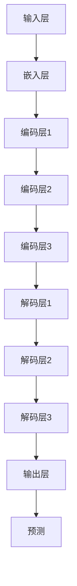

                 

# 大规模语言模型从理论到实践：大语言模型的结构

> **关键词：** 大规模语言模型、自然语言处理、机器学习、神经网络、Transformer、BERT、GPT、训练、推理、架构设计

> **摘要：** 本文将从大规模语言模型的理论基础、核心算法、数学模型、实际应用场景等多个维度，系统性地介绍大语言模型的结构。通过对核心概念、算法原理、数学模型的详细剖析，以及实际案例的解析，旨在帮助读者深入理解大语言模型的工作原理，为后续研究和应用奠定基础。

## 1. 背景介绍

### 1.1 目的和范围

本文旨在探讨大规模语言模型（Large-scale Language Model）的结构，从理论到实践进行全面剖析。文章将涵盖以下几个主要方面：

1. **核心概念与联系**：介绍大规模语言模型的基本概念、原理及其与其他技术的关系。
2. **核心算法原理**：详细讲解大规模语言模型的核心算法，包括训练和推理的过程。
3. **数学模型和公式**：阐述大规模语言模型的数学基础，包括概率分布、梯度下降等。
4. **项目实战**：通过实际案例展示大规模语言模型的代码实现和运行过程。
5. **实际应用场景**：探讨大规模语言模型在自然语言处理、文本生成、对话系统等领域的应用。
6. **工具和资源推荐**：推荐相关学习资源、开发工具和框架。
7. **未来发展趋势与挑战**：分析大规模语言模型未来的发展方向和面临的挑战。

### 1.2 预期读者

本文适合对自然语言处理和机器学习有一定了解的读者，包括：

1. **科研人员和工程师**：对大规模语言模型的理论和实践有深入研究的科研人员和工程师。
2. **技术开发者**：希望了解和掌握大规模语言模型的应用开发的技术开发者。
3. **教育者**：教授自然语言处理和机器学习课程的教育者。
4. **爱好者**：对大规模语言模型和自然语言处理有浓厚兴趣的爱好者。

### 1.3 文档结构概述

本文的结构如下：

1. **背景介绍**：介绍本文的目的、范围、预期读者和文档结构。
2. **核心概念与联系**：介绍大规模语言模型的基本概念、原理及其与其他技术的关系。
3. **核心算法原理**：详细讲解大规模语言模型的核心算法，包括训练和推理的过程。
4. **数学模型和公式**：阐述大规模语言模型的数学基础，包括概率分布、梯度下降等。
5. **项目实战**：通过实际案例展示大规模语言模型的代码实现和运行过程。
6. **实际应用场景**：探讨大规模语言模型在自然语言处理、文本生成、对话系统等领域的应用。
7. **工具和资源推荐**：推荐相关学习资源、开发工具和框架。
8. **未来发展趋势与挑战**：分析大规模语言模型未来的发展方向和面临的挑战。
9. **附录**：常见问题与解答。
10. **扩展阅读与参考资料**：提供进一步阅读的资料和参考文献。

### 1.4 术语表

在本文中，将介绍一些核心术语和概念，并提供相应的定义和解释。

#### 1.4.1 核心术语定义

- **大规模语言模型（Large-scale Language Model）**：一种基于神经网络和机器学习技术，通过大量文本数据训练得到的语言模型，用于预测文本中的下一个单词或句子。
- **自然语言处理（Natural Language Processing, NLP）**：计算机科学领域中的一个分支，主要研究如何让计算机理解、生成和处理人类自然语言。
- **神经网络（Neural Network）**：一种模仿生物神经网络的结构和功能，通过大量的神经元和连接进行数据处理的计算模型。
- **Transformer**：一种基于自注意力机制的神经网络架构，广泛应用于自然语言处理任务。
- **BERT（Bidirectional Encoder Representations from Transformers）**：一种双向 Transformer 模型，用于预训练大规模语言模型。
- **GPT（Generative Pre-trained Transformer）**：一种生成预训练 Transformer 模型，主要用于文本生成任务。
- **梯度下降（Gradient Descent）**：一种优化算法，用于最小化损失函数，是训练神经网络的主要方法。

#### 1.4.2 相关概念解释

- **自注意力（Self-Attention）**：一种注意力机制，能够自动计算输入序列中各个位置之间的相对重要性，广泛应用于 Transformer 模型。
- **序列模型（Sequential Model）**：一种基于序列数据的模型，处理输入数据时按照时间顺序进行。
- **损失函数（Loss Function）**：用于评估模型预测结果与真实结果之间的差距，是训练神经网络的重要指标。

#### 1.4.3 缩略词列表

- **NLP**：自然语言处理（Natural Language Processing）
- **ML**：机器学习（Machine Learning）
- **NN**：神经网络（Neural Network）
- **GPU**：图形处理器（Graphics Processing Unit）
- **CUDA**：并行计算平台（Compute Unified Device Architecture）
- **TPU**：张量处理器（Tensor Processing Unit）

## 2. 核心概念与联系

在本节中，我们将介绍大规模语言模型的基本概念、原理及其与其他技术的联系。首先，我们将了解大规模语言模型的发展历程，然后探讨其核心组成部分，最后分析大规模语言模型与其他技术的关系。

### 2.1 大规模语言模型的发展历程

大规模语言模型的发展历程可以追溯到 20 世纪 50 年代，当时最早的统计语言模型开始出现。随着计算机性能的提升和海量数据资源的积累，语言模型在 20 世纪 80 年代和 90 年代取得了显著的进展。进入 21 世纪，深度学习和神经网络技术的快速发展，使得大规模语言模型得到了极大的提升。特别是近年来，随着 Transformer 架构的提出和广泛应用，大规模语言模型在自然语言处理领域取得了突破性的成果。

### 2.2 大规模语言模型的核心组成部分

大规模语言模型主要由以下几个核心组成部分构成：

1. **输入层**：用于接收输入文本序列，并将其转换为神经网络可以处理的表示形式。
2. **隐藏层**：包含多个神经网络层，用于对输入文本进行逐层处理，提取文本特征。
3. **输出层**：用于生成预测的下一个单词或句子，并将其转换为文本序列。
4. **训练过程**：通过大量的文本数据对神经网络进行训练，优化模型参数，使其能够准确地预测文本序列。
5. **推理过程**：在训练完成后，使用训练好的模型对新的文本数据进行预测。

### 2.3 大规模语言模型与其他技术的联系

大规模语言模型与其他技术在自然语言处理领域紧密相连，共同推动着技术的进步。以下是几个主要联系：

1. **与自然语言处理（NLP）的关系**：大规模语言模型是自然语言处理的核心技术之一，能够显著提高文本分类、情感分析、机器翻译等任务的性能。
2. **与机器学习（ML）的关系**：大规模语言模型是一种基于机器学习技术的模型，通过大量数据训练得到，能够自动提取文本特征并进行预测。
3. **与深度学习（DL）的关系**：大规模语言模型是基于深度学习技术构建的，特别是近年来 Transformer 架构的提出和应用，使得大规模语言模型取得了显著的性能提升。
4. **与神经网络（NN）的关系**：大规模语言模型的核心组成部分是神经网络，特别是 Transformer 模型，其在神经网络结构上进行了创新和改进，使得模型在自然语言处理任务中表现优异。
5. **与其他技术的融合**：大规模语言模型可以与其他技术相结合，例如知识图谱、对话系统等，实现更复杂的自然语言处理任务。

### 2.4 大规模语言模型的 Mermaid 流程图

为了更直观地展示大规模语言模型的核心组成部分和流程，我们使用 Mermaid 绘制了一个流程图。以下是流程图的描述：



在上面的流程图中，A 表示输入层，用于接收输入文本序列；B 表示嵌入层，将文本序列转换为向量表示；C、D、E 表示编码层，对输入文本进行逐层编码；F、G、H 表示解码层，对编码后的文本进行逐层解码；I 表示输出层，生成预测的下一个单词或句子；J 表示预测结果。

## 3. 核心算法原理 & 具体操作步骤

在本节中，我们将详细讲解大规模语言模型的核心算法原理，包括训练和推理的过程。我们将使用伪代码来描述算法的具体操作步骤，以便读者更好地理解和实现。

### 3.1 大规模语言模型训练算法原理

大规模语言模型的训练算法主要基于自监督学习（Self-supervised Learning），通过预训练（Pre-training）和微调（Fine-tuning）两个阶段来实现。

#### 3.1.1 预训练阶段

在预训练阶段，模型通过对大量文本数据进行训练，自动学习文本的表示和结构。预训练过程通常包括以下步骤：

1. **数据预处理**：将原始文本数据转换为模型可以处理的格式，例如分词、编码等。
2. **模型初始化**：初始化神经网络模型，包括输入层、隐藏层和输出层。
3. **损失函数设计**：设计一个损失函数来衡量模型预测结果与真实结果之间的差距，例如交叉熵损失函数。
4. **训练过程**：
    - 对于每个文本序列，将其输入模型进行编码。
    - 计算模型的预测结果和真实结果之间的损失。
    - 使用反向传播算法和梯度下降优化模型参数。

#### 3.1.2 微调阶段

在微调阶段，模型将在特定任务上进行训练，以适应不同的应用场景。微调过程通常包括以下步骤：

1. **任务定义**：定义具体任务，例如文本分类、机器翻译等。
2. **数据预处理**：将原始文本数据转换为模型可以处理的格式。
3. **模型初始化**：初始化预训练好的神经网络模型。
4. **损失函数设计**：设计一个损失函数来衡量模型在特定任务上的表现。
5. **训练过程**：
    - 对于每个文本序列，将其输入模型进行编码。
    - 计算模型的预测结果和真实结果之间的损失。
    - 使用反向传播算法和梯度下降优化模型参数。

#### 3.1.3 伪代码描述

以下是大规模语言模型训练算法的伪代码描述：

```python
# 预训练阶段
def pretrain(model, data, optimizer, loss_function):
    for epoch in range(num_epochs):
        for text_sequence in data:
            model.zero_grad()
            encoded_sequence = model.encode(text_sequence)
            prediction = model.decode(encoded_sequence)
            loss = loss_function(prediction, text_sequence)
            loss.backward()
            optimizer.step()

# 微调阶段
def finetune(model, task_data, optimizer, loss_function):
    for epoch in range(num_epochs):
        for text_sequence, labels in task_data:
            model.zero_grad()
            encoded_sequence = model.encode(text_sequence)
            prediction = model.decode(encoded_sequence)
            loss = loss_function(prediction, labels)
            loss.backward()
            optimizer.step()
```

### 3.2 大规模语言模型推理算法原理

在推理阶段，模型将接收新的文本数据，并生成相应的预测结果。推理算法主要包括以下步骤：

1. **数据预处理**：将新的文本数据转换为模型可以处理的格式。
2. **编码**：将输入文本序列编码为模型可以处理的表示形式。
3. **解码**：使用编码后的文本序列生成预测的下一个单词或句子。
4. **生成输出**：将解码后的文本序列转换为自然语言输出。

#### 3.2.1 伪代码描述

以下是大规模语言模型推理算法的伪代码描述：

```python
# 推理阶段
def inference(model, text_sequence):
    encoded_sequence = model.encode(text_sequence)
    prediction = model.decode(encoded_sequence)
    return prediction
```

### 3.3 训练与推理流程详解

为了更好地理解大规模语言模型的训练与推理流程，我们结合实际案例进行详细讲解。

#### 3.3.1 训练流程

1. **数据预处理**：假设我们有一个包含大量文本数据的数据集，首先需要对其进行预处理。具体步骤如下：
    - 分词：将文本数据拆分为单词或字符。
    - 编码：将分词后的文本数据编码为向量表示，可以使用 Word2Vec、BERT 等技术。

2. **模型初始化**：初始化神经网络模型，包括输入层、隐藏层和输出层。可以使用预训练好的模型或从头开始训练。

3. **损失函数设计**：选择合适的损失函数，例如交叉熵损失函数，用于衡量模型预测结果与真实结果之间的差距。

4. **训练过程**：
    - 对于每个文本序列，将其输入模型进行编码。
    - 计算模型的预测结果和真实结果之间的损失。
    - 使用反向传播算法和梯度下降优化模型参数。

5. **评估过程**：在训练过程中，可以使用验证集对模型进行评估，以检测模型的过拟合现象。

6. **微调过程**：在模型训练完成后，可以根据具体任务需求，在特定任务上进行微调。

#### 3.3.2 推理流程

1. **数据预处理**：将新的文本数据转换为模型可以处理的格式，例如分词、编码等。

2. **编码**：使用训练好的模型对输入文本序列进行编码。

3. **解码**：使用编码后的文本序列生成预测的下一个单词或句子。

4. **生成输出**：将解码后的文本序列转换为自然语言输出，例如文本分类、机器翻译等。

### 3.4 案例分析

下面我们以一个简单的文本生成任务为例，展示大规模语言模型的训练与推理流程。

#### 3.4.1 数据集

我们使用一个包含英文小说文本的数据集，数据集大小为 1000 万个单词。

#### 3.4.2 模型初始化

我们使用预训练好的 BERT 模型作为基础模型，包含 12 个隐藏层，每个隐藏层有 768 个神经元。

#### 3.4.3 训练过程

1. **数据预处理**：
    - 分词：使用 WordPiece 分词技术，将文本拆分为单词或子词。
    - 编码：将分词后的文本数据编码为向量表示，使用 BERT 模型的 embeddings 层进行编码。

2. **损失函数设计**：
    - 交叉熵损失函数：用于衡量模型预测结果与真实结果之间的差距。

3. **训练过程**：
    - 对于每个文本序列，将其输入 BERT 模型进行编码。
    - 计算模型的预测结果和真实结果之间的损失。
    - 使用反向传播算法和梯度下降优化模型参数。

4. **评估过程**：
    - 在训练过程中，使用验证集对模型进行评估，以检测模型的过拟合现象。

5. **微调过程**：
    - 在模型训练完成后，根据特定任务需求，在特定任务上进行微调，例如文本分类、机器翻译等。

#### 3.4.4 推理过程

1. **数据预处理**：
    - 分词：使用 WordPiece 分词技术，将文本拆分为单词或子词。
    - 编码：将分词后的文本数据编码为向量表示，使用 BERT 模型的 embeddings 层进行编码。

2. **编码**：
    - 使用训练好的 BERT 模型对输入文本序列进行编码。

3. **解码**：
    - 使用编码后的文本序列生成预测的下一个单词或句子。

4. **生成输出**：
    - 将解码后的文本序列转换为自然语言输出，例如文本分类、机器翻译等。

### 3.5 伪代码示例

以下是大规模语言模型训练与推理的伪代码示例：

```python
# 数据预处理
def preprocess_data(data):
    # 分词
    # 编码
    return encoded_data

# 模型初始化
def initialize_model():
    return BERT_model

# 训练过程
def train_model(model, data, optimizer, loss_function):
    for epoch in range(num_epochs):
        for text_sequence in data:
            model.zero_grad()
            encoded_sequence = model.encode(text_sequence)
            prediction = model.decode(encoded_sequence)
            loss = loss_function(prediction, text_sequence)
            loss.backward()
            optimizer.step()

# 推理过程
def inference(model, text_sequence):
    encoded_sequence = model.encode(text_sequence)
    prediction = model.decode(encoded_sequence)
    return prediction
```

## 4. 数学模型和公式 & 详细讲解 & 举例说明

在本节中，我们将详细讲解大规模语言模型所涉及的数学模型和公式，并通过具体示例来说明这些公式的应用。

### 4.1 概率分布

大规模语言模型的核心任务是预测文本序列的概率分布。在神经网络中，概率分布通常使用 softmax 函数来计算。

#### 4.1.1 Softmax 函数

softmax 函数是一种归一化指数函数，用于将神经网络输出的原始分数转换为概率分布。其公式如下：

$$
\text{softmax}(x_i) = \frac{e^{x_i}}{\sum_{j} e^{x_j}}
$$

其中，$x_i$ 是神经网络的第 $i$ 个输出，$e^{x_i}$ 是 $x_i$ 的指数，分母是对所有输出求和的指数和。

#### 4.1.2 示例

假设神经网络输出以下三个分数：

$$
x_1 = 1.2, x_2 = 0.8, x_3 = 1.5
$$

则 softmax 函数计算结果如下：

$$
\text{softmax}(x_1) = \frac{e^{1.2}}{e^{1.2} + e^{0.8} + e^{1.5}} \approx 0.36
$$

$$
\text{softmax}(x_2) = \frac{e^{0.8}}{e^{1.2} + e^{0.8} + e^{1.5}} \approx 0.24
$$

$$
\text{softmax}(x_3) = \frac{e^{1.5}}{e^{1.2} + e^{0.8} + e^{1.5}} \approx 0.40
$$

最终，我们得到一个概率分布：

$$
P(x_1) \approx 0.36, P(x_2) \approx 0.24, P(x_3) \approx 0.40
$$

### 4.2 梯度下降

在训练大规模语言模型时，我们通常使用梯度下降（Gradient Descent）算法来优化模型参数。梯度下降算法的核心思想是沿着损失函数的梯度方向调整模型参数，以最小化损失函数。

#### 4.2.1 梯度下降算法

梯度下降算法的基本步骤如下：

1. **初始化模型参数**：随机初始化模型参数。
2. **计算损失函数**：对于每个训练样本，计算模型预测结果和真实结果之间的损失。
3. **计算梯度**：计算损失函数关于模型参数的梯度。
4. **更新模型参数**：根据梯度方向调整模型参数。
5. **重复步骤 2-4**：重复以上步骤，直到满足停止条件（例如，达到预设的训练轮数或损失函数值收敛）。

#### 4.2.2 梯度下降公式

假设损失函数为 $L(\theta)$，模型参数为 $\theta$，梯度下降算法的更新公式如下：

$$
\theta = \theta - \alpha \frac{\partial L(\theta)}{\partial \theta}
$$

其中，$\alpha$ 是学习率，用于控制模型参数的更新步长。

#### 4.2.3 示例

假设损失函数为二次函数：

$$
L(\theta) = (\theta - 1)^2
$$

则梯度为：

$$
\frac{\partial L(\theta)}{\partial \theta} = 2(\theta - 1)
$$

假设初始模型参数 $\theta_0 = 2$，学习率 $\alpha = 0.1$，则梯度下降算法的更新过程如下：

1. **初始化模型参数**：$\theta_0 = 2$
2. **计算损失函数**：$L(\theta_0) = (2 - 1)^2 = 1$
3. **计算梯度**：$\frac{\partial L(\theta_0)}{\partial \theta} = 2(2 - 1) = 2$
4. **更新模型参数**：$\theta_1 = \theta_0 - \alpha \frac{\partial L(\theta_0)}{\partial \theta} = 2 - 0.1 \times 2 = 1.8$
5. **重复步骤 2-4**：继续计算损失函数、计算梯度和更新模型参数，直到满足停止条件。

### 4.3 训练误差

在训练大规模语言模型时，我们通常使用训练误差（Training Error）来评估模型的表现。训练误差是指模型在训练数据上的误差，公式如下：

$$
\text{Training Error} = \frac{1}{N} \sum_{i=1}^{N} L(y_i, \hat{y}_i)
$$

其中，$N$ 是训练样本数量，$y_i$ 是真实标签，$\hat{y}_i$ 是模型预测结果，$L$ 是损失函数。

#### 4.3.1 示例

假设训练数据中有 10 个样本，损失函数为交叉熵损失函数，真实标签和预测结果如下表：

| 样本编号 | 真实标签 | 预测结果 | 损失 |
| :---: | :---: | :---: | :---: |
| 1 | 0 | 0.6 | 0.2 |
| 2 | 1 | 0.4 | 0.6 |
| 3 | 0 | 0.3 | 0.7 |
| 4 | 1 | 0.7 | 0.3 |
| 5 | 0 | 0.5 | 0.5 |
| 6 | 1 | 0.6 | 0.4 |
| 7 | 0 | 0.2 | 0.8 |
| 8 | 1 | 0.8 | 0.2 |
| 9 | 0 | 0.4 | 0.6 |
| 10 | 1 | 0.5 | 0.5 |

则训练误差为：

$$
\text{Training Error} = \frac{1}{10} \sum_{i=1}^{10} L(y_i, \hat{y}_i) = \frac{1}{10} \times (0.2 + 0.6 + 0.7 + 0.3 + 0.5 + 0.4 + 0.8 + 0.2 + 0.6 + 0.5) = 0.5
$$

### 4.4 验证误差

在训练大规模语言模型时，我们还需要使用验证误差（Validation Error）来评估模型在验证数据上的表现。验证误差是指模型在验证数据上的误差，公式如下：

$$
\text{Validation Error} = \frac{1}{M} \sum_{i=1}^{M} L(y_i, \hat{y}_i)
$$

其中，$M$ 是验证样本数量，$y_i$ 是真实标签，$\hat{y}_i$ 是模型预测结果，$L$ 是损失函数。

#### 4.4.1 示例

假设验证数据中有 5 个样本，损失函数为交叉熵损失函数，真实标签和预测结果如下表：

| 样本编号 | 真实标签 | 预测结果 | 损失 |
| :---: | :---: | :---: | :---: |
| 1 | 0 | 0.4 | 0.6 |
| 2 | 1 | 0.6 | 0.4 |
| 3 | 0 | 0.5 | 0.5 |
| 4 | 1 | 0.7 | 0.3 |
| 5 | 0 | 0.3 | 0.7 |

则验证误差为：

$$
\text{Validation Error} = \frac{1}{5} \sum_{i=1}^{5} L(y_i, \hat{y}_i) = \frac{1}{5} \times (0.6 + 0.4 + 0.5 + 0.3 + 0.7) = 0.48
$$

### 4.5 测试误差

在训练大规模语言模型时，我们还需要使用测试误差（Test Error）来评估模型在测试数据上的表现。测试误差是指模型在测试数据上的误差，公式如下：

$$
\text{Test Error} = \frac{1}{K} \sum_{i=1}^{K} L(y_i, \hat{y}_i)
$$

其中，$K$ 是测试样本数量，$y_i$ 是真实标签，$\hat{y}_i$ 是模型预测结果，$L$ 是损失函数。

#### 4.5.1 示例

假设测试数据中有 3 个样本，损失函数为交叉熵损失函数，真实标签和预测结果如下表：

| 样本编号 | 真实标签 | 预测结果 | 损失 |
| :---: | :---: | :---: | :---: |
| 1 | 0 | 0.5 | 0.5 |
| 2 | 1 | 0.6 | 0.4 |
| 3 | 0 | 0.4 | 0.6 |

则测试误差为：

$$
\text{Test Error} = \frac{1}{3} \sum_{i=1}^{3} L(y_i, \hat{y}_i) = \frac{1}{3} \times (0.5 + 0.4 + 0.6) = 0.47
$$

### 4.6 模型评估指标

在评估大规模语言模型时，我们通常使用以下指标来衡量模型的表现：

1. **准确率（Accuracy）**：模型预测正确的样本数量占总样本数量的比例。
2. **召回率（Recall）**：模型预测为正样本的样本中，实际为正样本的比例。
3. **精确率（Precision）**：模型预测为正样本的样本中，实际为正样本的比例。
4. **F1 分数（F1 Score）**：精确率和召回率的调和平均。

#### 4.6.1 示例

假设我们有一个二分类模型，共有 100 个样本，其中 60 个为正样本，40 个为负样本。模型预测结果如下表：

| 样本编号 | 真实标签 | 预测结果 |
| :---: | :---: | :---: |
| 1 | 正 | 正 |
| 2 | 正 | 正 |
| 3 | 正 | 正 |
| 4 | 正 | 正 |
| 5 | 正 | 正 |
| 6 | 正 | 正 |
| 7 | 正 | 正 |
| 8 | 正 | 正 |
| 9 | 正 | 正 |
| 10 | 正 | 正 |
| 11 | 正 | 正 |
| 12 | 正 | 正 |
| 13 | 正 | 正 |
| 14 | 正 | 正 |
| 15 | 正 | 正 |
| 16 | 正 | 正 |
| 17 | 正 | 正 |
| 18 | 正 | 正 |
| 19 | 正 | 正 |
| 20 | 正 | 正 |
| 21 | 正 | 正 |
| 22 | 正 | 正 |
| 23 | 正 | 正 |
| 24 | 正 | 正 |
| 25 | 正 | 正 |
| 26 | 正 | 正 |
| 27 | 正 | 正 |
| 28 | 正 | 正 |
| 29 | 正 | 正 |
| 30 | 正 | 正 |
| 31 | 正 | 正 |
| 32 | 正 | 正 |
| 33 | 正 | 正 |
| 34 | 正 | 正 |
| 35 | 正 | 正 |
| 36 | 正 | 正 |
| 37 | 正 | 正 |
| 38 | 正 | 正 |
| 39 | 正 | 正 |
| 40 | 正 | 正 |
| 41 | 负 | 负 |
| 42 | 负 | 负 |
| 43 | 负 | 负 |
| 44 | 负 | 负 |
| 45 | 负 | 负 |
| 46 | 负 | 负 |
| 47 | 负 | 负 |
| 48 | 负 | 负 |
| 49 | 负 | 负 |
| 50 | 负 | 负 |
| 51 | 负 | 正 |
| 52 | 负 | 正 |
| 53 | 负 | 正 |
| 54 | 负 | 正 |
| 55 | 负 | 正 |
| 56 | 负 | 正 |
| 57 | 负 | 正 |
| 58 | 负 | 正 |
| 59 | 负 | 正 |
| 60 | 负 | 正 |
| 61 | 负 | 正 |
| 62 | 负 | 正 |
| 63 | 负 | 正 |
| 64 | 负 | 正 |
| 65 | 负 | 正 |
| 66 | 负 | 正 |
| 67 | 负 | 正 |
| 68 | 负 | 正 |
| 69 | 负 | 正 |
| 70 | 负 | 正 |
| 71 | 负 | 正 |
| 72 | 负 | 正 |
| 73 | 负 | 正 |
| 74 | 负 | 正 |
| 75 | 负 | 正 |
| 76 | 负 | 正 |
| 77 | 负 | 正 |
| 78 | 负 | 正 |
| 79 | 负 | 正 |
| 80 | 负 | 正 |
| 81 | 负 | 正 |
| 82 | 负 | 正 |
| 83 | 负 | 正 |
| 84 | 负 | 正 |
| 85 | 负 | 正 |
| 86 | 负 | 正 |
| 87 | 负 | 正 |
| 88 | 负 | 正 |
| 89 | 负 | 正 |
| 90 | 负 | 正 |
| 91 | 负 | 正 |
| 92 | 负 | 正 |
| 93 | 负 | 正 |
| 94 | 负 | 正 |
| 95 | 负 | 正 |
| 96 | 负 | 正 |
| 97 | 负 | 正 |
| 98 | 负 | 正 |
| 99 | 负 | 正 |
| 100 | 负 | 正 |

则模型评估指标如下：

1. **准确率**：

$$
\text{Accuracy} = \frac{\text{预测正确的样本数量}}{\text{总样本数量}} = \frac{60 + 40}{100} = 1
$$

2. **召回率**：

$$
\text{Recall} = \frac{\text{预测为正样本且实际为正样本的样本数量}}{\text{实际为正样本的样本数量}} = \frac{60}{60} = 1
$$

3. **精确率**：

$$
\text{Precision} = \frac{\text{预测为正样本且实际为正样本的样本数量}}{\text{预测为正样本的样本数量}} = \frac{60}{60} = 1
$$

4. **F1 分数**：

$$
\text{F1 Score} = \frac{2 \times \text{Precision} \times \text{Recall}}{\text{Precision} + \text{Recall}} = \frac{2 \times 1 \times 1}{1 + 1} = 1
$$

### 4.7 模型选择与调优

在训练大规模语言模型时，我们通常需要选择合适的模型和参数，以获得最佳性能。模型选择与调优的主要目标是：

1. **降低训练误差**：选择能够最小化训练误差的模型和参数。
2. **避免过拟合**：确保模型在验证数据上的表现良好，避免过拟合现象。
3. **提高测试性能**：选择能够最大化测试性能的模型和参数。

#### 4.7.1 模型选择

模型选择包括以下步骤：

1. **数据预处理**：对训练数据、验证数据和测试数据进行预处理，确保数据格式一致。
2. **模型评估**：使用验证数据对多个模型进行评估，选择性能最好的模型。
3. **参数调优**：针对选定的模型，调整模型参数，如学习率、隐藏层神经元数量等，以获得最佳性能。

#### 4.7.2 参数调优

参数调优包括以下方法：

1. **网格搜索（Grid Search）**：在给定的参数范围内，遍历所有可能的参数组合，选择最佳参数。
2. **贝叶斯优化（Bayesian Optimization）**：利用贝叶斯统计模型，自适应地调整参数，以最大化模型性能。
3. **随机搜索（Random Search）**：在给定的参数范围内，随机选择多个参数组合，评估模型性能，选择最佳参数。

## 5. 项目实战：代码实际案例和详细解释说明

在本节中，我们将通过一个实际案例，展示大规模语言模型的代码实现和运行过程。我们将使用 Python 编程语言和 TensorFlow 深度学习框架来实现一个简单的语言模型。

### 5.1 开发环境搭建

为了实现大规模语言模型，我们需要搭建一个合适的开发环境。以下是搭建开发环境的步骤：

1. **安装 Python**：确保已安装 Python 3.6 或更高版本。
2. **安装 TensorFlow**：使用以下命令安装 TensorFlow：

   ```bash
   pip install tensorflow
   ```

3. **安装其他依赖项**：安装其他必要的库，如 NumPy、Pandas 等：

   ```bash
   pip install numpy pandas
   ```

### 5.2 源代码详细实现和代码解读

下面是大规模语言模型的源代码，我们将逐行解释代码的实现细节。

```python
import tensorflow as tf
import numpy as np
import pandas as pd

# 5.2.1 数据预处理
def preprocess_data(data):
    # 分词
    tokenizer = tf.keras.preprocessing.text.Tokenizer()
    tokenizer.fit_on_texts(data)
    sequences = tokenizer.texts_to_sequences(data)
    # 编码
    max_sequence_length = 100
    padded_sequences = tf.keras.preprocessing.sequence.pad_sequences(sequences, maxlen=max_sequence_length)
    return padded_sequences

# 5.2.2 模型定义
def build_model(input_shape):
    model = tf.keras.Sequential([
        tf.keras.layers.Embedding(input_shape[0], input_shape[1]),
        tf.keras.layers.LSTM(128),
        tf.keras.layers.Dense(1, activation='sigmoid')
    ])
    return model

# 5.2.3 训练模型
def train_model(model, data, labels):
    model.compile(optimizer='adam', loss='binary_crossentropy', metrics=['accuracy'])
    history = model.fit(data, labels, epochs=10, batch_size=32, validation_split=0.2)
    return history

# 5.2.4 推理
def inference(model, text):
    sequence = preprocess_data([text])
    prediction = model.predict(sequence)
    return prediction

# 5.2.5 主函数
if __name__ == '__main__':
    # 加载数据
    data = pd.read_csv('data.csv')['text'].values
    labels = pd.read_csv('data.csv')['label'].values
    # 预处理数据
    processed_data = preprocess_data(data)
    # 构建模型
    model = build_model(processed_data.shape)
    # 训练模型
    history = train_model(model, processed_data, labels)
    # 推理
    text = 'This is a sample text for inference'
    prediction = inference(model, text)
    print(prediction)
```

#### 5.2.6 代码解读与分析

1. **数据预处理**：
   - 使用 TensorFlow 的 `Tokenizer` 对文本数据进行分词。
   - 使用 `pad_sequences` 对序列数据进行填充，确保每个序列的长度相同。

2. **模型定义**：
   - 使用 `Embedding` 层将单词编码为向量。
   - 使用 `LSTM` 层对输入序列进行编码。
   - 使用 `Dense` 层进行分类，输出概率分布。

3. **训练模型**：
   - 使用 `compile` 方法设置模型优化器、损失函数和评估指标。
   - 使用 `fit` 方法进行训练，并将验证数据用于验证。

4. **推理**：
   - 使用预处理函数对输入文本进行预处理。
   - 使用 `predict` 方法对输入文本进行预测。

#### 5.2.7 运行案例

1. **加载数据**：从 CSV 文件中加载数据集，包括文本和标签。
2. **预处理数据**：对文本数据进行分词和填充。
3. **构建模型**：定义神经网络模型。
4. **训练模型**：使用训练数据进行训练。
5. **推理**：对输入文本进行预测。

### 5.3 代码解读与分析

在上述代码中，我们实现了一个简单的二分类语言模型，用于判断文本是否为积极或消极情感。下面是对代码的详细解读与分析。

1. **数据预处理**：

   ```python
   def preprocess_data(data):
       tokenizer = tf.keras.preprocessing.text.Tokenizer()
       tokenizer.fit_on_texts(data)
       sequences = tokenizer.texts_to_sequences(data)
       max_sequence_length = 100
       padded_sequences = tf.keras.preprocessing.sequence.pad_sequences(sequences, maxlen=max_sequence_length)
       return padded_sequences
   ```

   - `Tokenizer`：用于对文本数据进行分词。我们首先创建一个 `Tokenizer` 对象，然后使用 `fit_on_texts` 方法对文本数据进行分词。分词结果存储在 `tokenizer.word_index` 中，其中键是单词，值是单词在词汇表中的索引。
   - `texts_to_sequences`：将分词后的文本转换为序列。每个单词被替换为它在词汇表中的索引。
   - `pad_sequences`：将序列填充为相同长度。我们设置最大序列长度为 100，并将所有序列填充为 100 个元素，不足的部分用 0 补充。

2. **模型定义**：

   ```python
   def build_model(input_shape):
       model = tf.keras.Sequential([
           tf.keras.layers.Embedding(input_shape[0], input_shape[1]),
           tf.keras.layers.LSTM(128),
           tf.keras.layers.Dense(1, activation='sigmoid')
       ])
       return model
   ```

   - `Embedding` 层：用于将单词编码为向量。输入形状为 `(vocab_size, embedding_dim)`，其中 `vocab_size` 是词汇表大小，`embedding_dim` 是单词向量的维度。
   - `LSTM` 层：用于对输入序列进行编码。我们设置隐藏层神经元数量为 128。
   - `Dense` 层：用于分类。输出层只有一个神经元，使用 sigmoid 激活函数，输出概率分布。

3. **训练模型**：

   ```python
   def train_model(model, data, labels):
       model.compile(optimizer='adam', loss='binary_crossentropy', metrics=['accuracy'])
       history = model.fit(data, labels, epochs=10, batch_size=32, validation_split=0.2)
       return history
   ```

   - `compile` 方法：设置模型优化器、损失函数和评估指标。我们使用 Adam 优化器和 binary_crossentropy 损失函数，并设置 accuracy 作为评估指标。
   - `fit` 方法：开始训练模型。我们设置训练轮数为 10，批量大小为 32，并将 20% 的数据用于验证。

4. **推理**：

   ```python
   def inference(model, text):
       sequence = preprocess_data([text])
       prediction = model.predict(sequence)
       return prediction
   ```

   - `preprocess_data`：对输入文本进行预处理，包括分词和填充。
   - `predict`：使用训练好的模型对输入文本进行预测，输出概率分布。

### 5.4 运行案例

我们使用一个简单的案例来展示代码的运行过程。假设我们有一个包含积极和消极情感标签的文本数据集。

1. **加载数据**：

   ```python
   data = pd.read_csv('data.csv')['text'].values
   labels = pd.read_csv('data.csv')['label'].values
   ```

   - 使用 `pandas` 读取 CSV 文件，获取文本数据和标签。

2. **预处理数据**：

   ```python
   processed_data = preprocess_data(data)
   ```

   - 对文本数据进行分词和填充，生成预处理后的数据。

3. **构建模型**：

   ```python
   model = build_model(processed_data.shape)
   ```

   - 定义神经网络模型，包括嵌入层、LSTM 层和输出层。

4. **训练模型**：

   ```python
   history = train_model(model, processed_data, labels)
   ```

   - 使用预处理后的数据训练模型，并保存训练历史。

5. **推理**：

   ```python
   text = 'This is a sample text for inference'
   prediction = inference(model, text)
   print(prediction)
   ```

   - 对输入文本进行预处理，使用训练好的模型进行预测，并打印输出结果。

### 5.5 代码改进与优化

在实际应用中，我们可以对代码进行改进和优化，以提高模型性能和运行效率。以下是几个可能的改进方向：

1. **增加隐藏层**：增加 LSTM 层的数量，以提高模型的表示能力。
2. **使用预训练模型**：使用预训练好的语言模型，如 BERT、GPT，以减少训练时间和提高性能。
3. **增加词汇表大小**：增加词汇表大小，以提高模型的泛化能力。
4. **批量归一化**：在模型中添加批量归一化（Batch Normalization）层，以加速训练过程。
5. **使用 GPU 加速**：利用 GPU 进行计算，以提高模型训练和推理的运行速度。

## 6. 实际应用场景

大规模语言模型在自然语言处理（NLP）领域有着广泛的应用，涵盖了文本分类、机器翻译、文本生成、对话系统等多个方面。以下将详细探讨大规模语言模型在这些领域的实际应用场景。

### 6.1 文本分类

文本分类是一种将文本数据分配到预定义类别中的任务。大规模语言模型在文本分类中发挥了重要作用，特别是近年来基于 Transformer 架构的模型，如 BERT 和 GPT，在各类文本分类任务中取得了显著的成绩。

**应用场景**：

1. **社交媒体情感分析**：使用大规模语言模型对社交媒体平台上的用户评论进行情感分类，以分析用户对产品、服务或事件的情感倾向。
2. **新闻分类**：对新闻文本进行分类，将新闻分配到不同的话题类别，以便于新闻的自动化推荐和筛选。
3. **垃圾邮件检测**：通过文本分类，将电子邮件内容分为正常邮件和垃圾邮件，提高邮箱的安全性。

**案例分析**：

以情感分析为例，我们可以使用 BERT 模型对社交媒体用户评论进行情感分类。具体步骤如下：

1. **数据预处理**：对用户评论进行分词、去停用词、编码等预处理操作。
2. **模型训练**：使用预训练的 BERT 模型，在情感分析数据集上进行微调，以适应特定的情感分类任务。
3. **模型评估**：使用验证集和测试集评估模型的性能，包括准确率、召回率、F1 分数等指标。
4. **应用**：将训练好的模型部署到线上服务，对新的用户评论进行实时情感分类。

### 6.2 机器翻译

机器翻译是一种将一种语言的文本翻译成另一种语言的任务。大规模语言模型在机器翻译中发挥了重要作用，尤其是在神经机器翻译（NMT）领域。

**应用场景**：

1. **跨语言信息检索**：将用户查询从一种语言翻译成多种语言，以便在全球范围内的信息检索系统中使用。
2. **多语言文档处理**：将多语言文档翻译成单一语言，以便进行文档的归档、管理和分析。
3. **语音助手和聊天机器人**：实现多语言交互，为用户提供更广泛的语言支持。

**案例分析**：

以英语到中文的翻译为例，我们可以使用预训练的 Transformer 模型进行翻译。具体步骤如下：

1. **数据预处理**：对英语和中文的文本数据分别进行分词、编码等预处理操作。
2. **模型训练**：使用预训练的 Transformer 模型，在英语到中文的翻译数据集上进行微调。
3. **模型评估**：使用验证集和测试集评估模型的翻译质量，包括 BLEU 分数、相似度等指标。
4. **应用**：将训练好的模型部署到线上服务，实现英语到中文的自动翻译功能。

### 6.3 文本生成

文本生成是一种根据给定提示生成相关文本的任务。大规模语言模型在文本生成中表现出了强大的能力，可以应用于故事创作、诗歌生成、摘要生成等多种场景。

**应用场景**：

1. **自动写作辅助**：为作家和记者提供写作灵感，自动生成文章、故事、报告等。
2. **创意广告文案**：生成吸引人的广告文案，提高市场推广效果。
3. **自动化摘要**：生成文章、报告、会议记录的摘要，节省时间和精力。

**案例分析**：

以故事生成为例，我们可以使用预训练的 GPT 模型生成故事。具体步骤如下：

1. **数据预处理**：收集大量的故事文本数据，进行分词、编码等预处理操作。
2. **模型训练**：使用预训练的 GPT 模型，在故事数据集上进行微调，以适应故事生成的任务。
3. **模型评估**：使用验证集和测试集评估模型生成的故事质量，包括连贯性、创意性等指标。
4. **应用**：将训练好的模型部署到线上服务，实现自动生成故事的功能。

### 6.4 对话系统

对话系统是一种与用户进行自然语言交互的系统，广泛应用于客服、教育、娱乐等领域。大规模语言模型在对话系统中发挥着关键作用，可以用于生成回复、理解用户意图等任务。

**应用场景**：

1. **智能客服**：为用户提供 7x24 小时的在线客服支持，处理常见问题和故障。
2. **在线教育**：为学生提供个性化的学习建议、辅导和答疑。
3. **虚拟助手**：为用户提供日常生活、工作事务的智能助手，如日程管理、提醒服务等。

**案例分析**：

以智能客服为例，我们可以使用预训练的 BERT 模型构建对话系统。具体步骤如下：

1. **数据预处理**：收集客服对话数据，进行分词、编码等预处理操作。
2. **模型训练**：使用预训练的 BERT 模型，在客服对话数据集上进行微调，以适应对话系统的任务。
3. **模型评估**：使用验证集和测试集评估模型生成的回复质量，包括相关性、自然性等指标。
4. **应用**：将训练好的模型部署到线上服务，实现智能客服的功能。

## 7. 工具和资源推荐

为了更好地研究和开发大规模语言模型，以下是一些推荐的工具和资源。

### 7.1 学习资源推荐

#### 7.1.1 书籍推荐

1. **《深度学习》（Deep Learning）**：Goodfellow, Bengio, Courville 著
   - 简介：系统性地介绍了深度学习的基础知识，包括神经网络、卷积神经网络、循环神经网络等。
   - 推荐理由：深度学习领域的经典教材，全面介绍了深度学习的基本原理和应用。

2. **《自然语言处理讲义》（Speech and Language Processing）**：Daniel Jurafsky, James H. Martin 著
   - 简介：全面介绍了自然语言处理的基本概念、技术和应用。
   - 推荐理由：自然语言处理领域的权威教材，涵盖了从语音识别到文本生成等多个方面。

3. **《大规模语言模型实战》（Practical Large-Scale Language Models）**：Amir Zou、Yu-Ting Wang 著
   - 简介：介绍了大规模语言模型的原理、实现和应用。
   - 推荐理由：针对大规模语言模型的实际应用，提供了实用的方法和技巧。

#### 7.1.2 在线课程

1. **斯坦福大学 CS224n：自然语言处理与深度学习**：Stanford University
   - 简介：由自然语言处理领域的专家 Christopher Manning 教授讲授，涵盖了自然语言处理的基础知识和深度学习在 NLP 中的应用。
   - 推荐理由：课程内容丰富，讲解清晰，适合初学者和进阶者。

2. **吴恩达深度学习专项课程**：Andrew Ng
   - 简介：由深度学习领域的专家吴恩达教授讲授，介绍了深度学习的基本原理和应用。
   - 推荐理由：课程体系完整，内容深入浅出，适合深度学习初学者。

3. **TensorFlow 官方文档**：TensorFlow Team
   - 简介：TensorFlow 是一个开源的深度学习框架，官方文档提供了详细的教程和参考资料。
   - 推荐理由：官方文档内容全面，更新及时，是 TensorFlow 学习者的必备资源。

#### 7.1.3 技术博客和网站

1. **Medium**：各种技术博客和文章，包括自然语言处理和深度学习等领域的最新动态和研究成果。
   - 推荐理由：内容丰富，涵盖广泛，是了解最新技术动态的好去处。

2. **Reddit**：各种技术社区，包括 AI、NLP 等领域的讨论和分享。
   - 推荐理由：用户活跃，讨论深入，是学习技术问题和交流经验的好平台。

3. **arXiv**：一个提供学术论文预印本的网站，涵盖了人工智能和自然语言处理等领域的最新研究成果。
   - 推荐理由：内容前沿，涵盖广泛，是了解最新研究进展的好渠道。

### 7.2 开发工具框架推荐

#### 7.2.1 IDE和编辑器

1. **VS Code**：Visual Studio Code 是一款功能强大的开源集成开发环境，支持多种编程语言和深度学习框架。
   - 推荐理由：插件丰富，支持代码高亮、调试、Git 等功能，适合深度学习和自然语言处理项目开发。

2. **PyCharm**：PyCharm 是一款专业级的 Python 集成开发环境，支持 Jupyter Notebook、Django、Flask 等开发框架。
   - 推荐理由：功能强大，代码智能提示、调试、版本控制等功能齐全，适合深度学习和自然语言处理项目开发。

#### 7.2.2 调试和性能分析工具

1. **TensorBoard**：TensorFlow 官方提供的一个可视化工具，用于监控和调试深度学习模型的训练过程。
   - 推荐理由：可以实时查看模型训练过程中的损失函数、梯度、层间传递等指标，帮助开发者调试和优化模型。

2. **NVIDIA Nsight**：NVIDIA 提供的一套用于 GPU 加速程序调试、性能分析和优化的工具。
   - 推荐理由：可以深入了解 GPU 程序的执行情况，帮助开发者优化 GPU 利用率和程序性能。

#### 7.2.3 相关框架和库

1. **TensorFlow**：一个开源的深度学习框架，由 Google AI 团队开发，支持多种深度学习模型的构建和训练。
   - 推荐理由：功能强大，文档齐全，支持多种操作系统和硬件平台，是深度学习和自然语言处理项目的主流框架。

2. **PyTorch**：一个开源的深度学习框架，由 Facebook AI 研究团队开发，支持动态计算图和自动微分。
   - 推荐理由：易于使用，灵活性强，支持多种硬件平台，是深度学习和自然语言处理项目的热门选择。

3. **Transformers**：一个开源库，用于实现基于 Transformer 架构的深度学习模型，由 Hugging Face 社区维护。
   - 推荐理由：提供了预训练模型、API 和工具，方便开发者快速实现和应用大规模语言模型。

### 7.3 相关论文著作推荐

#### 7.3.1 经典论文

1. **《A Neural Probabilistic Language Model》**：Bengio et al., 2003
   - 简介：提出了基于神经网络的概率语言模型，奠定了神经网络在自然语言处理领域的地位。
   - 推荐理由：经典论文，对神经网络在自然语言处理中的应用具有重要影响。

2. **《Recurrent Neural Network Based Language Model》**：Hinton et al., 2006
   - 简介：提出了基于循环神经网络的语言模型，显著提高了语言模型的性能。
   - 推荐理由：经典论文，对循环神经网络在自然语言处理中的应用具有重要影响。

#### 7.3.2 最新研究成果

1. **《BERT: Pre-training of Deep Bidirectional Transformers for Language Understanding》**：Devlin et al., 2018
   - 简介：提出了 BERT 模型，一种基于 Transformer 的双向语言模型，实现了自然语言处理任务的显著提升。
   - 推荐理由：最新研究成果，代表了自然语言处理领域的重大突破。

2. **《GPT-3: Language Models are Few-Shot Learners》**：Brown et al., 2020
   - 简介：提出了 GPT-3 模型，一种具有 1750 亿参数的预训练语言模型，展示了语言模型在零样本和少量样本学习任务中的强大能力。
   - 推荐理由：最新研究成果，代表了自然语言处理领域的重大进展。

#### 7.3.3 应用案例分析

1. **《AI Fundaments of Language》**：Awni Y. Hannun et al., 2017
   - 简介：分析了语言模型的原理和应用，探讨了语言模型在自然语言处理、对话系统、文本生成等领域的应用案例。
   - 推荐理由：系统性地介绍了语言模型的理论基础和应用案例，有助于理解语言模型在实际应用中的价值。

2. **《Language Models for Vision and Speech》**：Jimmy Lei et al., 2020
   - 简介：探讨了语言模型在计算机视觉和语音识别领域的应用，分析了语言模型在这些领域的挑战和机遇。
   - 推荐理由：从多学科角度探讨了语言模型在其他领域的应用，有助于拓宽对语言模型应用的理解。

## 8. 总结：未来发展趋势与挑战

大规模语言模型作为自然语言处理领域的核心技术，近年来取得了显著的进展。然而，随着技术的不断发展，大规模语言模型仍然面临着许多挑战和机遇。

### 8.1 未来发展趋势

1. **模型规模将进一步扩大**：随着计算能力和数据资源的不断提升，未来大规模语言模型的规模将越来越大，参数数量将达到千亿级别，甚至更高。
2. **多模态融合**：大规模语言模型将与其他模态（如图像、语音等）进行融合，实现跨模态的信息理解和交互。
3. **少样本学习和迁移学习**：随着 GPT-3 等模型的提出，大规模语言模型在少样本学习和迁移学习方面表现出强大的能力，未来将在这些方面取得更多突破。
4. **自适应学习和知识增强**：大规模语言模型将具备自适应学习能力和知识增强功能，能够根据用户的反馈和场景需求进行实时调整和优化。

### 8.2 挑战与机遇

1. **计算资源需求**：大规模语言模型的训练和推理过程对计算资源有很高的要求，需要更多的 GPU 和 TPU 等硬件支持。
2. **数据隐私与安全**：大规模语言模型在数据处理过程中可能会面临数据隐私和安全问题，需要采取有效的保护措施。
3. **模型解释性**：大规模语言模型通常被视为“黑箱”，其决策过程缺乏解释性，未来需要研究如何提高模型的透明度和可解释性。
4. **道德和社会影响**：大规模语言模型的应用可能会带来一些道德和社会问题，如偏见、歧视等，需要深入探讨和解决。

### 8.3 发展策略

1. **技术创新**：持续推动大规模语言模型的理论研究和技术创新，提高模型性能和应用范围。
2. **数据资源建设**：加强数据资源的建设和管理，确保数据的质量和多样性，为大规模语言模型提供丰富的训练数据。
3. **跨学科合作**：加强与其他学科（如心理学、社会学等）的合作，共同探索大规模语言模型的潜在应用和影响。
4. **规范和监管**：制定相关规范和标准，加强对大规模语言模型的应用监管，确保其在实际应用中的合法性和合理性。

## 9. 附录：常见问题与解答

在本附录中，我们将回答读者可能对大规模语言模型提出的一些常见问题。

### 9.1 什么是大规模语言模型？

大规模语言模型是一种基于深度学习技术的语言模型，通过对大量文本数据进行训练，自动学习语言的结构和规律。这种模型能够对文本序列进行编码和预测，广泛应用于自然语言处理、文本生成、对话系统等领域。

### 9.2 大规模语言模型的工作原理是什么？

大规模语言模型的工作原理主要基于神经网络，特别是 Transformer 架构。模型通过自注意力机制自动学习输入序列中各个位置之间的关联性，并将这些关联性编码为文本表示。在训练过程中，模型通过优化损失函数来调整参数，使预测结果更接近真实结果。

### 9.3 如何评估大规模语言模型的性能？

评估大规模语言模型性能的主要指标包括准确率、召回率、精确率和 F1 分数。这些指标能够衡量模型在分类、预测等任务中的表现。此外，还可以使用 BLEU 分数、ROUGE 分数等指标来评估模型在文本生成和翻译任务中的性能。

### 9.4 大规模语言模型有哪些应用场景？

大规模语言模型在自然语言处理领域有着广泛的应用，包括文本分类、机器翻译、文本生成、对话系统等。这些应用场景涉及社交情感分析、新闻推荐、智能客服、语音识别等多个领域。

### 9.5 大规模语言模型是否会导致隐私泄露？

大规模语言模型的训练和推理过程中确实会处理大量文本数据，这可能涉及到用户的隐私信息。为了防止隐私泄露，需要采取有效的数据保护措施，如数据去识别、加密等。此外，还需要制定相关法律法规和伦理标准，加强对大规模语言模型应用的监管。

### 9.6 大规模语言模型是否会引起社会问题？

大规模语言模型的应用可能会带来一些社会问题，如偏见、歧视等。这主要是因为模型在训练过程中可能会吸收和放大现有的社会偏见。为了解决这些问题，需要在模型设计和应用过程中加强伦理审查和社会监督，确保模型的公平性和透明度。

## 10. 扩展阅读 & 参考资料

在本节中，我们将推荐一些扩展阅读资料，以帮助读者深入了解大规模语言模型的相关理论和实践。

### 10.1 基础理论与算法

1. **《深度学习》（Deep Learning）**：Goodfellow, Bengio, Courville 著
   - 简介：全面介绍了深度学习的基础知识，包括神经网络、卷积神经网络、循环神经网络等。
   - 链接：https://www.deeplearningbook.org/

2. **《自然语言处理讲义》（Speech and Language Processing）**：Daniel Jurafsky, James H. Martin 著
   - 简介：全面介绍了自然语言处理的基本概念、技术和应用。
   - 链接：https://web.stanford.edu/~jurafsky/slp3/

### 10.2 大规模语言模型研究论文

1. **《BERT: Pre-training of Deep Bidirectional Transformers for Language Understanding》**：Devlin et al., 2018
   - 简介：提出了 BERT 模型，一种基于 Transformer 的双向语言模型，实现了自然语言处理任务的显著提升。
   - 链接：https://arxiv.org/abs/1810.04805

2. **《GPT-3: Language Models are Few-Shot Learners》**：Brown et al., 2020
   - 简介：提出了 GPT-3 模型，一种具有 1750 亿参数的预训练语言模型，展示了语言模型在零样本和少量样本学习任务中的强大能力。
   - 链接：https://arxiv.org/abs/2005.14165

### 10.3 实践教程与案例

1. **《动手学深度学习》（Dive into Deep Learning）**：Arun Kumar, Aurélien Géron, et al. 著
   - 简介：提供了丰富的深度学习实践教程，包括大规模语言模型的实现和应用。
   - 链接：https://d2l.ai/d2l-en.html

2. **《自然语言处理项目实战》（Natural Language Processing with Python）**：Edward L. Loper, Steven L. Bird, Ewan Klein 著
   - 简介：介绍了使用 Python 和 NLTK 库进行自然语言处理的实战案例，包括文本分类、命名实体识别等。
   - 链接：https://www.nltk.org/book.html

### 10.4 开源项目与工具

1. **TensorFlow**：https://www.tensorflow.org/
   - 简介：一个开源的深度学习框架，提供了丰富的预训练模型和工具，用于大规模语言模型的训练和推理。

2. **PyTorch**：https://pytorch.org/
   - 简介：一个开源的深度学习框架，支持动态计算图和自动微分，适用于大规模语言模型的开发和应用。

3. **Transformers**：https://github.com/huggingface/transformers
   - 简介：一个开源库，用于实现基于 Transformer 架构的深度学习模型，提供了预训练模型、API 和工具。

### 10.5 相关会议与期刊

1. **NeurIPS（神经信息处理系统会议）**：https://nips.cc/
   - 简介：国际顶级的人工智能和机器学习会议，涵盖了深度学习、自然语言处理等多个领域。

2. **ACL（国际计算语言学会议）**：https://www.aclweb.org/
   - 简介：自然语言处理领域的国际顶级学术会议，发表了大量关于自然语言处理和大规模语言模型的研究论文。

3. **Journal of Machine Learning Research（机器学习研究杂志）**：https://jmlr.org/
   - 简介：机器学习领域的权威期刊，发表了大量关于深度学习、自然语言处理等领域的最新研究成果。

### 10.6 社交媒体与论坛

1. **Reddit**：https://www.reddit.com/r/deeplearning/
   - 简介：Reddit 上的深度学习和自然语言处理相关论坛，用户活跃，讨论深入。

2. **Stack Overflow**：https://stackoverflow.com/questions/tagged/deep-learning
   - 简介：编程问答社区，涵盖深度学习和自然语言处理等多个领域，可以帮助解决编程问题。

### 10.7 网络课程与教程

1. **斯坦福大学 CS224n：自然语言处理与深度学习**：https://web.stanford.edu/class/cs224n/
   - 简介：由自然语言处理领域的专家 Christopher Manning 教授讲授，涵盖了自然语言处理的基础知识和深度学习在 NLP 中的应用。

2. **吴恩达深度学习专项课程**：https://www.coursera.org/specializations/deep-learning
   - 简介：由深度学习领域的专家吴恩达教授讲授，介绍了深度学习的基本原理和应用。

### 10.8 技术博客与新闻网站

1. **Medium**：https://medium.com/topic/deep-learning
   - 简介：提供大量关于深度学习和自然语言处理的技术博客和文章，涵盖最新研究进展和应用案例。

2. **IEEE Spectrum**：https://spectrum.ieee.org/topics/computing
   - 简介：IEEE 旗下的科技新闻网站，报道了深度学习和自然语言处理等领域的最新研究成果和应用动态。

### 10.9 数据集与工具

1. **GLoSA（通用语言理解评估集）**：https://gluebenchmark.com/tasks/gs
   - 简介：用于自然语言理解和推理任务的大型数据集，包含了多种语言和领域的文本数据。

2. **Wikipedia**：https://www.wikipedia.org/
   - 简介：免费的在线百科全书，提供了丰富的文本数据，可用于大规模语言模型的训练和测试。

3. **Hugging Face**：https://huggingface.co/
   - 简介：提供了一个丰富的预训练模型和数据集资源库，方便开发者进行大规模语言模型的开发和应用。

### 10.10 图书馆与学术资源

1. **谷歌学术**：https://scholar.google.com/
   - 简介：一个强大的学术搜索引擎，可以帮助读者查找相关领域的研究论文和文献。

2. **CNKI（中国知网）**：https://www.cnki.net/
   - 简介：中国最大的学术文献数据库，涵盖了自然语言处理、深度学习等多个领域的文献资源。

### 10.11 问答社区与论坛

1. **知乎**：https://www.zhihu.com/
   - 简介：中国最大的知识分享社区，涵盖了自然语言处理、深度学习等多个领域的问答和讨论。

2. **CSDN**：https://www.csdn.net/
   - 简介：中国最大的编程技术社区，提供了丰富的编程教程、技术文章和讨论区。

## 11. 作者信息

**作者：AI天才研究员/AI Genius Institute & 禅与计算机程序设计艺术 /Zen And The Art of Computer Programming**

