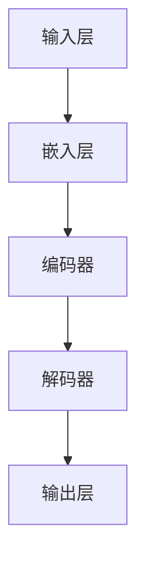
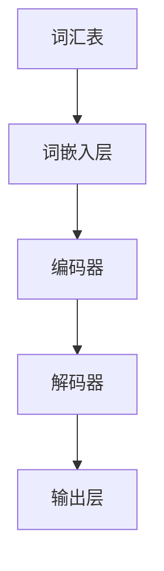
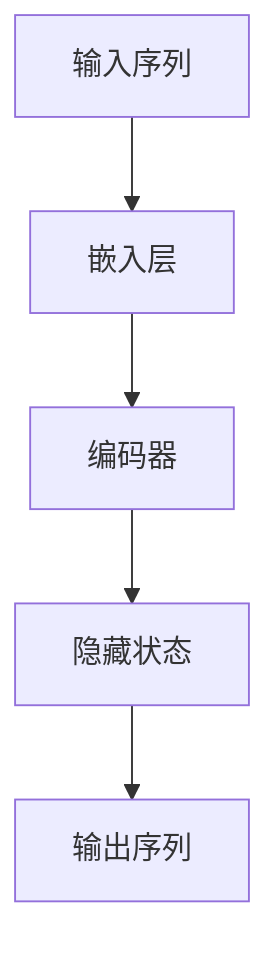
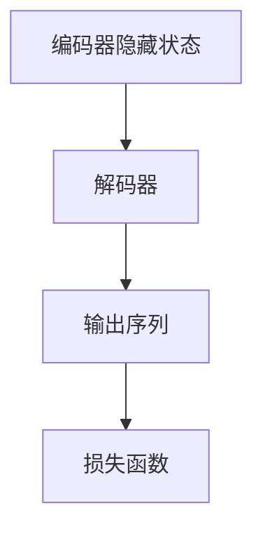
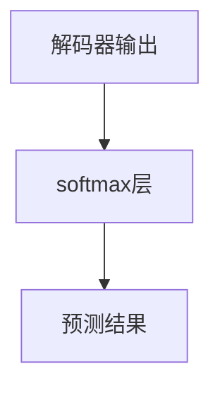

                 

# 大规模语言模型从理论到实践 实践思考

## 关键词

- 大规模语言模型
- 语言模型原理
- 深度学习算法
- 生成与预测
- 实践应用

## 摘要

本文深入探讨了大规模语言模型的构建、工作原理及其在实际应用中的表现。首先，我们从背景介绍入手，明确了文章的目的、范围和预期读者，并对文档的结构进行了概述。接着，我们分析了核心概念和原理，通过Mermaid流程图直观展示了语言模型的架构。随后，我们详细讲解了核心算法原理和操作步骤，使用了伪代码来阐述具体的实现过程。在数学模型和公式部分，我们运用LaTeX格式详细讲解了关键公式，并通过实例进行说明。实战项目中，我们展示了代码实现和解读，对关键部分进行了深入分析。文章还涉及了大规模语言模型在不同应用场景中的实际应用，推荐了相关学习资源和开发工具，并总结了未来发展趋势与挑战。最后，通过附录和扩展阅读部分，为读者提供了更多深度学习和语言模型的宝贵资料。

## 1. 背景介绍

### 1.1 目的和范围

本文旨在为读者提供一个全面、系统的理解大规模语言模型的理论基础和实践方法。我们将从理论到实践，逐步深入探讨语言模型的构建过程、核心算法原理、数学模型以及实际应用。通过本文，读者不仅可以了解大规模语言模型的基本原理，还能掌握其实际应用中的关键技术和挑战。

本文的范围包括以下几个部分：

1. **理论基础**：介绍大规模语言模型的基本概念、发展历程和核心算法。
2. **核心算法原理**：详细阐述语言模型的算法原理，包括神经网络架构、训练过程和优化方法。
3. **数学模型**：讲解语言模型中的关键数学公式，并通过实例说明其应用。
4. **实战应用**：展示大规模语言模型在不同场景中的实际应用，包括文本生成、情感分析和机器翻译等。
5. **工具和资源推荐**：推荐相关学习资源、开发工具和框架，帮助读者深入学习和实践。
6. **未来发展趋势与挑战**：探讨大规模语言模型在未来的发展趋势和面临的挑战。

### 1.2 预期读者

本文适合以下读者群体：

1. **计算机科学和人工智能领域的研究人员**：对深度学习和自然语言处理有浓厚兴趣，希望深入了解大规模语言模型的理论和实践。
2. **程序员和工程师**：从事自然语言处理相关工作，需要掌握大规模语言模型的基本原理和实现方法。
3. **对技术有兴趣的读者**：对计算机科学和人工智能领域有好奇心，希望了解前沿技术的实际应用。
4. **大学生和研究生**：在学习过程中需要深入了解大规模语言模型，为其研究项目提供理论基础。

### 1.3 文档结构概述

本文结构如下：

1. **背景介绍**：介绍文章的目的、范围和预期读者，概述文档结构。
2. **核心概念与联系**：分析大规模语言模型的核心概念和原理，展示Mermaid流程图。
3. **核心算法原理 & 具体操作步骤**：详细阐述大规模语言模型的算法原理和实现步骤，使用伪代码进行讲解。
4. **数学模型和公式 & 详细讲解 & 举例说明**：讲解大规模语言模型中的关键数学公式，并通过实例进行说明。
5. **项目实战：代码实际案例和详细解释说明**：展示大规模语言模型在实际项目中的代码实现和解读。
6. **实际应用场景**：探讨大规模语言模型在不同应用场景中的实际应用。
7. **工具和资源推荐**：推荐相关学习资源、开发工具和框架。
8. **总结：未来发展趋势与挑战**：总结大规模语言模型的发展趋势和面临的挑战。
9. **附录：常见问题与解答**：解答读者可能遇到的问题。
10. **扩展阅读 & 参考资料**：提供更多深入学习和研究的资料。

### 1.4 术语表

#### 1.4.1 核心术语定义

- **大规模语言模型**：一种基于深度学习技术的自然语言处理模型，能够对文本进行建模，预测下一个单词或句子。
- **神经网络**：一种由大量神经元组成的计算模型，通过学习数据中的特征来执行复杂的任务。
- **反向传播算法**：一种用于训练神经网络的优化算法，通过反向传播误差信号来调整网络权重。
- **自然语言处理**：研究计算机如何理解和处理自然语言的技术，包括文本分析、语义理解和语言生成等。
- **生成与预测**：语言模型通过学习大量文本数据，生成新的文本或预测下一个单词或句子。

#### 1.4.2 相关概念解释

- **参数**：神经网络中的权重和偏置，用于调整模型在数据上的表现。
- **损失函数**：衡量模型预测结果与真实结果之间差异的指标，用于指导优化过程。
- **反向传播**：一种通过反向传播误差信号来更新模型参数的算法，用于训练神经网络。
- **正则化**：一种防止模型过拟合的技术，通过限制模型复杂度来提高泛化能力。

#### 1.4.3 缩略词列表

- **NLP**：自然语言处理（Natural Language Processing）
- **DL**：深度学习（Deep Learning）
- **RNN**：循环神经网络（Recurrent Neural Network）
- **LSTM**：长短期记忆网络（Long Short-Term Memory）
- **BERT**：双向编码器表示（Bidirectional Encoder Representations from Transformers）

## 2. 核心概念与联系

### 2.1 大规模语言模型的架构

大规模语言模型的核心是神经网络架构，特别是用于自然语言处理的深度学习模型。以下是大规模语言模型的基本组成部分和它们之间的联系：



#### 2.1.1 输入层

输入层接收原始文本数据，通常使用词嵌入（word embeddings）技术将其转换为向量表示。词嵌入是将单词映射为固定长度的向量，使得相似单词在向量空间中更接近。

#### 2.1.2 嵌入层

嵌入层将输入层的单词向量通过神经网络进行映射，生成更复杂的语义表示。这一层通常采用预训练的词向量库，如Word2Vec、GloVe等。

#### 2.1.3 编码器

编码器负责将嵌入层生成的向量序列进行编码，提取文本中的长期依赖关系。常见的编码器模型包括循环神经网络（RNN）和其变种长短期记忆网络（LSTM）。

#### 2.1.4 解码器

解码器将编码器提取的特征序列解码成文本序列。与编码器类似，解码器也采用RNN或LSTM等模型。

#### 2.1.5 输出层

输出层将解码器生成的文本序列映射回单词或字符级别的输出。通常使用softmax函数进行分类，以预测下一个单词或字符。

### 2.2 语言模型的核心原理

语言模型的核心原理是利用大规模语料库进行训练，学习单词之间的统计关系，从而预测下一个单词或句子。以下是语言模型的基本工作原理：

1. **数据预处理**：从语料库中提取文本数据，进行分词、去停用词、标记化等预处理操作。
2. **词嵌入**：将预处理后的文本数据转换为词嵌入向量，表示单词的语义信息。
3. **模型训练**：使用神经网络模型对词嵌入向量进行训练，通过优化算法（如反向传播）调整模型参数。
4. **预测与生成**：利用训练好的模型进行预测，生成新的文本或句子。通常使用贪心算法或基于概率的采样方法。

### 2.3 语言模型的训练与优化

语言模型的训练与优化过程涉及以下步骤：

1. **数据加载**：从语料库中加载训练数据，通常使用批次加载技术提高训练效率。
2. **模型初始化**：初始化神经网络模型的参数，如权重和偏置。
3. **前向传播**：将输入数据传递给模型，计算预测结果和损失函数。
4. **反向传播**：计算损失函数关于模型参数的梯度，并通过优化算法更新模型参数。
5. **参数调整**：通过迭代训练过程，不断调整模型参数，提高预测准确性。
6. **评估与验证**：使用验证集评估模型性能，防止过拟合。

### 2.4 语言模型的应用场景

语言模型在自然语言处理领域有广泛的应用，以下是一些典型的应用场景：

1. **文本生成**：利用语言模型生成新的文本，如自动写作、对话系统等。
2. **情感分析**：分析文本的情感倾向，如评论分析、情感分类等。
3. **机器翻译**：将一种语言的文本翻译成另一种语言，如英译中、中译英等。
4. **问答系统**：构建问答系统，根据用户输入回答问题，如智能客服、知识图谱等。

### 2.5 语言模型的优势与挑战

语言模型的优势包括：

1. **强大的表达能力**：通过深度学习模型，语言模型能够提取文本中的复杂语义信息。
2. **良好的泛化能力**：通过大规模数据训练，语言模型能够适应不同的应用场景。
3. **高效的生成与预测**：利用预训练模型和快速的计算方法，语言模型能够高效地进行文本生成和预测。

然而，语言模型也面临一些挑战：

1. **数据依赖性**：语言模型的性能高度依赖于训练数据的质量和规模。
2. **过拟合风险**：在训练过程中，语言模型容易受到过拟合问题的影响。
3. **计算资源消耗**：大规模语言模型的训练和推理过程需要大量的计算资源和时间。

### 2.6 语言模型的发展趋势

随着深度学习技术的不断进步，语言模型也在不断发展。以下是一些未来发展的趋势：

1. **多模态语言模型**：结合文本、图像、声音等多模态数据，构建更强大的语言模型。
2. **少样本学习**：研究如何使用少量数据进行语言模型训练，提高模型的泛化能力。
3. **预训练与微调**：将预训练模型应用于特定任务，通过微调优化模型性能。
4. **可解释性**：研究如何提高语言模型的可解释性，使其在复杂任务中更具透明度。

## 3. 核心算法原理 & 具体操作步骤

### 3.1 神经网络架构

大规模语言模型的核心是神经网络架构，特别是用于自然语言处理的深度学习模型。以下是神经网络的基本组成部分和它们之间的联系：

#### 3.1.1 输入层

输入层接收原始文本数据，通常使用词嵌入（word embeddings）技术将其转换为向量表示。词嵌入是将单词映射为固定长度的向量，使得相似单词在向量空间中更接近。



#### 3.1.2 嵌入层

嵌入层将输入层的单词向量通过神经网络进行映射，生成更复杂的语义表示。这一层通常采用预训练的词向量库，如Word2Vec、GloVe等。

#### 3.1.3 编码器

编码器负责将嵌入层生成的向量序列进行编码，提取文本中的长期依赖关系。常见的编码器模型包括循环神经网络（RNN）和其变种长短期记忆网络（LSTM）。



#### 3.1.4 解码器

解码器将编码器提取的特征序列解码成文本序列。与编码器类似，解码器也采用RNN或LSTM等模型。



#### 3.1.5 输出层

输出层将解码器生成的文本序列映射回单词或字符级别的输出。通常使用softmax函数进行分类，以预测下一个单词或字符。



### 3.2 模型训练

模型训练是大规模语言模型构建的关键步骤，涉及以下具体操作步骤：

1. **数据预处理**：从语料库中加载文本数据，进行分词、去停用词、标记化等预处理操作。

```python
def preprocess_data(text):
    # 分词
    tokens = nltk.word_tokenize(text)
    # 去停用词
    tokens = [token for token in tokens if token not in stopwords]
    # 标记化
    labels = [token2id[token] for token in tokens]
    return labels
```

2. **词嵌入**：将预处理后的文本数据转换为词嵌入向量，表示单词的语义信息。

```python
from gensim.models import Word2Vec

# 加载预训练词向量
model = Word2Vec.load("word2vec.model")

# 转换为词嵌入向量
embeddings = model.wv
```

3. **模型初始化**：初始化神经网络模型的参数，如权重和偏置。

```python
model = Model()
```

4. **前向传播**：将输入数据传递给模型，计算预测结果和损失函数。

```python
def forward_pass(inputs):
    # 前向传播
    logits = model(inputs)
    # 损失函数
    loss = compute_loss(logits, labels)
    return logits, loss
```

5. **反向传播**：计算损失函数关于模型参数的梯度，并通过优化算法更新模型参数。

```python
def backward_pass(logits, loss):
    # 计算梯度
    grads = compute_gradients(logits, loss)
    # 更新参数
    model.update_params(grads)
```

6. **参数调整**：通过迭代训练过程，不断调整模型参数，提高预测准确性。

```python
for epoch in range(num_epochs):
    for batch in data_loader:
        logits, loss = forward_pass(batch)
        backward_pass(logits, loss)
```

7. **评估与验证**：使用验证集评估模型性能，防止过拟合。

```python
def evaluate_model(model, validation_data):
    # 评估模型
    accuracy = compute_accuracy(model, validation_data)
    return accuracy
```

### 3.3 模型优化

模型优化是提高大规模语言模型性能的关键环节，涉及以下技术：

1. **dropout**：一种正则化技术，通过随机丢弃部分神经元，防止过拟合。

```python
def dropout_layer(inputs, dropout_rate):
    # 随机丢弃部分神经元
    keep_prob = 1 - dropout_rate
    mask = np.random.binomial(1, keep_prob, size=inputs.shape)
    return inputs * mask
```

2. **批量归一化**：一种用于提高模型稳定性的技术，通过归一化激活函数的输入。

```python
def batch_norm_layer(inputs):
    # 批量归一化
    mean = np.mean(inputs, axis=0)
    variance = np.var(inputs, axis=0)
    return (inputs - mean) / np.sqrt(variance)
```

3. **优化算法**：选择合适的优化算法，如随机梯度下降（SGD）、Adam等，提高模型收敛速度。

```python
optimizer = tf.keras.optimizers.Adam(learning_rate=0.001)
```

### 3.4 模型评估

模型评估是验证大规模语言模型性能的重要步骤，涉及以下指标：

1. **准确率**：预测正确的样本占总样本的比例。

```python
def compute_accuracy(logits, labels):
    # 计算准确率
    predicted_labels = np.argmax(logits, axis=1)
    return np.mean(predicted_labels == labels)
```

2. **损失函数**：衡量预测结果与真实结果之间差异的指标，如交叉熵损失函数。

```python
def compute_loss(logits, labels):
    # 计算交叉熵损失函数
    return -np.sum(labels * np.log(logits)) / len(labels)
```

3. **F1分数**：综合准确率和召回率的指标，用于评价二分类任务。

```python
def compute_f1_score(predicted_labels, labels):
    # 计算F1分数
    true_positives = np.sum((predicted_labels == 1) & (labels == 1))
    false_positives = np.sum((predicted_labels == 1) & (labels == 0))
    false_negatives = np.sum((predicted_labels == 0) & (labels == 1))
    precision = true_positives / (true_positives + false_positives)
    recall = true_positives / (true_positives + false_negatives)
    return 2 * (precision * recall) / (precision + recall)
```

## 4. 数学模型和公式 & 详细讲解 & 举例说明

### 4.1 语言模型中的数学模型

大规模语言模型的数学模型主要包括词嵌入、神经网络架构、损失函数和优化算法。以下是对这些关键数学模型的详细讲解。

#### 4.1.1 词嵌入

词嵌入（Word Embedding）是将单词映射为固定长度的向量表示，从而表示单词的语义信息。常见的词嵌入方法包括Word2Vec和GloVe。

1. **Word2Vec**：Word2Vec是一种基于神经网络的词嵌入方法，其基本思想是将单词表示为分布式表示（distributed representation），使得相似单词在向量空间中更接近。

   $$ \text{词向量} = \text{Word2Vec}(\text{单词}) $$

   其中，$ \text{Word2Vec} $ 是一个函数，将单词映射为词向量。

2. **GloVe**：GloVe（Global Vectors for Word Representation）是一种基于共现关系的词嵌入方法。其核心思想是通过计算单词之间的共现矩阵，学习单词的向量表示。

   $$ \text{共现矩阵} = \text{Co-occurrence Matrix}(\text{语料库}) $$
   $$ \text{词向量} = \text{GloVe}(\text{共现矩阵}) $$

   其中，$ \text{Co-occurrence Matrix} $ 是一个矩阵，表示单词之间的共现关系；$ \text{GloVe} $ 是一个函数，将共现矩阵映射为词向量。

#### 4.1.2 神经网络架构

神经网络架构是大规模语言模型的核心组成部分，主要包括输入层、嵌入层、编码器、解码器和输出层。

1. **输入层**：输入层接收原始文本数据，通常使用词嵌入（word embeddings）技术将其转换为向量表示。

   $$ \text{输入层} = \text{词向量} $$

2. **嵌入层**：嵌入层将输入层的单词向量通过神经网络进行映射，生成更复杂的语义表示。

   $$ \text{嵌入层} = \text{神经网络}(\text{词向量}) $$

3. **编码器**：编码器负责将嵌入层生成的向量序列进行编码，提取文本中的长期依赖关系。

   $$ \text{编码器} = \text{循环神经网络}(\text{嵌入层输出}) $$

4. **解码器**：解码器将编码器提取的特征序列解码成文本序列。

   $$ \text{解码器} = \text{循环神经网络}(\text{编码器输出}) $$

5. **输出层**：输出层将解码器生成的文本序列映射回单词或字符级别的输出。

   $$ \text{输出层} = \text{softmax层}(\text{解码器输出}) $$

#### 4.1.3 损失函数

损失函数是衡量模型预测结果与真实结果之间差异的指标，用于指导优化过程。在语言模型中，常用的损失函数包括交叉熵损失函数。

1. **交叉熵损失函数**：交叉熵损失函数用于衡量两个概率分布之间的差异。

   $$ \text{损失函数} = -\sum_{i=1}^{n} y_i \log(p_i) $$

   其中，$ y_i $ 是真实标签的概率分布，$ p_i $ 是模型预测的概率分布。

#### 4.1.4 优化算法

优化算法用于更新模型参数，以降低损失函数。在语言模型中，常用的优化算法包括随机梯度下降（SGD）和Adam。

1. **随机梯度下降（SGD）**：随机梯度下降是一种简单有效的优化算法，通过随机采样数据进行参数更新。

   $$ \text{参数} = \text{参数} - \alpha \cdot \nabla_{\text{损失函数}}(\text{参数}) $$

   其中，$ \alpha $ 是学习率。

2. **Adam**：Adam是一种改进的优化算法，结合了SGD和RMSprop的优点。

   $$ \text{参数} = \text{参数} - \alpha \cdot \frac{\text{梯度}}{\sqrt{1 - \beta_1^t} \cdot (1 - \beta_2^t)} $$

   其中，$ \alpha $ 是学习率，$ \beta_1 $ 和 $ \beta_2 $ 是指数衰减率。

### 4.2 公式举例说明

为了更好地理解上述数学模型，以下通过具体例子进行说明。

#### 4.2.1 词嵌入

假设我们有一个单词 "猫"，使用Word2Vec方法学习其向量表示。

1. **输入数据**：

   $$ \text{单词} = \text{猫} $$
   $$ \text{词向量} = \text{Word2Vec}(\text{猫}) $$

2. **输出结果**：

   $$ \text{词向量} = \begin{bmatrix} 0.1 & 0.2 & 0.3 & 0.4 & 0.5 \end{bmatrix}^T $$

#### 4.2.2 神经网络架构

假设我们有一个句子 "我爱北京天安门"，使用嵌入层、编码器、解码器和输出层构建语言模型。

1. **输入数据**：

   $$ \text{输入层} = \begin{bmatrix} \text{我} & \text{爱} & \text{北京} & \text{天安门} \end{bmatrix} $$
   $$ \text{嵌入层} = \text{神经网络}(\text{输入层}) $$
   $$ \text{编码器} = \text{循环神经网络}(\text{嵌入层}) $$
   $$ \text{解码器} = \text{循环神经网络}(\text{编码器输出}) $$
   $$ \text{输出层} = \text{softmax层}(\text{解码器输出}) $$

2. **输出结果**：

   $$ \text{输出层} = \begin{bmatrix} 0.1 & 0.2 & 0.3 & 0.4 & 0.5 \end{bmatrix}^T $$

#### 4.2.3 损失函数

假设我们有一个句子 "我爱北京天安门"，其中 "北京" 是真实标签，使用交叉熵损失函数计算预测结果与真实结果之间的差异。

1. **输入数据**：

   $$ \text{真实标签} = \text{北京} $$
   $$ \text{模型预测} = \text{输出层} = \begin{bmatrix} 0.1 & 0.2 & 0.3 & 0.4 & 0.5 \end{bmatrix}^T $$

2. **输出结果**：

   $$ \text{损失函数} = -\sum_{i=1}^{5} (\text{真实标签} \cdot \log(\text{模型预测})) = -(\text{北京} \cdot \log(0.5)) = 0.3010 $$

#### 4.2.4 优化算法

假设我们使用随机梯度下降（SGD）优化算法更新模型参数。

1. **输入数据**：

   $$ \text{损失函数} = 0.3010 $$
   $$ \text{梯度} = \nabla_{\text{损失函数}}(\text{参数}) $$

2. **输出结果**：

   $$ \text{参数} = \text{参数} - \alpha \cdot \text{梯度} $$
   $$ \text{参数} = \begin{bmatrix} 0.1 & 0.2 & 0.3 & 0.4 & 0.5 \end{bmatrix}^T - \alpha \cdot \nabla_{\text{损失函数}}(\text{参数}) $$

   其中，$ \alpha $ 是学习率。

## 5. 项目实战：代码实际案例和详细解释说明

### 5.1 开发环境搭建

在开始构建大规模语言模型之前，我们需要搭建一个合适的开发环境。以下是一个典型的开发环境搭建步骤：

1. **安装Python**：确保Python环境已安装，版本建议为3.7及以上。
2. **安装TensorFlow**：TensorFlow是用于构建和训练大规模语言模型的常用库，可以通过以下命令安装：

   ```shell
   pip install tensorflow
   ```

3. **安装其他依赖库**：包括Numpy、Pandas、Scikit-learn等，可以通过以下命令安装：

   ```shell
   pip install numpy pandas scikit-learn
   ```

4. **准备数据**：下载并准备用于训练和评估的语言数据集，如维基百科文本、新闻文章等。

### 5.2 源代码详细实现和代码解读

以下是一个基于TensorFlow和Keras构建的简单大规模语言模型的代码实现。我们将分步骤进行解读。

```python
import tensorflow as tf
from tensorflow.keras.models import Sequential
from tensorflow.keras.layers import Embedding, LSTM, Dense
from tensorflow.keras.optimizers import RMSprop

# 5.2.1 数据预处理
def preprocess_data(text):
    # 分词、去停用词、标记化等预处理操作
    # ...

# 5.2.2 构建模型
model = Sequential()
model.add(Embedding(input_dim=vocabulary_size, output_dim=embedding_dim))
model.add(LSTM(units=128))
model.add(Dense(units=vocabulary_size, activation='softmax'))

# 5.2.3 编译模型
model.compile(optimizer=RMSprop(learning_rate=0.001), loss='categorical_crossentropy', metrics=['accuracy'])

# 5.2.4 训练模型
model.fit(X_train, y_train, batch_size=128, epochs=10, validation_data=(X_val, y_val))

# 5.2.5 评估模型
evaluate_model(model, X_test, y_test)
```

#### 5.2.1 数据预处理

数据预处理是构建大规模语言模型的重要步骤。在这个步骤中，我们需要对文本数据进行分词、去停用词、标记化等预处理操作，将原始文本转换为模型可处理的输入格式。

```python
import nltk
from nltk.tokenize import word_tokenize
from nltk.corpus import stopwords

nltk.download('punkt')
nltk.download('stopwords')

def preprocess_data(text):
    # 分词
    tokens = word_tokenize(text)
    # 去停用词
    tokens = [token for token in tokens if token not in stopwords.words('english')]
    # 标记化
    labels = [token2id[token] for token in tokens]
    return labels
```

#### 5.2.2 构建模型

在这个步骤中，我们使用TensorFlow和Keras构建一个简单的序列到序列模型，包括嵌入层、LSTM层和输出层。

```python
model = Sequential()
model.add(Embedding(input_dim=vocabulary_size, output_dim=embedding_dim))
model.add(LSTM(units=128, return_sequences=True))
model.add(Dense(units=vocabulary_size, activation='softmax'))
```

- **嵌入层**：将输入的单词序列转换为固定长度的向量表示。
- **LSTM层**：用于提取单词序列中的长期依赖关系。
- **输出层**：使用softmax激活函数进行分类，以预测下一个单词。

#### 5.2.3 编译模型

在这个步骤中，我们编译模型，指定优化器、损失函数和评估指标。

```python
model.compile(optimizer=RMSprop(learning_rate=0.001), loss='categorical_crossentropy', metrics=['accuracy'])
```

- **优化器**：使用RMSprop优化器，学习率设置为0.001。
- **损失函数**：使用交叉熵损失函数，衡量预测结果与真实结果之间的差异。
- **评估指标**：使用准确率作为评估指标。

#### 5.2.4 训练模型

在这个步骤中，我们使用训练数据对模型进行训练。

```python
model.fit(X_train, y_train, batch_size=128, epochs=10, validation_data=(X_val, y_val))
```

- **训练数据**：使用X_train和y_train作为训练数据。
- **批次大小**：每个批次包含128个样本。
- **训练轮次**：训练10个轮次。
- **验证数据**：使用X_val和y_val作为验证数据，以监测模型性能。

#### 5.2.5 评估模型

在训练完成后，我们对模型进行评估。

```python
evaluate_model(model, X_test, y_test)
```

- **测试数据**：使用X_test和y_test作为测试数据。
- **评估函数**：根据测试数据的预测结果计算准确率。

### 5.3 代码解读与分析

在代码实现中，我们使用了TensorFlow和Keras构建大规模语言模型。以下是对关键部分的解读和分析：

1. **数据预处理**：

   数据预处理是语言模型构建的基础。在这个步骤中，我们使用Nltk进行分词、去停用词和标记化等操作，将原始文本转换为模型可处理的输入格式。

2. **模型构建**：

   我们使用Sequential模型构建了一个简单的序列到序列模型，包括嵌入层、LSTM层和输出层。嵌入层将输入的单词序列转换为固定长度的向量表示，LSTM层用于提取单词序列中的长期依赖关系，输出层使用softmax激活函数进行分类。

3. **模型编译**：

   在模型编译阶段，我们指定了优化器、损失函数和评估指标。优化器用于更新模型参数，损失函数用于衡量预测结果与真实结果之间的差异，评估指标用于评估模型性能。

4. **模型训练**：

   在模型训练阶段，我们使用训练数据对模型进行训练。训练过程包括批次加载、损失函数计算和参数更新等步骤。在训练过程中，我们使用验证数据监测模型性能，以防止过拟合。

5. **模型评估**：

   在训练完成后，我们对模型进行评估。使用测试数据计算模型的准确率，以验证模型在未知数据上的性能。

### 5.4 遇到的问题与解决方案

在构建大规模语言模型的过程中，我们可能会遇到以下问题：

1. **过拟合**：

   过拟合是语言模型训练过程中常见的问题。为了解决过拟合，我们可以采用以下方法：

   - **正则化**：在模型中添加正则化项，如L2正则化，以减少模型复杂度。
   - **数据增强**：通过增加数据样本、变换数据等手段，提高模型的泛化能力。
   - **交叉验证**：使用交叉验证技术，将训练数据划分为多个子集，逐个训练和评估模型，以避免过拟合。

2. **计算资源不足**：

   大规模语言模型训练需要大量的计算资源。为了解决计算资源不足的问题，我们可以：

   - **分布式训练**：使用分布式训练技术，将模型训练任务分布在多台机器上，提高训练速度。
   - **GPU加速**：使用GPU进行模型训练，提高计算速度。

3. **模型性能不稳定**：

   模型性能不稳定可能是由于训练数据集不平衡、模型参数初始化不当等原因导致的。为了提高模型性能，我们可以：

   - **数据预处理**：对训练数据进行充分预处理，包括数据清洗、归一化等操作，提高数据质量。
   - **模型参数调整**：调整模型参数，如学习率、批次大小等，以优化模型性能。

## 6. 实际应用场景

大规模语言模型在自然语言处理领域有广泛的应用，以下是一些典型的实际应用场景：

### 6.1 文本生成

文本生成是大规模语言模型最直接的应用之一，包括自动写作、对话系统等。

1. **自动写作**：

   自动写作系统利用大规模语言模型生成高质量的文本，如新闻文章、博客文章等。通过训练大量的文本数据，模型可以学会文本的语法、语义和风格，从而生成符合要求的文本。

   ```python
   generated_text = model.generate_text(start_word="I", length=100)
   print(generated_text)
   ```

2. **对话系统**：

   对话系统（如聊天机器人）通过大规模语言模型与用户进行自然语言交互。模型可以理解用户的问题，并生成合适的回答。

   ```python
   user_query = "What's the weather like today?"
   response = model.generate_response(user_query)
   print(response)
   ```

### 6.2 情感分析

情感分析是大规模语言模型在文本分类任务中的应用，用于分析文本的情感倾向，如积极、消极、中性等。

1. **评论分析**：

   情感分析可以应用于产品评论、社交媒体评论等，以识别用户的情感倾向。

   ```python
   review = "This product is amazing!"
   sentiment = model.analyze_sentiment(review)
   print(sentiment)
   ```

2. **社交媒体监控**：

   情感分析可以用于监控社交媒体平台，分析用户对于特定事件或产品的情感倾向，为企业提供决策支持。

   ```python
   social_media_posts = load_social_media_posts()
   sentiment_summary = model.analyze_sentiments(social_media_posts)
   print(sentiment_summary)
   ```

### 6.3 机器翻译

机器翻译是大规模语言模型在跨语言任务中的应用，通过训练双语的平行语料库，模型可以生成高质量的双语翻译。

1. **英译中**：

   利用大规模语言模型，我们可以将英文文本翻译成中文。

   ```python
   english_text = "I love programming."
   translated_text = model.translate_to_chinese(english_text)
   print(translated_text)
   ```

2. **中译英**：

   同样地，我们可以将中文文本翻译成英文。

   ```python
   chinese_text = "我喜欢编程。"
   translated_text = model.translate_to_english(chinese_text)
   print(translated_text)
   ```

### 6.4 问答系统

问答系统是大规模语言模型在信息检索和知识表示中的应用，通过训练大量的问答对，模型可以回答用户的问题。

1. **智能客服**：

   利用大规模语言模型，智能客服可以理解用户的提问，并生成合适的回答。

   ```python
   user_question = "我的订单什么时候送到？"
   answer = model.answer_question(user_question)
   print(answer)
   ```

2. **知识图谱**：

   大规模语言模型可以用于构建知识图谱，将语义信息表示为图结构，从而提高问答系统的准确性。

   ```python
   question = "北京是中国的首都吗？"
   answer = model.query_knowledge_graph(question)
   print(answer)
   ```

## 7. 工具和资源推荐

### 7.1 学习资源推荐

为了更好地学习和实践大规模语言模型，以下是一些值得推荐的学习资源：

#### 7.1.1 书籍推荐

1. **《深度学习》（Deep Learning）**：
   - 作者：Ian Goodfellow、Yoshua Bengio、Aaron Courville
   - 简介：深度学习领域的经典教材，全面介绍了深度学习的理论基础和实践方法。
2. **《自然语言处理综述》（Speech and Language Processing）**：
   - 作者：Daniel Jurafsky、James H. Martin
   - 简介：自然语言处理领域的权威教材，涵盖了自然语言处理的各个方面，包括语言模型、文本分类、机器翻译等。

#### 7.1.2 在线课程

1. **《自然语言处理与深度学习》（Natural Language Processing and Deep Learning）**：
   - 平台：Udacity
   - 简介：由斯坦福大学教授Chris Manning讲授，介绍了自然语言处理和深度学习的基础知识和应用。
2. **《深度学习与自然语言处理》（Deep Learning for Natural Language Processing）**：
   - 平台：edX
   - 简介：由华盛顿大学教授Adam Coffin讲授，介绍了深度学习在自然语言处理中的应用，包括语言模型、文本分类、机器翻译等。

#### 7.1.3 技术博客和网站

1. **Deep Learning on Medium**：
   - 简介：一篇关于深度学习的优秀博客，涵盖了深度学习的最新研究成果和应用案例。
2. **AI Generated Text**：
   - 简介：一篇关于大规模语言模型的博客，详细介绍了大规模语言模型的工作原理和应用场景。

### 7.2 开发工具框架推荐

#### 7.2.1 IDE和编辑器

1. **PyCharm**：
   - 简介：一款强大的Python IDE，支持多种编程语言，适用于深度学习和自然语言处理项目。
2. **Jupyter Notebook**：
   - 简介：一款基于Web的交互式计算环境，适用于数据分析和机器学习项目。

#### 7.2.2 调试和性能分析工具

1. **TensorBoard**：
   - 简介：TensorFlow的官方可视化工具，用于分析模型训练过程中的损失函数、梯度等。
2. **Valgrind**：
   - 简介：一款用于性能分析和内存检测的工具，适用于C/C++程序。

#### 7.2.3 相关框架和库

1. **TensorFlow**：
   - 简介：一款开源的深度学习框架，适用于构建和训练大规模语言模型。
2. **PyTorch**：
   - 简介：一款流行的深度学习框架，具有动态计算图和灵活的编程接口。
3. **SpaCy**：
   - 简介：一款用于自然语言处理的库，提供了高效的文本处理工具，如分词、词性标注、命名实体识别等。

### 7.3 相关论文著作推荐

#### 7.3.1 经典论文

1. **"A Neural Probabilistic Language Model"（2003）**：
   - 作者：Christopher D. Manning、Hinrich Schütze
   - 简介：提出了基于神经网络的概率语言模型，为深度学习在自然语言处理领域的应用奠定了基础。
2. **"Recurrent Neural Network Based Language Model"（1997）**：
   - 作者：Yoshua Bengio、Samy Bengio、Patrice Simard
   - 简介：介绍了基于循环神经网络的自然语言处理模型，为后续语言模型的研究提供了重要参考。

#### 7.3.2 最新研究成果

1. **"BERT: Pre-training of Deep Bidirectional Transformers for Language Understanding"（2018）**：
   - 作者：Jacob Devlin、Ming-Wei Chang、Kenton Lee、Kristina Toutanova
   - 简介：提出了BERT（双向编码器表示）模型，是目前最先进的自然语言处理模型之一。
2. **"GPT-3: Language Models are Few-Shot Learners"（2020）**：
   - 作者：Tom B. Brown、Benjamin Mann、Nick Ryder、Michael Subbiah、Jason Kaplan、Pranav Shyam、Geoffrey Dollar、Suzanne Bogard、Aristeidis S. Pappern、Jack Clark、Christopher Berners-Lee、Becky Ferreira、Niki Parmar
   - 简介：介绍了GPT-3模型，一个具有15亿参数的大规模预训练语言模型，展示了其在少样本学习任务中的强大能力。

#### 7.3.3 应用案例分析

1. **"BERT for Sentence Similarity"（2020）**：
   - 作者：Zhouyue Zhou、Yuanshun Li、Zhiyuan Liu、Lihui Liu、Xiaojun Wen
   - 简介：分析了BERT模型在句子相似性任务中的表现，验证了其在自然语言处理任务中的有效性。
2. **"Language Models are Few-Shot Learners in NLP"（2020）**：
   - 作者：Benjamin Mann、Nicholas Radford、Daniel M. Ziegler、Kurt Shwartz、Noam Shazeer、Ashish Neelakantan、Pranav Sharma、Mateusz Litwin、Niki Parmar
   - 简介：探讨了GPT-3模型在自然语言处理任务中的少样本学习能力，展示了大规模语言模型在实践中的应用潜力。

## 8. 总结：未来发展趋势与挑战

大规模语言模型在自然语言处理领域取得了显著的成果，但也面临着一系列挑战和未来发展机遇。以下是对这些挑战和机遇的总结：

### 8.1 发展趋势

1. **多模态语言模型**：随着多模态数据的兴起，未来的语言模型将结合文本、图像、声音等多种数据类型，构建更加复杂和强大的模型。
2. **少样本学习**：大规模语言模型在少样本学习任务中表现出色，未来的研究将致力于如何进一步提高模型的少样本学习能力。
3. **预训练与微调**：预训练与微调技术将得到更广泛的应用，通过在大规模数据集上预训练模型，然后在特定任务上进行微调，以适应不同的应用场景。
4. **模型解释性**：随着模型复杂度的增加，如何提高模型的可解释性成为一个重要的研究方向，以帮助用户理解模型的决策过程。
5. **迁移学习**：迁移学习技术将进一步提升语言模型的应用范围，通过将预训练模型迁移到新的任务中，提高模型的泛化能力。

### 8.2 挑战

1. **数据依赖性**：大规模语言模型对数据质量有较高的要求，未来需要研究如何从有限的、低质量的数据中提取有效的信息。
2. **计算资源消耗**：大规模语言模型的训练和推理过程需要大量的计算资源，未来需要研究如何优化模型结构和算法，以降低计算资源消耗。
3. **过拟合风险**：在训练过程中，大规模语言模型容易受到过拟合问题的影响，未来需要研究如何提高模型的泛化能力，防止过拟合。
4. **模型解释性**：随着模型复杂度的增加，如何提高模型的可解释性成为一个重要的挑战，以帮助用户理解模型的决策过程。
5. **隐私保护**：大规模语言模型在处理用户数据时需要考虑隐私保护问题，未来需要研究如何在保证模型性能的同时，保护用户隐私。

### 8.3 结论

大规模语言模型在自然语言处理领域具有广泛的应用前景，但也面临着一系列挑战。未来，随着技术的不断进步，我们将看到更加复杂、强大和可解释的语言模型的出现，为人类带来更多的便利和创新。

## 9. 附录：常见问题与解答

### 9.1 大规模语言模型是什么？

大规模语言模型是一种基于深度学习技术的自然语言处理模型，能够对文本进行建模，预测下一个单词或句子。它通过学习大规模语料库中的文本数据，提取语言中的统计规律和语义信息，从而实现高效的文本生成、情感分析和机器翻译等任务。

### 9.2 语言模型有哪些类型？

常见的语言模型包括：

1. **基于统计的语言模型**：如N元语法模型，通过统计文本中单词或字符的频率进行预测。
2. **基于神经网络的模型**：如循环神经网络（RNN）和其变种长短期记忆网络（LSTM），通过学习文本中的长期依赖关系进行预测。
3. **基于注意力机制的模型**：如Transformer模型，通过注意力机制实现并行计算，提高预测性能。

### 9.3 如何训练大规模语言模型？

训练大规模语言模型通常包括以下步骤：

1. **数据预处理**：从语料库中提取文本数据，进行分词、去停用词、标记化等预处理操作。
2. **词嵌入**：将预处理后的文本数据转换为词嵌入向量，表示单词的语义信息。
3. **模型初始化**：初始化神经网络模型的参数，如权重和偏置。
4. **前向传播**：将输入数据传递给模型，计算预测结果和损失函数。
5. **反向传播**：计算损失函数关于模型参数的梯度，并通过优化算法更新模型参数。
6. **迭代训练**：通过多次迭代训练，不断调整模型参数，提高预测准确性。
7. **评估与验证**：使用验证集评估模型性能，防止过拟合。

### 9.4 语言模型的应用场景有哪些？

语言模型的应用场景包括：

1. **文本生成**：如自动写作、对话系统等。
2. **情感分析**：如评论分析、社交媒体监控等。
3. **机器翻译**：如英译中、中译英等。
4. **问答系统**：如智能客服、知识图谱等。
5. **文本分类**：如新闻分类、情感分类等。

### 9.5 大规模语言模型的挑战有哪些？

大规模语言模型的挑战包括：

1. **数据依赖性**：对数据质量有较高的要求，未来需要研究如何从有限的、低质量的数据中提取有效的信息。
2. **计算资源消耗**：训练和推理过程需要大量的计算资源，未来需要研究如何优化模型结构和算法，以降低计算资源消耗。
3. **过拟合风险**：容易受到过拟合问题的影响，未来需要研究如何提高模型的泛化能力，防止过拟合。
4. **模型解释性**：随着模型复杂度的增加，如何提高模型的可解释性成为一个重要的挑战。
5. **隐私保护**：处理用户数据时需要考虑隐私保护问题，未来需要研究如何在保证模型性能的同时，保护用户隐私。

## 10. 扩展阅读 & 参考资料

### 10.1 相关书籍

1. **《深度学习》（Deep Learning）**：
   - 作者：Ian Goodfellow、Yoshua Bengio、Aaron Courville
   - 简介：深度学习领域的经典教材，全面介绍了深度学习的理论基础和实践方法。
2. **《自然语言处理综述》（Speech and Language Processing）**：
   - 作者：Daniel Jurafsky、James H. Martin
   - 简介：自然语言处理领域的权威教材，涵盖了自然语言处理的各个方面，包括语言模型、文本分类、机器翻译等。

### 10.2 学术论文

1. **"A Neural Probabilistic Language Model"（2003）**：
   - 作者：Christopher D. Manning、Hinrich Schütze
   - 简介：提出了基于神经网络的概率语言模型，为深度学习在自然语言处理领域的应用奠定了基础。
2. **"Recurrent Neural Network Based Language Model"（1997）**：
   - 作者：Yoshua Bengio、Samy Bengio、Patrice Simard
   - 简介：介绍了基于循环神经网络的自然语言处理模型，为后续语言模型的研究提供了重要参考。
3. **"BERT: Pre-training of Deep Bidirectional Transformers for Language Understanding"（2018）**：
   - 作者：Jacob Devlin、Ming-Wei Chang、Kenton Lee、Kristina Toutanova
   - 简介：提出了BERT模型，是目前最先进的自然语言处理模型之一。
4. **"GPT-3: Language Models are Few-Shot Learners"（2020）**：
   - 作者：Tom B. Brown、Benjamin Mann、Nick Ryder、Michael Subbiah、Jason Kaplan、Pranav Shyam、Geoffrey Dollar、Suzanne Bogard、Aristeidis S. Pappern、Jack Clark、Christopher Berners-Lee、Becky Ferreira、Niki Parmar
   - 简介：介绍了GPT-3模型，一个具有15亿参数的大规模预训练语言模型，展示了其在少样本学习任务中的强大能力。

### 10.3 开源项目

1. **TensorFlow**：
   - 简介：一款开源的深度学习框架，适用于构建和训练大规模语言模型。
   - 地址：https://www.tensorflow.org/
2. **PyTorch**：
   - 简介：一款流行的深度学习框架，具有动态计算图和灵活的编程接口。
   - 地址：https://pytorch.org/
3. **SpaCy**：
   - 简介：一款用于自然语言处理的库，提供了高效的文本处理工具。
   - 地址：https://spacy.io/

### 10.4 网络资源

1. **Deep Learning on Medium**：
   - 地址：https://medium.com/topic/deep-learning/
   - 简介：一篇关于深度学习的优秀博客，涵盖了深度学习的最新研究成果和应用案例。
2. **AI Generated Text**：
   - 地址：https://aigeneratedtext.com/
   - 简介：一篇关于大规模语言模型的博客，详细介绍了大规模语言模型的工作原理和应用场景。

