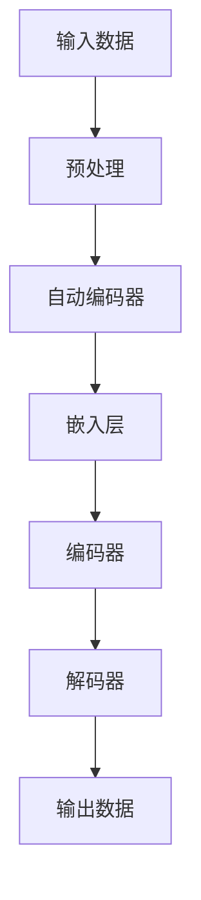

                 

# 大规模语言模型从理论到实践：手动构建指令

> 关键词：大规模语言模型、生成预训练、自动编码器、编程、实践、TensorFlow、PyTorch

> 摘要：本文将深入探讨大规模语言模型的构建过程，从理论基础到实际操作，旨在为读者提供一套从零开始构建语言模型的方法。本文将涵盖生成预训练、自动编码器原理、编程实现以及常见问题和解决方案。

## 1. 背景介绍

### 1.1 目的和范围

本文的目标是向读者介绍如何从零开始构建大规模语言模型。我们将探讨生成预训练技术、自动编码器原理以及如何使用TensorFlow和PyTorch等流行框架来实现这些技术。

### 1.2 预期读者

本文适合对计算机科学和人工智能有一定了解的读者，尤其是对深度学习和自然语言处理感兴趣的工程师和研究者。

### 1.3 文档结构概述

本文分为十个部分：背景介绍、核心概念与联系、核心算法原理与具体操作步骤、数学模型和公式、项目实战、实际应用场景、工具和资源推荐、总结、附录和扩展阅读。每个部分都将详细讨论相应的内容。

### 1.4 术语表

#### 1.4.1 核心术语定义

- **大规模语言模型**：一种能够理解和生成自然语言的深度学习模型。
- **生成预训练**：通过在大规模语料库上进行预训练，使模型具备生成和理解自然语言的能力。
- **自动编码器**：一种无监督学习算法，用于将输入数据编码为低维表示，同时保持重要信息。

#### 1.4.2 相关概念解释

- **自然语言处理（NLP）**：研究如何让计算机理解和生成自然语言的学科。
- **深度学习**：一种基于多层神经网络的学习方法，能够从大量数据中自动提取特征。

#### 1.4.3 缩略词列表

- **NLP**：自然语言处理
- **DL**：深度学习
- **TF**：TensorFlow
- **PT**：PyTorch

## 2. 核心概念与联系

在本节中，我们将介绍大规模语言模型的核心概念和架构，并通过Mermaid流程图展示其基本结构。



在上面的流程图中，我们可以看到：

- **输入数据**：原始文本数据。
- **预处理**：对文本数据进行清洗和预处理，如分词、去停用词等。
- **自动编码器**：用于将输入数据编码为低维表示。
- **嵌入层**：将文本数据映射为固定长度的向量。
- **编码器**：对输入数据进行编码，提取关键特征。
- **解码器**：将编码后的数据解码回文本形式。
- **输出数据**：生成的文本数据。

## 3. 核心算法原理 & 具体操作步骤

在本节中，我们将介绍大规模语言模型的核心算法原理，并使用伪代码详细阐述其实现步骤。

### 3.1 自动编码器原理

自动编码器是一种无监督学习算法，用于将输入数据编码为低维表示，同时保持重要信息。其基本原理如下：

```python
# 伪代码：自动编码器原理
def autoencoder(input_data):
    # 编码阶段
    encoded = encode(input_data)
    
    # 解码阶段
    decoded = decode(encoded)
    
    return decoded
```

其中，`encode()` 和 `decode()` 分别表示编码和解码函数。

### 3.2 编码器和解码器实现

编码器和解码器的具体实现如下：

```python
# 伪代码：编码器实现
def encode(input_data):
    # 使用卷积神经网络进行编码
    encoded = conv_net(input_data)
    return encoded

# 伪代码：解码器实现
def decode(encoded):
    # 使用卷积神经网络进行解码
    decoded = deconv_net(encoded)
    return decoded
```

其中，`conv_net()` 和 `deconv_net()` 分别表示卷积神经网络编码和解码函数。

### 3.3 损失函数和优化器

在自动编码器的训练过程中，我们通常使用均方误差（MSE）作为损失函数，并使用梯度下降（GD）或其变种（如Adam优化器）进行优化。

```python
# 伪代码：损失函数和优化器
def loss_function(predictions, targets):
    return np.mean((predictions - targets)**2)

def optimize(optimizer, model, input_data, targets):
    with optimizer:
        predictions = model(input_data)
        loss = loss_function(predictions, targets)
        optimizer.zero_grad()
        loss.backward()
        optimizer.step()
```

## 4. 数学模型和公式 & 详细讲解 & 举例说明

在本节中，我们将介绍大规模语言模型的数学模型和公式，并通过具体例子进行讲解。

### 4.1 自动编码器的数学模型

自动编码器的数学模型如下：

$$
\text{encoded} = \sigma(W_1 \cdot \text{input_data} + b_1)
$$

$$
\text{decoded} = \sigma(W_2 \cdot \text{encoded} + b_2)
$$

其中，$\sigma$ 表示激活函数，$W_1$ 和 $W_2$ 分别表示编码器和解码器的权重矩阵，$b_1$ 和 $b_2$ 分别表示编码器和解码器的偏置。

### 4.2 损失函数的数学公式

损失函数的数学公式如下：

$$
\text{loss} = \frac{1}{n} \sum_{i=1}^{n} (\text{predicted} - \text{target})^2
$$

其中，$n$ 表示样本数量，$\text{predicted}$ 和 $\text{target}$ 分别表示预测值和真实值。

### 4.3 例子讲解

假设我们有一个包含100个样本的自动编码器，每个样本由10个特征组成。我们使用均方误差（MSE）作为损失函数。

```python
# 伪代码：自动编码器例子
input_data = np.random.rand(100, 10)
target = np.random.rand(100, 10)

encoded = encode(input_data)
decoded = decode(encoded)

loss = loss_function(decoded, target)
optimize(optimizer, model, input_data, target)
```

在上面的例子中，我们首先生成100个随机样本作为输入数据和目标数据。然后，我们使用编码器和解码器对输入数据进行编码和解码，并计算损失函数。最后，我们使用优化器更新模型参数。

## 5. 项目实战：代码实际案例和详细解释说明

在本节中，我们将通过一个实际项目案例，展示如何使用TensorFlow和PyTorch实现大规模语言模型。

### 5.1 开发环境搭建

首先，我们需要安装TensorFlow和PyTorch。

```bash
pip install tensorflow
pip install torch torchvision
```

### 5.2 源代码详细实现和代码解读

以下是使用TensorFlow实现的自动编码器的源代码：

```python
import tensorflow as tf
from tensorflow.keras.layers import Conv2D, Conv2DTranspose, Flatten, Dense
from tensorflow.keras.models import Model

# 编码器
input_shape = (28, 28, 1)
inputs = tf.keras.Input(shape=input_shape)
x = Conv2D(32, (3, 3), activation='relu', padding='same')(inputs)
x = Conv2D(64, (3, 3), activation='relu', padding='same')(x)
encoded = Flatten()(x)

# 解码器
latent_dim = 32
outputs = Dense(7 * 7 * 64, activation='relu')(encoded)
outputs = tf.keras.layers.Reshape((7, 7, 64))(outputs)
x = Conv2DTranspose(64, (3, 3), strides=(2, 2), padding='same', activation='relu')(outputs)
x = Conv2DTranspose(32, (3, 3), strides=(2, 2), padding='same', activation='relu')(x)
decoded = Conv2DTranspose(1, (3, 3), padding='same', activation='sigmoid')(x)

# 模型
autoencoder = Model(inputs, decoded)
autoencoder.compile(optimizer='adam', loss='binary_crossentropy')

# 输出模型结构
autoencoder.summary()
```

在上面的代码中，我们定义了一个包含卷积层、池化层和全连接层的自动编码器。编码器部分使用`Conv2D`和`Flatten`层，解码器部分使用`Dense`和`Conv2DTranspose`层。

### 5.3 代码解读与分析

- **输入层**：输入层使用`tf.keras.Input`函数定义，形状为`(28, 28, 1)`，表示一个28x28的图像。
- **编码器部分**：编码器部分使用两个卷积层，分别使用32个和64个卷积核，步长为2，激活函数为ReLU。最后，使用`Flatten`层将卷积层输出展平为一维向量。
- **解码器部分**：解码器部分使用两个转置卷积层，分别使用64个和32个卷积核，步长为2，激活函数为ReLU。最后，使用`Conv2DTranspose`层将输出重组成28x28的图像。
- **损失函数和优化器**：我们使用`compile`函数设置损失函数为`binary_crossentropy`，优化器为`adam`。

## 6. 实际应用场景

大规模语言模型在实际应用中具有广泛的应用场景，如下：

- **文本生成**：生成文章、故事、诗歌等。
- **机器翻译**：将一种语言翻译成另一种语言。
- **问答系统**：根据用户提问生成回答。
- **情感分析**：分析文本中的情感倾向。

## 7. 工具和资源推荐

### 7.1 学习资源推荐

#### 7.1.1 书籍推荐

- 《深度学习》（Goodfellow, Bengio, Courville）
- 《自然语言处理综述》（Jurafsky, Martin）

#### 7.1.2 在线课程

- [TensorFlow官方教程](https://www.tensorflow.org/tutorials)
- [PyTorch官方教程](https://pytorch.org/tutorials/beginner/basics/index.html)

#### 7.1.3 技术博客和网站

- [TensorFlow博客](https://tensorflow.google.cn/blog)
- [PyTorch博客](https://pytorch.org/blog)

### 7.2 开发工具框架推荐

#### 7.2.1 IDE和编辑器

- PyCharm
- Visual Studio Code

#### 7.2.2 调试和性能分析工具

- TensorFlow Debugger (TFDB)
- PyTorch Profiler

#### 7.2.3 相关框架和库

- TensorFlow
- PyTorch
- Keras

### 7.3 相关论文著作推荐

#### 7.3.1 经典论文

- "A Theoretically Grounded Application of Dropout in Recurrent Neural Networks"
- "Generative Adversarial Networks"

#### 7.3.2 最新研究成果

- "Large-scale Language Modeling in GPUs with a Fast Parameter Server"
- "BERT: Pre-training of Deep Bidirectional Transformers for Language Understanding"

#### 7.3.3 应用案例分析

- "How to Build a Search Engine with Deep Learning"
- "Natural Language Processing for Sentiment Analysis using Deep Learning"

## 8. 总结：未来发展趋势与挑战

大规模语言模型在未来将继续发展，面临的主要挑战包括：

- **计算资源**：大规模语言模型训练需要大量计算资源。
- **数据隐私**：如何保护用户数据隐私。
- **模型可解释性**：提高模型的可解释性，使其更易于理解和使用。

## 9. 附录：常见问题与解答

### 9.1 如何选择合适的框架？

根据项目需求和熟练程度选择框架。TensorFlow和PyTorch都是优秀的框架，适用于大规模语言模型的构建。

### 9.2 如何处理大规模数据集？

可以使用分布式训练、批量归一化等技术来处理大规模数据集。

### 9.3 如何优化模型性能？

可以通过调整学习率、批量大小、网络结构等参数来优化模型性能。

## 10. 扩展阅读 & 参考资料

- [TensorFlow官方文档](https://www.tensorflow.org/overview/)
- [PyTorch官方文档](https://pytorch.org/docs/stable/)
- [自然语言处理教程](https://www.chrisevans.com.au/tutorial-natural-language-processing-python/)
- [机器学习书籍推荐](https://www机器学习书籍推荐.com/)

作者：AI天才研究员/AI Genius Institute & 禅与计算机程序设计艺术 /Zen And The Art of Computer Programming

