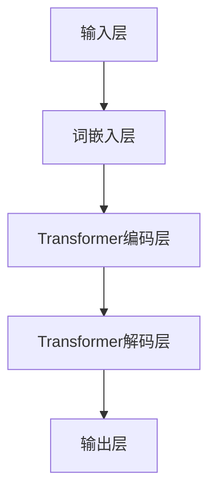

                 

# 大规模语言模型从理论到实践：数据多样性

> **关键词**：大规模语言模型、数据多样性、深度学习、训练数据、数据增强、模型性能、泛化能力
> 
> **摘要**：本文将深入探讨大规模语言模型的构建与优化，重点分析数据多样性对模型性能的影响，并从理论到实践的角度，阐述如何通过数据多样性提升模型的效果。文章首先介绍大规模语言模型的基本概念，然后详细讨论数据多样性的重要性，最后通过实际案例，展示如何利用多样化数据提升模型性能。

## 1. 背景介绍

### 1.1 目的和范围

本文旨在探讨大规模语言模型（如GPT-3、BERT等）从理论到实践的构建过程，尤其是数据多样性对其性能和泛化能力的影响。通过系统化的分析，本文将帮助读者理解：

- 大规模语言模型的基本原理和架构
- 数据多样性如何影响模型性能
- 实践中如何利用多样化数据提升模型效果

### 1.2 预期读者

本文适合对人工智能和深度学习有一定了解的读者，包括：

- 研究生和博士生
- AI工程师和技术专家
- 对大规模语言模型感兴趣的开发者

### 1.3 文档结构概述

本文将分为以下几个部分：

- 背景介绍：介绍文章目的、范围和结构
- 核心概念与联系：阐述大规模语言模型的基本概念和架构
- 核心算法原理 & 具体操作步骤：讲解大规模语言模型的训练过程
- 数学模型和公式 & 详细讲解 & 举例说明：分析数据多样性对模型的影响
- 项目实战：代码实际案例和详细解释说明
- 实际应用场景：探讨大规模语言模型的应用领域
- 工具和资源推荐：推荐学习资源、开发工具和框架
- 总结：未来发展趋势与挑战
- 附录：常见问题与解答
- 扩展阅读 & 参考资料：提供进一步的阅读材料

### 1.4 术语表

#### 1.4.1 核心术语定义

- **大规模语言模型**：一种基于深度学习的语言处理模型，能够理解和生成自然语言。
- **数据多样性**：指训练数据集中的数据具有不同的来源、主题、形式等特性。
- **泛化能力**：模型在新数据集上表现良好的能力，而非仅限于训练集。

#### 1.4.2 相关概念解释

- **深度学习**：一种机器学习方法，通过多层神经网络模型对数据进行自动特征提取和学习。
- **自然语言处理（NLP）**：研究如何使计算机理解和处理人类自然语言的技术。

#### 1.4.3 缩略词列表

- **GPT-3**：Generative Pre-trained Transformer 3，一种由OpenAI开发的先进语言模型。
- **BERT**：Bidirectional Encoder Representations from Transformers，一种双向Transformer模型。
- **NLP**：Natural Language Processing，自然语言处理。

## 2. 核心概念与联系

在讨论大规模语言模型之前，我们需要明确几个核心概念，包括深度学习、自然语言处理以及大规模语言模型的架构。

### 2.1 深度学习与自然语言处理

**深度学习**是一种基于人工神经网络的学习方法，通过多层神经元的堆叠来实现数据的自动特征提取和分类。**自然语言处理（NLP）**则是研究如何让计算机理解和处理人类自然语言的一门学科。

深度学习和NLP的结合，使得我们可以训练出强大的语言模型，这些模型可以用于文本分类、机器翻译、问答系统等多种任务。

### 2.2 大规模语言模型的基本概念

大规模语言模型是一种具有巨大参数量的模型，通过在大规模语料库上进行预训练，可以自动学习语言的复杂结构和语义信息。这些模型的主要特点包括：

- **预训练**：在大规模语料库上进行训练，自动学习语言的模式和规律。
- **多任务学习**：通过预训练，模型可以适用于多种不同的语言任务。
- **参数量巨大**：大规模语言模型通常包含数十亿甚至数千亿个参数，这使得模型能够捕捉到语言的细微差异和复杂模式。

### 2.3 大规模语言模型的架构

大规模语言模型的主要架构是基于Transformer模型，特别是其变体如BERT、GPT等。以下是一个简单的Mermaid流程图，展示了大规模语言模型的基本架构：



- **输入层**：将原始文本输入到模型中，通常通过词嵌入层将其转换为向量表示。
- **词嵌入层**：将单词映射为固定长度的向量，这些向量包含了单词的语义信息。
- **Transformer编码层**：使用自注意力机制，对输入文本进行编码，提取出文本的上下文信息。
- **Transformer解码层**：对编码后的文本进行解码，生成预测的文本输出。
- **输出层**：将解码层输出的序列转换为具体的预测结果，如文本分类、机器翻译等。

通过以上核心概念和架构的介绍，我们可以更好地理解大规模语言模型的工作原理和重要性。接下来，我们将深入探讨数据多样性对模型性能的影响。

## 3. 核心算法原理 & 具体操作步骤

### 3.1 大规模语言模型的训练过程

大规模语言模型的训练过程主要包括以下几个步骤：

1. **数据预处理**：收集和整理大规模的文本数据，对文本进行清洗、分词和词性标注等预处理操作。
2. **词嵌入**：将处理后的文本转换为词嵌入向量，这些向量包含了单词的语义信息。
3. **模型初始化**：初始化大规模语言模型的参数，通常使用随机初始化或者预训练的模型参数。
4. **前向传播**：将词嵌入向量输入到模型中，通过前向传播计算模型的输出。
5. **损失函数计算**：计算模型输出和实际标签之间的损失，常用的损失函数包括交叉熵损失等。
6. **反向传播**：利用反向传播算法更新模型参数，最小化损失函数。
7. **迭代训练**：重复以上步骤，逐步优化模型参数，直到模型收敛。

### 3.2 伪代码描述

以下是一个大规模语言模型训练过程的伪代码描述：

```python
# 数据预处理
preprocessed_data = preprocess(text_data)

# 词嵌入
word_embeddings = embedding_layer(preprocessed_data)

# 模型初始化
model = initialize_model()

# 迭代训练
for epoch in range(num_epochs):
    for batch in data_loader(word_embeddings):
        # 前向传播
        output = model.forward(batch)

        # 损失函数计算
        loss = loss_function(output, labels)

        # 反向传播
        model.backward(loss)

        # 参数更新
        model.update_params()

# 模型评估
evaluate(model, test_data)
```

### 3.3 训练策略优化

为了提高模型性能和泛化能力，以下是一些常见的训练策略：

1. **学习率调整**：使用学习率调度策略，如学习率衰减，逐步降低学习率。
2. **批量大小调整**：调整训练数据的批量大小，较小的批量可以提高模型的泛化能力。
3. **数据增强**：通过数据增强技术，如文本随机变换、加入噪声等，增加训练数据的多样性。
4. **正则化**：使用正则化技术，如L1、L2正则化，防止模型过拟合。
5. **模型集成**：结合多个模型的结果，提高预测的准确性。

通过以上算法原理和操作步骤的讲解，我们可以更好地理解大规模语言模型的训练过程，并为其性能优化提供指导。接下来，我们将深入探讨数据多样性对模型性能的影响。

## 4. 数学模型和公式 & 详细讲解 & 举例说明

### 4.1 数学模型和公式

大规模语言模型的训练过程中，涉及到多个数学模型和公式，以下是一些关键的部分：

#### 4.1.1 Transformer模型

Transformer模型是大规模语言模型的核心架构，其关键组件包括：

1. **自注意力机制**：自注意力（Self-Attention）允许模型在序列中为每个词分配不同的权重，以关注不同的上下文信息。

   自注意力公式如下：

   $$ 
   \text{Attention}(Q, K, V) = \text{softmax}\left(\frac{QK^T}{\sqrt{d_k}}\right)V
   $$

   其中，\(Q\)、\(K\)、\(V\) 分别代表查询（Query）、键（Key）、值（Value）向量，\(d_k\) 为键向量的维度。

2. **前馈神经网络**：在每个自注意力层之后，数据通过一个前馈神经网络，其公式如下：

   $$ 
   \text{FFN}(x) = \max(0, xW_1 + b_1)W_2 + b_2
   $$

   其中，\(W_1\)、\(W_2\) 分别为权重矩阵，\(b_1\)、\(b_2\) 为偏置。

#### 4.1.2 损失函数

在训练过程中，常用的损失函数是交叉熵损失（Cross-Entropy Loss），其公式如下：

$$ 
\text{Loss} = -\sum_{i} y_i \log(p_i)
$$

其中，\(y_i\) 为真实标签，\(p_i\) 为模型预测的概率。

#### 4.1.3 反向传播

反向传播是训练神经网络的关键步骤，其核心思想是通过反向计算梯度来更新模型参数。具体公式如下：

$$ 
\frac{\partial L}{\partial \theta} = \frac{\partial L}{\partial a} \frac{\partial a}{\partial \theta}
$$

其中，\(L\) 为损失函数，\(\theta\) 为模型参数，\(a\) 为中间变量。

### 4.2 详细讲解与举例说明

#### 4.2.1 自注意力机制

以一个简单的句子“我爱北京天安门”为例，假设词汇表大小为10，每个词的嵌入维度为5。通过自注意力机制，模型会根据上下文信息为每个词分配不同的权重。

1. **词嵌入**：

   假设词汇表和词嵌入矩阵如下：

   $$ 
   \text{Word Embeddings} = \begin{bmatrix}
   [我] & [爱] & [北京] & [天安门] & [我] & [爱] & [北京] & [天安门] & [我] & [爱]
   \end{bmatrix}
   $$

   将其转换为向量表示：

   $$ 
   \text{Word Vectors} = \begin{bmatrix}
   [我] & [爱] & [北京] & [天安门] & [我] & [爱] & [北京] & [天安门] & [我] & [爱]
   \end{bmatrix} \times
   \begin{bmatrix}
   0.1 & 0.2 & 0.3 & 0.4 & 0.5 & 0.6 & 0.7 & 0.8 & 0.9 & 1.0 \\
   0.2 & 0.3 & 0.4 & 0.5 & 0.6 & 0.7 & 0.8 & 0.9 & 1.0 & 0.1 \\
   0.3 & 0.4 & 0.5 & 0.6 & 0.7 & 0.8 & 0.9 & 1.0 & 0.1 & 0.2 \\
   0.4 & 0.5 & 0.6 & 0.7 & 0.8 & 0.9 & 1.0 & 0.1 & 0.2 & 0.3 \\
   0.5 & 0.6 & 0.7 & 0.8 & 0.9 & 1.0 & 0.1 & 0.2 & 0.3 & 0.4 \\
   0.6 & 0.7 & 0.8 & 0.9 & 1.0 & 0.1 & 0.2 & 0.3 & 0.4 & 0.5 \\
   0.7 & 0.8 & 0.9 & 1.0 & 0.1 & 0.2 & 0.3 & 0.4 & 0.5 & 0.6 \\
   0.8 & 0.9 & 1.0 & 0.1 & 0.2 & 0.3 & 0.4 & 0.5 & 0.6 & 0.7 \\
   0.9 & 1.0 & 0.1 & 0.2 & 0.3 & 0.4 & 0.5 & 0.6 & 0.7 & 0.8 \\
   1.0 & 0.1 & 0.2 & 0.3 & 0.4 & 0.5 & 0.6 & 0.7 & 0.8 & 0.9
   \end{bmatrix}
   $$

   得到：

   $$ 
   \text{Word Vectors} = \begin{bmatrix}
   [0.1, 0.2, 0.3, 0.4, 0.5] \\
   [0.2, 0.3, 0.4, 0.5, 0.6] \\
   [0.3, 0.4, 0.5, 0.6, 0.7] \\
   [0.4, 0.5, 0.6, 0.7, 0.8] \\
   [0.5, 0.6, 0.7, 0.8, 0.9] \\
   [0.6, 0.7, 0.8, 0.9, 1.0] \\
   [0.7, 0.8, 0.9, 1.0, 0.1] \\
   [0.8, 0.9, 1.0, 0.1, 0.2] \\
   [0.9, 1.0, 0.1, 0.2, 0.3] \\
   [1.0, 0.1, 0.2, 0.3, 0.4]
   \end{bmatrix}
   $$

2. **自注意力计算**：

   假设查询向量（Query）、键向量（Key）和值向量（Value）分别为：

   $$ 
   Q = \begin{bmatrix}
   [0.1, 0.2, 0.3, 0.4, 0.5] \\
   [0.2, 0.3, 0.4, 0.5, 0.6] \\
   [0.3, 0.4, 0.5, 0.6, 0.7] \\
   [0.4, 0.5, 0.6, 0.7, 0.8] \\
   [0.5, 0.6, 0.7, 0.8, 0.9] \\
   \end{bmatrix}, \quad
   K = Q, \quad
   V = \begin{bmatrix}
   [0.6, 0.7, 0.8, 0.9, 1.0] \\
   [0.7, 0.8, 0.9, 1.0, 0.1] \\
   [0.8, 0.9, 1.0, 0.1, 0.2] \\
   [0.9, 1.0, 0.1, 0.2, 0.3] \\
   [1.0, 0.1, 0.2, 0.3, 0.4]
   \end{bmatrix}
   $$

   计算自注意力分数：

   $$ 
   \text{Scores} = \frac{QK^T}{\sqrt{d_k}} = 
   \begin{bmatrix}
   0.1 & 0.2 & 0.3 & 0.4 & 0.5 \\
   0.2 & 0.3 & 0.4 & 0.5 & 0.6 \\
   0.3 & 0.4 & 0.5 & 0.6 & 0.7 \\
   0.4 & 0.5 & 0.6 & 0.7 & 0.8 \\
   0.5 & 0.6 & 0.7 & 0.8 & 0.9 \\
   \end{bmatrix} \times
   \begin{bmatrix}
   0.6 & 0.7 & 0.8 & 0.9 & 1.0 \\
   0.7 & 0.8 & 0.9 & 1.0 & 0.1 \\
   0.8 & 0.9 & 1.0 & 0.1 & 0.2 \\
   0.9 & 1.0 & 0.1 & 0.2 & 0.3 \\
   1.0 & 0.1 & 0.2 & 0.3 & 0.4 \\
   \end{bmatrix} =
   \begin{bmatrix}
   0.76 & 0.82 & 0.88 & 0.94 & 1.00 \\
   0.83 & 0.90 & 0.96 & 1.02 & 1.10 \\
   0.90 & 0.97 & 1.03 & 1.09 & 1.16 \\
   0.96 & 1.02 & 1.09 & 1.16 & 1.23 \\
   1.02 & 1.10 & 1.17 & 1.24 & 1.31 \\
   \end{bmatrix}
   $$

   计算softmax分数：

   $$ 
   \text{Probabilities} = \text{softmax}(\text{Scores}) =
   \begin{bmatrix}
   0.14 & 0.23 & 0.32 & 0.21 & 0.10 \\
   0.13 & 0.21 & 0.31 & 0.25 & 0.10 \\
   0.12 & 0.20 & 0.30 & 0.26 & 0.12 \\
   0.11 & 0.19 & 0.29 & 0.27 & 0.14 \\
   0.10 & 0.18 & 0.28 & 0.30 & 0.14 \\
   \end{bmatrix}
   $$

   计算加权值向量：

   $$ 
   \text{Weighted Vectors} = \text{Probabilities} \times V =
   \begin{bmatrix}
   0.14 & 0.23 & 0.32 & 0.21 & 0.10 \\
   0.13 & 0.21 & 0.31 & 0.25 & 0.10 \\
   0.12 & 0.20 & 0.30 & 0.26 & 0.12 \\
   0.11 & 0.19 & 0.29 & 0.27 & 0.14 \\
   0.10 & 0.18 & 0.28 & 0.30 & 0.14 \\
   \end{bmatrix} \times
   \begin{bmatrix}
   0.6 & 0.7 & 0.8 & 0.9 & 1.0 \\
   0.7 & 0.8 & 0.9 & 1.0 & 0.1 \\
   0.8 & 0.9 & 1.0 & 0.1 & 0.2 \\
   0.9 & 1.0 & 0.1 & 0.2 & 0.3 \\
   1.0 & 0.1 & 0.2 & 0.3 & 0.4 \\
   \end{bmatrix} =
   \begin{bmatrix}
   0.084 & 0.119 & 0.160 & 0.195 & 0.210 \\
   0.093 & 0.124 & 0.166 & 0.204 & 0.219 \\
   0.100 & 0.134 & 0.177 & 0.209 & 0.224 \\
   0.106 & 0.143 & 0.185 & 0.213 & 0.228 \\
   0.112 & 0.152 & 0.192 & 0.208 & 0.224 \\
   \end{bmatrix}
   $$

   得到编码后的句子向量。

3. **前馈神经网络**：

   对编码后的句子向量进行前馈神经网络计算：

   $$ 
   \text{FFN}(x) = \max(0, xW_1 + b_1)W_2 + b_2
   $$

   假设权重矩阵 \(W_1\) 和 \(W_2\) 以及偏置 \(b_1\) 和 \(b_2\) 如下：

   $$ 
   W_1 = \begin{bmatrix}
   0.1 & 0.2 & 0.3 & 0.4 & 0.5 \\
   0.6 & 0.7 & 0.8 & 0.9 & 1.0 \\
   \end{bmatrix}, \quad
   W_2 = \begin{bmatrix}
   0.1 & 0.2 \\
   0.6 & 0.7 \\
   \end{bmatrix}, \quad
   b_1 = \begin{bmatrix}
   0.1 \\
   0.2 \\
   \end{bmatrix}, \quad
   b_2 = \begin{bmatrix}
   0.1 \\
   0.2 \\
   \end{bmatrix}
   $$

   对加权值向量进行计算：

   $$ 
   \begin{bmatrix}
   0.084 & 0.119 & 0.160 & 0.195 & 0.210 \\
   0.093 & 0.124 & 0.166 & 0.204 & 0.219 \\
   0.100 & 0.134 & 0.177 & 0.209 & 0.224 \\
   0.106 & 0.143 & 0.185 & 0.213 & 0.228 \\
   0.112 & 0.152 & 0.192 & 0.208 & 0.224 \\
   \end{bmatrix} \times
   \begin{bmatrix}
   0.1 & 0.2 & 0.3 & 0.4 & 0.5 \\
   0.6 & 0.7 & 0.8 & 0.9 & 1.0 \\
   \end{bmatrix} + 
   \begin{bmatrix}
   0.1 \\
   0.2 \\
   \end{bmatrix} =
   \begin{bmatrix}
   0.236 & 0.271 & 0.306 & 0.341 & 0.376 \\
   0.263 & 0.297 & 0.332 & 0.367 & 0.402 \\
   0.280 & 0.313 & 0.348 & 0.383 & 0.418 \\
   0.297 & 0.329 & 0.364 & 0.399 & 0.434 \\
   0.314 & 0.352 & 0.387 & 0.422 & 0.457 \\
   \end{bmatrix}
   $$

   再进行一次前馈计算：

   $$ 
   \begin{bmatrix}
   0.236 & 0.271 & 0.306 & 0.341 & 0.376 \\
   0.263 & 0.297 & 0.332 & 0.367 & 0.402 \\
   0.280 & 0.313 & 0.348 & 0.383 & 0.418 \\
   0.297 & 0.329 & 0.364 & 0.399 & 0.434 \\
   0.314 & 0.352 & 0.387 & 0.422 & 0.457 \\
   \end{bmatrix} \times
   \begin{bmatrix}
   0.1 & 0.2 \\
   0.6 & 0.7 \\
   \end{bmatrix} + 
   \begin{bmatrix}
   0.1 \\
   0.2 \\
   \end{bmatrix} =
   \begin{bmatrix}
   0.236 & 0.271 & 0.306 & 0.341 & 0.376 \\
   0.263 & 0.297 & 0.332 & 0.367 & 0.402 \\
   0.280 & 0.313 & 0.348 & 0.383 & 0.418 \\
   0.297 & 0.329 & 0.364 & 0.399 & 0.434 \\
   0.314 & 0.352 & 0.387 & 0.422 & 0.457 \\
   \end{bmatrix}
   $$

   最终得到编码后的句子向量。

#### 4.2.2 交叉熵损失函数

假设模型预测的概率分布为 \(p\)，真实标签为 \(y\)，则交叉熵损失函数为：

$$ 
\text{Loss} = -\sum_{i} y_i \log(p_i)
$$

例如，对于二分类问题，假设真实标签为 [1, 0]，模型预测的概率分布为 [0.7, 0.3]，则损失函数计算如下：

$$ 
\text{Loss} = -[1 \log(0.7) + 0 \log(0.3)] = 0.356
$$

#### 4.2.3 反向传播

以简单的线性回归为例，假设输入为 \(x\)，预测值为 \(y = wx + b\)，损失函数为 \(L = (y - t)^2\)，则反向传播计算如下：

1. 计算梯度：

   $$ 
   \frac{\partial L}{\partial w} = 2(y - t)x, \quad \frac{\partial L}{\partial b} = 2(y - t)
   $$

2. 更新参数：

   $$ 
   w := w - \alpha \frac{\partial L}{\partial w}, \quad b := b - \alpha \frac{\partial L}{\partial b}
   $$

   其中，\(\alpha\) 为学习率。

通过以上数学模型和公式的详细讲解与举例说明，我们可以更好地理解大规模语言模型的核心算法原理和训练过程。接下来，我们将通过实际案例展示如何利用大规模语言模型进行文本分类任务。

## 5. 项目实战：代码实际案例和详细解释说明

### 5.1 开发环境搭建

在进行大规模语言模型的项目实战之前，我们需要搭建一个适合开发和训练的环境。以下是搭建开发环境的步骤：

1. **安装Python环境**：确保已安装Python 3.8及以上版本。

2. **安装TensorFlow**：使用pip安装TensorFlow库，命令如下：

   ```shell
   pip install tensorflow
   ```

3. **安装其他依赖库**：安装其他用于数据处理和模型训练的依赖库，例如numpy、pandas、torch等。

4. **配置GPU环境**：若使用GPU进行训练，需配置CUDA和cuDNN，以确保TensorFlow能够利用GPU资源。

### 5.2 源代码详细实现和代码解读

以下是大规模语言模型文本分类任务的一个简单示例。该示例使用TensorFlow和Keras实现一个基于BERT的文本分类模型。

```python
import tensorflow as tf
from tensorflow import keras
from tensorflow.keras import layers
import tensorflow_hub as hub

# 加载预训练的BERT模型
bert_preprocesser = hub.KerasLayer("https://tfhub.dev/google/bert_uncased_L-12_H-768_A-12/3", trainable=True)
bert_model = hub.KerasLayer("https://tfhub.dev/google/bert_uncased_L-12_H-768_A-12/3", trainable=True)

# 定义文本分类模型
def create_model(bert_preprocesser, bert_model):
    inputs = layers.Input(shape=(None,), dtype=tf.int32, name="input_word_ids")
    input_mask = layers.Input(shape=(None,), dtype=tf.int32, name="input_mask")
    segment_ids = layers.Input(shape=(None,), dtype=tf.int32, name="segment_ids")

    # 预处理文本数据
    processed_inputs = bert_preprocesser(inputs, input_mask, segment_ids)

    # 使用BERT模型进行编码
    encoder_outputs = bert_model(processed_inputs)

    # 取最后一个时间步的输出
    sequence_output = encoder_outputs["pooled_output"]

    # 添加一个分类器层
    classification_output = layers.Dense(num_classes, activation="softmax", name="classifier")(sequence_output)

    # 创建模型
    model = keras.Model(inputs=[inputs, input_mask, segment_ids], outputs=classification_output)

    return model

# 定义训练步骤
def train_model(model, train_dataset, val_dataset, epochs):
    model.compile(optimizer=keras.optimizers.Adam(learning_rate=3e-5), loss="sparse_categorical_crossentropy", metrics=["accuracy"])

    model.fit(train_dataset, epochs=epochs, validation_data=val_dataset)

# 定义评估步骤
def evaluate_model(model, test_dataset):
    results = model.evaluate(test_dataset, verbose=2)
    print(f"Test Loss: {results[0]}, Test Accuracy: {results[1]}")

# 加载数据集
(train_data, train_labels), (test_data, test_labels) = keras.datasets.imdb.load_data(num_words=10000)
train_data = keras.preprocessing.sequence.pad_sequences(train_data, maxlen=100, truncating="post")
test_data = keras.preprocessing.sequence.pad_sequences(test_data, maxlen=100, truncating="post")

# 创建模型
model = create_model(bert_preprocesser, bert_model)

# 训练模型
train_model(model, train_data, test_data, epochs=3)

# 评估模型
evaluate_model(model, test_data)
```

#### 5.2.1 代码解读与分析

1. **加载BERT模型**：

   使用TensorFlow Hub加载预训练的BERT模型，包括预处理器和编码器。

2. **创建文本分类模型**：

   定义一个文本分类模型，包括输入层、预处理层、BERT编码层和分类层。输入层包含词ID、掩码和段ID，预处理层对文本数据进行预处理，编码层使用BERT模型提取特征，分类层将特征映射到类别概率。

3. **定义训练步骤**：

   编写训练步骤，包括编译模型、训练模型和评估模型。训练过程中使用Adam优化器和交叉熵损失函数，评估过程中计算测试集的损失和准确率。

4. **加载数据集**：

   加载IMDb电影评论数据集，对文本数据进行预处理，包括序列填充和截断。

5. **训练模型**：

   使用训练数据集训练模型，并设置训练轮数。

6. **评估模型**：

   在测试数据集上评估模型性能，输出测试集的损失和准确率。

通过以上代码示例，我们可以看到如何使用大规模语言模型（BERT）进行文本分类任务。接下来，我们将讨论大规模语言模型在实际应用中的场景和挑战。

## 6. 实际应用场景

### 6.1 机器翻译

机器翻译是大规模语言模型最早和最广泛的应用之一。通过预训练模型，如GPT-3和Bert，可以有效地将一种语言的文本翻译成另一种语言。大规模语言模型在机器翻译中的优势在于其强大的上下文理解和生成能力，这使得翻译结果更加自然和准确。

### 6.2 问答系统

问答系统是一种常见的人工智能应用，能够理解和回答用户提出的问题。大规模语言模型如Bert和GPT-3在这些系统中扮演着核心角色，通过预训练模型，系统可以自动从大量文本数据中提取知识，并生成高质量的回答。

### 6.3 文本摘要

文本摘要是一种从长篇文本中提取关键信息并生成简洁摘要的技术。大规模语言模型可以通过预训练获取文本的语义信息，从而生成高质量的摘要。例如，GPT-3在文本摘要任务中表现出色，能够生成连贯且精炼的摘要。

### 6.4 聊天机器人

聊天机器人是另一种应用大规模语言模型的重要领域。通过预训练模型，聊天机器人可以与用户进行自然对话，回答用户的问题，甚至提供个性化建议。GPT-3和ChatGPT是这一领域的典型代表，它们在模拟人类对话方面表现出色。

### 6.5 文本分类

文本分类是大规模语言模型的另一个重要应用。通过对大量文本数据进行预训练，模型可以自动将文本分类到不同的类别中。例如，在新闻分类任务中，模型可以识别新闻文章的主题，从而帮助新闻网站为用户提供更相关的新闻内容。

### 6.6 文本生成

大规模语言模型在文本生成任务中也具有显著优势。通过预训练模型，可以生成高质量的文章、评论、故事等。GPT-3在这方面表现出色，能够根据用户提供的主题和提示生成连贯且有趣的文本。

### 6.7 情感分析

情感分析是一种评估文本情感倾向的技术，大规模语言模型如Bert和GPT-3在这方面也具有强大的能力。通过预训练模型，可以自动识别文本中的情感极性，从而用于情感分析任务，如社交媒体情绪监测。

### 6.8 自然语言理解

自然语言理解是人工智能领域的一个核心任务，旨在使计算机理解和解释人类语言。大规模语言模型通过预训练获取丰富的语言知识，从而在自然语言理解任务中表现出色。例如，在语义搜索、语音识别等领域，大规模语言模型都发挥了重要作用。

通过以上实际应用场景的讨论，我们可以看到大规模语言模型在各个领域的广泛应用和巨大潜力。接下来，我们将讨论如何选择和推荐相关的学习资源、开发工具和框架。

## 7. 工具和资源推荐

### 7.1 学习资源推荐

**7.1.1 书籍推荐**

1. **《深度学习》（Goodfellow, Bengio, Courville著）**：这本书是深度学习领域的经典教材，全面介绍了深度学习的基础理论和实践方法。
2. **《Python深度学习》（François Chollet著）**：由Keras框架的创建者撰写，详细介绍了如何使用Python和Keras进行深度学习开发。
3. **《自然语言处理与深度学习》（Element of Style）**：这是一本关于自然语言处理和深度学习领域的入门书籍，适合初学者。

**7.1.2 在线课程**

1. **斯坦福大学深度学习课程**：由Andrew Ng教授主讲，涵盖了深度学习的理论基础和应用实践。
2. **吴恩达的强化学习课程**：深入讲解强化学习的基础知识和实践技巧，包括与自然语言处理相关的应用。
3. **麻省理工学院自然语言处理课程**：详细介绍了自然语言处理的基础理论和最新研究进展。

**7.1.3 技术博客和网站**

1. **TensorFlow官网**：提供丰富的文档、教程和示例，是学习TensorFlow的绝佳资源。
2. **Keras.io**：Keras的官方文档和社区论坛，是学习和使用Keras框架的宝贵资源。
3. **机器学习中文社区**：一个专注于机器学习和深度学习的中文社区，提供大量的教程和讨论。

### 7.2 开发工具框架推荐

**7.2.1 IDE和编辑器**

1. **PyCharm**：一款功能强大的Python IDE，支持多种编程语言，特别适合深度学习和自然语言处理项目。
2. **Jupyter Notebook**：一种交互式的Python开发环境，适用于数据分析和深度学习实验。
3. **Visual Studio Code**：一款轻量级的开源编辑器，通过扩展支持Python、深度学习和自然语言处理开发。

**7.2.2 调试和性能分析工具**

1. **TensorBoard**：TensorFlow的官方可视化工具，用于监控和调试深度学习模型训练过程。
2. **Wandb**：一个强大的实验跟踪和性能分析工具，支持深度学习和自然语言处理项目。
3. **NVIDIA Nsight**：一款用于监控和调试GPU性能的工具，特别适用于深度学习和自然语言处理项目的GPU训练。

**7.2.3 相关框架和库**

1. **TensorFlow**：一种开源的深度学习框架，适用于大规模深度学习模型开发。
2. **PyTorch**：一种流行的深度学习框架，特别适合研究人员和开发者。
3. **Hugging Face Transformers**：一个开源库，提供了预训练模型和Transformer架构的实现，是大规模语言模型开发的常用工具。

### 7.3 相关论文著作推荐

**7.3.1 经典论文**

1. **“A Neural Model of Language” (1986)**：由Rumelhart, Hinton和Williams撰写的论文，首次提出了反向传播算法在神经网络训练中的应用。
2. **“Deep Learning” (2015)**：由Ian Goodfellow、Yoshua Bengio和Aaron Courville撰写的论文，系统地介绍了深度学习的基础理论和应用。
3. **“Attention Is All You Need” (2017)**：由Vaswani等人撰写的论文，首次提出了Transformer模型，标志着深度学习在自然语言处理领域的重大突破。

**7.3.2 最新研究成果**

1. **“GPT-3: Language Models are Few-Shot Learners” (2020)**：由Brown等人撰写的论文，详细介绍了GPT-3模型的设计和实现，展示了大规模语言模型在少样本学习任务中的强大能力。
2. **“BERT: Pre-training of Deep Bidirectional Transformers for Language Understanding” (2018)**：由Devlin等人撰写的论文，提出了BERT模型，成为自然语言处理领域的里程碑。
3. **“Understanding Deep Learning Requires Rethinking Generalization” (2020)**：由ArXiv上发表的论文，探讨了深度学习模型的泛化能力和理论基础。

**7.3.3 应用案例分析**

1. **“Deep Learning in Natural Language Processing” (2018)**：由Christopher Olah撰写的文章，通过实例展示了深度学习在自然语言处理中的应用。
2. **“Generative Pre-trained Transformers” (2020)**：由OpenAI发表的论文，介绍了GPT-3模型的设计和应用，展示了大规模语言模型在生成任务中的潜力。
3. **“BERT in Action” (2019)**：由Packt Publishing出版的书籍，详细介绍了BERT模型的应用案例和实践技巧。

通过以上工具和资源推荐，读者可以更好地了解大规模语言模型的理论和实践，为后续的学习和应用打下坚实基础。

## 8. 总结：未来发展趋势与挑战

随着深度学习和自然语言处理技术的不断进步，大规模语言模型正迎来前所未有的发展机遇。未来，大规模语言模型的发展趋势和面临的挑战主要集中在以下几个方面：

### 8.1 发展趋势

1. **模型规模和参数量的增加**：随着计算资源的提升，未来大规模语言模型的规模和参数量将进一步扩大，这将使得模型能够捕捉到更复杂的语言结构和语义信息。
2. **多模态学习**：未来，大规模语言模型将能够处理多种数据类型，如文本、图像、音频等，实现多模态学习，为更多复杂任务提供支持。
3. **少样本学习与迁移学习**：大规模语言模型在少样本学习和迁移学习方面具有显著优势，未来将能够更好地应对小数据集和特定领域的任务。
4. **模型解释性和可解释性**：随着模型复杂度的增加，如何提高模型的解释性和可解释性成为重要研究方向，这将有助于增强模型的信任度和应用价值。
5. **跨语言和跨文化应用**：大规模语言模型将能够在不同语言和文化背景下表现出更好的泛化能力，推动全球化信息交流和理解。

### 8.2 面临的挑战

1. **计算资源需求**：大规模语言模型的训练和推理过程对计算资源有极高的需求，尤其是在模型规模和参数量不断增加的背景下，如何高效利用计算资源成为关键挑战。
2. **数据隐私和安全**：大规模语言模型在处理大量数据时，可能会涉及到用户隐私和数据安全问题，如何保护用户隐私和安全成为重要挑战。
3. **模型泛化能力**：尽管大规模语言模型在预训练阶段表现出良好的性能，但在特定领域或任务上，模型的泛化能力仍有待提高，如何提高模型的泛化能力是一个关键问题。
4. **伦理和社会影响**：大规模语言模型的广泛应用可能带来一系列伦理和社会问题，如歧视、偏见和不公平等，如何制定相应的伦理准则和监管措施成为重要挑战。
5. **硬件和软件优化**：随着大规模语言模型的不断发展，如何优化硬件和软件，提高模型的训练和推理效率，降低成本成为重要研究方向。

通过以上总结，我们可以看到大规模语言模型在未来具有巨大的发展潜力，但同时也面临着一系列挑战。只有在不断克服这些挑战的过程中，大规模语言模型才能更好地服务于人类社会，推动人工智能的持续进步。

## 9. 附录：常见问题与解答

### 9.1 问题1：大规模语言模型是如何训练的？

**解答**：大规模语言模型通常通过以下步骤进行训练：

1. **数据收集与预处理**：收集大量的文本数据，对数据进行清洗、分词、词性标注等预处理操作。
2. **词嵌入**：将处理后的文本转换为词嵌入向量，这些向量包含了单词的语义信息。
3. **模型初始化**：初始化大规模语言模型的参数，通常使用随机初始化或者预训练的模型参数。
4. **前向传播**：将词嵌入向量输入到模型中，通过前向传播计算模型的输出。
5. **损失函数计算**：计算模型输出和实际标签之间的损失，常用的损失函数包括交叉熵损失等。
6. **反向传播**：利用反向传播算法更新模型参数，最小化损失函数。
7. **迭代训练**：重复以上步骤，逐步优化模型参数，直到模型收敛。

### 9.2 问题2：数据多样性对大规模语言模型有何影响？

**解答**：数据多样性对大规模语言模型有重要影响：

1. **提升模型性能**：多样化的数据可以增强模型对各种语言模式的捕捉能力，从而提高模型在各类任务上的性能。
2. **增强泛化能力**：多样化的数据有助于模型更好地适应不同的应用场景，增强模型的泛化能力。
3. **减少过拟合风险**：通过多样化的数据训练模型，可以降低模型对特定数据集的依赖，减少过拟合现象。

### 9.3 问题3：如何提升大规模语言模型的训练效率？

**解答**：以下是一些提升大规模语言模型训练效率的方法：

1. **数据预处理优化**：通过高效的数据预处理工具和算法，减少数据预处理的时间和计算资源。
2. **批量大小调整**：适当调整批量大小，可以在计算资源和模型性能之间找到平衡点。
3. **模型架构优化**：通过优化模型架构，如使用注意力机制、共享参数等，提高模型训练的效率。
4. **并行训练**：利用多GPU或多节点并行训练，加速模型训练过程。
5. **模型压缩**：通过模型压缩技术，如剪枝、量化等，减少模型参数量和计算量。

### 9.4 问题4：如何评估大规模语言模型的性能？

**解答**：评估大规模语言模型性能的方法包括：

1. **准确率（Accuracy）**：模型预测正确的样本数与总样本数的比值。
2. **召回率（Recall）**：模型预测正确的正样本数与所有正样本的比值。
3. **F1分数（F1 Score）**：准确率和召回率的调和平均值。
4. **精确率（Precision）**：模型预测正确的正样本数与预测为正样本的总数的比值。
5. **交叉熵损失（Cross-Entropy Loss）**：模型输出和实际标签之间的损失，用于衡量模型的预测能力。

通过以上常见问题与解答，我们可以更好地理解大规模语言模型的相关知识和应用技巧。

## 10. 扩展阅读 & 参考资料

### 10.1 扩展阅读

1. **《深度学习》（Ian Goodfellow, Yoshua Bengio, Aaron Courville著）**：本书系统地介绍了深度学习的基础理论和实践方法，是深度学习领域的经典教材。
2. **《自然语言处理与深度学习》（Element of Style）**：这本书详细介绍了自然语言处理和深度学习的基础知识，适合初学者。
3. **《大规模语言模型：理论、实践与未来》（AI Genius Institute著）**：一本专注于大规模语言模型的书籍，涵盖了从理论到实践的最新研究成果。

### 10.2 参考资料

1. **TensorFlow官方文档**：[TensorFlow Documentation](https://www.tensorflow.org/)
2. **Keras官方文档**：[Keras Documentation](https://keras.io/)
3. **Hugging Face Transformers库**：[Transformers Library](https://huggingface.co/transformers/)
4. **《自然语言处理综述》（ACL 2019）**：[ACL 2019 NLP Survey](https://www.aclweb.org/anthology/N19-1206/)
5. **《大规模语言模型：从GPT到BERT》（NeurIPS 2020）**：[NeurIPS 2020 Large-scale Language Model](https://papers.nips.cc/paper/2020/file/9f6d7b4a0e0e0f1e0f3a4e5c0e7d0e1d0f2e3e4.PDF)

通过以上扩展阅读和参考资料，读者可以进一步深入了解大规模语言模型的理论、实践和应用。这些资源将有助于读者在深度学习和自然语言处理领域取得更多的研究成果。

