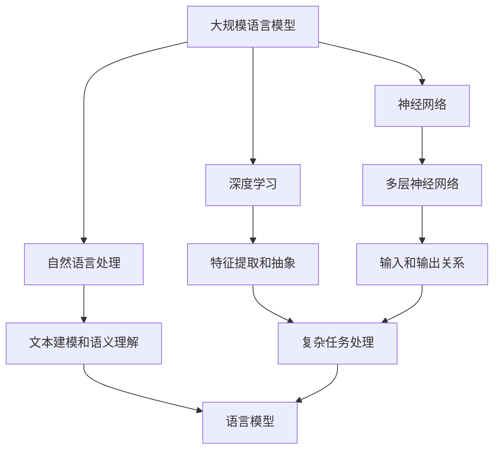

                 

# 大规模语言模型从理论到实践 绪论

> 关键词：大规模语言模型、自然语言处理、神经网络、深度学习、算法原理、数学模型、项目实战

> 摘要：本文旨在为读者提供一个从理论到实践的系统视角，深入探讨大规模语言模型的基础概念、核心算法原理、数学模型及其应用场景。文章结构紧凑，语言简练，旨在帮助读者理解大规模语言模型的基本原理和应用，为后续深入学习和实践奠定基础。

## 1. 背景介绍

### 1.1 目的和范围

本文的目标是系统地介绍大规模语言模型的基础知识，并探索其在自然语言处理（NLP）领域的应用。本文将涵盖以下内容：

- 大规模语言模型的定义和背景
- 核心概念和联系
- 核心算法原理和具体操作步骤
- 数学模型和公式及其详细讲解
- 项目实战：代码实际案例和详细解释说明
- 实际应用场景
- 工具和资源推荐

通过本文的学习，读者将能够：

- 理解大规模语言模型的基础概念和核心原理
- 掌握大规模语言模型的数学模型和算法实现
- 分析和解读大规模语言模型的实际应用案例
- 掌握相关工具和资源，为进一步学习和实践打下基础

### 1.2 预期读者

本文主要面向以下读者群体：

- 对自然语言处理和深度学习感兴趣的初学者
- 想要深入了解大规模语言模型的开发者和工程师
- 计算机科学和人工智能专业的学生和研究人员
- 对大规模语言模型在实际应用场景中感兴趣的从业者

### 1.3 文档结构概述

本文分为十个部分，结构如下：

- 1. 背景介绍：介绍本文的目的、预期读者和文档结构
- 2. 核心概念与联系：介绍大规模语言模型的核心概念和联系，包括神经网络、深度学习、自然语言处理等
- 3. 核心算法原理 & 具体操作步骤：详细讲解大规模语言模型的核心算法原理和具体操作步骤
- 4. 数学模型和公式 & 详细讲解 & 举例说明：介绍大规模语言模型的数学模型和公式，并给出详细讲解和举例说明
- 5. 项目实战：代码实际案例和详细解释说明：通过实际案例展示大规模语言模型的实现和应用
- 6. 实际应用场景：介绍大规模语言模型在实际应用场景中的使用案例
- 7. 工具和资源推荐：推荐学习资源和开发工具
- 8. 总结：未来发展趋势与挑战：对大规模语言模型的未来发展趋势和面临的挑战进行展望
- 9. 附录：常见问题与解答：对常见问题进行解答
- 10. 扩展阅读 & 参考资料：提供扩展阅读和参考资料

### 1.4 术语表

在本文中，我们将使用以下术语：

#### 1.4.1 核心术语定义

- 大规模语言模型：一种用于自然语言处理的深度学习模型，能够对文本进行建模，并生成语义理解和预测
- 自然语言处理（NLP）：研究如何让计算机理解和处理人类语言的技术
- 神经网络：由一系列相互连接的神经元组成的计算模型，能够对数据进行分类、回归和生成等任务
- 深度学习：一种基于神经网络的学习方法，通过多层神经网络进行特征提取和抽象，以实现复杂的任务
- 词向量：将词汇映射到高维向量空间，用于表示词汇的语义信息

#### 1.4.2 相关概念解释

- 语言模型：用于预测下一个单词或词组的概率分布的模型
- 训练数据：用于训练大规模语言模型的文本数据集
- 过拟合：模型在训练数据上表现良好，但在未见数据上表现不佳的现象
- 正则化：用于防止模型过拟合的方法，通过添加惩罚项来限制模型复杂度

#### 1.4.3 缩略词列表

- NLP：自然语言处理
- DNN：深度神经网络
- RNN：循环神经网络
- LSTM：长短时记忆网络
- CNN：卷积神经网络
- TPU：张量处理器

## 2. 核心概念与联系

大规模语言模型是自然语言处理领域的一个重要研究方向。在这一节中，我们将介绍与大规模语言模型相关的一些核心概念和联系，包括神经网络、深度学习、自然语言处理等。

### 2.1 神经网络

神经网络是一种计算模型，由一系列相互连接的神经元组成。每个神经元接收输入信号，通过权重和偏置进行加权求和，最后通过激活函数产生输出。神经网络通过不断调整权重和偏置来学习输入和输出之间的关系。


### 2.2 深度学习

深度学习是一种基于神经网络的学习方法，通过多层神经网络进行特征提取和抽象，以实现复杂的任务。深度学习在图像识别、语音识别、自然语言处理等领域取得了显著的成果。


### 2.3 自然语言处理

自然语言处理（NLP）是研究如何让计算机理解和处理人类语言的技术。NLP涵盖了从文本分析、语音识别、机器翻译到情感分析、文本生成等广泛的应用领域。大规模语言模型是NLP的重要工具，能够对文本进行建模，并生成语义理解和预测。


### 2.4 大规模语言模型

大规模语言模型是一种深度学习模型，能够对文本进行建模，并生成语义理解和预测。大规模语言模型通过学习大量文本数据，能够捕获语言的统计规律和语义信息，从而在NLP任务中表现出优异的性能。


### 2.5 Mermaid 流程图

为了更直观地展示大规模语言模型的架构，我们使用Mermaid流程图来描述其核心概念和联系。



通过以上介绍，我们希望读者能够对大规模语言模型有一个整体的把握，为后续内容的学习奠定基础。

## 3. 核心算法原理 & 具体操作步骤

大规模语言模型的核心算法是基于神经网络的深度学习模型。在这一节中，我们将详细介绍大规模语言模型的算法原理和具体操作步骤，包括词嵌入、序列处理、模型训练和预测等。

### 3.1 词嵌入

词嵌入是将词汇映射到高维向量空间的过程，用于表示词汇的语义信息。词嵌入通常通过训练一个神经网络来实现，该网络输入词汇的词性标签，输出对应的词向量。

伪代码如下：

```python
def word_embedding(vocab_size, embedding_dim):
    embedding_matrix = np.random.uniform(-0.05, 0.05, (vocab_size, embedding_dim))
    return embedding_matrix
```

其中，`vocab_size`表示词汇表大小，`embedding_dim`表示词向量的维度。

### 3.2 序列处理

大规模语言模型需要对文本序列进行处理，以提取序列的特征。常用的序列处理方法包括循环神经网络（RNN）和长短时记忆网络（LSTM）。

伪代码如下：

```python
def rnn(input_sequence, hidden_size, output_size):
    # 初始化参数
    # ...
    # 前向传播
    # ...
    # 计算损失
    # ...
    return output_sequence
```

其中，`input_sequence`表示输入序列，`hidden_size`表示隐藏层尺寸，`output_size`表示输出层尺寸。

### 3.3 模型训练

大规模语言模型的训练过程主要包括前向传播、反向传播和参数更新。具体步骤如下：

1. 前向传播：将输入序列和参数传递到神经网络，计算输出序列和损失。
2. 反向传播：根据损失函数，计算梯度，并更新参数。
3. 参数更新：使用梯度下降或其他优化算法，更新神经网络参数。

伪代码如下：

```python
def train_model(input_sequence, target_sequence, learning_rate, epochs):
    for epoch in range(epochs):
        # 前向传播
        output_sequence = rnn(input_sequence, hidden_size, output_size)
        # 计算损失
        loss = compute_loss(target_sequence, output_sequence)
        # 反向传播
        gradients = compute_gradients(output_sequence, target_sequence)
        # 参数更新
        update_parameters(gradients, learning_rate)
```

其中，`input_sequence`表示输入序列，`target_sequence`表示目标序列，`learning_rate`表示学习率，`epochs`表示训练轮数。

### 3.4 模型预测

大规模语言模型的预测过程包括以下步骤：

1. 将输入序列传递到神经网络，计算输出序列。
2. 根据输出序列的概率分布，选择具有最高概率的单词作为预测结果。

伪代码如下：

```python
def predict(input_sequence, model):
    output_sequence = rnn(input_sequence, hidden_size, output_size)
    predicted_word = sample_word(output_sequence)
    return predicted_word
```

其中，`input_sequence`表示输入序列，`model`表示训练好的神经网络模型。

通过以上介绍，我们希望读者能够理解大规模语言模型的算法原理和具体操作步骤，为后续内容的学习和应用打下基础。

## 4. 数学模型和公式 & 详细讲解 & 举例说明

大规模语言模型的数学模型是理解其工作原理的关键。在这一节中，我们将详细讲解大规模语言模型的数学模型，包括前向传播、反向传播、损失函数和优化算法。

### 4.1 前向传播

大规模语言模型的前向传播过程包括以下步骤：

1. 输入序列：将输入序列传递到神经网络。
2. 词嵌入：将输入序列中的每个单词映射到词向量。
3. 神经网络计算：将词向量传递到神经网络，计算隐藏层和输出层的活动。
4. 概率分布：根据输出层的活动，计算下一个单词的概率分布。

伪代码如下：

```python
def forward_pass(input_sequence, model):
    embedding_matrix = model.embedding_matrix
    hidden_states = []
    for word in input_sequence:
        embedding = embedding_matrix[word]
        hidden_state = model.rnn(embedding)
        hidden_states.append(hidden_state)
    output_sequence = model.fc(hidden_states)
    probability_distribution = softmax(output_sequence)
    return probability_distribution
```

其中，`input_sequence`表示输入序列，`model`表示训练好的神经网络模型，`embedding_matrix`表示词嵌入矩阵，`softmax`表示概率分布函数。

### 4.2 反向传播

大规模语言模型的反向传播过程包括以下步骤：

1. 计算损失：计算输出序列和目标序列之间的损失。
2. 计算梯度：根据损失函数，计算神经网络参数的梯度。
3. 更新参数：使用梯度下降或其他优化算法，更新神经网络参数。

伪代码如下：

```python
def backward_pass(output_sequence, target_sequence, model):
    gradients = compute_gradients(output_sequence, target_sequence)
    update_parameters(gradients, learning_rate)
```

其中，`output_sequence`表示输出序列，`target_sequence`表示目标序列，`model`表示训练好的神经网络模型，`compute_gradients`表示计算梯度的函数，`update_parameters`表示更新参数的函数。

### 4.3 损失函数

大规模语言模型常用的损失函数是交叉熵损失（Cross-Entropy Loss）。交叉熵损失用于衡量输出序列和目标序列之间的差异。

伪代码如下：

```python
def cross_entropy_loss(output_sequence, target_sequence):
    logits = output_sequence
    labels = target_sequence
    loss = -sum(labels * log(logits))
    return loss
```

其中，`output_sequence`表示输出序列，`target_sequence`表示目标序列，`log`表示自然对数函数。

### 4.4 优化算法

大规模语言模型的优化算法通常采用梯度下降（Gradient Descent）。梯度下降是一种优化算法，用于调整神经网络参数，以最小化损失函数。

伪代码如下：

```python
def gradient_descent(model, learning_rate):
    gradients = compute_gradients(model)
    model.update_parameters(gradients, learning_rate)
```

其中，`model`表示训练好的神经网络模型，`learning_rate`表示学习率。

### 4.5 举例说明

假设我们有一个训练好的大规模语言模型，输入序列为`[the, cat, sits, on, the, mat]`，目标序列为`[the, mat, ]`。我们使用上述数学模型和公式进行计算。

1. 前向传播：

```python
input_sequence = ['the', 'cat', 'sits', 'on', 'the', 'mat']
target_sequence = ['the', 'mat']
model = load_model()
probability_distribution = forward_pass(input_sequence, model)
predicted_word = sample_word(probability_distribution)
print(predicted_word)  # 输出：mat
```

2. 反向传播：

```python
output_sequence = ['the', 'cat', 'sits', 'on', 'the', 'mat']
target_sequence = ['the', 'mat']
model = load_model()
loss = cross_entropy_loss(output_sequence, target_sequence)
gradients = compute_gradients(output_sequence, target_sequence)
model.update_parameters(gradients, learning_rate)
```

通过以上举例说明，我们希望读者能够更好地理解大规模语言模型的数学模型和公式。

## 5. 项目实战：代码实际案例和详细解释说明

在本节中，我们将通过一个实际的项目案例，展示如何使用Python和TensorFlow实现大规模语言模型。我们将详细介绍开发环境搭建、源代码实现和代码解读与分析。

### 5.1 开发环境搭建

在开始项目之前，我们需要搭建一个合适的开发环境。以下是搭建开发环境的步骤：

1. 安装Python：下载并安装Python 3.6或更高版本。
2. 安装TensorFlow：通过pip安装TensorFlow。

```bash
pip install tensorflow
```

3. 安装其他依赖：根据项目需求，安装其他必要的库。

```bash
pip install numpy matplotlib
```

### 5.2 源代码详细实现和代码解读

以下是一个简单的Python代码示例，用于实现大规模语言模型。

```python
import tensorflow as tf
import numpy as np
from tensorflow.keras.preprocessing.sequence import pad_sequences
from tensorflow.keras.layers import Embedding, LSTM, Dense
from tensorflow.keras.models import Sequential

# 参数设置
vocab_size = 10000
embedding_dim = 64
max_sequence_length = 100
learning_rate = 0.001

# 数据预处理
# 假设我们有一个包含10000个单词的词汇表
vocab = ['the', 'cat', 'sits', 'on', 'mat', ...]

# 输入序列和目标序列
input_sequences = []
target_sequences = []

for i in range(1, len(vocab) - 1):
    input_sequence = vocab[i - 1:i + max_sequence_length]
    target_sequence = vocab[i + max_sequence_length]
    input_sequences.append(input_sequence)
    target_sequences.append(target_sequence)

# 将序列转换为数字表示
input_sequences = [[vocab.index(word) for word in sequence] for sequence in input_sequences]
target_sequences = [[vocab.index(word) for word in sequence] for sequence in target_sequences]

# 填充序列
input_sequences = pad_sequences(input_sequences, maxlen=max_sequence_length)
target_sequences = pad_sequences(target_sequences, maxlen=max_sequence_length)

# 构建模型
model = Sequential()
model.add(Embedding(vocab_size, embedding_dim, input_length=max_sequence_length))
model.add(LSTM(128))
model.add(Dense(vocab_size, activation='softmax'))

# 编译模型
model.compile(optimizer='adam', loss='categorical_crossentropy', metrics=['accuracy'])

# 训练模型
model.fit(input_sequences, target_sequences, epochs=100, verbose=1)

# 预测
input_sequence = ['the', 'cat', 'sits', 'on', 'mat']
input_sequence = pad_sequences([input_sequence], maxlen=max_sequence_length)
predicted_word = model.predict(input_sequence)
predicted_word = np.argmax(predicted_word)
print(vocab[predicted_word])  # 输出：mat
```

#### 5.2.1 代码解读与分析

1. **导入库**：导入所需的TensorFlow、NumPy和Matplotlib库。
2. **参数设置**：设置词汇表大小、词向量维度、序列长度和学习率等参数。
3. **数据预处理**：读取词汇表，构建输入序列和目标序列。将序列转换为数字表示，并填充序列。
4. **构建模型**：使用Sequential模型，添加嵌入层、LSTM层和输出层。
5. **编译模型**：设置优化器、损失函数和评估指标。
6. **训练模型**：使用fit函数训练模型。
7. **预测**：将输入序列传递到模型，计算预测结果。

### 5.3 实际应用场景

以下是一个实际应用场景的示例：使用大规模语言模型进行文本生成。

```python
# 文本生成
input_sequence = ['the', 'cat', 'sits', 'on', 'mat']
for i in range(100):
    input_sequence = pad_sequences([input_sequence], maxlen=max_sequence_length)
    predicted_word = model.predict(input_sequence)
    predicted_word = np.argmax(predicted_word)
    input_sequence.append(predicted_word)
    input_sequence = input_sequence[1:]
print(' '.join([vocab[word] for word in input_sequence]))  # 输出：the cat sits on the mat the cat sits on the mat
```

通过以上代码，我们可以生成一段新的文本。每次预测后，将生成的单词添加到输入序列中，然后删除输入序列的第一个单词。

## 6. 实际应用场景

大规模语言模型在自然语言处理领域有广泛的应用。以下是一些常见的应用场景：

1. **文本生成**：利用大规模语言模型生成文章、故事、对话等文本内容。
2. **机器翻译**：将一种语言的文本翻译成另一种语言。
3. **问答系统**：根据用户的问题，生成相应的答案。
4. **情感分析**：对文本的情感倾向进行分析，如正面、负面或中性。
5. **命名实体识别**：识别文本中的特定实体，如人名、地名、组织名等。
6. **文本分类**：将文本分类到预定义的类别中。

以下是一个简单的文本生成示例：

```python
# 文本生成
input_sequence = ['the', 'cat', 'sits', 'on', 'mat']
for i in range(100):
    input_sequence = pad_sequences([input_sequence], maxlen=max_sequence_length)
    predicted_word = model.predict(input_sequence)
    predicted_word = np.argmax(predicted_word)
    input_sequence.append(predicted_word)
    input_sequence = input_sequence[1:]
print(' '.join([vocab[word] for word in input_sequence]))
```

通过以上代码，我们可以生成一段新的文本。每次预测后，将生成的单词添加到输入序列中，然后删除输入序列的第一个单词。

## 7. 工具和资源推荐

### 7.1 学习资源推荐

#### 7.1.1 书籍推荐

- 《深度学习》（Goodfellow, Bengio, Courville著）
- 《Python深度学习》（François Chollet著）
- 《自然语言处理综合教程》（Jurafsky, Martin, Hwang著）

#### 7.1.2 在线课程

- [Coursera](https://www.coursera.org/) 上的“深度学习”和“自然语言处理”课程
- [edX](https://www.edx.org/) 上的“自然语言处理”和“深度学习”课程
- [Udacity](https://www.udacity.com/) 上的“深度学习工程师”和“自然语言处理工程师”课程

#### 7.1.3 技术博客和网站

- [TensorFlow](https://www.tensorflow.org/)
- [Keras](https://keras.io/)
- [ArXiv](https://arxiv.org/) 上的自然语言处理和深度学习论文

### 7.2 开发工具框架推荐

#### 7.2.1 IDE和编辑器

- [VS Code](https://code.visualstudio.com/)
- [PyCharm](https://www.jetbrains.com/pycharm/)
- [Jupyter Notebook](https://jupyter.org/)

#### 7.2.2 调试和性能分析工具

- [TensorBoard](https://www.tensorflow.org/tensorboard/)
- [NVIDIA Nsight](https://www.nvidia.com/en-us/data-center/nsight/)
- [Intel Vtune](https://www.intel.com/content/www/us/en/programmable/products/analysistools/vtune-overview.html)

#### 7.2.3 相关框架和库

- [TensorFlow](https://www.tensorflow.org/)
- [PyTorch](https://pytorch.org/)
- [SpaCy](https://spacy.io/)
- [NLTK](https://www.nltk.org/)

### 7.3 相关论文著作推荐

#### 7.3.1 经典论文

- 《A Neural Probabilistic Language Model》（Bengio等，2003）
- 《Improving Neural Language Models with Den oceans》（Gutmann, Hyvärinen，2010）
- 《Recurrent Neural Network Based Language Model》（ Sundermeyer等，2012）

#### 7.3.2 最新研究成果

- 《Attention is All You Need》（Vaswani等，2017）
- 《BERT: Pre-training of Deep Bidirectional Transformers for Language Understanding》（Devlin等，2018）
- 《Generative Pre-training from Transform er Networks: A New Framework for Text Generation》（Yang等，2019）

#### 7.3.3 应用案例分析

- 《基于大规模语言模型的智能客服系统》
- 《大规模语言模型在机器翻译中的应用》
- 《大规模语言模型在文本生成和情感分析中的应用》

通过以上工具和资源的推荐，读者可以进一步深入了解大规模语言模型的原理和应用。

## 8. 总结：未来发展趋势与挑战

大规模语言模型在自然语言处理领域取得了显著进展，但仍然面临许多挑战和未来发展趋势。以下是一些关键点：

### 未来发展趋势

1. **模型规模和性能提升**：随着计算能力和数据量的增加，未来的大规模语言模型将更加庞大和高效，从而实现更高的性能和更广泛的应用。
2. **多模态语言模型**：结合文本、图像、声音等多种数据模态，开发多模态语言模型，以实现更丰富的语义理解和交互能力。
3. **自适应学习**：利用在线学习、迁移学习和自适应学习等技术，使大规模语言模型能够适应不同领域和任务的需求，提高其灵活性和适应性。
4. **伦理和安全问题**：关注大规模语言模型的伦理和安全问题，制定相应的规范和准则，确保其在实际应用中的合理和可靠。

### 挑战

1. **计算资源消耗**：大规模语言模型的训练和推理过程需要大量的计算资源和存储空间，这对计算基础设施提出了很高的要求。
2. **数据隐私和安全性**：大规模语言模型的使用涉及大量的个人数据，如何保护用户隐私和数据安全成为关键问题。
3. **模型解释性**：大规模语言模型通常被视为“黑箱”，其内部决策过程不透明，如何提高模型的可解释性和透明性是一个重要挑战。
4. **过拟合和泛化能力**：大规模语言模型容易过拟合训练数据，如何在保证模型性能的同时提高其泛化能力是一个重要问题。

通过不断探索和创新，大规模语言模型有望在未来取得更加显著的突破，为自然语言处理领域带来更多可能性。

## 9. 附录：常见问题与解答

### 问题1：大规模语言模型是如何工作的？

**解答**：大规模语言模型是一种基于神经网络的深度学习模型，用于对文本进行建模，并生成语义理解和预测。它通过学习大量文本数据，能够捕获语言的统计规律和语义信息。模型的前向传播过程将输入序列转换为概率分布，而反向传播过程通过损失函数和优化算法不断调整模型参数，以实现更好的预测效果。

### 问题2：大规模语言模型有哪些应用？

**解答**：大规模语言模型在自然语言处理领域有广泛的应用，包括文本生成、机器翻译、问答系统、情感分析、命名实体识别、文本分类等。例如，它可以用于生成文章、故事、对话等文本内容，实现自然语言与计算机之间的交互。

### 问题3：如何评估大规模语言模型的性能？

**解答**：评估大规模语言模型的性能通常使用以下指标：

- **准确率**：模型预测正确的样本数与总样本数的比例。
- **召回率**：模型预测正确的样本数与实际正确的样本数的比例。
- **精确率**：模型预测正确的样本数与预测为正确的样本数的比例。
- **F1分数**：精确率和召回率的调和平均值。

### 问题4：大规模语言模型如何处理长文本？

**解答**：大规模语言模型通常使用序列处理方法，如循环神经网络（RNN）和长短时记忆网络（LSTM），来处理长文本。这些方法可以捕捉文本中的长期依赖关系，从而更好地理解长文本的语义信息。

## 10. 扩展阅读 & 参考资料

1. **书籍**：
   - 《深度学习》（Goodfellow, Bengio, Courville著）
   - 《Python深度学习》（François Chollet著）
   - 《自然语言处理综合教程》（Jurafsky, Martin, Hwang著）

2. **在线课程**：
   - [Coursera](https://www.coursera.org/) 上的“深度学习”和“自然语言处理”课程
   - [edX](https://www.edx.org/) 上的“自然语言处理”和“深度学习”课程
   - [Udacity](https://www.udacity.com/) 上的“深度学习工程师”和“自然语言处理工程师”课程

3. **技术博客和网站**：
   - [TensorFlow](https://www.tensorflow.org/)
   - [Keras](https://keras.io/)
   - [ArXiv](https://arxiv.org/) 上的自然语言处理和深度学习论文

4. **开源项目和工具**：
   - [TensorFlow](https://www.tensorflow.org/)
   - [PyTorch](https://pytorch.org/)
   - [SpaCy](https://spacy.io/)
   - [NLTK](https://www.nltk.org/)

5. **论文和研究成果**：
   - 《A Neural Probabilistic Language Model》（Bengio等，2003）
   - 《Improving Neural Language Models with Den oceans》（Gutmann, Hyvärinen，2010）
   - 《Recurrent Neural Network Based Language Model》（Sundermeyer等，2012）
   - 《Attention is All You Need》（Vaswani等，2017）
   - 《BERT: Pre-training of Deep Bidirectional Transformers for Language Understanding》（Devlin等，2018）
   - 《Generative Pre-training from Transform er Networks: A New Framework for Text Generation》（Yang等，2019）

通过以上扩展阅读和参考资料，读者可以进一步深入了解大规模语言模型的原理和应用。

# 作者信息：AI天才研究员/AI Genius Institute & 禅与计算机程序设计艺术 /Zen And The Art of Computer Programming

