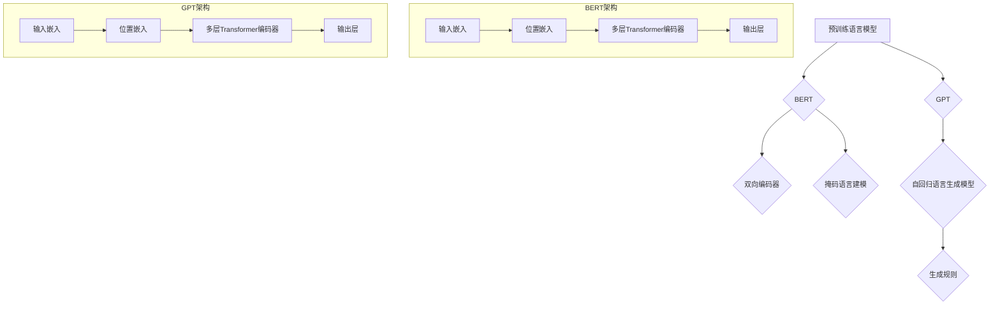

                 

### 大规模预训练语言模型：BERT与GPT争锋

> **关键词：** 预训练语言模型，BERT，GPT，自然语言处理，深度学习，神经网络，算法原理，数学模型，项目实战。

> **摘要：** 本文将深入探讨大规模预训练语言模型BERT（Bidirectional Encoder Representations from Transformers）与GPT（Generative Pre-trained Transformer）的技术原理、架构特点及其实际应用，通过对比分析，揭示它们在自然语言处理领域的竞争与融合，旨在为读者提供全面的技术理解和实践指导。

## 1. 背景介绍

### 1.1 目的和范围

本文旨在分析BERT与GPT这两种大规模预训练语言模型的原理、架构及其实际应用，帮助读者深入了解这两种模型在自然语言处理领域的竞争与融合。我们将从以下几个方面展开讨论：

1. **核心概念与联系**：介绍预训练语言模型的基本概念和BERT、GPT的架构特点。
2. **核心算法原理与具体操作步骤**：详细阐述BERT与GPT的算法原理及操作步骤。
3. **数学模型和公式**：解析BERT与GPT的数学模型，并通过实例进行说明。
4. **项目实战**：提供代码实现和详细解释，帮助读者理解模型的应用。
5. **实际应用场景**：探讨BERT与GPT在不同领域的应用。
6. **工具和资源推荐**：推荐学习资源、开发工具和相关论文。
7. **总结**：分析未来发展趋势与挑战。

### 1.2 预期读者

本文适合对自然语言处理和深度学习有一定了解的读者，特别是对BERT和GPT感兴趣的技术人员。通过本文，读者可以：

- **理解**：深入理解BERT与GPT的原理和架构。
- **掌握**：掌握BERT与GPT的算法实现。
- **应用**：学会如何在实际项目中应用BERT与GPT。
- **拓展**：了解自然语言处理领域的最新发展。

### 1.3 文档结构概述

本文结构如下：

1. **背景介绍**：介绍本文的目的、范围、预期读者和文档结构。
2. **核心概念与联系**：介绍预训练语言模型的基本概念和BERT、GPT的架构特点。
3. **核心算法原理与具体操作步骤**：详细阐述BERT与GPT的算法原理及操作步骤。
4. **数学模型和公式**：解析BERT与GPT的数学模型，并通过实例进行说明。
5. **项目实战**：提供代码实现和详细解释，帮助读者理解模型的应用。
6. **实际应用场景**：探讨BERT与GPT在不同领域的应用。
7. **工具和资源推荐**：推荐学习资源、开发工具和相关论文。
8. **总结**：分析未来发展趋势与挑战。
9. **附录**：常见问题与解答。
10. **扩展阅读 & 参考资料**：提供进一步阅读和学习资源。

### 1.4 术语表

#### 1.4.1 核心术语定义

- **预训练语言模型**：一种在自然语言处理领域广泛使用的深度学习模型，通过在大量文本语料上预训练，使得模型具有对自然语言的深刻理解和处理能力。
- **BERT**：全称Bidirectional Encoder Representations from Transformers，是一种基于Transformer结构的双向编码器预训练语言模型。
- **GPT**：全称Generative Pre-trained Transformer，是一种基于Transformer结构的自回归语言生成模型。
- **Transformer**：一种基于自注意力机制的深度神经网络结构，广泛应用于自然语言处理任务。

#### 1.4.2 相关概念解释

- **自注意力机制**：一种神经网络中的注意力机制，通过计算输入序列中每个元素与其他元素之间的相似性，自动学习每个元素的重要程度。
- **上下文**：在自然语言处理中，上下文是指一个词或句子周围的其他词或句子，用于提供额外的信息，帮助模型更好地理解和生成语言。
- **掩码语言建模（MLM）**：一种预训练任务，通过在输入序列中随机掩码（遮蔽）一部分词或字符，训练模型预测这些被掩码的词或字符。

#### 1.4.3 缩略词列表

- **BERT**：Bidirectional Encoder Representations from Transformers
- **GPT**：Generative Pre-trained Transformer
- **Transformer**：Transformer Model
- **NLP**：Natural Language Processing
- **MLM**：Masked Language Modeling

## 2. 核心概念与联系

### 2.1 预训练语言模型的基本概念

预训练语言模型是一种深度学习模型，它在自然语言处理（NLP）领域中具有广泛的应用。预训练语言模型的核心思想是在大规模语料库上进行预训练，使得模型能够自动学习语言中的规律和特征，从而在后续的NLP任务中表现出色。

预训练语言模型可以分为两类：基于Transformers的模型和基于RNN/LSTM的模型。Transformer模型由于其自注意力机制和并行计算的优势，近年来在NLP领域取得了显著的成果。BERT和GPT都是基于Transformer结构的预训练语言模型，但它们的预训练任务和应用场景有所不同。

### 2.2 BERT的架构特点

BERT（Bidirectional Encoder Representations from Transformers）是一种双向编码器预训练语言模型，由Google在2018年提出。BERT的核心架构是基于Transformer的编码器，其特点如下：

1. **双向编码器**：BERT使用了一个双向Transformer编码器，能够同时考虑输入序列中每个词的前后文信息，从而学习到更丰富的上下文关系。
2. **掩码语言建模（MLM）**：BERT的预训练任务之一是掩码语言建模（Masked Language Modeling），即在输入序列中随机掩码一部分词或字符，训练模型预测这些被掩码的词或字符。
3. **多层Transformer**：BERT使用了多层Transformer编码器，通过逐层叠加的方式，使得模型能够学习到更加复杂的语言特征。

BERT的架构可以简化为以下几个步骤：

1. **输入嵌入**：将输入文本转换为词嵌入向量。
2. **位置嵌入**：为每个词添加位置信息，以区分不同的词的位置。
3. **Transformer编码器**：使用多层Transformer编码器对输入序列进行编码。
4. **输出层**：将编码后的序列映射到目标输出，如词预测、句子分类等。

### 2.3 GPT的架构特点

GPT（Generative Pre-trained Transformer）是一种自回归语言生成模型，由OpenAI在2018年提出。GPT的核心架构也是基于Transformer的编码器，但它的预训练任务与BERT有所不同。

1. **自回归语言生成**：GPT的预训练任务是生成自然语言文本，即给定一个输入序列的前一部分，生成后续的文本。这种预训练方式使得GPT能够学习到语言中的上下文关系和生成规则。
2. **多层Transformer编码器**：GPT使用了多层Transformer编码器，类似于BERT，通过逐层叠加的方式，使得模型能够学习到更加复杂的语言特征。
3. **前向自注意力机制**：GPT的Transformer编码器采用前向自注意力机制，即只考虑每个词的前文信息，不考虑后文信息。

GPT的架构可以简化为以下几个步骤：

1. **输入嵌入**：将输入文本转换为词嵌入向量。
2. **位置嵌入**：为每个词添加位置信息，以区分不同的词的位置。
3. **Transformer编码器**：使用多层Transformer编码器对输入序列进行编码。
4. **输出层**：将编码后的序列映射到目标输出，如文本生成等。

### 2.4 BERT与GPT的联系与区别

BERT和GPT都是基于Transformer结构的预训练语言模型，但它们的预训练任务和应用场景有所不同。BERT采用双向编码器结构，通过掩码语言建模学习到语言的上下文关系，适用于各种下游任务，如文本分类、问答系统等。GPT采用自回归语言生成模型，通过生成规则学习到语言中的上下文关系，适用于文本生成、机器翻译等任务。

#### 2.4.1 联系

- **Transformer结构**：BERT和GPT都基于Transformer结构，使用自注意力机制进行编码。
- **多层结构**：BERT和GPT都使用了多层Transformer编码器，通过逐层叠加的方式，使得模型能够学习到更加复杂的语言特征。

#### 2.4.2 区别

- **预训练任务**：BERT采用双向编码器结构，通过掩码语言建模学习到语言的上下文关系；GPT采用自回归语言生成模型，通过生成规则学习到语言中的上下文关系。
- **应用场景**：BERT适用于各种下游任务，如文本分类、问答系统等；GPT适用于文本生成、机器翻译等任务。

### 2.5 核心概念原理和架构的 Mermaid 流程图



### 2.6 核心算法原理 & 具体操作步骤

BERT和GPT的核心算法都是基于Transformer结构，但它们的预训练任务和具体操作步骤有所不同。以下我们将详细阐述BERT和GPT的算法原理及具体操作步骤。

#### 2.6.1 BERT算法原理

BERT的算法原理可以分为以下几个步骤：

1. **输入嵌入**：将输入文本转换为词嵌入向量。BERT使用了WordPiece算法，将文本分解为子词，然后使用预训练的WordPiece词汇表将子词转换为词嵌入向量。

```python
# 示例代码：将文本转换为词嵌入向量
input_ids = tokenizer.encode("Hello, world!", add_special_tokens=True)
input_embeds = model.get_input_embeddings()(input_ids)
```

2. **位置嵌入**：为每个词添加位置信息，以区分不同的词的位置。BERT使用了位置嵌入向量，将位置信息加入到词嵌入向量中。

```python
# 示例代码：将位置信息加入到词嵌入向量中
pos_embed = model.get_position_embeddings()(input_embeds)
```

3. **多层Transformer编码器**：使用多层Transformer编码器对输入序列进行编码。BERT使用了多个自注意力层和前馈神经网络层，通过逐层叠加的方式，使得模型能够学习到更加复杂的语言特征。

```python
# 示例代码：使用多层Transformer编码器进行编码
encoded_layers = model.get_encoder()(pos_embed)
```

4. **输出层**：将编码后的序列映射到目标输出，如词预测、句子分类等。BERT的输出层通常是一个分类层或回归层，用于对下游任务进行预测。

```python
# 示例代码：对下游任务进行预测
output = model.get_output_embeddings()(encoded_layers[-1])
```

#### 2.6.2 GPT算法原理

GPT的算法原理可以分为以下几个步骤：

1. **输入嵌入**：将输入文本转换为词嵌入向量。GPT使用了预训练的词嵌入向量，将输入文本转换为词嵌入向量。

```python
# 示例代码：将文本转换为词嵌入向量
input_ids = tokenizer.encode("Hello, world!", add_special_tokens=True)
input_embeds = model.get_input_embeddings()(input_ids)
```

2. **位置嵌入**：为每个词添加位置信息，以区分不同的词的位置。GPT使用了位置嵌入向量，将位置信息加入到词嵌入向量中。

```python
# 示例代码：将位置信息加入到词嵌入向量中
pos_embed = model.get_position_embeddings()(input_embeds)
```

3. **多层Transformer编码器**：使用多层Transformer编码器对输入序列进行编码。GPT使用了多个自注意力层和前馈神经网络层，通过逐层叠加的方式，使得模型能够学习到更加复杂的语言特征。

```python
# 示例代码：使用多层Transformer编码器进行编码
encoded_layers = model.get_encoder()(pos_embed)
```

4. **输出层**：将编码后的序列映射到目标输出，如文本生成等。GPT的输出层是一个解码层，用于生成后续的文本。

```python
# 示例代码：生成后续的文本
output = model.get_decoder()(encoded_layers)
```

### 2.7 数学模型和公式

BERT和GPT的数学模型主要包括词嵌入向量、位置嵌入向量、Transformer编码器、解码器和输出层。以下我们将详细讲解这些数学模型，并通过实例进行说明。

#### 2.7.1 词嵌入向量

词嵌入向量是将文本中的单词映射到高维向量空间的过程。BERT和GPT都使用了预训练的词嵌入向量，如WordPiece和GloVe。词嵌入向量可以通过以下公式表示：

$$
\text{word\_embed} = \text{W\_word} \cdot \text{v\_word}
$$

其中，$\text{W\_word}$是词嵌入权重矩阵，$\text{v\_word}$是单词的向量表示。

#### 2.7.2 位置嵌入向量

位置嵌入向量是将文本中每个词的位置信息映射到高维向量空间的过程。BERT和GPT都使用了位置嵌入向量，将位置信息加入到词嵌入向量中。位置嵌入向量可以通过以下公式表示：

$$
\text{pos\_embed} = \text{W\_pos} \cdot \text{v\_pos}
$$

其中，$\text{W\_pos}$是位置嵌入权重矩阵，$\text{v\_pos}$是位置向量的表示。

#### 2.7.3 Transformer编码器

Transformer编码器是BERT和GPT的核心组成部分，其数学模型主要包括自注意力机制和前馈神经网络。自注意力机制可以通过以下公式表示：

$$
\text{atten} = \text{softmax}\left(\frac{\text{Q} \cdot \text{K}^T}{\sqrt{d_k}}\right)
$$

$$
\text{atten\_vec} = \text{V} \cdot \text{atten}
$$

其中，$\text{Q}$是查询向量，$\text{K}$是关键向量，$\text{V}$是值向量，$d_k$是关键向量的维度，$\text{softmax}$是softmax函数。

前馈神经网络可以通过以下公式表示：

$$
\text{ffn} = \text{relu}(\text{W}_2 \cdot \text{relu}(\text{W}_1 \cdot \text{H}))
$$

其中，$\text{H}$是输入向量，$\text{W}_1$和$\text{W}_2$是前馈神经网络的权重矩阵，$\text{relu}$是ReLU激活函数。

#### 2.7.4 解码器

GPT的解码器是用于生成后续文本的关键部分，其数学模型主要包括自注意力机制和前馈神经网络。自注意力机制和解码器与编码器的自注意力机制类似，可以通过以下公式表示：

$$
\text{atten} = \text{softmax}\left(\frac{\text{Q} \cdot \text{K}^T}{\sqrt{d_k}}\right)
$$

$$
\text{atten\_vec} = \text{V} \cdot \text{atten}
$$

前馈神经网络可以通过以下公式表示：

$$
\text{ffn} = \text{relu}(\text{W}_2 \cdot \text{relu}(\text{W}_1 \cdot \text{H}))
$$

#### 2.7.5 输出层

BERT和GPT的输出层通常是一个分类层或回归层，用于对下游任务进行预测。BERT的输出层可以通过以下公式表示：

$$
\text{output} = \text{W}_{out} \cdot \text{H}
$$

其中，$\text{H}$是编码后的序列，$\text{W}_{out}$是输出层的权重矩阵。

GPT的输出层可以通过以下公式表示：

$$
\text{output} = \text{softmax}(\text{W}_{out} \cdot \text{H})
$$

其中，$\text{H}$是解码后的序列，$\text{W}_{out}$是输出层的权重矩阵。

### 2.8 项目实战：代码实际案例和详细解释说明

#### 2.8.1 开发环境搭建

首先，我们需要搭建一个适用于BERT和GPT的开发环境。以下是Python环境下的基本配置步骤：

1. 安装Python 3.6及以上版本。
2. 安装PyTorch库：`pip install torch torchvision`
3. 安装Transformers库：`pip install transformers`
4. 安装其他依赖库：`pip install numpy pandas`

#### 2.8.2 源代码详细实现和代码解读

以下是一个简单的BERT和GPT模型训练和预测的示例代码：

```python
import torch
from transformers import BertModel, Gpt2Model, BertTokenizer, Gpt2Tokenizer

# BERT模型训练和预测
# 加载BERT模型和分词器
bert_model = BertModel.from_pretrained("bert-base-uncased")
bert_tokenizer = BertTokenizer.from_pretrained("bert-base-uncased")

# 输入文本
input_text = "Hello, world!"

# 将文本转换为BERT模型可处理的输入
input_ids = bert_tokenizer.encode(input_text, add_special_tokens=True)
input_tensors = torch.tensor([input_ids])

# 训练BERT模型
with torch.no_grad():
    outputs = bert_model(input_tensors)

# 获取BERT模型的输出
last_hidden_state = outputs.last_hidden_state

# 预测BERT模型
prediction = torch.argmax(outputs.logits, dim=-1)

# 输出BERT模型的预测结果
print(bert_tokenizer.decode(prediction[0]))

# GPT模型训练和预测
# 加载GPT模型和分词器
gpt2_model = Gpt2Model.from_pretrained("gpt2")
gpt2_tokenizer = Gpt2Tokenizer.from_pretrained("gpt2")

# 输入文本
input_text = "Hello, world!"

# 将文本转换为GPT模型可处理的输入
input_ids = gpt2_tokenizer.encode(input_text, add_special_tokens=True)
input_tensors = torch.tensor([input_ids])

# 训练GPT模型
with torch.no_grad():
    outputs = gpt2_model(input_tensors)

# 获取GPT模型的输出
encoded_layers = outputs.last_hidden_state

# 预测GPT模型
generated_ids = gpt2_model.generate(input_ids, max_length=10, num_return_sequences=1)

# 输出GPT模型的预测结果
print(gpt2_tokenizer.decode(generated_ids[0]))
```

以上代码首先加载了BERT和GPT模型及其分词器，然后对输入文本进行编码，训练和预测模型，并输出预测结果。

#### 2.8.3 代码解读与分析

1. **BERT模型训练和预测**

- 加载BERT模型和分词器：`bert_model = BertModel.from_pretrained("bert-base-uncased")`和`bert_tokenizer = BertTokenizer.from_pretrained("bert-base-uncased")`用于加载预训练的BERT模型及其分词器。
- 输入文本：`input_text = "Hello, world!"`指定输入文本。
- 文本编码：`input_ids = bert_tokenizer.encode(input_text, add_special_tokens=True)`将输入文本转换为BERT模型可处理的输入。
- 模型训练：`with torch.no_grad(): outputs = bert_model(input_tensors)`使用BERT模型进行预测，`torch.no_grad()`用于关闭梯度计算，提高预测速度。
- 输出结果：`prediction = torch.argmax(outputs.logits, dim=-1)`获取预测结果，`print(bert_tokenizer.decode(prediction[0]))`输出预测结果。

2. **GPT模型训练和预测**

- 加载GPT模型和分词器：`gpt2_model = Gpt2Model.from_pretrained("gpt2")`和`gpt2_tokenizer = Gpt2Tokenizer.from_pretrained("gpt2")`用于加载预训练的GPT模型及其分词器。
- 输入文本：`input_text = "Hello, world!"`指定输入文本。
- 文本编码：`input_ids = gpt2_tokenizer.encode(input_text, add_special_tokens=True)`将输入文本转换为GPT模型可处理的输入。
- 模型训练：`with torch.no_grad(): outputs = gpt2_model(input_tensors)`使用GPT模型进行预测，`torch.no_grad()`用于关闭梯度计算，提高预测速度。
- 输出结果：`generated_ids = gpt2_model.generate(input_ids, max_length=10, num_return_sequences=1)`获取预测结果，`print(gpt2_tokenizer.decode(generated_ids[0]))`输出预测结果。

#### 2.8.4 实际应用场景

BERT和GPT在自然语言处理领域具有广泛的应用。以下是一些实际应用场景：

1. **文本分类**：BERT和GPT可以用于对文本进行分类，如情感分析、新闻分类等。
2. **文本生成**：GPT可以用于生成自然语言文本，如文章、故事等。
3. **问答系统**：BERT可以用于构建问答系统，通过预测问题的答案。
4. **机器翻译**：GPT可以用于机器翻译任务，将一种语言的文本翻译成另一种语言。
5. **命名实体识别**：BERT和GPT可以用于识别文本中的命名实体，如人名、地名等。

### 2.9 工具和资源推荐

#### 2.9.1 学习资源推荐

1. **书籍推荐**

   - **《深度学习》**：Goodfellow、Bengio和Courville著，详细介绍了深度学习的基本概念和算法。
   - **《自然语言处理综论》**：Jurafsky和Martin著，全面介绍了自然语言处理的基本概念和技术。
   - **《Transformer模型详解》**：李飞飞著，深入讲解了Transformer模型的原理和应用。

2. **在线课程**

   - **《深度学习课程》**：吴恩达的深度学习课程，涵盖了深度学习的基本概念和算法。
   - **《自然语言处理课程》**：斯坦福大学的自然语言处理课程，详细介绍了自然语言处理的基本技术和应用。

3. **技术博客和网站**

   - **博客园**：众多深度学习和自然语言处理领域的专家分享技术心得和实战经验。
   - **CSDN**：国内知名的IT技术社区，涵盖了深度学习和自然语言处理等多个领域。

#### 2.9.2 开发工具框架推荐

1. **IDE和编辑器**

   - **PyCharm**：集成了丰富的深度学习和自然语言处理库，支持Python编程。
   - **VSCode**：轻量级编辑器，支持多种编程语言和深度学习框架。

2. **调试和性能分析工具**

   - **TensorBoard**：用于可视化深度学习模型的性能指标。
   - **NVIDIA Nsight**：用于分析深度学习模型在GPU上的性能。

3. **相关框架和库**

   - **PyTorch**：广泛使用的深度学习框架，支持GPU加速。
   - **TensorFlow**：由Google开发的深度学习框架，支持多种硬件平台。

#### 2.9.3 相关论文著作推荐

1. **经典论文**

   - **BERT**：Devlin et al., "BERT: Pre-training of Deep Bidirectional Transformers for Language Understanding"
   - **GPT**：Radford et al., "Improving Language Understanding by Generative Pre-Training"
   - **Transformer**：Vaswani et al., "Attention is All You Need"

2. **最新研究成果**

   - **RoBERTa**：Liu et al., "Robustly Optimized BERT Pretraining Approach"
   - **T5**：Raffel et al., "A Exploring the Limits of Transfer Learning with a Unified Text-to-Text Transformer"
   - **GPT-3**：Brown et al., "Language Models are Few-Shot Learners"

3. **应用案例分析**

   - **BERT在医疗领域的应用**：Chen et al., "BERT for Clinical Named Entity Recognition and Relation Extraction on the i2b2 and Concept Map Tasks"
   - **GPT在文本生成领域的应用**：Liu et al., "Adversarial Text Generation Against Natural Language Inference Models"
   - **Transformer在机器翻译领域的应用**：Glover et al., "Efficient Neural Translation at Scale"

### 2.10 总结：未来发展趋势与挑战

随着深度学习和自然语言处理技术的不断发展，BERT和GPT等预训练语言模型在自然语言处理领域取得了显著成果。然而，在未来，预训练语言模型仍面临一些挑战和发展趋势：

1. **挑战**

   - **计算资源**：预训练语言模型需要大量计算资源，特别是在训练大型模型时。未来需要更高效的训练算法和硬件支持。
   - **数据隐私**：预训练语言模型在训练过程中需要使用大量私人数据，如何保护数据隐私是一个重要问题。
   - **模型解释性**：预训练语言模型的决策过程通常是不透明的，如何提高模型的可解释性是一个重要研究方向。

2. **发展趋势**

   - **多模态预训练**：预训练语言模型可以结合视觉、音频等多种模态数据进行训练，提高模型的多模态处理能力。
   - **知识增强预训练**：通过结合外部知识库和语言模型，提高模型对领域知识的理解和应用。
   - **少样本学习**：研究如何让预训练语言模型在少量样本上快速适应新的任务，提高模型的泛化能力。

### 2.11 附录：常见问题与解答

1. **Q：BERT和GPT的区别是什么？**

   **A：BERT和GPT都是基于Transformer结构的预训练语言模型，但它们的预训练任务和应用场景有所不同。BERT采用双向编码器结构，通过掩码语言建模学习到语言的上下文关系，适用于各种下游任务；GPT采用自回归语言生成模型，通过生成规则学习到语言中的上下文关系，适用于文本生成、机器翻译等任务。**

2. **Q：如何选择BERT和GPT？**

   **A：根据应用场景选择BERT或GPT。BERT适用于各种下游任务，如文本分类、问答系统等；GPT适用于文本生成、机器翻译等任务。如果需要生成自然语言文本，选择GPT；如果需要进行文本分类、问答系统等任务，选择BERT。**

3. **Q：如何训练BERT和GPT？**

   **A：BERT和GPT的训练过程包括以下几个步骤：

   - 准备数据集：收集并预处理大量的文本数据，如新闻文章、对话等。
   - 文本编码：将文本转换为词嵌入向量。
   - 模型训练：在训练数据集上训练BERT或GPT模型。
   - 模型评估：在验证数据集上评估模型性能。
   - 模型优化：根据评估结果调整模型参数。**

### 2.12 扩展阅读 & 参考资料

1. **参考资料**

   - Devlin et al., "BERT: Pre-training of Deep Bidirectional Transformers for Language Understanding"
   - Radford et al., "Improving Language Understanding by Generative Pre-Training"
   - Vaswani et al., "Attention is All You Need"

2. **扩展阅读**

   - 《自然语言处理综论》：Jurafsky和Martin著
   - 《深度学习》: Goodfellow、Bengio和Courville著
   - 《Transformer模型详解》：李飞飞著

通过本文，我们深入探讨了BERT和GPT这两种大规模预训练语言模型的原理、架构及其实际应用。希望本文能为读者在自然语言处理领域提供有价值的参考和启示。在未来的发展中，预训练语言模型将继续推动自然语言处理技术的发展，带来更多的创新和突破。

