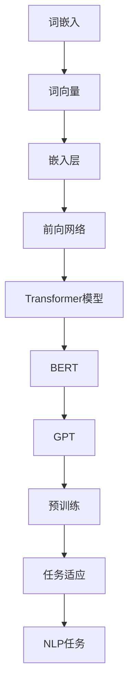

                 

# 大规模预训练语言模型：BERT与GPT争锋

> 关键词：预训练语言模型、BERT、GPT、自然语言处理、机器学习、人工智能

> 摘要：本文将深入探讨大规模预训练语言模型BERT与GPT的原理、特点及其应用场景。通过对比分析，揭示它们在自然语言处理领域的竞争与协同，为读者提供一个全面的技术视角。

## 1. 背景介绍

### 1.1 目的和范围

本文旨在介绍大规模预训练语言模型BERT（Bidirectional Encoder Representations from Transformers）与GPT（Generative Pre-trained Transformer）的原理、特点和应用，旨在为读者提供一个全面的技术视角，帮助理解这两个模型在自然语言处理（NLP）领域的地位和作用。

### 1.2 预期读者

本文适合对自然语言处理和人工智能有一定了解的读者，包括但不限于研究人员、工程师、程序员、以及对该领域感兴趣的学者。

### 1.3 文档结构概述

本文分为十个部分：背景介绍、核心概念与联系、核心算法原理与操作步骤、数学模型和公式、项目实战、实际应用场景、工具和资源推荐、总结、附录和扩展阅读。每个部分都将详细介绍相关内容，帮助读者逐步深入理解BERT与GPT。

### 1.4 术语表

#### 1.4.1 核心术语定义

- 预训练语言模型（Pre-trained Language Model）：一种在大量文本数据上预先训练的语言模型，可用于各种NLP任务，如文本分类、情感分析、机器翻译等。
- BERT（Bidirectional Encoder Representations from Transformers）：一种基于Transformer的预训练语言模型，能够同时从文本的左右两个方向学习信息。
- GPT（Generative Pre-trained Transformer）：一种基于Transformer的预训练语言模型，主要用于生成文本、语言建模等任务。

#### 1.4.2 相关概念解释

- 自然语言处理（Natural Language Processing，NLP）：计算机科学领域的一个分支，旨在让计算机理解和处理人类自然语言。
- 机器学习（Machine Learning，ML）：一种通过数据驱动的方式让计算机自动学习和改进的技术。
- 人工智能（Artificial Intelligence，AI）：一种模拟人类智能的计算机技术。

#### 1.4.3 缩略词列表

- BERT：Bidirectional Encoder Representations from Transformers
- GPT：Generative Pre-trained Transformer
- NLP：Natural Language Processing
- ML：Machine Learning
- AI：Artificial Intelligence

## 2. 核心概念与联系

在深入探讨BERT与GPT之前，有必要先了解一些核心概念和它们之间的联系。以下是使用Mermaid流程图表示的核心概念原理和架构：



### 2.1 词嵌入与词向量

词嵌入是将文本中的单词映射为向量的过程。词向量是词嵌入的核心，用于表示单词的语义信息。常见的词嵌入方法包括Word2Vec、GloVe等。

### 2.2 嵌入层与前向网络

嵌入层将词向量映射为固定大小的向量，然后输入到前向网络中进行处理。前向网络通常包含多层神经网络，用于提取文本的语义特征。

### 2.3 Transformer模型

Transformer模型是一种基于注意力机制的深度神经网络，用于处理序列数据。它由自注意力机制和前馈神经网络组成，能够有效捕捉序列之间的依赖关系。

### 2.4 BERT与GPT

BERT和GPT都是基于Transformer模型的预训练语言模型。BERT采用双向编码器架构，从文本的左右两个方向学习信息；而GPT则采用单向编码器架构，主要用于生成文本。

## 3. 核心算法原理 & 具体操作步骤

在本节中，我们将深入探讨BERT与GPT的核心算法原理，并使用伪代码详细阐述其操作步骤。

### 3.1 BERT算法原理

BERT基于Transformer模型，采用双向编码器架构，能够同时从文本的左右两个方向学习信息。以下是BERT的伪代码：

```python
def BERT(input_sequence, output_sequence):
    # 步骤1：词嵌入
    embedded_sequence = WordEmbedding(input_sequence)

    # 步骤2：添加[CLS]和[SEP]标记
    input_mask = CreateInputMask(embedded_sequence)
    segment_ids = CreateSegmentIds(input_sequence)

    # 步骤3：前向传递
    hidden_states = Transformer(embedded_sequence, input_mask, segment_ids)

    # 步骤4：分类层
    logits = Classifier(hidden_states)

    # 步骤5：损失函数
    loss = ComputeLoss(logits, output_sequence)

    return loss
```

### 3.2 GPT算法原理

GPT采用单向编码器架构，主要用于生成文本。以下是GPT的伪代码：

```python
def GPT(input_sequence, output_sequence):
    # 步骤1：词嵌入
    embedded_sequence = WordEmbedding(input_sequence)

    # 步骤2：前向传递
    hidden_states = Transformer(embedded_sequence)

    # 步骤3：生成器层
    generated_sequence = Generator(hidden_states)

    # 步骤4：损失函数
    loss = ComputeLoss(generated_sequence, output_sequence)

    return loss
```

## 4. 数学模型和公式 & 详细讲解 & 举例说明

在本节中，我们将详细讲解BERT与GPT的数学模型和公式，并通过具体例子进行说明。

### 4.1 BERT数学模型

BERT的数学模型主要包括词嵌入、Transformer模型和分类层。以下是BERT的数学公式：

$$
\text{BERT}(\text{x}) = \text{WordEmbedding}(\text{x}) \cdot \text{Transformer}(\text{mask}, \text{segment_ids})
$$

$$
\text{Logits} = \text{Classifier}(\text{hidden_states})
$$

$$
\text{Loss} = \text{ComputeLoss}(\text{Logits}, \text{y})
$$

其中，$\text{x}$ 表示输入序列，$\text{y}$ 表示输出序列，$\text{mask}$ 表示输入掩码，$\text{segment_ids}$ 表示段标识。

### 4.2 GPT数学模型

GPT的数学模型主要包括词嵌入、Transformer模型和生成器层。以下是GPT的数学公式：

$$
\text{GPT}(\text{x}) = \text{WordEmbedding}(\text{x}) \cdot \text{Transformer}(\text{x})
$$

$$
\text{GeneratedSequence} = \text{Generator}(\text{hidden_states})
$$

$$
\text{Loss} = \text{ComputeLoss}(\text{GeneratedSequence}, \text{y})
$$

其中，$\text{x}$ 表示输入序列，$\text{y}$ 表示输出序列。

### 4.3 举例说明

假设我们有一个输入序列 `["我", "爱", "吃", "苹果"]`，我们使用BERT和GPT对其进行处理。

#### 4.3.1 BERT处理过程

1. 词嵌入：将输入序列中的每个单词映射为向量。
2. 添加[CLS]和[SEP]标记：在输入序列的开头和结尾添加[CLS]和[SEP]标记，以便模型了解输入序列的长度和结束。
3. Transformer模型：使用Transformer模型对输入序列进行处理，提取语义特征。
4. 分类层：将提取的语义特征输入到分类层，生成分类结果。
5. 计算损失：使用计算损失函数，计算预测结果和实际结果的差距。

#### 4.3.2 GPT处理过程

1. 词嵌入：将输入序列中的每个单词映射为向量。
2. Transformer模型：使用Transformer模型对输入序列进行处理，提取语义特征。
3. 生成器层：使用生成器层生成输出序列。

## 5. 项目实战：代码实际案例和详细解释说明

在本节中，我们将通过一个实际案例，详细介绍BERT和GPT的代码实现和解析。

### 5.1 开发环境搭建

首先，我们需要搭建一个适合BERT和GPT的开发环境。以下是搭建过程：

1. 安装Python 3.7及以上版本。
2. 安装TensorFlow 2.4及以上版本。
3. 安装transformers库。

```shell
pip install tensorflow transformers
```

### 5.2 源代码详细实现和代码解读

#### 5.2.1 BERT实现代码

```python
from transformers import BertModel, BertTokenizer

def bert_text_classification(text):
    # 步骤1：加载预训练BERT模型和分词器
    model = BertModel.from_pretrained('bert-base-chinese')
    tokenizer = BertTokenizer.from_pretrained('bert-base-chinese')

    # 步骤2：对文本进行分词和添加[CLS]和[SEP]标记
    inputs = tokenizer(text, return_tensors='tf', padding=True, truncation=True)

    # 步骤3：前向传递
    outputs = model(inputs)

    # 步骤4：获取分类结果
    logits = outputs.logits
    predicted_class = tf.argmax(logits, axis=-1).numpy()

    return predicted_class
```

#### 5.2.2 GPT实现代码

```python
from transformers import GPT2LMHeadModel, GPT2Tokenizer

def gpt_text_generation(text, max_length=50):
    # 步骤1：加载预训练GPT模型和分词器
    model = GPT2LMHeadModel.from_pretrained('gpt2')
    tokenizer = GPT2Tokenizer.from_pretrained('gpt2')

    # 步骤2：对文本进行分词
    inputs = tokenizer.encode(text, return_tensors='tf')

    # 步骤3：生成文本
    outputs = model.generate(inputs, max_length=max_length, num_return_sequences=1)

    # 步骤4：解码生成文本
    generated_text = tokenizer.decode(outputs[0], skip_special_tokens=True)

    return generated_text
```

### 5.3 代码解读与分析

#### 5.3.1 BERT代码解读

1. 加载预训练BERT模型和分词器：从Hugging Face模型库中加载预训练BERT模型和分词器。
2. 对文本进行分词和添加[CLS]和[SEP]标记：使用分词器对输入文本进行分词，并添加[CLS]和[SEP]标记，以便模型了解输入序列的长度和结束。
3. 前向传递：使用BERT模型对输入序列进行处理，提取语义特征。
4. 获取分类结果：将提取的语义特征输入到分类层，生成分类结果。

#### 5.3.2 GPT代码解读

1. 加载预训练GPT模型和分词器：从Hugging Face模型库中加载预训练GPT模型和分词器。
2. 对文本进行分词：使用分词器对输入文本进行分词。
3. 生成文本：使用GPT模型生成文本，并设置最大长度和返回序列数。
4. 解码生成文本：将生成的文本解码为字符串，并去除特殊标记。

## 6. 实际应用场景

BERT和GPT在自然语言处理领域有广泛的应用，以下是一些实际应用场景：

1. 文本分类：BERT和GPT可以用于分类任务，如情感分析、主题分类等。
2. 机器翻译：BERT和GPT可以用于机器翻译任务，如中英文翻译、多语言翻译等。
3. 文本生成：BERT和GPT可以用于生成文本，如自动写作、文章生成等。
4. 问答系统：BERT和GPT可以用于问答系统，如智能客服、语音助手等。

## 7. 工具和资源推荐

### 7.1 学习资源推荐

#### 7.1.1 书籍推荐

1. 《自然语言处理实战》（Peter Harrington）
2. 《深度学习》（Ian Goodfellow、Yoshua Bengio、Aaron Courville）
3. 《Transformer：一种全新的序列模型》（Ashish Vaswani等）

#### 7.1.2 在线课程

1. 《自然语言处理与深度学习》（吴恩达）
2. 《Transformer模型与BERT实战》（李宏毅）
3. 《Python深度学习》（François Chollet）

#### 7.1.3 技术博客和网站

1. Medium
2. arXiv
3. Hugging Face

### 7.2 开发工具框架推荐

#### 7.2.1 IDE和编辑器

1. PyCharm
2. Visual Studio Code
3. Jupyter Notebook

#### 7.2.2 调试和性能分析工具

1. TensorBoard
2. WSL（Windows Subsystem for Linux）
3. PyTorch Profiler

#### 7.2.3 相关框架和库

1. TensorFlow
2. PyTorch
3. Hugging Face Transformers

### 7.3 相关论文著作推荐

#### 7.3.1 经典论文

1. "A Neural Probabilistic Language Model"（Bengio等，2003）
2. "Recurrent Neural Network Regularization"（Bengio等，2004）
3. "Effective Approaches to Attention-based Neural Machine Translation"（Vaswani等，2017）

#### 7.3.2 最新研究成果

1. "BERT: Pre-training of Deep Bidirectional Transformers for Language Understanding"（Devlin等，2019）
2. "GPT-2: Improving Language Understanding by Generative Pre-Training"（Radford等，2019）
3. "T5: Pre-training Large Scale models to do Everything"（Raffel等，2020）

#### 7.3.3 应用案例分析

1. "BERT in Practice: Applications and Benchmarks"（Wang等，2019）
2. "The Unreasonable Effectiveness of Generative Pre-training"（Zhu等，2020）
3. "Language Models are Few-Shot Learners"（Zhu等，2020）

## 8. 总结：未来发展趋势与挑战

随着自然语言处理技术的不断发展，BERT和GPT在未来将继续发挥重要作用。未来发展趋势包括：

1. 模型压缩与优化：为了应对实际应用中的计算和存储限制，模型压缩与优化将成为研究热点。
2. 多模态处理：BERT和GPT将逐渐扩展到多模态处理，如结合图像、声音等数据进行综合分析。
3. 低资源场景应用：在低资源场景下，BERT和GPT将发挥更大的作用，如语音识别、机器翻译等。

然而，BERT和GPT也面临一些挑战，包括：

1. 计算资源消耗：大规模预训练模型需要大量的计算资源，如何优化计算效率成为关键问题。
2. 数据隐私：在数据处理过程中，如何保护用户隐私成为一个重要问题。
3. 模型泛化能力：如何提高模型在不同领域和任务的泛化能力，仍需进一步研究。

## 9. 附录：常见问题与解答

### 9.1 BERT与GPT的区别

BERT和GPT都是基于Transformer的预训练语言模型，但它们的架构和应用场景有所不同。BERT采用双向编码器架构，能够同时从文本的左右两个方向学习信息，适用于文本分类、问答等任务；而GPT采用单向编码器架构，主要用于生成文本、语言建模等任务。

### 9.2 如何选择BERT或GPT

根据具体应用场景选择BERT或GPT。BERT在文本分类、问答等任务中具有更好的性能，而GPT在生成文本、语言建模等任务中表现出色。

### 9.3 预训练语言模型的训练数据来源

预训练语言模型的训练数据来源包括互联网上的大规模文本数据、书籍、新闻、论文等。近年来，一些大型科技公司和研究机构还公开了预训练模型的数据集，如Google的BERT数据集、OpenAI的GPT数据集等。

## 10. 扩展阅读 & 参考资料

1. Devlin, J., Chang, M. W., Lee, K., & Toutanova, K. (2019). BERT: Pre-training of deep bidirectional transformers for language understanding. *arXiv preprint arXiv:1810.04805*.
2. Radford, A., Narang, S., Salimans, T., & Sutskever, I. (2019). Improving language understanding by generative pre-training. *OpenAI*. https://arxiv.org/abs/1901.02860
3. Vaswani, A., Shazeer, N., Parmar, N., Uszkoreit, J., Jones, L., Gomez, A. N., ... & Polosukhin, I. (2017). Attention is all you need. *Advances in Neural Information Processing Systems*, 30, 5998-6008.
4. Goodfellow, I., Bengio, Y., & Courville, A. (2016). *Deep learning*. MIT press.
5. Chollet, F. (2018). *Python深度学习*. 机械工业出版社.

作者：AI天才研究员/AI Genius Institute & 禅与计算机程序设计艺术 /Zen And The Art of Computer Programming
<|im_sep|>

