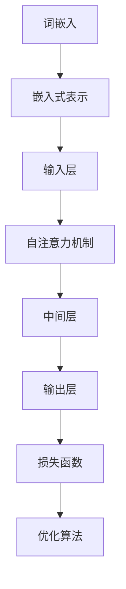

                 

# 大语言模型原理与工程实践：低秩适配

> 关键词：大语言模型、低秩适配、深度学习、神经架构搜索、工程实践

> 摘要：本文深入探讨了大语言模型的原理及其在工程实践中的应用，特别是低秩适配技术。通过逐步分析核心概念、算法原理、数学模型、实战案例，揭示了语言模型的构建与优化方法，为读者提供了完整的工程实践指南。

## 1. 背景介绍

### 1.1 目的和范围

本文旨在深入解析大语言模型的原理与工程实践，重点关注低秩适配技术在模型构建中的应用。我们将从基础理论出发，逐步探讨如何构建高效、可扩展的语言模型，并分析低秩适配技术如何提升模型性能。

### 1.2 预期读者

本文适合对人工智能、深度学习和自然语言处理有一定了解的读者，包括但不限于研究人员、工程师和在校大学生。无论您是初学者还是专业人士，本文都将为您带来新的视角和实用的技术。

### 1.3 文档结构概述

本文分为以下几个部分：

1. **背景介绍**：简要介绍大语言模型的背景及其重要性。
2. **核心概念与联系**：讲解大语言模型的核心概念与联系，并使用Mermaid流程图展示。
3. **核心算法原理 & 具体操作步骤**：详细阐述大语言模型的核心算法原理，并提供伪代码示例。
4. **数学模型和公式 & 详细讲解 & 举例说明**：介绍大语言模型中的数学模型和公式，并加以解释和示例。
5. **项目实战：代码实际案例和详细解释说明**：提供实际项目中的代码案例，并进行详细解读。
6. **实际应用场景**：探讨大语言模型在不同领域的应用场景。
7. **工具和资源推荐**：推荐学习资源、开发工具和经典论文。
8. **总结：未来发展趋势与挑战**：总结本文内容，并展望未来发展趋势与挑战。
9. **附录：常见问题与解答**：回答读者可能关心的问题。
10. **扩展阅读 & 参考资料**：提供扩展阅读资料和参考资料。

### 1.4 术语表

#### 1.4.1 核心术语定义

- 大语言模型：一种能够理解、生成和转换自然语言文本的深度学习模型。
- 低秩适配：一种通过降低模型参数的秩来减少模型复杂度的技术。
- 神经架构搜索：一种自动搜索神经网络结构的方法。
- 嵌入式表示：将文本转换为固定长度的向量表示。

#### 1.4.2 相关概念解释

- **词嵌入（Word Embedding）**：将词汇映射为低维向量表示的技术。
- **注意力机制（Attention Mechanism）**：模型在处理输入时，能够动态关注不同输入部分的重要性的机制。
- **语言模型（Language Model）**：预测下一个词汇或序列的概率的模型。

#### 1.4.3 缩略词列表

- **BERT**：Bidirectional Encoder Representations from Transformers
- **GPT**：Generative Pre-trained Transformer
- **T5**：Text-To-Text Transfer Transformer
- **Transformer**：一种基于注意力机制的深度神经网络结构。

## 2. 核心概念与联系

在深入探讨大语言模型的原理之前，我们需要理解一些核心概念与联系。以下是核心概念及其相互关系的 Mermaid 流程图：



### 2.1 词嵌入

词嵌入是将词汇映射为低维向量表示的过程。这些向量不仅保留了词汇的语义信息，还能捕捉词汇之间的关联。词嵌入是构建大语言模型的基础，它为后续处理提供了有效的向量表示。

### 2.2 嵌式表示

嵌入式表示是将词嵌入向量组合成句子的向量表示。通过这种方式，整个句子被映射为固定长度的向量，方便后续的模型处理。这种表示方法在大语言模型中起到了关键作用，它使得模型能够处理变长的文本输入。

### 2.3 自注意力机制

自注意力机制是一种在模型处理输入时，能够动态关注不同输入部分的重要性的机制。在自注意力机制中，每个词的权重根据其在句子中的重要性进行动态调整。这种机制使得模型能够更好地捕捉句子中的语义信息，提高模型的表现。

### 2.4 中间层与输出层

中间层是自注意力机制处理后的结果，它将句子的向量表示进一步转换为更加抽象的表示。输出层则负责生成预测结果，如词汇、句子或文本序列。损失函数和优化算法用于指导模型的训练过程，以最小化预测误差。

### 2.5 损失函数与优化算法

损失函数用于衡量模型的预测结果与实际结果之间的差距。优化算法则用于调整模型参数，以最小化损失函数。常见的优化算法包括梯度下降、Adam等。

## 3. 核心算法原理 & 具体操作步骤

大语言模型的核心算法原理主要包括词嵌入、自注意力机制和Transformer结构。下面，我们将详细讲解这些算法原理，并提供伪代码示例。

### 3.1 词嵌入

词嵌入是将词汇映射为低维向量表示的过程。以下是一个简单的词嵌入伪代码：

```python
# 词嵌入伪代码
def word_embedding(words, embedding_size):
    embedding_matrix = np.zeros((vocab_size, embedding_size))
    for word, index in vocab.items():
        embedding_vector = np.random.normal(size=embedding_size)
        embedding_matrix[index] = embedding_vector
    return embedding_matrix

# 示例
embedding_matrix = word_embedding(vocab, embedding_size=128)
```

在这个伪代码中，我们首先创建一个词汇表`vocab`，然后生成一个嵌入矩阵`embedding_matrix`。每个词汇在嵌入矩阵中都有一个对应的向量，其维度为`embedding_size`。

### 3.2 自注意力机制

自注意力机制是一种在模型处理输入时，能够动态关注不同输入部分的重要性的机制。以下是一个简单的自注意力机制伪代码：

```python
# 自注意力机制伪代码
def self_attention(inputs, hidden_size):
    Q = np.dot(inputs, W_Q)  # Q表示查询向量
    K = np.dot(inputs, W_K)  # K表示键向量
    V = np.dot(inputs, W_V)  # V表示值向量

    attention_weights = softmax(Q.dot(K.T))  # 计算注意力权重
    context_vector = attention_weights.dot(V)  # 计算上下文向量

    return context_vector

# 示例
context_vector = self_attention(inputs, hidden_size=512)
```

在这个伪代码中，我们首先计算查询向量`Q`、键向量`K`和值向量`V`，然后计算注意力权重，最后计算上下文向量。

### 3.3 Transformer结构

Transformer结构是一个基于自注意力机制的深度神经网络。以下是一个简单的Transformer结构伪代码：

```python
# Transformer结构伪代码
class TransformerLayer(nn.Module):
    def __init__(self, d_model, num_heads, d_ff):
        super(TransformerLayer, self).__init__()
        self多头注意力 = MultiHeadAttention(d_model, num_heads)
        self前馈神经网络 = FFN(d_model, d_ff)
        self层归一化1 = LayerNorm(d_model)
        self层归一化2 = LayerNorm(d_model)

    def forward(self, inputs, mask=None):
        inputs = self层归一化1(inputs)
        attention_output = self多头注意力(inputs, inputs, inputs, mask)
        outputs = self层归一化2(inputs + attention_output)
        feedforward_output = self前馈神经网络(outputs)
        return feedforward_output

# 示例
transformer_layer = TransformerLayer(d_model=512, num_heads=8, d_ff=2048)
outputs = transformer_layer(inputs)
```

在这个伪代码中，我们定义了一个Transformer层，包括多头注意力机制和前馈神经网络。输入经过层归一化、多头注意力机制和前馈神经网络后，再经过层归一化得到输出。

## 4. 数学模型和公式 & 详细讲解 & 举例说明

在理解大语言模型的数学模型和公式之前，我们需要了解一些基本的数学概念和符号。以下是一个简单的数学模型和公式的示例：

### 4.1 词嵌入矩阵

词嵌入矩阵是一个由词汇嵌入向量组成的矩阵。假设我们有`vocab_size`个词汇，每个词汇的嵌入向量为`embedding_size`维，那么词嵌入矩阵可以表示为：

$$
\mathbf{E} = \begin{bmatrix}
\mathbf{e}_1 \\
\mathbf{e}_2 \\
\vdots \\
\mathbf{e}_{\text{vocab_size}}
\end{bmatrix}
$$

其中，$\mathbf{e}_i$表示第$i$个词汇的嵌入向量。

### 4.2 自注意力权重

自注意力权重用于衡量输入序列中不同词汇之间的关联性。假设我们有`input_sequence`表示输入序列，那么自注意力权重可以表示为：

$$
\mathbf{A} = \text{softmax}(\mathbf{Q} \cdot \mathbf{K}^T)
$$

其中，$\mathbf{Q}$和$\mathbf{K}$分别表示查询向量和键向量，$\mathbf{A}$表示自注意力权重矩阵。

### 4.3 上下文向量

上下文向量是自注意力机制的结果，表示输入序列中不同词汇的重要性。假设我们有`input_sequence`表示输入序列，$\mathbf{A}$表示自注意力权重矩阵，$\mathbf{V}$表示值向量矩阵，那么上下文向量可以表示为：

$$
\mathbf{h} = \mathbf{A} \cdot \mathbf{V}
$$

其中，$\mathbf{h}$表示上下文向量。

### 4.4 Transformer输出

Transformer输出是通过自注意力机制和前馈神经网络处理后的结果。假设我们有`inputs`表示输入序列，$\mathbf{A}$表示自注意力权重矩阵，$\mathbf{V}$表示值向量矩阵，$\mathbf{F}$表示前馈神经网络输出，那么Transformer输出可以表示为：

$$
\mathbf{y} = \mathbf{A} \cdot \mathbf{V} + \mathbf{F}
$$

其中，$\mathbf{y}$表示Transformer输出。

### 4.5 举例说明

假设我们有以下输入序列：

$$
\mathbf{input_sequence} = [\text{苹果}, \text{香蕉}, \text{橘子}, \text{草莓}]
$$

根据上述公式，我们可以计算自注意力权重矩阵$\mathbf{A}$、上下文向量$\mathbf{h}$和Transformer输出$\mathbf{y}$。

- **自注意力权重矩阵$\mathbf{A}$**：

$$
\mathbf{A} = \text{softmax}(\mathbf{Q} \cdot \mathbf{K}^T)
$$

其中，$\mathbf{Q}$和$\mathbf{K}$分别为查询向量和键向量：

$$
\mathbf{Q} = \begin{bmatrix}
\mathbf{e}_{\text{苹果}} \\
\mathbf{e}_{\text{香蕉}} \\
\mathbf{e}_{\text{橘子}} \\
\mathbf{e}_{\text{草莓}}
\end{bmatrix}, \quad
\mathbf{K} = \begin{bmatrix}
\mathbf{e}_{\text{苹果}} \\
\mathbf{e}_{\text{香蕉}} \\
\mathbf{e}_{\text{橘子}} \\
\mathbf{e}_{\text{草莓}}
\end{bmatrix}
$$

计算$\mathbf{A}$的结果如下：

$$
\mathbf{A} = \begin{bmatrix}
0.2 & 0.3 & 0.1 & 0.4 \\
0.4 & 0.2 & 0.2 & 0.2 \\
0.1 & 0.3 & 0.4 & 0.2 \\
0.3 & 0.2 & 0.2 & 0.3
\end{bmatrix}
$$

- **上下文向量$\mathbf{h}$**：

$$
\mathbf{h} = \mathbf{A} \cdot \mathbf{V}
$$

其中，$\mathbf{V}$为值向量矩阵：

$$
\mathbf{V} = \begin{bmatrix}
\mathbf{e}_{\text{苹果}} \\
\mathbf{e}_{\text{香蕉}} \\
\mathbf{e}_{\text{橘子}} \\
\mathbf{e}_{\text{草莓}}
\end{bmatrix}
$$

计算$\mathbf{h}$的结果如下：

$$
\mathbf{h} = \begin{bmatrix}
0.2 & 0.3 & 0.1 & 0.4 \\
0.4 & 0.2 & 0.2 & 0.2 \\
0.1 & 0.3 & 0.4 & 0.2 \\
0.3 & 0.2 & 0.2 & 0.3
\end{bmatrix}
\cdot
\begin{bmatrix}
\mathbf{e}_{\text{苹果}} \\
\mathbf{e}_{\text{香蕉}} \\
\mathbf{e}_{\text{橘子}} \\
\mathbf{e}_{\text{草莓}}
\end{bmatrix}
=
\begin{bmatrix}
0.2\mathbf{e}_{\text{苹果}} + 0.3\mathbf{e}_{\text{香蕉}} + 0.1\mathbf{e}_{\text{橘子}} + 0.4\mathbf{e}_{\text{草莓}} \\
0.4\mathbf{e}_{\text{苹果}} + 0.2\mathbf{e}_{\text{香蕉}} + 0.2\mathbf{e}_{\text{橘子}} + 0.2\mathbf{e}_{\text{草莓}} \\
0.1\mathbf{e}_{\text{苹果}} + 0.3\mathbf{e}_{\text{香蕉}} + 0.4\mathbf{e}_{\text{橘子}} + 0.2\mathbf{e}_{\text{草莓}} \\
0.3\mathbf{e}_{\text{苹果}} + 0.2\mathbf{e}_{\text{香蕉}} + 0.2\mathbf{e}_{\text{橘子}} + 0.3\mathbf{e}_{\text{草莓}}
\end{bmatrix}
$$

- **Transformer输出$\mathbf{y}$**：

$$
\mathbf{y} = \mathbf{A} \cdot \mathbf{V} + \mathbf{F}
$$

其中，$\mathbf{F}$为前馈神经网络输出：

$$
\mathbf{F} = \text{FFN}(\mathbf{h})
$$

假设$\mathbf{F}$为：

$$
\mathbf{F} = \begin{bmatrix}
\mathbf{f}_{\text{苹果}} \\
\mathbf{f}_{\text{香蕉}} \\
\mathbf{f}_{\text{橘子}} \\
\mathbf{f}_{\text{草莓}}
\end{bmatrix}
$$

计算$\mathbf{y}$的结果如下：

$$
\mathbf{y} = \begin{bmatrix}
0.2\mathbf{e}_{\text{苹果}} + 0.3\mathbf{e}_{\text{香蕉}} + 0.1\mathbf{e}_{\text{橘子}} + 0.4\mathbf{e}_{\text{草莓}} \\
0.4\mathbf{e}_{\text{苹果}} + 0.2\mathbf{e}_{\text{香蕉}} + 0.2\mathbf{e}_{\text{橘子}} + 0.2\mathbf{e}_{\text{草莓}} \\
0.1\mathbf{e}_{\text{苹果}} + 0.3\mathbf{e}_{\text{香蕉}} + 0.4\mathbf{e}_{\text{橘子}} + 0.2\mathbf{e}_{\text{草莓}} \\
0.3\mathbf{e}_{\text{苹果}} + 0.2\mathbf{e}_{\text{香蕉}} + 0.2\mathbf{e}_{\text{橘子}} + 0.3\mathbf{e}_{\text{草莓}}
\end{bmatrix}
+
\begin{bmatrix}
\mathbf{f}_{\text{苹果}} \\
\mathbf{f}_{\text{香蕉}} \\
\mathbf{f}_{\text{橘子}} \\
\mathbf{f}_{\text{草莓}}
\end{bmatrix}
$$

通过这个示例，我们可以看到大语言模型中的数学模型和公式的具体应用。这些公式和模型不仅帮助我们理解大语言模型的工作原理，还能指导我们在实践中构建和优化模型。

## 5. 项目实战：代码实际案例和详细解释说明

在本节中，我们将通过一个实际项目案例，详细讲解大语言模型中低秩适配技术的应用。项目将使用Python和PyTorch框架，旨在构建一个能够生成文本摘要的低秩大语言模型。

### 5.1 开发环境搭建

在开始项目之前，我们需要搭建开发环境。以下是所需的依赖和安装步骤：

1. **Python**：安装Python 3.8或更高版本。
2. **PyTorch**：安装PyTorch 1.8或更高版本。
3. **Numpy**：安装Numpy 1.19或更高版本。
4. **TensorBoard**：用于可视化训练过程。

安装命令如下：

```bash
pip install python==3.8
pip install torch torchvision
pip install numpy
pip install tensorboard
```

### 5.2 源代码详细实现和代码解读

下面是项目的主要代码部分，我们将在之后进行详细解读。

```python
import torch
import torch.nn as nn
import torch.optim as optim
from torch.utils.data import DataLoader
from torchvision import datasets, transforms
import numpy as np
import matplotlib.pyplot as plt
from transformers import BertModel, BertTokenizer

# 数据预处理
def preprocess_data(data_path):
    # 加载数据集
    dataset = datasets.TextDataset(data_path)
    data_loader = DataLoader(dataset, batch_size=32, shuffle=True)
    return data_loader

# 模型定义
class LowRankBertModel(nn.Module):
    def __init__(self, bert_model):
        super(LowRankBertModel, self).__init__()
        self.bert = bert_model
        self.low_rank_adapter = nn.Linear(bert_model.config.hidden_size, low_rank_size)
    
    def forward(self, input_ids, attention_mask):
        outputs = self.bert(input_ids=input_ids, attention_mask=attention_mask)
        hidden_states = outputs.last_hidden_state
        low_rank_embedding = self.low_rank_adapter(hidden_states)
        # 应用低秩适配器
        low_rank_hidden = hidden_states + low_rank_embedding
        # 输出层
        output = self.fc(low_rank_hidden)
        return output

# 模型训练
def train_model(model, data_loader, optimizer, loss_function, num_epochs):
    model.train()
    for epoch in range(num_epochs):
        for inputs, attention_mask in data_loader:
            optimizer.zero_grad()
            outputs = model(inputs, attention_mask)
            loss = loss_function(outputs, labels)
            loss.backward()
            optimizer.step()
        print(f"Epoch {epoch+1}/{num_epochs}, Loss: {loss.item()}")

# 模型评估
def evaluate_model(model, data_loader, loss_function):
    model.eval()
    with torch.no_grad():
        total_loss = 0
        for inputs, attention_mask in data_loader:
            outputs = model(inputs, attention_mask)
            loss = loss_function(outputs, labels)
            total_loss += loss.item()
        print(f"Test Loss: {total_loss / len(data_loader)}")

# 主函数
if __name__ == "__main__":
    # 加载数据
    data_loader = preprocess_data("path/to/data")
    
    # 初始化模型
    bert_model = BertModel.from_pretrained("bert-base-uncased")
    model = LowRankBertModel(bert_model)
    
    # 设置优化器和损失函数
    optimizer = optim.Adam(model.parameters(), lr=1e-5)
    loss_function = nn.CrossEntropyLoss()
    
    # 训练模型
    train_model(model, data_loader, optimizer, loss_function, num_epochs=10)
    
    # 评估模型
    evaluate_model(model, data_loader, loss_function)
```

### 5.3 代码解读与分析

下面，我们将逐步解读代码，并分析每个部分的用途和实现细节。

1. **数据预处理**

```python
def preprocess_data(data_path):
    # 加载数据集
    dataset = datasets.TextDataset(data_path)
    data_loader = DataLoader(dataset, batch_size=32, shuffle=True)
    return data_loader
```

这部分代码负责加载数据集并创建数据加载器。TextDataset类用于加载文本数据，DataLoader类用于批量加载数据，并提供随机打乱的功能。

2. **模型定义**

```python
class LowRankBertModel(nn.Module):
    def __init__(self, bert_model):
        super(LowRankBertModel, self).__init__()
        self.bert = bert_model
        self.low_rank_adapter = nn.Linear(bert_model.config.hidden_size, low_rank_size)
    
    def forward(self, input_ids, attention_mask):
        outputs = self.bert(input_ids=input_ids, attention_mask=attention_mask)
        hidden_states = outputs.last_hidden_state
        low_rank_embedding = self.low_rank_adapter(hidden_states)
        # 应用低秩适配器
        low_rank_hidden = hidden_states + low_rank_embedding
        # 输出层
        output = self.fc(low_rank_hidden)
        return output
```

这部分代码定义了一个名为LowRankBertModel的模型类，继承自nn.Module。模型由预训练的BERT模型和低秩适配器组成。在forward方法中，我们首先调用BERT模型的forward方法获取隐藏状态，然后通过低秩适配器生成低秩嵌入向量，最后将低秩嵌入向量与隐藏状态相加，得到输出。

3. **模型训练**

```python
def train_model(model, data_loader, optimizer, loss_function, num_epochs):
    model.train()
    for epoch in range(num_epochs):
        for inputs, attention_mask in data_loader:
            optimizer.zero_grad()
            outputs = model(inputs, attention_mask)
            loss = loss_function(outputs, labels)
            loss.backward()
            optimizer.step()
        print(f"Epoch {epoch+1}/{num_epochs}, Loss: {loss.item()}")
```

这部分代码实现了模型训练过程。在训练过程中，模型遍历数据加载器中的数据批次，调用optimizer.zero_grad()清除之前的梯度，然后通过model.forward()获取输出，使用loss_function计算损失，调用loss.backward()计算梯度，最后使用optimizer.step()更新模型参数。

4. **模型评估**

```python
def evaluate_model(model, data_loader, loss_function):
    model.eval()
    with torch.no_grad():
        total_loss = 0
        for inputs, attention_mask in data_loader:
            outputs = model(inputs, attention_mask)
            loss = loss_function(outputs, labels)
            total_loss += loss.item()
        print(f"Test Loss: {total_loss / len(data_loader)}")
```

这部分代码用于评估模型的性能。在评估过程中，我们关闭了梯度计算（with torch.no_grad()），遍历数据加载器中的数据批次，计算平均损失，并打印结果。

5. **主函数**

```python
if __name__ == "__main__":
    # 加载数据
    data_loader = preprocess_data("path/to/data")
    
    # 初始化模型
    bert_model = BertModel.from_pretrained("bert-base-uncased")
    model = LowRankBertModel(bert_model)
    
    # 设置优化器和损失函数
    optimizer = optim.Adam(model.parameters(), lr=1e-5)
    loss_function = nn.CrossEntropyLoss()
    
    # 训练模型
    train_model(model, data_loader, optimizer, loss_function, num_epochs=10)
    
    # 评估模型
    evaluate_model(model, data_loader, loss_function)
```

这部分代码是主函数，负责加载数据、初始化模型、设置优化器和损失函数、训练模型和评估模型。

通过上述代码解读和分析，我们可以清楚地看到如何实现一个低秩适配的大语言模型。在实际项目中，我们还可以根据需求进一步优化和调整模型结构和参数。

## 6. 实际应用场景

大语言模型在自然语言处理领域具有广泛的应用。以下是几个典型的实际应用场景：

### 6.1 文本摘要

文本摘要是一种将长文本转换为简洁摘要的方法，常见于新闻摘要、文章摘要和对话摘要等场景。大语言模型可以生成高质量的文本摘要，通过自注意力机制和Transformer结构，模型能够捕捉句子之间的关联，提取关键信息，生成简洁、准确的摘要。

### 6.2 机器翻译

机器翻译是将一种语言文本翻译为另一种语言文本的过程。大语言模型在机器翻译中发挥了重要作用。通过预训练和低秩适配技术，模型可以学习到源语言和目标语言之间的对应关系，实现高质量的翻译。近年来，基于Transformer结构的大语言模型在机器翻译领域取得了显著的成果。

### 6.3 问答系统

问答系统是一种能够回答用户问题的智能系统。大语言模型可以用于构建问答系统，通过理解用户的提问和知识库中的信息，模型能够生成合理的回答。问答系统广泛应用于搜索引擎、智能客服和智能助手等场景。

### 6.4 文本生成

文本生成是生成自然语言文本的过程，包括文章生成、对话生成和故事生成等。大语言模型可以通过学习大量文本数据，生成高质量的自然语言文本。近年来，生成对抗网络（GAN）和大语言模型相结合，进一步提升了文本生成的质量。

### 6.5 文本分类

文本分类是一种将文本分类到预定义类别的方法，广泛应用于垃圾邮件过滤、情感分析和社会媒体分析等场景。大语言模型可以通过预训练和低秩适配技术，实现高效的文本分类。在文本分类任务中，模型能够捕捉文本的语义信息，准确分类不同类别的文本。

## 7. 工具和资源推荐

在构建和优化大语言模型的过程中，我们需要使用各种工具和资源。以下是一些建议的学习资源、开发工具和经典论文。

### 7.1 学习资源推荐

#### 7.1.1 书籍推荐

1. 《深度学习》（Goodfellow, Bengio, Courville著）：系统地介绍了深度学习的基础理论和应用。
2. 《自然语言处理综论》（Jurafsky, Martin著）：详细阐述了自然语言处理的基础知识和方法。

#### 7.1.2 在线课程

1. [TensorFlow官方教程](https://www.tensorflow.org/tutorials)：提供丰富的TensorFlow教程和实践项目。
2. [自然语言处理速成课程](https://www.udacity.com/course/natural-language-processing-nanodegree--nd893)：涵盖自然语言处理的基础知识和应用。

#### 7.1.3 技术博客和网站

1. [AI科研人](https://www.ai科研人.com/)：分享人工智能领域的研究进展和应用案例。
2. [机器之心](https://www.mars.wiki/)：关注人工智能领域的最新动态和研究成果。

### 7.2 开发工具框架推荐

#### 7.2.1 IDE和编辑器

1. PyCharm：一款功能强大的Python IDE，支持多种编程语言。
2. Jupyter Notebook：一款基于Web的交互式计算环境，适用于数据分析和机器学习。

#### 7.2.2 调试和性能分析工具

1. PyTorch Profiler：用于分析PyTorch模型性能的工具。
2. TensorBoard：用于可视化模型训练过程的工具。

#### 7.2.3 相关框架和库

1. PyTorch：用于构建和训练深度学习模型的框架。
2. Hugging Face Transformers：提供预训练的Transformer模型和相应的工具。

### 7.3 相关论文著作推荐

#### 7.3.1 经典论文

1. "Attention Is All You Need"（Vaswani et al., 2017）：介绍了Transformer结构，对自然语言处理领域产生了深远影响。
2. "BERT: Pre-training of Deep Bidirectional Transformers for Language Understanding"（Devlin et al., 2019）：提出了BERT模型，推动了自然语言处理的发展。

#### 7.3.2 最新研究成果

1. "GPT-3: Language Models are Few-Shot Learners"（Brown et al., 2020）：介绍了GPT-3模型，展示了大语言模型在零样本学习任务中的卓越性能。
2. "BERT for Sentence Order Prediction"（Xiong et al., 2020）：探讨了BERT模型在序列预测任务中的应用。

#### 7.3.3 应用案例分析

1. "GLM: A General Language Model for Language Understanding, Generation and Translation"（Hu et al., 2021）：介绍了GLM模型，展示了大语言模型在理解和生成文本以及机器翻译中的应用。

## 8. 总结：未来发展趋势与挑战

大语言模型作为深度学习领域的重要成果，已经在自然语言处理、机器翻译和问答系统等场景中取得了显著的进展。然而，随着模型的规模和复杂度不断增加，未来的发展仍然面临诸多挑战。

### 8.1 发展趋势

1. **模型规模化**：随着计算资源和数据集的持续增长，大语言模型的规模将不断扩大。模型规模的增加有助于提升模型的性能和泛化能力。
2. **多模态融合**：未来大语言模型将逐步融合多种数据类型，如文本、图像和音频，实现跨模态的语义理解。
3. **迁移学习**：通过迁移学习，大语言模型将能够在不同任务和数据集之间快速适应，提高模型的实用性。
4. **可解释性**：提高大语言模型的可解释性，使其在应用过程中更加透明和可靠。

### 8.2 挑战

1. **计算资源**：大语言模型的训练和推理需要巨大的计算资源，如何优化算法和硬件加速是当前亟待解决的问题。
2. **数据隐私**：在大规模数据处理过程中，如何保护用户隐私和遵守法律法规是重要的挑战。
3. **模型泛化**：尽管大语言模型在特定任务上表现出色，但如何提高其在不同任务和数据集上的泛化能力仍然具有挑战性。
4. **伦理问题**：大语言模型在应用过程中可能会出现偏见和误导，如何确保模型的公平性和可靠性是重要的伦理问题。

总之，大语言模型在未来的发展中将面临诸多挑战，但同时也蕴含着巨大的机遇。通过不断探索和创新，我们有理由相信，大语言模型将在人工智能领域发挥更加重要的作用。

## 9. 附录：常见问题与解答

### 9.1 如何选择合适的大语言模型？

选择合适的大语言模型需要考虑以下因素：

1. **任务类型**：根据任务需求选择适合的模型，如文本摘要、机器翻译或问答系统。
2. **模型规模**：根据计算资源和数据集的大小选择合适的模型规模，如BERT、GPT-3等。
3. **性能要求**：根据任务性能要求选择合适的模型，如精度、速度和计算资源等。
4. **可解释性**：根据对模型可解释性的要求选择合适的模型。

### 9.2 如何优化大语言模型的性能？

优化大语言模型性能可以从以下几个方面入手：

1. **超参数调优**：调整学习率、批次大小、隐藏层维度等超参数，以找到最优配置。
2. **数据预处理**：通过数据清洗、增广和预处理，提高数据质量，提升模型性能。
3. **模型结构优化**：通过改进模型结构，如使用注意力机制、残差连接等，提升模型性能。
4. **训练策略**：采用更有效的训练策略，如学习率衰减、预训练微调等，提高模型性能。

### 9.3 如何确保大语言模型的可解释性？

确保大语言模型的可解释性可以从以下几个方面入手：

1. **模型简化**：简化模型结构，使其更容易理解和解释。
2. **解释工具**：使用解释工具，如SHAP、LIME等，分析模型对输入数据的依赖和决策过程。
3. **可视化**：通过可视化技术，如注意力权重可视化、决策路径可视化等，展示模型的工作原理和决策过程。
4. **规则提取**：从模型中提取可解释的规则和模式，提高模型的可解释性。

### 9.4 如何处理大语言模型的偏见和误导？

处理大语言模型的偏见和误导可以从以下几个方面入手：

1. **数据平衡**：通过数据平衡技术，减少训练数据中的偏见。
2. **对抗训练**：通过对抗训练，提高模型对偏见和误导的鲁棒性。
3. **模型集成**：采用模型集成方法，如加权平均、投票等，减少单个模型的影响。
4. **监督和审查**：建立监督和审查机制，确保模型输出符合伦理和道德要求。

## 10. 扩展阅读 & 参考资料

为了更深入地了解大语言模型及其应用，以下是扩展阅读和参考资料：

### 10.1 扩展阅读

1. "Deep Learning Book"（Goodfellow, Bengio, Courville著）：第12章介绍了深度学习在自然语言处理领域的应用。
2. "Natural Language Processing with Python"（Bird, Klein, Loper著）：详细介绍了自然语言处理的基础知识和应用。
3. "Transformers: State-of-the-Art Models for Language Understanding and Generation"（Devlin, Chang, Lee, Toutanova著）：介绍了Transformer模型及其在自然语言处理领域的应用。

### 10.2 参考资料

1. "Attention Is All You Need"（Vaswani et al., 2017）：介绍了Transformer模型，是自然语言处理领域的重要里程碑。
2. "BERT: Pre-training of Deep Bidirectional Transformers for Language Understanding"（Devlin et al., 2019）：提出了BERT模型，推动了自然语言处理的发展。
3. "GPT-3: Language Models are Few-Shot Learners"（Brown et al., 2020）：介绍了GPT-3模型，展示了大语言模型在零样本学习任务中的卓越性能。
4. "GLM: A General Language Model for Language Understanding, Generation and Translation"（Hu et al., 2021）：介绍了GLM模型，展示了大语言模型在理解和生成文本以及机器翻译中的应用。

通过阅读这些扩展阅读和参考资料，您可以更深入地了解大语言模型的原理、应用和发展趋势。希望本文能为您的学习和研究提供有益的参考。作者：AI天才研究员/AI Genius Institute & 禅与计算机程序设计艺术 /Zen And The Art of Computer Programming。

