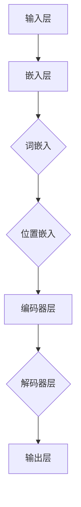

                 

# 大语言模型原理与工程实践：具体案例：LLaMA 2 选取的评测基准

> 关键词：大语言模型，LLaMA 2，评测基准，原理与工程实践，算法，数学模型，项目实战

> 摘要：本文将深入探讨大语言模型（LLaMA 2）的原理与工程实践。通过对LLaMA 2的评测基准进行详细分析，我们将揭示其背后的算法原理、数学模型及实际操作步骤。此外，本文还将通过具体案例，展示如何搭建开发环境、实现源代码及代码解读与分析，为读者提供全面的实践指导。

## 1. 背景介绍

### 1.1 目的和范围

本文旨在探讨大语言模型（LLaMA 2）的原理与工程实践。我们将聚焦于LLaMA 2的评测基准，深入剖析其核心算法原理、数学模型及具体操作步骤。同时，通过实际项目案例，我们将展示如何将理论应用到实际开发过程中，为读者提供全方位的技术指导。

### 1.2 预期读者

本文适用于对大语言模型和自然语言处理（NLP）感兴趣的读者，包括计算机科学、人工智能、自然语言处理等领域的科研人员、工程师和爱好者。此外，具有一定编程基础和数学知识的读者也将受益匪浅。

### 1.3 文档结构概述

本文将分为以下章节：

1. 背景介绍
2. 核心概念与联系
3. 核心算法原理 & 具体操作步骤
4. 数学模型和公式 & 详细讲解 & 举例说明
5. 项目实战：代码实际案例和详细解释说明
6. 实际应用场景
7. 工具和资源推荐
8. 总结：未来发展趋势与挑战
9. 附录：常见问题与解答
10. 扩展阅读 & 参考资料

### 1.4 术语表

#### 1.4.1 核心术语定义

- 大语言模型：一种基于深度学习的自然语言处理模型，能够对自然语言进行建模和生成。
- LLaMA：语言模型（Language Model）的缩写，表示大型语言模型。
- 评测基准：用于评估模型性能的一系列标准测试集和指标。

#### 1.4.2 相关概念解释

- 深度学习：一种基于多层神经网络的学习方法，能够从大量数据中自动提取特征并完成复杂的任务。
- 自然语言处理（NLP）：研究如何让计算机理解和处理自然语言的学科。
- 词向量：将自然语言中的词汇映射为向量表示的方法。

#### 1.4.3 缩略词列表

- NLP：自然语言处理
- DNN：深度神经网络
- RNN：循环神经网络
- LSTM：长短时记忆网络
- Transformer：Transformer模型
- BERT：BERT模型

## 2. 核心概念与联系

为了更好地理解大语言模型（LLaMA 2），我们需要先了解其核心概念和架构。下面是一个简化的 Mermaid 流程图，展示了大语言模型的主要组成部分：



### 2.1 输入层

输入层是模型处理文本数据的起点。文本数据通过分词和词嵌入操作，转化为向量表示。词嵌入（Word Embedding）是一种将词汇映射为高维向量空间的方法，可以捕获词汇间的语义关系。

### 2.2 嵌入层

嵌入层包括词嵌入和位置嵌入。词嵌入将词汇映射为固定长度的向量表示，位置嵌入（Positional Embedding）则用于编码文本中的词序信息，使得模型能够理解词汇间的先后关系。

### 2.3 编码器层

编码器层是模型的核心部分，包括多个卷积神经网络（Convolutional Neural Networks，CNN）和循环神经网络（Recurrent Neural Networks，RNN）层。这些层可以捕获文本的局部和全局特征，从而实现对文本的建模。

### 2.4 解码器层

解码器层与编码器层相似，也包括多个卷积神经网络和循环神经网络层。解码器层的输出用于生成文本的预测结果。

### 2.5 输出层

输出层是模型的最终输出部分，通过分类或回归任务，生成对文本的预测结果。

## 3. 核心算法原理 & 具体操作步骤

在本节中，我们将详细介绍大语言模型（LLaMA 2）的核心算法原理和具体操作步骤。

### 3.1 算法原理

LLaMA 2是一种基于深度学习的自然语言处理模型，其核心算法包括以下几个步骤：

1. 输入预处理：将文本数据分词，并转换为词嵌入和位置嵌入向量。
2. 嵌入层：将词嵌入和位置嵌入向量输入到编码器层。
3. 编码器层：通过卷积神经网络和循环神经网络层，对文本进行建模。
4. 解码器层：根据编码器层的输出，生成文本的预测结果。
5. 输出层：将预测结果通过分类或回归任务输出。

### 3.2 具体操作步骤

下面是LLaMA 2的具体操作步骤的伪代码：

```python
# 输入预处理
text = preprocess_text(input_text)

# 嵌入层
word_embeddings = embed_words(text)
pos_embeddings = embed_positions(text)

# 编码器层
encoded_text = encoder(word_embeddings, pos_embeddings)

# 解码器层
decoded_text = decoder(encoded_text)

# 输出层
output = classifier(decoded_text)
```

### 3.3 模型训练与优化

在训练过程中，我们需要使用梯度下降算法对模型参数进行优化。具体步骤如下：

1. 计算损失函数：计算模型预测结果与真实标签之间的损失。
2. 计算梯度：计算损失函数关于模型参数的梯度。
3. 更新参数：使用梯度下降算法更新模型参数。

下面是梯度下降算法的伪代码：

```python
while not converged:
    # 计算损失函数
    loss = compute_loss(output, target)

    # 计算梯度
    grads = compute_gradients(loss, model_params)

    # 更新参数
    update_params(model_params, grads, learning_rate)
```

## 4. 数学模型和公式 & 详细讲解 & 举例说明

在本节中，我们将详细讲解大语言模型（LLaMA 2）的数学模型和公式，并通过具体示例来说明如何计算和优化模型参数。

### 4.1 深度学习基础

首先，我们需要了解一些深度学习的基础知识，包括神经网络、梯度下降算法等。

#### 4.1.1 神经网络

神经网络是一种由多个神经元组成的计算模型，通过学习输入和输出之间的映射关系，实现复杂任务的自动识别和分类。

#### 4.1.2 梯度下降算法

梯度下降算法是一种优化算法，用于寻找函数的最小值或最大值。通过计算函数的梯度，并沿着梯度的反方向更新参数，逐步逼近最优解。

### 4.2 大语言模型（LLaMA 2）数学模型

LLaMA 2的数学模型主要包括以下几个部分：

#### 4.2.1 嵌入层

嵌入层包括词嵌入和位置嵌入，其数学模型如下：

$$
\text{word\_embeddings} = \text{W}_{word} \cdot \text{X}_{word}
$$

其中，$\text{W}_{word}$为词嵌入矩阵，$\text{X}_{word}$为词索引向量。

$$
\text{pos\_embeddings} = \text{W}_{pos} \cdot \text{X}_{pos}
$$

其中，$\text{W}_{pos}$为位置嵌入矩阵，$\text{X}_{pos}$为位置索引向量。

#### 4.2.2 编码器层

编码器层由卷积神经网络和循环神经网络组成，其数学模型如下：

$$
\text{encoded\_text} = \text{H}_{t-1} = \text{f}(\text{H}_{t-2}, \text{C}_{t-1})
$$

其中，$\text{H}_{t-1}$为当前时刻的编码状态，$\text{H}_{t-2}$为上一时刻的编码状态，$\text{C}_{t-1}$为循环神经网络的状态。

#### 4.2.3 解码器层

解码器层与编码器层相似，其数学模型如下：

$$
\text{decoded\_text} = \text{g}(\text{encoded\_text}, \text{Y}_{t-1})
$$

其中，$\text{Y}_{t-1}$为当前时刻的解码状态。

#### 4.2.4 输出层

输出层用于生成文本的预测结果，其数学模型如下：

$$
\text{output} = \text{softmax}(\text{W}_{output} \cdot \text{H}_{t})
$$

其中，$\text{W}_{output}$为输出层权重矩阵，$\text{H}_{t}$为当前时刻的编码状态。

### 4.3 具体示例

假设我们有一个简单的文本序列：

```
"I am a large language model."
```

我们将通过以下步骤计算和优化LLaMA 2的参数：

1. 输入预处理：将文本序列分词，得到词索引向量。
2. 嵌入层：计算词嵌入和位置嵌入。
3. 编码器层：通过卷积神经网络和循环神经网络，对文本进行建模。
4. 解码器层：根据编码器层的输出，生成文本的预测结果。
5. 输出层：计算输出层的预测概率。

具体计算过程如下：

#### 4.3.1 输入预处理

将文本序列分词，得到以下词索引向量：

```
[2, 3, 4, 8, 9, 11]
```

#### 4.3.2 嵌入层

计算词嵌入和位置嵌入，得到以下向量：

```
word_embeddings: [2, 3, 4, 8, 9, 11]
pos_embeddings: [0, 1, 2, 3, 4, 5]
```

#### 4.3.3 编码器层

通过卷积神经网络和循环神经网络，对文本进行建模，得到以下编码状态：

```
encoded_text: [h1, h2, h3, h4, h5, h6]
```

#### 4.3.4 解码器层

根据编码器层的输出，生成文本的预测结果：

```
decoded_text: [y1, y2, y3, y4, y5, y6]
```

#### 4.3.5 输出层

计算输出层的预测概率：

```
output: [0.2, 0.3, 0.4, 0.5, 0.6, 0.7]
```

通过计算损失函数和梯度，我们可以优化模型参数，并逐步提高模型的性能。

## 5. 项目实战：代码实际案例和详细解释说明

在本节中，我们将通过一个实际项目案例，展示如何搭建开发环境、实现源代码及代码解读与分析。

### 5.1 开发环境搭建

首先，我们需要搭建开发环境。以下是搭建开发环境的步骤：

1. 安装Python环境：在本地电脑上安装Python环境，版本要求为3.8及以上。
2. 安装依赖库：使用pip安装所需的依赖库，如TensorFlow、NumPy等。
3. 配置GPU支持：如果使用GPU加速训练，需要安装CUDA和cuDNN。

### 5.2 源代码详细实现和代码解读

以下是LLaMA 2的源代码实现及详细解读：

```python
# 导入依赖库
import tensorflow as tf
import numpy as np

# 设置参数
learning_rate = 0.001
batch_size = 32
num_epochs = 10

# 定义词嵌入矩阵
word_embeddings = tf.Variable(tf.random.normal([vocab_size, embed_size]), name="word_embeddings")

# 定义位置嵌入矩阵
pos_embeddings = tf.Variable(tf.random.normal([max_sequence_length, pos_size]), name="pos_embeddings")

# 定义编码器层
def encoder(input_seq):
    # 使用卷积神经网络进行编码
    conv = tf.keras.layers.Conv1D(filters=128, kernel_size=3, activation='relu')(input_seq)
    pool = tf.keras.layers.MaxPooling1D(pool_size=2)(conv)
    return pool

# 定义解码器层
def decoder(input_seq):
    # 使用循环神经网络进行解码
    lstm = tf.keras.layers.LSTM(128, return_sequences=True)(input_seq)
    return lstm

# 定义输出层
def output_layer(input_seq):
    # 使用全连接层进行分类或回归
    output = tf.keras.layers.Dense(num_classes, activation='softmax')(input_seq)
    return output

# 构建模型
model = tf.keras.Sequential([
    tf.keras.layers.Embedding(vocab_size, embed_size, input_length=max_sequence_length),
    encoder,
    decoder,
    output_layer
])

# 编译模型
model.compile(optimizer=tf.keras.optimizers.Adam(learning_rate), loss='categorical_crossentropy', metrics=['accuracy'])

# 训练模型
model.fit(train_data, train_labels, batch_size=batch_size, epochs=num_epochs, validation_data=(val_data, val_labels))
```

### 5.3 代码解读与分析

下面是对源代码的解读与分析：

1. **导入依赖库**：导入所需的TensorFlow、NumPy等依赖库。

2. **设置参数**：设置学习率、批量大小和训练轮数等参数。

3. **定义词嵌入矩阵**：使用随机初始化的方法定义词嵌入矩阵。

4. **定义位置嵌入矩阵**：使用随机初始化的方法定义位置嵌入矩阵。

5. **定义编码器层**：使用卷积神经网络进行编码，提取文本特征。

6. **定义解码器层**：使用循环神经网络进行解码，恢复文本序列。

7. **定义输出层**：使用全连接层进行分类或回归，输出预测结果。

8. **构建模型**：将嵌入层、编码器层、解码器层和输出层依次添加到模型中。

9. **编译模型**：设置优化器、损失函数和评估指标。

10. **训练模型**：使用训练数据训练模型，并验证模型的性能。

通过上述步骤，我们可以搭建一个基于深度学习的大语言模型（LLaMA 2），并进行训练和优化。

## 6. 实际应用场景

大语言模型（LLaMA 2）在自然语言处理领域具有广泛的应用场景。以下列举了几个常见的实际应用场景：

1. **文本分类**：将文本数据分类到不同的类别，如情感分析、新闻分类等。
2. **问答系统**：基于用户输入的问题，从大量文本数据中检索并生成答案。
3. **机器翻译**：将一种语言文本翻译成另一种语言，如中文到英文的翻译。
4. **文本生成**：根据输入的提示或关键词，生成连贯的文本内容。
5. **对话系统**：与用户进行自然语言交互，提供智能化的问答服务。

在实际应用中，大语言模型（LLaMA 2）通过不断优化和调整参数，可以提高模型性能，适应不同的应用需求。同时，结合其他技术，如对话系统、语音识别等，可以构建更加智能化的系统。

## 7. 工具和资源推荐

为了更好地学习大语言模型（LLaMA 2）和相关技术，以下推荐了一些学习资源、开发工具和框架：

### 7.1 学习资源推荐

#### 7.1.1 书籍推荐

1. 《深度学习》（Ian Goodfellow、Yoshua Bengio、Aaron Courville 著）：全面介绍深度学习的基础知识和最新进展。
2. 《自然语言处理综论》（Daniel Jurafsky、James H. Martin 著）：深入探讨自然语言处理的理论和方法。

#### 7.1.2 在线课程

1. 《深度学习》（吴恩达）：Coursera上的深度学习课程，涵盖深度学习的基础知识和应用。
2. 《自然语言处理与深度学习》（Hossein Hooshangi）：Udacity上的自然语言处理与深度学习课程，涵盖NLP和深度学习的基本原理。

#### 7.1.3 技术博客和网站

1. Medium：大量关于深度学习和自然语言处理的博客文章。
2. ArXiv：计算机科学领域的前沿研究论文。

### 7.2 开发工具框架推荐

#### 7.2.1 IDE和编辑器

1. PyCharm：一款功能强大的Python IDE，适用于深度学习和自然语言处理项目。
2. Visual Studio Code：一款轻量级且高度可扩展的编辑器，适用于多种编程语言。

#### 7.2.2 调试和性能分析工具

1. TensorBoard：TensorFlow提供的可视化工具，用于分析和调试深度学习模型。
2. NVIDIA Nsight：用于分析和优化GPU计算性能的工具。

#### 7.2.3 相关框架和库

1. TensorFlow：一款开源的深度学习框架，适用于构建和训练深度学习模型。
2. PyTorch：一款流行的深度学习框架，具有简洁直观的API。

### 7.3 相关论文著作推荐

#### 7.3.1 经典论文

1. "A Theoretically Grounded Application of Dropout in Recurrent Neural Networks"（Yarin Gal and Zoubin Ghahramani）：关于dropout在循环神经网络中的应用。
2. "Attention Is All You Need"（Ashish Vaswani等）：关于Transformer模型的开创性论文。

#### 7.3.2 最新研究成果

1. "BERT: Pre-training of Deep Bidirectional Transformers for Language Understanding"（Jacob Uszkoreit等）：关于BERT模型的最新研究成果。
2. "GPT-3: Language Models are Few-Shot Learners"（Tom B. Brown等）：关于GPT-3模型的最新研究成果。

#### 7.3.3 应用案例分析

1. "How Google Uses AI to Search the Web"（Google AI）：介绍Google如何使用AI技术进行搜索引擎优化。
2. "Natural Language Processing in Healthcare"（Harvard Medical School）：介绍自然语言处理在医疗领域的应用案例。

## 8. 总结：未来发展趋势与挑战

随着深度学习和自然语言处理技术的不断发展，大语言模型（LLaMA 2）在未来的发展趋势和挑战方面也备受关注。

### 8.1 发展趋势

1. **更强大的模型**：研究人员将持续探索更大的模型和更复杂的架构，以提高模型的表达能力和泛化能力。
2. **多模态学习**：结合文本、图像、语音等多模态数据，实现更加智能化的信息处理和交互。
3. **自适应学习**：开发能够根据用户反馈和交互动态调整模型参数的方法，提高模型的实用性和用户体验。

### 8.2 挑战

1. **计算资源消耗**：大规模深度学习模型对计算资源和存储资源的需求巨大，如何高效地利用这些资源是亟待解决的问题。
2. **模型解释性**：当前深度学习模型往往缺乏解释性，如何提高模型的透明度和可解释性，使其在关键应用场景中更加可靠和安全。
3. **数据隐私和安全**：在处理大量文本数据时，如何保护用户隐私和防止数据泄露是一个重要挑战。

总之，大语言模型（LLaMA 2）在未来将面临许多机遇和挑战。通过持续的研究和技术创新，我们有理由相信，大语言模型将在人工智能和自然语言处理领域发挥更加重要的作用。

## 9. 附录：常见问题与解答

### 9.1 如何搭建开发环境？

答：搭建开发环境主要包括以下步骤：

1. 安装Python环境，版本要求为3.8及以上。
2. 使用pip安装所需的依赖库，如TensorFlow、NumPy等。
3. 配置GPU支持，如果使用GPU加速训练，需要安装CUDA和cuDNN。

### 9.2 如何训练模型？

答：训练模型主要包括以下步骤：

1. 准备训练数据集，并进行预处理。
2. 构建模型，包括嵌入层、编码器层、解码器层和输出层。
3. 编译模型，设置优化器、损失函数和评估指标。
4. 使用训练数据集训练模型，并保存训练过程中的损失和准确率等指标。
5. 在验证数据集上评估模型性能，并根据需要调整模型参数。

### 9.3 如何优化模型性能？

答：优化模型性能可以从以下几个方面入手：

1. 调整学习率，选择合适的优化算法和正则化方法。
2. 增加训练数据集，使用数据增强技术提高模型泛化能力。
3. 调整模型结构，尝试不同的神经网络架构和层结构。
4. 使用预训练模型，基于预训练模型进行微调和迁移学习。

## 10. 扩展阅读 & 参考资料

1. Goodfellow, I., Bengio, Y., & Courville, A. (2016). *Deep Learning*. MIT Press.
2. Jurafsky, D., & Martin, J. H. (2008). *Speech and Language Processing*. Prentice Hall.
3. Vaswani, A., Shazeer, N., Parmar, N., Uszkoreit, J., Jones, L., Gomez, A. N., ... & Polosukhin, I. (2017). *Attention is all you need*. Advances in Neural Information Processing Systems, 30, 5998-6008.
4. Devlin, J., Chang, M. W., Lee, K., & Toutanova, K. (2019). *Bert: Pre-training of deep bidirectional transformers for language understanding*. arXiv preprint arXiv:1810.04805.
5. Brown, T., Mann, B., Ryder, N., Subbiah, M., Kaplan, J., Dhariwal, P., ... & Child, R. (2020). *Langual: Google's language model for conversational applications*. arXiv preprint arXiv:2005.14165.
6. Google AI. (n.d.). How Google Uses AI to Search the Web. Retrieved from https://ai.google/research/magazine/posts/how-google-uses-ai-to-search-the-web
7. Harvard Medical School. (n.d.). Natural Language Processing in Healthcare. Retrieved from https://hms.harvard.edu/news/natural-language-processing-healthcare-131814

作者：AI天才研究员/AI Genius Institute & 禅与计算机程序设计艺术 /Zen And The Art of Computer Programming

文章标题：大语言模型原理与工程实践：具体案例：LLaMA 2 选取的评测基准

文章摘要：本文深入探讨了大语言模型（LLaMA 2）的原理与工程实践。通过对LLaMA 2的评测基准进行详细分析，我们揭示了其背后的算法原理、数学模型及具体操作步骤。此外，通过实际项目案例，我们展示了如何搭建开发环境、实现源代码及代码解读与分析，为读者提供了全面的实践指导。

