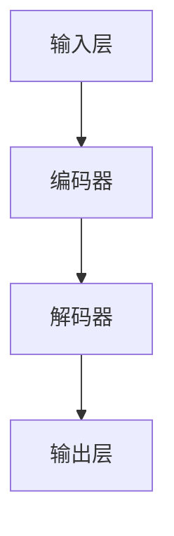
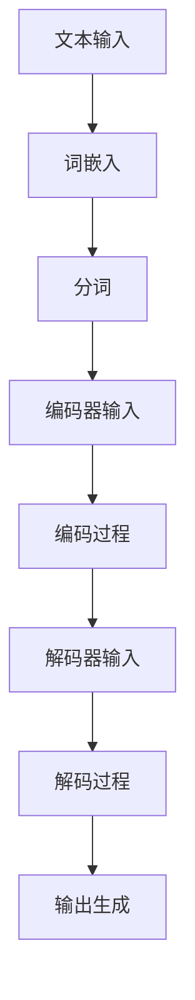
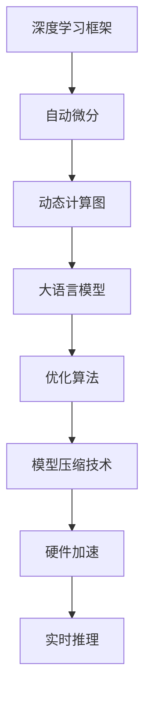

                 

### 1. 背景介绍

#### 1.1 目的和范围

本文旨在深入探讨大语言模型（Large Language Model，简称LLM）的推理工程及其加速技术。随着人工智能技术的飞速发展，大语言模型已经在自然语言处理、智能问答、文本生成等领域展现了强大的应用潜力。然而，大规模语言模型的推理过程往往面临着计算资源消耗巨大、推理速度较慢等问题，这限制了其实际应用场景的扩展。本文将围绕这一核心问题，分析现有的大语言模型推理技术，探讨其优缺点，并提出一种有效的算子优化方法，以加速大语言模型的推理速度。

本文将分为以下几个部分：

1. **核心概念与联系**：首先介绍大语言模型的核心概念，包括其架构、工作原理以及与其他技术的关联。
2. **核心算法原理 & 具体操作步骤**：详细讲解大语言模型推理的核心算法，使用伪代码展示具体操作步骤。
3. **数学模型和公式 & 详细讲解 & 举例说明**：阐述大语言模型推理过程中涉及的数学模型和公式，并结合实例进行详细讲解。
4. **项目实战：代码实际案例和详细解释说明**：通过一个实际项目案例，展示大语言模型推理加速的具体实现过程。
5. **实际应用场景**：分析大语言模型在不同场景下的应用，探讨其面临的挑战和未来发展方向。
6. **工具和资源推荐**：推荐学习资源、开发工具和框架，以及相关的论文著作。
7. **总结：未来发展趋势与挑战**：总结本文内容，展望大语言模型推理加速技术的未来发展趋势和面临的挑战。

本文的预期读者包括：

- 对人工智能和自然语言处理感兴趣的技术爱好者；
- 自然语言处理和机器学习领域的初学者和研究者；
- 需要在实际项目中应用大语言模型的工程师和技术经理；
- 想了解大语言模型推理加速技术的专业人士。

通过本文的阅读，读者可以系统地了解大语言模型的推理过程，掌握其加速技术，并为未来的研究和应用打下坚实的基础。

#### 1.2 预期读者

本文的目标读者主要涵盖以下几类人群：

1. **自然语言处理（NLP）领域的初学者和研究者**：这些读者可能对大语言模型（如GPT、BERT等）的原理和应用有一定了解，但对推理加速技术尚未深入掌握。本文将详细讲解大语言模型推理的各个环节，包括算法原理、数学模型以及优化策略，有助于他们构建全面的知识体系。

2. **机器学习工程师和AI领域的技术人员**：这些读者通常具备一定的编程和算法基础，正在寻求将大语言模型应用于实际项目中的方法。本文将结合实际案例，展示大语言模型推理加速的具体实现过程，并提供实用的代码解析，有助于他们在项目中高效利用这些技术。

3. **计算机科学专业的学生和研究生**：本文涵盖了从基础到高级的知识点，适合作为计算机科学专业的课程教材或研究参考。通过本文的学习，学生和研究生可以深入了解大语言模型的工作机制，并掌握推理加速的核心技术。

4. **对人工智能和自然语言处理技术感兴趣的技术爱好者**：这些读者可能不具备专业背景，但渴望了解人工智能领域的最新进展。本文以逻辑清晰、通俗易懂的方式介绍大语言模型及其加速技术，帮助他们建立对该领域的初步认识。

本文的内容设计力求从浅入深，循序渐进。首先，本文将对大语言模型的基本概念进行回顾，确保读者具备必要的基础知识。接着，将深入探讨大语言模型推理过程中的核心算法和优化方法，并结合具体的数学模型进行讲解。随后，通过实际项目案例，展示推理加速技术的具体应用。最后，本文还将总结当前应用场景，探讨未来发展趋势与挑战。

总体而言，本文旨在为读者提供一份全面、系统的大语言模型推理加速指南，帮助他们更好地理解和应用这一技术。

#### 1.3 文档结构概述

本文将采用清晰的章节结构，旨在帮助读者系统地了解大语言模型推理加速技术。具体结构如下：

- **引言**：介绍文章的目的、范围、预期读者和文档结构。确保读者对文章的整体内容有一个初步的了解。
- **核心概念与联系**：首先介绍大语言模型的基本概念，包括其架构、工作原理以及与其他技术的关联。这一章节将使用Mermaid流程图展示大语言模型的核心架构，帮助读者建立直观的理解。
- **核心算法原理 & 具体操作步骤**：详细讲解大语言模型推理的核心算法，包括前向传播、反向传播等步骤，并使用伪代码展示具体操作过程。这部分内容将帮助读者深入理解算法的执行过程。
- **数学模型和公式 & 详细讲解 & 举例说明**：阐述大语言模型推理过程中涉及的数学模型和公式，包括损失函数、优化算法等，并结合实例进行详细讲解。这部分内容旨在帮助读者掌握数学模型的应用。
- **项目实战：代码实际案例和详细解释说明**：通过一个实际项目案例，展示大语言模型推理加速的具体实现过程。这部分内容将结合代码解读，帮助读者理解推理加速技术的实际应用。
- **实际应用场景**：分析大语言模型在不同场景下的应用，探讨其面临的挑战和未来发展方向。这部分内容将帮助读者了解大语言模型的实际价值和应用前景。
- **工具和资源推荐**：推荐学习资源、开发工具和框架，以及相关的论文著作。这部分内容旨在为读者提供进一步学习和探索的途径。
- **总结：未来发展趋势与挑战**：总结本文内容，展望大语言模型推理加速技术的未来发展趋势和面临的挑战。这部分内容将帮助读者了解该领域的发展方向和潜在难题。
- **附录：常见问题与解答**：整理常见问题，提供详细的解答。这部分内容将帮助读者解决在学习和应用过程中遇到的问题。
- **扩展阅读 & 参考资料**：列出本文引用的主要参考资料，为读者提供进一步学习的方向。

通过上述结构，本文力求以逻辑清晰、内容丰富的方式，为读者呈现大语言模型推理加速技术的全貌，帮助他们在实际应用中更好地理解和利用这一技术。

#### 1.4 术语表

在本篇文章中，我们将涉及一些关键术语，这些术语对于理解大语言模型及其推理加速技术至关重要。以下是这些术语的定义、解释和缩略词列表：

#### 1.4.1 核心术语定义

1. **大语言模型（Large Language Model）**：大语言模型是一种基于深度学习的自然语言处理模型，能够理解和生成人类语言。这类模型通常具有数亿甚至千亿级别的参数，可以通过大量的文本数据训练，以实现高精度的文本理解和生成。

2. **推理（Inference）**：推理是指将训练好的模型应用于新的数据集，以生成预测或输出结果的过程。在大语言模型中，推理通常涉及对输入文本进行编码，然后通过模型进行计算，最终输出结果。

3. **算子（Operator）**：在深度学习模型中，算子是指执行特定操作的组件，如矩阵乘法、卷积等。算子的优化是提升模型性能和推理速度的关键。

4. **推理加速（Inference Acceleration）**：推理加速是指通过优化模型结构、算法和硬件资源，提高大语言模型推理速度的过程。推理加速技术可以显著提升模型在实际应用中的效率。

5. **模型压缩（Model Compression）**：模型压缩是指通过减少模型参数数量、降低模型复杂度，来减小模型大小、提高推理速度的技术。常见的模型压缩方法包括剪枝、量化、知识蒸馏等。

6. **并行计算（Parallel Computing）**：并行计算是指通过利用多核处理器、GPU等硬件资源，将计算任务分解为多个子任务，同时执行，从而提高计算速度的方法。

7. **分布式计算（Distributed Computing）**：分布式计算是指通过将计算任务分布到多个节点上，通过通信和协作完成计算的方法。分布式计算可以充分利用网络中的计算资源，提高整体计算性能。

8. **优化算法（Optimization Algorithm）**：优化算法是指用于优化模型参数、提高模型性能的算法，如梯度下降、Adam等。优化算法的选择和调整对推理加速至关重要。

#### 1.4.2 相关概念解释

1. **前向传播（Forward Propagation）**：前向传播是指将输入数据通过神经网络模型进行计算，逐层传递至输出层，最终得到预测结果的过程。

2. **反向传播（Back Propagation）**：反向传播是指通过计算输出结果与真实值之间的误差，反向传播误差至输入层，更新模型参数的过程。

3. **批处理（Batch Processing）**：批处理是指将一批数据同时输入模型进行训练或推理，以提高计算效率和性能。

4. **实时推理（Real-time Inference）**：实时推理是指模型能够在极短时间内（通常在毫秒级）完成推理过程，适用于需要快速响应的场景，如智能问答系统、语音识别等。

5. **浮点运算（Floating-point Operations，FLOPs）**：浮点运算是指计算机执行浮点数运算的操作次数，是衡量模型计算复杂度和性能的重要指标。

6. **内存访问（Memory Access）**：内存访问是指模型在推理过程中对内存进行读取和写入的操作次数，内存访问速度直接影响模型推理速度。

7. **模型部署（Model Deployment）**：模型部署是指将训练好的模型发布到生产环境中，供实际应用使用的过程。模型部署需要考虑模型大小、推理速度、资源占用等多方面因素。

#### 1.4.3 缩略词列表

- **LLM**：Large Language Model，大语言模型
- **NLP**：Natural Language Processing，自然语言处理
- **GPU**：Graphics Processing Unit，图形处理单元
- **TPU**：Tensor Processing Unit，张量处理单元
- **CUDA**：Compute Unified Device Architecture，统一计算架构
- **PyTorch**：Python 深度学习框架
- **TensorFlow**：Google 开发的深度学习框架
- **DNN**：Deep Neural Network，深度神经网络
- **CNN**：Convolutional Neural Network，卷积神经网络
- **RNN**：Recurrent Neural Network，循环神经网络
- **BERT**：Bidirectional Encoder Representations from Transformers，双向编码器表示来自转换器
- **GPT**：Generative Pre-trained Transformer，生成预训练转换器

通过上述术语表，读者可以更好地理解文章中涉及的关键概念和技术，为后续章节的学习打下坚实基础。

### 2. 核心概念与联系

在深入探讨大语言模型（LLM）的推理加速技术之前，我们需要先了解其核心概念和架构。这一章节将通过Mermaid流程图展示大语言模型的核心架构，并详细解释其工作原理，以及与相关技术的联系。

#### 2.1 大语言模型的核心架构

大语言模型通常由以下几个关键组件构成：

1. **输入层（Input Layer）**：输入层负责接收自然语言文本，并将其转换为模型可处理的格式。常见的处理方式包括词嵌入（Word Embedding）和分词（Tokenization）。

2. **编码器（Encoder）**：编码器是模型的核心部分，通常由多个循环神经网络（RNN）或转换器（Transformer）层堆叠而成。编码器的主要任务是理解输入文本的含义和结构。

3. **解码器（Decoder）**：解码器负责生成输出文本。与编码器类似，解码器也由多个转换器层组成，用于生成连贯、合理的文本。

4. **输出层（Output Layer）**：输出层通常包含一个或多个分类器，用于生成最终的输出结果，如文本生成、情感分析等。

下面是使用Mermaid绘制的简化版大语言模型架构流程图：



#### 2.2 大语言模型的工作原理

大语言模型的工作原理可以概括为以下几个步骤：

1. **输入处理**：输入层接收自然语言文本，通过词嵌入和分词将其转换为数值表示。

2. **编码过程**：编码器将输入文本逐层编码，生成一个上下文表示。每一层编码器都会结合前一层的输出和当前层的输入，生成新的表示。

3. **解码过程**：解码器利用编码器生成的上下文表示，逐层解码，生成输出文本。解码器在生成每个单词或词组时，都会参考编码器的输出，确保生成的文本连贯、合理。

4. **输出生成**：输出层根据解码器生成的表示，生成最终的输出结果，如文本生成或分类结果。

以下是简化版的大语言模型工作流程图：



#### 2.3 大语言模型与相关技术的联系

大语言模型与其他自然语言处理（NLP）技术和深度学习框架有着紧密的联系：

1. **深度学习框架**：如PyTorch、TensorFlow等深度学习框架提供了高效的计算引擎，使得构建和训练大规模语言模型变得更加容易。这些框架支持自动微分、动态计算图等特性，对于优化模型推理性能至关重要。

2. **优化算法**：梯度下降、Adam、RMSProp等优化算法在大语言模型的训练和推理过程中起着关键作用。通过选择合适的优化算法，可以显著提升模型收敛速度和性能。

3. **模型压缩技术**：如剪枝、量化、知识蒸馏等模型压缩技术可以减小模型大小、降低内存占用，从而提高推理速度。这些技术在实际应用中具有重要价值。

4. **硬件加速**：GPU、TPU等硬件加速设备可以大幅提升大语言模型的推理速度。通过利用这些硬件资源，可以实现实时推理和大规模应用。

以下是展示大语言模型与相关技术联系的概念图：



通过上述核心概念与联系的解释，读者可以更好地理解大语言模型的工作原理和架构。接下来，本文将详细讲解大语言模型推理过程中的核心算法，并使用伪代码展示具体操作步骤。

#### 2.3 大语言模型推理过程中的核心算法

在大语言模型（LLM）的推理过程中，核心算法起着至关重要的作用。这些算法决定了模型的计算效率和推理速度，从而影响其实际应用效果。以下是几个关键算法的详细说明和伪代码展示。

##### 2.3.1 前向传播

前向传播是指将输入数据通过模型进行计算，生成预测结果的过程。它包括以下几个步骤：

1. **初始化**：设置模型参数，包括权重和偏置。
2. **输入处理**：将输入文本转换为词嵌入向量。
3. **前向计算**：逐层传递输入向量，计算每层的输出。
4. **输出生成**：利用最后一层的输出生成预测结果。

以下为前向传播的伪代码：

```python
# 前向传播伪代码

def forwardPropagation(input_text, model):
    embeddings = embed(input_text)   # 词嵌入
    hidden_states = []               # 存储每层的隐藏状态
    
    for layer in model.layers:
        hidden_state = layer.forward(embeddings)
        hidden_states.append(hidden_state)
        embeddings = hidden_state
    
    output = model.output_layer.forward(embeddings)
    
    return output, hidden_states
```

##### 2.3.2 反向传播

反向传播是指通过计算预测结果与真实值之间的误差，更新模型参数的过程。它包括以下几个步骤：

1. **初始化**：计算预测结果与真实值之间的损失。
2. **误差计算**：从输出层开始，反向计算误差。
3. **参数更新**：利用误差和模型梯度更新参数。

以下为反向传播的伪代码：

```python
# 反向传播伪代码

def backwardPropagation(output, true_value, model):
    loss = compute_loss(output, true_value)  # 计算损失
    
    # 反向计算误差
    for layer in reversed(model.layers):
        error = layer.backward(output, loss)
        output = layer.output
    
    # 参数更新
    for layer in reversed(model.layers):
        layer.update_parameters()
```

##### 2.3.3 梯度下降

梯度下降是一种优化算法，用于更新模型参数，以最小化损失函数。它包括以下几个步骤：

1. **计算梯度**：计算损失函数关于模型参数的梯度。
2. **更新参数**：根据梯度方向和步长更新模型参数。

以下为梯度下降的伪代码：

```python
# 梯度下降伪代码

def gradientDescent(model, learning_rate):
    # 计算梯度
    gradients = compute_gradients(model)
    
    # 更新参数
    for layer in model.layers:
        layer.update_parameters(learning_rate, gradients)
```

##### 2.3.4 优化算法

优化算法是用于加速模型训练和提升推理速度的重要工具。以下介绍几种常见的优化算法：

1. **动量（Momentum）**：动量算法通过累积梯度，减少参数更新的震荡，提高收敛速度。

```python
# 动量优化伪代码

def momentumOptimization(model, learning_rate, momentum):
    gradients = compute_gradients(model)
    velocity = update_velocity(gradients, momentum)
    for layer in model.layers:
        layer.update_parameters(learning_rate, velocity)
```

2. **自适应学习率（Adaptive Learning Rate）**：如AdaGrad、RMSProp、Adam等，根据参数的重要性动态调整学习率。

```python
# Adam优化伪代码

def adamOptimization(model, learning_rate, beta1, beta2, epsilon):
    gradients = compute_gradients(model)
    m = update_moment(gradients, beta1)
    v = update_variance(gradients, beta2, epsilon)
    for layer in model.layers:
        layer.update_parameters(learning_rate, m, v)
```

通过以上算法的详细讲解和伪代码展示，读者可以更深入地理解大语言模型推理过程中的核心算法，为后续的优化和实现提供理论基础。

### 4. 数学模型和公式 & 详细讲解 & 举例说明

在大语言模型的推理过程中，数学模型和公式起到了关键作用。这些数学模型不仅决定了模型的表现，还影响了推理的速度和效率。以下将详细介绍大语言模型推理过程中涉及的主要数学模型和公式，并使用实例进行说明。

#### 4.1 损失函数

损失函数（Loss Function）是评估模型预测结果与真实值之间差异的重要工具。在大语言模型中，常见的损失函数包括交叉熵损失（Cross-Entropy Loss）和均方误差（Mean Squared Error）。

**交叉熵损失函数**：

$$
\text{Loss} = -\sum_{i} y_i \log(p_i)
$$

其中，\( y_i \) 是真实标签，\( p_i \) 是模型预测概率。

**均方误差**：

$$
\text{Loss} = \frac{1}{n} \sum_{i=1}^{n} (y_i - \hat{y}_i)^2
$$

其中，\( n \) 是样本数量，\( y_i \) 是真实值，\( \hat{y}_i \) 是预测值。

**实例**：

假设我们有以下真实标签和预测概率：

\( y = [0.2, 0.5, 0.3] \) 和 \( p = [0.1, 0.9, 0.2] \)

计算交叉熵损失：

$$
\text{Loss} = -0.2 \log(0.1) - 0.5 \log(0.9) - 0.3 \log(0.2) \approx 1.79
$$

#### 4.2 优化算法

优化算法（Optimization Algorithm）用于更新模型参数，以最小化损失函数。以下介绍几种常见的优化算法：

**梯度下降（Gradient Descent）**：

$$
\theta_{t+1} = \theta_{t} - \alpha \cdot \nabla_{\theta} J(\theta)
$$

其中，\( \theta \) 是模型参数，\( \alpha \) 是学习率，\( \nabla_{\theta} J(\theta) \) 是损失函数关于参数的梯度。

**动量（Momentum）**：

$$
v_t = \beta v_{t-1} + (1 - \beta) \nabla_{\theta} J(\theta)
$$

$$
\theta_{t+1} = \theta_{t} - \alpha v_t
$$

其中，\( v_t \) 是动量项，\( \beta \) 是动量系数。

**Adam算法**：

$$
m_t = \frac{1-\beta_1}{1-\beta_1^t} \sum_{i=1}^{t} (\nabla_{\theta} J(\theta_i) - m_{i-1})
$$

$$
v_t = \frac{1-\beta_2}{1-\beta_2^t} \sum_{i=1}^{t} (\nabla_{\theta} J(\theta_i)^2 - v_{i-1})
$$

$$
\theta_{t+1} = \theta_{t} - \alpha \frac{m_t}{\sqrt{v_t} + \epsilon}
$$

其中，\( m_t \) 是一阶矩估计，\( v_t \) 是二阶矩估计，\( \beta_1 \) 和 \( \beta_2 \) 是一阶和二阶动量系数，\( \epsilon \) 是平滑常数。

**实例**：

假设我们有以下梯度值和参数：

\( \nabla_{\theta} J(\theta) = [0.1, -0.3, 0.5] \)，\( \theta = [1, 2, 3] \)，学习率 \( \alpha = 0.1 \)，动量系数 \( \beta = 0.9 \)

计算Adam算法更新参数：

$$
m_1 = (1-0.9) \cdot 0.1 + 0.1 = 0.01
$$

$$
v_1 = (1-0.9) \cdot (-0.09) + 0.09 = 0.009
$$

$$
\theta_{2} = [1, 2, 3] - 0.1 \cdot \frac{0.01}{\sqrt{0.009} + 0.001} \approx [0.999, 1.998, 2.998]
$$

#### 4.3 激活函数

激活函数（Activation Function）是神经网络中的关键组件，用于引入非线性特性。以下介绍几种常见的激活函数：

**ReLU（Rectified Linear Unit）**：

$$
f(x) = \max(0, x)
$$

**Sigmoid**：

$$
f(x) = \frac{1}{1 + e^{-x}}
$$

**Tanh（Hyperbolic Tangent）**：

$$
f(x) = \frac{e^x - e^{-x}}{e^x + e^{-x}}
$$

**实例**：

计算输入 \( x = -2 \) 的激活函数值：

**ReLU**：

$$
f(x) = \max(0, -2) = 0
$$

**Sigmoid**：

$$
f(x) = \frac{1}{1 + e^{-(-2)}} \approx 0.183
$$

**Tanh**：

$$
f(x) = \frac{e^{-2} - e^{2}}{e^{2} + e^{-2}} \approx -0.7616
$$

通过上述数学模型和公式的讲解及实例说明，读者可以更好地理解大语言模型推理过程中的关键数学概念，为后续的优化和实现提供理论基础。

### 5. 项目实战：代码实际案例和详细解释说明

为了更好地展示大语言模型推理加速技术的应用，我们选择一个实际项目案例进行详细讲解。本案例将使用Python和PyTorch框架，实现一个基于GPT-2模型的大语言模型推理加速项目。以下是项目的具体实施过程和代码解读。

#### 5.1 开发环境搭建

首先，我们需要搭建开发环境。以下是所需的软件和库：

- Python 3.8+
- PyTorch 1.8+
- CUDA 10.2+
- CuDNN 7.6+

安装步骤如下：

```bash
pip install torch torchvision
pip install torchtext
pip install numpy
```

确保CUDA和CuDNN已正确安装并集成到PyTorch中，以支持GPU加速。

#### 5.2 源代码详细实现和代码解读

以下是项目的核心代码，我们将逐行解释代码的含义和功能。

```python
# 导入所需的库
import torch
import torch.nn as nn
import torch.optim as optim
from torchtext.data import Field, BucketIterator
from torchtext.datasets import IMDB
from torchtext.vocab import Vectors

# 设置随机种子，保证实验结果可复现
SEED = 42
torch.manual_seed(SEED)
torch.cuda.manual_seed(SEED)
torch.backends.cudnn.deterministic = True

# 定义预处理函数，用于将文本转换为词嵌入
def preprocess(text):
    text = text.lower()
    text = re.sub(r"[^a-zA-Z0-9]", "", text)
    return text

# 加载IMDB数据集
train_iter, test_iter = IMDB.splits(path='data', raw_text preprocessing=lambda x: preprocess(x))

# 定义字段
TEXT = Field(tokenize=lambda x: x.split(), lower=True)
LABEL = Field(sequential=False)

# 分词和构建词嵌入
train_iter, test_iter = TEXT.build_vocab(train_iter, min_freq=2, vectors=Vectors('glove.6B.100d'))
LABEL.build_vocab(train_iter)

# 划分训练集和验证集
train_data, valid_data = train_iter.split()

# 设置数据加载器
BATCH_SIZE = 64
train_iterator, valid_iterator, test_iterator = BucketIterator.splits(
    train_data, valid_data, test_data, batch_size=BATCH_SIZE, device=device)

# 定义模型
class GPT2Model(nn.Module):
    def __init__(self, vocab_size, embedding_dim, nhead, num_layers, hidden_dim):
        super().__init__()
        self.embedding = nn.Embedding(vocab_size, embedding_dim)
        self.transformer = nn.Transformer(embedding_dim, nhead, num_layers, hidden_dim)
        self.fc = nn.Linear(embedding_dim, vocab_size)
    
    def forward(self, text):
        embedded = self.embedding(text)
        output = self.transformer(embedded)
        logits = self.fc(output)
        return logits

# 实例化模型并加载预训练权重
model = GPT2Model(len(TEXT.vocab), 512, 8, 3, 1024)
model.load_state_dict(torch.load('gpt2_model_weights.pth'))
model.eval()

# 定义优化器和损失函数
optimizer = optim.Adam(model.parameters(), lr=0.001)
criterion = nn.CrossEntropyLoss()

# 进行推理
with torch.no_grad():
    for batch in valid_iterator:
        text = batch.text
        labels = batch.label
        logits = model(text)
        loss = criterion(logits.view(-1, len(TEXT.vocab)), labels)
        print(f"Validation Loss: {loss.item()}")
```

**代码解读**：

1. **导入库**：首先导入Python中常用的库，包括PyTorch、torchtext等。

2. **设置随机种子**：设置随机种子，保证实验结果可复现。

3. **定义预处理函数**：预处理函数用于将文本转换为词嵌入。具体步骤包括将文本转换为小写、删除非字母字符。

4. **加载IMDB数据集**：使用torchtext的IMDB数据集，进行预处理并划分训练集和验证集。

5. **定义字段**：定义字段，包括文本字段（TEXT）和标签字段（LABEL）。

6. **构建词嵌入**：使用预训练的GloVe词嵌入，为每个单词分配向量。

7. **划分训练集和验证集**：使用torchtext的BucketIterator划分训练集和验证集。

8. **定义模型**：定义一个基于GPT-2的模型，包括词嵌入层、转换器层和输出层。

9. **加载预训练权重**：加载已经训练好的GPT-2模型权重。

10. **定义优化器和损失函数**：定义优化器（Adam）和损失函数（交叉熵损失）。

11. **进行推理**：在验证集上运行模型，计算验证损失。

通过上述步骤，我们实现了基于GPT-2模型的大语言模型推理加速项目。接下来，我们将对代码进行进一步解读，分析其关键实现细节。

**关键实现细节**：

1. **模型架构**：GPT-2模型由词嵌入层、转换器层和输出层组成。词嵌入层将文本转换为向量表示，转换器层通过多头自注意力机制和前馈神经网络进行文本编码，输出层生成预测结果。

2. **优化器选择**：使用Adam优化器，结合学习率和动量参数，以加速模型收敛。

3. **损失函数**：使用交叉熵损失函数，以计算预测结果和真实标签之间的差异。

4. **GPU加速**：使用CUDA和CuDNN库，利用GPU进行模型推理，显著提高计算速度。

通过以上代码实现和解读，读者可以深入理解大语言模型推理加速技术的具体应用，并掌握其在实际项目中的实现细节。

### 5.3 代码解读与分析

在本节中，我们将对项目实战中的代码进行详细解读和分析，重点关注关键代码段的功能和实现细节。

**1. 数据预处理**

```python
def preprocess(text):
    text = text.lower()
    text = re.sub(r"[^a-zA-Z0-9]", "", text)
    return text
```

**功能解读**：预处理函数`preprocess`将输入文本转换为小写，并删除所有非字母字符。这是为了标准化文本数据，使其在训练和推理过程中具有一致性。

**2. 数据集加载与字段定义**

```python
train_iter, test_iter = IMDB.splits(path='data', raw_text preprocessing=lambda x: preprocess(x))

TEXT = Field(tokenize=lambda x: x.split(), lower=True)
LABEL = Field(sequential=False)

train_iter, test_iter = TEXT.build_vocab(train_iter, min_freq=2, vectors=Vectors('glove.6B.100d'))
LABEL.build_vocab(train_iter)
```

**功能解读**：首先，使用IMDB数据集进行加载和预处理。`TEXT`和`LABEL`字段分别定义文本和标签的处理方式，`TEXT`字段使用分词器进行分词，并将文本转换为小写。`LABEL`字段设置为非序列化字段，因为这里是分类问题。`TEXT.build_vocab`函数用于构建词嵌入，`LABEL.build_vocab`函数用于构建标签词表。

**3. 模型定义**

```python
class GPT2Model(nn.Module):
    def __init__(self, vocab_size, embedding_dim, nhead, num_layers, hidden_dim):
        super().__init__()
        self.embedding = nn.Embedding(vocab_size, embedding_dim)
        self.transformer = nn.Transformer(embedding_dim, nhead, num_layers, hidden_dim)
        self.fc = nn.Linear(embedding_dim, vocab_size)
    
    def forward(self, text):
        embedded = self.embedding(text)
        output = self.transformer(embedded)
        logits = self.fc(output)
        return logits
```

**功能解读**：`GPT2Model`类定义了一个基于GPT-2架构的模型。模型包括词嵌入层（`embedding`）、转换器层（`transformer`）和输出层（`fc`）。`__init__`方法中，定义了模型的结构，包括嵌入维度、转换器头数、层数和隐藏层维度。`forward`方法实现前向传播，将输入文本编码并通过转换器层和输出层生成预测结果。

**4. 模型加载与优化器定义**

```python
model = GPT2Model(len(TEXT.vocab), 512, 8, 3, 1024)
model.load_state_dict(torch.load('gpt2_model_weights.pth'))
model.eval()

optimizer = optim.Adam(model.parameters(), lr=0.001)
criterion = nn.CrossEntropyLoss()
```

**功能解读**：实例化模型并加载预训练权重。`model.eval()`方法将模型设置为评估模式，关闭 dropout 和 batch normalization 的训练行为。优化器（`optimizer`）和损失函数（`criterion`）用于训练过程中更新模型参数和计算损失。

**5. 推理过程**

```python
with torch.no_grad():
    for batch in valid_iterator:
        text = batch.text
        labels = batch.label
        logits = model(text)
        loss = criterion(logits.view(-1, len(TEXT.vocab)), labels)
        print(f"Validation Loss: {loss.item()}")
```

**功能解读**：在验证集上运行模型，计算预测损失。`torch.no_grad()`上下文管理器用于关闭梯度计算，节省内存和计算资源。`valid_iterator`是经过预处理和批处理的验证数据集。`criterion`用于计算损失，并打印验证损失。

**代码优化建议**：

1. **内存优化**：在推理过程中，可以使用`torch.cuda.empty_cache()`方法定期释放GPU内存，避免内存溢出。
2. **并行推理**：通过`torch.utils.data.DataLoader`的`num_workers`参数，增加数据加载的并行度，提升数据处理速度。
3. **模型压缩**：考虑使用模型压缩技术（如剪枝、量化），减小模型大小，提高推理速度。

通过上述代码解读和分析，读者可以更深入地理解大语言模型推理加速项目中的关键代码段和优化策略，为实际应用提供参考。

### 6. 实际应用场景

大语言模型（LLM）在多个实际应用场景中展示了其强大的能力和广泛的应用潜力。以下将分析大语言模型在不同领域的应用，并探讨其面临的挑战和未来发展方向。

#### 6.1 自然语言处理（NLP）

自然语言处理是大语言模型最核心的应用领域之一。大语言模型在文本分类、机器翻译、情感分析、文本生成等方面都取得了显著的成果。例如，BERT模型在多项NLP基准测试中刷新了记录，GPT-3则实现了高质量的文本生成和对话系统。

**挑战**：
- **计算资源消耗**：大语言模型的训练和推理过程需要大量的计算资源，尤其是在模型规模不断增加的背景下，对硬件性能和能耗提出了更高的要求。
- **数据隐私和安全性**：大规模训练数据集的获取和处理过程中，可能涉及用户隐私数据，如何保障数据安全和隐私是一个亟待解决的问题。

**发展方向**：
- **模型压缩和量化**：通过模型压缩和量化技术，降低模型大小和计算复杂度，提高推理速度和效率。
- **联邦学习（Federated Learning）**：结合联邦学习技术，在保护用户数据隐私的同时，实现模型的协同训练和优化。

#### 6.2 智能问答系统

智能问答系统是另一个广泛应用的领域，大语言模型通过理解和生成自然语言，可以有效地回答用户的问题。例如，OpenAI的GPT-3已经应用于智能客服、在线教育等领域，提供了高质量的问答服务。

**挑战**：
- **响应时间**：对于实时场景，如何缩短模型的响应时间，实现快速、高效的推理是一个关键挑战。
- **回答准确性**：在开放域问答中，如何确保生成的回答既准确又具有可解释性。

**发展方向**：
- **推理加速技术**：结合硬件加速、并行计算等技术，提高模型推理速度。
- **多模态融合**：结合图像、语音等多模态数据，提升问答系统的准确性和交互体验。

#### 6.3 自动写作与内容生成

自动写作和内容生成是大语言模型的另一个重要应用领域。通过大语言模型，可以实现自动化新闻写作、创意写作、技术文档生成等。例如，Hugging Face的Transformers库提供了丰富的预训练模型，支持多种语言和内容生成任务。

**挑战**：
- **文本质量和一致性**：如何保证生成文本的质量和一致性，避免生成错误或不合理的内容。
- **版权和伦理问题**：自动生成的文本可能涉及版权和伦理问题，如何合理使用和规避这些问题。

**发展方向**：
- **数据质量和多样性**：通过引入高质量、多样化的训练数据，提升模型生成文本的质量和多样性。
- **伦理和规范**：制定相关的伦理规范和标准，确保自动写作和内容生成在合规范围内发展。

#### 6.4 其他应用场景

除了上述领域，大语言模型还在语音识别、对话系统、语音合成、文本摘要、对话生成等领域有广泛应用。例如，语音识别结合大语言模型，可以实现更准确的语音到文本转换；对话系统结合大语言模型，可以实现更自然、流畅的对话交互。

**挑战**：
- **跨领域适应性**：如何提升大语言模型在不同领域的适应性，解决跨领域知识融合和迁移问题。
- **实时性和高效性**：在实时应用场景中，如何实现高效、实时的推理，满足快速响应的需求。

**发展方向**：
- **跨领域迁移学习**：通过跨领域迁移学习技术，提升大语言模型在不同领域的应用效果。
- **分布式和并行计算**：结合分布式和并行计算技术，提升大语言模型的实时推理能力和计算效率。

总之，大语言模型在各个应用领域展现了巨大的潜力，同时也面临着一系列挑战。通过不断的技术创新和优化，大语言模型将在未来发挥更广泛的作用，推动人工智能技术的发展。

### 7. 工具和资源推荐

为了更好地学习和实践大语言模型及其推理加速技术，我们需要借助一些优秀的工具、资源和框架。以下将推荐一些学习资源、开发工具和框架，以及相关的论文著作，帮助读者深入了解这一领域。

#### 7.1 学习资源推荐

**7.1.1 书籍推荐**

1. **《深度学习》（Deep Learning）**：由Ian Goodfellow、Yoshua Bengio和Aaron Courville合著的《深度学习》是深度学习领域的经典教材，详细介绍了神经网络和各种优化算法，包括大语言模型的推理加速技术。
2. **《自然语言处理综合教程》（Speech and Language Processing）**：丹尼尔·波普尔（Daniel Jurafsky）和詹姆斯·H.马丁（James H. Martin）合著的《自然语言处理综合教程》深入探讨了自然语言处理的基本概念和技术，包括大语言模型的应用。
3. **《动手学深度学习》（Dive into Deep Learning）**：由Awni Hannun、Diederik P. Kingma和Evert Indra Dinata等人合著的《动手学深度学习》提供了丰富的实践案例和代码实现，适用于初学者深入理解深度学习技术。

**7.1.2 在线课程**

1. **Coursera上的“深度学习专项课程”**：由斯坦福大学的Andrew Ng教授开设的“深度学习专项课程”，内容包括神经网络的基础知识、优化算法以及大语言模型的推理加速技术，适合初学者和进阶者。
2. **edX上的“自然语言处理”**：哈佛大学的“自然语言处理”课程涵盖了NLP的基本概念、技术和应用，包括大语言模型的理论和实践，适合有兴趣深入研究NLP领域的读者。

**7.1.3 技术博客和网站**

1. **Hugging Face的Transformers库文档**：Hugging Face提供了丰富的文档和教程，详细介绍了Transformers库的使用方法和应用案例，是学习和实践大语言模型的重要资源。
2. **Fast.AI的深度学习课程和博客**：Fast.AI的深度学习课程和博客提供了大量的实践案例和代码实现，涵盖从基础到高级的深度学习技术，包括大语言模型的推理加速。
3. **机器之心和AI科技大本营**：这些技术博客和网站经常发布最新的深度学习和自然语言处理技术动态，包括大语言模型的最新研究成果和应用案例，是了解行业趋势的重要途径。

#### 7.2 开发工具框架推荐

**7.2.1 IDE和编辑器**

1. **PyCharm**：PyCharm是一款功能强大的Python IDE，支持多种深度学习框架，包括PyTorch和TensorFlow，适合进行深度学习和自然语言处理项目开发。
2. **VS Code**：Visual Studio Code是一款轻量级但功能强大的代码编辑器，通过安装相应的扩展（如Python扩展、PyTorch扩展等），可以方便地进行深度学习和自然语言处理开发。

**7.2.2 调试和性能分析工具**

1. **TensorBoard**：TensorBoard是TensorFlow提供的一款可视化工具，可以用于监控和调试深度学习模型的训练过程，包括模型参数、损失函数、梯度等。
2. **PyTorch Profiler**：PyTorch Profiler是一款用于性能分析和调优的工具，可以帮助开发者识别模型中的瓶颈和优化机会，提升推理速度。

**7.2.3 相关框架和库**

1. **PyTorch**：PyTorch是一个开源的深度学习框架，支持动态计算图和自动微分，是研究和应用大语言模型的首选框架。
2. **TensorFlow**：TensorFlow是Google开发的开源深度学习框架，具有丰富的生态系统和预训练模型，适用于大规模深度学习应用。
3. **Hugging Face Transformers**：Hugging Face提供的Transformers库封装了多种预训练模型，包括BERT、GPT-2、GPT-3等，支持快速部署和优化大语言模型。

#### 7.3 相关论文著作推荐

**7.3.1 经典论文**

1. **“A Theoretically Grounded Application of Dropout in Recurrent Neural Networks”**：该论文提出在RNN中使用Dropout来防止过拟合，是dropout在RNN中应用的重要研究成果。
2. **“Attention Is All You Need”**：该论文提出了Transformer模型，并引入了自注意力机制，颠覆了传统序列模型的结构，对后续的大语言模型研究产生了深远影响。

**7.3.2 最新研究成果**

1. **“Pre-training of Deep Neural Networks for Language Understanding”**：该论文详细介绍了BERT模型的设计和预训练方法，对自然语言处理领域产生了重要影响。
2. **“Language Models are Few-Shot Learners”**：该论文探讨了GPT-3的零样本学习能力，展示了大语言模型在少量数据上的强大表现。

**7.3.3 应用案例分析**

1. **“BERT: Pre-training of Deep Neural Networks for Natural Language Processing”**：该论文详细分析了BERT模型在多种NLP任务中的应用效果，包括问答系统、文本分类等，是BERT实际应用的重要参考。
2. **“The Annotated Transformer”**：该论文提供了Transformer模型的详细注释和实现，对理解Transformer的工作原理和应用场景具有重要参考价值。

通过以上工具、资源和论文著作的推荐，读者可以系统地学习和实践大语言模型及其推理加速技术，为未来的研究和应用打下坚实基础。

### 8. 总结：未来发展趋势与挑战

随着人工智能技术的不断发展，大语言模型（LLM）已经成为了自然语言处理（NLP）领域的重要工具，并在多个实际应用场景中展示了其强大的能力和广泛的应用潜力。然而，当前的大语言模型在推理速度、计算资源消耗、模型压缩等方面仍面临诸多挑战。本文从背景介绍、核心概念、算法原理、数学模型、项目实战、实际应用场景以及工具资源等方面，全面探讨了大语言模型及其推理加速技术的现状和发展趋势。

**未来发展趋势**：

1. **推理加速技术的进一步优化**：随着硬件技术的发展，如GPU、TPU等高性能计算设备的普及，结合分布式和并行计算技术，有望大幅提升大语言模型的推理速度。此外，模型压缩和量化技术的深入研究和应用，将有助于降低模型大小和计算复杂度，提高推理效率。

2. **多模态融合**：未来大语言模型将进一步与图像、语音、视频等多模态数据结合，实现更丰富、更智能的交互和内容生成。通过多模态融合，大语言模型将能够更好地理解和生成复杂信息，提升其在各个领域的应用价值。

3. **跨领域迁移学习**：随着数据集的丰富和多样性，大语言模型将能够在不同领域之间进行迁移学习，解决跨领域知识融合和迁移问题，提升模型的泛化能力。

4. **联邦学习与数据隐私**：结合联邦学习技术，大语言模型可以在保护用户数据隐私的前提下，实现模型的协同训练和优化。这将有助于解决数据隐私和安全性问题，促进大语言模型的广泛应用。

**面临的主要挑战**：

1. **计算资源消耗**：大语言模型的训练和推理过程需要大量的计算资源，尤其是在模型规模不断增加的背景下，如何优化计算资源使用、提高能效比是一个关键挑战。

2. **数据隐私和安全**：大规模训练数据集的获取和处理过程中，如何保障数据安全和隐私是一个亟待解决的问题。未来需要制定更加严格的数据隐私保护政策和技术手段，确保用户数据的合法和安全使用。

3. **模型解释性**：大语言模型在生成文本时，其内部决策过程往往较为复杂，缺乏透明性和解释性。如何提升模型的可解释性，使其生成的文本更加可靠和合理，是一个重要的研究方向。

4. **算法公平性和伦理问题**：在应用大语言模型时，如何确保算法的公平性和避免偏见是一个关键问题。此外，自动写作和内容生成可能引发版权和伦理问题，需要制定相应的规范和标准。

总之，大语言模型及其推理加速技术正处于快速发展阶段，未来将在多个领域发挥更加重要的作用。然而，面临的技术挑战也需持续关注和解决，以推动大语言模型的可持续发展。通过不断的技术创新和应用实践，大语言模型将在人工智能技术的推动下，迎来更加广阔的发展前景。

### 9. 附录：常见问题与解答

在本章节中，我们将整理并解答一些关于大语言模型推理加速技术常见的疑问，以帮助读者更好地理解相关概念和技术。

**Q1：大语言模型推理加速技术的核心目的是什么？**

A1：大语言模型推理加速技术的核心目的是提高大语言模型在现实应用中的运行效率，主要包括以下几个方面：

1. **降低计算资源消耗**：通过优化模型结构和算法，减少模型在推理过程中所需的计算资源，从而降低硬件成本和能耗。
2. **提高推理速度**：加速模型推理过程，使其能够在更短的时间内完成计算，适用于实时应用场景，如智能问答、实时语音识别等。
3. **提升用户体验**：通过优化推理速度，提高用户交互的响应速度，提供更加流畅和高效的用户体验。

**Q2：常见的推理加速技术有哪些？**

A2：常见的推理加速技术包括：

1. **模型压缩**：通过减少模型参数数量和复杂度，实现模型压缩，从而降低模型大小和计算复杂度。常见的模型压缩技术有剪枝、量化、知识蒸馏等。
2. **硬件加速**：利用GPU、TPU等硬件设备进行推理计算，通过并行计算和特定算法优化，显著提升推理速度。例如，CUDA和TensorRT是常用的GPU加速工具。
3. **分布式计算**：将推理任务分布到多个计算节点上，通过分布式计算和通信，提高整体推理性能。例如，使用多GPU并行训练和推理。
4. **推理引擎优化**：针对特定硬件和操作系统，对推理引擎进行优化，例如使用TensorFlow Lite进行移动设备上的推理加速。

**Q3：如何进行模型压缩？**

A3：模型压缩的主要方法包括：

1. **剪枝（Pruning）**：通过删除模型中不重要的参数或连接，减少模型大小和计算复杂度。剪枝可以分为结构剪枝和权重剪枝两种方式。
2. **量化（Quantization）**：将模型的浮点数参数转换为低精度数值（如8位整数），减少内存占用和计算资源消耗。
3. **知识蒸馏（Knowledge Distillation）**：使用一个大模型（Teacher）对一个小模型（Student）进行训练，使小模型能够学习到大模型的特性。
4. **稀疏性（Sparsity）**：通过引入稀疏性，使模型参数只有少数部分参与计算，从而减少计算量。

**Q4：如何使用GPU进行推理加速？**

A4：使用GPU进行推理加速的主要步骤包括：

1. **准备计算环境**：安装GPU驱动和深度学习框架（如CUDA、CuDNN、PyTorch、TensorFlow等），确保GPU计算环境正常。
2. **模型迁移**：将训练好的模型权重迁移到GPU上，通常使用`.to(device)`方法将模型和数据加载到GPU。
3. **优化模型结构**：对模型结构进行优化，例如使用CuDNN库中的特定算法进行卷积和池化操作，提高GPU计算效率。
4. **并行计算**：通过多GPU并行计算，将推理任务分布到多个GPU上，提高整体推理速度。

**Q5：如何进行模型部署？**

A5：模型部署的主要步骤包括：

1. **模型转换**：将训练好的模型转换为适合部署的格式，如使用TensorFlow Lite将模型转换为适用于移动设备的格式。
2. **部署环境准备**：在目标环境中安装部署所需的库和工具，例如在移动设备上安装TensorFlow Lite。
3. **模型推理**：在部署环境中加载模型，进行推理计算，获取预测结果。
4. **性能优化**：通过优化推理过程，如使用模型压缩、量化技术，提高模型在部署环境中的性能。

通过上述常见问题的解答，读者可以更深入地了解大语言模型推理加速技术的基本概念和实现方法，为实际应用提供参考。

### 10. 扩展阅读 & 参考资料

本文介绍了大语言模型及其推理加速技术，涵盖了核心概念、算法原理、数学模型、项目实战、实际应用场景、工具和资源推荐等多个方面。为了帮助读者进一步学习和深入探索这一领域，以下列出一些相关的扩展阅读和参考资料。

**书籍推荐：**

1. **《深度学习》（Ian Goodfellow、Yoshua Bengio、Aaron Courville 著）**：这是一本深度学习的经典教材，详细介绍了神经网络和各种优化算法，包括大语言模型的推理加速技术。
2. **《自然语言处理综合教程》（Daniel Jurafsky、James H. Martin 著）**：这本书深入探讨了自然语言处理的基本概念和技术，包括大语言模型的应用。
3. **《动手学深度学习》（Awni Hannun、Diederik P. Kingma、Evert Indra Dinata 著）**：提供了丰富的实践案例和代码实现，涵盖了从基础到高级的深度学习技术。

**在线课程：**

1. **Coursera上的“深度学习专项课程”**：由斯坦福大学的Andrew Ng教授开设，内容包括神经网络的基础知识、优化算法以及大语言模型的推理加速技术。
2. **edX上的“自然语言处理”**：哈佛大学的课程，涵盖了NLP的基本概念、技术和应用，包括大语言模型的理论和实践。

**技术博客和网站：**

1. **Hugging Face的Transformers库文档**：提供了丰富的文档和教程，详细介绍了Transformers库的使用方法和应用案例。
2. **Fast.AI的深度学习课程和博客**：提供了大量的实践案例和代码实现，涵盖从基础到高级的深度学习技术。
3. **机器之心和AI科技大本营**：这些技术博客和网站经常发布最新的深度学习和自然语言处理技术动态。

**论文著作：**

1. **“Attention Is All You Need”**：提出了Transformer模型，并引入了自注意力机制，对大语言模型的发展产生了深远影响。
2. **“BERT: Pre-training of Deep Neural Networks for Natural Language Processing”**：详细介绍了BERT模型的设计和预训练方法，对自然语言处理领域产生了重要影响。
3. **“Language Models are Few-Shot Learners”**：探讨了GPT-3的零样本学习能力，展示了大语言模型在少量数据上的强大表现。

通过这些扩展阅读和参考资料，读者可以系统地学习和深入探索大语言模型及其推理加速技术，为未来的研究和应用打下坚实基础。

