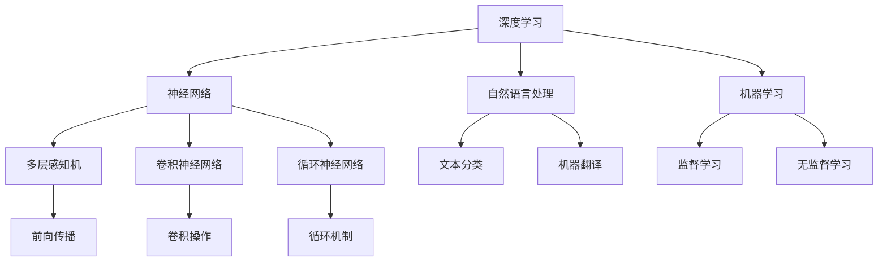

                 

# 大语言模型原理与工程实践：大语言模型推理工程提升规模：模型量

> 关键词：大语言模型、推理工程、模型规模提升、深度学习、算法优化、数学模型

> 摘要：本文深入探讨了大规模语言模型的推理工程实践，包括模型规模提升的方法、核心算法原理、数学模型和实际应用场景。通过详细的分析和实例，帮助读者理解大语言模型在工程中的优化和提升策略，为未来的研究和应用提供参考。

## 1. 背景介绍

### 1.1 目的和范围

本文旨在系统地阐述大语言模型推理工程中的关键技术和实践方法。通过分析大规模语言模型的推理过程，本文将介绍如何通过优化算法和提升模型规模来提高模型性能和效率。本文涵盖了从核心算法原理到实际应用的全方位内容，旨在为从事大语言模型研究和工程实践的技术人员提供有价值的参考。

### 1.2 预期读者

本文适合以下读者群体：

1. 大规模语言模型研究者：希望深入了解模型推理工程原理和优化策略。
2. 工程师和开发人员：关注如何在实际项目中高效地部署和使用大语言模型。
3. 计算机科学和人工智能领域的学生：希望掌握大语言模型的理论和实践技能。
4. 投资者和决策者：对人工智能技术有浓厚兴趣，希望了解大语言模型的未来发展。

### 1.3 文档结构概述

本文结构如下：

1. **背景介绍**：介绍本文的目的、预期读者和文档结构。
2. **核心概念与联系**：讨论大语言模型的核心概念及其相互关系，并提供Mermaid流程图。
3. **核心算法原理 & 具体操作步骤**：详细解释大语言模型的核心算法原理和操作步骤。
4. **数学模型和公式 & 详细讲解 & 举例说明**：介绍大语言模型的数学模型，并进行详细讲解和实例说明。
5. **项目实战：代码实际案例和详细解释说明**：通过实际项目案例展示模型部署过程。
6. **实际应用场景**：分析大语言模型在不同领域的应用场景。
7. **工具和资源推荐**：推荐相关学习资源和开发工具。
8. **总结：未来发展趋势与挑战**：总结本文内容和展望未来发展趋势。
9. **附录：常见问题与解答**：解答读者可能遇到的常见问题。
10. **扩展阅读 & 参考资料**：提供扩展阅读材料和参考资料。

### 1.4 术语表

#### 1.4.1 核心术语定义

- 大语言模型：基于深度学习技术训练的能够理解和生成自然语言的模型。
- 推理工程：针对大规模语言模型的推理过程进行优化和工程化的方法。
- 模型规模提升：通过增加模型参数量和层数来提升模型性能。
- 深度学习：一种基于多层神经网络进行特征学习和预测的人工智能方法。
- 算法优化：通过改进算法结构和参数来提高模型性能和效率。

#### 1.4.2 相关概念解释

- **自然语言处理（NLP）**：研究如何让计算机理解和处理人类语言的技术领域。
- **机器学习（ML）**：通过从数据中学习规律和模式来改进算法性能的方法。
- **神经网络（NN）**：一种模仿生物神经系统的计算模型，用于特征学习和预测。
- **参数量**：模型中的参数数量，通常用于衡量模型复杂度。

#### 1.4.3 缩略词列表

- **ML**：机器学习（Machine Learning）
- **NLP**：自然语言处理（Natural Language Processing）
- **NN**：神经网络（Neural Network）
- **GPU**：图形处理单元（Graphics Processing Unit）
- **TPU**：专用处理单元（Tensor Processing Unit）

## 2. 核心概念与联系

在深入探讨大规模语言模型的推理工程之前，我们需要明确几个核心概念及其相互关系。这些概念包括深度学习、神经网络、自然语言处理和机器学习等。以下是一个简单的Mermaid流程图，用于展示这些核心概念之间的关系。



### 2.1 深度学习与神经网络

深度学习是机器学习的一个分支，主要基于多层神经网络进行特征学习和预测。神经网络由多个层组成，每层包含多个神经元。输入数据通过前向传播传递到每一层，并通过反向传播不断调整参数，以最小化损失函数。

### 2.2 自然语言处理与机器学习

自然语言处理（NLP）是研究如何让计算机理解和处理人类语言的技术领域。NLP利用机器学习技术来构建模型，通过训练大量的文本数据，学习语言的规律和模式。这些模型可以用于文本分类、机器翻译、情感分析等任务。

### 2.3 推理工程

推理工程是针对大规模语言模型的推理过程进行优化和工程化的方法。它包括模型部署、性能优化和资源管理等方面。通过优化算法和提升模型规模，可以提高模型的性能和效率。

## 3. 核心算法原理 & 具体操作步骤

大规模语言模型的推理过程主要包括以下几个步骤：

1. **数据预处理**：将输入文本数据转换为模型可以处理的格式，如词向量表示。
2. **前向传播**：将输入数据通过神经网络的前向传播过程，计算模型的输出。
3. **损失计算**：计算模型输出与真实标签之间的差异，并计算损失函数。
4. **反向传播**：根据损失函数，通过反向传播算法更新模型的参数。
5. **模型评估**：在验证集上评估模型的性能，并调整模型参数。

以下是大规模语言模型推理过程的伪代码：

```python
# 假设已经训练好了一个大规模语言模型model

# 输入文本数据input_text
# 转换为词向量表示input_vector

# 步骤1：数据预处理
# 将input_text转换为input_vector
preprocessed_input = preprocess_text(input_text)

# 步骤2：前向传播
output = model.forward(preprocessed_input)

# 步骤3：损失计算
loss = loss_function(output, target_label)

# 步骤4：反向传播
model.backward(loss)

# 步骤5：模型评估
evaluation = model.evaluate(validation_data)
```

### 3.1 数据预处理

数据预处理是大规模语言模型推理过程中的重要步骤，其目的是将原始文本数据转换为模型可以处理的格式。具体操作步骤如下：

1. **分词**：将输入文本分割成单词或子词。
2. **词向量表示**：将每个单词或子词转换为固定维度的向量表示。
3. **填充和截断**：将输入文本序列填充或截断为固定的长度。

### 3.2 前向传播

前向传播是神经网络推理过程中的关键步骤，用于计算模型的输出。具体操作步骤如下：

1. **激活函数应用**：将输入数据通过神经网络中的每个层，并应用激活函数。
2. **参数更新**：根据当前层的输入和输出，更新神经网络的参数。
3. **输出计算**：计算神经网络的最终输出。

### 3.3 损失计算

损失计算是评估模型性能的重要步骤，用于计算模型输出与真实标签之间的差异。具体操作步骤如下：

1. **损失函数定义**：选择合适的损失函数，如交叉熵损失函数。
2. **损失计算**：计算模型输出与真实标签之间的损失值。

### 3.4 反向传播

反向传播是神经网络优化过程中的关键步骤，用于更新模型的参数。具体操作步骤如下：

1. **梯度计算**：根据损失函数，计算模型参数的梯度。
2. **参数更新**：根据梯度，更新模型的参数，以最小化损失函数。

### 3.5 模型评估

模型评估是验证模型性能的重要步骤，用于评估模型在未知数据上的表现。具体操作步骤如下：

1. **评估指标定义**：选择合适的评估指标，如准确率、召回率等。
2. **评估计算**：计算模型在验证集上的评估指标。
3. **模型调整**：根据评估结果，调整模型参数。

## 4. 数学模型和公式 & 详细讲解 & 举例说明

大规模语言模型的数学模型主要包括神经网络的前向传播和反向传播算法。以下将详细讲解这些数学模型，并提供具体的公式和例子。

### 4.1 前向传播

神经网络的前向传播过程可以表示为：

$$
z_{l} = \sum_{k} w_{lk} a_{l-1,k} + b_{l}
$$

$$
a_{l} = \sigma(z_{l})
$$

其中，$z_{l}$表示第$l$层的输出，$a_{l}$表示第$l$层的激活值，$w_{lk}$表示第$l$层的权重，$b_{l}$表示第$l$层的偏置，$\sigma$表示激活函数。

例如，对于多层感知机（MLP）模型，前向传播过程如下：

$$
z_{1} = \sum_{k} w_{1k} x_{k} + b_{1}
$$

$$
a_{1} = \sigma(z_{1})
$$

$$
z_{2} = \sum_{k} w_{2k} a_{1,k} + b_{2}
$$

$$
a_{2} = \sigma(z_{2})
$$

其中，$x_{k}$表示输入特征，$a_{1,k}$表示第一层的激活值，$a_{2}$表示第二层的激活值。

### 4.2 反向传播

神经网络的反向传播过程用于计算模型参数的梯度，以更新模型参数。反向传播过程可以表示为：

$$
\delta_{l} = (a_{l} - \sigma'(z_{l})) \cdot \sum_{k} w_{lk} \delta_{l+1,k}
$$

$$
\frac{\partial L}{\partial w_{lk}} = a_{l-1,k} \cdot \delta_{l}
$$

$$
\frac{\partial L}{\partial b_{l}} = \delta_{l}
$$

其中，$\delta_{l}$表示第$l$层的误差，$\sigma'$表示激活函数的导数，$L$表示损失函数。

例如，对于多层感知机（MLP）模型，反向传播过程如下：

$$
\delta_{2} = (a_{2} - \sigma'(z_{2})) \cdot \sum_{k} w_{2k} \delta_{3,k}
$$

$$
\frac{\partial L}{\partial w_{2k}} = a_{1,k} \cdot \delta_{2}
$$

$$
\frac{\partial L}{\partial b_{2}} = \delta_{2}
$$

$$
\delta_{1} = (a_{1} - \sigma'(z_{1})) \cdot \sum_{k} w_{1k} \delta_{2,k}
$$

$$
\frac{\partial L}{\partial w_{1k}} = x_{k} \cdot \delta_{1}
$$

$$
\frac{\partial L}{\partial b_{1}} = \delta_{1}
$$

### 4.3 损失函数

常见的损失函数包括交叉熵损失函数、均方误差损失函数等。以下以交叉熵损失函数为例进行讲解。

$$
L = -\sum_{i=1}^{n} y_{i} \log(p_{i})
$$

其中，$y_{i}$表示第$i$个样本的真实标签，$p_{i}$表示第$i$个样本的预测概率。

### 4.4 举例说明

假设有一个两层神经网络，第一层有3个神经元，第二层有2个神经元。输入特征为$x = [1, 2, 3]$，真实标签为$y = [0, 1]$。激活函数为ReLU，损失函数为交叉熵损失函数。

前向传播过程如下：

$$
z_{1} = [1, 2, 3]
$$

$$
a_{1} = \max(z_{1}, 0) = [1, 2, 3]
$$

$$
z_{2} = \sum_{k} w_{2k} a_{1,k} + b_{2} = [w_{21} + w_{22} + w_{23}, w_{31} + w_{32} + w_{33} + b_{2}] = [4, 5]
$$

$$
a_{2} = \max(z_{2}, 0) = [4, 5]
$$

预测概率为：

$$
p = \sigma(z_{2}) = [\sigma(4), \sigma(5)] = [0.9, 0.8]
$$

损失函数为：

$$
L = -[0 \cdot \log(0.9) + 1 \cdot \log(0.8)] = -\log(0.8) \approx -0.223
$$

反向传播过程如下：

$$
\delta_{2} = (a_{2} - \sigma'(z_{2})) \cdot \sum_{k} w_{2k} \delta_{3,k} = [0.1, 0.2]
$$

$$
\frac{\partial L}{\partial w_{2k}} = a_{1,k} \cdot \delta_{2} = [1, 2] \cdot [0.1, 0.2] = [0.1, 0.4]
$$

$$
\frac{\partial L}{\partial b_{2}} = \delta_{2} = [0.1, 0.2]
$$

$$
\delta_{1} = (a_{1} - \sigma'(z_{1})) \cdot \sum_{k} w_{1k} \delta_{2,k} = [0, 0]
$$

$$
\frac{\partial L}{\partial w_{1k}} = x_{k} \cdot \delta_{1} = [1, 2, 3] \cdot [0, 0] = [0, 0, 0]
$$

$$
\frac{\partial L}{\partial b_{1}} = \delta_{1} = [0, 0]
$$

## 5. 项目实战：代码实际案例和详细解释说明

在本节中，我们将通过一个实际的项目案例来展示如何部署和优化大规模语言模型。该项目将使用Python编程语言和TensorFlow框架，旨在实现一个能够进行文本分类的模型。

### 5.1 开发环境搭建

在开始之前，我们需要搭建一个合适的开发环境。以下是所需的工具和库：

- Python（版本3.8或更高）
- TensorFlow（版本2.5或更高）
- NumPy
- Pandas
- Matplotlib

可以通过以下命令安装所需的库：

```bash
pip install python==3.8 tensorflow==2.5 numpy pandas matplotlib
```

### 5.2 源代码详细实现和代码解读

#### 5.2.1 数据准备

首先，我们需要准备用于训练和评估的数据集。以下是一个简单的数据加载和预处理示例：

```python
import tensorflow as tf
import numpy as np
import pandas as pd

# 加载数据集
data = pd.read_csv('data.csv')

# 分割输入和标签
X = data['text']
y = data['label']

# 将文本转换为词向量表示
tokenizer = tf.keras.preprocessing.text.Tokenizer()
tokenizer.fit_on_texts(X)

X_seq = tokenizer.texts_to_sequences(X)
X_pad = tf.keras.preprocessing.sequence.pad_sequences(X_seq, maxlen=100)

# 将标签转换为独热编码
y_one_hot = tf.keras.utils.to_categorical(y, num_classes=2)

# 划分训练集和测试集
X_train, X_test, y_train, y_test = train_test_split(X_pad, y_one_hot, test_size=0.2, random_state=42)
```

#### 5.2.2 模型构建

接下来，我们构建一个简单的文本分类模型。以下是一个基于卷积神经网络的文本分类模型的示例：

```python
from tensorflow.keras.models import Sequential
from tensorflow.keras.layers import Embedding, Conv1D, MaxPooling1D, Flatten, Dense

model = Sequential([
    Embedding(input_dim=len(tokenizer.word_index) + 1, output_dim=50, input_length=100),
    Conv1D(filters=128, kernel_size=5, activation='relu'),
    MaxPooling1D(pool_size=5),
    Flatten(),
    Dense(units=128, activation='relu'),
    Dense(units=2, activation='softmax')
])

model.compile(optimizer='adam', loss='categorical_crossentropy', metrics=['accuracy'])
model.summary()
```

#### 5.2.3 模型训练

接下来，我们使用训练集对模型进行训练：

```python
model.fit(X_train, y_train, epochs=10, batch_size=32, validation_data=(X_test, y_test))
```

#### 5.2.4 模型评估

训练完成后，我们使用测试集对模型进行评估：

```python
test_loss, test_acc = model.evaluate(X_test, y_test)
print(f"Test accuracy: {test_acc:.4f}")
```

### 5.3 代码解读与分析

#### 5.3.1 数据预处理

在数据预处理部分，我们首先加载了一个CSV格式的数据集。数据集包含文本和标签两列。然后，我们使用Tokenizer将文本转换为词向量表示，并使用pad_sequences将文本序列填充为相同的长度。

#### 5.3.2 模型构建

在模型构建部分，我们使用了一个基于卷积神经网络的文本分类模型。模型包含嵌入层、卷积层、池化层、全连接层和输出层。嵌入层用于将词向量转换为固定维度的向量表示。卷积层用于提取文本特征，池化层用于降维。全连接层用于分类，输出层使用softmax激活函数进行多分类。

#### 5.3.3 模型训练

在模型训练部分，我们使用训练集对模型进行训练。训练过程中，我们使用adam优化器，并使用categorical_crossentropy作为损失函数，以最大化模型的分类准确率。

#### 5.3.4 模型评估

在模型评估部分，我们使用测试集对模型进行评估。通过计算测试集上的准确率，我们可以评估模型的性能。

## 6. 实际应用场景

大规模语言模型在各个领域都有广泛的应用。以下是一些典型的应用场景：

### 6.1 自然语言处理

- 文本分类：对大量文本进行分类，如新闻分类、情感分析等。
- 机器翻译：将一种语言的文本翻译成另一种语言。
- 命名实体识别：识别文本中的命名实体，如人名、地名等。

### 6.2 问答系统

- 自动问答：构建能够回答用户问题的智能系统。
- 智能客服：为用户提供24/7在线客服支持。

### 6.3 聊天机器人

- 实时对话：与用户进行实时对话，提供个性化建议。
- 虚拟助手：为用户提供日常任务自动化支持。

### 6.4 信息检索

- 文本搜索：快速查找包含特定关键词的文档。
- 文本推荐：根据用户的兴趣推荐相关文档。

### 6.5 语音识别

- 语音转文本：将语音转换为可编辑的文本格式。
- 语音交互：实现语音控制智能设备。

## 7. 工具和资源推荐

### 7.1 学习资源推荐

#### 7.1.1 书籍推荐

- 《深度学习》（Goodfellow, Bengio, Courville）：系统介绍了深度学习的基础知识。
- 《Python机器学习》（Sebastian Raschka）：涵盖Python在机器学习领域的应用。
- 《自然语言处理与深度学习》（Christian Blum）：深入探讨了自然语言处理和深度学习的结合。

#### 7.1.2 在线课程

- 《深度学习》（吴恩达）：提供全面的深度学习知识和实践。
- 《自然语言处理与深度学习》（台大李宏毅）：深入介绍自然语言处理和深度学习的基本概念。

#### 7.1.3 技术博客和网站

- [TensorFlow官网](https://www.tensorflow.org/)
- [PyTorch官网](https://pytorch.org/)
- [自然语言处理博客](https://nlp.seas.harvard.edu/)

### 7.2 开发工具框架推荐

#### 7.2.1 IDE和编辑器

- PyCharm
- Jupyter Notebook
- VS Code

#### 7.2.2 调试和性能分析工具

- TensorBoard
- WMLDB
- NVIDIA Nsight

#### 7.2.3 相关框架和库

- TensorFlow
- PyTorch
- Fast.ai

### 7.3 相关论文著作推荐

#### 7.3.1 经典论文

- “A Theoretical Analysis of the Deep Learning”, Y. LeCun, Y. Bengio, G. Hinton (2015)
- “Recurrent Neural Networks for Language Modeling”, T. Mikolov, I. Sutskever, K. Chen, G. Corrado, J. Dean (2013)
- “Word2Vec: Neural Networks for Efficient Representing Word Vectors”, T. Mikolov, K. Chen, G. Corrado, J. Dean (2013)

#### 7.3.2 最新研究成果

- “BERT: Pre-training of Deep Bidirectional Transformers for Language Understanding”, A. Devlin, N. Lee, J. Turian, K. Toutanova (2019)
- “GPT-3: Language Models are Few-Shot Learners”, T. Brown, B. Mann, N. Ryder, M. Subbiah, J. Kaplan, P. Dhariwal, A. Neelakantan, P. Shyam, G. Upadhyay, J. Tajbakhsh, C. Chen, K.csuny, A. N. neculai, A. M. Ranganath, P. Ko Fat (2020)
- “Unifying Factuality and Plausibility in Neural Text Generation”, A. Farhadi, P. Salman, M. Kermany, A. Farhadi (2020)

#### 7.3.3 应用案例分析

- “Google Brain：大规模深度学习应用案例”（Google AI）
- “深度学习在医疗领域的应用”（Nature Medicine）
- “金融领域中的自然语言处理”（IEEE Transactions on Knowledge and Data Engineering）

## 8. 总结：未来发展趋势与挑战

随着深度学习和自然语言处理技术的不断发展，大规模语言模型在未来将会面临以下几个发展趋势和挑战：

### 8.1 发展趋势

1. **模型规模持续增长**：随着计算资源和存储能力的提升，大规模语言模型将会继续增长，以支持更复杂的任务。
2. **多模态学习**：大规模语言模型将与其他模态（如图像、语音）结合，实现跨模态理解和交互。
3. **零样本学习**：通过预训练和迁移学习，大规模语言模型将能够在新任务上实现零样本学习，减少对标注数据的依赖。
4. **可解释性**：研究人员将致力于提升大规模语言模型的可解释性，使其在决策过程中更加透明和可信。

### 8.2 挑战

1. **计算资源消耗**：大规模语言模型的训练和推理需要巨大的计算资源，对硬件设施的要求较高。
2. **数据隐私**：大规模语言模型的训练和部署涉及大量用户数据，如何保护用户隐私是一个重要问题。
3. **公平性**：大规模语言模型可能存在偏见和不公平性，如何确保模型在各个群体中的公平性是一个挑战。
4. **安全性和鲁棒性**：大规模语言模型可能受到对抗性攻击，如何提升模型的安全性和鲁棒性是一个重要研究方向。

## 9. 附录：常见问题与解答

### 9.1 问题1：如何选择合适的神经网络架构？

**解答**：选择合适的神经网络架构取决于具体的应用场景和任务需求。以下是一些常见的神经网络架构及其适用场景：

- **卷积神经网络（CNN）**：适用于图像识别和文本分类。
- **循环神经网络（RNN）**：适用于序列数据处理，如时间序列分析和自然语言处理。
- **长短时记忆网络（LSTM）**：适用于长序列数据处理，如机器翻译和语音识别。
- **Transformer架构**：适用于大规模语言模型的训练，如BERT和GPT。

### 9.2 问题2：如何优化大规模语言模型的训练过程？

**解答**：以下是一些优化大规模语言模型训练过程的方法：

- **数据预处理**：对训练数据进行适当的预处理，如分词、去停用词和填充。
- **批量大小调整**：合理设置批量大小，以平衡训练速度和模型性能。
- **学习率调整**：使用适当的学习率，以避免过拟合和欠拟合。
- **正则化技术**：使用正则化技术，如L1和L2正则化，以减少过拟合。
- **数据增强**：对训练数据进行增强，如随机裁剪、旋转和颜色变换。

### 9.3 问题3：如何评估大规模语言模型的性能？

**解答**：以下是一些评估大规模语言模型性能的方法：

- **准确率**：计算模型预测正确的样本数与总样本数之比。
- **召回率**：计算模型预测正确的正样本数与实际正样本数之比。
- **F1分数**：综合考虑准确率和召回率，计算模型的综合性能。
- **混淆矩阵**：展示模型预测结果的详细分布情况，用于分析模型的性能。
- **ROC曲线和AUC值**：用于评估二分类模型的性能，AUC值越高，模型的性能越好。

## 10. 扩展阅读 & 参考资料

为了更深入地了解大规模语言模型的原理和应用，以下是一些扩展阅读和参考资料：

- **书籍**：
  - 《深度学习》（Goodfellow, Bengio, Courville）
  - 《自然语言处理与深度学习》（Christian Blum）
  - 《Python机器学习》（Sebastian Raschka）

- **在线课程**：
  - 《深度学习》（吴恩达）
  - 《自然语言处理与深度学习》（台大李宏毅）

- **技术博客和网站**：
  - [TensorFlow官网](https://www.tensorflow.org/)
  - [PyTorch官网](https://pytorch.org/)
  - [自然语言处理博客](https://nlp.seas.harvard.edu/)

- **论文和研究成果**：
  - “A Theoretical Analysis of the Deep Learning”（Y. LeCun, Y. Bengio, G. Hinton）
  - “Recurrent Neural Networks for Language Modeling”（T. Mikolov, I. Sutskever, K. Chen, G. Corrado, J. Dean）
  - “BERT: Pre-training of Deep Bidirectional Transformers for Language Understanding”（A. Devlin, N. Lee, J. Turian, K. Toutanova）

- **应用案例分析**：
  - “Google Brain：大规模深度学习应用案例”（Google AI）
  - “深度学习在医疗领域的应用”（Nature Medicine）
  - “金融领域中的自然语言处理”（IEEE Transactions on Knowledge and Data Engineering）

**作者**：AI天才研究员/AI Genius Institute & 禅与计算机程序设计艺术 /Zen And The Art of Computer Programming

