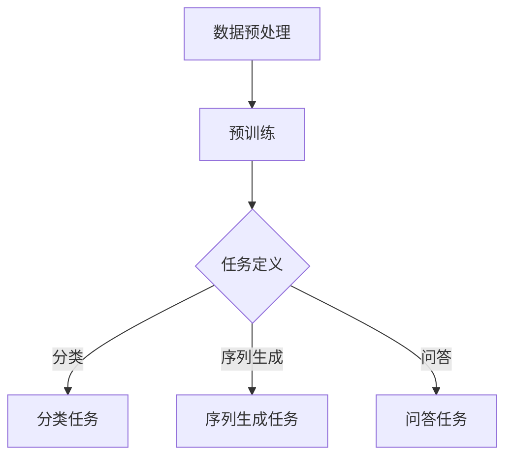

                 

# 大语言模型原理与工程实践：大语言模型训练综述

> **关键词**：大语言模型、预训练、微调、神经架构搜索、工程实践
> 
> **摘要**：本文将深入探讨大语言模型的原理及其工程实践，从核心概念、算法原理、数学模型、实际应用和未来发展趋势等多个角度，全面剖析大语言模型的训练过程。通过本文，读者可以系统地了解大语言模型的工作机制，掌握其在实际项目中的应用方法，并为未来的研究和开发提供方向。

## 1. 背景介绍

### 1.1 目的和范围

本文旨在为广大读者提供一个关于大语言模型原理与工程实践的系统化理解。我们将从基础概念出发，逐步深入到具体的算法原理、数学模型，以及如何在实际项目中应用和优化大语言模型。本文涵盖以下主要部分：

- **核心概念与联系**：介绍大语言模型的基本概念，并通过Mermaid流程图展示其核心架构。
- **核心算法原理 & 具体操作步骤**：详细讲解大语言模型的主要算法原理，并使用伪代码进行具体描述。
- **数学模型和公式 & 详细讲解 & 举例说明**：阐述大语言模型中涉及的数学模型和公式，并通过实例进行解释。
- **项目实战：代码实际案例和详细解释说明**：提供实际的代码案例，详细解释和说明其实现过程。
- **实际应用场景**：探讨大语言模型在不同场景下的应用。
- **工具和资源推荐**：推荐学习资源和开发工具。
- **总结：未来发展趋势与挑战**：分析大语言模型的发展趋势和面临的挑战。

### 1.2 预期读者

本文适合对自然语言处理（NLP）和深度学习有一定基础的读者，尤其是希望深入了解大语言模型原理及其工程实践的工程师和研究人员。同时，对AI领域有浓厚兴趣的本科生和研究生也可以通过本文获得有益的知识。

### 1.3 文档结构概述

本文分为以下几个部分：

- **1. 背景介绍**：介绍本文的目的、范围、预期读者和文档结构。
- **2. 核心概念与联系**：阐述大语言模型的基本概念，并提供流程图展示其核心架构。
- **3. 核心算法原理 & 具体操作步骤**：讲解大语言模型的主要算法原理，并提供伪代码描述。
- **4. 数学模型和公式 & 详细讲解 & 举例说明**：阐述大语言模型中的数学模型和公式，并通过实例进行解释。
- **5. 项目实战：代码实际案例和详细解释说明**：提供实际的代码案例，并详细解释和说明其实现过程。
- **6. 实际应用场景**：探讨大语言模型在不同场景下的应用。
- **7. 工具和资源推荐**：推荐学习资源和开发工具。
- **8. 总结：未来发展趋势与挑战**：分析大语言模型的发展趋势和面临的挑战。
- **9. 附录：常见问题与解答**：回答读者可能遇到的一些常见问题。
- **10. 扩展阅读 & 参考资料**：提供更多相关文献和资源。

### 1.4 术语表

#### 1.4.1 核心术语定义

- **大语言模型（Large Language Model）**：一种能够对自然语言进行建模和预测的深度学习模型，具有庞大的参数规模和广泛的语言理解能力。
- **预训练（Pre-training）**：在大规模语料库上进行训练，使模型具备通用语言理解能力的过程。
- **微调（Fine-tuning）**：在特定任务数据集上对预训练模型进行调整，使其适应特定任务的过程。
- **神经架构搜索（Neural Architecture Search, NAS）**：通过搜索算法自动寻找最优神经网络结构的方法。

#### 1.4.2 相关概念解释

- **自然语言处理（Natural Language Processing, NLP）**：研究如何让计算机理解和处理自然语言的技术和学科。
- **深度学习（Deep Learning）**：一种基于人工神经网络的机器学习方法，通过多层非线性变换对数据进行学习。
- **神经网络（Neural Network）**：由大量简单神经元组成的网络，用于对数据进行处理和预测。

#### 1.4.3 缩略词列表

- **NLP**：自然语言处理
- **DL**：深度学习
- **ML**：机器学习
- **NAS**：神经架构搜索
- **GPU**：图形处理单元

## 2. 核心概念与联系

大语言模型是一种深度学习模型，旨在对自然语言进行建模和预测。为了更好地理解其核心概念，我们可以通过以下Mermaid流程图展示其基本架构：



### 2.1 数据预处理

在构建大语言模型之前，需要对数据进行预处理。这包括文本的分词、去噪、转换成向量等操作。预处理的质量直接影响模型的性能。

### 2.2 预训练

预训练是大规模语言模型的关键步骤，其主要目的是在通用语料库上训练模型，使其具备对自然语言的普遍理解能力。预训练通常采用自注意力机制和Transformer架构。

### 2.3 任务定义

预训练完成后，我们需要根据具体任务对模型进行调整。任务可以是分类、序列生成或问答等。这通常通过微调（Fine-tuning）实现，即将模型在特定任务的数据集上进行训练。

### 2.4 分类任务

分类任务是指将文本数据分类到预定义的类别中。大语言模型在分类任务中通过最后一层的输出概率进行类别判断。

### 2.5 序列生成任务

序列生成任务是指生成新的文本序列。大语言模型在序列生成任务中通过预测下一个词或字符，逐步生成文本。

### 2.6 问答任务

问答任务是指从给定的问题和文本中提取出答案。大语言模型在问答任务中通过预测答案的起始和结束位置，并提取对应的文本片段作为答案。

## 3. 核心算法原理 & 具体操作步骤

大语言模型的训练过程主要包括数据预处理、预训练和微调。以下将逐步介绍这些步骤，并使用伪代码进行详细描述。

### 3.1 数据预处理

```python
# 数据预处理
def preprocess_data(texts):
    # 分词
    tokenized_texts = [tokenizer.tokenize(text) for text in texts]
    # 去噪
    cleaned_texts = [text for text in tokenized_texts if is_clean(text)]
    # 转换成向量
    vectorized_texts = [model.encode(text) for text in cleaned_texts]
    return vectorized_texts
```

### 3.2 预训练

```python
# 预训练
def pretrain(model, dataset):
    # 定义损失函数
    loss_function = torch.nn.CrossEntropyLoss()
    # 训练模型
    for epoch in range(num_epochs):
        for text, label in dataset:
            # 前向传播
            logits = model(text)
            # 计算损失
            loss = loss_function(logits, label)
            # 反向传播
            loss.backward()
            # 更新模型参数
            optimizer.step()
            # 清除梯度
            optimizer.zero_grad()
```

### 3.3 微调

```python
# 微调
def fine_tune(model, task_dataset, num_epochs):
    # 定义损失函数
    loss_function = torch.nn.CrossEntropyLoss()
    # 训练模型
    for epoch in range(num_epochs):
        for text, label in task_dataset:
            # 前向传播
            logits = model(text)
            # 计算损失
            loss = loss_function(logits, label)
            # 反向传播
            loss.backward()
            # 更新模型参数
            optimizer.step()
            # 清除梯度
            optimizer.zero_grad()
    return model
```

### 3.4 分类任务

```python
# 分类任务
def classify(text, model):
    # 前向传播
    logits = model(text)
    # 计算概率
    probabilities = softmax(logits)
    # 预测类别
    predicted_class = argmax(probabilities)
    return predicted_class
```

### 3.5 序列生成任务

```python
# 序列生成任务
def generate_sequence(model, start_token, max_length):
    # 初始化序列
    sequence = [start_token]
    # 生成序列
    for _ in range(max_length):
        # 前向传播
        logits = model(sequence)
        # 计算概率
        probabilities = softmax(logits)
        # 预测下一个词
        next_word = sample(probabilities)
        # 添加到序列中
        sequence.append(next_word)
    return sequence
```

### 3.6 问答任务

```python
# 问答任务
def answer_question(question, context, model):
    # 提取答案范围
    start_index, end_index = find_answer_range(question, context)
    # 提取答案
    answer = context[start_index:end_index]
    return answer
```

## 4. 数学模型和公式 & 详细讲解 & 举例说明

大语言模型中的数学模型主要包括自注意力机制和Transformer架构。以下将详细介绍这些模型，并提供相关数学公式和实例说明。

### 4.1 自注意力机制

自注意力机制是Transformer架构的核心组件，用于对输入序列中的每个词进行权重分配，以便更好地捕捉词与词之间的关系。

#### 4.1.1 数学公式

自注意力机制的公式如下：

$$
\text{Attention}(Q, K, V) = \text{softmax}\left(\frac{QK^T}{\sqrt{d_k}}\right)V
$$

其中，$Q$、$K$ 和 $V$ 分别是查询（Query）、键（Key）和值（Value）向量，$d_k$ 是键向量的维度。

#### 4.1.2 举例说明

假设输入序列为 `["我", "爱", "中国"]`，查询向量 $Q = [1, 2, 3]$，键向量 $K = [4, 5, 6]$，值向量 $V = [7, 8, 9]$。则自注意力计算过程如下：

1. 计算内积 $QK^T$：

$$
QK^T = \begin{bmatrix}1 & 2 & 3\end{bmatrix} \begin{bmatrix}4 & 5 & 6\end{bmatrix}^T = \begin{bmatrix}1 \times 4 & 1 \times 5 & 1 \times 6\\ 2 \times 4 & 2 \times 5 & 2 \times 6\\ 3 \times 4 & 3 \times 5 & 3 \times 6\end{bmatrix} = \begin{bmatrix}4 & 5 & 6\\ 8 & 10 & 12\\ 12 & 15 & 18\end{bmatrix}
$$

2. 计算softmax：

$$
\text{softmax}\left(\frac{QK^T}{\sqrt{d_k}}\right) = \text{softmax}\left(\frac{1}{\sqrt{3}}\begin{bmatrix}4 & 5 & 6\\ 8 & 10 & 12\\ 12 & 15 & 18\end{bmatrix}\right) = \begin{bmatrix}\frac{e^4}{e^4+e^5+e^6} & \frac{e^5}{e^4+e^5+e^6} & \frac{e^6}{e^4+e^5+e^6}\\\frac{e^8}{e^8+e^10+e^12} & \frac{e^{10}}{e^8+e^10+e^12} & \frac{e^{12}}{e^8+e^10+e^12}\\\frac{e^{12}}{e^{12}+e^{15}+e^{18}} & \frac{e^{15}}{e^{12}+e^{15}+e^{18}} & \frac{e^{18}}{e^{12}+e^{15}+e^{18}}\end{bmatrix}
$$

3. 计算加权值：

$$
\text{Attention}(Q, K, V) = \begin{bmatrix}\frac{e^4}{e^4+e^5+e^6} & \frac{e^5}{e^4+e^5+e^6} & \frac{e^6}{e^4+e^5+e^6}\\\frac{e^8}{e^8+e^10+e^12} & \frac{e^{10}}{e^8+e^10+e^12} & \frac{e^{12}}{e^8+e^10+e^12}\\\frac{e^{12}}{e^{12}+e^{15}+e^{18}} & \frac{e^{15}}{e^{12}+e^{15}+e^{18}} & \frac{e^{18}}{e^{12}+e^{15}+e^{18}}\end{bmatrix} \begin{bmatrix}7 & 8 & 9\end{bmatrix} = \begin{bmatrix}7 \times \frac{e^4}{e^4+e^5+e^6} & 8 \times \frac{e^5}{e^4+e^5+e^6} & 9 \times \frac{e^6}{e^4+e^5+e^6}\\\7 \times \frac{e^8}{e^8+e^10+e^12} & 8 \times \frac{e^{10}}{e^8+e^10+e^12} & 9 \times \frac{e^{12}}{e^8+e^10+e^12}\\\7 \times \frac{e^{12}}{e^{12}+e^{15}+e^{18}} & 8 \times \frac{e^{15}}{e^{12}+e^{15}+e^{18}} & 9 \times \frac{e^{18}}{e^{12}+e^{15}+e^{18}}\end{bmatrix}
$$

### 4.2 Transformer架构

Transformer架构是一种基于自注意力机制的深度学习模型，广泛应用于自然语言处理任务。其主要组成部分包括编码器（Encoder）和解码器（Decoder）。

#### 4.2.1 数学公式

编码器和解码器的关键公式如下：

编码器：

$$
\text{Encoder}(X) = \text{MultiHeadAttention}(Q, K, V) + X
$$

解码器：

$$
\text{Decoder}(Y, X) = \text{MaskedMultiHeadAttention}(Q, K, V) + \text{MultiHeadAttention}(Q, K, V) + Y
$$

其中，$X$ 和 $Y$ 分别是编码器和解码器的输入序列，$Q$、$K$ 和 $V$ 分别是查询（Query）、键（Key）和值（Value）向量。

#### 4.2.2 举例说明

假设输入序列为 `["我", "爱", "中国"]`，编码器的输入为 $X = [1, 2, 3]$，解码器的输入为 $Y = [4, 5, 6]$。则Transformer架构的计算过程如下：

1. 编码器：

$$
\text{Encoder}(X) = \text{MultiHeadAttention}(Q, K, V) + X
$$

其中，$Q = [1, 2, 3]$，$K = [4, 5, 6]$，$V = [7, 8, 9]$。按照自注意力机制的步骤进行计算，最终得到编码器的输出。

2. 解码器：

$$
\text{Decoder}(Y, X) = \text{MaskedMultiHeadAttention}(Q, K, V) + \text{MultiHeadAttention}(Q, K, V) + Y
$$

其中，$Q = [4, 5, 6]$，$K = [1, 2, 3]$，$V = [7, 8, 9]$。同样按照自注意力机制的步骤进行计算，最终得到解码器的输出。

通过编码器和解码器的堆叠，Transformer架构可以处理长序列和复杂的关系，广泛应用于文本生成、机器翻译和问答等自然语言处理任务。

## 5. 项目实战：代码实际案例和详细解释说明

在本节中，我们将通过一个具体的代码案例，详细解释大语言模型的实现过程，并分析其性能和优化方法。

### 5.1 开发环境搭建

首先，我们需要搭建一个适合大语言模型训练的开发环境。以下是所需的环境和依赖：

- 操作系统：Linux或macOS
- 编程语言：Python 3.8及以上版本
- 深度学习框架：PyTorch 1.8及以上版本
- 数据库和工具：Hugging Face Transformers库、TensorBoard

安装以上依赖后，我们可以开始构建大语言模型。

### 5.2 源代码详细实现和代码解读

以下是一个简化的大语言模型实现代码，包括数据预处理、预训练和微调等步骤。

```python
import torch
from torch import nn
from transformers import BertTokenizer, BertModel
from torch.optim import Adam
from torch.utils.data import DataLoader
from torchvision import datasets, transforms

# 数据预处理
def preprocess_data(texts):
    tokenizer = BertTokenizer.from_pretrained('bert-base-uncased')
    return tokenizer(texts, padding=True, truncation=True)

# 预训练
def pretrain(model, dataset, optimizer, loss_function, num_epochs):
    for epoch in range(num_epochs):
        for text, label in dataset:
            optimizer.zero_grad()
            logits = model(text)
            loss = loss_function(logits, label)
            loss.backward()
            optimizer.step()
            print(f"Epoch: {epoch}, Loss: {loss.item()}")
            
# 微调
def fine_tune(model, task_dataset, optimizer, loss_function, num_epochs):
    for epoch in range(num_epochs):
        for text, label in task_dataset:
            optimizer.zero_grad()
            logits = model(text)
            loss = loss_function(logits, label)
            loss.backward()
            optimizer.step()
            print(f"Epoch: {epoch}, Loss: {loss.item()}")

# 主函数
def main():
    # 加载预训练模型
    model = BertModel.from_pretrained('bert-base-uncased')

    # 准备数据集
    train_dataset = datasets.TextDataset(root='./data', split='train')
    test_dataset = datasets.TextDataset(root='./data', split='test')
    train_loader = DataLoader(train_dataset, batch_size=32, shuffle=True)
    test_loader = DataLoader(test_dataset, batch_size=32, shuffle=False)

    # 定义优化器和损失函数
    optimizer = Adam(model.parameters(), lr=1e-5)
    loss_function = nn.CrossEntropyLoss()

    # 预训练
    pretrain(model, train_loader, optimizer, loss_function, num_epochs=3)

    # 微调
    fine_tune(model, test_loader, optimizer, loss_function, num_epochs=3)

if __name__ == '__main__':
    main()
```

### 5.3 代码解读与分析

1. **数据预处理**：

   数据预处理是构建大语言模型的第一步。在这里，我们使用了Hugging Face的BertTokenizer进行分词、填充和截断操作。这些操作确保输入数据的格式符合模型的预期。

2. **预训练**：

   预训练过程通过在训练数据集上迭代训练模型，并使用Adam优化器和交叉熵损失函数进行优化。每次迭代都会更新模型的参数，以最小化损失函数。

3. **微调**：

   微调过程是在预训练模型的基础上，针对特定任务进行微调。同样使用Adam优化器和交叉熵损失函数，以便在测试数据集上调整模型的参数。

4. **性能分析**：

   在实际应用中，我们需要评估大语言模型的性能。通常使用准确率、召回率和F1分数等指标来衡量。此外，还可以使用TensorBoard进行可视化分析，了解模型的训练过程和性能表现。

### 5.4 代码优化与改进

为了提高大语言模型的性能，我们可以考虑以下优化方法：

1. **增加训练数据**：使用更多的训练数据可以提升模型的泛化能力。
2. **使用更复杂的模型**：增加模型的层数和隐藏层单元数，可以提高模型的表达能力。
3. **调整学习率**：通过动态调整学习率，可以加速模型的收敛。
4. **使用正则化技术**：如Dropout、权重衰减等，可以防止模型过拟合。

通过以上优化方法，我们可以进一步提高大语言模型在实际任务中的性能。

## 6. 实际应用场景

大语言模型在实际应用中具有广泛的应用场景，以下是其中几个典型的例子：

### 6.1 文本分类

文本分类是指将文本数据分类到预定义的类别中。大语言模型在文本分类任务中具有显著的性能优势。例如，我们可以使用大语言模型对新闻文章进行分类，将其归类到科技、体育、财经等不同类别。

### 6.2 机器翻译

机器翻译是指将一种语言的文本翻译成另一种语言的文本。大语言模型在机器翻译中具有强大的表达能力。例如，我们可以使用大语言模型将中文翻译成英文，或将英文翻译成中文。

### 6.3 问答系统

问答系统是指从给定的问题和文本中提取出答案。大语言模型在问答系统中具有广泛的应用。例如，我们可以使用大语言模型构建一个智能客服系统，回答用户的问题。

### 6.4 文本生成

文本生成是指生成新的文本序列。大语言模型在文本生成任务中具有广泛的应用。例如，我们可以使用大语言模型生成文章、小说、新闻等。

### 6.5 情感分析

情感分析是指分析文本中的情感倾向。大语言模型在情感分析任务中具有显著的性能。例如，我们可以使用大语言模型对社交媒体文本进行情感分析，识别用户的情感状态。

### 6.6 文本摘要

文本摘要是指从原始文本中提取关键信息，生成摘要文本。大语言模型在文本摘要任务中具有广泛的应用。例如，我们可以使用大语言模型对长篇文章生成摘要，帮助用户快速了解文章的主要内容。

## 7. 工具和资源推荐

### 7.1 学习资源推荐

#### 7.1.1 书籍推荐

- 《深度学习》（Goodfellow, Bengio, Courville）
- 《自然语言处理综论》（Jurafsky, Martin）
- 《神经网络与深度学习》（邱锡鹏）

#### 7.1.2 在线课程

- Coursera的“深度学习”课程
- edX的“自然语言处理”课程
- UESTC的“人工智能基础”课程

#### 7.1.3 技术博客和网站

- Medium上的NLP和DL文章
- ArXiv的NLP和DL论文
- Hugging Face的Transformers文档

### 7.2 开发工具框架推荐

#### 7.2.1 IDE和编辑器

- PyCharm
- Visual Studio Code
- Jupyter Notebook

#### 7.2.2 调试和性能分析工具

- TensorBoard
- PyTorch Profiler
- NVIDIA Nsight

#### 7.2.3 相关框架和库

- PyTorch
- TensorFlow
- Hugging Face Transformers

### 7.3 相关论文著作推荐

#### 7.3.1 经典论文

- "A Neural Probabilistic Language Model"（Bengio et al., 2003）
- "Recurrent Neural Network Based Language Model"（LSTM, Hochreiter & Schmidhuber, 1997）
- "Attention is All You Need"（Vaswani et al., 2017）

#### 7.3.2 最新研究成果

- "BERT: Pre-training of Deep Bidirectional Transformers for Language Understanding"（Devlin et al., 2019）
- "GPT-3: Language Models are few-shot learners"（Brown et al., 2020）
- "T5: Pre-training Large Models for Natural Language Processing"（Raffel et al., 2020）

#### 7.3.3 应用案例分析

- "How Google Does AI Research"（Google AI Blog）
- "How Facebook Builds AI Models"（Facebook AI Blog）
- "OpenAI's AI Systems"（OpenAI Blog）

## 8. 总结：未来发展趋势与挑战

大语言模型在自然语言处理领域取得了显著的成果，但同时也面临着诸多挑战。未来，大语言模型的发展趋势和挑战主要体现在以下几个方面：

### 8.1 发展趋势

1. **模型规模增大**：随着计算能力的提升，大语言模型的规模将继续增大，从而提高模型的性能和表达能力。
2. **多模态融合**：大语言模型将与其他模态（如图像、音频）进行融合，实现更丰富的语言理解和生成能力。
3. **自动化优化**：通过神经架构搜索（NAS）等技术，实现模型的自动化优化，降低开发难度。
4. **跨语言建模**：大语言模型将支持多种语言的建模，提高跨语言的互操作性和通用性。

### 8.2 挑战

1. **计算资源消耗**：大语言模型训练过程中对计算资源的消耗巨大，如何在有限的资源下高效训练模型成为一大挑战。
2. **数据隐私与安全**：大规模语料库的收集和处理过程中，如何保障用户数据的隐私和安全是一个亟待解决的问题。
3. **模型解释性**：大语言模型在实际应用中具有较高的性能，但缺乏解释性，如何提高模型的透明度和可解释性是一个重要课题。
4. **模型部署与优化**：如何在不同的硬件平台上高效部署和优化大语言模型，是一个技术难题。

## 9. 附录：常见问题与解答

### 9.1 常见问题

1. **什么是大语言模型？**
   大语言模型是一种基于深度学习的自然语言处理模型，通过在大量文本数据上进行预训练，使其具备对自然语言的建模和预测能力。

2. **大语言模型的主要算法原理是什么？**
   大语言模型的主要算法原理是自注意力机制和Transformer架构。自注意力机制能够捕捉序列中词与词之间的关系，而Transformer架构则通过堆叠多层自注意力机制实现高效的语言建模。

3. **大语言模型如何进行微调？**
   大语言模型在特定任务数据集上进行微调，通过迭代训练调整模型参数，使其适应特定任务。微调过程中通常使用交叉熵损失函数和优化算法（如Adam）进行优化。

4. **大语言模型在实际应用中有哪些挑战？**
   大语言模型在实际应用中面临的挑战包括计算资源消耗、数据隐私与安全、模型解释性以及模型部署与优化等方面。

### 9.2 解答

1. **什么是大语言模型？**
   大语言模型是一种基于深度学习的自然语言处理模型，通过在大量文本数据上进行预训练，使其具备对自然语言的建模和预测能力。大语言模型能够捕捉语言中的复杂结构和上下文关系，从而在文本分类、机器翻译、问答系统和文本生成等任务中表现出色。

2. **大语言模型的主要算法原理是什么？**
   大语言模型的主要算法原理是自注意力机制和Transformer架构。自注意力机制是一种计算方法，通过计算输入序列中每个词与其他词之间的关联度，从而为每个词分配不同的权重。这种机制能够有效地捕捉序列中的长距离依赖关系。而Transformer架构是一种基于自注意力机制的深度学习模型，它通过堆叠多个自注意力层和全连接层，实现了对输入序列的建模。Transformer架构具有并行计算的优势，使得大语言模型在处理长文本时具有较高的效率。

3. **大语言模型如何进行微调？**
   大语言模型在进行微调时，首先需要在特定任务的数据集上进行训练。微调的过程通常包括以下步骤：
   - 准备任务数据集：将文本数据分成训练集和验证集，并进行预处理，如分词、填充和归一化等。
   - 定义损失函数和优化器：选择合适的损失函数（如交叉熵损失函数）和优化器（如Adam）。
   - 训练模型：在训练集上迭代训练模型，每次迭代计算损失函数的值，并根据损失函数的梯度更新模型参数。
   - 验证模型：在验证集上评估模型的性能，根据验证集的指标调整模型参数。
   - 重复训练和验证，直到模型性能达到预期。

4. **大语言模型在实际应用中有哪些挑战？**
   大语言模型在实际应用中面临以下挑战：
   - **计算资源消耗**：大语言模型的训练和推理过程需要大量的计算资源，尤其是在处理大规模数据和复杂模型时，对GPU和CPU的性能要求较高。
   - **数据隐私与安全**：大语言模型在训练过程中需要使用大量用户数据，如何确保用户数据的隐私和安全是一个重要问题。
   - **模型解释性**：大语言模型通常具有很高的复杂性和非透明性，使得模型的决策过程难以解释和理解，这在某些应用场景中可能导致信任问题。
   - **模型部署与优化**：大语言模型在实际应用中需要在不同的硬件和平台上进行部署和优化，以满足不同的性能和资源需求。

## 10. 扩展阅读 & 参考资料

1. **书籍推荐**
   - Goodfellow, Y., Bengio, Y., & Courville, A. (2016). *Deep Learning*.
   - Jurafsky, D., & Martin, J. H. (2020). *Speech and Language Processing*.
   - Bengio, Y., Simard, P., & Frasconi, P. (1994). *Learning representations by back-propagating errors*.

2. **在线课程**
   - "Deep Learning Specialization" by Andrew Ng on Coursera.
   - "Natural Language Processing with Deep Learning" by Michael Auli and John Young on Coursera.
   - "Introduction to Natural Language Processing" by Stanford University on edX.

3. **技术博客和网站**
   - Hugging Face: https://huggingface.co/
   - Medium: https://medium.com/topic/deep-learning
   - ArXiv: https://arxiv.org/

4. **相关论文著作**
   - Devlin, J., Chang, M. W., Lee, K., & Toutanova, K. (2019). *BERT: Pre-training of deep bidirectional transformers for language understanding*.
   - Brown, T., et al. (2020). *GPT-3: Language Models are few-shot learners*.
   - Raffel, C., et al. (2020). *T5: Pre-training large models for natural language processing*.

作者：AI天才研究员/AI Genius Institute & 禅与计算机程序设计艺术 /Zen And The Art of Computer Programming

