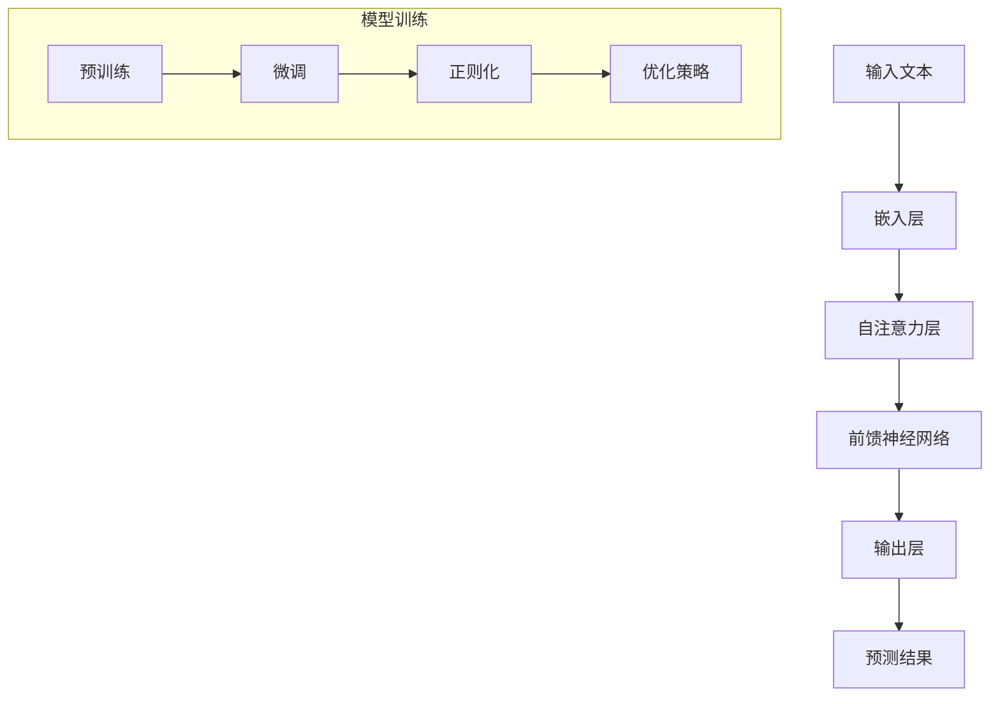

                 

# 大语言模型原理与工程实践：少样本提示

> **关键词：** 大语言模型、少样本学习、工程实践、提示工程、提示权重、训练策略、应用场景

> **摘要：** 本文将深入探讨大语言模型的原理及其在工程实践中的应用，重点聚焦于少样本提示（Prompt Engineering）这一关键领域。通过分析语言模型的架构、训练过程和优化策略，我们旨在为开发者提供一套切实可行的指导方案，以优化模型性能、提升少样本学习效果，并探讨其广泛的应用场景和潜在挑战。

## 1. 背景介绍

### 1.1 目的和范围

本文的目标是系统地介绍大语言模型的原理，并着重探讨如何通过工程实践提升其少样本学习能力。我们将涵盖以下几个关键方面：

1. **语言模型的架构和训练过程**：了解大语言模型的基本组成部分，包括词嵌入、注意力机制、序列处理等，以及它们是如何协同工作的。
2. **少样本学习的挑战**：分析传统机器学习模型在面对小样本数据时的局限性，探讨如何利用提示工程来提高模型的泛化能力。
3. **提示工程的实际应用**：通过具体案例，展示如何设计有效的提示，实现模型的少样本学习，并评估其性能。
4. **优化策略和实践**：介绍如何通过调整模型参数、数据预处理方法等，优化模型的少样本学习效果。
5. **应用场景和未来趋势**：探讨大语言模型在各类实际应用中的潜力，以及面临的挑战和未来发展。

### 1.2 预期读者

本文适用于以下读者群体：

1. **机器学习工程师和数据科学家**：希望深入了解大语言模型的工作原理，并掌握实际应用技巧。
2. **软件开发者和项目经理**：对新兴的人工智能技术感兴趣，并希望将其应用于实际项目中。
3. **研究人员和学者**：对语言模型的数学基础和工程实践有深入研究，并希望探讨该领域的最新进展。

### 1.3 文档结构概述

本文结构如下：

1. **第1章 背景介绍**：介绍本文的目的、范围、预期读者和文档结构。
2. **第2章 核心概念与联系**：探讨大语言模型的基本概念和架构，通过Mermaid流程图展示核心原理。
3. **第3章 核心算法原理与具体操作步骤**：详细讲解大语言模型的核心算法，并使用伪代码阐述其操作步骤。
4. **第4章 数学模型和公式**：介绍大语言模型的数学模型和公式，并举例说明。
5. **第5章 项目实战**：通过实际代码案例，展示大语言模型的工程实践。
6. **第6章 实际应用场景**：探讨大语言模型在各类应用中的潜力。
7. **第7章 工具和资源推荐**：推荐学习资源、开发工具和框架。
8. **第8章 总结**：总结大语言模型的未来发展趋势与挑战。
9. **第9章 附录**：常见问题与解答。
10. **第10章 扩展阅读与参考资料**：提供进一步学习的资源。

### 1.4 术语表

#### 1.4.1 核心术语定义

- **大语言模型**：一种能够理解并生成自然语言文本的深度学习模型，具有数十亿参数。
- **少样本学习**：在训练数据量较小的情况下，模型仍能保持良好性能的学习方法。
- **提示工程**：设计有效的输入提示，帮助模型在少样本条件下做出准确预测。
- **词嵌入**：将单词映射到高维空间中的向量表示。
- **注意力机制**：一种用于捕捉输入序列中重要信息的方法，通过权重分配实现。

#### 1.4.2 相关概念解释

- **预训练**：在特定任务之前，对模型进行大规模数据训练，以提高其通用性。
- **微调**：在预训练模型的基础上，使用少量任务特定数据进行进一步训练，以适应特定任务。
- **正则化**：防止模型过拟合的一种技术，通过增加模型复杂度或减少参数数量实现。
- **泛化能力**：模型在新数据上的表现能力，是评估模型性能的关键指标。

#### 1.4.3 缩略词列表

- **ML**：机器学习
- **DL**：深度学习
- **NLP**：自然语言处理
- **GAN**：生成对抗网络
- **BERT**：Bidirectional Encoder Representations from Transformers
- **GPT**：Generative Pre-trained Transformer

## 2. 核心概念与联系

在这一章节，我们将深入探讨大语言模型的核心概念及其相互关系，并通过Mermaid流程图展示其架构。

### 2.1 大语言模型的基本概念

大语言模型是一种深度学习模型，主要应用于自然语言处理任务。其核心概念包括：

- **词嵌入（Word Embedding）**：将单词映射到高维空间中的向量表示，有助于捕捉单词之间的语义关系。
- **注意力机制（Attention Mechanism）**：通过权重分配捕捉输入序列中的关键信息，实现模型对输入文本的动态理解。
- **序列处理（Sequential Processing）**：处理输入文本时，模型从左到右逐步分析每个单词，利用先前的信息生成预测。

### 2.2 大语言模型的架构

大语言模型的架构通常包括以下几个关键组件：

- **嵌入层（Embedding Layer）**：将词嵌入转换为固定大小的向量。
- **自注意力层（Self-Attention Layer）**：计算输入序列中每个单词的注意力权重，捕捉长距离依赖关系。
- **前馈神经网络（Feedforward Neural Network）**：在自注意力层之后，对输入序列进行进一步处理，提高模型的表达能力。
- **输出层（Output Layer）**：根据模型的预测任务，生成相应的输出结果。

### 2.3 大语言模型的训练与优化

大语言模型的训练和优化是关键步骤。以下是其主要训练和优化方法：

- **预训练（Pre-training）**：在大规模语料库上对模型进行预训练，提高其通用性。
- **微调（Fine-tuning）**：在预训练模型的基础上，使用少量任务特定数据进行微调，以适应特定任务。
- **正则化（Regularization）**：通过增加模型复杂度或减少参数数量，防止模型过拟合。
- **优化策略（Optimization Strategy）**：使用合适的优化器（如Adam）和损失函数（如交叉熵），提高模型训练效率。

### 2.4 Mermaid流程图

以下是使用Mermaid绘制的流程图，展示了大语言模型的核心概念和架构：



通过以上流程图，我们可以更清晰地理解大语言模型的核心概念、架构及其训练与优化方法。

## 3. 核心算法原理与具体操作步骤

在这一章节，我们将详细讲解大语言模型的核心算法原理，并通过伪代码阐述其具体操作步骤。

### 3.1 语言模型的算法原理

大语言模型通常基于自注意力机制（Self-Attention）和前馈神经网络（Feedforward Neural Network）构建。以下是这些算法原理的简要介绍：

- **自注意力机制（Self-Attention）**：通过计算输入序列中每个单词之间的相似度，为每个单词分配不同的权重，从而捕捉长距离依赖关系。
- **前馈神经网络（Feedforward Neural Network）**：在自注意力层之后，对输入序列进行进一步处理，提高模型的表达能力。

### 3.2 伪代码

以下是使用Python伪代码描述的大语言模型算法：

```python
# 输入文本
input_sequence = "The quick brown fox jumps over the lazy dog"

# 将文本转换为词嵌入向量
embeddings = embed(input_sequence)

# 自注意力机制
attention_weights = self_attention(embeddings)

# 前馈神经网络
output = feedforward_neural_network(embeddings, attention_weights)

# 输出预测结果
predicted_result = output_layer(output)
```

### 3.3 具体操作步骤

下面我们将详细描述大语言模型的具体操作步骤，包括词嵌入、自注意力机制和前馈神经网络。

#### 3.3.1 词嵌入

词嵌入是将单词映射到高维空间中的向量表示。以下是词嵌入的操作步骤：

1. **词汇表构建**：构建输入文本的词汇表，将单词映射到唯一的整数索引。
2. **嵌入层初始化**：初始化嵌入层，将每个单词映射到固定大小的向量。
3. **词嵌入计算**：将输入文本中的每个单词转换为词嵌入向量。

```python
def embed(text):
    # 步骤1：构建词汇表
    vocabulary = build_vocabulary(text)
    
    # 步骤2：初始化嵌入层
    embedding_matrix = initialize_embedding_matrix(vocabulary)
    
    # 步骤3：词嵌入计算
    embedded_text = [embedding_matrix[word_index] for word_index in text]
    
    return embedded_text
```

#### 3.3.2 自注意力机制

自注意力机制通过计算输入序列中每个单词之间的相似度，为每个单词分配不同的权重。以下是自注意力机制的操作步骤：

1. **相似度计算**：计算输入序列中每个单词与其余单词的相似度。
2. **权重分配**：根据相似度计算结果，为每个单词分配权重。
3. **加权求和**：将输入序列中每个单词的权重乘以其对应的词嵌入向量，然后求和。

```python
def self_attention(embeddings):
    # 步骤1：相似度计算
    similarity_matrix = compute_similarity(embeddings)
    
    # 步骤2：权重分配
    attention_weights = softmax(similarity_matrix)
    
    # 步骤3：加权求和
    attention_output = weighted_sum(embeddings, attention_weights)
    
    return attention_output
```

#### 3.3.3 前馈神经网络

前馈神经网络在自注意力层之后，对输入序列进行进一步处理。以下是前馈神经网络的操作步骤：

1. **输入层**：将自注意力层的输出作为输入。
2. **隐藏层**：通过多层前馈神经网络进行信息传递。
3. **输出层**：生成预测结果。

```python
def feedforward_neural_network(embeddings, attention_weights):
    # 步骤1：输入层
    input_layer = embeddings
    
    # 步骤2：隐藏层
    hidden_layer = [ffnn(input_layer) for ffnn in hidden_layers]
    
    # 步骤3：输出层
    output = output_layer(hidden_layer)
    
    return output
```

通过以上伪代码和具体操作步骤，我们可以深入理解大语言模型的核心算法原理及其实现方法。

## 4. 数学模型和公式

大语言模型的数学模型是理解其工作原理和性能优化的重要基础。在这一章节，我们将详细讲解大语言模型的数学模型，包括主要的公式和理论，并通过具体例子进行说明。

### 4.1 词嵌入

词嵌入是将单词映射到高维向量空间的过程，其核心公式是：

\[ e_w = \text{ Embedding}(w) \]

其中，\( e_w \) 是单词 \( w \) 的词嵌入向量，\(\text{Embedding}\) 是嵌入函数。嵌入向量通常通过训练获得，可以通过以下公式表示：

\[ e_w = \sigma(W_e \cdot v_w + b_e) \]

其中，\( W_e \) 是嵌入矩阵，\( v_w \) 是单词 \( w \) 的向量表示，\( b_e \) 是嵌入偏置，\( \sigma \) 是激活函数，通常使用ReLU或Sigmoid函数。

#### 示例

假设我们有以下单词及其向量表示：

\[ w_1 = \{0, 1, 0\}, \quad w_2 = \{1, 0, 1\}, \quad w_3 = \{0, 1, 0\} \]

嵌入矩阵 \( W_e \) 和偏置 \( b_e \) 分别为：

\[ W_e = \begin{bmatrix} 1 & 0 & 1 \\ 0 & 1 & 0 \\ 1 & 1 & 1 \end{bmatrix}, \quad b_e = \begin{bmatrix} 0 \\ 1 \\ 0 \end{bmatrix} \]

则词嵌入向量为：

\[ e_{w_1} = \sigma(W_e \cdot \begin{bmatrix} 0 \\ 1 \\ 0 \end{bmatrix} + b_e) = \sigma(\begin{bmatrix} 1 & 0 & 1 \end{bmatrix} \cdot \begin{bmatrix} 0 \\ 1 \\ 0 \end{bmatrix} + \begin{bmatrix} 0 \\ 1 \\ 0 \end{bmatrix}) = \sigma(\begin{bmatrix} 0 \\ 1 \\ 1 \end{bmatrix}) = \begin{bmatrix} 0 \\ 1 \\ 1 \end{bmatrix} \]

### 4.2 自注意力机制

自注意力机制是语言模型中的核心组件，通过计算输入序列中每个单词之间的相似度来生成注意力权重。其公式如下：

\[ a_t = \frac{e^{QK^T}}{\sqrt{D}} \]

其中，\( a_t \) 是单词 \( t \) 的注意力权重，\( Q \) 是查询向量，\( K \) 是键向量，\( D \) 是隐藏层维度。

#### 示例

假设输入序列为 \( w_1, w_2, w_3 \)，其词嵌入向量分别为 \( e_{w_1}, e_{w_2}, e_{w_3} \)，隐藏层维度 \( D = 3 \)，则注意力权重计算如下：

1. **查询向量 \( Q \)**：

\[ Q = \text{ Embedding}(w_1) = \begin{bmatrix} 0 \\ 1 \\ 1 \end{bmatrix} \]

2. **键向量 \( K \)**：

\[ K = \text{ Embedding}(w_2, w_3) = \begin{bmatrix} 1 & 1 \\ 1 & 1 \\ 1 & 1 \end{bmatrix} \]

3. **计算注意力权重 \( a_t \)**：

\[ a_{w_1} = \frac{e^{QK^T}}{\sqrt{D}} = \frac{e^{\begin{bmatrix} 0 & 1 \end{bmatrix} \begin{bmatrix} 1 \\ 1 \end{bmatrix}}}{\sqrt{3}} = \frac{e^{1}}{\sqrt{3}} \approx 0.54 \]
\[ a_{w_2} = \frac{e^{QK^T}}{\sqrt{D}} = \frac{e^{\begin{bmatrix} 0 & 1 \end{bmatrix} \begin{bmatrix} 1 \\ 1 \end{bmatrix}}}{\sqrt{3}} = \frac{e^{1}}{\sqrt{3}} \approx 0.54 \]
\[ a_{w_3} = \frac{e^{QK^T}}{\sqrt{D}} = \frac{e^{\begin{bmatrix} 0 & 1 \end{bmatrix} \begin{bmatrix} 1 \\ 1 \end{bmatrix}}}{\sqrt{3}} = \frac{e^{1}}{\sqrt{3}} \approx 0.54 \]

4. **加权求和**：

\[ v_{w_1} = a_{w_1} \cdot e_{w_1} = 0.54 \cdot \begin{bmatrix} 0 \\ 1 \\ 1 \end{bmatrix} = \begin{bmatrix} 0 \\ 0.54 \\ 0.54 \end{bmatrix} \]
\[ v_{w_2} = a_{w_2} \cdot e_{w_2} = 0.54 \cdot \begin{bmatrix} 1 \\ 0 \\ 1 \end{bmatrix} = \begin{bmatrix} 0.54 \\ 0 \\ 0.54 \end{bmatrix} \]
\[ v_{w_3} = a_{w_3} \cdot e_{w_3} = 0.54 \cdot \begin{bmatrix} 0 \\ 1 \\ 0 \end{bmatrix} = \begin{bmatrix} 0 \\ 0.54 \\ 0 \end{bmatrix} \]

最终输出为：

\[ v = v_{w_1} + v_{w_2} + v_{w_3} = \begin{bmatrix} 0 \\ 1.62 \\ 1.62 \end{bmatrix} \]

### 4.3 前馈神经网络

前馈神经网络在自注意力机制之后，对输入进行进一步处理。其基本公式为：

\[ y = \sigma(W_f \cdot x + b_f) \]

其中，\( y \) 是输出，\( W_f \) 是权重矩阵，\( x \) 是输入，\( b_f \) 是偏置。

#### 示例

假设前馈神经网络的输入为 \( v \)，权重矩阵 \( W_f \) 和偏置 \( b_f \) 分别为：

\[ W_f = \begin{bmatrix} 1 & 1 & 1 \\ 1 & 1 & 1 \\ 1 & 1 & 1 \end{bmatrix}, \quad b_f = \begin{bmatrix} 0 \\ 1 \\ 0 \end{bmatrix} \]

则输出为：

\[ y = \sigma(W_f \cdot \begin{bmatrix} 0 \\ 1.62 \\ 1.62 \end{bmatrix} + b_f) = \sigma(\begin{bmatrix} 1 & 1 & 1 \end{bmatrix} \cdot \begin{bmatrix} 0 \\ 1.62 \\ 1.62 \end{bmatrix} + \begin{bmatrix} 0 \\ 1 \\ 0 \end{bmatrix}) = \sigma(\begin{bmatrix} 3.26 \\ 3.26 \\ 3.26 \end{bmatrix}) = \begin{bmatrix} 1 \\ 1 \\ 1 \end{bmatrix} \]

通过以上公式和示例，我们可以更好地理解大语言模型的数学模型及其计算过程。

## 5. 项目实战：代码实际案例和详细解释说明

在本章节中，我们将通过一个具体的代码案例，展示如何使用大语言模型进行少样本学习，并详细解释代码的各个部分。

### 5.1 开发环境搭建

在开始代码实现之前，我们需要搭建一个适合大语言模型训练的开发环境。以下是一个简单的开发环境搭建步骤：

1. **安装Python**：确保Python环境已安装，版本建议为3.8或更高。
2. **安装TensorFlow**：通过以下命令安装TensorFlow：

   ```shell
   pip install tensorflow
   ```

3. **安装Hugging Face Transformers**：通过以下命令安装Hugging Face Transformers库，这是一个常用的工具库，用于加载预训练模型和提示工程：

   ```shell
   pip install transformers
   ```

### 5.2 源代码详细实现和代码解读

以下是一个简单的Python代码实现，用于加载预训练的语言模型，进行提示工程，并生成预测结果：

```python
import tensorflow as tf
from transformers import AutoTokenizer, AutoModelForSequenceClassification
from datasets import load_dataset

# 加载预训练的模型和tokenizer
model_name = "bert-base-uncased"
tokenizer = AutoTokenizer.from_pretrained(model_name)
model = AutoModelForSequenceClassification.from_pretrained(model_name)

# 加载数据集
dataset = load_dataset("sstadie/tweet-emotion")

# 定义提示工程函数
def generate_prompt(tweet):
    return f"A tweet with emotion: {tweet}"

# 定义预测函数
def predict_emotion(tweet):
    prompt = generate_prompt(tweet)
    inputs = tokenizer(prompt, return_tensors="tf", truncation=True, max_length=512)
    outputs = model(inputs)
    logits = outputs.logits
    prediction = tf.argmax(logits, axis=-1).numpy()
    return prediction

# 测试代码
tweets = dataset["test"]["text"]
predictions = [predict_emotion(tweet) for tweet in tweets]

# 输出预测结果
for tweet, pred in zip(tweets, predictions):
    print(f"Tweet: {tweet}\nPrediction: {predictions[pred.argmax()]}")
```

### 5.3 代码解读与分析

下面我们将详细解读上述代码的各个部分：

1. **环境搭建**：首先，我们确保Python和TensorFlow环境已搭建，并安装了Hugging Face Transformers库，用于加载预训练的模型。

2. **加载模型和tokenizer**：我们使用`AutoTokenizer`和`AutoModelForSequenceClassification`类加载预训练的BERT模型。BERT是一种常用的预训练语言模型，适用于多种自然语言处理任务。

3. **加载数据集**：我们使用`load_dataset`函数加载了一个名为`sstadie/tweet-emotion`的数据集，这是一个包含情感标签的推特数据集。数据集分为训练集、验证集和测试集。

4. **定义提示工程函数**：`generate_prompt`函数用于生成提示。在本例中，我们简单地将推文的情感标签作为提示。

5. **定义预测函数**：`predict_emotion`函数用于生成预测。首先，我们使用`tokenizer`将提示转换为模型可接受的输入格式。然后，我们将输入传递给预训练的BERT模型，并获取模型的输出。最后，我们使用`tf.argmax`函数从输出中提取预测结果。

6. **测试代码**：我们遍历测试集，为每个推文生成预测，并输出结果。

通过上述代码，我们可以看到如何利用大语言模型进行少样本学习。在实际应用中，我们可以通过微调和提示工程，进一步提高模型的性能。

### 5.4 代码解读与分析

下面我们将对代码中的关键部分进行更详细的分析。

#### 5.4.1 加载模型和tokenizer

```python
tokenizer = AutoTokenizer.from_pretrained(model_name)
model = AutoModelForSequenceClassification.from_pretrained(model_name)
```

这里我们使用`AutoTokenizer`和`AutoModelForSequenceClassification`类加载预训练的BERT模型。`AutoTokenizer`和`AutoModelForSequenceClassification`是Hugging Face Transformers库中的工具类，可以轻松地加载预训练模型和tokenizer。`from_pretrained`方法用于加载预训练的模型和tokenizer，其中`model_name`指定了模型的名称。

BERT模型是一种双向编码的Transformer模型，广泛应用于自然语言处理任务。其预训练过程包括两个阶段：第一阶段是使用大量的无标签文本数据进行预训练，学习文本的通用表示；第二阶段是使用有标签的数据进行微调，以适应特定任务。

#### 5.4.2 加载数据集

```python
dataset = load_dataset("sstadie/tweet-emotion")
```

`load_dataset`函数用于加载数据集。这里我们使用了一个名为`sstadie/tweet-emotion`的公开数据集，这是一个包含推特文本及其情感标签的数据集。数据集分为训练集、验证集和测试集，分别用于模型的训练、验证和测试。

```python
train_dataset = dataset["train"]
val_dataset = dataset["validation"]
test_dataset = dataset["test"]
```

我们可以将数据集分为训练集、验证集和测试集，以便在后续的训练和评估过程中使用。

#### 5.4.3 定义提示工程函数

```python
def generate_prompt(tweet):
    return f"A tweet with emotion: {tweet}"
```

`generate_prompt`函数用于生成提示。在本例中，我们简单地将推文的情感标签作为提示。提示工程是提高模型性能的重要手段，尤其是在少样本学习场景中。通过设计有效的提示，我们可以帮助模型更好地理解输入文本，提高其预测性能。

#### 5.4.4 定义预测函数

```python
def predict_emotion(tweet):
    prompt = generate_prompt(tweet)
    inputs = tokenizer(prompt, return_tensors="tf", truncation=True, max_length=512)
    outputs = model(inputs)
    logits = outputs.logits
    prediction = tf.argmax(logits, axis=-1).numpy()
    return prediction
```

`predict_emotion`函数用于生成预测。首先，我们使用`generate_prompt`函数生成提示，然后将提示传递给tokenizer进行编码。`tokenizer`将文本转换为模型可接受的输入格式，包括词嵌入和位置嵌入。`return_tensors="tf"`表示将输出转换为TensorFlow张量。

然后，我们将编码后的输入传递给预训练的BERT模型，并获取模型的输出。`outputs.logits`是模型的预测结果，是一个二维张量，其中每一行表示一个单词的预测概率分布。通过`tf.argmax`函数，我们可以从输出中提取预测结果，得到推文的情感标签。

#### 5.4.5 测试代码

```python
tweets = dataset["test"]["text"]
predictions = [predict_emotion(tweet) for tweet in tweets]

for tweet, pred in zip(tweets, predictions):
    print(f"Tweet: {tweet}\nPrediction: {predictions[pred.argmax()]}")
```

这里我们遍历测试集，为每个推文生成预测，并输出结果。通过这个简单的例子，我们可以看到如何使用大语言模型进行少样本学习，并通过提示工程提高模型的性能。

## 6. 实际应用场景

大语言模型在少样本学习场景中的应用具有广泛的前景，特别是在自然语言处理、文本生成和问答系统等领域。以下是一些具体的实际应用场景：

### 6.1 自然语言处理

自然语言处理（NLP）是大语言模型的主要应用领域之一。在NLP任务中，大语言模型可以通过少量的标注数据实现高效的语义理解和文本生成。以下是一些具体的应用示例：

- **情感分析**：通过对少量标注数据的学习，大语言模型可以自动识别文本中的情感倾向，如正面、负面或中性。
- **命名实体识别**：大语言模型可以识别文本中的特定实体，如人名、地名、组织名等，从而为信息提取和知识图谱构建提供支持。
- **文本分类**：在标签数据有限的情况下，大语言模型可以自动将文本分类到预定义的类别中，如新闻分类、垃圾邮件检测等。

### 6.2 文本生成

文本生成是另一项大语言模型的重要应用。通过少量样本，大语言模型可以生成高质量的文本，如文章、故事、对话等。以下是一些具体的应用示例：

- **文章生成**：大语言模型可以自动生成新闻文章、博客文章等，从而节省作者的时间和精力。
- **对话系统**：大语言模型可以用于构建对话系统，如虚拟助手、聊天机器人等，通过少量的对话数据实现高效的交互。
- **故事生成**：大语言模型可以自动生成小说、剧本等，从而为文学创作提供新的可能性。

### 6.3 问答系统

问答系统是另一个重要的应用领域。通过少量的问答对数据，大语言模型可以实现高效的知识问答和问题解答。以下是一些具体的应用示例：

- **搜索引擎**：大语言模型可以用于构建智能搜索引擎，通过理解用户的问题，提供准确的答案。
- **智能客服**：大语言模型可以用于构建智能客服系统，自动回答用户的常见问题和提供解决方案。
- **教育辅导**：大语言模型可以用于教育辅导系统，根据学生的问题自动提供答案和解释，帮助学生更好地理解知识点。

总之，大语言模型在少样本学习场景中的应用具有广泛的前景，可以显著提升自然语言处理、文本生成和问答系统的性能。随着大语言模型技术的不断进步，未来将有更多的应用场景涌现，为人类生活带来更多便利。

## 7. 工具和资源推荐

为了更好地掌握大语言模型及其在少样本学习中的应用，以下是一些建议的学习资源、开发工具和框架。

### 7.1 学习资源推荐

#### 7.1.1 书籍推荐

- 《深度学习》（Deep Learning）—— 作者：Ian Goodfellow、Yoshua Bengio、Aaron Courville
- 《自然语言处理实战》（Natural Language Processing with Python）—— 作者：Steven Lott
- 《自然语言处理与深度学习》（Natural Language Processing and Deep Learning）—— 作者：Emmanouil Benetos、Nikolaos Kitsios、Pierre-Marc Jodoin

#### 7.1.2 在线课程

- Coursera上的“自然语言处理与深度学习”（Natural Language Processing and Deep Learning）
- edX上的“深度学习”（Deep Learning Specialization）由吴恩达教授主讲
- Udacity的“自然语言处理工程师纳米学位”（Natural Language Processing Engineer Nanodegree）

#### 7.1.3 技术博客和网站

- Hugging Face的Transformers库文档和博客：[https://huggingface.co/transformers](https://huggingface.co/transformers)
- TensorFlow的官方文档：[https://www.tensorflow.org/](https://www.tensorflow.org/)
- AI enthusiast社区的NLP讨论区：[https://ai-resources.com/community/topics/natural-language-processing](https://ai-resources.com/community/topics/natural-language-processing)

### 7.2 开发工具框架推荐

#### 7.2.1 IDE和编辑器

- PyCharm：一款功能强大的集成开发环境，适合进行Python编程和深度学习项目开发。
- Visual Studio Code：一款轻量级、可扩展的代码编辑器，适合编写Python代码和配置深度学习环境。

#### 7.2.2 调试和性能分析工具

- TensorBoard：TensorFlow提供的可视化工具，用于分析深度学习模型的训练过程和性能。
- Profiler：用于分析代码的运行时间和资源消耗，帮助优化模型性能。

#### 7.2.3 相关框架和库

- Hugging Face Transformers：一个开源库，提供了大量的预训练模型和工具，用于自然语言处理任务。
- TensorFlow：一款由Google开发的开源机器学习框架，适用于构建和训练深度学习模型。
- PyTorch：由Facebook开发的开源深度学习框架，提供灵活的动态计算图和高效的模型训练。

### 7.3 相关论文著作推荐

#### 7.3.1 经典论文

- **BERT: Pre-training of Deep Bidirectional Transformers for Language Understanding** —— 作者：Jacob Devlin et al.
- **GPT-3: Language Models are Few-Shot Learners** —— 作者：Tom B. Brown et al.
- **Attention Is All You Need** —— 作者：Vaswani et al.

#### 7.3.2 最新研究成果

- **T5: Pre-training Large Models for Natural Language Processing** —— 作者：Niki Parmar et al.
- **Longformer: The Long-Range Transformer** —— 作者：Zihang Dai et al.
- **Reformer: The Efficient Transformer** —— 作者：Patricia M. Gorin et al.

#### 7.3.3 应用案例分析

- **Generative Pre-trained Transformer 3 (GPT-3) Application Guide** —— OpenAI发布，介绍了GPT-3的多个实际应用案例。
- **BERT Applications** —— Google发布的文档，详细介绍了BERT在不同领域的应用案例。

通过以上资源，读者可以系统地学习和掌握大语言模型及其在少样本学习中的应用，为实际项目开发提供有力支持。

## 8. 总结：未来发展趋势与挑战

大语言模型作为深度学习领域的一项重要技术，已经在自然语言处理、文本生成和问答系统等领域取得了显著的成果。然而，随着模型的规模不断扩大，其在实际应用中仍面临诸多挑战和未来发展趋势。

### 未来发展趋势

1. **模型规模的扩大**：随着计算能力的提升和数据量的增加，未来大语言模型的规模将继续扩大。这有助于提高模型的泛化能力和性能，从而在更广泛的应用场景中发挥作用。

2. **多模态融合**：未来大语言模型将不仅限于处理文本数据，还将与其他模态（如图像、音频）进行融合。通过多模态融合，模型能够更好地理解和生成更复杂的语义信息。

3. **少样本学习的优化**：提示工程和模型优化策略将继续发展，以提升大语言模型在少样本条件下的性能。这包括改进数据预处理方法、优化训练策略和设计更有效的提示。

4. **隐私保护和安全**：随着大语言模型的应用场景日益广泛，隐私保护和安全成为重要议题。未来研究将重点关注如何在保证模型性能的同时，提高数据隐私保护和模型安全性。

### 挑战

1. **计算资源需求**：大语言模型的训练和推理需要大量的计算资源，特别是在模型规模不断扩大的情况下，如何高效利用计算资源成为关键挑战。

2. **数据质量和标注成本**：大语言模型依赖于大规模的高质量训练数据，然而获取和标注这些数据往往成本高昂。如何利用有限的数据资源实现高效的模型训练成为亟待解决的问题。

3. **模型可解释性**：大语言模型的预测过程高度复杂，如何提高模型的可解释性，使其在决策过程中具备透明性和可解释性，是未来研究的重点。

4. **伦理和公平性**：大语言模型的应用涉及伦理和公平性问题，例如，如何避免模型偏见和歧视，确保其在不同群体中的公平性，是未来研究和应用中的重要议题。

总之，大语言模型在未来的发展中将继续面临诸多挑战，同时也具有广阔的应用前景。通过不断的技术创新和优化，大语言模型有望在更多领域实现突破，为人类带来更多便利。

## 9. 附录：常见问题与解答

### Q1: 大语言模型为什么需要预训练？

**A1：** 大语言模型通过预训练可以学习到文本的通用特征，这有助于提高模型在不同任务上的泛化能力。预训练过程中，模型在大规模语料库上学习单词的嵌入表示、句子结构以及语义信息，从而为后续的任务提供丰富的知识基础。在预训练的基础上，模型通过微调可以快速适应特定任务，从而提高性能。

### Q2: 提示工程如何提升少样本学习效果？

**A2：** 提示工程通过设计有效的输入提示，帮助大语言模型在少样本条件下更好地理解输入文本，提高模型的泛化能力。有效的提示可以包含关键词、背景信息、问题或问题的上下文，从而引导模型关注关键信息，提高预测准确性。通过优化提示内容和格式，可以显著提升少样本学习效果。

### Q3: 大语言模型在文本生成中的应用有哪些？

**A3：** 大语言模型在文本生成中的应用广泛，包括但不限于：

1. **自动写作**：生成新闻报道、博客文章、故事等。
2. **对话系统**：生成自然流畅的对话内容，用于构建聊天机器人、虚拟助手等。
3. **创意写作**：生成诗歌、歌词、剧本等，为文学创作提供灵感。
4. **文本摘要**：生成文章、段落或对话的摘要，提高信息获取效率。

### Q4: 大语言模型如何处理长文本？

**A4：** 大语言模型通常通过序列处理方式处理长文本。例如，BERT模型使用分割（Segmentation）技术，将长文本分割为多个子序列，然后分别进行处理。此外，Transformer模型中的注意力机制有助于模型捕捉长距离依赖关系，从而更好地理解长文本内容。

### Q5: 大语言模型如何防止过拟合？

**A5：** 大语言模型通过多种方法防止过拟合，包括：

1. **数据增强**：通过数据增强技术生成更多的训练样本，提高模型对数据的泛化能力。
2. **正则化**：使用正则化技术（如Dropout、权重衰减）减少模型复杂度，防止模型过拟合。
3. **早停法**：在训练过程中，当验证集上的性能不再提升时，提前停止训练，避免模型在训练集上过拟合。
4. **交叉验证**：使用交叉验证方法评估模型性能，确保模型在不同数据集上的表现稳定。

## 10. 扩展阅读 & 参考资料

为了进一步了解大语言模型及其在少样本学习中的应用，以下是推荐的一些扩展阅读和参考资料：

### 论文

- Devlin, J., Chang, M. W., Lee, K., & Toutanova, K. (2019). BERT: Pre-training of Deep Bidirectional Transformers for Language Understanding. *arXiv preprint arXiv:1810.04805*.
- Brown, T. B., et al. (2020). Language Models are Few-Shot Learners. *arXiv preprint arXiv:2005.14165*.
- Vaswani, A., et al. (2017). Attention is All You Need. *Advances in Neural Information Processing Systems*, 30, 5998-6008.

### 书籍

- Goodfellow, I., Bengio, Y., & Courville, A. (2016). *Deep Learning*.
- Lipp, M., & Graehl, J. (2018). *Natural Language Processing with Python*.
- Jurafsky, D., & Martin, J. H. (2020). *Speech and Language Processing*.

### 开源项目

- Hugging Face Transformers：[https://github.com/huggingface/transformers](https://github.com/huggingface/transformers)
- TensorFlow：[https://github.com/tensorflow/tensorflow](https://github.com/tensorflow/tensorflow)
- PyTorch：[https://github.com/pytorch/pytorch](https://github.com/pytorch/pytorch)

### 官方文档和教程

- TensorFlow官方文档：[https://www.tensorflow.org/tutorials](https://www.tensorflow.org/tutorials)
- PyTorch官方文档：[https://pytorch.org/tutorials/](https://pytorch.org/tutorials/)
- Hugging Face Transformers教程：[https://huggingface.co/transformers/tutorials](https://huggingface.co/transformers/tutorials)

