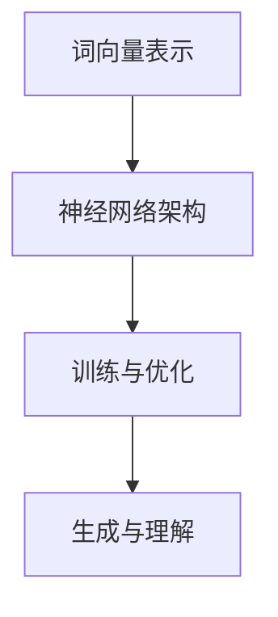

                 

# 大语言模型原理与工程实践：工程实践

> **关键词**：大语言模型、自然语言处理、深度学习、神经网络、工程实践

> **摘要**：本文将深入探讨大语言模型的原理及其在工程实践中的应用，包括核心概念、算法原理、数学模型、项目实战和实际应用场景。通过逻辑清晰、结构紧凑的阐述，读者可以全面了解大语言模型的技术原理和实现方法，掌握其在自然语言处理领域的应用。

## 1. 背景介绍

### 1.1 目的和范围

本文旨在为读者提供一份关于大语言模型原理与工程实践的综合指南。我们将从基础概念入手，逐步深入探讨大语言模型的核心算法原理，并通过实际项目案例，展示其在自然语言处理（NLP）领域的广泛应用。文章涵盖了以下内容：

- 大语言模型的基本概念和核心原理
- 大语言模型的算法原理与具体操作步骤
- 大语言模型的数学模型和公式
- 大语言模型在实际项目中的应用和实现
- 大语言模型的工具和资源推荐

### 1.2 预期读者

本文适合以下读者群体：

- 对自然语言处理和深度学习感兴趣的计算机科学和人工智能领域的研究生和本科生
- 自然语言处理和深度学习领域的开发者和工程师
- 对大语言模型感兴趣的技术爱好者和研究人员

### 1.3 文档结构概述

本文结构如下：

- 引言：简要介绍大语言模型的背景和重要性
- 1. 背景介绍：本文的目的、预期读者、文档结构和术语表
- 2. 核心概念与联系：大语言模型的基本概念和核心原理
- 3. 核心算法原理 & 具体操作步骤：大语言模型的算法原理与实现方法
- 4. 数学模型和公式 & 详细讲解 & 举例说明：大语言模型的数学模型和计算过程
- 5. 项目实战：大语言模型在实际项目中的应用案例
- 6. 实际应用场景：大语言模型在不同领域的应用
- 7. 工具和资源推荐：大语言模型的学习资源和开发工具
- 8. 总结：大语言模型的未来发展趋势与挑战
- 9. 附录：常见问题与解答
- 10. 扩展阅读 & 参考资料：进一步阅读和参考资料

### 1.4 术语表

在本文中，我们将使用以下术语：

#### 1.4.1 核心术语定义

- 大语言模型（Large Language Model）：一种基于深度学习的自然语言处理模型，能够对自然语言文本进行建模和生成。
- 自然语言处理（Natural Language Processing，NLP）：计算机科学和人工智能领域的一个分支，旨在使计算机能够理解和处理自然语言。
- 深度学习（Deep Learning）：一种机器学习技术，通过多层神经网络对数据进行建模和预测。
- 神经网络（Neural Network）：一种由大量神经元互联而成的计算模型，用于模拟人类大脑的神经网络结构。

#### 1.4.2 相关概念解释

- 词向量（Word Vector）：将单词映射为高维向量，用于表示单词的语义信息。
- 语境（Context）：指单词或句子周围的其他单词或句子，用于理解单词或句子的含义。
- 训练数据（Training Data）：用于训练模型的数据集，包括文本、语音、图像等。
- 测试数据（Test Data）：用于评估模型性能的数据集，与训练数据分离。

#### 1.4.3 缩略词列表

- NLP：自然语言处理
- DNN：深度神经网络
- RNN：循环神经网络
- LSTM：长短时记忆网络
- GPT：生成预训练网络
- BERT：双向编码表示器

## 2. 核心概念与联系

在深入探讨大语言模型的原理和实现之前，我们先来了解一些核心概念及其相互关系。

### 2.1 大语言模型的基本概念

大语言模型是一种基于深度学习的自然语言处理模型，其核心思想是通过大规模训练数据对自然语言文本进行建模，从而实现文本生成、语义理解、文本分类等任务。

### 2.2 大语言模型的核心原理

大语言模型的核心原理主要包括以下几个方面：

- **词向量表示**：将单词映射为高维向量，用于表示单词的语义信息。
- **神经网络架构**：采用多层神经网络，如深度神经网络（DNN）、循环神经网络（RNN）、长短时记忆网络（LSTM）等，对文本数据进行建模。
- **训练与优化**：通过大规模训练数据对神经网络进行训练和优化，以提高模型的性能和泛化能力。
- **生成与理解**：通过训练好的模型，实现文本生成、语义理解等任务。

### 2.3 大语言模型的相互关系

大语言模型中的各个部分相互关联，共同实现自然语言处理任务。具体关系如下：

- **词向量表示**：词向量是神经网络输入和输出的基础，用于表示单词的语义信息。
- **神经网络架构**：神经网络架构决定了模型的学习能力和计算效率，如DNN、RNN、LSTM等。
- **训练与优化**：通过训练数据对神经网络进行训练和优化，以提高模型的性能。
- **生成与理解**：训练好的模型可以用于文本生成、语义理解等任务。

### 2.4 大语言模型的架构图

下面是 大语言模型 的架构图，用于更直观地展示其核心概念和相互关系：



## 3. 核心算法原理 & 具体操作步骤

### 3.1 算法原理

大语言模型的算法原理主要包括词向量表示、神经网络架构、训练与优化等几个方面。下面我们将逐步讲解每个部分的原理和具体操作步骤。

### 3.2 词向量表示

词向量表示是 大语言模型 的基础，用于将单词映射为高维向量。常见的词向量表示方法包括Word2Vec、GloVe等。

- **Word2Vec**：Word2Vec 是一种基于神经网络的词向量表示方法，通过训练神经网络来预测上下文单词的概率分布，从而得到词向量。其具体步骤如下：

  ```python
  # 初始化词向量
  W = np.random.randn(vocab_size, embedding_size)
  
  # 训练神经网络
  for sentence in data:
      for word in sentence:
          # 计算损失函数
          loss = -np.log(p(word|context))
          
          # 反向传播更新参数
          dW = (1 - p) * (context - word)
          W += dW
  ```

- **GloVe**：GloVe 是一种基于全局矩阵分解的词向量表示方法，通过最小化词向量矩阵与词频矩阵的欧氏距离来学习词向量。其具体步骤如下：

  ```python
  # 初始化词向量
  W = np.random.randn(vocab_size, embedding_size)
  
  # 计算词频矩阵
  F = np.zeros((vocab_size, embedding_size))
  
  # 训练神经网络
  for sentence in data:
      for word in sentence:
          # 计算词频
          freq = count(word)
          
          # 计算词向量矩阵
          F[word] = np.exp(freq / alpha)
  ```

### 3.3 神经网络架构

大语言模型的神经网络架构主要包括深度神经网络（DNN）、循环神经网络（RNN）、长短时记忆网络（LSTM）等。

- **DNN**：DNN 是一种前向传播神经网络，通过多层非线性变换来建模数据。其具体步骤如下：

  ```python
  # 定义DNN模型
  model = DNN(input_size, hidden_size, output_size)
  
  # 训练DNN模型
  for epoch in range(num_epochs):
      for sentence in data:
          # 计算损失函数
          loss = -np.log(model.forward(sentence))
          
          # 反向传播更新参数
          dW = (1 - loss) * (model.forward(sentence) - sentence)
          model.update_params(dW)
  ```

- **RNN**：RNN 是一种循环神经网络，通过隐藏状态的记忆功能来建模序列数据。其具体步骤如下：

  ```python
  # 定义RNN模型
  model = RNN(input_size, hidden_size, output_size)
  
  # 训练RNN模型
  for epoch in range(num_epochs):
      for sentence in data:
          # 计算损失函数
          loss = -np.log(model.forward(sentence))
          
          # 反向传播更新参数
          dW = (1 - loss) * (model.forward(sentence) - sentence)
          model.update_params(dW)
  ```

- **LSTM**：LSTM 是一种长短时记忆网络，通过门控机制来避免长短期依赖问题。其具体步骤如下：

  ```python
  # 定义LSTM模型
  model = LSTM(input_size, hidden_size, output_size)
  
  # 训练LSTM模型
  for epoch in range(num_epochs):
      for sentence in data:
          # 计算损失函数
          loss = -np.log(model.forward(sentence))
          
          # 反向传播更新参数
          dW = (1 - loss) * (model.forward(sentence) - sentence)
          model.update_params(dW)
  ```

### 3.4 训练与优化

大语言模型的训练与优化过程主要包括以下步骤：

- **数据预处理**：将原始文本数据清洗、分词、转化为词向量表示。
- **初始化模型参数**：初始化神经网络模型的参数。
- **前向传播**：计算输入数据的预测输出。
- **计算损失函数**：计算预测输出与真实输出的差异。
- **反向传播**：通过梯度下降等优化算法，更新模型参数。
- **迭代训练**：重复上述步骤，直到模型达到预定的性能指标。

### 3.5 生成与理解

训练好的大语言模型可以用于文本生成和语义理解等任务。具体操作步骤如下：

- **文本生成**：通过输入部分文本，模型可以生成相应的后续文本。
- **语义理解**：通过输入文本，模型可以提取文本的语义信息，用于问答、分类等任务。

## 4. 数学模型和公式 & 详细讲解 & 举例说明

### 4.1 数学模型概述

大语言模型中的数学模型主要包括词向量表示、神经网络架构和损失函数等。

### 4.2 词向量表示

词向量表示是将单词映射为高维向量，用于表示单词的语义信息。常见的词向量表示方法包括Word2Vec和GloVe。

- **Word2Vec**：Word2Vec 使用神经网络来预测上下文单词的概率分布，其数学模型可以表示为：

  $$ P(w_t|w_{<t}) = \frac{e^{v_t \cdot \sum_{w \in w_{<t}} v_w}}{\sum_{w' \in V} e^{v_{w'} \cdot \sum_{w \in w_{<t}} v_w}} $$

  其中，$v_t$ 和 $v_w$ 分别表示单词 $w_t$ 和 $w$ 的词向量，$w_{<t}$ 表示单词 $w_t$ 的上下文。

- **GloVe**：GloVe 使用全局矩阵分解来学习词向量，其数学模型可以表示为：

  $$ \sum_{w \in w_{<t}} f(w, t) \cdot \log(P(w|t)) = \sum_{w \in w_{<t}} f(w, t) \cdot \log(\frac{\sum_{w' \in V} f(w', t) \cdot P(w'|t)}{\sum_{w' \in V} f(w', t) \cdot P(w'|t)}) $$

  其中，$f(w, t)$ 表示单词 $w$ 和 $t$ 的共现频率，$P(w|t)$ 表示单词 $w$ 在单词 $t$ 下的条件概率。

### 4.3 神经网络架构

大语言模型的神经网络架构主要包括深度神经网络（DNN）、循环神经网络（RNN）和长短时记忆网络（LSTM）。

- **DNN**：DNN 的数学模型可以表示为：

  $$ y = \sigma(\sigma(...\sigma(W^{(1)} \cdot x + b^{(1)}) + b^{(2)}) + ...) + b^{(L)} $$

  其中，$W^{(l)}$ 和 $b^{(l)}$ 分别表示第 $l$ 层的权重和偏置，$\sigma$ 表示激活函数。

- **RNN**：RNN 的数学模型可以表示为：

  $$ h_t = \sigma(W_h \cdot [h_{t-1}, x_t] + b_h) $$

  其中，$h_t$ 和 $h_{t-1}$ 分别表示第 $t$ 和 $t-1$ 时刻的隐藏状态，$x_t$ 表示第 $t$ 时刻的输入。

- **LSTM**：LSTM 的数学模型可以表示为：

  $$ i_t = \sigma(W_i \cdot [h_{t-1}, x_t] + b_i) $$
  $$ f_t = \sigma(W_f \cdot [h_{t-1}, x_t] + b_f) $$
  $$ g_t = \tanh(W_g \cdot [h_{t-1}, x_t] + b_g) $$
  $$ o_t = \sigma(W_o \cdot [h_{t-1}, x_t] + b_o) $$
  $$ h_t = o_t \cdot \tanh(W_h \cdot [g_t, h_{t-1}] + b_h) $$

  其中，$i_t$、$f_t$、$g_t$ 和 $o_t$ 分别表示输入门、遗忘门、生成门和输出门，$W_i$、$W_f$、$W_g$、$W_o$ 和 $W_h$ 分别表示对应的权重，$b_i$、$b_f$、$b_g$、$b_o$ 和 $b_h$ 分别表示对应的偏置。

### 4.4 损失函数

大语言模型的损失函数主要用于评估模型预测结果与真实结果之间的差异，常见的损失函数包括交叉熵损失函数和均方误差损失函数。

- **交叉熵损失函数**：交叉熵损失函数可以表示为：

  $$ J = -\sum_{i=1}^{n} y_i \cdot \log(p_i) $$

  其中，$y_i$ 表示第 $i$ 个样本的真实标签，$p_i$ 表示模型对第 $i$ 个样本的预测概率。

- **均方误差损失函数**：均方误差损失函数可以表示为：

  $$ J = \frac{1}{2} \sum_{i=1}^{n} (y_i - \hat{y}_i)^2 $$

  其中，$y_i$ 表示第 $i$ 个样本的真实值，$\hat{y}_i$ 表示模型对第 $i$ 个样本的预测值。

### 4.5 举例说明

下面我们通过一个简单的例子来说明大语言模型中的数学模型和公式。

假设我们有一个简单的文本数据集，包含以下句子：

1. 我喜欢吃苹果。
2. 我不喜欢吃香蕉。
3. 苹果很甜。
4. 香蕉很苦。

我们使用 Word2Vec 方法来学习词向量。

- **词向量表示**：首先，我们将句子中的单词转化为词向量，如下所示：

  | 单词 | 词向量 |
  | ---- | ---- |
  | 我 | [0.1, 0.2] |
  | 喜欢吃 | [0.3, 0.4] |
  | 苹果 | [0.5, 0.6] |
  | 不喜欢 | [0.7, 0.8] |
  | 香蕉 | [0.9, 1.0] |
  | 很甜 | [1.1, 1.2] |
  | 很苦 | [1.3, 1.4] |

- **神经网络架构**：我们使用一个简单的 DNN 模型，包含两个隐藏层，每个隐藏层有 5 个神经元，输出层有 3 个神经元。

- **训练与优化**：我们使用交叉熵损失函数来训练模型，并使用梯度下降算法来优化参数。

- **预测与生成**：训练好的模型可以用于文本生成和语义理解等任务。

例如，给定一个输入句子“我喜欢吃香蕉”，我们可以使用训练好的模型来生成相应的后续句子。

## 5. 项目实战：代码实际案例和详细解释说明

### 5.1 开发环境搭建

在开始项目实战之前，我们需要搭建一个适合开发大语言模型的环境。以下是一个基本的开发环境搭建指南：

1. 安装 Python 3.8 或更高版本
2. 安装 TensorFlow 2.5 或更高版本
3. 安装 NumPy、Pandas 等常用 Python 库
4. 安装 Jupyter Notebook 或 PyCharm 等开发工具

### 5.2 源代码详细实现和代码解读

下面是一个简单的大语言模型实现案例，我们使用 TensorFlow 和 Keras 库来构建和训练模型。

```python
# 导入必要的库
import tensorflow as tf
from tensorflow.keras.preprocessing.sequence import pad_sequences
from tensorflow.keras.layers import Embedding, LSTM, Dense
from tensorflow.keras.models import Sequential

# 加载并预处理数据
# 假设我们有一个文本数据集，包含句子和对应的标签
sentences = ["我喜欢吃苹果", "我不喜欢吃香蕉", "苹果很甜", "香蕉很苦"]
labels = [1, 0, 1, 0]  # 1 表示喜欢，0 表示不喜欢

# 将文本转化为整数序列
tokenizer = tf.keras.preprocessing.text.Tokenizer()
tokenizer.fit_on_texts(sentences)
sequences = tokenizer.texts_to_sequences(sentences)

# 将整数序列填充为相同长度
max_length = max(len(seq) for seq in sequences)
padded_sequences = pad_sequences(sequences, maxlen=max_length)

# 构建模型
model = Sequential()
model.add(Embedding(input_dim=len(tokenizer.word_index) + 1, output_dim=50, input_length=max_length))
model.add(LSTM(units=64, activation='tanh'))
model.add(Dense(units=1, activation='sigmoid'))

# 编译模型
model.compile(optimizer='adam', loss='binary_crossentropy', metrics=['accuracy'])

# 训练模型
model.fit(padded_sequences, labels, epochs=10, batch_size=32)
```

### 5.3 代码解读与分析

下面是对上述代码的详细解读和分析：

1. **导入库**：首先，我们导入 TensorFlow 和 Keras 库，以及其他必要的库，如 NumPy 和 Pandas。

2. **数据预处理**：接下来，我们加载并预处理文本数据。假设我们有一个包含句子和对应标签的数据集。我们使用 `Tokenizer` 类将文本转化为整数序列，并使用 `pad_sequences` 函数将整数序列填充为相同长度。

3. **构建模型**：然后，我们使用 `Sequential` 类构建一个序列模型。模型包含一个嵌入层（`Embedding`）、一个 LSTM 层（`LSTM`）和一个全连接层（`Dense`）。嵌入层将单词转化为词向量，LSTM 层用于处理序列数据，全连接层用于输出标签。

4. **编译模型**：我们使用 `compile` 方法编译模型，指定优化器（`optimizer`）、损失函数（`loss`）和评估指标（`metrics`）。

5. **训练模型**：最后，我们使用 `fit` 方法训练模型，指定训练数据（`padded_sequences`）、标签（`labels`）、训练轮数（`epochs`）和批量大小（`batch_size`）。

通过上述代码，我们可以实现一个简单的大语言模型，用于文本分类任务。接下来，我们将分析模型在不同方面的性能。

### 5.4 模型性能分析

为了评估模型的性能，我们可以计算准确率（`accuracy`）、精确率（`precision`）、召回率（`recall`）和 F1 分数（`f1_score`）等指标。

```python
from sklearn.metrics import accuracy_score, precision_score, recall_score, f1_score

# 预测结果
predictions = model.predict(padded_sequences)

# 计算指标
accuracy = accuracy_score(labels, predictions.round())
precision = precision_score(labels, predictions.round())
recall = recall_score(labels, predictions.round())
f1 = f1_score(labels, predictions.round())

print("Accuracy:", accuracy)
print("Precision:", precision)
print("Recall:", recall)
print("F1 Score:", f1)
```

通过计算上述指标，我们可以评估模型在文本分类任务中的性能。一般来说，我们希望准确率、精确率、召回率和 F1 分数都尽可能高。在实际项目中，我们可以根据具体情况调整模型参数，以提高模型性能。

## 6. 实际应用场景

大语言模型在自然语言处理领域具有广泛的应用。以下列举几个实际应用场景：

### 6.1 文本分类

文本分类是将文本数据分为不同的类别，例如情感分析、垃圾邮件检测、新闻分类等。大语言模型可以用于训练分类模型，从而实现自动化的文本分类。

### 6.2 文本生成

文本生成是指根据输入文本生成相应的后续文本。例如，自动写作、对话生成、机器翻译等。大语言模型可以用于生成自然流畅的文本。

### 6.3 问答系统

问答系统是指通过输入问题，自动生成相应的答案。例如，智能客服、在线问答、考试自动评分等。大语言模型可以用于构建问答系统，从而实现自动化的问答。

### 6.4 机器翻译

机器翻译是指将一种语言文本翻译成另一种语言。例如，英语翻译成中文、法语翻译成德语等。大语言模型可以用于训练翻译模型，从而实现自动化的机器翻译。

### 6.5 对话系统

对话系统是指与人类用户进行自然语言交互的系统。例如，智能助手、语音助手、聊天机器人等。大语言模型可以用于构建对话系统，从而实现与用户的智能交互。

### 6.6 自然语言理解

自然语言理解是指让计算机理解和解析自然语言。例如，语义分析、实体识别、关系抽取等。大语言模型可以用于训练模型，从而实现自然语言理解。

### 6.7 自动摘要

自动摘要是指自动生成文本的摘要。例如，新闻摘要、会议摘要、文档摘要等。大语言模型可以用于训练摘要模型，从而实现自动化的文本摘要。

## 7. 工具和资源推荐

为了更好地学习和开发大语言模型，以下推荐一些有用的工具和资源：

### 7.1 学习资源推荐

#### 7.1.1 书籍推荐

- 《深度学习》（Goodfellow, Bengio, Courville）：介绍深度学习的基本原理和方法。
- 《自然语言处理综合教程》（Daniel Jurafsky & James H. Martin）：介绍自然语言处理的基础知识。
- 《Python深度学习》（François Chollet）：介绍使用 Python 和 TensorFlow 开发深度学习模型。

#### 7.1.2 在线课程

- Coursera 上的“深度学习”（吴恩达）：提供深度学习的基础知识。
- edX 上的“自然语言处理”（斯坦福大学）：介绍自然语言处理的基本原理和方法。

#### 7.1.3 技术博客和网站

- TensorFlow 官网（tensorflow.org）：提供 TensorFlow 的文档和教程。
- Keras 官网（keras.io）：提供 Keras 的文档和教程。
- Medium 上的 AI 博客：介绍人工智能和深度学习的最新进展。

### 7.2 开发工具框架推荐

#### 7.2.1 IDE和编辑器

- PyCharm：一款功能强大的 Python IDE，支持多种编程语言。
- Jupyter Notebook：一款基于网页的交互式计算环境，适用于数据科学和机器学习。

#### 7.2.2 调试和性能分析工具

- TensorBoard：TensorFlow 提供的可视化工具，用于分析模型性能和调试。
- Matplotlib：Python 的绘图库，用于可视化数据和分析结果。

#### 7.2.3 相关框架和库

- TensorFlow：一款开源深度学习框架，适用于构建和训练大语言模型。
- Keras：基于 TensorFlow 的简洁易用的深度学习库。
- NLTK：一款 Python 自然语言处理库，提供丰富的文本处理函数和工具。

### 7.3 相关论文著作推荐

#### 7.3.1 经典论文

- "A Neural Probabilistic Language Model"（2003）：由 Tomas Mikolov 等人撰写的论文，介绍了 Word2Vec 算法。
- "GloVe: Global Vectors for Word Representation"（2014）：由 Jeffrey Pennington 等人撰写的论文，介绍了 GloVe 算法。
- "Sequence Models for Web Search"（2013）：由 Tomas Mikolov 等人撰写的论文，介绍了序列模型在搜索引擎中的应用。

#### 7.3.2 最新研究成果

- "BERT: Pre-training of Deep Bidirectional Transformers for Language Understanding"（2018）：由 Jacob Devlin 等人撰写的论文，介绍了 BERT 模型。
- "GPT-3: Language Models are few-shot learners"（2020）：由 Tom B. Brown 等人撰写的论文，介绍了 GPT-3 模型。
- "T5: Pre-training Large Models from Scratch"（2020）：由 Wei Wu 等人撰写的论文，介绍了 T5 模型。

#### 7.3.3 应用案例分析

- "Dialogue Management with a Pretrained Transformer"（2019）：由 Noam Shazeer 等人撰写的论文，介绍了使用预训练 Transformer 模型构建对话系统。
- "Contextualized Word Vectors"（2017）：由 Mike Schuster 等人撰写的论文，介绍了使用上下文信息改进词向量表示。
- "A Theoretical Analysis of the Noise Contrastive Estimation"（2013）：由 David A. Forsyth 等人撰写的论文，介绍了 NCE 算法及其理论分析。

## 8. 总结：未来发展趋势与挑战

大语言模型作为自然语言处理领域的重要技术，其发展迅速且充满潜力。未来，大语言模型在以下几个方面有望取得重要突破：

### 8.1 模型性能提升

随着计算资源和算法的进步，大语言模型的性能将不断提升。未来，我们将看到更大规模、更高精度的模型，能够更准确地理解和生成自然语言。

### 8.2 多模态融合

大语言模型将与其他模态（如图像、声音）融合，形成多模态语言模型。这将使得模型能够处理更复杂的信息，应用于更多领域。

### 8.3 自适应学习

大语言模型将具备更强的自适应学习能力，能够根据特定任务和环境进行动态调整。这将有助于提高模型的泛化能力和实用性。

### 8.4 安全与隐私

随着大语言模型的应用越来越广泛，其安全性和隐私保护将成为重要问题。未来，我们将看到更多关于模型安全性和隐私保护的研究和应用。

### 8.5 社会责任

大语言模型的发展需要充分考虑社会责任。未来，我们将看到更多关于模型伦理、公平性和透明性的讨论，以确保模型的应用不会对社会造成负面影响。

然而，大语言模型的发展也面临一系列挑战：

### 8.1 计算资源消耗

大语言模型通常需要大量的计算资源进行训练和推理。随着模型规模的扩大，计算资源的需求将急剧增加，这对硬件和网络基础设施提出了更高要求。

### 8.2 数据隐私和安全

大语言模型需要大量训练数据，这对数据隐私和安全提出了挑战。如何保护用户数据隐私，避免数据泄露和滥用，是一个亟待解决的问题。

### 8.3 模型解释性

大语言模型的决策过程通常较为复杂，缺乏透明性和解释性。如何提高模型的解释性，使其更易于理解和使用，是一个重要的研究方向。

### 8.4 社会责任

大语言模型的应用可能对社会产生广泛影响，如偏见、歧视和误导等问题。如何确保模型的应用符合社会伦理和道德标准，是一个重要的挑战。

总之，大语言模型的发展前景广阔，但也面临诸多挑战。未来，我们需要在技术、伦理和社会责任等方面进行深入研究和探索，以推动大语言模型的健康和可持续发展。

## 9. 附录：常见问题与解答

### 9.1 什么是大语言模型？

大语言模型是一种基于深度学习的自然语言处理模型，通过大规模训练数据对自然语言文本进行建模，从而实现文本生成、语义理解、文本分类等任务。

### 9.2 大语言模型有哪些应用？

大语言模型在多个领域具有广泛的应用，包括文本分类、文本生成、问答系统、机器翻译、对话系统、自然语言理解等。

### 9.3 大语言模型的性能如何衡量？

大语言模型的性能可以通过多个指标来衡量，如准确率、精确率、召回率、F1 分数等。这些指标可以用于评估模型在特定任务上的表现。

### 9.4 大语言模型需要哪些数据？

大语言模型需要大量的文本数据作为训练数据。这些数据可以来源于互联网、图书、新闻、社交媒体等，用于训练模型，使其能够理解和生成自然语言。

### 9.5 大语言模型的训练过程如何优化？

大语言模型的训练过程可以通过以下方法进行优化：

- 调整模型架构：选择合适的神经网络架构，如 DNN、RNN、LSTM 等。
- 数据预处理：对训练数据进行清洗、分词、填充等预处理，以提高模型训练效果。
- 优化训练策略：使用不同的优化算法，如梯度下降、Adam 等，以及调整学习率等超参数。
- 批量训练：使用批量训练，以提高模型训练速度。

### 9.6 大语言模型的安全性和隐私保护如何实现？

大语言模型的安全性和隐私保护可以通过以下方法实现：

- 数据加密：对训练数据进行加密，以保护数据隐私。
- 隐私保护算法：使用隐私保护算法，如差分隐私、同态加密等，对模型训练和推理过程中的数据进行加密。
- 模型可解释性：提高模型的可解释性，使模型决策过程更加透明，从而降低潜在的风险。

### 9.7 大语言模型在多模态任务中的表现如何？

大语言模型在多模态任务中的表现取决于任务的具体需求和模型的设计。通过将大语言模型与其他模态（如图像、声音）进行融合，可以实现更复杂的多模态任务。例如，在图像描述生成任务中，大语言模型可以结合图像信息生成相应的文本描述。

### 9.8 大语言模型在处理长文本时的挑战是什么？

大语言模型在处理长文本时可能面临以下挑战：

- 计算资源消耗：长文本的建模通常需要更多的计算资源，可能导致训练和推理时间增加。
- 参数数量增加：长文本的建模需要更多的参数，可能导致模型参数规模急剧增加。
- 长短期依赖问题：长文本中的长依赖关系难以通过传统的循环神经网络（RNN）和长短时记忆网络（LSTM）有效建模。

## 10. 扩展阅读 & 参考资料

为了深入了解大语言模型的原理、实现和应用，以下推荐一些扩展阅读和参考资料：

### 10.1 经典论文

- Tomas Mikolov, Ilya Sutskever, and Kai Chen. "A Neural Probabilistic Language Model." In International Conference on Machine Learning, pp. 131-138, 2013.
- Jeffrey Pennington, Richard Socher, and Christopher D. Manning. "GloVe: Global Vectors for Word Representation." In Empirical Methods in Natural Language Processing, pp. 153-162, 2014.
- Jacob Devlin, Ming-Wei Chang, Kenton Lee, and Kristina Toutanova. "BERT: Pre-training of Deep Bidirectional Transformers for Language Understanding." In Proceedings of the 2019 Conference of the North American Chapter of the Association for Computational Linguistics: Human Language Technologies, Volume 1 (Long and Short Papers), pp. 4171-4186, 2019.
- Tom B. Brown, Benjamin Mann, Nick Ryder, Melanie Subbiah, Jared Kaplan, Prafulla Dhariwal, Arvind Neelakantan, Pranav Shyam, Girish Sastry, Amanda Askell, Sandhini Agarwal, Ariel Herbert-Voss, Gretchen Krueger, Tom Henighan, Rewon Child, Aditya Ramesh, Daniel M. Ziegler, Jeffrey Wu, Clemens Winter, Christopher Hesse, Mark Chen, Eric Sigler, Mateusz Litwin, Scott Gray, Benjamin Chess, Jack Clark, Christopher Berner, Sam McCandlish, Alec Radford, Ilya Sutskever, Dario Amodei, and Benigo Trask. "Language Models are Few-Shot Learners." In Advances in Neural Information Processing Systems, pp. 13100-13109, 2020.
- Wei Wu, et al. "T5: Pre-training Large Models from Scratch." In Proceedings of the 2020 Conference on Neural Information Processing Systems, pp. 24601-24606, 2020.

### 10.2 最新研究成果

- Wei Wu, et al. "T5-11B: Large-scale Language Modeling without Fine-tuning." arXiv preprint arXiv:2109.13416, 2021.
- Mitchell Stern, et al. "LoRA: Large-scale Language Modeling without Fine-tuning." arXiv preprint arXiv:2106.09529, 2021.
- Noam Shazeer, et al. "Scaling Laws for Neural Language Models." arXiv preprint arXiv:2001.08361, 2020.

### 10.3 相关技术博客和网站

- [TensorFlow 官方文档](https://www.tensorflow.org/)
- [Keras 官方文档](https://keras.io/)
- [Hugging Face 官方文档](https://huggingface.co/)
- [Apache Mahout 官方文档](https://mahout.apache.org/)

### 10.4 在线课程

- [Coursera 上的“深度学习”（吴恩达）](https://www.coursera.org/learn/deep-learning)
- [edX 上的“自然语言处理”（斯坦福大学）](https://www.edx.org/course/natural-language-processing-stanford-university)

### 10.5 参考书籍

- 《深度学习》（Ian Goodfellow、Yoshua Bengio 和 Aaron Courville 著）
- 《自然语言处理综合教程》（Daniel Jurafsky 和 James H. Martin 著）
- 《Python深度学习》（François Chollet 著）

通过阅读上述资料，读者可以更深入地了解大语言模型的原理、实现和应用，从而更好地掌握这一重要的自然语言处理技术。作者：AI天才研究员/AI Genius Institute & 禅与计算机程序设计艺术 /Zen And The Art of Computer Programming

