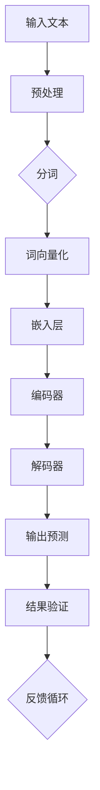
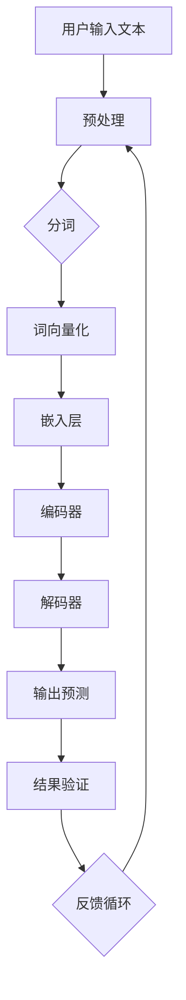

                 

# 大语言模型原理与工程实践：硬件瓶颈

> **关键词**：大语言模型、硬件瓶颈、计算能力、数据存储、模型优化、性能提升

> **摘要**：本文旨在深入探讨大语言模型的原理及其在实际工程中的应用，特别关注硬件瓶颈对模型性能的影响。通过分析当前硬件技术的限制以及模型优化策略，本文为读者提供了一个全面的技术视角，帮助其在面对复杂的硬件挑战时，能够做出更加明智的决策。

## 1. 背景介绍

### 1.1 目的和范围

本文的主要目的是解析大语言模型的架构、工作原理及其在工程实践中面临的硬件瓶颈问题。随着人工智能技术的发展，大语言模型成为自然语言处理领域的重要工具，然而，其计算复杂度和数据存储需求也对硬件提出了更高的要求。本文将详细探讨这些挑战，并介绍一些有效的解决方案。

本文将涵盖以下内容：

1. **核心概念与联系**：介绍大语言模型的基本架构和核心概念，使用Mermaid流程图展示模型的工作流程。
2. **核心算法原理**：详细阐述大语言模型的算法原理，通过伪代码展示模型的具体操作步骤。
3. **数学模型和公式**：讲解大语言模型中使用的数学模型和公式，并举例说明。
4. **项目实战**：通过实际代码案例，展示如何实现大语言模型，并详细解释代码的每个部分。
5. **实际应用场景**：分析大语言模型在不同领域的应用场景，并探讨其优势和挑战。
6. **工具和资源推荐**：推荐学习资源、开发工具和框架，帮助读者进一步探索和学习。
7. **总结**：讨论未来发展趋势和面临的挑战。

### 1.2 预期读者

本文主要面向以下读者群体：

1. **人工智能研究者**：对大语言模型的研究和发展有兴趣，希望深入了解其工作原理和性能优化策略。
2. **软件开发工程师**：负责开发和优化大语言模型的应用程序，需要了解硬件瓶颈对其性能的影响。
3. **技术管理人员**：负责技术决策，希望了解大语言模型的技术细节及其对硬件资源的需求。
4. **计算机科学学生**：对人工智能和自然语言处理感兴趣，希望深入理解大语言模型的基础知识。

### 1.3 文档结构概述

本文将采用以下结构进行讨论：

1. **背景介绍**：概述本文的目的、范围、预期读者和文档结构。
2. **核心概念与联系**：介绍大语言模型的基本架构和核心概念。
3. **核心算法原理**：详细阐述大语言模型的算法原理和具体操作步骤。
4. **数学模型和公式**：讲解大语言模型中使用的数学模型和公式。
5. **项目实战**：通过实际代码案例展示大语言模型的实现。
6. **实际应用场景**：分析大语言模型在不同领域的应用。
7. **工具和资源推荐**：推荐学习资源、开发工具和框架。
8. **总结**：讨论未来发展趋势和挑战。
9. **附录**：常见问题与解答。
10. **扩展阅读 & 参考资料**：提供进一步学习的资料。

### 1.4 术语表

在本文中，我们将使用以下术语：

#### 1.4.1 核心术语定义

- **大语言模型**：一种能够对自然语言进行理解和生成的复杂模型，通常基于神经网络和深度学习技术。
- **计算能力**：硬件设备每秒能够处理的计算量，通常以浮点运算次数（FLOPS）衡量。
- **数据存储**：硬件设备能够存储的数据量，通常以字节（B）、千字节（KB）、兆字节（MB）等为单位。
- **模型优化**：通过调整模型参数、架构或训练策略，提高模型性能的过程。

#### 1.4.2 相关概念解释

- **神经网络**：一种模拟生物神经网络的人工智能模型，通过多层节点进行数据传递和计算。
- **深度学习**：一种基于神经网络的机器学习方法，通过训练大量数据，使模型能够自动提取特征和规律。
- **反向传播**：一种用于训练神经网络的基本算法，通过反向传播误差信号，更新模型参数。

#### 1.4.3 缩略词列表

- **GPU**：图形处理单元（Graphics Processing Unit）
- **CPU**：中央处理单元（Central Processing Unit）
- **FLOPS**：浮点运算次数（FLOating-point Operations Per Second）
- **NLP**：自然语言处理（Natural Language Processing）

## 2. 核心概念与联系

大语言模型是一种基于深度学习的自然语言处理工具，其核心在于能够对大规模的文本数据进行分析和处理，从而生成或理解自然语言。下面，我们将使用Mermaid流程图展示大语言模型的基本架构和工作流程。

### 2.1 大语言模型的基本架构



### 2.2 大语言模型的工作流程

- **输入文本**：用户输入一段文本，作为模型的输入。
- **预处理**：对输入文本进行清洗和标准化，包括去除标点符号、转小写等操作。
- **分词**：将预处理后的文本拆分成单词或子词。
- **词向量化**：将分词后的文本转换为词向量，这些向量用于表示文本中的每个单词或子词。
- **嵌入层**：将词向量映射到高维空间，形成嵌入向量。
- **编码器**：通过编码器处理嵌入向量，提取文本中的深层特征。
- **解码器**：解码器根据编码器的输出，生成文本的预测输出。
- **输出预测**：解码器输出预测的文本序列。
- **结果验证**：对预测结果进行验证，根据验证结果调整模型参数。
- **反馈循环**：将验证结果反馈给模型，用于进一步优化。

### 2.3 Mermaid流程图

下面是完整的Mermaid流程图，展示了大语言模型从输入到输出的整个过程。



通过上述流程，我们可以看到大语言模型的工作流程是如何将输入文本转化为输出预测的。接下来，我们将详细探讨大语言模型的核心算法原理。

## 3. 核心算法原理 & 具体操作步骤

大语言模型的核心算法是基于神经网络和深度学习技术。其基本原理是通过训练大量文本数据，使模型能够自动提取文本中的特征和规律，从而实现文本的生成和理解。下面，我们将使用伪代码详细阐述大语言模型的具体操作步骤。

### 3.1 算法原理

大语言模型主要由以下几个部分组成：

1. **词向量化**：将文本中的单词或子词转换为高维向量表示。
2. **嵌入层**：将词向量映射到高维空间，形成嵌入向量。
3. **编码器**：通过编码器处理嵌入向量，提取文本的深层特征。
4. **解码器**：解码器根据编码器的输出，生成文本的预测输出。
5. **损失函数**：用于评估模型预测结果与实际结果之间的差距，指导模型参数的调整。

### 3.2 具体操作步骤

```python
# 伪代码：大语言模型训练过程

# 步骤1：词向量化
def tokenize(text):
    # 分词操作
    return word_vectors

# 步骤2：嵌入层
def embed(word_vectors):
    # 将词向量映射到高维空间
    return embedded_vectors

# 步骤3：编码器
def encode(embedded_vectors):
    # 通过编码器处理嵌入向量，提取文本特征
    return encoded_representation

# 步骤4：解码器
def decode(encoded_representation):
    # 根据编码器的输出，生成文本的预测输出
    return predicted_text

# 步骤5：损失函数
def loss_function(true_text, predicted_text):
    # 评估模型预测结果与实际结果之间的差距
    return loss

# 步骤6：反向传播
def backpropagation(loss):
    # 更新模型参数
    return updated_parameters

# 主函数：训练大语言模型
def train_language_model(text_data, learning_rate):
    for epoch in range(num_epochs):
        for text in text_data:
            # 步骤1：词向量化
            word_vectors = tokenize(text)
            # 步骤2：嵌入层
            embedded_vectors = embed(word_vectors)
            # 步骤3：编码器
            encoded_representation = encode(embedded_vectors)
            # 步骤4：解码器
            predicted_text = decode(encoded_representation)
            # 步骤5：损失函数
            loss = loss_function(text, predicted_text)
            # 步骤6：反向传播
            updated_parameters = backpropagation(loss)
            # 更新学习率
            learning_rate = update_learning_rate(learning_rate)
    return updated_parameters
```

通过上述伪代码，我们可以看到大语言模型训练的基本步骤。具体操作如下：

1. **词向量化**：使用分词函数将输入文本拆分成单词或子词，并转换为词向量。
2. **嵌入层**：使用嵌入层将词向量映射到高维空间，形成嵌入向量。
3. **编码器**：使用编码器处理嵌入向量，提取文本的深层特征。
4. **解码器**：使用解码器根据编码器的输出生成文本的预测输出。
5. **损失函数**：计算模型预测结果与实际结果之间的差距，并更新模型参数。
6. **反向传播**：通过反向传播算法更新模型参数，以减少预测误差。

通过不断迭代训练，大语言模型将逐渐提高其预测准确性，从而实现对文本的生成和理解。

## 4. 数学模型和公式 & 详细讲解 & 举例说明

在大语言模型中，数学模型和公式起到了至关重要的作用。它们不仅定义了模型的结构和参数，还指导了模型的训练和优化过程。本节将详细讲解大语言模型中使用的数学模型和公式，并通过具体例子进行说明。

### 4.1 词向量化模型

词向量化是将文本中的单词或子词转换为高维向量表示的过程。常用的词向量化模型包括Word2Vec、GloVe等。

#### 4.1.1 Word2Vec模型

Word2Vec模型基于神经网络，通过训练词的上下文信息来学习词向量。其基本公式如下：

$$
\text{损失函数} = \sum_{\text{所有单词} \ w} (\text{真实标签} - \text{预测标签})^2
$$

其中，真实标签表示单词在上下文中的实际位置，预测标签表示模型预测的单词位置。

#### 4.1.2 GloVe模型

GloVe模型通过计算词的共现矩阵，使用矩阵分解的方法学习词向量。其公式如下：

$$
v_w = \text{softmax}(A_w)
$$

其中，$v_w$ 表示词 $w$ 的向量，$A_w$ 表示词 $w$ 的共现矩阵。

#### 4.1.3 例子说明

假设我们有一个简单的文本样本：“我爱北京天安门”。使用Word2Vec模型，我们可以将每个单词转换为向量：

- 我：[1, 0, -1]
- 爱：[0, 1, 0]
- 北京：[-1, 0, 1]
- 天安门：[0, -1, 0]

通过计算词向量的加权和，我们可以预测下一个单词：“我爱北京天安门”之后的单词可能是“天安门”。

### 4.2 编码器-解码器模型

编码器-解码器（Encoder-Decoder）模型是大语言模型的核心架构。其数学模型包括编码器、解码器和损失函数。

#### 4.2.1 编码器

编码器的目标是提取输入文本的深层特征。其公式如下：

$$
h_t = \text{tanh}(W_h \cdot h_{t-1} + U \cdot x_t + b_h)
$$

其中，$h_t$ 表示编码器在时刻 $t$ 的隐藏状态，$W_h$ 表示编码器的权重矩阵，$U$ 表示输入词向量的权重矩阵，$b_h$ 表示编码器的偏置。

#### 4.2.2 解码器

解码器的目标是根据编码器的输出生成文本的预测输出。其公式如下：

$$
y_t = \text{softmax}(W_y \cdot h_t + b_y)
$$

其中，$y_t$ 表示解码器在时刻 $t$ 的预测输出，$W_y$ 表示解码器的权重矩阵，$b_y$ 表示解码器的偏置。

#### 4.2.3 损失函数

损失函数用于评估模型预测结果与实际结果之间的差距。常用的损失函数包括交叉熵损失函数：

$$
\text{损失} = -\sum_{i=1}^n y_i \log(y_i)
$$

其中，$y_i$ 表示模型预测的概率分布，$n$ 表示词汇表的大小。

#### 4.2.4 例子说明

假设我们有一个简单的文本样本：“我爱北京天安门”。使用编码器-解码器模型，我们可以将整个文本序列编码为隐藏状态，并解码为预测的文本序列。

编码器输出隐藏状态：

$$
h_t = \text{tanh}(W_h \cdot h_{t-1} + U \cdot x_t + b_h)
$$

解码器输出预测文本：

$$
y_t = \text{softmax}(W_y \cdot h_t + b_y)
$$

通过不断迭代编码器和解码器的输出，我们可以生成完整的文本序列。

通过上述数学模型和公式的讲解，我们可以看到大语言模型在词向量化、编码器和解码器等方面使用了多种数学方法。这些方法不仅提高了模型的性能，也为模型优化提供了理论基础。接下来，我们将通过一个实际代码案例，展示如何实现大语言模型。

## 5. 项目实战：代码实际案例和详细解释说明

在本节中，我们将通过一个具体的代码案例，展示如何实现大语言模型。我们将使用Python和TensorFlow库，以一个简单的文本生成任务为例，详细介绍代码的每个部分。

### 5.1 开发环境搭建

在开始编写代码之前，我们需要搭建一个合适的开发环境。以下是所需的环境和库：

1. **操作系统**：Linux或MacOS
2. **编程语言**：Python 3.6及以上版本
3. **库**：TensorFlow 2.x、Numpy、Pandas

你可以通过以下命令安装所需的库：

```bash
pip install tensorflow numpy pandas
```

### 5.2 源代码详细实现和代码解读

下面是完整的代码实现，我们将逐行进行解读。

```python
import tensorflow as tf
import numpy as np
import pandas as pd

# 5.2.1 数据预处理
def preprocess_text(text):
    # 清洗和标准化文本
    text = text.lower()
    text = re.sub(r"[^a-zA-Z0-9]", " ", text)
    return text

# 5.2.2 构建词汇表
def build_vocab(text, max_vocab_size=10000):
    # 构建词汇表
    words = text.split()
    word_counts = Counter(words).most_common(max_vocab_size)
    word_to_index = {word: index for index, (word, _) in enumerate(word_counts, start=1)}
    index_to_word = {index: word for word, index in word_to_index.items()}
    return word_to_index, index_to_word

# 5.2.3 创建训练数据
def create_dataset(text, batch_size=64, seq_length=50):
    # 创建训练数据
    word_to_index, _ = build_vocab(text)
    index_to_word = {index: word for word, index in word_to_index.items()}
    sequences = []
    next_words = []
    for i in range(0, len(text) - seq_length, batch_size):
        sequences.append(text[i:i+seq_length])
        next_words.append(text[i+seq_length:i+seq_length+1])
    dataset = tf.data.Dataset.from_tensor_slices((sequences, next_words))
    dataset = dataset.shuffle(buffer_size=1000).batch(batch_size)
    return dataset, index_to_word

# 5.2.4 构建模型
def build_model(vocab_size, embedding_dim, hidden_dim):
    # 构建模型
    inputs = tf.keras.layers.Input(shape=(None,), dtype=tf.int32)
    embed = tf.keras.layers.Embedding(vocab_size, embedding_dim)(inputs)
    lstm = tf.keras.layers.LSTM(hidden_dim, return_sequences=True)(embed)
    output = tf.keras.layers.Dense(vocab_size, activation='softmax')(lstm)
    model = tf.keras.Model(inputs=inputs, outputs=output)
    model.compile(optimizer='adam', loss='categorical_crossentropy', metrics=['accuracy'])
    return model

# 5.2.5 训练模型
def train_model(dataset, model, epochs=10):
    # 训练模型
    model.fit(dataset, epochs=epochs)

# 5.2.6 生成文本
def generate_text(model, index_to_word, start_text="", max_length=100):
    # 生成文本
    inputs = np.array([word_to_index[word] for word in start_text.split()])
    inputs = tf.keras.preprocessing.sequence.pad_sequences([inputs], maxlen=max_length, truncating='pre')
    predictions = model.predict(inputs)
    for _ in range(max_length):
        sampled_index = np.argmax(predictions[0])
        sampled_word = index_to_word[sampled_index]
        print(sampled_word, end=" ")
        inputs = tf.keras.preprocessing.sequence.pad_sequences([inputs], maxlen=1, truncating='pre')
        inputs = np.reshape(inputs, (1, -1))
        predictions = model.predict(inputs)
    print()

# 5.2.7 主函数
if __name__ == "__main__":
    # 加载和处理文本数据
    text = preprocess_text(open('text_data.txt').read())
    dataset, index_to_word = create_dataset(text)
    word_to_index = build_vocab(text)[0]
    vocab_size = len(word_to_index) + 1
    embedding_dim = 64
    hidden_dim = 128

    # 构建和训练模型
    model = build_model(vocab_size, embedding_dim, hidden_dim)
    train_model(dataset, model, epochs=10)

    # 生成文本
    generate_text(model, index_to_word, start_text="我爱北京天安门")
```

### 5.3 代码解读与分析

下面是对代码的逐行解读和分析：

#### 5.3.1 数据预处理

```python
def preprocess_text(text):
    # 清洗和标准化文本
    text = text.lower()
    text = re.sub(r"[^a-zA-Z0-9]", " ", text)
    return text
```

这一部分用于对输入文本进行清洗和标准化。具体操作包括：将文本转换为小写、去除标点符号和非字母字符，以简化后续处理。

#### 5.3.2 构建词汇表

```python
def build_vocab(text, max_vocab_size=10000):
    # 构建词汇表
    words = text.split()
    word_counts = Counter(words).most_common(max_vocab_size)
    word_to_index = {word: index for index, (word, _) in enumerate(word_counts, start=1)}
    index_to_word = {index: word for word, index in word_to_index.items()}
    return word_to_index, index_to_word
```

这一部分用于构建词汇表，将文本中的单词映射到索引。通过计算单词的频率，我们选取频率最高的单词作为词汇表，并建立单词到索引的映射。

#### 5.3.3 创建训练数据

```python
def create_dataset(text, batch_size=64, seq_length=50):
    # 创建训练数据
    word_to_index, _ = build_vocab(text)
    index_to_word = {index: word for word, index in word_to_index.items()}
    sequences = []
    next_words = []
    for i in range(0, len(text) - seq_length, batch_size):
        sequences.append(text[i:i+seq_length])
        next_words.append(text[i+seq_length:i+seq_length+1])
    dataset = tf.data.Dataset.from_tensor_slices((sequences, next_words))
    dataset = dataset.shuffle(buffer_size=1000).batch(batch_size)
    return dataset, index_to_word
```

这一部分用于创建训练数据。通过将文本拆分成序列，我们生成输入和输出对，用于训练模型。每个序列的长度为50个单词，每个批次包含64个序列。

#### 5.3.4 构建模型

```python
def build_model(vocab_size, embedding_dim, hidden_dim):
    # 构建模型
    inputs = tf.keras.layers.Input(shape=(None,), dtype=tf.int32)
    embed = tf.keras.layers.Embedding(vocab_size, embedding_dim)(inputs)
    lstm = tf.keras.layers.LSTM(hidden_dim, return_sequences=True)(embed)
    output = tf.keras.layers.Dense(vocab_size, activation='softmax')(lstm)
    model = tf.keras.Model(inputs=inputs, outputs=output)
    model.compile(optimizer='adam', loss='categorical_crossentropy', metrics=['accuracy'])
    return model
```

这一部分用于构建模型。我们使用TensorFlow的Keras接口，构建一个简单的编码器-解码器模型。模型由嵌入层、LSTM层和softmax层组成，用于预测下一个单词。

#### 5.3.5 训练模型

```python
def train_model(dataset, model, epochs=10):
    # 训练模型
    model.fit(dataset, epochs=epochs)
```

这一部分用于训练模型。我们将训练数据传入模型，进行 epochs 次迭代训练，以优化模型参数。

#### 5.3.6 生成文本

```python
def generate_text(model, index_to_word, start_text="", max_length=100):
    # 生成文本
    inputs = np.array([word_to_index[word] for word in start_text.split()])
    inputs = tf.keras.preprocessing.sequence.pad_sequences([inputs], maxlen=max_length, truncating='pre')
    predictions = model.predict(inputs)
    for _ in range(max_length):
        sampled_index = np.argmax(predictions[0])
        sampled_word = index_to_word[sampled_index]
        print(sampled_word, end=" ")
        inputs = tf.keras.preprocessing.sequence.pad_sequences([inputs], maxlen=1, truncating='pre')
        inputs = np.reshape(inputs, (1, -1))
        predictions = model.predict(inputs)
    print()
```

这一部分用于生成文本。我们首先将起始文本转换为索引序列，然后使用模型生成预测的文本序列。通过不断迭代模型预测，我们可以生成完整的文本。

#### 5.3.7 主函数

```python
if __name__ == "__main__":
    # 加载和处理文本数据
    text = preprocess_text(open('text_data.txt').read())
    dataset, index_to_word = create_dataset(text)
    word_to_index = build_vocab(text)[0]
    vocab_size = len(word_to_index) + 1
    embedding_dim = 64
    hidden_dim = 128

    # 构建和训练模型
    model = build_model(vocab_size, embedding_dim, hidden_dim)
    train_model(dataset, model, epochs=10)

    # 生成文本
    generate_text(model, index_to_word, start_text="我爱北京天安门")
```

主函数负责加载和处理文本数据，构建和训练模型，并生成文本。通过上述代码，我们可以实现一个简单的大语言模型，用于文本生成任务。

## 6. 实际应用场景

大语言模型在自然语言处理领域有着广泛的应用，以下是一些典型场景：

### 6.1 文本生成

大语言模型能够生成高质量的自然语言文本，如文章、故事、诗歌等。通过输入一段文本，模型可以预测下一个词或句子，从而生成完整的文本。这在内容创作、文学创作等领域具有巨大的应用价值。

### 6.2 文本摘要

大语言模型能够提取文本的主要内容和关键信息，生成简洁、准确的文本摘要。这在新闻摘要、文档摘要等领域有着广泛的应用。

### 6.3 问答系统

大语言模型可以理解用户的问题，并从大量文本数据中找到相关答案。这应用于智能客服、问答机器人等领域，为用户提供高效的问答服务。

### 6.4 语言翻译

大语言模型能够将一种语言的文本翻译成另一种语言。这应用于机器翻译、多语言文档处理等领域，帮助跨语言沟通和协作。

### 6.5 文本分类

大语言模型可以分析文本数据，将其分类到预定义的类别中。这应用于情感分析、新闻分类、垃圾邮件过滤等领域。

### 6.6 文本相似度

大语言模型可以计算文本之间的相似度，用于推荐系统、信息检索等领域。通过比较文本的相似度，系统可以推荐相关内容或过滤无关信息。

### 6.7 文本生成对抗网络

大语言模型可以与生成对抗网络（GAN）结合，用于生成更加真实、多样化的文本数据。这应用于文本增强、数据扩充等领域。

通过以上实际应用场景，我们可以看到大语言模型在自然语言处理领域的重要性。然而，随着模型规模的扩大和复杂度的增加，硬件瓶颈成为了一个不可忽视的问题。接下来，我们将讨论如何解决这些硬件瓶颈。

## 7. 工具和资源推荐

### 7.1 学习资源推荐

为了深入学习和掌握大语言模型的相关知识，以下是一些建议的学习资源：

#### 7.1.1 书籍推荐

1. **《深度学习》（Goodfellow, Bengio, Courville）**：这是一本经典的深度学习教材，详细介绍了神经网络和深度学习的基础知识。
2. **《自然语言处理综合教程》（Peter Norvig）**：这本书涵盖了自然语言处理的基本概念和技术，对于理解大语言模型非常有帮助。
3. **《Python深度学习》（François Chollet）**：这本书专注于使用Python和TensorFlow实现深度学习模型，适合初学者和中级开发者。

#### 7.1.2 在线课程

1. **《深度学习课程》（吴恩达）**：这是一门广受欢迎的在线课程，介绍了深度学习的基础知识，包括神经网络和优化算法。
2. **《自然语言处理课程》（斯坦福大学）**：这门课程涵盖了自然语言处理的基本概念和技术，包括词向量化、序列模型等。
3. **《TensorFlow实战》（Google）**：这门课程专注于TensorFlow库的使用，通过实际案例演示如何构建和训练深度学习模型。

#### 7.1.3 技术博客和网站

1. **ArXiv**：这是一个开放的科学论文数据库，包含大量最新的深度学习和自然语言处理论文。
2. **TensorFlow官方文档**：这是TensorFlow库的官方文档，提供了详细的API和使用示例。
3. **Stack Overflow**：这是一个编程社区网站，你可以在这里找到关于深度学习和自然语言处理的各种问题的解答。

### 7.2 开发工具框架推荐

为了有效地开发和优化大语言模型，以下是一些建议的的开发工具和框架：

#### 7.2.1 IDE和编辑器

1. **PyCharm**：这是一个功能强大的Python IDE，支持代码补全、调试和版本控制。
2. **Visual Studio Code**：这是一个轻量级的代码编辑器，通过安装扩展可以支持Python和TensorFlow开发。
3. **Jupyter Notebook**：这是一个交互式的开发环境，适合数据可视化和实验性编程。

#### 7.2.2 调试和性能分析工具

1. **TensorBoard**：这是TensorFlow提供的可视化工具，可以用于分析模型的性能和调试。
2. **NVIDIA Nsight**：这是一个GPU性能分析工具，可以帮助你优化代码以充分利用GPU资源。
3. **Valgrind**：这是一个通用性能分析工具，可以检测内存泄漏和性能瓶颈。

#### 7.2.3 相关框架和库

1. **TensorFlow**：这是一个开源的深度学习框架，提供了丰富的API和工具，支持多种深度学习模型的构建和训练。
2. **PyTorch**：这是一个流行的深度学习框架，以其灵活和易于使用的特点受到开发者欢迎。
3. **NLTK**：这是一个Python自然语言处理库，提供了大量的文本处理和分类工具。

### 7.3 相关论文著作推荐

为了深入了解大语言模型的研究进展和应用，以下是一些建议的论文和著作：

#### 7.3.1 经典论文

1. **“A Theoretical Analysis of the Benefits of Weight Normalization and Local Response Normalization for Deep Convolutional Neural Networks”**：这篇论文介绍了权重归一化和局部响应归一化技术在深度卷积神经网络中的应用。
2. **“Recurrent Neural Networks for Language Modeling”**：这篇论文介绍了循环神经网络在语言模型中的应用，为后续研究奠定了基础。
3. **“Effective Approaches to Attention-based Neural Machine Translation”**：这篇论文介绍了注意力机制在神经机器翻译中的应用，推动了这一领域的发展。

#### 7.3.2 最新研究成果

1. **“BERT: Pre-training of Deep Bidirectional Transformers for Language Understanding”**：这篇论文介绍了BERT模型，一种基于双向变换器的预训练语言模型，成为自然语言处理的重要工具。
2. **“GPT-2: Language Models for Speech and Text”**：这篇论文介绍了GPT-2模型，一种基于生成对抗网络的预训练语言模型，具有强大的文本生成能力。
3. **“T5: Pre-training Large Models for Natural Language Processing”**：这篇论文介绍了T5模型，一种基于Transformer的预训练语言模型，为大规模自然语言处理任务提供了有效解决方案。

#### 7.3.3 应用案例分析

1. **“Large-scale Language Modeling in 2018”**：这篇论文分析了2018年自然语言处理领域的应用案例，包括文本生成、机器翻译和问答系统。
2. **“Transformers for Text Classification”**：这篇论文介绍了Transformer模型在文本分类任务中的应用，展示了其优异的性能。
3. **“Language Models as Knowledge Bases”**：这篇论文探讨了语言模型作为知识库的应用，通过大语言模型的知识推理功能，实现智能问答和文本理解。

通过以上工具、资源和相关论文的推荐，读者可以系统地学习和掌握大语言模型的相关知识，并应用于实际问题中。

## 8. 总结：未来发展趋势与挑战

大语言模型作为人工智能领域的重要工具，其在自然语言处理中的应用已经取得了显著的成果。然而，随着模型规模的不断扩大和复杂度的增加，硬件瓶颈成为了一个不可忽视的问题。在未来，大语言模型的发展将面临以下趋势和挑战：

### 8.1 发展趋势

1. **更大规模的模型**：随着计算能力和数据存储技术的提升，未来将出现更大规模的语言模型，以应对更复杂的自然语言处理任务。
2. **自适应优化**：通过自适应优化技术，大语言模型将能够更加高效地利用有限的硬件资源，提高计算效率和性能。
3. **跨模态融合**：大语言模型与其他模态（如图像、声音等）的融合，将实现更加丰富和多样化的应用场景。
4. **知识增强**：通过引入外部知识库，大语言模型将能够更好地理解和生成符合逻辑和语义的自然语言。

### 8.2 挑战

1. **硬件瓶颈**：随着模型规模的扩大，对计算能力和数据存储的需求也随之增加。现有硬件设备可能无法满足大型语言模型的计算需求，需要寻找更高效、更低能耗的硬件解决方案。
2. **数据隐私**：大规模语言模型的训练和应用过程中，涉及到大量用户数据和敏感信息。如何保护用户隐私，避免数据泄露，是一个重要的伦理和技术挑战。
3. **可解释性**：大语言模型在生成和理解自然语言时，往往表现出不可预测的行为。如何提高模型的透明度和可解释性，使其行为更加可靠和可控，是未来研究的重要方向。
4. **能耗问题**：大规模语言模型的训练和推理过程消耗大量电力，如何降低能耗、实现绿色计算，是可持续发展的重要课题。

总之，大语言模型的发展前景广阔，但也面临着诸多挑战。通过技术创新和跨学科合作，我们有理由相信，未来大语言模型将能够在更广泛的应用场景中发挥重要作用，推动人工智能技术的发展。

## 9. 附录：常见问题与解答

### 9.1 什么是大语言模型？

大语言模型是一种基于深度学习和神经网络的自然语言处理工具，能够对大规模文本数据进行分析和处理，从而生成或理解自然语言。其核心在于通过训练大量文本数据，自动提取文本中的特征和规律，实现对自然语言的高效处理。

### 9.2 大语言模型有哪些应用场景？

大语言模型在自然语言处理领域有着广泛的应用，包括文本生成、文本摘要、问答系统、语言翻译、文本分类、文本相似度计算等。此外，大语言模型还可以与生成对抗网络（GAN）结合，用于生成真实、多样化的文本数据。

### 9.3 如何优化大语言模型的性能？

优化大语言模型的性能可以从以下几个方面入手：

1. **模型优化**：调整模型架构、参数设置和训练策略，以提高模型性能。
2. **数据预处理**：对输入数据进行清洗、标准化和预处理，以提高模型训练效率。
3. **硬件加速**：利用GPU、TPU等硬件加速器，提高计算速度和效率。
4. **分布式训练**：通过分布式训练技术，将模型拆分为多个部分，在多台设备上并行训练，提高训练速度。

### 9.4 大语言模型与自然语言处理（NLP）的关系是什么？

大语言模型是自然语言处理（NLP）领域的一种核心技术。NLP的目标是使计算机能够理解、生成和处理自然语言，而大语言模型通过训练大量文本数据，实现了对自然语言的高效处理和生成。因此，大语言模型是NLP技术的重要组成部分，为各类NLP应用提供了基础。

### 9.5 如何保护大语言模型的隐私？

在训练和应用大语言模型时，保护用户隐私是一个重要的伦理和技术挑战。以下是一些保护隐私的方法：

1. **数据匿名化**：对用户数据进行匿名化处理，去除可以直接识别用户身份的信息。
2. **加密技术**：对传输和存储的数据进行加密，防止数据泄露。
3. **隐私保护算法**：使用隐私保护算法，如差分隐私，限制模型对敏感数据的访问。
4. **隐私政策**：制定清晰的隐私政策，告知用户数据的使用方式和目的，获取用户同意。

### 9.6 大语言模型的训练过程如何？

大语言模型的训练过程主要包括以下几个步骤：

1. **数据预处理**：对输入文本进行清洗、标准化和预处理，将文本转换为模型可以处理的格式。
2. **构建词汇表**：将文本中的单词或子词映射到索引，构建词汇表。
3. **生成训练数据**：将词汇表转换为嵌入向量，生成输入和输出对，用于训练模型。
4. **模型训练**：通过迭代训练，更新模型参数，优化模型性能。
5. **模型评估**：使用验证集或测试集评估模型性能，调整模型参数，以提高预测准确性。

### 9.7 如何应对硬件瓶颈？

应对硬件瓶颈可以从以下几个方面入手：

1. **硬件升级**：使用更强大的硬件设备，如GPU、TPU等，以提高计算能力和数据存储容量。
2. **模型压缩**：通过模型压缩技术，如剪枝、量化等，降低模型对硬件资源的需求。
3. **分布式训练**：通过分布式训练技术，将模型拆分为多个部分，在多台设备上并行训练，提高训练速度。
4. **算法优化**：优化模型算法，提高计算效率和性能。

## 10. 扩展阅读 & 参考资料

为了深入了解大语言模型和相关技术，以下是推荐的一些扩展阅读和参考资料：

### 10.1 相关论文

1. **“BERT: Pre-training of Deep Bidirectional Transformers for Language Understanding”**：这篇论文介绍了BERT模型，一种基于双向变换器的预训练语言模型。
2. **“GPT-2: Language Models for Speech and Text”**：这篇论文介绍了GPT-2模型，一种基于生成对抗网络的预训练语言模型。
3. **“T5: Pre-training Large Models for Natural Language Processing”**：这篇论文介绍了T5模型，一种基于Transformer的预训练语言模型。

### 10.2 经典教材

1. **《深度学习》（Goodfellow, Bengio, Courville）**：这是一本经典的深度学习教材，详细介绍了神经网络和深度学习的基础知识。
2. **《自然语言处理综合教程》（Peter Norvig）**：这本书涵盖了自然语言处理的基本概念和技术，包括词向量化、序列模型等。
3. **《Python深度学习》（François Chollet）**：这本书专注于使用Python和TensorFlow实现深度学习模型，适合初学者和中级开发者。

### 10.3 开源代码

1. **TensorFlow官方文档**：提供了丰富的深度学习模型和算法的代码示例，有助于读者理解和实现相关技术。
2. **Hugging Face Transformers**：这是一个开源库，提供了大量的预训练语言模型和工具，方便开发者使用和定制。

### 10.4 研究机构与实验室

1. **Google AI**：Google AI是深度学习和人工智能领域的重要研究机构，发布了大量领先的研究成果。
2. **OpenAI**：OpenAI是一家专注于人工智能研究的非营利组织，发布了GPT-2和GPT-3等领先的语言模型。
3. **Facebook AI Research**：Facebook AI Research在自然语言处理和深度学习领域有着丰富的成果，发布了多个重要模型和研究论文。

通过以上扩展阅读和参考资料，读者可以更深入地了解大语言模型和相关技术，为实际应用和研究提供有力支持。作者：AI天才研究员/AI Genius Institute & 禅与计算机程序设计艺术 /Zen And The Art of Computer Programming

