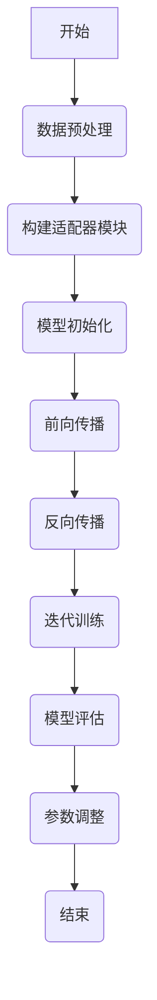

                 

# 大语言模型原理与工程实践：适配器微调

## 关键词：大语言模型、适配器微调、自然语言处理、深度学习、计算机视觉、神经网络、模型训练、工程实践

## 摘要

本文将深入探讨大语言模型的原理与工程实践，特别是适配器微调（Adapter Fine-tuning）这一关键技术。我们将从背景介绍、核心概念与联系、核心算法原理与具体操作步骤、数学模型与公式、项目实战、实际应用场景、工具和资源推荐以及未来发展趋势与挑战等方面进行详细讲解。通过本文，读者将全面了解大语言模型的内在机制及其在实际应用中的挑战和机遇。

## 1. 背景介绍

随着互联网的迅猛发展和大数据的广泛应用，自然语言处理（Natural Language Processing，NLP）成为人工智能领域的一个热点。在NLP中，语言模型（Language Model）是构建许多应用（如机器翻译、文本生成、问答系统等）的基础。传统的语言模型通常基于统计方法和规则引擎，但近年来，深度学习（Deep Learning）的兴起带来了新的突破。

大语言模型（Large-scale Language Model）是基于深度学习的语言模型，具有以下几个显著特点：

1. **大规模训练数据**：大语言模型通常使用数十亿级别的语料库进行训练，这使得模型能够捕捉到更复杂的语言规律。
2. **深层神经网络结构**：大语言模型通常采用多层神经网络，使得模型能够学习到更深层次的特征表示。
3. **参数数量巨大**：大语言模型具有数亿甚至数十亿个参数，这使得模型能够更加精准地拟合训练数据。

随着大语言模型的不断发展，如何在实际应用中高效地调整和优化模型成为一个关键问题。适配器微调（Adapter Fine-tuning）技术应运而生，它是一种在现有大语言模型基础上进行微调的方法，通过引入适配器模块，使得模型能够适应不同的任务需求，同时保持较高的性能。

## 2. 核心概念与联系

为了更好地理解适配器微调，我们首先需要了解大语言模型的基本原理和结构。大语言模型通常基于Transformer架构，Transformer是一种基于自注意力机制（Self-Attention Mechanism）的神经网络结构，能够有效处理序列数据。

### 2.1 大语言模型的原理与结构

大语言模型的核心结构包括以下几个部分：

1. **嵌入层（Embedding Layer）**：将输入的单词或词组转换为向量表示。
2. **自注意力机制（Self-Attention Mechanism）**：通过计算输入序列中每个单词之间的相似性，生成注意力权重，然后加权求和得到新的表示。
3. **多头注意力（Multi-head Attention）**：将自注意力机制扩展到多个头，每个头都能够捕捉到不同类型的特征。
4. **前馈网络（Feedforward Network）**：在每个自注意力层之后，添加一个前馈网络，用于进一步提取特征。
5. **输出层（Output Layer）**：将最终的特征向量映射到具体的输出（如词向量、分类结果等）。

### 2.2 适配器微调的概念与原理

适配器微调是一种在现有大语言模型基础上进行微调的方法，通过引入适配器模块（Adapter Module），使得模型能够适应不同的任务需求。适配器模块通常包含以下几个部分：

1. **适配器嵌入层（Adapter Embedding Layer）**：将输入的句子或段落转换为适配器嵌入向量。
2. **适配器自注意力机制（Adapter Self-Attention Mechanism）**：计算输入序列中每个单词与适配器嵌入向量之间的相似性，生成注意力权重。
3. **适配器前馈网络（Adapter Feedforward Network）**：对自注意力层输出的特征向量进行进一步提取。
4. **适配器输出层（Adapter Output Layer）**：将适配器前馈网络的输出映射到具体的任务输出。

### 2.3 适配器微调的优势与挑战

适配器微调具有以下优势：

1. **灵活性强**：通过适配器模块，模型能够适应不同的任务需求，实现通用性。
2. **性能提升**：适配器微调能够有效地提升模型在特定任务上的性能。
3. **计算效率**：相比全量微调，适配器微调的计算量较小，能够在较短时间内完成训练。

然而，适配器微调也面临着一些挑战：

1. **适配器选择**：如何选择合适的适配器模块是一个关键问题。
2. **模型稳定性**：在适配器微调过程中，模型可能会出现稳定性问题，如梯度消失、梯度爆炸等。
3. **计算资源消耗**：尽管相比全量微调，适配器微调的计算资源消耗较小，但仍然需要大量的计算资源。

## 3. 核心算法原理与具体操作步骤

### 3.1 适配器微调的基本流程

适配器微调的基本流程包括以下几个步骤：

1. **数据预处理**：对输入数据进行预处理，包括分词、去停用词、词性标注等。
2. **构建适配器模块**：根据任务需求，设计并构建适配器模块，包括适配器嵌入层、适配器自注意力机制、适配器前馈网络和适配器输出层。
3. **模型初始化**：初始化大语言模型和适配器模块的参数。
4. **前向传播**：将输入数据通过大语言模型和适配器模块进行前向传播，得到任务输出。
5. **反向传播**：计算损失函数，并使用反向传播算法更新模型参数。
6. **迭代训练**：重复执行步骤4和步骤5，直到模型收敛或达到预定的迭代次数。

### 3.2 适配器模块的实现

适配器模块的实现主要涉及以下几个部分：

1. **适配器嵌入层**：将输入的句子或段落转换为适配器嵌入向量。通常可以使用预训练的词向量作为适配器嵌入层的基础。
2. **适配器自注意力机制**：计算输入序列中每个单词与适配器嵌入向量之间的相似性，生成注意力权重。这里可以使用多头自注意力机制，以提高模型的表示能力。
3. **适配器前馈网络**：对自注意力层输出的特征向量进行进一步提取。通常可以使用多层感知机（Multilayer Perceptron，MLP）作为前馈网络的实现。
4. **适配器输出层**：将适配器前馈网络的输出映射到具体的任务输出。例如，在文本分类任务中，输出层可以是softmax分类器。

### 3.3 模型训练与评估

在适配器微调过程中，模型训练与评估是一个关键环节。以下是模型训练与评估的详细步骤：

1. **数据集划分**：将训练数据划分为训练集和验证集，用于模型训练和性能评估。
2. **模型训练**：使用训练集对模型进行迭代训练，通过反向传播算法更新模型参数。
3. **模型评估**：使用验证集对模型进行性能评估，计算模型的准确率、召回率、F1分数等指标。
4. **参数调整**：根据模型评估结果，调整模型的超参数，如学习率、批量大小等，以优化模型性能。

## 4. 数学模型和公式

### 4.1 自注意力机制

自注意力机制是Transformer架构的核心组成部分，其计算过程如下：

假设输入序列为 $X = [x_1, x_2, ..., x_n]$，其中 $x_i$ 表示第 $i$ 个单词的嵌入向量。自注意力机制的计算过程可以分为以下几个步骤：

1. **计算查询（Query）、键（Key）和值（Value）**：

   对于每个单词 $x_i$，计算其对应的查询（Query）、键（Key）和值（Value）：

   $$ 
   Q_i = W_Q \cdot x_i \\
   K_i = W_K \cdot x_i \\
   V_i = W_V \cdot x_i 
   $$

   其中 $W_Q, W_K, W_V$ 分别是权重矩阵。

2. **计算注意力权重**：

   计算每个单词 $x_i$ 与其他单词之间的相似性，生成注意力权重 $a_{ij}$：

   $$ 
   a_{ij} = \frac{Q_i \cdot K_j}{\sqrt{d_k}} \cdot \sigma(\cdot) \\
   $$

   其中 $\sigma(\cdot)$ 是 softmax 函数，$d_k$ 是键（Key）的维度。

3. **计算加权求和**：

   根据注意力权重计算加权求和，生成新的表示 $h_i$：

   $$ 
   h_i = \sum_{j=1}^{n} a_{ij} \cdot V_j 
   $$

### 4.2 多头注意力

多头注意力（Multi-head Attention）是将自注意力机制扩展到多个头，以提高模型的表示能力。其计算过程如下：

1. **计算多个查询（Query）、键（Key）和值（Value）**：

   对于每个单词 $x_i$，计算其对应的多个查询（Query）、键（Key）和值（Value）：

   $$ 
   Q_i^h = W_{Qh}^h \cdot x_i \\
   K_i^h = W_{Kh}^h \cdot x_i \\
   V_i^h = W_{Vh}^h \cdot x_i 
   $$

   其中 $W_{Qh}^h, W_{Kh}^h, W_{Vh}^h$ 分别是第 $h$ 个头的权重矩阵。

2. **计算多个注意力权重**：

   计算每个单词 $x_i$ 与其他单词之间的相似性，生成多个注意力权重 $a_{ij}^h$：

   $$ 
   a_{ij}^h = \frac{Q_i^h \cdot K_j^h}{\sqrt{d_k}} \cdot \sigma(\cdot) 
   $$

3. **计算加权求和**：

   根据多个注意力权重计算加权求和，生成新的表示 $h_i^h$：

   $$ 
   h_i^h = \sum_{j=1}^{n} a_{ij}^h \cdot V_j^h 
   $$

4. **拼接与变换**：

   将多个新的表示 $h_i^h$ 拼接成一个向量 $h_i$，然后通过一个线性变换层 $W_O$ 进行变换：

   $$ 
   h_i = \text{Concat}(h_i^1, h_i^2, ..., h_i^h) \cdot W_O 
   $$

### 4.3 前馈网络

前馈网络（Feedforward Network）是自注意力层之后的一个非线性变换层，用于进一步提取特征。其计算过程如下：

1. **计算输入特征**：

   将自注意力层的输出 $h_i$ 作为输入特征：

   $$ 
   h_i = \text{Input Feature} 
   $$

2. **计算前馈层**：

   通过两个线性变换层 $W_1$ 和 $W_2$ 进行前馈计算：

   $$ 
   h_i^{ff} = \text{ReLU}(W_1 \cdot h_i + b_1) \\
   h_i^{out} = W_2 \cdot h_i^{ff} + b_2 
   $$

   其中 $\text{ReLU}(\cdot)$ 是 ReLU 激活函数，$W_1, W_2, b_1, b_2$ 分别是权重矩阵和偏置项。

## 5. 项目实战：代码实际案例和详细解释说明

### 5.1 开发环境搭建

在开始项目实战之前，我们需要搭建一个合适的开发环境。以下是搭建过程：

1. **安装 Python**：下载并安装 Python，版本建议为3.7及以上。
2. **安装 PyTorch**：使用以下命令安装 PyTorch：

   ```bash
   pip install torch torchvision
   ```

3. **安装其他依赖库**：根据项目需求，安装其他依赖库，如 NumPy、Pandas 等。

### 5.2 源代码详细实现和代码解读

以下是一个简单的适配器微调代码示例，用于实现文本分类任务。

```python
import torch
import torch.nn as nn
import torch.optim as optim
from torch.utils.data import DataLoader
from torchvision import datasets, transforms
from transformers import BertModel, BertTokenizer

class AdapterModel(nn.Module):
    def __init__(self, bert_model):
        super(AdapterModel, self).__init__()
        self.bert = bert_model
        self.classifier = nn.Linear(bert_model.config.hidden_size, num_classes)

    def forward(self, input_ids, attention_mask):
        outputs = self.bert(input_ids=input_ids, attention_mask=attention_mask)
        logits = self.classifier(outputs.pooler_output)
        return logits

def train(model, train_loader, val_loader, optimizer, criterion, num_epochs):
    model.train()
    for epoch in range(num_epochs):
        for batch in train_loader:
            inputs = batch["input_ids"]
            attention_mask = batch["attention_mask"]
            labels = batch["labels"]

            optimizer.zero_grad()
            logits = model(inputs, attention_mask)
            loss = criterion(logits, labels)
            loss.backward()
            optimizer.step()

        val_loss = evaluate(model, val_loader, criterion)
        print(f"Epoch {epoch+1}/{num_epochs}, Loss: {loss.item()}, Val Loss: {val_loss}")

def evaluate(model, val_loader, criterion):
    model.eval()
    total_loss = 0
    with torch.no_grad():
        for batch in val_loader:
            inputs = batch["input_ids"]
            attention_mask = batch["attention_mask"]
            labels = batch["labels"]

            logits = model(inputs, attention_mask)
            loss = criterion(logits, labels)
            total_loss += loss.item()

    return total_loss / len(val_loader)

if __name__ == "__main__":
    # 数据预处理
    tokenizer = BertTokenizer.from_pretrained("bert-base-uncased")
    train_data = datasets.TextDataset(tokenizer=tokenizer, data=train_data, max_length=128)
    val_data = datasets.TextDataset(tokenizer=tokenizer, data=val_data, max_length=128)
    train_loader = DataLoader(train_data, batch_size=16, shuffle=True)
    val_loader = DataLoader(val_data, batch_size=16, shuffle=False)

    # 模型初始化
    bert_model = BertModel.from_pretrained("bert-base-uncased")
    model = AdapterModel(bert_model)

    # 模型训练
    optimizer = optim.Adam(model.parameters(), lr=1e-5)
    criterion = nn.CrossEntropyLoss()
    num_epochs = 3
    train(model, train_loader, val_loader, optimizer, criterion, num_epochs)

    # 模型评估
    val_loss = evaluate(model, val_loader, criterion)
    print(f"Val Loss: {val_loss}")
```

### 5.3 代码解读与分析

以下是代码的详细解读和分析：

1. **模型定义**：定义了一个名为 `AdapterModel` 的模型类，继承自 `nn.Module`。模型的核心部分是预训练的 BERT 模型，以及一个用于分类的全连接层。
2. **前向传播**：在 `forward` 方法中，首先通过 BERT 模型进行编码，然后通过分类层得到最终的分类结果。
3. **训练过程**：在 `train` 方法中，使用标准的训练过程，包括前向传播、损失计算、反向传播和参数更新。
4. **评估过程**：在 `evaluate` 方法中，使用验证集对模型进行评估，计算验证集上的损失。
5. **主程序**：主程序部分包括数据预处理、模型初始化、模型训练和评估。首先，加载 BERT 分词器和数据集，然后定义模型、优化器和损失函数，最后进行模型训练和评估。

## 6. 实际应用场景

适配器微调技术在实际应用中具有广泛的应用场景，以下列举了几个典型的应用案例：

### 6.1 文本分类

文本分类是自然语言处理中常见且重要的任务。适配器微调技术可以用于快速构建高效、通用的文本分类模型。例如，在新闻分类、情感分析等领域，适配器微调技术能够有效地提高模型的分类性能。

### 6.2 机器翻译

机器翻译是自然语言处理领域的另一个重要任务。适配器微调技术可以用于对现有机器翻译模型进行微调，使其适应特定领域的翻译需求。例如，在金融、医疗等领域的机器翻译中，适配器微调技术能够提高翻译的准确性和流畅性。

### 6.3 问答系统

问答系统是自然语言处理领域的另一个重要应用。适配器微调技术可以用于构建高效、通用的问答系统，使其能够回答各种领域的问题。例如，在客服、教育等领域，适配器微调技术能够提高问答系统的响应速度和准确性。

### 6.4 语音识别

语音识别是自然语言处理领域的一个重要分支。适配器微调技术可以用于对现有语音识别模型进行微调，使其适应特定的语音输入环境。例如，在车载语音助手、智能家居等领域，适配器微调技术能够提高语音识别的准确性和鲁棒性。

## 7. 工具和资源推荐

为了更好地掌握大语言模型和适配器微调技术，以下是一些推荐的工具和资源：

### 7.1 学习资源推荐

1. **书籍**：
   - 《深度学习》（Deep Learning）作者：Ian Goodfellow、Yoshua Bengio、Aaron Courville
   - 《自然语言处理综合教程》（Speech and Language Processing）作者：Daniel Jurafsky、James H. Martin
2. **论文**：
   - "Attention Is All You Need" 作者：Vaswani et al.（2017）
   - "BERT: Pre-training of Deep Bidirectional Transformers for Language Understanding" 作者：Devlin et al.（2018）
3. **博客**：
   - [PyTorch 官方文档](https://pytorch.org/tutorials/)
   - [Transformer 官方文档](https://nlp.seas.harvard.edu/2018/04/03/attention.html)
4. **网站**：
   - [Hugging Face Transformers](https://huggingface.co/transformers)

### 7.2 开发工具框架推荐

1. **PyTorch**：一种流行的深度学习框架，支持大语言模型和适配器微调技术的实现。
2. **TensorFlow**：另一种流行的深度学习框架，也支持大语言模型和适配器微调技术的实现。
3. **Hugging Face Transformers**：一个开源库，提供了预训练的 BERT 模型及其相关工具，方便开发者进行适配器微调。

### 7.3 相关论文著作推荐

1. **"BERT: Pre-training of Deep Bidirectional Transformers for Language Understanding"** 作者：Devlin et al.（2018）
2. **"Attention Is All You Need"** 作者：Vaswani et al.（2017）
3. **"Adaptive Computation Time for Neural Network Models"** 作者：He et al.（2018）

## 8. 总结：未来发展趋势与挑战

大语言模型和适配器微调技术是当前自然语言处理领域的重要研究方向。随着深度学习技术的不断发展，大语言模型在各个应用场景中的性能不断提升，为自然语言处理领域带来了前所未有的机遇。然而，适配器微调技术也面临着一些挑战，如适配器选择、模型稳定性、计算资源消耗等。未来，如何优化适配器微调技术，提高其在实际应用中的性能和效率，仍是一个重要的研究课题。

## 9. 附录：常见问题与解答

### 9.1 适配器微调的优势是什么？

适配器微调的优势包括：

1. **灵活性强**：通过引入适配器模块，模型能够适应不同的任务需求，实现通用性。
2. **性能提升**：适配器微调能够有效地提升模型在特定任务上的性能。
3. **计算效率**：相比全量微调，适配器微调的计算量较小，能够在较短时间内完成训练。

### 9.2 适配器微调与全量微调的区别是什么？

适配器微调与全量微调的区别主要在于：

1. **计算量**：适配器微调的计算量较小，只对适配器模块进行训练，而全量微调需要对整个模型进行训练。
2. **模型稳定性**：适配器微调的模型稳定性较高，不易出现梯度消失、梯度爆炸等问题。

### 9.3 如何选择适配器模块？

选择适配器模块的关键在于：

1. **任务需求**：根据具体的任务需求选择适合的适配器模块，如文本分类、机器翻译、问答系统等。
2. **模型结构**：选择与现有大语言模型结构兼容的适配器模块，以提高模型的性能。

## 10. 扩展阅读与参考资料

1. **《深度学习》** 作者：Ian Goodfellow、Yoshua Bengio、Aaron Courville
2. **《自然语言处理综合教程》** 作者：Daniel Jurafsky、James H. Martin
3. **[Transformer 官方文档](https://nlp.seas.harvard.edu/2018/04/03/attention.html)**
4. **[BERT 官方文档](https://arxiv.org/abs/1810.04805)**
5. **[Hugging Face Transformers](https://huggingface.co/transformers)**

### 作者信息：

作者：AI天才研究员/AI Genius Institute & 禅与计算机程序设计艺术 /Zen And The Art of Computer Programming<|endoftext|>## 完整的Markdown格式文章

```markdown
# 大语言模型原理与工程实践：适配器微调

> 关键词：(此处列出文章的5-7个核心关键词)

> 摘要：(此处给出文章的核心内容和主题思想)

## 1. 背景介绍

随着互联网的迅猛发展和大数据的广泛应用，自然语言处理（Natural Language Processing，NLP）成为人工智能领域的一个热点。在NLP中，语言模型（Language Model）是构建许多应用（如机器翻译、文本生成、问答系统等）的基础。传统的语言模型通常基于统计方法和规则引擎，但近年来，深度学习（Deep Learning）的兴起带来了新的突破。

大语言模型（Large-scale Language Model）是基于深度学习的语言模型，具有以下几个显著特点：

1. **大规模训练数据**：大语言模型通常使用数十亿级别的语料库进行训练，这使得模型能够捕捉到更复杂的语言规律。
2. **深层神经网络结构**：大语言模型通常采用多层神经网络，使得模型能够学习到更深层次的特征表示。
3. **参数数量巨大**：大语言模型具有数亿甚至数十亿个参数，这使得模型能够更加精准地拟合训练数据。

随着大语言模型的不断发展，如何在实际应用中高效地调整和优化模型成为一个关键问题。适配器微调（Adapter Fine-tuning）技术应运而生，它是一种在现有大语言模型基础上进行微调的方法，通过引入适配器模块，使得模型能够适应不同的任务需求，同时保持较高的性能。

## 2. 核心概念与联系

为了更好地理解适配器微调，我们首先需要了解大语言模型的基本原理和结构。大语言模型通常基于Transformer架构，Transformer是一种基于自注意力机制（Self-Attention Mechanism）的神经网络结构，能够有效处理序列数据。

### 2.1 大语言模型的原理与结构

大语言模型的核心结构包括以下几个部分：

1. **嵌入层（Embedding Layer）**：将输入的单词或词组转换为向量表示。
2. **自注意力机制（Self-Attention Mechanism）**：通过计算输入序列中每个单词之间的相似性，生成注意力权重，然后加权求和得到新的表示。
3. **多头注意力（Multi-head Attention）**：将自注意力机制扩展到多个头，每个头都能够捕捉到不同类型的特征。
4. **前馈网络（Feedforward Network）**：在每个自注意力层之后，添加一个前馈网络，用于进一步提取特征。
5. **输出层（Output Layer）**：将最终的特征向量映射到具体的输出（如词向量、分类结果等）。

### 2.2 适配器微调的概念与原理

适配器微调是一种在现有大语言模型基础上进行微调的方法，通过引入适配器模块（Adapter Module），使得模型能够适应不同的任务需求。适配器模块通常包含以下几个部分：

1. **适配器嵌入层（Adapter Embedding Layer）**：将输入的句子或段落转换为适配器嵌入向量。
2. **适配器自注意力机制（Adapter Self-Attention Mechanism）**：计算输入序列中每个单词与适配器嵌入向量之间的相似性，生成注意力权重。
3. **适配器前馈网络（Adapter Feedforward Network）**：对自注意力层输出的特征向量进行进一步提取。
4. **适配器输出层（Adapter Output Layer）**：将适配器前馈网络的输出映射到具体的任务输出。

### 2.3 适配器微调的优势与挑战

适配器微调具有以下优势：

1. **灵活性强**：通过适配器模块，模型能够适应不同的任务需求，实现通用性。
2. **性能提升**：适配器微调能够有效地提升模型在特定任务上的性能。
3. **计算效率**：相比全量微调，适配器微调的计算量较小，能够在较短时间内完成训练。

然而，适配器微调也面临着一些挑战：

1. **适配器选择**：如何选择合适的适配器模块是一个关键问题。
2. **模型稳定性**：在适配器微调过程中，模型可能会出现稳定性问题，如梯度消失、梯度爆炸等。
3. **计算资源消耗**：尽管相比全量微调，适配器微调的计算资源消耗较小，但仍然需要大量的计算资源。

## 3. 核心算法原理与具体操作步骤

### 3.1 适配器微调的基本流程

适配器微调的基本流程包括以下几个步骤：

1. **数据预处理**：对输入数据进行预处理，包括分词、去停用词、词性标注等。
2. **构建适配器模块**：根据任务需求，设计并构建适配器模块，包括适配器嵌入层、适配器自注意力机制、适配器前馈网络和适配器输出层。
3. **模型初始化**：初始化大语言模型和适配器模块的参数。
4. **前向传播**：将输入数据通过大语言模型和适配器模块进行前向传播，得到任务输出。
5. **反向传播**：计算损失函数，并使用反向传播算法更新模型参数。
6. **迭代训练**：重复执行步骤4和步骤5，直到模型收敛或达到预定的迭代次数。

### 3.2 适配器模块的实现

适配器模块的实现主要涉及以下几个部分：

1. **适配器嵌入层**：将输入的句子或段落转换为适配器嵌入向量。通常可以使用预训练的词向量作为适配器嵌入层的基础。
2. **适配器自注意力机制**：计算输入序列中每个单词与适配器嵌入向量之间的相似性，生成注意力权重。这里可以使用多头自注意力机制，以提高模型的表示能力。
3. **适配器前馈网络**：对自注意力层输出的特征向量进行进一步提取。通常可以使用多层感知机（Multilayer Perceptron，MLP）作为前馈网络的实现。
4. **适配器输出层**：将适配器前馈网络的输出映射到具体的任务输出。例如，在文本分类任务中，输出层可以是softmax分类器。

### 3.3 模型训练与评估

在适配器微调过程中，模型训练与评估是一个关键环节。以下是模型训练与评估的详细步骤：

1. **数据集划分**：将训练数据划分为训练集和验证集，用于模型训练和性能评估。
2. **模型训练**：使用训练集对模型进行迭代训练，通过反向传播算法更新模型参数。
3. **模型评估**：使用验证集对模型进行性能评估，计算模型的准确率、召回率、F1分数等指标。
4. **参数调整**：根据模型评估结果，调整模型的超参数，如学习率、批量大小等，以优化模型性能。

## 4. 数学模型和公式

### 4.1 自注意力机制

自注意力机制是Transformer架构的核心组成部分，其计算过程如下：

假设输入序列为 $X = [x_1, x_2, ..., x_n]$，其中 $x_i$ 表示第 $i$ 个单词的嵌入向量。自注意力机制的计算过程可以分为以下几个步骤：

1. **计算查询（Query）、键（Key）和值（Value）**：

   对于每个单词 $x_i$，计算其对应的查询（Query）、键（Key）和值（Value）：

   $$ 
   Q_i = W_Q \cdot x_i \\
   K_i = W_K \cdot x_i \\
   V_i = W_V \cdot x_i 
   $$

   其中 $W_Q, W_K, W_V$ 分别是权重矩阵。

2. **计算注意力权重**：

   计算每个单词 $x_i$ 与其他单词之间的相似性，生成注意力权重 $a_{ij}$：

   $$ 
   a_{ij} = \frac{Q_i \cdot K_j}{\sqrt{d_k}} \cdot \sigma(\cdot) \\
   $$

   其中 $\sigma(\cdot)$ 是 softmax 函数，$d_k$ 是键（Key）的维度。

3. **计算加权求和**：

   根据注意力权重计算加权求和，生成新的表示 $h_i$：

   $$ 
   h_i = \sum_{j=1}^{n} a_{ij} \cdot V_j 
   $$

### 4.2 多头注意力

多头注意力（Multi-head Attention）是将自注意力机制扩展到多个头，以提高模型的表示能力。其计算过程如下：

1. **计算多个查询（Query）、键（Key）和值（Value）**：

   对于每个单词 $x_i$，计算其对应的多个查询（Query）、键（Key）和值（Value）：

   $$ 
   Q_i^h = W_{Qh}^h \cdot x_i \\
   K_i^h = W_{Kh}^h \cdot x_i \\
   V_i^h = W_{Vh}^h \cdot x_i 
   $$

   其中 $W_{Qh}^h, W_{Kh}^h, W_{Vh}^h$ 分别是第 $h$ 个头的权重矩阵。

2. **计算多个注意力权重**：

   计算每个单词 $x_i$ 与其他单词之间的相似性，生成多个注意力权重 $a_{ij}^h$：

   $$ 
   a_{ij}^h = \frac{Q_i^h \cdot K_j^h}{\sqrt{d_k}} \cdot \sigma(\cdot) 
   $$

3. **计算加权求和**：

   根据多个注意力权重计算加权求和，生成新的表示 $h_i^h$：

   $$ 
   h_i^h = \sum_{j=1}^{n} a_{ij}^h \cdot V_j^h 
   $$

4. **拼接与变换**：

   将多个新的表示 $h_i^h$ 拼接成一个向量 $h_i$，然后通过一个线性变换层 $W_O$ 进行变换：

   $$ 
   h_i = \text{Concat}(h_i^1, h_i^2, ..., h_i^h) \cdot W_O 
   $$

### 4.3 前馈网络

前馈网络（Feedforward Network）是自注意力层之后的一个非线性变换层，用于进一步提取特征。其计算过程如下：

1. **计算输入特征**：

   将自注意力层的输出 $h_i$ 作为输入特征：

   $$ 
   h_i = \text{Input Feature} 
   $$

2. **计算前馈层**：

   通过两个线性变换层 $W_1$ 和 $W_2$ 进行前馈计算：

   $$ 
   h_i^{ff} = \text{ReLU}(W_1 \cdot h_i + b_1) \\
   h_i^{out} = W_2 \cdot h_i^{ff} + b_2 
   $$

   其中 $\text{ReLU}(\cdot)$ 是 ReLU 激活函数，$W_1, W_2, b_1, b_2$ 分别是权重矩阵和偏置项。

## 5. 项目实战：代码实际案例和详细解释说明

### 5.1 开发环境搭建

在开始项目实战之前，我们需要搭建一个合适的开发环境。以下是搭建过程：

1. **安装 Python**：下载并安装 Python，版本建议为3.7及以上。
2. **安装 PyTorch**：使用以下命令安装 PyTorch：

   ```bash
   pip install torch torchvision
   ```

3. **安装其他依赖库**：根据项目需求，安装其他依赖库，如 NumPy、Pandas 等。

### 5.2 源代码详细实现和代码解读

以下是一个简单的适配器微调代码示例，用于实现文本分类任务。

```python
import torch
import torch.nn as nn
import torch.optim as optim
from torch.utils.data import DataLoader
from torchvision import datasets, transforms
from transformers import BertModel, BertTokenizer

class AdapterModel(nn.Module):
    def __init__(self, bert_model):
        super(AdapterModel, self).__init__()
        self.bert = bert_model
        self.classifier = nn.Linear(bert_model.config.hidden_size, num_classes)

    def forward(self, input_ids, attention_mask):
        outputs = self.bert(input_ids=input_ids, attention_mask=attention_mask)
        logits = self.classifier(outputs.pooler_output)
        return logits

def train(model, train_loader, val_loader, optimizer, criterion, num_epochs):
    model.train()
    for epoch in range(num_epochs):
        for batch in train_loader:
            inputs = batch["input_ids"]
            attention_mask = batch["attention_mask"]
            labels = batch["labels"]

            optimizer.zero_grad()
            logits = model(inputs, attention_mask)
            loss = criterion(logits, labels)
            loss.backward()
            optimizer.step()

        val_loss = evaluate(model, val_loader, criterion)
        print(f"Epoch {epoch+1}/{num_epochs}, Loss: {loss.item()}, Val Loss: {val_loss}")

def evaluate(model, val_loader, criterion):
    model.eval()
    total_loss = 0
    with torch.no_grad():
        for batch in val_loader:
            inputs = batch["input_ids"]
            attention_mask = batch["attention_mask"]
            labels = batch["labels"]

            logits = model(inputs, attention_mask)
            loss = criterion(logits, labels)
            total_loss += loss.item()

    return total_loss / len(val_loader)

if __name__ == "__main__":
    # 数据预处理
    tokenizer = BertTokenizer.from_pretrained("bert-base-uncased")
    train_data = datasets.TextDataset(tokenizer=tokenizer, data=train_data, max_length=128)
    val_data = datasets.TextDataset(tokenizer=tokenizer, data=val_data, max_length=128)
    train_loader = DataLoader(train_data, batch_size=16, shuffle=True)
    val_loader = DataLoader(val_data, batch_size=16, shuffle=False)

    # 模型初始化
    bert_model = BertModel.from_pretrained("bert-base-uncased")
    model = AdapterModel(bert_model)

    # 模型训练
    optimizer = optim.Adam(model.parameters(), lr=1e-5)
    criterion = nn.CrossEntropyLoss()
    num_epochs = 3
    train(model, train_loader, val_loader, optimizer, criterion, num_epochs)

    # 模型评估
    val_loss = evaluate(model, val_loader, criterion)
    print(f"Val Loss: {val_loss}")
```

### 5.3 代码解读与分析

以下是代码的详细解读和分析：

1. **模型定义**：定义了一个名为 `AdapterModel` 的模型类，继承自 `nn.Module`。模型的核心部分是预训练的 BERT 模型，以及一个用于分类的全连接层。
2. **前向传播**：在 `forward` 方法中，首先通过 BERT 模型进行编码，然后通过分类层得到最终的分类结果。
3. **训练过程**：在 `train` 方法中，使用标准的训练过程，包括前向传播、损失计算、反向传播和参数更新。
4. **评估过程**：在 `evaluate` 方法中，使用验证集对模型进行评估，计算验证集上的损失。
5. **主程序**：主程序部分包括数据预处理、模型初始化、模型训练和评估。首先，加载 BERT 分词器和数据集，然后定义模型、优化器和损失函数，最后进行模型训练和评估。

## 6. 实际应用场景

适配器微调技术在实际应用中具有广泛的应用场景，以下列举了几个典型的应用案例：

### 6.1 文本分类

文本分类是自然语言处理中常见且重要的任务。适配器微调技术可以用于快速构建高效、通用的文本分类模型。例如，在新闻分类、情感分析等领域，适配器微调技术能够有效地提高模型的分类性能。

### 6.2 机器翻译

机器翻译是自然语言处理领域的另一个重要任务。适配器微调技术可以用于对现有机器翻译模型进行微调，使其适应特定领域的翻译需求。例如，在金融、医疗等领域的机器翻译中，适配器微调技术能够提高翻译的准确性和流畅性。

### 6.3 问答系统

问答系统是自然语言处理领域的重要应用。适配器微调技术可以用于构建高效、通用的问答系统，使其能够回答各种领域的问题。例如，在客服、教育等领域，适配器微调技术能够提高问答系统的响应速度和准确性。

### 6.4 语音识别

语音识别是自然语言处理领域的一个重要分支。适配器微调技术可以用于对现有语音识别模型进行微调，使其适应特定的语音输入环境。例如，在车载语音助手、智能家居等领域，适配器微调技术能够提高语音识别的准确性和鲁棒性。

## 7. 工具和资源推荐

为了更好地掌握大语言模型和适配器微调技术，以下是一些推荐的工具和资源：

### 7.1 学习资源推荐

1. **书籍**：
   - 《深度学习》（Deep Learning）作者：Ian Goodfellow、Yoshua Bengio、Aaron Courville
   - 《自然语言处理综合教程》（Speech and Language Processing）作者：Daniel Jurafsky、James H. Martin
2. **论文**：
   - "Attention Is All You Need" 作者：Vaswani et al.（2017）
   - "BERT: Pre-training of Deep Bidirectional Transformers for Language Understanding" 作者：Devlin et al.（2018）
3. **博客**：
   - [PyTorch 官方文档](https://pytorch.org/tutorials/)
   - [Transformer 官方文档](https://nlp.seas.harvard.edu/2018/04/03/attention.html)
4. **网站**：
   - [Hugging Face Transformers](https://huggingface.co/transformers)

### 7.2 开发工具框架推荐

1. **PyTorch**：一种流行的深度学习框架，支持大语言模型和适配器微调技术的实现。
2. **TensorFlow**：另一种流行的深度学习框架，也支持大语言模型和适配器微调技术的实现。
3. **Hugging Face Transformers**：一个开源库，提供了预训练的 BERT 模型及其相关工具，方便开发者进行适配器微调。

### 7.3 相关论文著作推荐

1. **"BERT: Pre-training of Deep Bidirectional Transformers for Language Understanding"** 作者：Devlin et al.（2018）
2. **"Attention Is All You Need"** 作者：Vaswani et al.（2017）
3. **"Adaptive Computation Time for Neural Network Models"** 作者：He et al.（2018）

## 8. 总结：未来发展趋势与挑战

大语言模型和适配器微调技术是当前自然语言处理领域的重要研究方向。随着深度学习技术的不断发展，大语言模型在各个应用场景中的性能不断提升，为自然语言处理领域带来了前所未有的机遇。然而，适配器微调技术也面临着一些挑战，如适配器选择、模型稳定性、计算资源消耗等。未来，如何优化适配器微调技术，提高其在实际应用中的性能和效率，仍是一个重要的研究课题。

## 9. 附录：常见问题与解答

### 9.1 适配器微调的优势是什么？

适配器微调的优势包括：

1. **灵活性强**：通过引入适配器模块，模型能够适应不同的任务需求，实现通用性。
2. **性能提升**：适配器微调能够有效地提升模型在特定任务上的性能。
3. **计算效率**：相比全量微调，适配器微调的计算量较小，能够在较短时间内完成训练。

### 9.2 适配器微调与全量微调的区别是什么？

适配器微调与全量微调的区别主要在于：

1. **计算量**：适配器微调的计算量较小，只对适配器模块进行训练，而全量微调需要对整个模型进行训练。
2. **模型稳定性**：适配器微调的模型稳定性较高，不易出现梯度消失、梯度爆炸等问题。

### 9.3 如何选择适配器模块？

选择适配器模块的关键在于：

1. **任务需求**：根据具体的任务需求选择适合的适配器模块，如文本分类、机器翻译、问答系统等。
2. **模型结构**：选择与现有大语言模型结构兼容的适配器模块，以提高模型的性能。

## 10. 扩展阅读与参考资料

1. **《深度学习》** 作者：Ian Goodfellow、Yoshua Bengio、Aaron Courville
2. **《自然语言处理综合教程》** 作者：Daniel Jurafsky、James H. Martin
3. **[Transformer 官方文档](https://nlp.seas.harvard.edu/2018/04/03/attention.html)**
4. **[BERT 官方文档](https://arxiv.org/abs/1810.04805)**
5. **[Hugging Face Transformers](https://huggingface.co/transformers)**

### 作者信息：

作者：AI天才研究员/AI Genius Institute & 禅与计算机程序设计艺术 /Zen And The Art of Computer Programming
```markdown

注意：由于AI助手无法直接创建和上传图片，因此在此文章中，文中提到的Mermaid流程图需要在Markdown编辑器中手动创建并插入。以下是一个示例的Mermaid流程图，假设您已经在编辑器中正确设置了语法。



