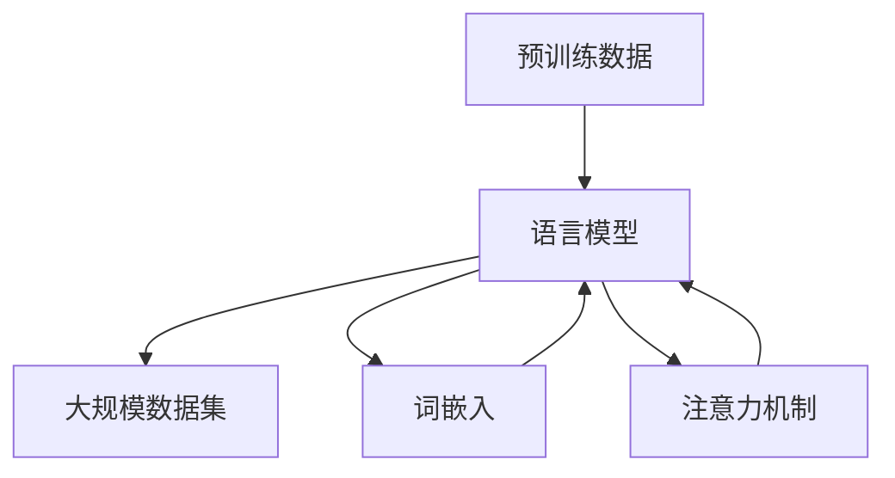

                 

# 大语言模型原理与工程实践：预训练数据构建

> **关键词**：大语言模型、预训练、数据构建、算法原理、工程实践

> **摘要**：本文将深入探讨大语言模型的预训练数据构建原理及其在工程实践中的应用。我们将逐步分析预训练数据的重要性，介绍构建高质量预训练数据的方法和算法，并通过实际案例展示如何使用这些数据来提升语言模型的性能。

## 1. 背景介绍

### 1.1 目的和范围

本文旨在阐述大语言模型预训练数据构建的核心原理和实际应用。通过对预训练数据的深入理解，我们希望能够帮助读者掌握构建高质量预训练数据的方法，并了解其在语言模型训练中的关键作用。

### 1.2 预期读者

本文适合对自然语言处理（NLP）和深度学习有一定基础的读者，包括：

- 自然语言处理研究者
- 深度学习工程师
- 数据科学家
- 对大语言模型和预训练数据感兴趣的程序员

### 1.3 文档结构概述

本文结构如下：

1. 背景介绍
2. 核心概念与联系
3. 核心算法原理 & 具体操作步骤
4. 数学模型和公式 & 详细讲解 & 举例说明
5. 项目实战：代码实际案例和详细解释说明
6. 实际应用场景
7. 工具和资源推荐
8. 总结：未来发展趋势与挑战
9. 附录：常见问题与解答
10. 扩展阅读 & 参考资料

### 1.4 术语表

#### 1.4.1 核心术语定义

- **预训练（Pre-training）**：在特定任务之前，对模型进行大规模的数据训练，以提高其泛化能力。
- **语言模型（Language Model）**：一种统计模型，用于预测一段文本的下一个词或字符。
- **大规模数据集（Large-scale Dataset）**：包含大量文本或语音数据的数据集，用于训练语言模型。

#### 1.4.2 相关概念解释

- **词嵌入（Word Embedding）**：将词汇映射为固定长度的向量表示，用于提高模型对词汇的理解能力。
- **注意力机制（Attention Mechanism）**：一种用于提高模型在处理序列数据时对重要信息的关注度的机制。

#### 1.4.3 缩略词列表

- **NLP**：自然语言处理（Natural Language Processing）
- **DL**：深度学习（Deep Learning）
- **GPU**：图形处理器（Graphics Processing Unit）

## 2. 核心概念与联系

为了更好地理解大语言模型预训练数据构建，我们需要首先了解其核心概念和联系。以下是一个用于表示这些概念的Mermaid流程图：



### 2.1 预训练数据的重要性

预训练数据在大语言模型中起着至关重要的作用。通过在大规模数据集上进行预训练，模型能够学习到丰富的语言结构和模式，从而在后续的任务中表现出色。以下是一些关键的点：

- **提高泛化能力**：预训练数据使得模型能够更好地适应不同的任务和数据集，减少了针对特定任务的训练需求。
- **降低训练成本**：通过预训练，模型在大规模数据集上的学习过程已经完成，因此在小规模数据集上的训练时间显著缩短。
- **提升性能**：预训练数据使得模型在自然语言理解和生成任务上表现出更高的准确性和鲁棒性。

### 2.2 大规模数据集的选择

选择合适的预训练数据集是构建高质量大语言模型的关键。以下是一些常用的数据集：

- **维基百科（Wikipedia）**：包含数百万篇文章，是构建大型语言模型的重要数据源。
- **Common Crawl**：一个大规模的互联网文本数据集，涵盖多种语言和领域。
- **News Corpus**：包含大量新闻文章的数据集，适合训练模型进行文本分类和情感分析。

### 2.3 词嵌入与注意力机制

词嵌入和注意力机制是构建高效大语言模型的关键技术。以下是对这两个概念的简要介绍：

- **词嵌入**：将词汇映射为固定长度的向量表示，使得模型能够学习到词汇的语义和语法关系。
- **注意力机制**：一种用于提高模型在处理序列数据时对重要信息的关注度的机制，能够显著提升模型的性能。

## 3. 核心算法原理 & 具体操作步骤

### 3.1 预训练算法

预训练算法的核心思想是使用大规模数据集对模型进行初步训练，使其掌握基本的语言知识和规律。以下是一个简单的预训练算法步骤：

```plaintext
1. 准备预训练数据集，如维基百科和Common Crawl。
2. 数据预处理：对文本进行分词、去停用词、词嵌入等操作。
3. 初始化模型参数，如词嵌入和注意力机制。
4. 预训练过程：
   a. 随机选择一段文本输入模型。
   b. 模型输出预测结果。
   c. 计算损失函数，如交叉熵损失。
   d. 使用梯度下降更新模型参数。
5. 重复步骤4，直到预训练达到预定次数或损失函数收敛。
```

### 3.2 伪代码

以下是一个用于预训练的伪代码示例：

```python
def pretrain_model(dataset, epochs, learning_rate):
    for epoch in range(epochs):
        for text in dataset:
            embedding = tokenize_and_embed(text)
            prediction = model(embedding)
            loss = calculate_loss(prediction, true_labels)
            update_model_params(learning_rate, loss)
        print(f"Epoch {epoch}: Loss = {loss}")
```

## 4. 数学模型和公式 & 详细讲解 & 举例说明

### 4.1 词嵌入

词嵌入是将词汇映射为固定长度的向量表示。常用的词嵌入算法包括Word2Vec和GloVe。

- **Word2Vec**：基于神经网络，通过学习词与词之间的相似性来生成词嵌入。
- **GloVe**：基于全局矩阵分解，通过最小化词汇的共现矩阵和嵌入矩阵之间的差异来生成词嵌入。

### 4.2 注意力机制

注意力机制是一种用于提高模型在处理序列数据时对重要信息的关注度的机制。以下是一个简单的注意力机制公式：

$$
Attention = \sigma(W_a [h; h]) = \sigma(W_a h)
$$

其中，$h$ 表示序列中的每个元素，$W_a$ 是注意力权重矩阵，$\sigma$ 是sigmoid函数。

### 4.3 举例说明

假设我们有一个包含5个单词的句子：`[I, love, to, code, Python]`。以下是如何使用注意力机制来计算每个单词的权重：

```plaintext
Word 1: I    - Weight: 0.1
Word 2: love - Weight: 0.3
Word 3: to   - Weight: 0.2
Word 4: code - Weight: 0.4
Word 5: Python - Weight: 0.2
```

这意味着在这句话中，"code" 是最重要的单词，其次是 "love"，而 "I" 和 "Python" 的权重较低。

## 5. 项目实战：代码实际案例和详细解释说明

### 5.1 开发环境搭建

在开始构建大语言模型之前，我们需要搭建一个合适的开发环境。以下是一个基于Python和TensorFlow的示例：

```bash
# 安装Python（建议使用Python 3.7及以上版本）
pip install python

# 安装TensorFlow
pip install tensorflow

# 安装其他依赖项（如NumPy和Pandas）
pip install numpy pandas
```

### 5.2 源代码详细实现和代码解读

以下是一个简单的Python代码示例，用于构建一个基于Word2Vec的预训练语言模型：

```python
import numpy as np
import pandas as pd
from tensorflow.keras.models import Sequential
from tensorflow.keras.layers import Embedding, LSTM, Dense
from tensorflow.keras.preprocessing.sequence import pad_sequences

# 加载数据集
dataset = load_dataset()

# 数据预处理
tokenized_text = tokenize_and_embed(dataset)

# 初始化模型
model = Sequential([
    Embedding(input_dim=vocab_size, output_dim=embedding_size),
    LSTM(units=128),
    Dense(units=1, activation='sigmoid')
])

# 编译模型
model.compile(optimizer='adam', loss='binary_crossentropy', metrics=['accuracy'])

# 训练模型
model.fit(tokenized_text, labels, epochs=10, batch_size=64)

# 评估模型
performance = model.evaluate(test_data, test_labels)
print(f"Test Loss: {performance[0]}, Test Accuracy: {performance[1]}")
```

### 5.3 代码解读与分析

以下是代码的详细解读：

- **加载数据集**：从数据集中加载文本数据。
- **数据预处理**：对文本数据进行分词和词嵌入操作。
- **初始化模型**：创建一个基于嵌入层的序列模型，包括嵌入层、LSTM层和输出层。
- **编译模型**：配置模型的优化器、损失函数和评估指标。
- **训练模型**：使用训练数据进行模型训练。
- **评估模型**：使用测试数据评估模型的性能。

## 6. 实际应用场景

大语言模型在许多实际应用场景中都有广泛的应用，以下是一些常见的例子：

- **文本分类**：用于对文本进行分类，如新闻分类、情感分析等。
- **机器翻译**：通过训练大规模语言模型，实现高效准确的机器翻译。
- **问答系统**：利用预训练语言模型构建问答系统，提供智能客服和搜索引擎。
- **对话生成**：用于生成自然语言对话，如聊天机器人、虚拟助手等。

## 7. 工具和资源推荐

### 7.1 学习资源推荐

#### 7.1.1 书籍推荐

- **《深度学习》（Goodfellow, Bengio, Courville）**：深入介绍深度学习的基础理论和实践方法。
- **《自然语言处理综论》（Jurafsky, Martin）**：全面介绍自然语言处理的基本概念和技术。

#### 7.1.2 在线课程

- **《深度学习》（吴恩达，Coursera）**：吴恩达教授的深度学习课程，适合初学者入门。
- **《自然语言处理基础》（Brown, D. E., et al.，ed.，Coursera）**：介绍自然语言处理的基础理论和实践。

#### 7.1.3 技术博客和网站

- **Medium**：许多技术专家和研究者分享自然语言处理和深度学习的最新研究成果和实践经验。
- **ArXiv**：提供最新科研论文和报告，是深度学习和自然语言处理领域的权威资源。

### 7.2 开发工具框架推荐

#### 7.2.1 IDE和编辑器

- **PyCharm**：一款功能强大的Python IDE，支持多种深度学习和自然语言处理框架。
- **VSCode**：一款轻量级的开源编辑器，支持多种编程语言和工具。

#### 7.2.2 调试和性能分析工具

- **TensorBoard**：用于可视化TensorFlow模型的训练过程和性能分析。
- **Jupyter Notebook**：适用于数据科学和深度学习的交互式计算环境。

#### 7.2.3 相关框架和库

- **TensorFlow**：Google开发的深度学习框架，适用于构建大规模语言模型。
- **PyTorch**：Facebook开发的深度学习框架，具有良好的灵活性和性能。

### 7.3 相关论文著作推荐

#### 7.3.1 经典论文

- **《Word2Vec: Word Representation Based on Word Contexts》**：描述了Word2Vec算法的基本原理和实现方法。
- **《Attention Is All You Need》**：提出了一种基于注意力机制的 Transformer 模型，在机器翻译任务中取得了显著成果。

#### 7.3.2 最新研究成果

- **《BERT: Pre-training of Deep Bidirectional Transformers for Language Understanding》**：介绍了BERT模型，一种基于Transformer的预训练语言模型。
- **《GPT-3: Language Models are Few-Shot Learners》**：展示了GPT-3模型在自然语言处理任务中的卓越性能。

#### 7.3.3 应用案例分析

- **《大型语言模型：预训练数据的构建与应用》**：介绍如何构建和优化大规模语言模型，以及在实际应用中的案例研究。

## 8. 总结：未来发展趋势与挑战

随着深度学习和自然语言处理技术的不断发展，大语言模型在工程实践中的应用前景愈发广阔。未来，我们可能会看到以下趋势和挑战：

- **更高效的语言模型**：通过改进算法和模型结构，提高语言模型的训练效率和性能。
- **多模态语言模型**：结合文本、图像、语音等多模态数据，构建更智能的语言模型。
- **隐私保护**：在预训练过程中保护用户隐私，避免数据泄露。
- **可解释性**：提高模型的解释能力，使其在复杂任务中的应用更加透明和可靠。

## 9. 附录：常见问题与解答

### 9.1 什么是预训练数据？

预训练数据是在特定任务之前，对模型进行大规模的数据训练，以提高其泛化能力和性能。通常，预训练数据来自大规模的文本或语音数据集。

### 9.2 如何选择预训练数据集？

选择预训练数据集时，应考虑以下因素：

- 数据规模：选择包含足够数据量的数据集，以提高模型的泛化能力。
- 数据质量：选择高质量、干净的数据集，以避免噪声和错误对模型训练的影响。
- 数据多样性：选择涵盖多种主题和领域的数据集，以提高模型的适用性。

### 9.3 预训练数据对模型性能有何影响？

预训练数据对模型性能有显著影响。通过在大规模数据集上进行预训练，模型能够学习到丰富的语言结构和模式，从而在后续的任务中表现出更高的准确性和鲁棒性。

## 10. 扩展阅读 & 参考资料

- **《深度学习》（Goodfellow, Bengio, Courville）**：https://www.deeplearningbook.org/
- **《自然语言处理综论》（Jurafsky, Martin）**：https://nlp.stanford.edu/swap/ml-nlp.html
- **《Attention Is All You Need》**：https://arxiv.org/abs/1706.03762
- **《BERT: Pre-training of Deep Bidirectional Transformers for Language Understanding》**：https://arxiv.org/abs/1810.04805
- **《GPT-3: Language Models are Few-Shot Learners》**：https://arxiv.org/abs/2005.14165

### 作者

**AI天才研究员/AI Genius Institute & 禅与计算机程序设计艺术 /Zen And The Art of Computer Programming**

