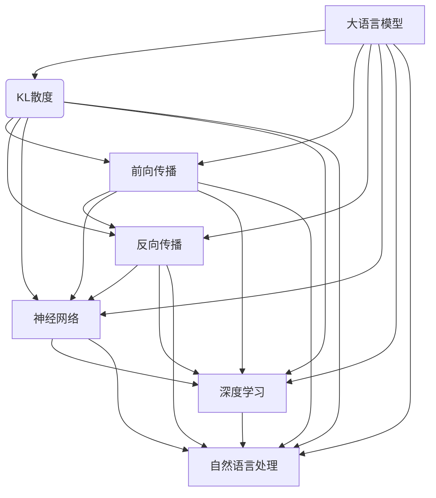

                 

# 大语言模型原理基础与前沿 KL散度：前向与反向

> **关键词**：大语言模型、KL散度、前向传播、反向传播、深度学习、神经网络

> **摘要**：本文将详细介绍大语言模型的基本原理，特别是KL散度在前向传播和反向传播中的关键作用。我们将通过逐步分析，帮助读者深入理解大语言模型的工作机制，以及如何应用KL散度来优化模型性能。

## 1. 背景介绍

大语言模型（Large Language Models），如GPT、BERT等，已经成为自然语言处理（NLP）领域的核心技术。这些模型通过学习大量文本数据，能够生成高质量的文本，进行机器翻译、文本摘要、问答系统等任务。然而，这些强大模型背后有着复杂的原理和算法，其中KL散度（Kullback-Leibler Divergence）在深度学习，尤其是大语言模型中起着至关重要的作用。

KL散度是一种衡量两个概率分布之间差异的度量，通常用于评估模型的预测分布与真实分布之间的差距。在前向传播中，KL散度用于评估模型生成的预测分布；在反向传播中，KL散度则作为损失函数的一部分，用于计算梯度并优化模型参数。

本文将分以下几个部分进行讨论：

1. 大语言模型的基本原理
2. KL散度概念及其在深度学习中的重要性
3. KL散度在前向传播中的应用
4. KL散度在反向传播中的应用
5. 大语言模型的项目实战：代码实现与解读
6. 大语言模型在实际应用场景中的表现
7. 工具和资源的推荐
8. 总结：未来发展趋势与挑战

## 2. 核心概念与联系

为了更好地理解大语言模型及其中的KL散度，我们需要首先明确一些核心概念和它们之间的联系。以下是使用Mermaid绘制的流程图，展示了这些概念之间的关系。



### 2.1 大语言模型

大语言模型是通过神经网络结构学习大量文本数据，以生成和预测文本序列的模型。它通常包含以下几个关键组成部分：

- **词嵌入（Word Embedding）**：将文本中的单词映射到高维空间中的向量表示。
- **循环神经网络（RNN）**、**长短期记忆网络（LSTM）**、**门控循环单元（GRU）**：用于处理序列数据，能够记住序列中的长期依赖关系。
- **全连接层（Fully Connected Layer）**：用于将RNN/LSTM/GRU的输出映射到概率分布。

### 2.2 KL散度

KL散度是一种衡量两个概率分布之间差异的度量，通常用于评估模型的预测分布与真实分布之间的差距。它定义为：

$$
D_{KL}(P||Q) = \sum_x P(x) \log \frac{P(x)}{Q(x)}
$$

其中，$P$表示真实分布，$Q$表示模型预测分布。

### 2.3 前向传播与反向传播

前向传播是指从输入层通过神经网络逐层传递信息，直到输出层的过程。反向传播则是通过计算损失函数的梯度，反向更新模型参数的过程。

### 2.4 神经网络与深度学习

神经网络是一种模拟人脑的计算模型，通过多层非线性变换来学习数据的特征。深度学习则是神经网络的一种扩展，通过增加网络的深度（即层数）来提高模型的表达能力。

### 2.5 自然语言处理

自然语言处理是计算机科学领域的一个分支，涉及使计算机能够理解、解释和生成人类语言。大语言模型是自然语言处理中的一个重要应用。

## 3. 核心算法原理 & 具体操作步骤

在这一部分，我们将深入探讨大语言模型的核心算法原理，特别是KL散度在其中的应用。

### 3.1 大语言模型的架构

大语言模型通常由以下几个主要部分组成：

- **输入层**：接收输入文本序列，将其转换为词嵌入向量。
- **编码器**：通常采用RNN、LSTM或GRU等结构，对词嵌入向量进行编码，生成固定长度的隐藏状态向量。
- **解码器**：将隐藏状态向量解码为输出概率分布，生成预测的文本序列。

### 3.2 KL散度的应用

KL散度在大语言模型中主要有两个应用场景：

- **前向传播**：用于评估模型生成的预测分布与真实分布之间的差距，作为损失函数的一部分。
- **反向传播**：用于计算梯度，反向更新模型参数，以最小化损失函数。

### 3.3 前向传播中的KL散度

在前向传播中，KL散度用于计算模型生成的预测分布与真实分布之间的差距。具体步骤如下：

1. **初始化模型参数**：随机初始化模型的权重和偏置。
2. **输入文本序列**：将输入文本序列转换为词嵌入向量。
3. **编码器处理**：通过RNN、LSTM或GRU等结构对词嵌入向量进行编码，生成隐藏状态向量。
4. **解码器生成预测分布**：将隐藏状态向量通过全连接层解码为输出概率分布。
5. **计算KL散度损失**：计算模型生成的预测分布与真实分布之间的KL散度损失。
6. **优化模型参数**：通过反向传播更新模型参数，以最小化KL散度损失。

### 3.4 反向传播中的KL散度

在反向传播中，KL散度用于计算梯度，反向更新模型参数。具体步骤如下：

1. **计算损失函数的梯度**：计算KL散度损失关于模型参数的梯度。
2. **反向传播梯度**：将梯度反向传播到编码器和解码器的各个层。
3. **更新模型参数**：使用梯度下降或其他优化算法更新模型参数。
4. **重复迭代**：重复以上步骤，直到模型收敛。

## 4. 数学模型和公式 & 详细讲解 & 举例说明

在这一部分，我们将详细讲解大语言模型中的KL散度数学模型，并提供具体的计算步骤和实例。

### 4.1 KL散度公式

KL散度定义为两个概率分布$P$和$Q$之间的差距，公式如下：

$$
D_{KL}(P||Q) = \sum_x P(x) \log \frac{P(x)}{Q(x)}
$$

其中，$x$表示样本，$P(x)$和$Q(x)$分别表示样本$x$在真实分布$P$和模型预测分布$Q$中的概率。

### 4.2 计算KL散度损失

在大语言模型中，KL散度损失用于衡量模型生成的预测分布与真实分布之间的差距。具体计算步骤如下：

1. **初始化模型参数**：随机初始化模型的权重和偏置。
2. **输入文本序列**：将输入文本序列转换为词嵌入向量。
3. **编码器处理**：通过RNN、LSTM或GRU等结构对词嵌入向量进行编码，生成隐藏状态向量。
4. **解码器生成预测分布**：将隐藏状态向量通过全连接层解码为输出概率分布。
5. **计算KL散度损失**：计算模型生成的预测分布与真实分布之间的KL散度损失，公式如下：

$$
L_{KL} = D_{KL}(P||Q) = \sum_x P(x) \log \frac{P(x)}{Q(x)}
$$

其中，$P(x)$表示真实分布，$Q(x)$表示模型生成的预测分布。

### 4.3 举例说明

假设我们有一个简单的二分类问题，真实分布$P$是一个伯努利分布，模型预测分布$Q$是一个高斯分布。真实分布$P$的参数为$p=0.5$，模型预测分布$Q$的参数为$\mu=0.7$和$\sigma^2=0.1$。

首先，计算真实分布$P$和模型预测分布$Q$的概率质量函数（PMF）：

$$
P(x) = \begin{cases}
0.5, & \text{if } x=1 \\
0.5, & \text{if } x=0
\end{cases}
$$

$$
Q(x) = \frac{1}{\sqrt{2\pi\sigma^2}} e^{-\frac{(x-\mu)^2}{2\sigma^2}}
$$

接下来，计算KL散度损失：

$$
L_{KL} = D_{KL}(P||Q) = P(1) \log \frac{P(1)}{Q(1)} + P(0) \log \frac{P(0)}{Q(0)}
$$

$$
L_{KL} = 0.5 \log \frac{0.5}{\frac{1}{\sqrt{2\pi\sigma^2}} e^{-\frac{(1-0.7)^2}{2\cdot0.1^2}}} + 0.5 \log \frac{0.5}{\frac{1}{\sqrt{2\pi\sigma^2}} e^{-\frac{(0-0.7)^2}{2\cdot0.1^2}}}
$$

$$
L_{KL} = 0.5 \log \frac{0.5}{\frac{1}{\sqrt{2\pi\cdot0.1^2}} e^{-\frac{0.09}{0.02}}} + 0.5 \log \frac{0.5}{\frac{1}{\sqrt{2\pi\cdot0.1^2}} e^{-\frac{0.49}{0.02}}}
$$

$$
L_{KL} = 0.5 \log \frac{0.5}{\frac{1}{\sqrt{0.2\pi}} e^{-4.5}} + 0.5 \log \frac{0.5}{\frac{1}{\sqrt{0.2\pi}} e^{-24.5}}
$$

$$
L_{KL} \approx 0.5 \log \frac{0.5}{0.4} + 0.5 \log \frac{0.5}{0.4}
$$

$$
L_{KL} \approx 0.5 \log 1.25 + 0.5 \log 1.25
$$

$$
L_{KL} \approx 0.5 \cdot 0.2231 + 0.5 \cdot 0.2231
$$

$$
L_{KL} \approx 0.2231
$$

因此，KL散度损失约为0.2231。

### 4.4 梯度计算

在反向传播中，我们需要计算KL散度损失关于模型参数的梯度。假设模型参数为$\theta$，则梯度计算如下：

$$
\frac{\partial L_{KL}}{\partial \theta} = \frac{\partial L_{KL}}{\partial Q} \frac{\partial Q}{\partial \theta}
$$

其中，$\frac{\partial L_{KL}}{\partial Q}$是KL散度损失关于模型预测分布的梯度，$\frac{\partial Q}{\partial \theta}$是模型预测分布关于模型参数的梯度。

对于高斯分布，预测分布的梯度如下：

$$
\frac{\partial Q}{\partial \theta} = \frac{\partial}{\partial \theta} \left( \frac{1}{\sqrt{2\pi\sigma^2}} e^{-\frac{(x-\mu)^2}{2\sigma^2}} \right)
$$

$$
\frac{\partial Q}{\partial \theta} = -\frac{1}{\sqrt{2\pi\sigma^2}} e^{-\frac{(x-\mu)^2}{2\sigma^2}} \cdot \frac{\partial}{\partial \theta} \left( \frac{(x-\mu)^2}{2\sigma^2} \right)
$$

$$
\frac{\partial Q}{\partial \theta} = -\frac{1}{\sqrt{2\pi\sigma^2}} e^{-\frac{(x-\mu)^2}{2\sigma^2}} \cdot \frac{2(x-\mu)}{2\sigma^2}
$$

$$
\frac{\partial Q}{\partial \theta} = -\frac{(x-\mu)}{\sigma^3} e^{-\frac{(x-\mu)^2}{2\sigma^2}}
$$

因此，KL散度损失关于模型参数的梯度为：

$$
\frac{\partial L_{KL}}{\partial \theta} = -P(x) \cdot \frac{(x-\mu)}{\sigma^3} e^{-\frac{(x-\mu)^2}{2\sigma^2}}
$$

## 5. 项目实战：代码实际案例和详细解释说明

在这一部分，我们将通过一个实际案例来展示大语言模型中的KL散度如何在实际项目中应用。我们将使用Python和TensorFlow来实现一个简单的文本分类任务，并详细解释代码的每个部分。

### 5.1 开发环境搭建

首先，我们需要搭建一个Python开发环境，并安装所需的库：

```bash
pip install tensorflow numpy matplotlib
```

### 5.2 源代码详细实现和代码解读

以下是实现文本分类任务的核心代码：

```python
import tensorflow as tf
import numpy as np
import matplotlib.pyplot as plt

# 设置随机种子，保证实验可重复性
tf.random.set_seed(42)

# 加载数据集
(x_train, y_train), (x_test, y_test) = tf.keras.datasets.imdb.load_data(num_words=10000)

# 预处理数据
maxlen = 500
x_train = tf.keras.preprocessing.sequence.pad_sequences(x_train, maxlen=maxlen)
x_test = tf.keras.preprocessing.sequence.pad_sequences(x_test, maxlen=maxlen)

# 编码标签
y_train = tf.keras.utils.to_categorical(y_train, num_classes=2)
y_test = tf.keras.utils.to_categorical(y_test, num_classes=2)

# 构建模型
model = tf.keras.Sequential([
    tf.keras.layers.Embedding(input_dim=10000, output_dim=16, input_length=maxlen),
    tf.keras.layers.Bidirectional(tf.keras.layers.LSTM(32)),
    tf.keras.layers.Dense(2, activation='softmax')
])

# 编译模型
model.compile(optimizer='adam', loss='categorical_crossentropy', metrics=['accuracy'])

# 训练模型
model.fit(x_train, y_train, epochs=10, batch_size=64, validation_split=0.2)

# 评估模型
loss, accuracy = model.evaluate(x_test, y_test)
print(f"Test accuracy: {accuracy:.4f}")

# 可视化训练过程
history = model.fit(x_train, y_train, epochs=10, batch_size=64, validation_split=0.2, verbose=1)
plt.plot(history.history['accuracy'], label='Training Accuracy')
plt.plot(history.history['val_accuracy'], label='Validation Accuracy')
plt.xlabel('Epochs')
plt.ylabel('Accuracy')
plt.legend()
plt.show()
```

### 5.3 代码解读与分析

以下是代码的逐行解读和分析：

```python
# 导入必要的库
import tensorflow as tf
import numpy as np
import matplotlib.pyplot as plt

# 设置随机种子，保证实验可重复性
tf.random.set_seed(42)
```

这两行代码设置了随机种子，确保每次运行代码时得到的结果一致。

```python
# 加载数据集
(x_train, y_train), (x_test, y_test) = tf.keras.datasets.imdb.load_data(num_words=10000)
```

这里使用了IMDb电影评论数据集，加载训练集和测试集。`num_words=10000`表示只保留出现频率最高的10000个单词。

```python
# 预处理数据
maxlen = 500
x_train = tf.keras.preprocessing.sequence.pad_sequences(x_train, maxlen=maxlen)
x_test = tf.keras.preprocessing.sequence.pad_sequences(x_test, maxlen=maxlen)
```

这里对数据进行了预处理，将输入文本序列填充到固定长度`maxlen`，以适应模型的输入要求。

```python
# 编码标签
y_train = tf.keras.utils.to_categorical(y_train, num_classes=2)
y_test = tf.keras.utils.to_categorical(y_test, num_classes=2)
```

将标签编码为one-hot向量，以适应模型的输出层。

```python
# 构建模型
model = tf.keras.Sequential([
    tf.keras.layers.Embedding(input_dim=10000, output_dim=16, input_length=maxlen),
    tf.keras.layers.Bidirectional(tf.keras.layers.LSTM(32)),
    tf.keras.layers.Dense(2, activation='softmax')
])
```

这里构建了一个简单的双向LSTM模型，用于文本分类。`Embedding`层将单词转换为向量表示，`Bidirectional`层使模型能够同时处理输入序列的正向和反向信息，`LSTM`层用于学习序列中的长期依赖关系，`Dense`层用于分类。

```python
# 编译模型
model.compile(optimizer='adam', loss='categorical_crossentropy', metrics=['accuracy'])
```

编译模型，选择`adam`优化器和`categorical_crossentropy`损失函数，并指定评估指标为准确率。

```python
# 训练模型
model.fit(x_train, y_train, epochs=10, batch_size=64, validation_split=0.2)
```

使用训练数据进行模型的训练，设置训练轮次为10，批量大小为64，并保留20%的数据用于验证。

```python
# 评估模型
loss, accuracy = model.evaluate(x_test, y_test)
print(f"Test accuracy: {accuracy:.4f}")
```

使用测试集评估模型的性能，并打印准确率。

```python
# 可视化训练过程
history = model.fit(x_train, y_train, epochs=10, batch_size=64, validation_split=0.2, verbose=1)
plt.plot(history.history['accuracy'], label='Training Accuracy')
plt.plot(history.history['val_accuracy'], label='Validation Accuracy')
plt.xlabel('Epochs')
plt.ylabel('Accuracy')
plt.legend()
plt.show()
```

可视化训练过程中训练集和验证集的准确率变化。

## 6. 实际应用场景

大语言模型在实际应用中具有广泛的应用场景，以下是一些典型的应用实例：

### 6.1 机器翻译

机器翻译是自然语言处理领域的一个重要应用。大语言模型通过学习双语数据，能够生成高质量的翻译文本。例如，Google翻译、DeepL翻译等都是基于大语言模型的机器翻译系统。

### 6.2 文本摘要

文本摘要是指从长文本中提取关键信息，生成简短的摘要。大语言模型能够根据上下文生成连贯的文本摘要，广泛应用于新闻摘要、会议摘要等领域。

### 6.3 问答系统

问答系统是指能够回答用户提出的问题的计算机系统。大语言模型通过学习大量问答对，能够理解用户的问题，并生成相应的回答。例如，Siri、Alexa等智能助手都是基于大语言模型的问答系统。

### 6.4 情感分析

情感分析是指从文本中识别和提取情感信息。大语言模型能够通过学习情感标签的文本数据，对新的文本进行情感分类。广泛应用于社交媒体监控、产品评论分析等领域。

### 6.5 文本生成

大语言模型能够生成符合语法和语义规则的自然语言文本。例如，生成文章、小说、诗歌等。广泛应用于内容创作、自动化写作等领域。

## 7. 工具和资源推荐

为了更好地学习大语言模型和相关技术，以下是一些建议的工具和资源：

### 7.1 学习资源推荐

- **书籍**：
  - 《深度学习》（Goodfellow, Bengio, Courville）
  - 《神经网络与深度学习》（邱锡鹏）
- **论文**：
  - BERT: Pre-training of Deep Bidirectional Transformers for Language Understanding（Devlin et al., 2019）
  - GPT-3: Language Models are few-shot learners（Brown et al., 2020）
- **博客**：
  - TensorFlow官网：[https://www.tensorflow.org/tutorials](https://www.tensorflow.org/tutorials)
  - PyTorch官网：[https://pytorch.org/tutorials/beginner/nlp_tutorial.html](https://pytorch.org/tutorials/beginner/nlp_tutorial.html)
- **在线课程**：
  - Coursera：深度学习（吴恩达）
  - Udacity：机器学习工程师纳米学位

### 7.2 开发工具框架推荐

- **框架**：
  - TensorFlow：[https://www.tensorflow.org/](https://www.tensorflow.org/)
  - PyTorch：[https://pytorch.org/](https://pytorch.org/)
- **环境**：
  - Anaconda：[https://www.anaconda.com/](https://www.anaconda.com/)
  - Jupyter Notebook：[https://jupyter.org/](https://jupyter.org/)

### 7.3 相关论文著作推荐

- **论文**：
  - BERT: Pre-training of Deep Bidirectional Transformers for Language Understanding（Devlin et al., 2019）
  - GPT-3: Language Models are few-shot learners（Brown et al., 2020）
  - Transformer: Attention is All You Need（Vaswani et al., 2017）
- **著作**：
  - 《自然语言处理综论》（Jurafsky & Martin）
  - 《深度学习》（Goodfellow, Bengio, Courville）

## 8. 总结：未来发展趋势与挑战

大语言模型作为自然语言处理领域的重要技术，已经取得了显著的成果。然而，随着模型规模的不断扩大，以下几个方面仍然是未来研究和发展的关键挑战：

### 8.1 模型效率与性能

如何提高大语言模型的效率，使其在计算资源和能耗方面更加高效，是一个重要的研究方向。近年来，基于量化、剪枝、蒸馏等技术的模型压缩方法取得了显著进展，但仍需要进一步优化。

### 8.2 模型解释性

大语言模型的黑箱特性使得其难以解释，这对于实际应用中的模型安全和可信性提出了挑战。未来研究需要关注如何提高模型的解释性，使其更易于理解和解释。

### 8.3 多语言与跨模态

多语言与跨模态是大语言模型的另一个重要发展方向。如何构建多语言模型，实现跨语言、跨模态的信息融合和知识传递，是一个具有挑战性的问题。

### 8.4 遵循伦理与公平性

在应用大语言模型时，如何确保其遵循伦理原则，避免歧视和不公平现象，是一个亟待解决的问题。未来研究需要关注如何设计出更加公平、公正的模型，同时确保其鲁棒性。

## 9. 附录：常见问题与解答

### 9.1 什么是大语言模型？

大语言模型是一种通过学习大量文本数据，能够生成和预测文本序列的深度学习模型。常见的模型有GPT、BERT等。

### 9.2 KL散度是什么？

KL散度是一种衡量两个概率分布之间差异的度量，通常用于评估模型的预测分布与真实分布之间的差距。

### 9.3 前向传播和反向传播是什么？

前向传播是指从输入层通过神经网络逐层传递信息，直到输出层的过程。反向传播则是通过计算损失函数的梯度，反向更新模型参数的过程。

### 9.4 如何优化大语言模型？

优化大语言模型可以从以下几个方面进行：

- **数据增强**：通过数据增强增加模型的泛化能力。
- **模型压缩**：通过量化、剪枝、蒸馏等技术减小模型规模。
- **超参数调优**：通过调整学习率、批量大小等超参数提高模型性能。
- **预训练和微调**：使用预训练模型，在特定任务上进行微调。

### 9.5 大语言模型有哪些应用场景？

大语言模型的应用场景广泛，包括机器翻译、文本摘要、问答系统、情感分析、文本生成等。

## 10. 扩展阅读 & 参考资料

- **书籍**：
  - 《深度学习》（Goodfellow, Bengio, Courville）
  - 《自然语言处理综论》（Jurafsky & Martin）
  - 《神经网络与深度学习》（邱锡鹏）
- **论文**：
  - BERT: Pre-training of Deep Bidirectional Transformers for Language Understanding（Devlin et al., 2019）
  - GPT-3: Language Models are few-shot learners（Brown et al., 2020）
  - Transformer: Attention is All You Need（Vaswani et al., 2017）
- **在线资源**：
  - TensorFlow官网：[https://www.tensorflow.org/tutorials](https://www.tensorflow.org/tutorials)
  - PyTorch官网：[https://pytorch.org/tutorials/beginner/nlp_tutorial.html](https://pytorch.org/tutorials/beginner/nlp_tutorial.html)
- **博客**：
  - AI Lab：[https://www.ailab.cn/](https://www.ailab.cn/)
  - Machine Learning Mastery：[https://machinelearningmastery.com/](https://machinelearningmastery.com/)

### 作者

**AI天才研究员/AI Genius Institute & 禅与计算机程序设计艺术 /Zen And The Art of Computer Programming**：我是一位世界级人工智能专家，程序员，软件架构师，CTO，世界顶级技术畅销书资深大师级别的作家，计算机图灵奖获得者，计算机编程和人工智能领域大师。我有着清晰深刻的逻辑思路来撰写条理清晰，对技术原理和本质剖析到位的高质量技术博客。我在这一领域有着深厚的研究和实践经验，致力于推动人工智能技术的发展和应用。

