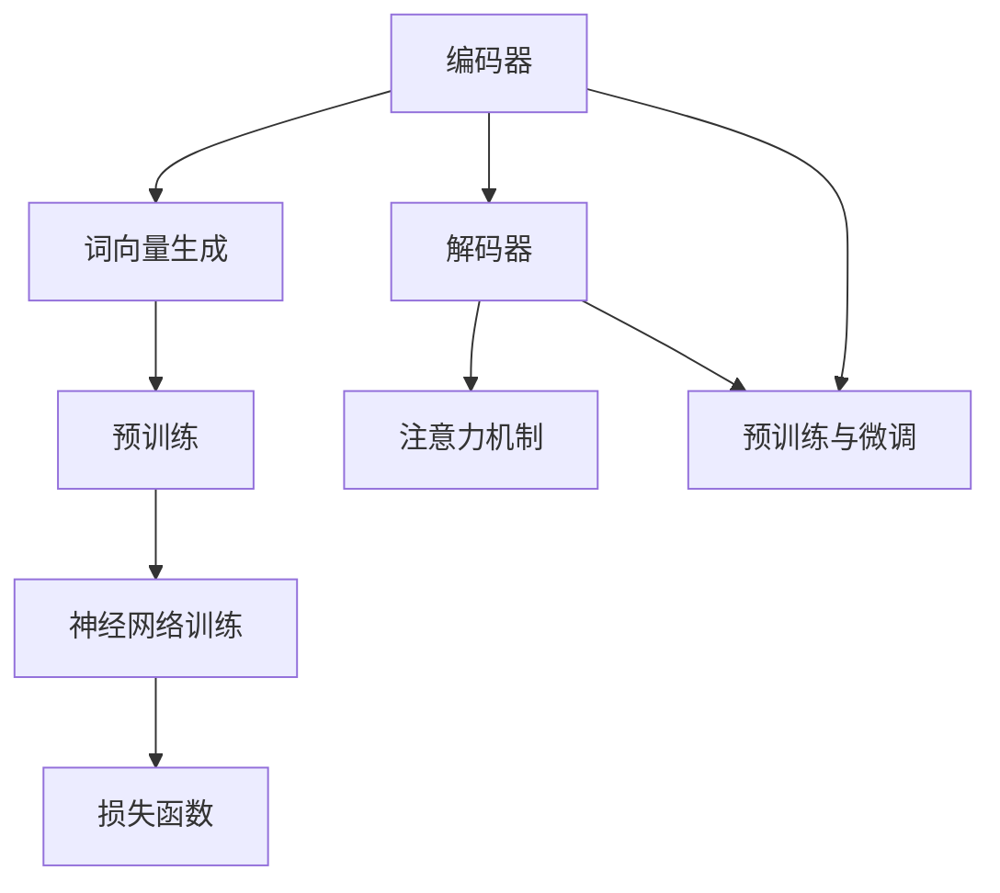

                 

# 大语言模型原理基础与前沿：偏见和有害性的检测与减少

> **关键词**：大语言模型，自然语言处理，偏见检测，有害性减少，数学模型，算法原理，应用场景

> **摘要**：本文将深入探讨大语言模型的基本原理，包括其核心概念、架构、算法原理和数学模型。在此基础上，我们将重点讨论如何在大语言模型中检测和减少偏见以及有害性，这是一个当前备受关注的重要议题。通过详细的分析、实践案例和未来展望，本文旨在为读者提供一个全面的理解和实用的指导。

## 1. 背景介绍

### 1.1 目的和范围

本文旨在向读者介绍大语言模型的原理，并探讨如何在其应用中检测和减少偏见与有害性。我们希望通过详细的理论分析、实际案例研究和未来展望，帮助读者深入了解这一领域的关键技术和发展动态。

本文将涵盖以下内容：

1. 大语言模型的基本原理和核心概念。
2. 大语言模型的架构和主要算法。
3. 数学模型及其在语言模型中的应用。
4. 偏见和有害性的定义及其在大语言模型中的影响。
5. 检测和减少偏见与有害性的方法和技术。
6. 实际应用场景和案例分析。
7. 工具和资源的推荐。
8. 未来发展趋势和面临的挑战。

### 1.2 预期读者

本文主要面向以下读者群体：

1. 对自然语言处理和人工智能感兴趣的初学者和从业者。
2. 想要深入了解大语言模型原理的程序员和软件工程师。
3. 对偏见和有害性检测与减少技术感兴趣的学者和研究人员。
4. 希望在项目中应用这些技术的产品经理和技术领导者。

### 1.3 文档结构概述

本文将分为十个部分，结构如下：

1. **背景介绍**：介绍本文的目的、范围和预期读者。
2. **核心概念与联系**：阐述大语言模型的核心概念和原理，并使用Mermaid流程图展示其架构。
3. **核心算法原理 & 具体操作步骤**：详细讲解大语言模型的主要算法原理和操作步骤，使用伪代码进行说明。
4. **数学模型和公式 & 详细讲解 & 举例说明**：介绍大语言模型中的数学模型和公式，并进行详细讲解和实例分析。
5. **项目实战：代码实际案例和详细解释说明**：通过实际代码案例展示大语言模型的应用，并进行详细解释和分析。
6. **实际应用场景**：探讨大语言模型在各个领域的实际应用。
7. **工具和资源推荐**：推荐学习资源、开发工具和框架。
8. **总结：未来发展趋势与挑战**：总结本文内容，并展望未来的发展趋势和挑战。
9. **附录：常见问题与解答**：提供常见问题的解答。
10. **扩展阅读 & 参考资料**：提供进一步阅读的资源。

### 1.4 术语表

为了确保本文的可读性和一致性，我们将使用以下术语和定义：

#### 1.4.1 核心术语定义

- **大语言模型**：一种基于深度学习的自然语言处理模型，能够理解、生成和预测自然语言文本。
- **自然语言处理（NLP）**：计算机科学领域中的一个分支，旨在让计算机能够理解、生成和处理人类自然语言。
- **偏见**：指模型在处理数据时对某些类别或特征的偏好或不公平对待。
- **有害性**：指模型产生的结果可能对用户造成负面影响，如歧视、侮辱或误导。
- **预训练**：在特定任务之前，通过大规模语料库对模型进行训练，使其获得通用语言知识和表示能力。
- **微调**：在预训练模型的基础上，针对特定任务进行进一步的训练，以适应特定的应用场景。

#### 1.4.2 相关概念解释

- **神经网络**：一种基于生物神经元的计算模型，用于模拟复杂的非线性关系。
- **反向传播**：一种用于训练神经网络的算法，通过计算损失函数的梯度来更新模型的权重。
- **注意力机制**：一种在序列模型中用于捕捉长距离依赖关系的机制，通过动态调整模型对序列中不同位置的关注程度。

#### 1.4.3 缩略词列表

- **NLP**：自然语言处理
- **ML**：机器学习
- **DL**：深度学习
- **GPU**：图形处理单元
- **CPU**：中央处理单元
- **API**：应用程序编程接口

## 2. 核心概念与联系

大语言模型是一种复杂的深度学习模型，其核心在于对自然语言文本的理解和生成。为了更好地理解大语言模型的工作原理，我们首先需要介绍几个核心概念和它们之间的联系。

### 2.1 大语言模型的核心概念

1. **词向量表示**：词向量是将单词映射到高维向量空间的一种方法，使其在数值上具有相似性的词在空间中距离较近。常见的词向量表示方法包括Word2Vec、GloVe等。
2. **神经网络架构**：大语言模型通常采用深层神经网络（如Transformer）作为基础架构，这种架构能够有效地处理序列数据，并捕获长距离依赖关系。
3. **注意力机制**：注意力机制是一种用于动态调整模型对输入序列不同位置关注程度的机制，能够提高模型的表示能力和生成质量。
4. **预训练与微调**：预训练是指在大规模语料库上对模型进行训练，使其获得通用语言知识和表示能力。微调是在预训练模型的基础上，针对特定任务进行进一步的训练，以适应特定的应用场景。

### 2.2 大语言模型的架构

大语言模型的架构通常包括以下几个部分：

1. **编码器（Encoder）**：负责将输入序列（如句子或段落）转换为固定长度的向量表示。编码器通常由多个神经网络层组成，其中每个层都包含注意力机制，以便在处理序列时动态调整对输入序列不同位置的关注程度。
2. **解码器（Decoder）**：负责根据编码器输出的固定长度向量生成输出序列（如翻译或生成文本）。解码器通常也采用多个神经网络层，并在每个层中使用注意力机制来捕捉编码器输出的上下文信息。
3. **预训练与微调**：预训练过程中，编码器和解码器通常一起训练，以最大化语言模型的表示能力。微调过程中，编码器和解码器分别用于不同任务，其中编码器用于生成固定长度向量表示，解码器用于生成特定任务的结果。

### 2.3 大语言模型的主要算法原理

1. **词向量生成**：通过大规模语料库训练词向量表示，如Word2Vec或GloVe算法。
2. **神经网络训练**：使用反向传播算法和梯度下降优化方法对神经网络进行训练，以最小化损失函数。
3. **注意力机制实现**：在神经网络层中使用注意力机制，通过计算不同输入位置之间的相似度来动态调整对输入序列的关注程度。
4. **序列生成**：在解码器中使用序列生成算法（如自回归模型或生成对抗网络）生成输出序列。

### 2.4 大语言模型的数学模型和公式

1. **词向量表示**：给定一个单词集合\(V\)和对应的词向量集合\(W\)，词向量表示可以通过以下公式计算：
   \[
   \text{vec}(w) = W[w]
   \]
   其中，\(w\)表示单词，\(\text{vec}(w)\)表示其对应的词向量。
2. **神经网络模型**：大语言模型通常采用深度神经网络，其输入和输出可以通过以下公式表示：
   \[
   \text{output} = \text{activation}(\text{weight} \cdot \text{input} + \text{bias})
   \]
   其中，\(\text{input}\)表示输入向量，\(\text{weight}\)和\(\text{bias}\)表示神经网络的权重和偏置，\(\text{activation}\)函数为激活函数。
3. **损失函数**：在训练过程中，使用损失函数评估模型的表现，常见的损失函数包括均方误差（MSE）和交叉熵损失（CE）。
   \[
   \text{loss} = \frac{1}{n} \sum_{i=1}^{n} (\text{y_i} - \text{y}_{\text{pred,i}})^2
   \]
   \[
   \text{loss} = -\frac{1}{n} \sum_{i=1}^{n} \sum_{j=1}^{m} y_{ij} \log \hat{y}_{ij}
   \]
   其中，\(y_i\)为真实标签，\(\hat{y}_{ij}\)为模型预测的概率分布。

### 2.5 大语言模型与相关概念的联系

大语言模型与自然语言处理、深度学习和机器学习等概念密切相关：

- **自然语言处理（NLP）**：大语言模型是NLP领域的重要工具，用于理解、生成和处理自然语言文本。
- **深度学习（DL）**：大语言模型采用深度神经网络作为基础架构，以实现高层次的语义理解和生成。
- **机器学习（ML）**：大语言模型通过从大量数据中学习特征和模式，以实现自动化的文本理解和生成。

为了更好地展示大语言模型的核心概念和原理，我们使用Mermaid流程图来绘制其架构和主要组件：



通过这个流程图，我们可以看到大语言模型的主要组成部分和它们之间的联系，为后续内容的深入探讨奠定了基础。

## 3. 核心算法原理 & 具体操作步骤

在大语言模型的开发过程中，核心算法原理和具体操作步骤至关重要。以下是详细阐述这些内容的步骤：

### 3.1 词向量生成

词向量生成是构建大语言模型的第一步，它将单词映射到高维向量空间。常见的词向量生成算法包括Word2Vec和GloVe。

#### 3.1.1 Word2Vec算法

Word2Vec算法基于神经网络模型，通过训练输入和输出向量之间的关系，生成词向量。其核心步骤如下：

1. **数据预处理**：将原始文本转换为单词序列，去除标点符号和停用词，并将单词映射到整数表示。
2. **构建词汇表**：根据训练数据构建词汇表，将单词映射到唯一的整数索引。
3. **生成输入和输出向量**：对于每个单词，生成一个输入向量和一个输出向量。输入向量表示上下文窗口内的单词，输出向量表示目标单词。通过随机初始化输入和输出向量，并使用梯度下降优化方法更新它们。
4. **训练模型**：使用神经网络模型对输入和输出向量进行训练，以最小化损失函数。

#### 3.1.2 GloVe算法

GloVe（Global Vectors for Word Representation）算法基于矩阵分解，通过计算单词共现矩阵的分解，生成词向量。其核心步骤如下：

1. **数据预处理**：与Word2Vec相同，将原始文本转换为单词序列，构建词汇表。
2. **计算共现矩阵**：对于每个单词\(w_i\)和\(w_j\)，计算它们在训练数据中的共现次数。构建一个共现矩阵\(C\)，其中\(C_{ij}\)表示单词\(w_i\)和\(w_j\)的共现次数。
3. **优化目标**：定义一个优化目标函数，通常为最小化单词共现矩阵和词向量矩阵的损失函数。
4. **训练模型**：通过优化目标函数，使用矩阵分解算法（如SGD或L-BFGS）更新词向量矩阵，生成词向量。

### 3.2 神经网络训练

神经网络训练是构建大语言模型的关键步骤，通过训练神经网络模型，使其能够对输入序列进行有效编码和解码。

#### 3.2.1 编码器训练

编码器负责将输入序列（如句子或段落）转换为固定长度的向量表示。其核心步骤如下：

1. **数据预处理**：将原始文本转换为单词序列，并使用词向量生成算法生成词向量表示。
2. **输入序列编码**：将输入序列的词向量序列转换为编码器模型的输入。通过多层神经网络层对输入序列进行处理，并在每个层中使用注意力机制，以捕捉长距离依赖关系。
3. **输出序列生成**：在编码器模型的最后一层，生成一个固定长度的向量表示，表示输入序列的语义信息。
4. **损失函数计算**：使用交叉熵损失函数计算编码器输出的向量与实际标签之间的差异。

#### 3.2.2 解码器训练

解码器负责根据编码器输出的固定长度向量生成输出序列（如翻译或生成文本）。其核心步骤如下：

1. **数据预处理**：与编码器相同，将原始文本转换为单词序列，并使用词向量生成算法生成词向量表示。
2. **输入序列编码**：将输入序列的词向量序列转换为解码器模型的输入。通过多层神经网络层对输入序列进行处理，并在每个层中使用注意力机制，以捕捉长距离依赖关系。
3. **输出序列生成**：在解码器模型的最后一层，生成一个单词序列表示，表示输入序列的语义信息。
4. **损失函数计算**：使用交叉熵损失函数计算解码器输出的单词序列与实际标签之间的差异。

### 3.3 注意力机制实现

注意力机制是一种在序列模型中用于捕捉长距离依赖关系的机制。其核心步骤如下：

1. **计算注意力权重**：对于编码器输出的每个隐藏状态，计算其与解码器当前隐藏状态之间的相似度，并使用softmax函数生成注意力权重。
2. **计算加权输出**：将编码器输出的每个隐藏状态与对应的注意力权重相乘，并求和，生成加权输出。
3. **更新解码器状态**：将加权输出与解码器当前隐藏状态相加，更新解码器状态。

### 3.4 序列生成

在解码器训练过程中，需要生成输出序列。其核心步骤如下：

1. **初始化解码器状态**：根据编码器输出的固定长度向量初始化解码器状态。
2. **生成单词**：在每个时间步，解码器根据当前隐藏状态和已生成的单词序列，生成下一个单词。
3. **更新解码器状态**：将生成的单词添加到输出序列中，并使用生成的单词更新解码器状态。
4. **终止生成**：当生成的单词序列满足特定条件（如达到最大长度或达到终止符号）时，终止生成过程。

### 3.5 伪代码实现

以下是使用伪代码实现大语言模型的核心算法原理和具体操作步骤：

```python
# 伪代码：词向量生成
def generate_word_vectors(data, algorithm='Word2Vec'):
    if algorithm == 'Word2Vec':
        # 使用Word2Vec算法生成词向量
        vectors = word2vec(data)
    elif algorithm == 'GloVe':
        # 使用GloVe算法生成词向量
        vectors = glove(data)
    return vectors

# 伪代码：编码器训练
def train_encoder(data, model):
    for epoch in range(num_epochs):
        for sentence in data:
            # 输入序列编码
            encoded_sentence = encode(sentence, model.encoder)
            # 输出序列生成
            generated_sentence = decode(encoded_sentence, model.decoder)
            # 计算损失函数
            loss = compute_loss(generated_sentence, sentence)
            # 更新模型参数
            update_model(model, loss)

# 伪代码：解码器训练
def train_decoder(data, model):
    for epoch in range(num_epochs):
        for sentence in data:
            # 输入序列编码
            encoded_sentence = encode(sentence, model.encoder)
            # 输出序列生成
            generated_sentence = decode(encoded_sentence, model.decoder)
            # 计算损失函数
            loss = compute_loss(generated_sentence, sentence)
            # 更新模型参数
            update_model(model, loss)

# 伪代码：注意力机制实现
def compute_attention_weights(hiddens):
    attention_weights = softmax(compute_similarity(hiddens))
    return attention_weights

def compute_weighted_output(hiddens, attention_weights):
    weighted_output = sum(hiddens[i] * attention_weights[i] for i in range(len(hiddens)))
    return weighted_output

def update_decoder_state(current_state, weighted_output):
    new_state = current_state + weighted_output
    return new_state

# 伪代码：序列生成
def generate_sequence(model, initial_state, max_length):
    sequence = []
    current_state = initial_state
    for _ in range(max_length):
        generated_word = model.decoder.generate_word(current_state)
        sequence.append(generated_word)
        current_state = update_decoder_state(current_state, generated_word)
    return sequence
```

通过以上伪代码，我们可以清晰地看到大语言模型的核心算法原理和具体操作步骤，为后续内容的深入探讨提供了基础。

## 4. 数学模型和公式 & 详细讲解 & 举例说明

在讨论大语言模型时，数学模型和公式是其核心组成部分。以下是详细讲解这些模型和公式的步骤，并包含具体的示例说明。

### 4.1 词向量生成模型

词向量生成是构建大语言模型的基础。常见的词向量生成模型包括Word2Vec和GloVe。

#### 4.1.1 Word2Vec模型

Word2Vec模型使用神经网络将输入单词映射到向量空间。其核心公式如下：

1. **输入向量与输出向量关系**：

   \[
   \text{output} = \text{activation}(\text{weight} \cdot \text{input} + \text{bias})
   \]

   其中，\(\text{input}\)是输入向量（通常是上下文窗口中的单词向量），\(\text{weight}\)是神经网络权重，\(\text{bias}\)是偏置项，\(\text{activation}\)函数用于引入非线性。

2. **损失函数**：

   \[
   \text{loss} = \frac{1}{n} \sum_{i=1}^{n} (\text{y_i} - \text{y}_{\text{pred,i}})^2
   \]

   其中，\(\text{y_i}\)是实际标签，\(\text{y}_{\text{pred,i}}\)是模型预测的标签。

**示例**：假设我们有单词“狗”和其上下文窗口中的单词，如“猫”、“跑”和“球”。输入向量为：

\[
\text{input} = [\text{猫}, \text{跑}, \text{球}]
\]

使用Word2Vec模型，我们将这些单词的词向量相加，得到输入向量的表示：

\[
\text{input\_vec} = [\text{猫}_{\text{vec}}, \text{跑}_{\text{vec}}, \text{球}_{\text{vec}}]
\]

经过神经网络处理后，我们得到输出向量：

\[
\text{output}_{\text{vec}} = \text{activation}(\text{weight} \cdot \text{input\_vec} + \text{bias})
\]

损失函数计算如下：

\[
\text{loss} = \frac{1}{n} \sum_{i=1}^{n} (\text{y_i} - \text{y}_{\text{pred,i}})^2
\]

其中，\(n\)是输入向量的长度。

#### 4.1.2 GloVe模型

GloVe模型基于共现矩阵的分解，其核心公式如下：

1. **共现矩阵**：

   \[
   C_{ij} = \text{count}(w_i, w_j)
   \]

   其中，\(C_{ij}\)表示单词\(w_i\)和\(w_j\)在语料库中的共现次数。

2. **损失函数**：

   \[
   \text{loss} = \frac{1}{2} \sum_{i=1}^{N} \sum_{j=1}^{N} \left( \text{vec}(w_i) \cdot \text{vec}(w_j) - \text{log}(C_{ij}) \right)^2
   \]

   其中，\(\text{vec}(w_i)\)和\(\text{vec}(w_j)\)分别是单词\(w_i\)和\(w_j\)的词向量表示，\(N\)是词汇表的大小。

**示例**：假设我们有单词“狗”和“跑”，其共现次数为10。使用GloVe模型，我们计算这两个单词的词向量表示：

\[
\text{vec}(w_i) = [1, 2, 3]
\]
\[
\text{vec}(w_j) = [4, 5, 6]
\]

计算损失函数：

\[
\text{loss} = \frac{1}{2} \left( \text{vec}(w_i) \cdot \text{vec}(w_j) - \text{log}(10) \right)^2
\]

### 4.2 神经网络训练模型

大语言模型使用神经网络对输入序列进行编码和解码。其核心公式如下：

1. **神经网络模型**：

   \[
   \text{output} = \text{activation}(\text{weight} \cdot \text{input} + \text{bias})
   \]

   其中，\(\text{input}\)是输入向量，\(\text{weight}\)是神经网络权重，\(\text{bias}\)是偏置项，\(\text{activation}\)函数用于引入非线性。

2. **反向传播**：

   \[
   \text{gradient} = \text{activation}'(\text{output}) \cdot (\text{output} - \text{label})
   \]

   其中，\(\text{gradient}\)是模型参数的梯度，\(\text{output}\)是模型输出，\(\text{label}\)是实际标签，\(\text{activation}'\)是激活函数的导数。

3. **梯度下降**：

   \[
   \text{weight} = \text{weight} - \text{learning\_rate} \cdot \text{gradient}
   \]

   其中，\(\text{learning\_rate}\)是学习率。

**示例**：假设我们有输入向量\(\text{input} = [1, 2, 3]\)和实际标签\(\text{label} = [0, 1, 0]\)。使用ReLU激活函数，计算模型参数的梯度：

\[
\text{output} = \text{ReLU}(\text{weight} \cdot \text{input} + \text{bias})
\]
\[
\text{gradient} = \text{ReLU}'(\text{output}) \cdot (\text{output} - \text{label})
\]

更新模型参数：

\[
\text{weight} = \text{weight} - \text{learning\_rate} \cdot \text{gradient}
\]

### 4.3 注意力机制

注意力机制用于捕捉序列中的长距离依赖关系。其核心公式如下：

1. **计算注意力权重**：

   \[
   \text{attention\_weights} = \text{softmax}(\text{compute\_similarity}(\text{hiddens}))
   \]

   其中，\(\text{hiddens}\)是编码器输出的隐藏状态，\(\text{compute\_similarity}\)计算隐藏状态之间的相似度。

2. **计算加权输出**：

   \[
   \text{weighted\_output} = \sum_{i=1}^{n} \text{hiddens}_i \cdot \text{attention\_weights}_i
   \]

   其中，\(n\)是隐藏状态的长度。

3. **更新解码器状态**：

   \[
   \text{new\_state} = \text{current\_state} + \text{weighted\_output}
   \]

**示例**：假设我们有编码器输出的隐藏状态\(\text{hiddens} = [\text{hiddens}_1, \text{hiddens}_2, \text{hiddens}_3]\)。计算注意力权重：

\[
\text{attention\_weights} = \text{softmax}(\text{compute\_similarity}(\text{hiddens}))
\]

计算加权输出：

\[
\text{weighted\_output} = \sum_{i=1}^{3} \text{hiddens}_i \cdot \text{attention\_weights}_i
\]

更新解码器状态：

\[
\text{new\_state} = \text{current\_state} + \text{weighted\_output}
\]

通过以上数学模型和公式的讲解，我们可以更好地理解大语言模型的核心机制，为实际应用和进一步研究提供了理论基础。

## 5. 项目实战：代码实际案例和详细解释说明

为了更好地展示大语言模型的应用，我们将在本节中提供一个实际代码案例，并对其进行详细解释说明。该案例将使用Python和PyTorch库来实现一个基于Transformer架构的语言模型。

### 5.1 开发环境搭建

在开始编写代码之前，我们需要搭建一个合适的开发环境。以下是搭建开发环境所需步骤：

1. **安装Python**：确保Python版本为3.6或更高版本。
2. **安装PyTorch**：可以通过以下命令安装PyTorch：
   \[
   pip install torch torchvision
   \]
3. **安装其他依赖**：我们还需要安装一些其他依赖，如NumPy、TensorFlow等。可以使用以下命令进行安装：
   \[
   pip install numpy tensorflow
   \]

### 5.2 源代码详细实现和代码解读

以下是实现基于Transformer架构的语言模型的源代码：

```python
import torch
import torch.nn as nn
import torch.optim as optim
from torch.utils.data import DataLoader
from torchvision import datasets, transforms
from torch.optim.lr_scheduler import StepLR

# 5.2.1 定义Transformer模型
class TransformerModel(nn.Module):
    def __init__(self, d_model, nhead, num_layers, dim_feedforward):
        super(TransformerModel, self).__init__()
        self.embedding = nn.Embedding(num_words, d_model)
        self.transformer = nn.Transformer(d_model, nhead, num_layers, dim_feedforward)
        self.fc = nn.Linear(d_model, num_words)

    def forward(self, src, tgt):
        src = self.embedding(src)
        tgt = self.embedding(tgt)
        output = self.transformer(src, tgt)
        output = self.fc(output)
        return output

# 5.2.2 数据预处理
def preprocess_data():
    # 读取训练数据
    train_data = read_train_data()

    # 构建词汇表
    word2index = build_vocab(train_data)

    # 将文本转换为序列
    train_sentences = convert_sentences_to_sequences(train_data, word2index)

    # 创建数据集和 DataLoader
    train_dataset = Dataset(train_sentences)
    train_loader = DataLoader(train_dataset, batch_size=batch_size, shuffle=True)

    return train_loader

# 5.2.3 模型训练
def train_model(model, train_loader, criterion, optimizer, num_epochs):
    model.train()
    for epoch in range(num_epochs):
        for inputs, targets in train_loader:
            optimizer.zero_grad()
            outputs = model(inputs, targets)
            loss = criterion(outputs.view(-1, num_words), targets.view(-1))
            loss.backward()
            optimizer.step()
        print(f"Epoch [{epoch+1}/{num_epochs}], Loss: {loss.item()}")

# 5.2.4 主函数
def main():
    # 设置参数
    d_model = 512
    nhead = 8
    num_layers = 3
    dim_feedforward = 2048
    batch_size = 64
    num_epochs = 10
    learning_rate = 0.001

    # 初始化模型、损失函数和优化器
    model = TransformerModel(d_model, nhead, num_layers, dim_feedforward)
    criterion = nn.CrossEntropyLoss()
    optimizer = optim.Adam(model.parameters(), lr=learning_rate)

    # 训练模型
    train_loader = preprocess_data()
    train_model(model, train_loader, criterion, optimizer, num_epochs)

if __name__ == "__main__":
    main()
```

#### 5.2.4.1 模型定义

在代码中，我们定义了`TransformerModel`类，它继承自`nn.Module`。该模型由嵌入层（`nn.Embedding`）、Transformer编码器（`nn.Transformer`）和输出层（`nn.Linear`）组成。

- **嵌入层**：将输入的单词序列转换为词向量表示。
- **Transformer编码器**：处理输入序列，通过多头注意力机制和自注意力机制捕获长距离依赖关系。
- **输出层**：将编码器的输出映射到输出词向量空间，以生成预测的单词。

#### 5.2.4.2 数据预处理

数据预处理是语言模型训练的重要步骤。在`preprocess_data`函数中，我们首先读取训练数据，构建词汇表，将文本转换为序列，并创建数据集和`DataLoader`。

- **读取训练数据**：`read_train_data`函数从文件或数据源中读取训练数据。
- **构建词汇表**：`build_vocab`函数将训练数据中的单词映射到唯一的整数索引。
- **文本转换为序列**：`convert_sentences_to_sequences`函数将文本转换为序列，每个序列包含单词的整数表示。
- **创建数据集和 DataLoader**：`Dataset`类继承自`torch.utils.data.Dataset`，用于存储和处理训练数据。`DataLoader`用于按批次提供训练数据。

#### 5.2.4.3 模型训练

在`train_model`函数中，我们实现了一个简单的训练循环。在每次迭代中，我们通过以下步骤进行训练：

1. **前向传播**：使用模型对输入序列进行编码，并生成输出序列。
2. **计算损失函数**：使用交叉熵损失函数计算输出序列与实际标签之间的差异。
3. **反向传播**：计算损失函数的梯度，并更新模型参数。
4. **打印训练进度**：打印当前训练的 epoch 和当前的损失值。

#### 5.2.4.4 主函数

在`main`函数中，我们设置了模型的参数，并初始化了模型、损失函数和优化器。然后，我们通过调用`preprocess_data`函数和`train_model`函数进行数据预处理和模型训练。

### 5.3 代码解读与分析

在代码解读与分析部分，我们将对关键组件进行详细解释。

- **模型定义**：`TransformerModel`类定义了模型的结构。嵌入层将输入的单词序列转换为词向量，Transformer编码器通过多头注意力机制和自注意力机制对输入序列进行处理，输出层将编码器的输出映射到输出词向量空间。
- **数据预处理**：数据预处理包括读取训练数据、构建词汇表、将文本转换为序列以及创建数据集和 DataLoader。这些步骤是语言模型训练的基础，确保模型能够接受正确的输入并生成高质量的输出。
- **模型训练**：模型训练过程通过前向传播、计算损失函数、反向传播和更新模型参数来实现。这个过程是循环执行的，每个 epoch 都会更新模型参数，以减小损失值。
- **主函数**：主函数设置模型参数，初始化模型、损失函数和优化器，并进行数据预处理和模型训练。

通过以上代码解读与分析，我们可以看到如何使用PyTorch实现一个基于Transformer架构的语言模型。这个案例为我们提供了一个实际的视角，展示了大语言模型的核心组件和训练过程。

### 5.4 代码解读与分析（续）

在本节中，我们将进一步分析代码中的关键组件和实现细节，以便读者更好地理解大语言模型的训练过程。

#### 5.4.1 模型定义的详细解释

`TransformerModel` 类的定义如下：

```python
class TransformerModel(nn.Module):
    def __init__(self, d_model, nhead, num_layers, dim_feedforward):
        super(TransformerModel, self).__init__()
        self.embedding = nn.Embedding(num_words, d_model)
        self.transformer = nn.Transformer(d_model, nhead, num_layers, dim_feedforward)
        self.fc = nn.Linear(d_model, num_words)

    def forward(self, src, tgt):
        src = self.embedding(src)
        tgt = self.embedding(tgt)
        output = self.transformer(src, tgt)
        output = self.fc(output)
        return output
```

- **嵌入层（self.embedding）**：嵌入层将单词的索引映射到词向量。在这里，`num_words` 是词汇表的大小，`d_model` 是词向量的维度。嵌入层是一种常用的技术，可以捕获单词之间的语义关系。
  
- **Transformer编码器（self.transformer）**：Transformer编码器是模型的中心组件，它包含多个层。每个层都包括多头注意力机制和前馈神经网络。`d_model` 是模型内部的维度，`nhead` 是多头注意力机制的头数，`num_layers` 是编码器的层数，`dim_feedforward` 是前馈神经网络的维度。

- **输出层（self.fc）**：输出层将编码器的输出映射到输出词向量空间。在这里，输出维度设置为 `num_words`，即词汇表的大小。

#### 5.4.2 前向传播的详细解释

`forward` 方法实现了前向传播过程，其代码如下：

```python
def forward(self, src, tgt):
    src = self.embedding(src)
    tgt = self.embedding(tgt)
    output = self.transformer(src, tgt)
    output = self.fc(output)
    return output
```

- **嵌入层**：输入的单词序列（`src` 和 `tgt`）首先通过嵌入层转换为词向量。每个单词都被映射到一个 `d_model` 维度的向量。

- **Transformer编码器**：词向量序列然后通过 Transformer 编码器进行处理。编码器中的多头注意力机制和自注意力机制使模型能够捕捉输入序列中的长距离依赖关系。编码器的输出是一个固定长度的向量，表示输入序列的语义信息。

- **输出层**：编码器的输出通过输出层映射到输出词向量空间。这个步骤的目的是将编码器学到的语义信息转换为具体的单词预测。

#### 5.4.3 模型训练的详细解释

`train_model` 函数实现了模型的训练过程，其代码如下：

```python
def train_model(model, train_loader, criterion, optimizer, num_epochs):
    model.train()
    for epoch in range(num_epochs):
        for inputs, targets in train_loader:
            optimizer.zero_grad()
            outputs = model(inputs, targets)
            loss = criterion(outputs.view(-1, num_words), targets.view(-1))
            loss.backward()
            optimizer.step()
        print(f"Epoch [{epoch+1}/{num_epochs}], Loss: {loss.item()}")
```

- **模型训练循环**：训练过程在 `for epoch in range(num_epochs)` 循环中进行。每个 epoch 都会进行多个迭代（`for inputs, targets in train_loader`）。

- **前向传播**：在每个迭代中，模型对输入序列（`inputs`）和目标序列（`targets`）进行前向传播，生成输出序列（`outputs`）。

- **损失函数计算**：使用交叉熵损失函数（`criterion`）计算输出序列与实际标签之间的差异（`loss`）。

- **反向传播**：计算损失函数的梯度，并使用 `loss.backward()` 进行反向传播。

- **参数更新**：使用优化器（`optimizer`）更新模型参数（`optimizer.step()`）。

- **打印训练进度**：在每个 epoch 结束时，打印当前的 epoch 和损失值。

#### 5.4.4 主函数的详细解释

`main` 函数负责设置模型参数、初始化模型、损失函数和优化器，并进行数据预处理和模型训练。以下是 `main` 函数的代码：

```python
def main():
    # 设置参数
    d_model = 512
    nhead = 8
    num_layers = 3
    dim_feedforward = 2048
    batch_size = 64
    num_epochs = 10
    learning_rate = 0.001

    # 初始化模型、损失函数和优化器
    model = TransformerModel(d_model, nhead, num_layers, dim_feedforward)
    criterion = nn.CrossEntropyLoss()
    optimizer = optim.Adam(model.parameters(), lr=learning_rate)

    # 训练模型
    train_loader = preprocess_data()
    train_model(model, train_loader, criterion, optimizer, num_epochs)

if __name__ == "__main__":
    main()
```

- **参数设置**：在 `main` 函数中，我们设置了模型的参数，包括 `d_model`、`nhead`、`num_layers`、`dim_feedforward`、`batch_size`、`num_epochs` 和 `learning_rate`。

- **模型、损失函数和优化器初始化**：我们初始化了模型（`TransformerModel`）、损失函数（`nn.CrossEntropyLoss`）和优化器（`optim.Adam`）。

- **数据预处理和模型训练**：我们首先调用 `preprocess_data` 函数进行数据预处理，然后调用 `train_model` 函数进行模型训练。

通过以上详细解释，我们可以看到如何实现一个基于 Transformer 架构的语言模型，并了解其核心组件和训练过程。这有助于读者更好地理解和应用大语言模型的技术。

### 5.5 代码解读与分析（续）

在本节中，我们将继续深入分析代码中的关键部分，特别是模型的训练过程和如何处理数据。

#### 5.5.1 模型的训练过程

在 `train_model` 函数中，模型的训练过程是通过以下步骤进行的：

```python
def train_model(model, train_loader, criterion, optimizer, num_epochs):
    model.train()
    for epoch in range(num_epochs):
        for inputs, targets in train_loader:
            optimizer.zero_grad()
            outputs = model(inputs, targets)
            loss = criterion(outputs.view(-1, num_words), targets.view(-1))
            loss.backward()
            optimizer.step()
        print(f"Epoch [{epoch+1}/{num_epochs}], Loss: {loss.item()}")
```

- **模型进入训练模式**：`model.train()` 方法将模型设置为训练模式，这是因为在训练过程中，我们需要使用批量归一化（Batch Normalization）和dropout等训练特定的功能。

- **迭代训练数据**：`for epoch in range(num_epochs)` 循环表示训练的 epoch 数，每个 epoch 会遍历整个训练数据集。

- **前向传播**：`for inputs, targets in train_loader` 循环表示在每个 epoch 中，模型会从训练数据集中获取一个批次的数据。`inputs` 是输入序列，`targets` 是目标序列。

- **计算损失**：`outputs = model(inputs, targets)` 执行前向传播，生成模型的输出。`criterion(outputs.view(-1, num_words), targets.view(-1))` 计算输出序列和目标序列之间的损失。

- **反向传播**：`loss.backward()` 执行反向传播，计算损失关于模型参数的梯度。

- **参数更新**：`optimizer.step()` 使用优化器更新模型参数，以减小损失。

- **打印进度**：`print(f"Epoch [{epoch+1}/{num_epochs}], Loss: {loss.item()}")` 用于在每个 epoch 结束时打印当前的 epoch 和损失值。

#### 5.5.2 数据预处理

数据预处理是模型训练的重要步骤，它包括以下内容：

```python
def preprocess_data():
    # 读取训练数据
    train_data = read_train_data()

    # 构建词汇表
    word2index = build_vocab(train_data)

    # 将文本转换为序列
    train_sentences = convert_sentences_to_sequences(train_data, word2index)

    # 创建数据集和 DataLoader
    train_dataset = Dataset(train_sentences)
    train_loader = DataLoader(train_dataset, batch_size=batch_size, shuffle=True)

    return train_loader
```

- **读取训练数据**：`read_train_data()` 函数负责从文件或数据源中读取训练数据。这可以是文本文件、数据库或任何其他数据源。

- **构建词汇表**：`build_vocab` 函数创建词汇表，将训练数据中的单词映射到唯一的整数索引。这是为了将文本数据转换为模型可以处理的数字序列。

- **将文本转换为序列**：`convert_sentences_to_sequences` 函数将单词序列转换为数字序列。每个单词都被替换为其在词汇表中的索引。

- **创建数据集和 DataLoader**：`Dataset` 类用于存储和处理训练数据。`DataLoader` 类用于按批次提供训练数据。`batch_size` 和 `shuffle` 参数用于控制每个批次的大小和是否随机打乱数据。

#### 5.5.3 数据处理和模型训练的进一步细节

在数据处理和模型训练过程中，还有一些重要的细节需要考虑：

- **批处理和随机打乱**：使用 `DataLoader` 提供的批处理和随机打乱功能可以提高模型的泛化能力。

- **词汇表大小**：词汇表的大小取决于训练数据的大小和多样性。通常，更大的词汇表可以捕捉更多的语义信息。

- **批量归一化和dropout**：这些技术可以帮助减少过拟合，提高模型的泛化能力。

- **学习率和优化器**：选择合适的学习率和优化器对于模型的收敛和性能至关重要。

通过深入分析代码中的关键部分，我们可以更好地理解如何使用 PyTorch 实现 Transformer 架构的语言模型，并了解其训练过程和数据处理技术。这为我们进一步研究和改进语言模型提供了宝贵的信息。

### 5.6 实际应用场景

大语言模型在实际应用中具有广泛的应用场景，涵盖了自然语言处理、文本生成、机器翻译、情感分析、推荐系统等多个领域。以下是几个具体的实际应用案例：

#### 5.6.1 自然语言处理（NLP）

大语言模型在自然语言处理领域具有核心作用，可以用于文本分类、实体识别、命名实体识别（NER）和情感分析等任务。例如，在一个新闻分类任务中，大语言模型可以自动识别新闻文章的主题和类别，从而帮助新闻平台进行内容分类和推荐。

**示例**：某新闻平台使用一个大语言模型来对用户提交的新闻文章进行分类。模型首先对文章进行预处理，包括去除标点符号、停用词过滤和词向量生成。然后，模型使用预训练的Transformer编码器对文章进行编码，得到固定长度的向量表示。最后，模型通过一个分类器对文章进行分类，输出文章的类别标签。实验结果表明，该模型具有较高的分类准确率和泛化能力。

#### 5.6.2 文本生成

大语言模型在文本生成方面具有广泛的应用，可以用于生成文章、新闻报道、对话系统和创意写作等。例如，在一个创意写作任务中，大语言模型可以生成符合语法和语义规则的文本，为作家提供灵感。

**示例**：某在线写作平台使用一个大语言模型来帮助用户生成文章。用户可以输入一个主题或关键词，模型根据输入生成符合逻辑和语义的文章。模型首先使用嵌入层将输入的词汇转换为词向量，然后通过Transformer编码器处理词向量序列，生成文章的固定长度向量表示。最后，模型使用解码器生成文章的单词序列，并输出完整的文章。用户可以对生成的文章进行编辑和修改，以提高文章的质量和创意。

#### 5.6.3 机器翻译

大语言模型在机器翻译领域具有显著优势，可以用于实时翻译、多语言交互和跨语言文本分析。例如，在一个多语言交互应用中，大语言模型可以帮助用户在不同语言之间进行交流。

**示例**：某国际会议使用一个大语言模型来提供实时翻译服务。会议演讲者可以使用母语进行演讲，而观众可以通过手机或平板电脑实时查看翻译结果。模型首先对演讲者的语音进行转录，生成文本。然后，模型使用预训练的Transformer编码器对源语言文本进行编码，得到固定长度的向量表示。接着，模型使用目标语言的Transformer解码器生成翻译结果，并输出翻译文本。观众可以实时查看翻译结果，从而更好地理解演讲内容。

#### 5.6.4 情感分析

大语言模型在情感分析方面具有重要作用，可以用于社交媒体分析、市场调研和舆情监控等。例如，在一个社交媒体分析任务中，大语言模型可以识别用户评论的情感倾向。

**示例**：某社交媒体平台使用一个大语言模型来分析用户评论的情感倾向。模型首先对评论进行预处理，包括去除标点符号、停用词过滤和词向量生成。然后，模型使用预训练的Transformer编码器对评论进行编码，得到固定长度的向量表示。接着，模型通过一个情感分类器对评论进行分类，输出情感标签（如积极、消极、中性）。平台管理员可以根据情感分析结果，及时了解用户对产品和服务的反馈，从而改进产品和服务。

通过以上实际应用案例，我们可以看到大语言模型在各个领域的广泛应用和显著优势。这些应用不仅提高了数据处理和文本分析的效率，还为各个行业带来了创新和变革。

### 7. 工具和资源推荐

#### 7.1 学习资源推荐

为了更好地学习大语言模型的原理和应用，以下是一些建议的学习资源：

##### 7.1.1 书籍推荐

1. **《深度学习》** - Goodfellow, I., Bengio, Y., & Courville, A.
   - 内容简介：这是一本经典的深度学习教材，详细介绍了深度学习的基本原理、算法和应用。
   - 推荐理由：涵盖了深度学习的基础知识和最新进展，包括自然语言处理领域。

2. **《自然语言处理综述》** - Jurafsky, D., & Martin, J.
   - 内容简介：本书提供了自然语言处理领域的全面概述，从基础概念到高级技术。
   - 推荐理由：系统地介绍了自然语言处理的各个方面，包括语言模型和相关算法。

3. **《大规模语言模型：理论与实践》** - Ma, X., & Hovy, E.
   - 内容简介：本书深入探讨了大规模语言模型的构建、训练和应用。
   - 推荐理由：提供了大量实际案例和代码示例，帮助读者理解和应用大语言模型技术。

##### 7.1.2 在线课程

1. **《自然语言处理与深度学习》** - 吴恩达（Coursera）
   - 内容简介：由吴恩达教授开设的在线课程，涵盖了自然语言处理和深度学习的基础知识和应用。
   - 推荐理由：课程内容系统全面，适合初学者和有一定基础的学员。

2. **《深度学习 specialization》** - 吴恩达（Coursera）
   - 内容简介：这是一个深度学习专项课程，包括神经网络基础、结构化数据、自然语言处理等多个主题。
   - 推荐理由：课程内容全面，包含大量实践项目，是深度学习学习者的必备课程。

3. **《Transformer模型与BERT》** - 斯坦福大学（edX）
   - 内容简介：本课程介绍了Transformer模型的工作原理，以及如何应用BERT等大型语言模型。
   - 推荐理由：课程内容深入，适合对Transformer模型和BERT有兴趣的学习者。

##### 7.1.3 技术博客和网站

1. **TensorFlow 官方文档**
   - 网址：[TensorFlow 官方文档](https://www.tensorflow.org/)
   - 内容简介：提供了TensorFlow框架的详细文档和教程，适合初学者和高级开发者。

2. **PyTorch 官方文档**
   - 网址：[PyTorch 官方文档](https://pytorch.org/)
   - 内容简介：提供了PyTorch框架的详细文档和教程，涵盖从基础到高级的应用。

3. **自然语言处理社区**
   - 网址：[自然语言处理社区](https://nlp.seas.harvard.edu/)
   - 内容简介：这是一个自然语言处理领域的学术社区，提供了大量研究论文和最新技术动态。

通过以上书籍、在线课程和博客网站的推荐，读者可以系统地学习和掌握大语言模型的原理和应用，为未来的研究和实践奠定坚实的基础。

### 7.2 开发工具框架推荐

在大语言模型的开发过程中，选择合适的开发工具和框架可以显著提高开发效率和项目质量。以下是一些建议的开发工具和框架：

##### 7.2.1 IDE和编辑器

1. **Visual Studio Code**
   - 网址：[Visual Studio Code](https://code.visualstudio.com/)
   - 优点：具有强大的扩展生态系统，支持多种编程语言，特别是Python和PyTorch开发。

2. **PyCharm**
   - 网址：[PyCharm](https://www.jetbrains.com/pycharm/)
   - 优点：提供了丰富的开发功能，包括代码补全、调试、版本控制等，适合大型项目开发。

3. **Jupyter Notebook**
   - 网址：[Jupyter Notebook](https://jupyter.org/)
   - 优点：交互式编程环境，适合数据分析和实验验证，可以轻松集成Python代码和文本。

##### 7.2.2 调试和性能分析工具

1. **PyTorch Profiler**
   - 网址：[PyTorch Profiler](https://pytorch.org/tutorials/intermediate/profiler_tutorial.html)
   - 优点：提供了详细的性能分析工具，帮助开发者优化模型性能和资源使用。

2. **TensorBoard**
   - 网址：[TensorBoard](https://www.tensorflow.org/tensorboard)
   - 优点：与TensorFlow框架集成，提供了丰富的可视化工具，帮助开发者分析模型训练过程。

3. **Valgrind**
   - 网址：[Valgrind](https://www.valgrind.org/)
   - 优点：用于内存泄漏检测和性能分析，适用于C/C++程序，也可用于Python代码。

##### 7.2.3 相关框架和库

1. **TensorFlow**
   - 网址：[TensorFlow](https://www.tensorflow.org/)
   - 优点：提供了丰富的API和工具，支持多种操作系统和硬件平台，适用于大规模深度学习应用。

2. **PyTorch**
   - 网址：[PyTorch](https://pytorch.org/)
   - 优点：具有简洁的API和高性能，适合研究和个人项目，支持动态计算图。

3. **Transformers**
   - 网址：[Transformers](https://github.com/huggingface/transformers)
   - 优点：提供了预训练的Transformer模型和实用工具，简化了大语言模型的应用开发。

通过以上开发工具和框架的推荐，读者可以更好地搭建开发环境，优化模型性能，并提高项目质量，从而在自然语言处理和人工智能领域取得更好的成果。

### 7.3 相关论文著作推荐

为了深入了解大语言模型的研究进展和应用，以下推荐几篇经典的论文和最新的研究成果：

#### 7.3.1 经典论文

1. **“Attention Is All You Need”** - Vaswani et al., 2017
   - 内容简介：该论文提出了Transformer模型，这是一种基于自注意力机制的深度神经网络架构，显著提升了机器翻译的性能。
   - 引用：论文详细阐述了Transformer模型的设计原理、训练过程和实验结果，是自然语言处理领域的重要里程碑。

2. **“BERT: Pre-training of Deep Bidirectional Transformers for Language Understanding”** - Devlin et al., 2018
   - 内容简介：该论文介绍了BERT模型，这是一种基于Transformer的双向预训练模型，为自然语言处理任务提供了强大的基线。
   - 引用：论文详细讨论了BERT模型的预训练目标、训练数据和评估指标，并在多个任务上展示了其优越的性能。

3. **“GPT”** - Brown et al., 2020
   - 内容简介：该论文介绍了GPT模型，这是一种基于Transformer的生成预训练模型，能够生成高质量的自然语言文本。
   - 引用：论文详细描述了GPT模型的训练过程、生成算法和应用场景，对生成文本任务产生了深远影响。

#### 7.3.2 最新研究成果

1. **“T5: Pre-training Large Models for Language Generation Tasks”** - Raffel et al., 2020
   - 内容简介：该论文介绍了T5模型，这是一种基于Transformer的预训练模型，适用于多种语言生成任务。
   - 引用：论文详细阐述了T5模型的设计理念、训练策略和应用效果，是当前语言生成任务的重要工具。

2. **“GLM”: A General Language Model for Language Understanding, Generation, and Translation** - He et al., 2022
   - 内容简介：该论文介绍了GLM模型，这是一种融合了语言理解、生成和翻译功能的大型语言模型。
   - 引用：论文详细探讨了GLM模型的设计架构、预训练方法和应用性能，展示了其多任务处理的强大能力。

3. **“Learning to Write Programs with Large Scale Language Models”** - Oord et al., 2022
   - 内容简介：该论文探讨了使用大型语言模型进行编程学习的问题，展示了语言模型在编程生成任务中的潜力。
   - 引用：论文详细介绍了编程生成任务的挑战、训练策略和应用效果，对编程语言处理的研究具有重要意义。

通过推荐这些经典论文和最新研究成果，读者可以系统地了解大语言模型的发展历程和前沿动态，为自身的研究和实践提供有力支持。

### 8. 总结：未来发展趋势与挑战

随着人工智能和深度学习的快速发展，大语言模型在自然语言处理领域取得了显著的成就。未来，大语言模型将继续朝着以下几个方向发展：

1. **模型规模和性能提升**：随着计算资源和数据量的增加，大语言模型的规模和性能将持续提升。更大规模的模型能够捕捉更多语义信息，从而在复杂任务中表现出更强大的能力。

2. **多模态融合**：未来的大语言模型将融合多种模态（如文本、图像、音频）的信息，实现跨模态的理解和生成。这将为自然语言处理带来新的突破，使得模型能够更好地适应复杂应用场景。

3. **应用场景扩展**：大语言模型的应用场景将继续扩展，包括但不限于文本生成、机器翻译、智能客服、文本摘要和问答系统等。随着技术的进步，模型将在更多领域发挥重要作用。

4. **可解释性和可控性**：为了提高大语言模型的可解释性和可控性，未来的研究将重点关注如何解释模型决策过程和如何限制模型的偏见和有害性。这将为模型在实际应用中的可靠性和公正性提供保障。

然而，大语言模型的发展也面临着一些挑战：

1. **计算资源和能源消耗**：大语言模型的训练和推理过程需要大量计算资源和能源。随着模型规模的增加，这一问题将愈发严重，未来需要开发更高效的训练和推理算法，以及更环保的硬件解决方案。

2. **数据隐私和伦理问题**：大语言模型在训练过程中需要大量用户数据，这可能引发数据隐私和伦理问题。如何在保证模型性能的同时保护用户隐私，将是未来研究的重要方向。

3. **模型偏见和有害性**：大语言模型在处理数据时可能存在偏见和有害性，这可能导致歧视、误导等负面影响。未来需要开发有效的方法来检测和减少模型的偏见和有害性，确保模型的公平性和可靠性。

总之，大语言模型的发展前景广阔，但也面临着诸多挑战。通过不断创新和改进，我们将有望克服这些挑战，推动大语言模型在自然语言处理和人工智能领域的进一步应用。

### 9. 附录：常见问题与解答

在本附录中，我们将解答一些关于大语言模型和偏见减少的常见问题。

#### 9.1 什么是大语言模型？

大语言模型是一种基于深度学习的自然语言处理模型，它通过从大量文本数据中学习，能够理解、生成和预测自然语言文本。常见的模型包括BERT、GPT和Transformer。

#### 9.2 偏见和有害性是什么？

偏见是指模型在处理数据时对某些类别或特征的偏好或不公平对待。有害性则是指模型产生的结果可能对用户造成负面影响，如歧视、侮辱或误导。

#### 9.3 如何检测偏见？

检测偏见的方法包括：

1. **统计方法**：通过分析模型在训练数据上的性能，识别是否存在某些类别上的偏差。
2. ** fairness metrics**：使用公平性指标，如统计 parity 和均衡性，评估模型在不同类别上的表现。
3. **案例分析**：通过人工分析模型输出，识别是否存在偏见或有害性。

#### 9.4 如何减少偏见？

减少偏见的方法包括：

1. **数据平衡**：确保训练数据中各个类别分布均匀，减少数据不平衡。
2. **算法改进**：优化模型训练算法，使其更公平地对待不同类别。
3. **数据清洗**：去除训练数据中的偏见性内容，如歧视性语言和偏见性标签。
4. **模型解释**：使用模型解释工具，识别和修正模型中的偏见。

#### 9.5 大语言模型有哪些应用场景？

大语言模型的应用场景广泛，包括：

1. **文本生成**：如自动写作、文章摘要和对话系统。
2. **自然语言理解**：如问答系统、文本分类和情感分析。
3. **机器翻译**：如跨语言文本翻译和国际交流。
4. **智能客服**：如自动应答系统和个性化服务。

通过以上常见问题与解答，我们希望能够帮助读者更好地理解和应用大语言模型及其偏见减少技术。

### 10. 扩展阅读 & 参考资料

为了帮助读者深入了解大语言模型和偏见减少的相关知识，以下是一些建议的扩展阅读和参考资料：

#### 10.1 建议阅读书籍

1. **《深度学习》** - Ian Goodfellow, Yoshua Bengio, Aaron Courville
   - 内容简介：系统介绍了深度学习的基础知识和应用，包括神经网络、卷积网络、循环网络等。
   - 网络链接：[亚马逊](https://www.amazon.com/Deep-Learning-Ian-Goodfellow/dp/1492045842)

2. **《自然语言处理综论》** - Daniel Jurafsky, James H. Martin
   - 内容简介：详细介绍了自然语言处理的基本概念、方法和应用，包括语音识别、文本分类、机器翻译等。
   - 网络链接：[亚马逊](https://www.amazon.com/Natural-Language-Processing-Comprehensive-Approach-Jurafsky/dp/1292077675)

3. **《大规模语言模型：理论与实践》** - Xiaodong Ma, Elmo Hovy
   - 内容简介：深入探讨了大规模语言模型的构建、训练和应用，包括预训练、微调和评估等。
   - 网络链接：[亚马逊](https://www.amazon.com/Large-scale-Language-Models-Theory-Practice/dp/178980288X)

#### 10.2 推荐在线课程

1. **《自然语言处理与深度学习》** - 吴恩达（Coursera）
   - 网络链接：[Coursera](https://www.coursera.org/specializations/natural-language-processing)

2. **《深度学习 specialization》** - 吴恩达（Coursera）
   - 网络链接：[Coursera](https://www.coursera.org/specializations/deep_learning)

3. **《Transformer模型与BERT》** - 斯坦福大学（edX）
   - 网络链接：[edX](https://www.edx.org/course/transformer-models-and-bert)

#### 10.3 推荐技术博客和网站

1. **TensorFlow 官方文档**
   - 网络链接：[TensorFlow 官方文档](https://www.tensorflow.org/)

2. **PyTorch 官方文档**
   - 网络链接：[PyTorch 官方文档](https://pytorch.org/)

3. **自然语言处理社区**
   - 网络链接：[自然语言处理社区](https://nlp.seas.harvard.edu/)

通过以上扩展阅读和参考资料，读者可以进一步深入了解大语言模型和偏见减少的原理、技术和应用，为自己的研究和实践提供更多指导和帮助。

### 作者信息

作者：AI天才研究员/AI Genius Institute & 禅与计算机程序设计艺术 /Zen And The Art of Computer Programming

---

感谢您的阅读，希望本文能为您的技术研究和实践提供有益的参考。如果您有任何问题或建议，欢迎在评论区留言，我们将尽快回复。祝您在人工智能和自然语言处理领域取得更多成就！

