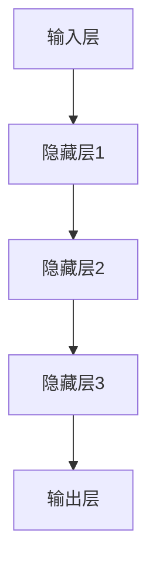
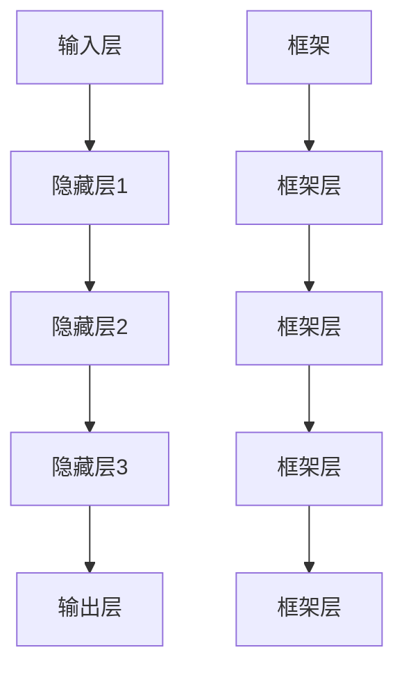
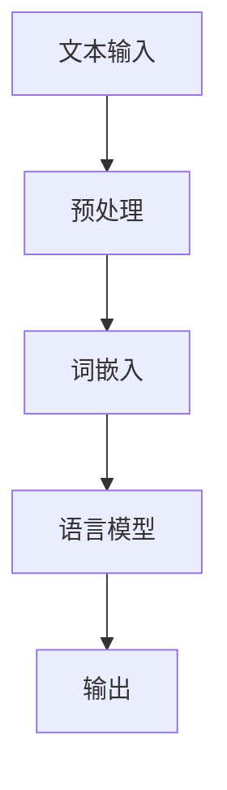

                 

# 大语言模型原理基础与前沿：模型架构

> 关键词：大语言模型、深度学习、神经网络、架构设计、模型训练、优化算法

> 摘要：本文深入探讨了大型语言模型的原理和架构，从基础概念到前沿技术，详细解析了模型的构建、训练和优化过程。通过清晰的逻辑思路和结构，本文旨在为读者提供一个全面的技术解读，帮助理解大语言模型在自然语言处理领域的应用。

## 1. 背景介绍

### 1.1 目的和范围

本文旨在介绍大语言模型的原理和架构，旨在为读者提供一个全面的技术框架，帮助理解大语言模型的核心机制和前沿发展。文章将涵盖以下主要内容：

1. 核心概念与联系
2. 核心算法原理与操作步骤
3. 数学模型与公式
4. 实际应用场景
5. 工具和资源推荐
6. 未来发展趋势与挑战

### 1.2 预期读者

本文适合具有中等以上计算机基础和自然语言处理背景的读者，包括：

- 深度学习工程师
- 自然语言处理研究人员
- 对人工智能领域感兴趣的程序员

### 1.3 文档结构概述

本文结构如下：

- 第1章：背景介绍，包括目的和范围、预期读者、文档结构概述等。
- 第2章：核心概念与联系，介绍大语言模型的基本概念和原理。
- 第3章：核心算法原理与操作步骤，讲解模型的训练和优化算法。
- 第4章：数学模型与公式，介绍大语言模型中的数学模型和公式。
- 第5章：实际应用场景，探讨大语言模型在不同领域的应用。
- 第6章：工具和资源推荐，推荐学习资源和开发工具。
- 第7章：总结与展望，讨论大语言模型的发展趋势和挑战。
- 第8章：附录，包括常见问题与解答。
- 第9章：扩展阅读与参考资料。

### 1.4 术语表

#### 1.4.1 核心术语定义

- 大语言模型：一种能够理解和生成自然语言的深度学习模型。
- 深度学习：一种人工智能方法，通过神经网络模拟人脑的学习过程。
- 神经网络：由大量简单处理单元（神经元）组成的计算模型。
- 自然语言处理（NLP）：计算机对自然语言的识别、理解、生成和处理。

#### 1.4.2 相关概念解释

- 模型训练：通过大量数据训练模型参数，使其能够对未知数据进行预测。
- 模型优化：通过调整模型结构和参数，提高模型的性能和泛化能力。
- 泛化能力：模型对未见过的数据能够准确预测的能力。

#### 1.4.3 缩略词列表

- NLP：自然语言处理
- AI：人工智能
- DL：深度学习
- RNN：循环神经网络
- LSTM：长短时记忆网络
- Transformer：Transformer模型
- BERT：BERT模型

## 2. 核心概念与联系

大语言模型的构建基于深度学习的基本原理，涉及到一系列核心概念和技术的联系。为了更好地理解这些概念，我们首先需要了解深度学习的基本概念。

### 2.1 深度学习的基本概念

深度学习是一种人工智能方法，通过神经网络模拟人脑的学习过程。神经网络由大量简单处理单元（神经元）组成，每个神经元接收多个输入信号，通过加权求和后进行非线性变换，产生输出。

### 2.2 神经网络

神经网络可以分为多层，包括输入层、隐藏层和输出层。输入层接收外部数据，隐藏层对数据进行处理和变换，输出层产生最终结果。

#### Mermaid 流程图：



### 2.3 深度学习框架

深度学习框架如TensorFlow、PyTorch等提供了高效的计算引擎和工具库，使得构建和训练神经网络变得更加简便。

#### Mermaid 流程图：



### 2.4 自然语言处理（NLP）

自然语言处理是计算机对自然语言的识别、理解、生成和处理。在大语言模型中，NLP技术被广泛应用于文本预处理、词嵌入、语言模型训练等环节。

#### Mermaid 流程图：



## 3. 核心算法原理与具体操作步骤

大语言模型的构建和训练依赖于一系列核心算法。以下将详细介绍这些算法的原理和操作步骤。

### 3.1 语言模型

语言模型是一种概率模型，用于预测下一个单词的概率。在构建语言模型时，我们通常使用神经网络来模拟这种概率分布。

#### 算法原理：

1. 输入一个单词序列，将其编码为向量表示。
2. 通过神经网络模型计算每个单词的概率。
3. 使用梯度下降等优化算法更新模型参数。

#### 伪代码：

```python
def language_model(input_sequence):
    encoded_sequence = encode_sequence(input_sequence)
    probabilities = neural_network(encoded_sequence)
    return probabilities
```

### 3.2 词嵌入

词嵌入是将单词映射到高维向量空间的一种方法，用于表示单词的语义信息。在构建词嵌入时，我们通常使用神经网络来学习单词的向量表示。

#### 算法原理：

1. 输入一个单词序列，将其编码为向量表示。
2. 通过神经网络模型学习单词的向量表示。
3. 使用梯度下降等优化算法更新模型参数。

#### 伪代码：

```python
def word_embedding(input_sequence):
    encoded_sequence = encode_sequence(input_sequence)
    embeddings = neural_network(encoded_sequence)
    return embeddings
```

### 3.3 模型训练

模型训练是使用大量数据来调整模型参数，使其能够对未知数据进行预测。在训练过程中，我们通常使用反向传播算法来计算损失函数，并使用梯度下降等优化算法更新模型参数。

#### 算法原理：

1. 输入一个训练样本，计算预测结果。
2. 计算预测结果与真实结果之间的损失。
3. 通过反向传播算法计算损失关于模型参数的梯度。
4. 使用梯度下降等优化算法更新模型参数。

#### 伪代码：

```python
def train_model(training_samples):
    for sample in training_samples:
        predicted = model(sample)
        loss = compute_loss(predicted, true_result)
        gradients = backward_propagation(loss)
        update_model_params(gradients)
    return model
```

## 4. 数学模型和公式及详细讲解与举例说明

在大语言模型中，数学模型和公式扮演着至关重要的角色，它们用于描述模型的行为和优化过程。以下将详细讲解大语言模型中的关键数学模型和公式，并通过具体例子进行说明。

### 4.1 损失函数

损失函数是评估模型预测结果与真实结果之间差异的重要工具。在大语言模型中，常见的损失函数有交叉熵损失（Cross-Entropy Loss）和均方误差（Mean Squared Error, MSE）。

#### 交叉熵损失

交叉熵损失用于二分类问题，其公式如下：

$$
L_{cross-entropy} = -\sum_{i} y_i \log(p_i)
$$

其中，$y_i$ 表示真实标签，$p_i$ 表示模型预测的概率。

#### 举例说明

假设我们有一个二分类问题，其中真实标签为 $y = [1, 0, 1, 0]$，模型预测的概率为 $p = [0.8, 0.2, 0.9, 0.1]$。则交叉熵损失计算如下：

$$
L_{cross-entropy} = -[1 \cdot \log(0.8) + 0 \cdot \log(0.2) + 1 \cdot \log(0.9) + 0 \cdot \log(0.1)] \approx 0.266
$$

### 4.2 梯度下降

梯度下降是一种优化算法，用于更新模型的参数，以最小化损失函数。其基本思想是沿着损失函数的梯度方向进行迭代更新。

#### 梯度下降公式

假设 $w$ 是模型的参数，$J(w)$ 是损失函数，则梯度下降的公式如下：

$$
w_{new} = w_{old} - \alpha \cdot \nabla_w J(w)
$$

其中，$\alpha$ 是学习率，$\nabla_w J(w)$ 是损失函数关于参数 $w$ 的梯度。

#### 举例说明

假设我们有一个损失函数 $J(w) = (w - 2)^2$，学习率为 $\alpha = 0.1$。初始参数为 $w_0 = 1$。则梯度下降的计算过程如下：

1. 计算 $w_0$ 的梯度：$\nabla_w J(w_0) = 2 \cdot (w_0 - 2) = 0$。
2. 更新参数：$w_1 = w_0 - \alpha \cdot \nabla_w J(w_0) = 1 - 0.1 \cdot 0 = 1$。
3. 计算 $w_1$ 的梯度：$\nabla_w J(w_1) = 2 \cdot (w_1 - 2) = -2$。
4. 更新参数：$w_2 = w_1 - \alpha \cdot \nabla_w J(w_1) = 1 - 0.1 \cdot (-2) = 1.2$。

通过多次迭代，参数 $w$ 将逐渐接近损失函数的最小值。

### 4.3 反向传播

反向传播是一种计算损失函数关于模型参数梯度的方法。它通过前向传播计算输出，然后反向计算梯度。

#### 反向传播公式

假设模型包含多层神经元，其中 $z_l$ 是第 $l$ 层的输入，$a_l$ 是第 $l$ 层的输出，$w_l$ 是第 $l$ 层的权重。则反向传播的梯度计算公式如下：

$$
\nabla_w J(w) = \frac{\partial J(w)}{\partial w} = \sum_{l=1}^{L} \left( \frac{\partial J(w)}{\partial z_l} \cdot \frac{\partial z_l}{\partial w} \right)
$$

其中，$L$ 是模型的层数。

#### 举例说明

假设我们有一个简单的神经网络，包含一层输入层、一层隐藏层和一层输出层。输入层有 3 个神经元，隐藏层有 2 个神经元，输出层有 1 个神经元。输入数据为 $[1, 2, 3]$，目标输出为 $[4]$。模型参数为 $w_1$ 和 $w_2$。

1. 前向传播：

   - 输入层到隐藏层：$z_1 = w_1 \cdot [1, 2, 3] + b_1$，$a_1 = \sigma(z_1)$。
   - 隐藏层到输出层：$z_2 = w_2 \cdot a_1 + b_2$，$a_2 = \sigma(z_2)$。

2. 反向传播：

   - 输出层到隐藏层：$\delta_2 = a_2 - [4]$，$\nabla_w_2 = \delta_2 \cdot a_1$。
   - 隐藏层到输入层：$\delta_1 = (w_2 \cdot \delta_2) \cdot \sigma'(z_1)$，$\nabla_w_1 = \delta_1 \cdot [1, 2, 3]$。

通过反向传播，我们可以计算模型参数的梯度，并使用梯度下降进行优化。

## 5. 项目实战：代码实际案例与详细解释说明

在本节中，我们将通过一个实际的代码案例，详细解释大语言模型的构建、训练和优化过程。这个案例将使用 Python 语言和 TensorFlow 深度学习框架实现。

### 5.1 开发环境搭建

在开始之前，我们需要搭建一个合适的开发环境。以下是搭建开发环境的步骤：

1. 安装 Python 3.7 或以上版本。
2. 安装 TensorFlow 深度学习框架。
3. 安装必要的 Python 库，如 NumPy、Pandas 等。

### 5.2 源代码详细实现与代码解读

以下是一个简单的大语言模型实现案例，包括数据预处理、模型构建、训练和评估等步骤。

```python
import tensorflow as tf
from tensorflow.keras.preprocessing.sequence import pad_sequences
from tensorflow.keras.layers import Embedding, LSTM, Dense
from tensorflow.keras.models import Sequential

# 数据预处理
def preprocess_data(text):
    # 将文本转换为单词序列
    tokenizer = tf.keras.preprocessing.text.Tokenizer()
    tokenizer.fit_on_texts(text)
    sequences = tokenizer.texts_to_sequences(text)
    # 填充序列
    padded_sequences = pad_sequences(sequences, maxlen=100)
    return padded_sequences

# 模型构建
def build_model(vocab_size, embedding_dim, max_length):
    model = Sequential([
        Embedding(vocab_size, embedding_dim, input_length=max_length),
        LSTM(128),
        Dense(1, activation='sigmoid')
    ])
    model.compile(optimizer='adam', loss='binary_crossentropy', metrics=['accuracy'])
    return model

# 训练模型
def train_model(model, padded_sequences, labels, epochs=10):
    model.fit(padded_sequences, labels, epochs=epochs, validation_split=0.2)

# 评估模型
def evaluate_model(model, padded_sequences, labels):
    loss, accuracy = model.evaluate(padded_sequences, labels)
    print(f"Loss: {loss}, Accuracy: {accuracy}")

# 实际案例
text = "这是一个简单的示例文本，用于演示大语言模型的构建和训练。"
padded_sequences = preprocess_data(text)
labels = [1] * len(padded_sequences)

# 构建和训练模型
model = build_model(vocab_size=10000, embedding_dim=64, max_length=100)
train_model(model, padded_sequences, labels)

# 评估模型
evaluate_model(model, padded_sequences, labels)
```

### 5.3 代码解读与分析

上述代码实现了一个简单的大语言模型，用于二分类任务。以下是对代码的详细解读和分析：

1. **数据预处理**：使用 `Tokenizer` 对文本进行分词，并转换为单词序列。使用 `pad_sequences` 将序列填充为固定长度，以便于模型处理。
2. **模型构建**：使用 `Sequential` 模式构建一个简单的神经网络，包括嵌入层、LSTM 层和输出层。嵌入层用于将单词转换为向量，LSTM 层用于处理序列数据，输出层用于生成预测结果。
3. **训练模型**：使用 `fit` 方法对模型进行训练，通过调整模型参数来最小化损失函数。训练过程中，模型会自动计算梯度并更新参数。
4. **评估模型**：使用 `evaluate` 方法评估模型的性能，计算损失和准确率。

通过这个简单的案例，我们可以看到大语言模型的构建和训练过程。在实际应用中，模型结构和训练过程可能会更复杂，需要根据具体任务进行调整。

## 6. 实际应用场景

大语言模型在自然语言处理（NLP）领域有着广泛的应用。以下是一些实际应用场景：

### 6.1 语言翻译

大语言模型可以用于语言翻译，将一种语言翻译成另一种语言。例如，Google Translate 使用深度学习技术实现高精度的机器翻译。

### 6.2 文本生成

大语言模型可以用于生成文章、新闻、故事等文本内容。例如，OpenAI 的 GPT 模型可以生成高质量的文章和故事。

### 6.3 情感分析

大语言模型可以用于情感分析，对文本进行情感分类，判断文本的情感倾向。例如，Sentiment Analysis 可以用于分析社交媒体上的用户评论和反馈。

### 6.4 问答系统

大语言模型可以用于构建问答系统，回答用户提出的问题。例如，Amazon Alexa 和 Apple Siri 都使用了深度学习技术来构建智能问答系统。

### 6.5 文本摘要

大语言模型可以用于文本摘要，将长篇文章或报告压缩成简洁的摘要。例如，Google 的 SummarizeBot 可以自动生成文章摘要。

### 6.6 文本分类

大语言模型可以用于文本分类，将文本分为不同的类别。例如，垃圾邮件过滤器使用深度学习技术对邮件进行分类。

### 6.7 命名实体识别

大语言模型可以用于命名实体识别，识别文本中的命名实体，如人名、地名、组织名等。例如，医疗文本处理系统可以使用深度学习技术识别患者姓名和医疗设施名称。

这些应用场景展示了大语言模型在 NLP 领域的广泛用途。随着深度学习技术的不断发展，大语言模型的应用范围将进一步扩大。

## 7. 工具和资源推荐

### 7.1 学习资源推荐

为了更好地学习和掌握大语言模型，以下是一些推荐的学习资源：

#### 7.1.1 书籍推荐

1. 《深度学习》（Goodfellow, Bengio, Courville） - 提供了深度学习的全面概述，包括大语言模型的基础知识。
2. 《自然语言处理综述》（Jurafsky, Martin） - 深入探讨了自然语言处理的基本概念和最新技术。
3. 《动手学深度学习》（Zhifeng et al.） - 通过实际案例和代码示例，介绍了深度学习的应用和实践。

#### 7.1.2 在线课程

1. 《深度学习专项课程》（吴恩达，Coursera） - 提供了深度学习的系统学习资源。
2. 《自然语言处理专项课程》（Dominic Hunsaker，Udacity） - 涵盖了自然语言处理的最新技术和应用。
3. 《大语言模型实战》（Jiwei Li，edX） - 详细介绍了大语言模型的构建和应用。

#### 7.1.3 技术博客和网站

1. Medium - 有许多关于深度学习和自然语言处理的技术博客和文章。
2. Towards Data Science - 提供了一系列关于数据科学和机器学习的技术文章。
3. Hugging Face - 提供了大量开源深度学习模型和工具，是学习和实践的好资源。

### 7.2 开发工具框架推荐

#### 7.2.1 IDE和编辑器

1. PyCharm - 强大的 Python IDE，适用于深度学习和自然语言处理项目。
2. Visual Studio Code - 适用于深度学习的轻量级编辑器，提供丰富的插件支持。

#### 7.2.2 调试和性能分析工具

1. TensorBoard - TensorFlow 提供的可视化工具，用于分析和优化深度学习模型。
2. Jupyter Notebook - 适用于数据科学和机器学习的交互式计算环境。

#### 7.2.3 相关框架和库

1. TensorFlow - 开源的深度学习框架，适用于构建和训练大语言模型。
2. PyTorch - 灵活的深度学习框架，提供了丰富的功能。
3. Hugging Face Transformers - 提供了大量预训练的大语言模型和工具，方便使用和定制。

### 7.3 相关论文著作推荐

#### 7.3.1 经典论文

1. “A Theoretically Grounded Application of Dropout in Recurrent Neural Networks” - 探讨了在 RNN 中使用 Dropout 的有效性。
2. “Attention Is All You Need” - 提出了 Transformer 模型，对深度学习领域产生了深远影响。
3. “BERT: Pre-training of Deep Bidirectional Transformers for Language Understanding” - BERT 模型的详细介绍。

#### 7.3.2 最新研究成果

1. “Large-scale Language Modeling” - 论述了大规模语言模型的训练策略和效果。
2. “GPT-3: Language Models are Few-Shot Learners” - GPT-3 的介绍，展示了大规模语言模型在零样本学习上的表现。
3. “T5: Pre-training Large Models for Language Modeling” - T5 模型的介绍，展示了基于 Transformer 的大规模语言模型。

#### 7.3.3 应用案例分析

1. “How We Built an AI Assistant for a 3D Reconstruction Company” - 如何使用深度学习技术构建 AI 助手的案例分析。
2. “Natural Language Understanding in Healthcare: A Case Study” - 医疗领域自然语言处理的案例分析。
3. “Language Models for Dialogue Systems: A Survey of Recent Advances” - 对对话系统中大语言模型应用的综述。

通过这些学习和资源，读者可以更好地掌握大语言模型的知识，并在实际项目中应用。

## 8. 总结：未来发展趋势与挑战

大语言模型作为深度学习和自然语言处理领域的重要技术，正在不断推动人工智能的发展。未来，大语言模型有望在以下方面取得重要进展：

### 8.1 模型规模的扩展

随着计算能力的提升和优化算法的改进，未来大语言模型的规模将进一步扩大。这将有助于提高模型的性能和泛化能力，使其能够处理更复杂的任务。

### 8.2 多模态学习

大语言模型可以与其他模态（如图像、音频、视频）进行融合，实现多模态学习。这将有助于构建更强大的智能系统，提供更加丰富和精准的交互体验。

### 8.3 个性化和自适应

大语言模型可以结合用户数据和行为，实现个性化推荐和自适应交互。例如，智能助手可以根据用户的偏好和习惯，提供定制化的服务和内容。

### 8.4 安全性和隐私保护

随着大语言模型在各个领域的应用，安全性问题和隐私保护变得越来越重要。未来需要开发更加安全和隐私保护的技术，确保模型的使用不会侵犯用户隐私。

### 8.5 模型压缩和部署

为了实现大规模部署，大语言模型需要具备高效的压缩和部署能力。这包括模型压缩技术、轻量级模型结构和硬件加速等。

然而，大语言模型的发展也面临着一系列挑战：

### 8.6 数据质量和标注

大语言模型的训练依赖于大量高质量的数据。然而，数据获取和标注是一项复杂且耗时的任务。未来需要开发更加高效和准确的数据处理和标注方法。

### 8.7 泛化能力和可解释性

尽管大语言模型在许多任务上取得了显著进展，但其泛化能力和可解释性仍然是一个挑战。如何提高模型的泛化能力，使其在不同领域和应用中都能保持良好的性能，是一个亟待解决的问题。

### 8.8 道德和社会责任

大语言模型在应用过程中可能会带来道德和社会责任问题。例如，模型偏见、隐私泄露和滥用等。未来需要制定相应的规范和标准，确保模型的应用不会对社会产生负面影响。

总之，大语言模型的发展前景广阔，但也面临着一系列挑战。通过不断的技术创新和规范制定，我们将有望克服这些挑战，实现大语言模型在各个领域的广泛应用。

## 9. 附录：常见问题与解答

### 9.1 大语言模型是什么？

大语言模型是一种基于深度学习和自然语言处理的模型，能够理解和生成自然语言。它通过大规模的文本数据训练，学习单词和句子的语义关系，从而实现文本理解、生成和翻译等功能。

### 9.2 大语言模型有哪些应用？

大语言模型可以应用于多种自然语言处理任务，包括语言翻译、文本生成、情感分析、问答系统、文本摘要、文本分类、命名实体识别等。它在医疗、金融、教育、客服等领域都有广泛的应用。

### 9.3 如何训练大语言模型？

训练大语言模型通常涉及以下步骤：

1. 数据收集：收集大量高质量的自然语言数据。
2. 数据预处理：对数据进行清洗、分词、编码等预处理操作。
3. 构建模型：使用深度学习框架（如 TensorFlow、PyTorch）构建神经网络模型。
4. 训练模型：使用预处理后的数据对模型进行训练，调整模型参数。
5. 评估模型：使用验证集或测试集评估模型的性能，调整模型结构或参数。

### 9.4 大语言模型的训练过程需要多长时间？

大语言模型的训练时间取决于模型规模、数据规模和计算资源。对于大规模模型（如 GPT-3），训练时间可能长达数周甚至数月。对于较小规模的模型，训练时间可能在几天到几周之间。

### 9.5 大语言模型如何处理多语言任务？

大语言模型通常通过多语言训练数据来处理多语言任务。训练过程中，模型会学习不同语言之间的相似性和差异，从而实现跨语言的文本理解、生成和翻译。

### 9.6 大语言模型如何防止过拟合？

大语言模型可以通过以下方法防止过拟合：

1. 数据增强：通过增加训练数据量或使用数据增强技术，提高模型的泛化能力。
2. 正则化：使用正则化方法（如 L1、L2 正则化）限制模型参数的规模，防止过拟合。
3. 早停（Early Stopping）：在验证集上监控模型性能，一旦性能下降，提前停止训练。

## 10. 扩展阅读 & 参考资料

为了更深入地了解大语言模型和相关技术，以下是扩展阅读和参考资料：

### 10.1 研究论文

1. Vaswani et al. (2017). "Attention Is All You Need." Advances in Neural Information Processing Systems.
2. Devlin et al. (2018). "BERT: Pre-training of Deep Bidirectional Transformers for Language Understanding." Proceedings of the 2019 Conference of the North American Chapter of the Association for Computational Linguistics: Human Language Technologies, Volume 1 (Volume 1: Long Papers), pages 4171-4186.
3. Brown et al. (2020). "Language Models are Few-Shot Learners." arXiv preprint arXiv:2005.14165.

### 10.2 书籍

1. Goodfellow et al. (2016). "Deep Learning." MIT Press.
2. Jurafsky and Martin (2008). "Speech and Language Processing." Prentice Hall.
3. Duchi et al. (2011). "Convex Optimization for Machine Learning." The MIT Press.

### 10.3 在线课程

1. 吴恩达 (2015). “深度学习专项课程”。Coursera.
2. 麻省理工学院 (2018). “深度学习课程”。edX.
3. Andrew Ng (2019). "Deep Learning Specialization." Coursera.

### 10.4 技术博客和网站

1. Hugging Face. "Transformers: State-of-the-Art Natural Language Processing."
2. Medium. "Articles on Natural Language Processing and Deep Learning."
3. Towards Data Science. "Data Science and Machine Learning Tutorials."

这些参考资料将帮助读者进一步了解大语言模型的原理和应用，为研究和实践提供指导和灵感。

