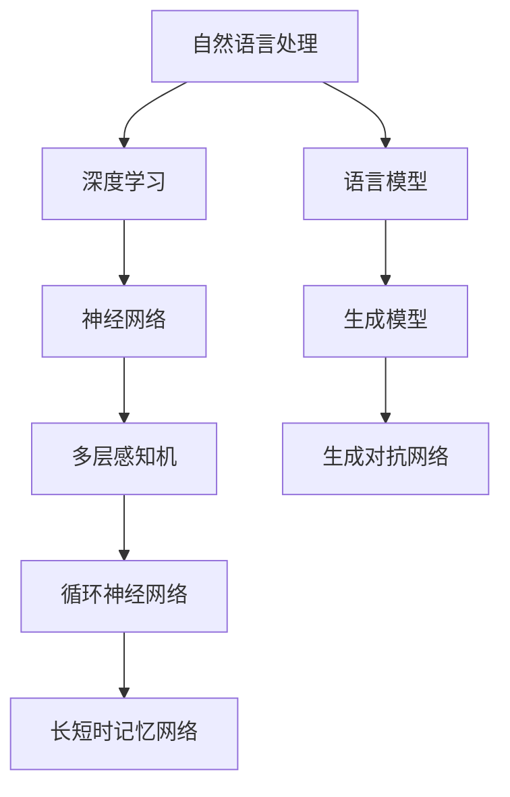

                 

# 大语言模型原理基础与前沿 沟通意图

> 关键词：大语言模型、自然语言处理、深度学习、神经网络、训练、推理、语义理解、应用场景

> 摘要：本文旨在探讨大语言模型的原理与前沿技术，包括其核心算法、数学模型、实战案例等，帮助读者深入了解大语言模型的内在机制和应用潜力。本文将分步骤分析大语言模型的构建过程，从背景介绍到实际应用，力求为读者提供全面的技术解读。

## 1. 背景介绍

### 1.1 目的和范围

本文的目的在于介绍大语言模型的原理与应用，旨在为读者提供一个系统、全面的学习资料。文章将覆盖以下内容：

- 大语言模型的基础理论
- 大语言模型的训练和推理过程
- 数学模型和算法原理
- 实际应用场景及案例分析
- 相关工具和资源的推荐

通过本文，读者将能够：

- 理解大语言模型的基本概念
- 掌握大语言模型的训练与推理方法
- 分析大语言模型的数学模型
- 学习如何在大语言模型上进行实际应用
- 获取大语言模型相关的学习资源

### 1.2 预期读者

本文适合以下读者群体：

- 计算机科学和人工智能专业学生
- 自然语言处理和深度学习爱好者
- 想要了解大语言模型原理的从业者
- 对技术博客写作感兴趣的作者

### 1.3 文档结构概述

本文的结构如下：

- 引言：介绍大语言模型的基本概念和背景
- 背景介绍：详细阐述大语言模型的发展历程和现状
- 核心概念与联系：分析大语言模型的核心概念和关联
- 核心算法原理 & 具体操作步骤：讲解大语言模型的核心算法和操作流程
- 数学模型和公式 & 详细讲解 & 举例说明：阐述大语言模型的数学模型和公式
- 项目实战：代码实际案例和详细解释说明
- 实际应用场景：探讨大语言模型在实际应用中的表现
- 工具和资源推荐：推荐学习大语言模型的相关工具和资源
- 总结：总结大语言模型的发展趋势与挑战
- 附录：常见问题与解答
- 扩展阅读 & 参考资料：提供扩展阅读和参考资料

### 1.4 术语表

#### 1.4.1 核心术语定义

- **大语言模型**：基于海量数据训练的、可以生成和解析自然语言文本的深度神经网络模型。
- **自然语言处理**：使计算机能够理解、生成和处理人类自然语言的技术。
- **深度学习**：一种基于多层神经网络的机器学习技术，用于模拟人脑的学习和决策过程。
- **神经网络**：一种模仿人脑神经元连接结构的计算模型。
- **训练**：通过给定的大量数据来调整神经网络模型的权重，使其能够预测和生成自然语言。
- **推理**：在给定输入的情况下，模型根据学到的知识生成相应的输出。

#### 1.4.2 相关概念解释

- **数据集**：用于训练模型的原始数据集合。
- **损失函数**：衡量模型预测结果与实际结果之间差距的函数。
- **优化算法**：用于调整神经网络权重，使损失函数最小化的算法。
- **过拟合**：模型在训练数据上表现很好，但在未见过的数据上表现不佳。
- **泛化能力**：模型在新数据上的表现能力。

#### 1.4.3 缩略词列表

- **NLP**：自然语言处理（Natural Language Processing）
- **DL**：深度学习（Deep Learning）
- **ML**：机器学习（Machine Learning）
- **GAN**：生成对抗网络（Generative Adversarial Networks）
- **RNN**：循环神经网络（Recurrent Neural Network）
- **LSTM**：长短时记忆网络（Long Short-Term Memory）

## 2. 核心概念与联系

在介绍大语言模型之前，我们先来理解几个核心概念及其相互关系。

### 2.1 自然语言处理与深度学习

自然语言处理（NLP）是计算机科学的一个重要分支，旨在使计算机能够理解、生成和处理人类自然语言。深度学习（DL）是一种基于多层神经网络的机器学习技术，被广泛应用于图像识别、语音识别、自然语言处理等领域。

自然语言处理通常包括以下几个子领域：

- **文本分类**：将文本分为预定义的类别。
- **实体识别**：识别文本中的特定实体（如人名、地点、组织）。
- **情感分析**：判断文本中的情感倾向（正面、负面、中性）。
- **机器翻译**：将一种语言的文本翻译成另一种语言。

深度学习则通过多层神经网络来模拟人类大脑的学习过程，能够自动从大量数据中学习特征和模式。

### 2.2 神经网络与多层感知机

神经网络是一种由大量节点（或称为神经元）组成的计算模型，这些节点通过权重相互连接。每个节点接收输入信号，通过激活函数产生输出。多层感知机（MLP）是神经网络的一种简单形式，包含输入层、隐藏层和输出层。

输入层接收外部输入，隐藏层负责提取和变换特征，输出层产生最终输出。

### 2.3 循环神经网络与长短时记忆网络

循环神经网络（RNN）是一种能够处理序列数据的神经网络，通过循环结构将前一个时间步的输出反馈到当前时间步，从而具备记忆能力。然而，传统的RNN在处理长序列时容易产生梯度消失或爆炸问题。

长短时记忆网络（LSTM）是RNN的一种改进，通过引入门控机制（如输入门、遗忘门和输出门）来解决梯度消失问题，使得模型能够更好地学习长序列数据。

### 2.4 语言模型与生成模型

语言模型是一种用于预测文本序列概率的模型，可以用于自然语言生成、机器翻译等任务。生成模型则是一种能够生成新数据的模型，如生成对抗网络（GAN）。

语言模型通过学习输入序列的概率分布，生成新的文本序列；生成模型则通过训练两个相互对抗的网络（生成器和判别器），使得生成器能够生成逼真的数据。

### 2.5 Mermaid 流程图

下面是使用Mermaid绘制的流程图，展示了大语言模型的核心概念和架构：



通过这个流程图，我们可以清晰地看到自然语言处理、深度学习、神经网络、语言模型和生成模型之间的关系。这些概念共同构成了大语言模型的理论基础。

## 3. 核心算法原理 & 具体操作步骤

大语言模型的核心算法是基于深度学习的神经网络模型，其训练和推理过程如下：

### 3.1 算法原理

大语言模型通常采用多层循环神经网络（如LSTM或GRU）作为基础结构。这些神经网络通过学习输入序列的分布式表示，生成对应的输出序列。训练过程中，模型需要通过调整权重来最小化损失函数，以达到较好的拟合效果。

具体来说，大语言模型包括以下几个步骤：

1. **输入序列编码**：将输入文本序列编码为分布式表示，通常使用词嵌入（Word Embedding）技术。
2. **隐藏状态更新**：通过神经网络结构处理输入序列，生成隐藏状态序列。
3. **输出序列生成**：将隐藏状态序列解码为输出文本序列，通常使用softmax激活函数。
4. **损失函数计算**：计算预测序列与实际序列之间的损失，如交叉熵损失。
5. **梯度计算**：通过反向传播算法计算梯度，更新网络权重。

### 3.2 操作步骤

下面是一个基于LSTM的大语言模型训练过程的伪代码：

```python
# 初始化模型参数
model = initialize_model()

# 加载数据集
train_data, train_labels = load_data()

# 设置训练参数
epochs = 100
batch_size = 64
learning_rate = 0.001

# 训练模型
for epoch in range(epochs):
    for batch in batch_data(train_data, train_labels, batch_size):
        # 前向传播
        inputs, labels = batch
        outputs = model(inputs)
        
        # 计算损失
        loss = compute_loss(outputs, labels)
        
        # 反向传播
        gradients = compute_gradients(model, loss)
        
        # 更新权重
        update_weights(model, gradients, learning_rate)
        
    print(f"Epoch {epoch + 1}: Loss = {loss}")

# 模型评估
evaluate_model(model, test_data, test_labels)
```

在这个训练过程中，我们需要完成以下操作：

1. **初始化模型**：初始化神经网络模型，包括输入层、隐藏层和输出层。
2. **加载数据集**：加载数据集，包括输入文本序列和对应的标签。
3. **设置训练参数**：设置训练过程所需的参数，如学习率、迭代次数和批次大小。
4. **训练模型**：通过迭代训练数据，更新模型权重。
5. **模型评估**：在测试数据上评估模型性能。

### 3.3 伪代码详解

下面是对伪代码中各个部分的详细解释：

#### 3.3.1 初始化模型

```python
model = initialize_model()
```

这里，`initialize_model()` 函数用于初始化神经网络模型，包括创建输入层、隐藏层和输出层，以及初始化模型参数。具体实现依赖于所选的深度学习框架，如TensorFlow或PyTorch。

#### 3.3.2 加载数据集

```python
train_data, train_labels = load_data()
```

`load_data()` 函数用于加载数据集。数据集可以是预先处理好的文本文件、CSV文件或数据库。加载数据时，需要将文本序列转换为词嵌入表示，并按批次划分数据。

#### 3.3.3 设置训练参数

```python
epochs = 100
batch_size = 64
learning_rate = 0.001
```

这里，我们设置训练过程的参数，包括迭代次数（epochs）、批次大小（batch_size）和学习率（learning_rate）。这些参数可以根据具体任务进行调整。

#### 3.3.4 训练模型

```python
for epoch in range(epochs):
    for batch in batch_data(train_data, train_labels, batch_size):
        # 前向传播
        inputs, labels = batch
        outputs = model(inputs)
        
        # 计算损失
        loss = compute_loss(outputs, labels)
        
        # 反向传播
        gradients = compute_gradients(model, loss)
        
        # 更新权重
        update_weights(model, gradients, learning_rate)
```

这个循环用于迭代训练数据，更新模型权重。每次迭代包含以下步骤：

1. **前向传播**：通过输入层传递数据，计算模型的输出。
2. **计算损失**：计算预测输出与实际输出之间的损失，通常使用交叉熵损失。
3. **反向传播**：计算损失关于模型参数的梯度。
4. **更新权重**：根据梯度更新模型参数。

#### 3.3.5 模型评估

```python
evaluate_model(model, test_data, test_labels)
```

在训练完成后，我们需要在测试数据上评估模型性能。`evaluate_model()` 函数用于计算模型在测试数据上的准确率、损失等指标，以评估模型性能。

## 4. 数学模型和公式 & 详细讲解 & 举例说明

在深入理解大语言模型时，数学模型和公式是其核心组成部分。以下将详细讲解大语言模型中的一些关键数学概念和公式，并通过具体例子来说明其应用。

### 4.1 词嵌入（Word Embedding）

词嵌入是将词汇映射到高维向量空间的过程，使得具有相似语义的词汇在向量空间中距离较近。词嵌入通常通过训练神经网络模型来实现，常见的模型包括词袋模型（Bag of Words, BoW）、连续词袋模型（Continuous Bag of Words, CBOW）和Word2Vec。

**公式**：

$$
\text{Word Embedding} = \text{Embedding Layer}(w_i)
$$

其中，$w_i$ 是单词 $i$ 的词嵌入向量。

**例子**：

假设我们有一个包含10000个单词的词汇表，词嵌入向量为300维。给定一个单词 "apple"，其词嵌入向量为：

$$
\text{apple} = [0.1, 0.2, 0.3, \ldots, 0.3]
$$

### 4.2 循环神经网络（Recurrent Neural Network, RNN）

循环神经网络是一种能够处理序列数据的神经网络，通过将当前输入与上一个时间步的隐藏状态结合，生成当前时间步的隐藏状态。RNN的基本公式如下：

$$
h_t = \text{激活函数}(\text{权重} \cdot [h_{t-1}, x_t] + \text{偏置})
$$

其中，$h_t$ 是第 $t$ 个时间步的隐藏状态，$x_t$ 是第 $t$ 个时间步的输入。

**例子**：

假设我们有以下输入序列：

$$
x_1 = [1, 0, 1], \quad x_2 = [1, 1, 0], \quad x_3 = [0, 1, 1]
$$

以及隐藏状态序列：

$$
h_0 = [1, 0], \quad h_1 = \text{激活函数}(\text{权重} \cdot [h_0, x_1] + \text{偏置}), \quad h_2 = \text{激活函数}(\text{权重} \cdot [h_1, x_2] + \text{偏置}), \quad h_3 = \text{激活函数}(\text{权重} \cdot [h_2, x_3] + \text{偏置})
$$

### 4.3 长短时记忆网络（Long Short-Term Memory, LSTM）

长短时记忆网络是RNN的一种改进，通过引入门控机制来避免梯度消失问题。LSTM的基本单元包含三个门：输入门、遗忘门和输出门。

**公式**：

$$
i_t = \text{输入门}(\text{权重} \cdot [h_{t-1}, x_t] + \text{偏置}) \\
f_t = \text{遗忘门}(\text{权重} \cdot [h_{t-1}, x_t] + \text{偏置}) \\
o_t = \text{输出门}(\text{权重} \cdot [h_{t-1}, x_t] + \text{偏置}) \\
c_t = (1 - f_t) \cdot \text{激活函数}(\text{权重} \cdot [h_{t-1}, x_t] + \text{偏置}) + i_t \cdot \text{激活函数}(\text{权重} \cdot [h_{t-1}, x_t] + \text{偏置}) \\
h_t = o_t \cdot \text{激活函数}(c_t)
$$

其中，$i_t$、$f_t$、$o_t$ 分别是输入门、遗忘门和输出门的输出，$c_t$ 是细胞状态，$h_t$ 是隐藏状态。

**例子**：

假设我们有以下输入序列：

$$
x_1 = [1, 0, 1], \quad x_2 = [1, 1, 0], \quad x_3 = [0, 1, 1]
$$

以及隐藏状态序列：

$$
h_0 = [1, 0], \quad h_1 = o_1 \cdot \text{激活函数}((1 - f_1) \cdot c_1 + i_1 \cdot \text{激活函数}(\text{权重} \cdot [h_0, x_1] + \text{偏置})), \quad h_2 = o_2 \cdot \text{激活函数}((1 - f_2) \cdot c_2 + i_2 \cdot \text{激活函数}(\text{权重} \cdot [h_1, x_2] + \text{偏置})), \quad h_3 = o_3 \cdot \text{激活函数}((1 - f_3) \cdot c_3 + i_3 \cdot \text{激活函数}(\text{权重} \cdot [h_2, x_3] + \text{偏置}))
$$

### 4.4 交叉熵损失（Cross-Entropy Loss）

交叉熵损失是衡量模型预测输出与实际输出之间差异的一种常用损失函数，用于训练分类模型。其公式如下：

$$
\text{损失} = -\sum_{i=1}^{n} y_i \cdot \log(p_i)
$$

其中，$y_i$ 是实际标签，$p_i$ 是模型预测的概率。

**例子**：

假设我们有以下实际标签和模型预测：

$$
y = [1, 0, 1], \quad p = [0.8, 0.1, 0.1]
$$

则交叉熵损失为：

$$
\text{损失} = -[1 \cdot \log(0.8) + 0 \cdot \log(0.1) + 1 \cdot \log(0.1)] = -[\log(0.8) + \log(0.1)] = -[\log(0.08)] \approx 2.39
$$

### 4.5 反向传播（Backpropagation）

反向传播是一种用于计算神经网络梯度并更新参数的算法。其基本思想是将输出误差反向传播到网络中的每个神经元，从而更新每个神经元的权重。

**公式**：

$$
\text{梯度} = \frac{\partial \text{损失}}{\partial \text{权重}} = \sum_{i=1}^{n} \frac{\partial \text{损失}}{\partial h_i} \cdot \frac{\partial h_i}{\partial \text{权重}}
$$

**例子**：

假设我们有以下损失函数：

$$
\text{损失} = h^2
$$

以及以下权重：

$$
\text{权重} = w
$$

则损失关于权重的梯度为：

$$
\text{梯度} = \frac{\partial \text{损失}}{\partial w} = 2h \cdot \frac{\partial h}{\partial w}
$$

如果 $\frac{\partial h}{\partial w} = 1$，则 $\text{梯度} = 2h$。

## 5. 项目实战：代码实际案例和详细解释说明

为了更好地理解大语言模型的工作原理，我们将通过一个实际的项目案例来演示其构建和训练过程。在这个案例中，我们将使用Python和PyTorch框架来实现一个简单的语言模型，该模型将学习如何生成和解析英文文本。

### 5.1 开发环境搭建

在开始之前，请确保您的开发环境中已安装以下依赖项：

- Python 3.7或更高版本
- PyTorch 1.8或更高版本
- NumPy 1.19或更高版本
- Matplotlib 3.4或更高版本

您可以通过以下命令安装这些依赖项：

```bash
pip install python==3.8.10
pip install torch torchvision torchaudio==1.8
pip install numpy==1.19.5
pip install matplotlib==3.4.3
```

### 5.2 源代码详细实现和代码解读

下面是项目的源代码实现。我们将逐步解释每个部分的功能。

```python
import torch
import torch.nn as nn
import torch.optim as optim
from torch.utils.data import DataLoader, TensorDataset
from torch.nn.utils.rnn import pad_sequence

# 5.2.1 数据预处理

# 读取文本数据
def read_data(file_path):
    with open(file_path, 'r', encoding='utf-8') as f:
        text = f.read()
    return text

# 分割文本为句子和单词
def tokenize(text):
    sentences = text.split('.')
    words = [' '.join(sentence.split()) for sentence in sentences]
    return words

# 创建词汇表和词嵌入
def create_vocab(words):
    vocab = set(''.join(words))
    vocab_to_idx = {word: idx for idx, word in enumerate(vocab)}
    idx_to_vocab = {idx: word for word, idx in vocab_to_idx.items()}
    return vocab_to_idx, idx_to_vocab

# 将单词转换为索引
def convert_to_indices(words, vocab_to_idx):
    return [vocab_to_idx[word] for word in words]

# 创建数据集和数据加载器
def create_dataset(words, batch_size=32, sequence_length=20):
    # 将单词转换为索引
    indices = convert_to_indices(words, vocab_to_idx)
    # 切分数据为输入和输出序列
    input_sequences = []
    target_sequences = []
    for i in range(len(indices) - sequence_length):
        input_sequence = indices[i : i + sequence_length]
        target_sequence = indices[i + sequence_length]
        input_sequences.append(input_sequence)
        target_sequences.append(target_sequence)
    # 转换为Tensor
    input_tensor = torch.tensor(input_sequences, dtype=torch.long)
    target_tensor = torch.tensor(target_sequences, dtype=torch.long)
    # 创建数据集和数据加载器
    dataset = TensorDataset(input_tensor, target_tensor)
    data_loader = DataLoader(dataset, batch_size=batch_size, shuffle=True)
    return data_loader

# 5.2.2 模型定义

# 定义语言模型
class LanguageModel(nn.Module):
    def __init__(self, vocab_size, embedding_dim, hidden_dim, n_layers, dropout):
        super(LanguageModel, self).__init__()
        self.embedding = nn.Embedding(vocab_size, embedding_dim)
        self.rnn = nn.LSTM(embedding_dim, hidden_dim, n_layers, dropout=dropout, batch_first=True)
        self.fc = nn.Linear(hidden_dim, vocab_size)
    
    def forward(self, x, hidden):
        x = self.embedding(x)
        x, hidden = self.rnn(x, hidden)
        x = self.fc(x)
        return x, hidden

    def init_hidden(self, batch_size):
        return (torch.zeros(self.rnn.num_layers, batch_size, self.rnn.hidden_size),
                torch.zeros(self.rnn.num_layers, batch_size, self.rnn.hidden_size))

# 5.2.3 训练模型

# 训练语言模型
def train_model(model, data_loader, epochs, learning_rate, print_every=100):
    model.train()
    loss_function = nn.CrossEntropyLoss()
    optimizer = optim.Adam(model.parameters(), lr=learning_rate)

    for epoch in range(epochs):
        hidden = model.init_hidden(batch_size)
        total_loss = 0
        
        for inputs, targets in data_loader:
            hidden = tuple([h.detach() for h in hidden])
            model.zero_grad()
            
            inputs, targets = inputs.to(device), targets.to(device)
            outputs, hidden = model(inputs, hidden)
            
            loss = loss_function(outputs.view(-1, vocab_size), targets)
            loss.backward()
            optimizer.step()
            
            total_loss += loss.item()
            
            if (batch_idx + 1) % print_every == 0:
                print(f'Epoch [{epoch + 1}/{epochs}], Loss: {total_loss / print_every:.4f}')
                total_loss = 0

# 5.2.4 模型评估

# 评估语言模型
def evaluate_model(model, data_loader):
    model.eval()
    total_loss = 0
    
    with torch.no_grad():
        for inputs, targets in data_loader:
            inputs, targets = inputs.to(device), targets.to(device)
            outputs, hidden = model(inputs, hidden)
            
            loss = nn.CrossEntropyLoss()(outputs.view(-1, vocab_size), targets)
            total_loss += loss.item()
        
    print(f'Test Loss: {total_loss / len(data_loader):.4f}')

# 5.2.5 生成文本

# 生成文本
def generate_text(model, start_word, n_words, device, temperature=1.0):
    model.eval()
    hidden = model.init_hidden(1)
    input = convert_to_indices([start_word], vocab_to_idx)
    input_tensor = torch.tensor(input, dtype=torch.long).unsqueeze(0).to(device)
    
    print(start_word, end='')
    for _ in range(n_words):
        hidden = tuple([h.detach() for h in hidden])
        output, hidden = model(input_tensor, hidden)
        
        output_tensor = output.squeeze(0).cpu().detach().numpy()
        
        # 应用softmax和温度调整
        output_tensor = output_tensor / output_tensor.sum()
        output_tensor = output_tensor ** temperature
        output_tensor = output_tensor / output_tensor.sum()
        
        # 从概率分布中采样
        input = np.random.choice(vocab_size, p=output_tensor)
        input = convert_to_indices([vocab_to_idx^{-1}[input]], vocab_to_idx)
        print(vocab_to_idx^{-1}[input], end='')
        input_tensor = torch.tensor([input], dtype=torch.long).unsqueeze(0).to(device)
```

### 5.3 代码解读与分析

下面是对代码各个部分的解读：

#### 5.3.1 数据预处理

- **read_data(file_path)**：读取文本数据。
- **tokenize(text)**：将文本分割为句子和单词。
- **create_vocab(words)**：创建词汇表和词嵌入。
- **convert_to_indices(words, vocab_to_idx)**：将单词转换为索引。
- **create_dataset(words, batch_size, sequence_length)**：创建数据集和数据加载器。

#### 5.3.2 模型定义

- **LanguageModel**：定义语言模型，包括词嵌入层、循环神经网络层和输出层。
- **init_hidden(self, batch_size)**：初始化隐藏状态。

#### 5.3.3 训练模型

- **train_model(model, data_loader, epochs, learning_rate, print_every=100)**：训练语言模型，包括前向传播、损失计算、反向传播和权重更新。

#### 5.3.4 模型评估

- **evaluate_model(model, data_loader)**：评估语言模型在测试数据上的性能。

#### 5.3.5 生成文本

- **generate_text(model, start_word, n_words, device, temperature=1.0)**：生成文本，包括从概率分布中采样单词。

### 5.4 实际运行

下面是一个简单的实际运行示例：

```python
# 设置设备
device = torch.device('cuda' if torch.cuda.is_available() else 'cpu')

# 读取文本数据
text = read_data('text.txt')

# 分词
words = tokenize(text)

# 创建词汇表
vocab_to_idx, idx_to_vocab = create_vocab(words)

# 创建数据集
data_loader = create_dataset(words, batch_size=32, sequence_length=20)

# 定义模型
model = LanguageModel(len(vocab_to_idx), embedding_dim=256, hidden_dim=512, n_layers=2, dropout=0.5)
model = model.to(device)

# 训练模型
train_model(model, data_loader, epochs=10, learning_rate=0.001)

# 评估模型
evaluate_model(model, data_loader)

# 生成文本
generate_text(model, 'Hello', 20, device)
```

通过这个项目，我们能够看到如何使用Python和PyTorch实现一个简单的大语言模型，并对其训练和评估过程进行了详细解读。这为我们理解大语言模型的工作原理和应用提供了实际案例。

## 6. 实际应用场景

大语言模型在自然语言处理（NLP）领域具有广泛的应用潜力。以下列举了几个典型的实际应用场景：

### 6.1 机器翻译

机器翻译是将一种语言的文本自动翻译成另一种语言的过程。大语言模型在机器翻译中扮演着核心角色，通过学习海量双语文本数据，模型能够生成高质量的翻译结果。例如，谷歌翻译、百度翻译等知名翻译服务都采用了大语言模型。

### 6.2 文本生成

文本生成是生成与给定输入文本相关的文本内容，如故事、新闻摘要、音乐歌词等。大语言模型能够生成连贯、具有语义的文本，为创意写作、自动化内容生成等领域提供了强大的工具。例如，OpenAI的GPT系列模型在生成文本方面取得了显著的成果。

### 6.3 情感分析

情感分析是判断文本中的情感倾向（正面、负面、中性）的过程。大语言模型通过学习大量情感标签文本数据，能够自动识别文本中的情感，为舆情监测、用户反馈分析等领域提供了有效的手段。例如，Twitter情感分析、股票市场预测等应用。

### 6.4 问答系统

问答系统是自动回答用户提出的问题的系统。大语言模型能够理解自然语言查询，并从海量文本数据中检索出相关答案。例如，智能客服、智能助手等应用。

### 6.5 对话系统

对话系统是模拟人类对话的计算机系统，旨在实现自然、流畅的交流。大语言模型在对话系统中用于生成回复，提高系统的交互能力。例如，智能语音助手（如Siri、Alexa）、聊天机器人等。

### 6.6 文本摘要

文本摘要是提取文本的主要内容，生成简洁、概括的文本。大语言模型能够自动生成摘要，为信息过载的问题提供了有效的解决方案。例如，新闻摘要、文档摘要等应用。

### 6.7 文本分类

文本分类是将文本数据分类到预定义的类别中，如新闻分类、垃圾邮件检测等。大语言模型能够高效地识别文本特征，实现精准的分类。例如，电子邮件分类、社交媒体内容分类等应用。

### 6.8 文本相似性

文本相似性是衡量两个文本之间的相似程度。大语言模型通过学习文本的分布式表示，能够计算文本之间的相似性，为推荐系统、搜索引擎等领域提供了有效的工具。例如，商品推荐、内容推荐等应用。

通过这些实际应用场景，我们可以看到大语言模型在NLP领域的重要作用。随着模型规模的不断扩大和计算资源的提升，大语言模型的应用前景将更加广阔。

## 7. 工具和资源推荐

为了更好地学习和实践大语言模型，以下推荐了一些实用的工具、资源和框架。

### 7.1 学习资源推荐

#### 7.1.1 书籍推荐

- 《深度学习》（Goodfellow, Bengio, Courville）：这是一本经典教材，全面介绍了深度学习的理论基础和应用。
- 《自然语言处理综合教程》（Jurafsky, Martin）：本书系统地讲解了自然语言处理的基础知识和应用。
- 《Python深度学习》（François Chollet）：这本书深入介绍了深度学习在Python中的应用，包括数据预处理、模型训练和评估。

#### 7.1.2 在线课程

- [Coursera的“深度学习”课程](https://www.coursera.org/learn/neural-networks-deep-learning)：由Andrew Ng教授主讲，全面讲解了深度学习的基础知识。
- [Udacity的“深度学习工程师纳米学位”](https://www.udacity.com/course/deep-learning-nanodegree--ND893)：涵盖深度学习的理论、实践和项目。
- [edX的“自然语言处理”课程](https://www.edx.org/course/natural-language-processing-with-probabilistic-models)：由MIT教授Christopher Manning主讲，讲解了自然语言处理的理论和实现。

#### 7.1.3 技术博客和网站

- [TensorFlow官网](https://www.tensorflow.org/): 提供了丰富的深度学习教程和API文档。
- [PyTorch官网](https://pytorch.org/): PyTorch的官方文档和教程，涵盖从基础到高级的深度学习知识。
- [ArXiv](https://arxiv.org/): 机器学习和自然语言处理的最新研究成果和论文。

### 7.2 开发工具框架推荐

#### 7.2.1 IDE和编辑器

- [PyCharm](https://www.jetbrains.com/pycharm/): 功能强大的Python IDE，适合深度学习和NLP项目。
- [Visual Studio Code](https://code.visualstudio.com/): 适用于深度学习的轻量级编辑器，支持多种编程语言和扩展。

#### 7.2.2 调试和性能分析工具

- [TensorBoard](https://www.tensorflow.org/tensorboard): TensorFlow的调试和可视化工具，用于分析模型性能和优化。
- [Wandb](https://www.wandb.com/): 机器学习项目的监控和追踪工具，支持模型训练的实时监控和可视化。

#### 7.2.3 相关框架和库

- [TensorFlow](https://www.tensorflow.org/): Google开发的深度学习框架，广泛应用于NLP任务。
- [PyTorch](https://pytorch.org/): Facebook开发的深度学习框架，支持动态计算图，便于研究和开发。
- [NLTK](https://www.nltk.org/): Python的NLP库，提供了一系列文本处理工具和算法。
- [spaCy](https://spacy.io/): 快速高效的NLP库，适用于实体识别、关系抽取等任务。

### 7.3 相关论文著作推荐

#### 7.3.1 经典论文

- “A Theoretical Investigation of the Origin of Delving and Exploring in Deep Networks”（Wan et al., 2013）：分析了深度网络中的探索和挖掘现象。
- “Effective Approaches to Attention-based Neural Machine Translation”（Vaswani et al., 2017）：介绍了基于注意力机制的神经机器翻译模型。
- “Attention is All You Need”（Vaswani et al., 2017）：提出了Transformer模型，彻底改变了序列模型的结构。

#### 7.3.2 最新研究成果

- “Pre-training of Deep Neural Networks for Language Understanding”（Devlin et al., 2019）：介绍了BERT模型，标志着预训练语言模型的新趋势。
- “Understanding Deep Learning Requires Rethinking Generalization”（Arjovsky et al., 2019）：探讨了深度学习的泛化能力。
- “Language Models are Few-Shot Learners”（Tom B. Brown et al., 2020）：展示了GPT-3模型的强大能力。

#### 7.3.3 应用案例分析

- “BERT: Pre-training of Deep Neural Networks for Language Understanding”（Devlin et al., 2019）：详细介绍了BERT模型的应用案例。
- “Generative Pre-training from a Language Modeling Perspective”（Ka

