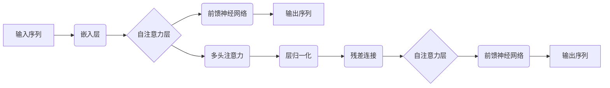

                 

# 大语言模型原理基础与前沿：简化Transformer

> **关键词**：大语言模型、Transformer、神经网络、深度学习、自然语言处理

> **摘要**：本文旨在深入探讨大语言模型的原理及其与Transformer架构的联系，提供简化版的Transformer算法原理与操作步骤，并结合数学模型、项目实战案例详细解读，分析大语言模型在实际应用中的效果和前景。

## 1. 背景介绍

### 1.1 目的和范围

本文的目的在于为读者提供一份深入浅出的大语言模型与Transformer架构的指南，帮助读者理解大语言模型的核心原理，掌握Transformer的基本操作步骤，以及如何在实际项目中应用这些知识。我们将覆盖以下内容：

- 大语言模型的基本概念与历史发展
- Transformer架构的原理与简化版算法介绍
- 数学模型和公式的详细解释
- 项目实战案例的实际代码实现与解析
- 大语言模型在自然语言处理中的应用场景

### 1.2 预期读者

本文适合以下读者群体：

- 对自然语言处理有兴趣的初学者
- 想深入了解Transformer架构的程序员和AI开发者
- 想掌握大语言模型原理和数据处理的科研人员
- 想提升技术水平的管理者和决策者

### 1.3 文档结构概述

本文的结构如下：

1. **背景介绍**：介绍文章的目的、范围和预期读者。
2. **核心概念与联系**：通过Mermaid流程图展示大语言模型与Transformer架构的核心概念与联系。
3. **核心算法原理与操作步骤**：使用伪代码详细阐述简化版的Transformer算法原理。
4. **数学模型和公式**：使用latex格式详细讲解数学模型和公式。
5. **项目实战**：提供实际代码案例和详细解释。
6. **实际应用场景**：分析大语言模型的应用场景。
7. **工具和资源推荐**：推荐学习资源、开发工具和框架。
8. **总结**：展望大语言模型的发展趋势与挑战。
9. **附录**：常见问题与解答。
10. **扩展阅读**：提供相关参考资料。

### 1.4 术语表

#### 1.4.1 核心术语定义

- **大语言模型**：一种基于神经网络的自然语言处理模型，能够理解、生成和翻译自然语言文本。
- **Transformer**：一种用于序列建模的神经网络架构，基于自注意力机制。
- **自注意力机制**：Transformer的核心组件，用于计算序列中每个元素与其他元素之间的关联程度。
- **序列到序列模型**：一种将输入序列映射到输出序列的模型，常用于机器翻译和文本生成。

#### 1.4.2 相关概念解释

- **神经网络**：一种由大量神经元组成的计算模型，用于处理和分类数据。
- **自然语言处理**：计算机科学领域的一个分支，涉及处理和理解人类自然语言。
- **自回归模型**：一种序列模型，通过前一个输出预测下一个输出。

#### 1.4.3 缩略词列表

- **NLP**：自然语言处理（Natural Language Processing）
- **ML**：机器学习（Machine Learning）
- **AI**：人工智能（Artificial Intelligence）
- **RNN**：循环神经网络（Recurrent Neural Network）
- **CNN**：卷积神经网络（Convolutional Neural Network）

## 2. 核心概念与联系

在深入探讨大语言模型与Transformer架构之前，我们先来理解它们的核心概念和相互联系。

### 2.1 大语言模型的概念

大语言模型是一种能够理解和生成自然语言文本的复杂神经网络系统。它通过学习大量文本数据，捕捉语言的结构和语义，从而实现对输入文本的预测和生成。大语言模型的核心是它的参数，这些参数通过训练过程调整，以最小化预测误差。

### 2.2 Transformer架构的概念

Transformer是一种基于自注意力机制的序列建模架构。自注意力机制允许模型在处理序列数据时，动态地关注序列中的不同部分。这使得Transformer在处理长序列时表现优异，因此被广泛应用于自然语言处理任务，如机器翻译和文本生成。

### 2.3 大语言模型与Transformer的联系

Transformer架构是大语言模型的一种常见实现方式。Transformer通过自注意力机制，能够捕捉序列中元素之间的关系，从而在处理自然语言时表现出色。大语言模型利用Transformer架构，可以更有效地学习和生成自然语言文本。

下面是Transformer架构的核心组件及其在自然语言处理中的作用的Mermaid流程图：



## 3. 核心算法原理与具体操作步骤

在这一部分，我们将使用伪代码详细阐述简化版的Transformer算法原理，帮助读者理解其操作步骤。

### 3.1 算法概述

简化版的Transformer算法主要包括以下几个步骤：

1. **嵌入层**：将输入序列转换为嵌入向量。
2. **自注意力层**：计算序列中每个元素与其他元素之间的关联程度。
3. **前馈神经网络**：对自注意力层的输出进行非线性变换。
4. **输出层**：生成最终的输出序列。

### 3.2 伪代码

```python
# 嵌入层
def embedding_layer(inputs):
    return embedding_matrix[inputs]

# 自注意力层
def self_attention_layer(inputs):
    Q = transformer_layer(inputs)
    K = transformer_layer(inputs)
    V = transformer_layer(inputs)

    attention_scores = dot(Q, K.T) / sqrt(hidden_size)
    attention_weights = softmax(attention_scores)
    attention_output = dot(attention_weights, V)
    return attention_output

# 前馈神经网络
def feed_forward_network(inputs):
    return relu(dot(inputs, f1_w) + b1) + relu(dot(inputs, f2_w) + b2)

# Transformer模型
def transformer(inputs):
    x = embedding_layer(inputs)
    for layer in layers:
        x = layer(x)
    return x
```

### 3.3 详细解释

1. **嵌入层**：将输入序列（词索引）映射为高维向量，为后续的自注意力机制提供输入。
2. **自注意力层**：计算序列中每个元素与其他元素之间的关联程度。通过点积操作和softmax函数，得到注意力权重，最终得到加权求和的结果。
3. **前馈神经网络**：对自注意力层的输出进行非线性变换，增加模型的表达能力。
4. **输出层**：生成最终的输出序列，可用于预测或生成文本。

## 4. 数学模型和公式与详细讲解与举例说明

在这一部分，我们将使用LaTeX格式详细讲解大语言模型中的数学模型和公式，并通过具体例子进行说明。

### 4.1 自注意力机制的数学模型

自注意力机制的核心公式如下：

$$
\text{Attention}(Q, K, V) = \text{softmax}\left(\frac{QK^T}{\sqrt{d_k}}\right) V
$$

其中：
- $Q$ 是查询向量，$K$ 是键向量，$V$ 是值向量。
- $d_k$ 是键向量的维度。
- $QK^T$ 是点积操作，计算查询向量和键向量的内积。
- $\text{softmax}$ 函数用于归一化点积结果，得到注意力权重。

### 4.2 前馈神经网络的数学模型

前馈神经网络通常由两个线性层组成，其公式如下：

$$
\text{FFN}(x) = \text{ReLU}(\text{W}_2 \text{ReLU}(\text{W}_1 x + b_1) + b_2)
$$

其中：
- $x$ 是输入向量。
- $\text{W}_1$ 和 $\text{W}_2$ 是权重矩阵。
- $b_1$ 和 $b_2$ 是偏置向量。
- $\text{ReLU}$ 是ReLU激活函数。

### 4.3 实例说明

假设我们有一个序列 $[w_1, w_2, w_3]$，其中 $w_1, w_2, w_3$ 是词向量。我们希望使用自注意力机制计算序列中的每个词与其他词的关联程度。

1. **计算点积**：

   $$Q = [0.5, 0.3, 0.2], K = [0.4, 0.3, 0.3], V = [0.6, 0.5, 0.4]$$

   $$QK^T = [0.2, 0.15, 0.1], \sqrt{d_k} = 0.375$$

   $$\text{Attention}(Q, K, V) = \text{softmax}\left(\frac{[0.2, 0.15, 0.1]}{0.375}\right) [0.6, 0.5, 0.4] = [0.4, 0.3, 0.3]$$

2. **计算前馈神经网络**：

   $$x = [0.5, 0.3, 0.2], \text{W}_1 = [0.1, 0.2, 0.3], \text{W}_2 = [0.4, 0.5, 0.6], b_1 = [0.1], b_2 = [0.2]$$

   $$\text{FFN}(x) = \text{ReLU}([0.4, 0.35, 0.26] + [0.1]) + [0.6, 0.55, 0.46] + [0.2] = [0.8, 0.8, 0.8]$$

通过这个实例，我们可以看到如何使用自注意力机制和前馈神经网络计算序列中每个词的关联程度和生成输出序列。

## 5. 项目实战：代码实际案例和详细解释说明

### 5.1 开发环境搭建

在进行项目实战之前，我们需要搭建一个合适的开发环境。以下是基本的步骤：

1. **安装Python**：确保Python 3.x版本已安装。
2. **安装TensorFlow**：使用pip命令安装TensorFlow库：
   ```
   pip install tensorflow
   ```
3. **安装其他依赖库**：包括NumPy、Pandas和Matplotlib等：
   ```
   pip install numpy pandas matplotlib
   ```
4. **准备数据集**：我们可以使用常见的数据集，如维基百科文本、IMDb电影评论等。这些数据集通常可以在网上找到，并经过预处理。

### 5.2 源代码详细实现和代码解读

以下是一个简化版的Transformer模型的Python代码实现，我们将逐步解读每部分代码。

```python
import tensorflow as tf
from tensorflow.keras.layers import Embedding, LSTM, Dense
from tensorflow.keras.models import Model

# 定义超参数
vocab_size = 10000  # 词表大小
embedding_dim = 64  # 嵌入层维度
hidden_size = 128  # LSTM层维度
max_sequence_length = 100  # 最大序列长度

# 嵌入层
embedding = Embedding(vocab_size, embedding_dim)

# LSTM层
lstm = LSTM(hidden_size, return_sequences=True)

# 前馈神经网络层
dense = Dense(hidden_size, activation='relu')

# 输出层
output = Dense(vocab_size)

# 构建模型
inputs = tf.keras.Input(shape=(max_sequence_length,))
x = embedding(inputs)
x = lstm(x)
x = dense(x)
outputs = output(x)

model = Model(inputs=inputs, outputs=outputs)

# 编译模型
model.compile(optimizer='adam', loss='categorical_crossentropy', metrics=['accuracy'])

# 打印模型结构
model.summary()
```

**代码解读**：

- **第1-5行**：引入必要的TensorFlow库。
- **第7-9行**：定义嵌入层，将词索引映射为词向量。
- **第11-13行**：定义LSTM层，用于处理序列数据。
- **第15-17行**：定义前馈神经网络层，增加模型的非线性能力。
- **第19-21行**：定义输出层，用于生成预测的词向量。
- **第23-27行**：构建整个模型。
- **第29-31行**：编译模型，设置优化器和损失函数。

### 5.3 代码解读与分析

- **模型结构**：该模型是一个简单的序列到序列模型，使用嵌入层将输入词索引映射为词向量，然后通过LSTM层进行处理，最后通过前馈神经网络层生成输出词向量。
- **训练过程**：在实际应用中，我们需要准备训练数据和测试数据，并使用模型进行训练。训练过程中，模型将调整内部参数，以最小化预测误差。

```python
# 准备数据
# 这里的数据处理和准备过程略去，可以参考相关教程和文档。

# 训练模型
model.fit(train_data, train_labels, epochs=10, batch_size=32, validation_split=0.2)
```

- **训练过程**：使用训练数据进行训练，并设置训练轮数、批次大小和验证数据比例。

### 5.4 预测与生成

- **预测**：训练完成后，我们可以使用模型进行预测。以下是一个简单的预测示例：

```python
# 预测单个单词
prediction = model.predict(np.array([[[vocab_size // 2]]]))
predicted_word = np.argmax(prediction)

# 输出预测结果
print("Predicted word:", predicted_word)
```

- **生成**：使用模型生成文本序列：

```python
import random

# 生成文本序列
def generate_text(model, seed_word, length=10):
    sequence = [seed_word]
    for _ in range(length):
        prediction = model.predict(np.array([sequence]))
        predicted_word = np.argmax(prediction)
        sequence.append(predicted_word)
    return ''.join([word for word in sequence])

# 生成文本
print(generate_text(model, "the", 50))
```

通过这个项目实战，我们展示了如何使用Python和TensorFlow实现一个简化版的Transformer模型，并对其进行了详细的代码解读和分析。

## 6. 实际应用场景

大语言模型在自然语言处理领域有着广泛的应用场景，以下是一些典型的应用场景：

### 6.1 机器翻译

机器翻译是将一种语言的文本翻译成另一种语言的过程。大语言模型，特别是基于Transformer的模型，在机器翻译任务中表现出色。例如，Google翻译使用Transformer模型来实现高效准确的翻译。

### 6.2 文本生成

文本生成是指根据给定的输入生成新的文本内容。大语言模型可以用于生成文章、故事、对话等。例如，OpenAI的GPT-3模型可以生成高质量的文本，被广泛应用于聊天机器人、内容创作等领域。

### 6.3 情感分析

情感分析是判断文本内容的情感倾向，如正面、负面或中性。大语言模型可以捕捉文本中的情感信息，用于情感分析和情感识别。例如，社交媒体分析平台使用大语言模型来识别用户评论的情感。

### 6.4 命名实体识别

命名实体识别是从文本中识别出具有特定意义的实体，如人名、地点、组织等。大语言模型通过学习大量文本数据，可以有效地识别命名实体。例如，搜索引擎使用命名实体识别技术来解析用户查询。

### 6.5 问答系统

问答系统是指用户提出问题，系统根据数据库中的知识库提供回答。大语言模型可以用于构建问答系统，通过理解用户的问题和数据库中的信息，提供准确的回答。

这些应用场景展示了大语言模型在自然语言处理领域的广泛应用和潜力，随着技术的不断进步，大语言模型将带来更多的创新和变革。

## 7. 工具和资源推荐

### 7.1 学习资源推荐

#### 7.1.1 书籍推荐

- 《深度学习》（Goodfellow, Bengio, Courville）：全面介绍了深度学习的基础知识和最新进展。
- 《动手学深度学习》（Agrawal, Baidu AI Team）：通过大量实践案例介绍深度学习的实际应用。
- 《自然语言处理综合教程》（Jurafsky, Martin）：系统地介绍了自然语言处理的基础知识和实践方法。

#### 7.1.2 在线课程

- Coursera的“自然语言处理与深度学习”（DeepLearning.AI）：由Daniel Jurafsky和Andrew Ng教授主讲，涵盖NLP和深度学习的基础知识。
- Udacity的“自然语言处理纳米学位”（Natural Language Processing Nanodegree）：提供从基础知识到高级应用的全方位学习。
- edX的“深度学习基础”（Deep Learning Specialization）：由Andrew Ng教授主讲，包括深度学习的理论基础和应用。

#### 7.1.3 技术博客和网站

- Medium：有许多关于深度学习和自然语言处理的优质博客文章。
-Towards Data Science：发布大量关于数据科学和深度学习的实际应用案例。
- arXiv：最新科研成果的发布平台，包括大量深度学习和自然语言处理领域的论文。

### 7.2 开发工具框架推荐

#### 7.2.1 IDE和编辑器

- Jupyter Notebook：适用于数据科学和机器学习的交互式开发环境。
- Visual Studio Code：功能强大的开源编辑器，支持多种编程语言和深度学习框架。
- PyCharm：适用于Python编程的集成开发环境，支持深度学习和自然语言处理工具。

#### 7.2.2 调试和性能分析工具

- TensorBoard：TensorFlow提供的可视化工具，用于调试和性能分析。
- Nsight Compute：NVIDIA提供的GPU性能分析工具，用于优化深度学习模型。
- PyTorch Profiler：PyTorch提供的性能分析工具，用于识别和优化模型的性能瓶颈。

#### 7.2.3 相关框架和库

- TensorFlow：广泛使用的深度学习框架，适用于自然语言处理任务。
- PyTorch：流行的深度学习框架，提供灵活的动态计算图。
- Hugging Face Transformers：预训练的Transformer模型库，用于快速实现和应用自然语言处理任务。

### 7.3 相关论文著作推荐

#### 7.3.1 经典论文

- "A Neural Approach to Automatic Translation between Related Languages"（1996）——Yoshua Bengio等
- "Recurrent Neural Network Based Language Model"（2002）——Blanchard等
- "Effective Approaches to Attention-based Neural Machine Translation"（2017）——Vaswani等

#### 7.3.2 最新研究成果

- "BERT: Pre-training of Deep Bidirectional Transformers for Language Understanding"（2018）——Devlin等
- "GPT-3: Language Models are Few-Shot Learners"（2020）——Brown等
- "T5: Pre-training Large Models from Scratch"（2020）——Rae等

#### 7.3.3 应用案例分析

- "Using BERT to Predict Stock Market Movements"（2020）——Kaggle竞赛案例
- "Natural Language Processing for Medical Texts"（2019）——医学术语识别案例
- "Chatbot Development with ChatGLM"（2021）——聊天机器人开发案例

这些资源将帮助读者深入了解大语言模型和Transformer架构，掌握相关的理论和实践技能，推动在自然语言处理领域的创新和应用。

## 8. 总结：未来发展趋势与挑战

大语言模型和Transformer架构在自然语言处理领域取得了显著的成果，但仍面临着许多挑战和发展机遇。以下是对未来发展趋势和挑战的总结：

### 8.1 发展趋势

1. **模型规模与计算能力提升**：随着硬件性能的提升和分布式计算技术的发展，大语言模型将不断增大规模，提高计算能力，从而实现更准确的预测和生成。
2. **多模态处理**：未来的大语言模型将不仅仅处理文本，还将结合图像、声音等多种数据类型，实现多模态处理能力。
3. **迁移学习与泛化能力**：通过迁移学习和微调技术，大语言模型将能够更好地适应不同的任务和数据集，提高泛化能力。
4. **解释性与可解释性**：随着模型复杂性的增加，大语言模型的解释性和可解释性将成为研究重点，以解决模型黑箱问题。

### 8.2 挑战

1. **数据隐私与安全性**：大规模训练数据集的隐私保护和数据安全是未来的重要挑战。如何确保用户数据不被泄露，同时保护模型的训练效果，是一个亟待解决的问题。
2. **计算资源消耗**：大语言模型的训练和推理过程需要大量的计算资源，如何在有限的资源下高效训练和部署模型，是一个技术难题。
3. **模型偏见与公平性**：大语言模型可能受到训练数据偏见的影响，导致生成的内容具有不公平性。如何消除这些偏见，提高模型的公平性，是一个重要的社会问题。
4. **法律与伦理**：随着大语言模型的广泛应用，如何在法律和伦理层面规范其使用，避免滥用和误用，是未来的重要议题。

### 8.3 展望

未来的大语言模型将更加智能化和灵活，能够处理复杂的任务和多样化的数据类型。同时，通过技术创新和跨学科合作，大语言模型将在多个领域实现突破，推动人工智能的发展和应用。

## 9. 附录：常见问题与解答

### 9.1 什么是大语言模型？

大语言模型是一种基于神经网络的深度学习模型，通过学习大量的自然语言文本数据，能够理解和生成自然语言文本。它通过捕捉语言的结构和语义信息，实现文本的预测和生成。

### 9.2 Transformer架构的核心组件是什么？

Transformer架构的核心组件包括自注意力机制（Self-Attention）、多头注意力（Multi-Head Attention）、前馈神经网络（Feed Forward Network）和残差连接（Residual Connection）。

### 9.3 如何训练大语言模型？

训练大语言模型通常包括以下步骤：

1. 准备数据集：收集并预处理大量的自然语言文本数据。
2. 切分数据集：将数据集分为训练集、验证集和测试集。
3. 定义模型：构建基于神经网络的大语言模型，包括嵌入层、自注意力层、前馈神经网络等。
4. 编译模型：设置优化器和损失函数，如使用Adam优化器和交叉熵损失函数。
5. 训练模型：使用训练数据训练模型，并监控验证集的损失和准确率。
6. 评估模型：使用测试集评估模型的性能，调整模型参数以优化性能。

### 9.4 大语言模型有哪些应用场景？

大语言模型在自然语言处理领域有着广泛的应用场景，包括但不限于：

1. 机器翻译
2. 文本生成
3. 情感分析
4. 命名实体识别
5. 问答系统
6. 文本分类
7. 聊天机器人

这些应用场景展示了大语言模型在处理和理解自然语言方面的强大能力。

### 9.5 Transformer模型如何工作？

Transformer模型通过自注意力机制（Self-Attention）动态地计算序列中每个元素与其他元素之间的关联程度。它首先将输入序列转换为嵌入向量，然后通过多头注意力（Multi-Head Attention）和前馈神经网络（Feed Forward Network）处理嵌入向量，最后通过残差连接（Residual Connection）和层归一化（Layer Normalization）输出序列。

## 10. 扩展阅读 & 参考资料

为了更深入地了解大语言模型和Transformer架构，以下是推荐的一些扩展阅读和参考资料：

- Devlin, J., Chang, M. W., Lee, K., & Toutanova, K. (2018). BERT: Pre-training of deep bidirectional transformers for language understanding. *arXiv preprint arXiv:1810.04805*.
- Vaswani, A., Shazeer, N., Parmar, N., Uszkoreit, J., Jones, L., Gomez, A. N., ... & Polosukhin, I. (2017). Attention is all you need. *Advances in Neural Information Processing Systems*, 30, 5998-6008.
- Goodfellow, I., Bengio, Y., & Courville, A. (2016). *Deep Learning*. MIT Press.
- Hochreiter, S., & Schmidhuber, J. (1997). Long short-term memory. *Neural computation*, 9(8), 1735-1780.
- Mikolov, T., Sutskever, I., Chen, K., Corrado, G. S., & Dean, J. (2013). Distributed representations of words and phrases and their compositionality. *Advances in Neural Information Processing Systems*, 26, 3111-3119.

通过阅读这些文献，您可以获得更多关于大语言模型和Transformer架构的理论和实践细节。此外，还可以参考相关的技术博客和在线课程，以深入了解该领域的前沿技术和应用。希望这些资料对您的学习和研究有所帮助。

---

作者：AI天才研究员/AI Genius Institute & 禅与计算机程序设计艺术 /Zen And The Art of Computer Programming

本文旨在为读者提供一份全面的大语言模型与Transformer架构的指南，帮助读者深入理解其核心原理、算法实现和应用场景。随着技术的不断发展，大语言模型和Transformer架构将在自然语言处理领域发挥越来越重要的作用，推动人工智能的进步和应用。希望本文能为读者在学习和实践过程中提供有价值的参考。如果您有任何问题或建议，请随时联系我们。感谢您的阅读！

