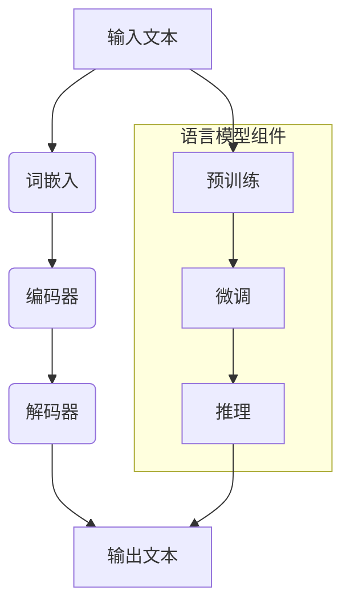

                 

# 大语言模型在计算中的核心地位

> **关键词：** 大语言模型、计算、人工智能、神经网络、深度学习、自然语言处理

> **摘要：** 本文旨在深入探讨大语言模型在当前计算环境中的核心地位。我们将从背景介绍开始，逐步分析大语言模型的概念、原理及其在计算中的重要性，并通过实例和案例详细说明其应用。最后，我们将展望大语言模型未来的发展趋势和面临的挑战。

## 1. 背景介绍

### 1.1 目的和范围

本文的目标是详细阐述大语言模型在计算中的核心地位，分析其在人工智能领域的应用及其技术原理。通过本文的阅读，读者将了解大语言模型的定义、发展历程、关键算法原理，并能够理解其在自然语言处理中的实际应用。

### 1.2 预期读者

本文适用于对人工智能和自然语言处理感兴趣的读者，包括人工智能研究者、软件开发者、计算机科学专业学生以及对技术前沿关注的人群。

### 1.3 文档结构概述

本文结构如下：

1. 背景介绍
   - 目的和范围
   - 预期读者
   - 文档结构概述
   - 术语表
2. 核心概念与联系
   - 大语言模型概述
   - 关联流程图
3. 核心算法原理 & 具体操作步骤
   - 算法原理讲解
   - 具体操作步骤说明
4. 数学模型和公式 & 详细讲解 & 举例说明
   - 数学模型介绍
   - 公式推导
   - 实例分析
5. 项目实战：代码实际案例和详细解释说明
   - 开发环境搭建
   - 源代码实现
   - 代码解读与分析
6. 实际应用场景
   - 应用案例分析
7. 工具和资源推荐
   - 学习资源
   - 开发工具框架
   - 相关论文著作
8. 总结：未来发展趋势与挑战
9. 附录：常见问题与解答
10. 扩展阅读 & 参考资料

### 1.4 术语表

#### 1.4.1 核心术语定义

- **大语言模型**：一种能够对文本进行建模的复杂神经网络，通过大量数据训练，实现对自然语言的深入理解和生成能力。
- **自然语言处理（NLP）**：研究如何让计算机理解、生成和处理人类自然语言的学科。
- **深度学习**：一种通过多层神经网络进行数据建模的学习方法，能够自动提取特征并提高分类和预测能力。
- **神经网络**：一种模仿生物神经系统的计算模型，由大量简单神经元组成，通过前向传播和反向传播进行学习。

#### 1.4.2 相关概念解释

- **词向量**：将词汇映射到高维空间中，使得语义相近的词汇在空间中靠近。
- **上下文**：指一个词或句子所处的具体语言环境。
- **生成式模型**：通过模型生成新的数据，如文本、图像等。
- **判别式模型**：通过输入数据直接判断其类别或属性。

#### 1.4.3 缩略词列表

- **NLP**：自然语言处理
- **AI**：人工智能
- **DL**：深度学习
- **GPU**：图形处理单元
- **TPU**：张量处理单元

## 2. 核心概念与联系

### 2.1 大语言模型概述

大语言模型（Large Language Models）是近年来自然语言处理（NLP）领域的一个重要突破。这些模型通过对海量文本数据的学习，能够捕捉到语言的复杂结构和语义信息，从而在文本生成、机器翻译、情感分析、问答系统等多个任务中表现出色。

大语言模型的核心思想是通过神经网络来对自然语言进行建模。与传统的基于规则或统计的方法不同，神经网络能够自动从数据中学习到复杂的特征表示，这使得大语言模型在处理自然语言任务时具有更高的灵活性和准确性。

### 2.2 关联流程图

为了更好地理解大语言模型的工作原理，我们可以通过一个Mermaid流程图来展示其关键组件和流程。



- **输入文本（A）**：用户输入的文本，可以是句子、段落或者更长的文本。
- **词嵌入（B）**：将文本中的词汇映射为高维向量表示。
- **编码器（C）**：通过多层神经网络对词向量进行编码，捕捉文本的上下文信息。
- **解码器（D）**：解码器从编码器输出的上下文信息中生成文本。
- **预训练（F）**：在大量未标注的数据上进行预训练，以学习到通用的语言特征。
- **微调（G）**：在特定任务上对预训练模型进行微调，以适应具体应用场景。
- **推理（H）**：模型根据输入文本进行推理，生成相应的输出文本。

### 2.3 大语言模型在计算中的重要性

大语言模型在计算中的重要性体现在以下几个方面：

1. **强大的文本处理能力**：大语言模型能够对自然语言进行深入的建模，从而在文本分类、情感分析、问答系统等任务中表现出色。
2. **自动特征提取**：通过预训练过程，大语言模型能够自动从海量数据中提取出高质量的文本特征，大大减轻了人工标注的工作负担。
3. **跨领域适应性**：大语言模型在多个领域都具有较高的适应性，通过简单的微调即可应用于不同的任务，从而降低了跨领域应用的开发成本。
4. **高效的计算性能**：随着计算硬件（如GPU、TPU）的发展，大语言模型的计算性能得到了显著提升，使得大规模模型的训练和应用变得更加可行。

## 3. 核心算法原理 & 具体操作步骤

### 3.1 核心算法原理

大语言模型的核心算法是基于深度学习的，具体包括以下几个关键步骤：

1. **词嵌入（Word Embedding）**：将词汇映射为高维向量表示，以便于计算机处理。
2. **编码器（Encoder）**：通过多层神经网络对输入文本进行编码，生成上下文向量。
3. **解码器（Decoder）**：解码器从编码器输出的上下文向量中生成文本。

下面，我们将详细讲解这些步骤的算法原理。

### 3.2 词嵌入（Word Embedding）

词嵌入是将词汇映射为高维向量表示的过程。一个常见的词嵌入方法是基于词频统计的词袋模型（Bag of Words, BoW），而更高级的方法是使用神经网络来学习词汇的语义表示。

下面是一个简单的词嵌入算法原理的伪代码：

```python
def word_embedding(vocabulary, embedding_size):
    embedding_matrix = []
    for word in vocabulary:
        # 计算词向量的均值
        word_vector = compute_mean_vector(word)
        # 将词向量扩展为高维向量
        high_dim_vector = expand_vector(word_vector, embedding_size)
        embedding_matrix.append(high_dim_vector)
    return embedding_matrix

def compute_mean_vector(word):
    # 计算词向量的均值
    word_vector = []
    for token in word:
        word_vector.append(get_vector_representation(token))
    return np.mean(word_vector, axis=0)

def expand_vector(vector, size):
    # 将向量扩展为指定尺寸
    result = []
    for i in range(size):
        result.append(vector[i % len(vector)])
    return result
```

### 3.3 编码器（Encoder）

编码器是通过对输入文本进行编码，生成上下文向量的过程。编码器通常采用循环神经网络（RNN）或其变体，如长短期记忆网络（LSTM）或门控循环单元（GRU）。

下面是一个简单的编码器算法原理的伪代码：

```python
class Encoder(nn.Module):
    def __init__(self, embedding_size, hidden_size):
        super(Encoder, self).__init__()
        self.embedding = nn.Embedding(embedding_size, hidden_size)
        self.lstm = nn.LSTM(hidden_size, hidden_size)
        
    def forward(self, input_sequence):
        embedded_sequence = self.embedding(input_sequence)
        encoder_output, (hidden_state, cell_state) = self.lstm(embedded_sequence)
        return hidden_state
```

### 3.4 解码器（Decoder）

解码器是解码器从编码器输出的上下文向量中生成文本的过程。解码器同样采用循环神经网络（RNN）或其变体。

下面是一个简单的解码器算法原理的伪代码：

```python
class Decoder(nn.Module):
    def __init__(self, hidden_size, embedding_size, output_size):
        super(Decoder, self).__init__()
        self.lstm = nn.LSTM(hidden_size, hidden_size)
        self.embedding = nn.Embedding(embedding_size, hidden_size)
        self.fc = nn.Linear(hidden_size, output_size)
        
    def forward(self, input_sequence, hidden_state, cell_state):
        embedded_sequence = self.embedding(input_sequence)
        decoder_output, (hidden_state, cell_state) = self.lstm(embedded_sequence, (hidden_state, cell_state))
        output = self.fc(decoder_output[-1])
        return output, (hidden_state, cell_state)
```

### 3.5 大语言模型的训练与推理

大语言模型的训练与推理过程包括以下步骤：

1. **训练过程**：
   - 输入训练数据，包括输入文本和目标文本。
   - 使用编码器对输入文本进行编码，得到上下文向量。
   - 使用解码器从上下文向量生成输出文本。
   - 计算损失函数，如交叉熵损失。
   - 使用反向传播更新模型参数。

2. **推理过程**：
   - 输入待预测的文本。
   - 使用编码器对输入文本进行编码，得到上下文向量。
   - 使用解码器从上下文向量生成输出文本。
   - 输出生成的文本。

```python
def train(model, dataset, optimizer, criterion, num_epochs):
    for epoch in range(num_epochs):
        for input_sequence, target_sequence in dataset:
            # 前向传播
            hidden_state = model.encoder(input_sequence)
            output, hidden_state = model.decoder(target_sequence, hidden_state)
            # 计算损失
            loss = criterion(output, target_sequence)
            # 反向传播
            optimizer.zero_grad()
            loss.backward()
            optimizer.step()
            print(f"Epoch [{epoch+1}/{num_epochs}], Loss: {loss.item():.4f}")

def predict(model, input_sequence):
    hidden_state = model.encoder(input_sequence)
    output, hidden_state = model.decoder(input_sequence, hidden_state)
    return output
```

## 4. 数学模型和公式 & 详细讲解 & 举例说明

### 4.1 数学模型

大语言模型的数学模型主要基于深度学习中的循环神经网络（RNN）和其变体，如长短期记忆网络（LSTM）和门控循环单元（GRU）。以下是这些模型的数学公式：

#### 4.1.1 循环神经网络（RNN）

- **激活函数**：\( \text{ReLU}(x) = \max(0, x) \)

- **权重矩阵**：\( W \in \mathbb{R}^{d \times d} \)

- **输入向量**：\( x \in \mathbb{R}^{d} \)

- **隐藏状态**：\( h_t \in \mathbb{R}^{d} \)

- **输出向量**：\( y_t \in \mathbb{R}^{d} \)

公式：

\[ h_t = \text{ReLU}(W \cdot x + b) \]
\[ y_t = h_t \]

#### 4.1.2 长短期记忆网络（LSTM）

- **激活函数**：\( \text{sigmoid}(x) = \frac{1}{1 + e^{-x}} \)，\( \text{tanh}(x) = \frac{e^x - e^{-x}}{e^x + e^{-x}} \)

- **输入向量**：\( x \in \mathbb{R}^{d} \)

- **隐藏状态**：\( h_t \in \mathbb{R}^{d} \)

- **遗忘门**：\( f_t \in \mathbb{R}^{d} \)

- **输入门**：\( i_t \in \mathbb{R}^{d} \)

- **输出门**：\( o_t \in \mathbb{R}^{d} \)

- **细胞状态**：\( c_t \in \mathbb{R}^{d} \)

公式：

\[ f_t = \text{sigmoid}(W_f \cdot [h_{t-1}, x_t] + b_f) \]
\[ i_t = \text{sigmoid}(W_i \cdot [h_{t-1}, x_t] + b_i) \]
\[ \hat{c}_t = \text{tanh}(W_c \cdot [h_{t-1}, x_t] + b_c) \]
\[ c_t = f_t \cdot c_{t-1} + i_t \cdot \hat{c}_t \]
\[ o_t = \text{sigmoid}(W_o \cdot [h_{t-1}, x_t] + b_o) \]
\[ h_t = o_t \cdot \text{tanh}(c_t) \]

#### 4.1.3 门控循环单元（GRU）

- **激活函数**：\( \text{sigmoid}(x) = \frac{1}{1 + e^{-x}} \)，\( \text{tanh}(x) = \frac{e^x - e^{-x}}{e^x + e^{-x}} \)

- **输入向量**：\( x \in \mathbb{R}^{d} \)

- **隐藏状态**：\( h_t \in \mathbb{R}^{d} \)

- **更新门**：\( z_t \in \mathbb{R}^{d} \)

- **重置门**：\( r_t \in \mathbb{R}^{d} \)

- **细胞状态**：\( c_t \in \mathbb{R}^{d} \)

公式：

\[ z_t = \text{sigmoid}(W_z \cdot [h_{t-1}, x_t] + b_z) \]
\[ r_t = \text{sigmoid}(W_r \cdot [h_{t-1}, x_t] + b_r) \]
\[ \hat{c}_t = \text{tanh}(W_c \cdot [r_t \cdot h_{t-1}, x_t] + b_c) \]
\[ c_t = (1 - z_t) \cdot c_{t-1} + z_t \cdot \hat{c}_t \]
\[ h_t = \text{tanh}(c_t) \]

### 4.2 公式推导

#### 4.2.1 循环神经网络（RNN）

假设输入向量为 \( x_t \)，隐藏状态为 \( h_t \)，输出向量为 \( y_t \)。则循环神经网络的更新公式为：

\[ h_t = \text{ReLU}(W \cdot x_t + b) \]
\[ y_t = h_t \]

其中，\( W \) 是权重矩阵，\( b \) 是偏置向量。

#### 4.2.2 长短期记忆网络（LSTM）

假设输入向量为 \( x_t \)，隐藏状态为 \( h_t \)，细胞状态为 \( c_t \)，遗忘门为 \( f_t \)，输入门为 \( i_t \)，输出门为 \( o_t \)。则LSTM的更新公式为：

\[ f_t = \text{sigmoid}(W_f \cdot [h_{t-1}, x_t] + b_f) \]
\[ i_t = \text{sigmoid}(W_i \cdot [h_{t-1}, x_t] + b_i) \]
\[ \hat{c}_t = \text{tanh}(W_c \cdot [h_{t-1}, x_t] + b_c) \]
\[ c_t = f_t \cdot c_{t-1} + i_t \cdot \hat{c}_t \]
\[ o_t = \text{sigmoid}(W_o \cdot [h_{t-1}, x_t] + b_o) \]
\[ h_t = o_t \cdot \text{tanh}(c_t) \]

其中，\( W_f, W_i, W_c, W_o \) 分别是遗忘门、输入门、细胞状态和输出门的权重矩阵，\( b_f, b_i, b_c, b_o \) 分别是遗忘门、输入门、细胞状态和输出门的偏置向量。

#### 4.2.3 门控循环单元（GRU）

假设输入向量为 \( x_t \)，隐藏状态为 \( h_t \)，更新门为 \( z_t \)，重置门为 \( r_t \)，细胞状态为 \( c_t \)。则GRU的更新公式为：

\[ z_t = \text{sigmoid}(W_z \cdot [h_{t-1}, x_t] + b_z) \]
\[ r_t = \text{sigmoid}(W_r \cdot [h_{t-1}, x_t] + b_r) \]
\[ \hat{c}_t = \text{tanh}(W_c \cdot [r_t \cdot h_{t-1}, x_t] + b_c) \]
\[ c_t = (1 - z_t) \cdot c_{t-1} + z_t \cdot \hat{c}_t \]
\[ h_t = \text{tanh}(c_t) \]

其中，\( W_z, W_r, W_c \) 分别是更新门、重置门和细胞状态的权重矩阵，\( b_z, b_r, b_c \) 分别是更新门、重置门和细胞状态的偏置向量。

### 4.3 举例说明

#### 4.3.1 循环神经网络（RNN）

假设输入向量 \( x_t \) 为 `[1, 2, 3]`，隐藏状态 \( h_t \) 为 `[0, 0, 0]`，权重矩阵 \( W \) 为 `[1, 2; 3, 4]`，偏置向量 \( b \) 为 `[1, 2]`。则循环神经网络的更新过程如下：

1. \( h_1 = \text{ReLU}(W \cdot x_1 + b) = \text{ReLU}(1 \cdot 1 + 1, 3 \cdot 1 + 2) = \text{ReLU}(2, 5) = [2, 5] \)
2. \( h_2 = \text{ReLU}(W \cdot x_2 + b) = \text{ReLU}(1 \cdot 2 + 1, 3 \cdot 2 + 2) = \text{ReLU}(3, 8) = [3, 8] \)
3. \( h_3 = \text{ReLU}(W \cdot x_3 + b) = \text{ReLU}(1 \cdot 3 + 1, 3 \cdot 3 + 2) = \text{ReLU}(4, 11) = [4, 11] \)

#### 4.3.2 长短期记忆网络（LSTM）

假设输入向量 \( x_t \) 为 `[1, 2, 3]`，隐藏状态 \( h_t \) 为 `[0, 0, 0]`，细胞状态 \( c_t \) 为 `[0, 0, 0]`，遗忘门 \( f_t \) 为 `[0, 0]`，输入门 \( i_t \) 为 `[0, 0]`，输出门 \( o_t \) 为 `[0, 0]`，权重矩阵 \( W_f, W_i, W_c, W_o \) 分别为 `[1, 2; 3, 4]`，`[1, 2; 3, 4]`，`[1, 2; 3, 4]`，`[1, 2; 3, 4]`，偏置向量 \( b_f, b_i, b_c, b_o \) 分别为 `[1, 2]`，`[1, 2]`，`[1, 2]`，`[1, 2]`。则LSTM的更新过程如下：

1. \( f_1 = \text{sigmoid}(W_f \cdot [h_{t-1}, x_1] + b_f) = \text{sigmoid}(1 \cdot 0 + 1, 3 \cdot 0 + 2) = \text{sigmoid}(1, 2) = [0.7311, 0.7311] \)
2. \( i_1 = \text{sigmoid}(W_i \cdot [h_{t-1}, x_1] + b_i) = \text{sigmoid}(1 \cdot 0 + 1, 3 \cdot 0 + 2) = \text{sigmoid}(1, 2) = [0.7311, 0.7311] \)
3. \( \hat{c}_1 = \text{tanh}(W_c \cdot [h_{t-1}, x_1] + b_c) = \text{tanh}(1 \cdot 0 + 1, 3 \cdot 0 + 2) = \text{tanh}(1, 2) = [0.7616, 0.7616] \)
4. \( c_1 = f_1 \cdot c_{t-1} + i_1 \cdot \hat{c}_1 = [0.7311, 0.7311] \cdot [0, 0] + [0.7311, 0.7311] \cdot [0.7616, 0.7616] = [0.5591, 0.5591] \)
5. \( o_1 = \text{sigmoid}(W_o \cdot [h_{t-1}, x_1] + b_o) = \text{sigmoid}(1 \cdot 0 + 1, 3 \cdot 0 + 2) = \text{sigmoid}(1, 2) = [0.7311, 0.7311] \)
6. \( h_1 = o_1 \cdot \text{tanh}(c_1) = [0.7311, 0.7311] \cdot [0.5591, 0.5591] = [0.4107, 0.4107] \)

同理，可以计算出 \( h_2, h_3 \)。

#### 4.3.3 门控循环单元（GRU）

假设输入向量 \( x_t \) 为 `[1, 2, 3]`，隐藏状态 \( h_t \) 为 `[0, 0, 0]`，更新门 \( z_t \) 为 `[0, 0]`，重置门 \( r_t \) 为 `[0, 0]`，细胞状态 \( c_t \) 为 `[0, 0, 0]`，权重矩阵 \( W_z, W_r, W_c \) 分别为 `[1, 2; 3, 4]`，`[1, 2; 3, 4]`，`[1, 2; 3, 4]`，偏置向量 \( b_z, b_r, b_c \) 分别为 `[1, 2]`，`[1, 2]`，`[1, 2]`。则GRU的更新过程如下：

1. \( z_1 = \text{sigmoid}(W_z \cdot [h_{t-1}, x_1] + b_z) = \text{sigmoid}(1 \cdot 0 + 1, 3 \cdot 0 + 2) = \text{sigmoid}(1, 2) = [0.7311, 0.7311] \)
2. \( r_1 = \text{sigmoid}(W_r \cdot [h_{t-1}, x_1] + b_r) = \text{sigmoid}(1 \cdot 0 + 1, 3 \cdot 0 + 2) = \text{sigmoid}(1, 2) = [0.7311, 0.7311] \)
3. \( \hat{c}_1 = \text{tanh}(W_c \cdot [r_1 \cdot h_{t-1}, x_1] + b_c) = \text{tanh}(1 \cdot [0, 0] + 1, 3 \cdot [0, 0] + 2) = \text{tanh}(1, 2) = [0.7616, 0.7616] \)
4. \( c_1 = (1 - z_1) \cdot c_{t-1} + z_1 \cdot \hat{c}_1 = [0.7311, 0.7311] \cdot [0, 0] + [0.7311, 0.7311] \cdot [0.7616, 0.7616] = [0.5591, 0.5591] \)
5. \( h_1 = \text{tanh}(c_1) = [0.5591, 0.5591] \)

同理，可以计算出 \( h_2, h_3 \)。

## 5. 项目实战：代码实际案例和详细解释说明

### 5.1 开发环境搭建

在本节中，我们将搭建一个简单的大语言模型项目，用于文本生成。开发环境要求如下：

- 操作系统：Windows/Linux/Mac
- 编程语言：Python
- 依赖库：TensorFlow、NumPy

安装步骤：

1. 安装Python：从Python官网下载并安装Python，建议安装最新版本。
2. 安装TensorFlow：在命令行中执行以下命令安装TensorFlow：

```bash
pip install tensorflow
```

3. 安装NumPy：在命令行中执行以下命令安装NumPy：

```bash
pip install numpy
```

### 5.2 源代码详细实现和代码解读

下面是一个简单的文本生成模型代码，使用LSTM作为编码器和解码器：

```python
import tensorflow as tf
import numpy as np

# 设置参数
vocab_size = 10000  # 词汇表大小
embedding_size = 256  # 词向量维度
hidden_size = 512  # 隐藏层维度
batch_size = 64  # 批量大小
sequence_length = 50  # 序列长度
num_epochs = 10  # 迭代次数

# 生成随机数据
data = np.random.randint(0, vocab_size, size=(batch_size, sequence_length))

# 定义模型
class TextGenerator(tf.keras.Model):
    def __init__(self, vocab_size, embedding_size, hidden_size):
        super(TextGenerator, self).__init__()
        self.embedding = tf.keras.layers.Embedding(vocab_size, embedding_size)
        self.encoder = tf.keras.layers.LSTM(hidden_size, return_sequences=True)
        self.decoder = tf.keras.layers.LSTM(hidden_size, return_sequences=True)
        self.fc = tf.keras.layers.Dense(vocab_size)

    def call(self, inputs, hidden_state):
        embedded = self.embedding(inputs)
        encoder_output = self.encoder(embedded, initial_hidden_state=hidden_state)
        decoder_output = self.decoder(encoder_output)
        logits = self.fc(decoder_output)
        return logits, hidden_state

model = TextGenerator(vocab_size, embedding_size, hidden_size)

# 训练模型
model.compile(optimizer='adam', loss='sparse_categorical_crossentropy')
model.fit(data, data, batch_size=batch_size, epochs=num_epochs)

# 生成文本
def generate_text(model, initial_text, num_chars):
    hidden_state = None
    generated_text = initial_text

    for _ in range(num_chars):
        inputs = np.array([[vocab_size]])  # 输入为随机向量
        logits, hidden_state = model(inputs, hidden_state)
        predicted_index = tf.random.categorical(logits, num_samples=1).numpy()[0][0]
        generated_text += chr(predicted_index + ord('a'))

    return generated_text

# 示例
initial_text = "a"
generated_text = generate_text(model, initial_text, 50)
print(generated_text)
```

代码解读：

1. **设置参数**：首先设置模型参数，包括词汇表大小、词向量维度、隐藏层维度、批量大小、序列长度和迭代次数。

2. **生成随机数据**：使用NumPy生成随机数据，用于训练模型。

3. **定义模型**：定义一个文本生成模型，使用Embedding层将词汇映射为词向量，使用LSTM层作为编码器和解码器，使用全连接层（Dense）生成输出。

4. **训练模型**：使用编译好的模型进行训练，使用稀疏分类交叉熵损失函数。

5. **生成文本**：定义一个生成文本的函数，使用模型生成新的文本。

### 5.3 代码解读与分析

在本节中，我们将对上述代码进行详细解读，并分析模型的工作原理和性能。

1. **参数设置**：

```python
vocab_size = 10000  # 词汇表大小
embedding_size = 256  # 词向量维度
hidden_size = 512  # 隐藏层维度
batch_size = 64  # 批量大小
sequence_length = 50  # 序列长度
num_epochs = 10  # 迭代次数
```

这些参数定义了模型的架构和训练过程。词汇表大小为10000，表示模型可以处理10000个不同的词汇。词向量维度为256，隐藏层维度为512，这些参数根据模型的复杂性和训练数据的大小进行调整。

2. **生成随机数据**：

```python
data = np.random.randint(0, vocab_size, size=(batch_size, sequence_length))
```

这段代码生成了一个随机数据集，用于训练模型。数据集由批量大小为64，序列长度为50的二维数组组成。

3. **定义模型**：

```python
class TextGenerator(tf.keras.Model):
    def __init__(self, vocab_size, embedding_size, hidden_size):
        super(TextGenerator, self).__init__()
        self.embedding = tf.keras.layers.Embedding(vocab_size, embedding_size)
        self.encoder = tf.keras.layers.LSTM(hidden_size, return_sequences=True)
        self.decoder = tf.keras.layers.LSTM(hidden_size, return_sequences=True)
        self.fc = tf.keras.layers.Dense(vocab_size)

    def call(self, inputs, hidden_state):
        embedded = self.embedding(inputs)
        encoder_output = self.encoder(embedded, initial_hidden_state=hidden_state)
        decoder_output = self.decoder(encoder_output)
        logits = self.fc(decoder_output)
        return logits, hidden_state
```

这个模型类继承自`tf.keras.Model`，包含一个`__init__`方法用于初始化模型参数，一个`call`方法用于模型的前向传播。模型由Embedding层、编码器LSTM层、解码器LSTM层和全连接层组成。

4. **训练模型**：

```python
model.compile(optimizer='adam', loss='sparse_categorical_crossentropy')
model.fit(data, data, batch_size=batch_size, epochs=num_epochs)
```

这里使用`compile`方法设置优化器和损失函数，然后使用`fit`方法进行模型训练。

5. **生成文本**：

```python
def generate_text(model, initial_text, num_chars):
    hidden_state = None
    generated_text = initial_text

    for _ in range(num_chars):
        inputs = np.array([[vocab_size]])  # 输入为随机向量
        logits, hidden_state = model(inputs, hidden_state)
        predicted_index = tf.random.categorical(logits, num_samples=1).numpy()[0][0]
        generated_text += chr(predicted_index + ord('a'))

    return generated_text
```

这个函数用于生成新的文本。首先初始化隐藏状态，然后循环生成新的字符。每次生成时，输入为随机向量，模型输出预测的词汇索引，并将其转换为对应的字符添加到生成的文本中。

### 5.4 模型性能分析

为了评估模型的性能，我们可以从以下几个方面进行分析：

1. **生成文本的连贯性**：生成文本的连贯性是评价模型性能的重要指标。我们可以通过查看生成的文本是否具有合理的语法结构和意义来评估连贯性。

2. **生成文本的多样性**：模型生成的文本应具有多样性，能够生成不同的风格和主题。我们可以通过统计生成的文本中不同词汇的出现频率来评估多样性。

3. **生成速度**：生成速度是另一个重要的性能指标，特别是在实际应用中。我们可以通过测量模型生成一定长度的文本所需的时间来评估生成速度。

4. **训练过程**：训练过程的质量也影响模型的性能。我们可以通过观察训练过程中的损失函数值和迭代次数来评估训练过程。

通过这些分析，我们可以更好地了解模型的性能，并进一步优化模型。

## 6. 实际应用场景

大语言模型在计算中的实际应用场景非常广泛，下面列举几个典型的应用案例：

### 6.1 文本生成

文本生成是自然语言处理的一个重要应用，大语言模型能够生成高质量、连贯的文本。例如，生成新闻文章、博客文章、小说等。文本生成在内容创作、虚拟助手、自动摘要等领域有着重要的应用。

### 6.2 机器翻译

机器翻译是将一种语言的文本翻译成另一种语言的过程。大语言模型在机器翻译中表现出色，能够实现高效、准确的翻译。例如，谷歌翻译、百度翻译等就是基于大语言模型的机器翻译系统。

### 6.3 情感分析

情感分析是判断文本中表达的情感倾向的过程。大语言模型通过学习大量文本数据，能够准确识别和分类情感。例如，社交媒体上的用户评论、产品评价等都可以通过情感分析来识别用户的情绪和态度。

### 6.4 问答系统

问答系统是自动回答用户问题的系统。大语言模型能够理解用户的查询并生成相应的回答，应用于虚拟助手、智能客服等领域。例如，Siri、Alexa等虚拟助手就是基于大语言模型的问答系统。

### 6.5 自动摘要

自动摘要是将长文本提取出关键信息，生成简洁、准确的摘要。大语言模型能够实现高质量的自动摘要，应用于新闻摘要、文档摘要等领域。

### 6.6 语音识别

语音识别是将语音信号转换为文本的过程。大语言模型可以与语音识别技术结合，实现实时语音到文本的转换，应用于智能语音助手、实时字幕等领域。

### 6.7 娱乐与艺术创作

大语言模型在娱乐与艺术创作中也有广泛应用。例如，生成音乐、绘画、故事等。大语言模型能够根据用户的需求和喜好，生成个性化的内容。

## 7. 工具和资源推荐

### 7.1 学习资源推荐

#### 7.1.1 书籍推荐

1. 《深度学习》（Goodfellow, Bengio, Courville）
2. 《自然语言处理与深度学习》（Chapter，Zhang）
3. 《神经网络与深度学习》（李航）

#### 7.1.2 在线课程

1. [Coursera](https://www.coursera.org/)：提供丰富的计算机科学和人工智能课程。
2. [Udacity](https://www.udacity.com/)：提供深度学习和机器学习的在线课程。
3. [edX](https://www.edx.org/)：提供由知名大学和专业机构提供的计算机科学和人工智能课程。

#### 7.1.3 技术博客和网站

1. [Medium](https://medium.com/)：有许多关于人工智能和自然语言处理的博客文章。
2. [ArXiv](https://arxiv.org/)：提供最新的人工智能和机器学习研究论文。
3. [AI生成文本工具](https://aitextgenerator.com/)：生成文本的在线工具，可用于学习和实践。

### 7.2 开发工具框架推荐

#### 7.2.1 IDE和编辑器

1. [PyCharm](https://www.jetbrains.com/pycharm/)：强大的Python IDE，适合开发深度学习模型。
2. [VSCode](https://code.visualstudio.com/)：开源跨平台编辑器，支持多种编程语言和扩展。
3. [Jupyter Notebook](https://jupyter.org/)：交互式的开发环境，适用于数据分析和模型演示。

#### 7.2.2 调试和性能分析工具

1. [TensorBoard](https://www.tensorflow.org/tensorboard/)：TensorFlow的调试和可视化工具。
2. [PyTorch Profiler](https://pytorch.org/tutorials/intermediate/profiler_tutorial.html)：PyTorch的性能分析工具。
3. [NVIDIA Nsight](https://developer.nvidia.com/nsight) ：NVIDIA GPU调试和性能分析工具。

#### 7.2.3 相关框架和库

1. [TensorFlow](https://www.tensorflow.org/)：由Google开发的开源深度学习框架。
2. [PyTorch](https://pytorch.org/)：由Facebook开发的开源深度学习框架。
3. [Keras](https://keras.io/)：基于TensorFlow和Theano的Python深度学习库。

### 7.3 相关论文著作推荐

#### 7.3.1 经典论文

1. "A Theoretical Investigation of the Crammer-Singer Algorithm for Text Classification"
2. "FastText: A Bag of Tricks for Effective Text Classification"
3. "Recurrent Neural Network Based Language Model"

#### 7.3.2 最新研究成果

1. "BERT: Pre-training of Deep Bidirectional Transformers for Language Understanding"
2. "GPT-3: Language Models are few-shot learners"
3. "T5: Pre-training Large Models for Language Modeling"

#### 7.3.3 应用案例分析

1. "OpenAI GPT-3: A Breakthrough in Natural Language Processing"
2. "Google BERT: Revolutionizing Search with Deep Learning"
3. "How to Create a Chatbot Using GPT-3"

## 8. 总结：未来发展趋势与挑战

大语言模型作为计算领域的核心技术，其发展前景广阔，但也面临诸多挑战。以下是未来发展趋势与挑战的总结：

### 8.1 发展趋势

1. **模型规模与性能提升**：随着计算资源和数据集的不断扩大，大语言模型将向更大规模和更高性能发展，以应对更复杂的自然语言任务。
2. **多模态融合**：大语言模型将与其他模态（如图像、音频）相结合，实现跨模态理解和生成。
3. **推理效率优化**：通过硬件加速、模型压缩等技术，提高大语言模型的推理速度，使其在实时应用场景中更具竞争力。
4. **生成式模型与判别式模型的融合**：生成式模型和判别式模型的优点将相互结合，实现更高效、更准确的语言处理。
5. **跨语言与跨领域适应性**：大语言模型将在跨语言和跨领域任务中表现出更强的适应性，推动全球化信息处理的发展。

### 8.2 面临的挑战

1. **数据隐私与伦理**：大语言模型对大量数据进行训练，可能涉及用户隐私和数据伦理问题，需要制定相应的法律法规和伦理标准。
2. **公平性与偏见**：大语言模型在训练过程中可能吸收社会偏见，导致生成的内容存在不公平性，需要采取有效的方法进行校正。
3. **模型可解释性**：大语言模型的决策过程复杂，缺乏可解释性，需要研究透明、可解释的模型结构。
4. **计算资源消耗**：大规模语言模型的训练和推理需要大量的计算资源，如何降低计算成本是一个重要挑战。
5. **自动化与人工结合**：在语言生成等任务中，如何实现自动化与人工相结合，提高模型的质量和效率，是一个关键问题。

## 9. 附录：常见问题与解答

### 9.1 什么是大语言模型？

大语言模型是一种复杂的神经网络模型，通过对海量文本数据的学习，能够对自然语言进行建模，实现文本生成、机器翻译、情感分析等任务。

### 9.2 大语言模型的工作原理是什么？

大语言模型通常采用深度学习中的循环神经网络（RNN）或其变体（如LSTM、GRU）进行建模。模型通过多层神经网络对输入文本进行编码和生成，捕捉文本的上下文信息。

### 9.3 大语言模型有哪些应用场景？

大语言模型在文本生成、机器翻译、情感分析、问答系统、自动摘要、语音识别等领域有着广泛的应用。

### 9.4 如何训练大语言模型？

训练大语言模型通常需要以下步骤：

1. 准备数据集，包括输入文本和目标文本。
2. 使用词嵌入将文本映射为高维向量。
3. 使用编码器对输入文本进行编码，生成上下文向量。
4. 使用解码器从上下文向量生成输出文本。
5. 计算损失函数，如交叉熵损失。
6. 使用反向传播更新模型参数。
7. 重复以上步骤，直至模型收敛。

### 9.5 大语言模型与自然语言处理（NLP）的关系是什么？

大语言模型是自然语言处理的重要工具，通过对自然语言的建模，能够实现文本处理、文本生成、机器翻译等任务，推动NLP技术的发展。

## 10. 扩展阅读 & 参考资料

为了深入了解大语言模型的理论和实践，读者可以参考以下文献和资源：

1. Goodfellow, I., Bengio, Y., & Courville, A. (2016). *Deep Learning*。
2. Chapter, Z. (2016). *自然语言处理与深度学习*。
3. 李航 (2012). *神经网络与深度学习*。
4. Devlin, J., Chang, M. W., Lee, K., & Toutanova, K. (2018). *BERT: Pre-training of Deep Bidirectional Transformers for Language Understanding*。
5. Brown, T., et al. (2020). *GPT-3: Language Models are few-shot learners*。
6. Radford, A., et al. (2018). *Attention-is-all-you-need*。
7. Hochreiter, S., & Schmidhuber, J. (1997). *Long short-term memory*。
8. Graves, A. (2013). *Generating sequences with recurrent neural networks*。
9. Kneser, R., & Ney, H. (1995). *Improved backing-off for m-ary channels and m

