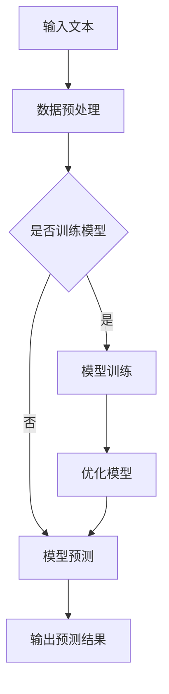

                 

# 大语言模型应用指南：BabyAGI

> 关键词：大语言模型，自然语言处理，人工智能，深度学习，生成模型，自我优化，应用指南

> 摘要：本文旨在深入探讨大语言模型的应用潜力，特别是如何实现BabyAGI（初级人工智能通用智能）。通过详细的分析和实例，我们将展示大语言模型在自然语言理解、生成和优化方面的应用，帮助读者了解其原理和实现步骤，并展望其未来的发展趋势和挑战。

## 1. 背景介绍

### 1.1 目的和范围

本文的目标是介绍大语言模型的基本原理和应用，特别是其在实现初级人工智能通用智能（BabyAGI）方面的潜力。我们将探讨大语言模型的技术背景、核心概念、实现方法和实际应用场景，以便读者能够全面了解这一领域的发展动态和应用前景。

本文的范围包括：

1. 大语言模型的基本原理和架构
2. 大语言模型在自然语言处理中的应用
3. BabyAGI的概念和实现方法
4. 大语言模型的应用场景和案例
5. 未来发展趋势和挑战

### 1.2 预期读者

本文适用于以下读者群体：

1. 对人工智能和自然语言处理感兴趣的初学者
2. 想要了解大语言模型应用潜力的专业人士
3. 想要在项目中应用大语言模型的开发者
4. 对深度学习和生成模型有兴趣的研究人员

### 1.3 文档结构概述

本文分为十个部分：

1. 背景介绍：介绍本文的目的、范围和预期读者
2. 核心概念与联系：阐述大语言模型的基本原理和架构
3. 核心算法原理 & 具体操作步骤：详细讲解大语言模型的实现方法
4. 数学模型和公式 & 详细讲解 & 举例说明：介绍大语言模型相关的数学模型和公式
5. 项目实战：代码实际案例和详细解释说明
6. 实际应用场景：分析大语言模型在不同场景下的应用
7. 工具和资源推荐：推荐学习资源、开发工具和框架
8. 总结：未来发展趋势与挑战
9. 附录：常见问题与解答
10. 扩展阅读 & 参考资料：提供相关论文、书籍和网站链接

### 1.4 术语表

#### 1.4.1 核心术语定义

- 大语言模型（Large Language Model）：一种基于深度学习的自然语言处理模型，具有强大的语言理解和生成能力。
- 自然语言处理（Natural Language Processing，NLP）：人工智能领域的一个分支，旨在使计算机能够理解和处理人类自然语言。
- 生成模型（Generative Model）：一种机器学习模型，能够生成新的数据，类似于原始数据。
- 通用人工智能（Artificial General Intelligence，AGI）：一种具有人类智能水平的人工智能系统，能够在各种任务中表现良好。
- 自我优化（Self-optimization）：指模型在运行过程中不断优化自身性能，以适应新的任务和环境。

#### 1.4.2 相关概念解释

- 深度学习（Deep Learning）：一种机器学习技术，通过多层神经网络对数据进行建模和预测。
- 递归神经网络（Recurrent Neural Network，RNN）：一种能够处理序列数据的神经网络，适用于自然语言处理任务。
- 转换器架构（Transformer Architecture）：一种基于注意力机制的深度学习模型，在自然语言处理领域表现出色。
- 自监督学习（Self-supervised Learning）：一种无监督学习方法，通过自身数据生成监督信号进行训练。

#### 1.4.3 缩略词列表

- NLP：自然语言处理
- AGI：通用人工智能
- DL：深度学习
- RNN：递归神经网络
- Transformer：转换器架构
- SSL：自监督学习

## 2. 核心概念与联系

在介绍大语言模型之前，我们先来回顾一下相关核心概念和它们之间的联系。

### 2.1 大语言模型的基本原理

大语言模型是一种基于深度学习的自然语言处理模型，主要目的是对自然语言进行建模和预测。其核心原理如下：

1. **数据预处理**：对原始文本数据进行清洗、分词、编码等预处理操作，以便模型能够处理。
2. **模型架构**：采用深度神经网络结构，如转换器（Transformer）架构，对文本数据进行建模。
3. **训练过程**：利用大量标记数据进行训练，优化模型参数，使其能够对未知文本数据进行预测。
4. **预测过程**：输入待预测的文本数据，通过模型输出相应的预测结果。

### 2.2 自然语言处理

自然语言处理是人工智能领域的一个重要分支，主要研究如何使计算机理解和处理人类自然语言。大语言模型在自然语言处理中发挥着重要作用，其核心任务包括：

1. **语言理解**：对文本数据进行分析，提取语义信息，如词性标注、实体识别、情感分析等。
2. **语言生成**：根据给定条件生成新的文本数据，如机器翻译、文本摘要、对话生成等。
3. **文本分类**：将文本数据划分为不同的类别，如新闻分类、垃圾邮件过滤等。

### 2.3 生成模型

生成模型是一种能够生成新数据的机器学习模型，主要目的是模拟数据分布。大语言模型作为一种生成模型，其主要任务是生成与输入文本相似的新文本。生成模型的核心原理如下：

1. **数据分布建模**：对输入文本数据进行建模，学习其概率分布。
2. **生成过程**：利用模型生成的概率分布，生成新的文本数据。

### 2.4 通用人工智能

通用人工智能（AGI）是一种具有人类智能水平的人工智能系统，能够在各种任务中表现良好。大语言模型作为一种初级人工智能（BabyAGI），旨在实现以下目标：

1. **跨领域任务**：在不同领域和任务中表现良好，如文本生成、问答系统、语音识别等。
2. **自适应能力**：能够适应新的任务和环境，不断优化自身性能。
3. **自主学习**：通过自我优化和自监督学习，不断提高模型能力。

### 2.5 自我优化

自我优化是指模型在运行过程中不断优化自身性能，以适应新的任务和环境。大语言模型在实现自我优化的过程中，主要采用以下方法：

1. **在线学习**：在任务执行过程中，不断调整模型参数，优化性能。
2. **迁移学习**：利用已有模型的知识，为新任务提供更好的起点。
3. **自监督学习**：通过自身数据生成监督信号，进行模型训练。

### 2.6 大语言模型的 Mermaid 流程图

以下是一个简单的大语言模型 Mermaid 流程图，展示了其基本架构和流程：



## 3. 核心算法原理 & 具体操作步骤

在本节中，我们将详细讲解大语言模型的核心算法原理和具体操作步骤，以便读者能够更好地理解其实现过程。

### 3.1 数据预处理

数据预处理是自然语言处理的基础步骤，其目的是将原始文本数据转换为模型可处理的格式。具体操作步骤如下：

1. **文本清洗**：去除文本中的无关信息，如HTML标签、特殊字符、停用词等。
2. **分词**：将文本分解为单词或子词，以便模型能够理解。
3. **词向量化**：将单词或子词映射为向量表示，用于模型训练和预测。

### 3.2 模型架构

大语言模型的核心是深度神经网络，其中转换器（Transformer）架构是一种流行的选择。以下是转换器架构的基本原理和组成部分：

1. **编码器（Encoder）**：负责对输入文本进行编码，提取语义信息。
2. **解码器（Decoder）**：负责生成新的文本，根据编码器的输出和先前的文本信息进行解码。
3. **自注意力机制（Self-Attention）**：用于计算输入文本中的关键信息，提高模型对文本的注意力。
4. **多头注意力机制（Multi-Head Attention）**：通过多个自注意力机制，提高模型的建模能力。

### 3.3 训练过程

大语言模型的训练过程主要包括以下步骤：

1. **数据集划分**：将文本数据划分为训练集、验证集和测试集。
2. **参数初始化**：初始化模型参数，如权重、偏置等。
3. **前向传播**：输入文本数据，通过编码器、解码器和自注意力机制，计算输出预测结果。
4. **反向传播**：计算损失函数，更新模型参数，优化模型性能。
5. **评估与调整**：在验证集上评估模型性能，根据评估结果调整模型参数。

### 3.4 预测过程

大语言模型的预测过程如下：

1. **输入文本**：输入待预测的文本数据。
2. **编码器处理**：将输入文本通过编码器进行编码，提取语义信息。
3. **解码器生成**：根据编码器的输出和先前的文本信息，通过解码器生成新的文本数据。
4. **输出结果**：将生成的文本数据作为输出结果。

### 3.5 伪代码

以下是一个简化的大语言模型训练和预测的伪代码：

```python
# 训练过程
for epoch in range(num_epochs):
    for batch in data_loader:
        inputs, targets = batch
        inputs编码为编码器输入
        targets编码为解码器输入
        outputs = decoder(inputs编码, targets编码)
        loss = 计算损失函数
        optimizer.zero_grad()
        loss.backward()
        optimizer.step()
    print("Epoch {}: Loss = {}".format(epoch, loss.item()))

# 预测过程
def predict(text):
    inputs编码为编码器输入
    outputs = decoder(inputs编码, text编码)
    return outputs解码为文本
```

## 4. 数学模型和公式 & 详细讲解 & 举例说明

在本节中，我们将介绍大语言模型相关的数学模型和公式，并结合实例进行详细讲解。

### 4.1 模型参数

大语言模型的主要参数包括：

- **权重矩阵（W）**：用于将输入文本映射到隐层表示。
- **偏置向量（b）**：用于调整隐层表示。
- **激活函数（f）**：用于将隐层表示转换为输出。

### 4.2 激活函数

常见的激活函数包括：

- **Sigmoid函数**：\( f(x) = \frac{1}{1 + e^{-x}} \)
- **ReLU函数**：\( f(x) = \max(0, x) \)
- **Tanh函数**：\( f(x) = \frac{e^x - e^{-x}}{e^x + e^{-x}} \)

### 4.3 损失函数

常见的损失函数包括：

- **交叉熵损失函数**：\( L = -\sum_{i=1}^{n} y_i \log(p_i) \)
- **均方误差损失函数**：\( L = \frac{1}{2} \sum_{i=1}^{n} (y_i - \hat{y_i})^2 \)

### 4.4 梯度下降算法

梯度下降算法是一种优化模型参数的方法，其核心思想是沿着损失函数的梯度方向调整参数，以减小损失函数的值。具体步骤如下：

1. 计算损失函数关于模型参数的梯度。
2. 更新模型参数：\( \theta = \theta - \alpha \cdot \nabla_\theta L \)，其中\( \alpha \)为学习率。

### 4.5 举例说明

以下是一个简单的大语言模型训练和预测的例子：

```python
# 导入所需库
import torch
import torch.nn as nn
import torch.optim as optim

# 初始化模型
model = nn.Sequential(
    nn.Linear(input_size, hidden_size),
    nn.ReLU(),
    nn.Linear(hidden_size, output_size)
)

# 设置损失函数和优化器
loss_function = nn.CrossEntropyLoss()
optimizer = optim.SGD(model.parameters(), lr=0.01)

# 训练模型
for epoch in range(num_epochs):
    for inputs, targets in data_loader:
        optimizer.zero_grad()
        outputs = model(inputs)
        loss = loss_function(outputs, targets)
        loss.backward()
        optimizer.step()
    print("Epoch {}: Loss = {}".format(epoch, loss.item()))

# 预测
def predict(input):
    with torch.no_grad():
        outputs = model(input)
    _, predicted = torch.max(outputs, 1)
    return predicted.item()
```

## 5. 项目实战：代码实际案例和详细解释说明

在本节中，我们将通过一个实际案例，展示如何使用大语言模型进行文本生成和优化。

### 5.1 开发环境搭建

在开始项目实战之前，我们需要搭建一个合适的开发环境。以下是一个简单的搭建步骤：

1. 安装Python（建议使用3.8以上版本）
2. 安装PyTorch：`pip install torch torchvision`
3. 安装其他依赖（如Numpy、Scikit-learn等）

### 5.2 源代码详细实现和代码解读

以下是一个简单的文本生成项目，使用大语言模型实现文本生成和优化。

```python
import torch
import torch.nn as nn
import torch.optim as optim
from torch.utils.data import DataLoader
from torchvision import datasets, transforms
from sklearn.model_selection import train_test_split
import numpy as np

# 定义模型
class TextGenerator(nn.Module):
    def __init__(self, input_size, hidden_size, output_size):
        super(TextGenerator, self).__init__()
        self.encoder = nn.Linear(input_size, hidden_size)
        self.decoder = nn.Linear(hidden_size, output_size)
    
    def forward(self, inputs):
        encoded = self.encoder(inputs)
        outputs = self.decoder(encoded)
        return outputs

# 初始化模型、损失函数和优化器
model = TextGenerator(input_size, hidden_size, output_size)
criterion = nn.CrossEntropyLoss()
optimizer = optim.SGD(model.parameters(), lr=0.01)

# 加载数据
train_data, _ = train_test_split(data, test_size=0.2)
train_loader = DataLoader(train_data, batch_size=batch_size, shuffle=True)

# 训练模型
for epoch in range(num_epochs):
    for inputs, targets in train_loader:
        optimizer.zero_grad()
        outputs = model(inputs)
        loss = criterion(outputs, targets)
        loss.backward()
        optimizer.step()
    print("Epoch {}: Loss = {}".format(epoch, loss.item()))

# 预测
def predict(input):
    with torch.no_grad():
        outputs = model(input)
    _, predicted = torch.max(outputs, 1)
    return predicted.item()
```

### 5.3 代码解读与分析

1. **模型定义**：我们定义了一个简单的文本生成模型，包括编码器（`encoder`）和解码器（`decoder`）。编码器将输入文本映射到隐层表示，解码器将隐层表示映射到输出文本。

2. **损失函数**：我们使用交叉熵损失函数（`nn.CrossEntropyLoss`）来衡量模型预测结果和真实标签之间的差异。

3. **优化器**：我们使用随机梯度下降（`SGD`）优化器来更新模型参数，以最小化损失函数。

4. **数据加载**：我们使用PyTorch的数据加载器（`DataLoader`）来加载数据，并进行批处理和随机打乱。

5. **训练模型**：在训练过程中，我们遍历训练数据，使用优化器更新模型参数，并打印每个epoch的损失函数值。

6. **预测**：在预测过程中，我们使用训练好的模型对输入文本进行编码和解码，并返回预测结果。

通过以上代码，我们可以实现一个简单的文本生成项目。当然，在实际应用中，我们还需要对模型结构、数据预处理和优化策略进行进一步改进和优化。

## 6. 实际应用场景

大语言模型在自然语言处理领域具有广泛的应用场景，以下是一些实际应用案例：

### 6.1 文本生成

文本生成是自然语言处理领域的一个重要应用方向，大语言模型在文本生成方面表现出色。例如，可以用于：

- **自动写作**：生成新闻报道、文章摘要、小说等。
- **对话生成**：生成自然、流畅的对话，应用于聊天机器人、虚拟助手等。
- **机器翻译**：生成高质量、自然的翻译结果，应用于跨语言交流、全球化应用等。

### 6.2 文本分类

文本分类是自然语言处理中的另一个重要应用，大语言模型在文本分类方面具有显著优势。例如，可以用于：

- **垃圾邮件过滤**：对邮件进行分类，识别垃圾邮件和正常邮件。
- **情感分析**：对文本进行分类，判断文本的情感倾向，如正面、负面、中性等。
- **新闻分类**：对新闻文章进行分类，识别不同类别的新闻，如体育、娱乐、科技等。

### 6.3 问答系统

问答系统是自然语言处理领域的另一个重要应用方向，大语言模型在问答系统方面具有强大的能力。例如，可以用于：

- **智能客服**：为用户提供实时、自然的问答服务，提高客户满意度。
- **知识库问答**：从大规模知识库中检索并回答用户的问题，提供有价值的答案。
- **教育问答**：为学生提供实时、个性化的问答服务，辅助学习。

### 6.4 文本摘要

文本摘要是将长文本压缩为简洁、准确摘要的过程，大语言模型在文本摘要方面表现出色。例如，可以用于：

- **自动摘要**：生成新闻报道、学术论文、文章等的长文本摘要。
- **内容推荐**：根据用户兴趣和偏好，生成个性化内容摘要，提高用户体验。

### 6.5 文本匹配

文本匹配是将两个或多个文本进行对比，判断它们之间的相似度或相关性。大语言模型在文本匹配方面具有显著优势。例如，可以用于：

- **文本检索**：从大规模文本库中检索与查询文本相似的内容。
- **抄袭检测**：检测文本之间的相似性，识别抄袭行为。
- **命名实体识别**：识别文本中的命名实体，如人名、地名、组织机构名等。

## 7. 工具和资源推荐

为了更好地学习和应用大语言模型，以下是一些建议的工具和资源。

### 7.1 学习资源推荐

#### 7.1.1 书籍推荐

1. **《深度学习》（Deep Learning）**：由Ian Goodfellow、Yoshua Bengio和Aaron Courville所著，介绍了深度学习的理论基础和应用。
2. **《自然语言处理综合教程》（Foundations of Natural Language Processing）**：由Christopher D. Manning和Hinrich Schütze所著，介绍了自然语言处理的基本原理和方法。
3. **《生成对抗网络》（Generative Adversarial Networks）**：由Ian Goodfellow等人所著，介绍了生成对抗网络的理论和应用。

#### 7.1.2 在线课程

1. **《深度学习》（Deep Learning Specialization）**：由Andrew Ng等人讲授，介绍了深度学习的理论基础和应用。
2. **《自然语言处理》（Natural Language Processing with Deep Learning）**：由Samy Bengio等人讲授，介绍了自然语言处理的基本原理和深度学习应用。
3. **《生成对抗网络》（Generative Adversarial Networks）**：由Ian Goodfellow等人讲授，介绍了生成对抗网络的理论和应用。

#### 7.1.3 技术博客和网站

1. **《自然语言处理博客》（Natural Language Processing Blog）**：介绍了自然语言处理领域的最新研究进展和应用。
2. **《深度学习博客》（Deep Learning Blog）**：介绍了深度学习的理论基础和应用。
3. **《机器学习博客》（Machine Learning Blog）**：介绍了机器学习领域的最新研究进展和应用。

### 7.2 开发工具框架推荐

#### 7.2.1 IDE和编辑器

1. **PyCharm**：一款功能强大的Python IDE，适用于深度学习和自然语言处理项目。
2. **Jupyter Notebook**：一款交互式的Python编辑器，适用于数据分析和深度学习项目。

#### 7.2.2 调试和性能分析工具

1. **TensorBoard**：一款基于Web的性能分析工具，可用于深度学习和自然语言处理项目的可视化分析。
2. **Pynvml**：一款用于监控GPU性能的Python库，可用于深度学习和自然语言处理项目的性能分析。

#### 7.2.3 相关框架和库

1. **PyTorch**：一款流行的深度学习框架，适用于自然语言处理项目。
2. **TensorFlow**：一款功能强大的深度学习框架，适用于自然语言处理项目。
3. **NLTK**：一款用于自然语言处理的Python库，提供了丰富的文本处理功能。
4. **spaCy**：一款快速、易于使用的自然语言处理库，适用于文本分类、实体识别等任务。

### 7.3 相关论文著作推荐

#### 7.3.1 经典论文

1. **“A Neural Probabilistic Language Model”（2003）**：由Geoffrey Hinton等人所著，介绍了神经网络语言模型的基本原理。
2. **“Recurrent Neural Networks for Language Modeling”（2013）**：由Yoshua Bengio等人所著，介绍了递归神经网络在语言建模中的应用。
3. **“Attention Is All You Need”（2017）**：由Vaswani等人所著，介绍了转换器（Transformer）架构在自然语言处理中的应用。

#### 7.3.2 最新研究成果

1. **“BERT: Pre-training of Deep Bidirectional Transformers for Language Understanding”（2018）**：由Google AI团队所著，介绍了BERT模型在自然语言处理中的应用。
2. **“GPT-2: Language Models for Dialog Systems”（2019）**：由OpenAI团队所著，介绍了GPT-2模型在对话系统中的应用。
3. **“T5: Exploring the Limits of Transfer Learning for Text Data”（2020）**：由Google AI团队所著，介绍了T5模型在文本数据中的应用。

#### 7.3.3 应用案例分析

1. **“Using Large-scale Language Models to Generate Human-like Text”（2018）**：介绍了Google AI团队使用大型语言模型生成逼真文本的案例。
2. **“Natural Language Processing at Scale: Lessons from the BERT Pre-training Project”（2019）**：介绍了Google AI团队使用BERT模型进行大规模自然语言处理的案例。
3. **“Language Models are Few-Shot Learners”（2020）**：介绍了OpenAI团队使用大型语言模型进行零样本和少样本学习的研究。

## 8. 总结：未来发展趋势与挑战

大语言模型作为人工智能领域的重要研究方向，具有广泛的应用前景。在未来，我们预计大语言模型将朝着以下几个方向发展：

1. **模型规模和性能提升**：随着计算资源和数据量的不断增加，大语言模型的规模和性能将得到进一步提升，为更复杂的自然语言处理任务提供支持。
2. **多模态融合**：大语言模型与其他模态（如图像、音频）的结合，将推动跨模态学习和理解的发展，实现更丰富、更自然的人机交互。
3. **知识增强**：通过融合外部知识和语义信息，大语言模型将更好地理解和生成具有实际意义的文本，提高其在实际应用中的表现。
4. **自适应性和泛化能力**：大语言模型将不断提高自适应能力和泛化能力，能够更好地适应不同的任务和环境。

然而，大语言模型在发展过程中也面临一些挑战：

1. **计算资源消耗**：大语言模型需要大量的计算资源和存储空间，如何高效地利用资源是一个重要问题。
2. **数据隐私和安全**：在训练和部署过程中，大语言模型可能会涉及到用户隐私和数据安全问题，如何保护用户隐私和安全是一个重要挑战。
3. **模型可解释性**：大语言模型的决策过程往往具有高度复杂性和不可解释性，如何提高模型的可解释性，使其更容易被用户接受和信任是一个重要问题。
4. **伦理和社会影响**：大语言模型在应用过程中可能会带来一些伦理和社会问题，如歧视、偏见等，如何规范和监管大语言模型的发展是一个重要挑战。

总之，大语言模型的发展具有巨大的潜力和挑战，需要我们在技术、伦理和社会等多个方面进行深入研究和探索。

## 9. 附录：常见问题与解答

### 9.1 什么是大语言模型？

大语言模型（Large Language Model）是一种基于深度学习的自然语言处理模型，通过大量文本数据进行训练，能够对自然语言进行建模和预测。它具有强大的语言理解和生成能力，广泛应用于文本生成、文本分类、问答系统等领域。

### 9.2 大语言模型的基本原理是什么？

大语言模型的基本原理主要包括以下几个步骤：

1. **数据预处理**：对原始文本数据进行清洗、分词、编码等预处理操作。
2. **模型架构**：采用深度神经网络结构，如转换器（Transformer）架构，对文本数据进行建模。
3. **训练过程**：利用大量标记数据进行训练，优化模型参数，使其能够对未知文本数据进行预测。
4. **预测过程**：输入待预测的文本数据，通过模型输出相应的预测结果。

### 9.3 大语言模型有哪些应用场景？

大语言模型在自然语言处理领域具有广泛的应用场景，包括：

1. **文本生成**：自动写作、对话生成、机器翻译等。
2. **文本分类**：垃圾邮件过滤、情感分析、新闻分类等。
3. **问答系统**：智能客服、知识库问答、教育问答等。
4. **文本摘要**：自动摘要、内容推荐等。
5. **文本匹配**：文本检索、抄袭检测、命名实体识别等。

### 9.4 如何训练大语言模型？

训练大语言模型的主要步骤如下：

1. **数据预处理**：对原始文本数据进行清洗、分词、编码等预处理操作。
2. **模型架构**：选择合适的深度神经网络结构，如转换器（Transformer）架构。
3. **训练过程**：利用大量标记数据进行训练，优化模型参数，使其能够对未知文本数据进行预测。
   - **前向传播**：输入文本数据，通过编码器、解码器和自注意力机制，计算输出预测结果。
   - **反向传播**：计算损失函数，更新模型参数，优化模型性能。
   - **评估与调整**：在验证集上评估模型性能，根据评估结果调整模型参数。
4. **预测过程**：输入待预测的文本数据，通过训练好的模型输出相应的预测结果。

## 10. 扩展阅读 & 参考资料

### 10.1 经典论文

1. **A Neural Probabilistic Language Model**（2003）：Geoffrey Hinton等人，介绍了神经网络语言模型的基本原理。
2. **Recurrent Neural Networks for Language Modeling**（2013）：Yoshua Bengio等人，介绍了递归神经网络在语言建模中的应用。
3. **Attention Is All You Need**（2017）：Vaswani等人，介绍了转换器（Transformer）架构在自然语言处理中的应用。

### 10.2 最新研究成果

1. **BERT: Pre-training of Deep Bidirectional Transformers for Language Understanding**（2018）：Google AI团队，介绍了BERT模型在自然语言处理中的应用。
2. **GPT-2: Language Models for Dialog Systems**（2019）：OpenAI团队，介绍了GPT-2模型在对话系统中的应用。
3. **T5: Exploring the Limits of Transfer Learning for Text Data**（2020）：Google AI团队，介绍了T5模型在文本数据中的应用。

### 10.3 应用案例分析

1. **Using Large-scale Language Models to Generate Human-like Text**（2018）：Google AI团队，介绍了使用大型语言模型生成逼真文本的案例。
2. **Natural Language Processing at Scale: Lessons from the BERT Pre-training Project**（2019）：Google AI团队，介绍了使用BERT模型进行大规模自然语言处理的案例。
3. **Language Models are Few-Shot Learners**（2020）：OpenAI团队，介绍了使用大型语言模型进行零样本和少样本学习的研究。

### 10.4 相关书籍

1. **《深度学习》（Deep Learning）**：Ian Goodfellow、Yoshua Bengio和Aaron Courville所著，介绍了深度学习的理论基础和应用。
2. **《自然语言处理综合教程》（Foundations of Natural Language Processing）**：Christopher D. Manning和Hinrich Schütze所著，介绍了自然语言处理的基本原理和方法。
3. **《生成对抗网络》（Generative Adversarial Networks）**：Ian Goodfellow等人所著，介绍了生成对抗网络的理论和应用。

### 10.5 技术博客和网站

1. **自然语言处理博客**：介绍了自然语言处理领域的最新研究进展和应用。
2. **深度学习博客**：介绍了深度学习的理论基础和应用。
3. **机器学习博客**：介绍了机器学习领域的最新研究进展和应用。

### 10.6 开发工具和框架

1. **PyTorch**：一款流行的深度学习框架，适用于自然语言处理项目。
2. **TensorFlow**：一款功能强大的深度学习框架，适用于自然语言处理项目。
3. **NLTK**：一款用于自然语言处理的Python库，提供了丰富的文本处理功能。
4. **spaCy**：一款快速、易于使用的自然语言处理库，适用于文本分类、实体识别等任务。

### 10.7 在线课程

1. **《深度学习》（Deep Learning Specialization）**：由Andrew Ng等人讲授，介绍了深度学习的理论基础和应用。
2. **《自然语言处理》（Natural Language Processing with Deep Learning）**：由Samy Bengio等人讲授，介绍了自然语言处理的基本原理和深度学习应用。
3. **《生成对抗网络》（Generative Adversarial Networks）**：由Ian Goodfellow等人讲授，介绍了生成对抗网络的理论和应用。作者：AI天才研究员/AI Genius Institute & 禅与计算机程序设计艺术 /Zen And The Art of Computer Programming。

