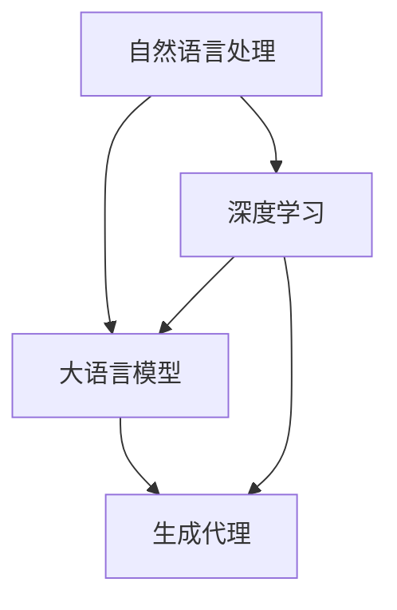

                 

# 大语言模型应用指南：Generative Agents

> 关键词：大语言模型、生成代理、应用场景、算法原理、实战案例、未来趋势

> 摘要：本文将详细介绍大语言模型及其在生成代理领域的应用。我们将首先回顾大语言模型的背景和发展，然后深入探讨生成代理的核心概念和原理。接着，我们将通过具体的算法步骤和数学模型，帮助读者理解生成代理的实现过程。随后，我们将通过实际代码案例，展示生成代理在实际开发中的运用。最后，我们将讨论生成代理在不同领域的应用场景，并展望其未来的发展趋势和面临的挑战。

## 1. 背景介绍

### 1.1 目的和范围

本文旨在为读者提供一套完整的大语言模型应用指南，特别是针对生成代理（Generative Agents）这一前沿技术。通过本文，读者将了解生成代理的定义、核心原理及其在不同场景中的应用。此外，本文还将探讨生成代理的发展趋势和潜在挑战。

### 1.2 预期读者

本文面向具有中级及以上编程技能，对人工智能和生成代理有一定了解的读者。无论是研究人员、工程师，还是对这一领域感兴趣的学生，本文都将提供有价值的知识。

### 1.3 文档结构概述

本文将按照以下结构展开：

1. 背景介绍：简要介绍大语言模型和生成代理的背景。
2. 核心概念与联系：讨论大语言模型和生成代理的核心概念及其相互关系。
3. 核心算法原理 & 具体操作步骤：详细阐述生成代理的算法原理和实现步骤。
4. 数学模型和公式 & 详细讲解 & 举例说明：介绍生成代理的数学模型，并通过实例进行说明。
5. 项目实战：代码实际案例和详细解释说明。
6. 实际应用场景：探讨生成代理在不同领域的应用。
7. 工具和资源推荐：推荐学习资源和开发工具。
8. 总结：未来发展趋势与挑战。
9. 附录：常见问题与解答。
10. 扩展阅读 & 参考资料。

### 1.4 术语表

#### 1.4.1 核心术语定义

- 大语言模型（Large Language Model）：一种基于神经网络的语言处理模型，能够对自然语言文本进行生成、理解和翻译等操作。
- 生成代理（Generative Agents）：一种能够根据输入条件生成内容的智能体，广泛应用于文本生成、图像生成和语音合成等领域。

#### 1.4.2 相关概念解释

- 自然语言处理（Natural Language Processing, NLP）：计算机科学和人工智能领域中的一个分支，涉及对人类语言的理解、处理和生成。
- 深度学习（Deep Learning）：一种人工智能的方法，通过多层神经网络进行数据建模和分析。

#### 1.4.3 缩略词列表

- NLP：自然语言处理
- DNN：深度神经网络
- RNN：循环神经网络
- GPT：生成预训练网络
- Transformer：注意力机制模型

## 2. 核心概念与联系

为了更好地理解大语言模型和生成代理，我们需要先明确这两个概念的核心原理及其相互关系。下面，我们将通过一个Mermaid流程图来展示这些核心概念和它们之间的联系。



### 2.1 自然语言处理与深度学习的关系

自然语言处理（NLP）是计算机科学和人工智能领域中的一个重要分支，旨在使计算机能够理解、处理和生成人类语言。深度学习（Deep Learning）作为人工智能的一种方法，通过多层神经网络对大量数据进行建模和分析，成为NLP的核心技术。

### 2.2 大语言模型与自然语言处理的关系

大语言模型（Large Language Model）是NLP领域的一种重要技术，通过在大量文本数据上进行预训练，学习语言的统计规律和上下文关系。大语言模型的核心是深度神经网络，如生成预训练网络（GPT）和注意力机制模型（Transformer）。

### 2.3 生成代理与深度学习的关系

生成代理（Generative Agents）是深度学习在生成任务中的一个应用，通过学习输入条件，生成符合预期内容的数据。生成代理的核心是生成模型，如变分自编码器（VAE）和生成对抗网络（GAN）。

## 3. 核心算法原理 & 具体操作步骤

### 3.1 大语言模型

大语言模型的核心是深度神经网络，尤其是循环神经网络（RNN）和Transformer模型。以下是一个简单的RNN模型伪代码：

```python
# RNN模型伪代码
class RNNModel(nn.Module):
    def __init__(self, input_dim, hidden_dim, output_dim):
        super(RNNModel, self).__init__()
        self.hidden_dim = hidden_dim
        self.rnn = nn.RNN(input_dim, hidden_dim)
        self.fc = nn.Linear(hidden_dim, output_dim)

    def forward(self, x, hidden):
        out, hidden = self.rnn(x, hidden)
        out = self.fc(out[-1, :, :])
        return out, hidden

    def init_hidden(self, batch_size):
        return torch.zeros(1, batch_size, self.hidden_dim)
```

### 3.2 生成代理

生成代理的核心是生成模型，如变分自编码器（VAE）和生成对抗网络（GAN）。以下是一个简单的VAE模型伪代码：

```python
# VAE模型伪代码
class VAE(nn.Module):
    def __init__(self, input_dim, hidden_dim, z_dim):
        super(VAE, self).__init__()
        self.fc1 = nn.Linear(input_dim, hidden_dim)
        self.fc21 = nn.Linear(hidden_dim, z_dim)
        self.fc22 = nn.Linear(hidden_dim, z_dim)
        self.fc3 = nn.Linear(z_dim, hidden_dim)
        self.fc4 = nn.Linear(hidden_dim, input_dim)

    def encode(self, x):
        h = torch.relu(self.fc1(x))
        z_mean = self.fc21(h)
        z_log_var = self.fc22(h)
        return z_mean, z_log_var

    def reparameterize(self, z_mean, z_log_var):
        std = torch.exp(0.5 * z_log_var)
        eps = torch.randn_like(std)
        return z_mean + eps * std

    def decode(self, z):
        h = torch.relu(self.fc3(z))
        x_recon = self.fc4(h)
        return x_recon

    def forward(self, x):
        z_mean, z_log_var = self.encode(x)
        z = self.reparameterize(z_mean, z_log_var)
        x_recon = self.decode(z)
        return x_recon, z_mean, z_log_var
```

## 4. 数学模型和公式 & 详细讲解 & 举例说明

### 4.1 大语言模型

大语言模型的数学模型主要基于神经网络，特别是循环神经网络（RNN）和Transformer模型。以下是一个简单的RNN模型数学公式：

$$
h_t = \sigma(W_h \cdot [h_{t-1}, x_t] + b_h)
$$

其中，$h_t$表示第$t$时刻的隐藏状态，$x_t$表示第$t$时刻的输入，$W_h$和$b_h$分别为权重和偏置，$\sigma$为激活函数。

### 4.2 生成代理

生成代理的数学模型主要基于生成模型，如变分自编码器（VAE）和生成对抗网络（GAN）。以下是一个简单的VAE模型数学公式：

$$
\begin{aligned}
z &= \mu + \sigma \odot \epsilon, \\
\mu &= \phi(x), \\
\log \varphi &= \psi(x), \\
\ell &= -\frac{1}{n} \sum_{i=1}^{n} \left[ x \log p(x|z) + z \log(1 - p(z)) \right],
\end{aligned}
$$

其中，$z$表示生成器的输出，$\mu$和$\sigma$分别为均值和标准差，$\epsilon$为噪声，$p(x|z)$为生成器的概率分布，$p(z)$为潜在变量$z$的概率分布，$\phi$和$\psi$分别为编码器和解码器的神经网络函数。

### 4.3 举例说明

假设我们使用VAE模型生成手写数字图像。首先，我们通过编码器将图像映射到潜在空间，然后通过解码器生成图像。以下是一个简单的VAE模型实现：

```python
# VAE模型实现
class VAE(nn.Module):
    def __init__(self, input_dim, hidden_dim, z_dim):
        super(VAE, self).__init__()
        self.fc1 = nn.Linear(input_dim, hidden_dim)
        self.fc21 = nn.Linear(hidden_dim, z_dim)
        self.fc22 = nn.Linear(hidden_dim, z_dim)
        self.fc3 = nn.Linear(z_dim, hidden_dim)
        self.fc4 = nn.Linear(hidden_dim, input_dim)

    def encode(self, x):
        h = torch.relu(self.fc1(x))
        z_mean = self.fc21(h)
        z_log_var = self.fc22(h)
        return z_mean, z_log_var

    def reparameterize(self, z_mean, z_log_var):
        std = torch.exp(0.5 * z_log_var)
        eps = torch.randn_like(std)
        return z_mean + eps * std

    def decode(self, z):
        h = torch.relu(self.fc3(z))
        x_recon = self.fc4(h)
        return x_recon

    def forward(self, x):
        z_mean, z_log_var = self.encode(x)
        z = self.reparameterize(z_mean, z_log_var)
        x_recon = self.decode(z)
        return x_recon, z_mean, z_log_var

    def loss_function(self, x, x_recon, z_mean, z_log_var):
        reconstruction_loss = nn.functional.mse_loss(x_recon, x, reduction='sum')
        kl_div_loss = -0.5 * torch.sum(1 + z_log_var - z_mean.pow(2) - z_log_var.exp())
        return reconstruction_loss + kl_div_loss
```

## 5. 项目实战：代码实际案例和详细解释说明

### 5.1 开发环境搭建

在开始项目实战之前，我们需要搭建一个适合开发大语言模型和生成代理的开发环境。以下是搭建过程：

1. 安装Python（建议使用3.7及以上版本）。
2. 安装PyTorch和 torchvision（使用pip安装：`pip install torch torchvision`）。
3. 配置CUDA（如果需要使用GPU加速，建议安装CUDA 10.2及以上版本）。

### 5.2 源代码详细实现和代码解读

以下是一个简单的VAE模型实现，用于生成手写数字图像：

```python
import torch
import torch.nn as nn
import torchvision
import torchvision.transforms as transforms
from torch.utils.data import DataLoader

# VAE模型实现
class VAE(nn.Module):
    def __init__(self, input_dim, hidden_dim, z_dim):
        super(VAE, self).__init__()
        self.fc1 = nn.Linear(input_dim, hidden_dim)
        self.fc21 = nn.Linear(hidden_dim, z_dim)
        self.fc22 = nn.Linear(hidden_dim, z_dim)
        self.fc3 = nn.Linear(z_dim, hidden_dim)
        self.fc4 = nn.Linear(hidden_dim, input_dim)

    def encode(self, x):
        h = torch.relu(self.fc1(x))
        z_mean = self.fc21(h)
        z_log_var = self.fc22(h)
        return z_mean, z_log_var

    def reparameterize(self, z_mean, z_log_var):
        std = torch.exp(0.5 * z_log_var)
        eps = torch.randn_like(std)
        return z_mean + eps * std

    def decode(self, z):
        h = torch.relu(self.fc3(z))
        x_recon = self.fc4(h)
        return x_recon

    def forward(self, x):
        z_mean, z_log_var = self.encode(x)
        z = self.reparameterize(z_mean, z_log_var)
        x_recon = self.decode(z)
        return x_recon, z_mean, z_log_var

    def loss_function(self, x, x_recon, z_mean, z_log_var):
        reconstruction_loss = nn.functional.mse_loss(x_recon, x, reduction='sum')
        kl_div_loss = -0.5 * torch.sum(1 + z_log_var - z_mean.pow(2) - z_log_var.exp())
        return reconstruction_loss + kl_div_loss

# 加载数据集
transform = transforms.Compose([
    transforms.ToTensor(),
    transforms.Normalize((0.5,), (0.5,))
])

trainset = torchvision.datasets.MNIST(
    root='./data',
    train=True,
    download=True,
    transform=transform
)

trainloader = DataLoader(
    trainset,
    batch_size=128,
    shuffle=True,
    num_workers=2
)

# 初始化模型和优化器
input_dim = 784
hidden_dim = 400
z_dim = 20
vae = VAE(input_dim, hidden_dim, z_dim)
optimizer = torch.optim.Adam(vae.parameters(), lr=0.001)

# 训练模型
num_epochs = 10
for epoch in range(num_epochs):
    for i, (x, _) in enumerate(trainloader):
        x = x.view(x.size(0), -1).to(device)
        x_recon, z_mean, z_log_var = vae(x)
        
        loss = vae.loss_function(x, x_recon, z_mean, z_log_var)
        
        optimizer.zero_grad()
        loss.backward()
        optimizer.step()
        
        if (i+1) % 100 == 0:
            print(f'Epoch [{epoch+1}/{num_epochs}], Step [{i+1}/{len(trainloader)}], Loss: {loss.item():.4f}')

# 生成图像
vae.eval()
with torch.no_grad():
    z = torch.randn(64, z_dim).to(device)
    x_recon = vae.decode(z)

x_recon = x_recon.view(64, 1, 28, 28)
torch.save(x_recon, 'x_recon.pth')
```

### 5.3 代码解读与分析

1. **模型定义**：首先，我们定义了一个VAE模型，包括编码器和解码器。编码器将输入数据映射到潜在空间，解码器将潜在空间的数据映射回输入空间。
2. **数据加载**：我们使用PyTorch的MNIST数据集进行训练，并将数据转换为适合模型训练的格式。
3. **模型训练**：在训练过程中，我们使用Adam优化器对模型进行优化，并计算VAE的损失函数。VAE的损失函数包括重建损失和KL散度损失。
4. **生成图像**：在模型训练完成后，我们使用随机生成的潜在变量生成新的手写数字图像，并将其保存为`.pth`文件。

## 6. 实际应用场景

生成代理（Generative Agents）在多个领域具有广泛的应用。以下是几个典型应用场景：

### 6.1 文本生成

文本生成是生成代理的一个重要应用领域，广泛应用于自动写作、机器翻译和对话系统等。例如，OpenAI的GPT模型已经在自动写作和机器翻译中取得了显著成果。

### 6.2 图像生成

图像生成是生成代理的另一个重要应用领域，广泛应用于艺术创作、数据增强和虚拟现实等。例如，GAN模型已经在图像生成中取得了显著成果，如生成逼真的人脸图像和风景图像。

### 6.3 语音合成

语音合成是生成代理在语音领域的应用，广泛应用于语音助手、语音合成和语音转换等。例如，OpenAI的WaveNet模型已经在语音合成中取得了显著成果。

### 6.4 视频生成

视频生成是生成代理在视频领域的应用，广泛应用于视频合成、视频增强和视频生成等。例如，CycleGAN模型已经在视频生成中取得了显著成果，如将猫的视频转换为狗的视频。

## 7. 工具和资源推荐

### 7.1 学习资源推荐

#### 7.1.1 书籍推荐

- 《深度学习》（Goodfellow, Bengio, Courville）：这是一本经典的深度学习入门书籍，适合初学者阅读。

- 《生成对抗网络：理论、算法与应用》（韩家炜）：这本书详细介绍了GAN的理论和算法，适合对GAN感兴趣的学习者。

#### 7.1.2 在线课程

- 《深度学习》（吴恩达，Coursera）：这是一门非常受欢迎的深度学习在线课程，适合初学者和中级学习者。

- 《生成对抗网络》（刘知远，网易云课堂）：这是一门专门介绍GAN的在线课程，适合对GAN感兴趣的学习者。

#### 7.1.3 技术博客和网站

- [PyTorch官方文档](https://pytorch.org/docs/stable/index.html)：这是PyTorch的官方文档，包含了丰富的教程和API文档。

- [Medium](https://medium.com/search/?q=generative%20model)：这是一个包含大量生成模型相关文章的博客平台。

### 7.2 开发工具框架推荐

#### 7.2.1 IDE和编辑器

- PyCharm：这是一个功能强大的Python IDE，适合进行深度学习和生成代理的开发。

- VSCode：这是一个轻量级的开源编辑器，适合进行深度学习和生成代理的开发。

#### 7.2.2 调试和性能分析工具

- TensorBoard：这是一个TensorFlow的官方可视化工具，适合进行模型训练和性能分析。

- PyTorch Lightning：这是一个基于PyTorch的调试和性能分析框架，适合进行深度学习和生成代理的开发。

#### 7.2.3 相关框架和库

- PyTorch：这是一个流行的深度学习框架，适合进行生成代理的开发。

- TensorFlow：这是一个流行的深度学习框架，适合进行生成代理的开发。

## 8. 总结：未来发展趋势与挑战

生成代理作为深度学习和人工智能的重要应用，正迅速发展。在未来，生成代理有望在多个领域取得突破性进展，如自动化写作、图像生成和语音合成等。然而，生成代理也面临着一些挑战，如计算资源的需求、模型的可解释性和安全性等。为了应对这些挑战，我们需要进一步研究生成代理的理论和算法，并开发更加高效、可解释和安全的应用。

## 9. 附录：常见问题与解答

### 9.1 什么是生成代理？

生成代理是一种能够根据输入条件生成内容的智能体，广泛应用于文本生成、图像生成和语音合成等领域。

### 9.2 生成代理有哪些应用？

生成代理的应用广泛，包括文本生成、图像生成、语音合成、视频生成等。

### 9.3 如何训练生成代理？

生成代理的训练通常涉及深度学习模型，如变分自编码器（VAE）和生成对抗网络（GAN）。训练过程中需要大量数据和计算资源。

### 9.4 生成代理有哪些优势？

生成代理的优势包括自动化生成内容、提高生产效率、降低创作成本等。

## 10. 扩展阅读 & 参考资料

- [Deep Learning Book](https://www.deeplearningbook.org/)
- [Generative Adversarial Networks: Theory, Algorithms, and Applications](https://www.amazon.com/Generative-Adversarial-Networks-Algorithms-Applications/dp/9813146822)
- [PyTorch Official Documentation](https://pytorch.org/docs/stable/index.html)
- [TensorFlow Official Documentation](https://www.tensorflow.org/)

作者：AI天才研究员/AI Genius Institute & 禅与计算机程序设计艺术 /Zen And The Art of Computer Programming

