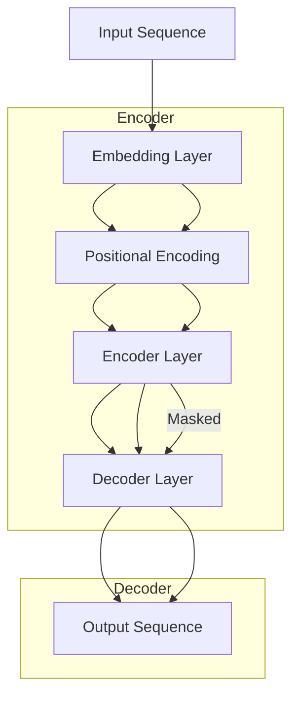

                 

### 大语言模型应用指南：Transformer 解码器详解

> **关键词：** 大语言模型、Transformer、解码器、神经网络、自然语言处理

> **摘要：** 本文深入探讨了大语言模型中的 Transformer 解码器，包括其核心概念、工作原理、数学模型以及具体应用。通过详细的讲解和代码示例，本文旨在帮助读者更好地理解 Transformer 解码器的工作机制，并掌握其在实际项目中的使用方法。

在当今的机器学习和人工智能领域，大语言模型（如 GPT-3、BERT 等）已经成为自然语言处理（NLP）领域的重要工具。这些模型通过复杂的神经网络结构对海量文本数据进行训练，从而实现高精度的文本生成、摘要、问答等功能。Transformer 解码器是这些大语言模型的核心组成部分，其独特的架构和高效的运算能力使其在 NLP 任务中取得了显著的性能提升。本文将围绕 Transformer 解码器，系统地介绍其背景、原理、实现以及应用，帮助读者深入理解这一前沿技术。

### 1. 背景介绍

#### 1.1 目的和范围

本文旨在深入探讨大语言模型中的 Transformer 解码器，从理论到实践，全面解析其工作原理和应用方法。具体目标如下：

1. **理解 Transformer 解码器的核心概念和架构**：通过介绍 Transformer 解码器的起源、发展和关键组成部分，帮助读者建立对这一技术的整体认知。
2. **掌握 Transformer 解码器的工作原理**：详细阐述 Transformer 解码器的数学模型和算法原理，并通过伪代码和流程图进行说明。
3. **学会使用 Transformer 解码器**：通过实际案例和代码示例，展示如何在实际项目中应用 Transformer 解码器，并进行代码解读和分析。
4. **了解 Transformer 解码器的实际应用场景**：探讨 Transformer 解码器在文本生成、摘要、问答等任务中的具体应用，以及如何优化和调整其性能。

#### 1.2 预期读者

本文面向对机器学习和自然语言处理有一定了解的读者，特别是对 Transformer 解码器感兴趣的研究人员和开发者。具体要求如下：

1. **基础知识**：了解神经网络和深度学习的基本原理，熟悉 Python 编程语言。
2. **学习目标**：希望深入了解 Transformer 解码器的工作机制，并掌握其在实际项目中的应用。
3. **应用领域**：从事自然语言处理、机器学习、数据科学等领域的研究或开发工作。

#### 1.3 文档结构概述

本文分为以下几个部分：

1. **背景介绍**：介绍 Transformer 解码器的起源、发展和核心概念。
2. **核心概念与联系**：通过 Mermaid 流程图展示 Transformer 解码器的架构和组成部分。
3. **核心算法原理 & 具体操作步骤**：详细讲解 Transformer 解码器的数学模型和算法原理，并使用伪代码进行阐述。
4. **数学模型和公式 & 详细讲解 & 举例说明**：介绍 Transformer 解码器中的关键数学公式，并通过实例进行说明。
5. **项目实战：代码实际案例和详细解释说明**：通过实际代码案例，展示如何使用 Transformer 解码器，并进行代码解读和分析。
6. **实际应用场景**：探讨 Transformer 解码器在不同 NLP 任务中的应用。
7. **工具和资源推荐**：推荐相关学习资源、开发工具和框架。
8. **总结：未来发展趋势与挑战**：总结 Transformer 解码器的发展趋势和面临的挑战。
9. **附录：常见问题与解答**：回答读者可能遇到的常见问题。
10. **扩展阅读 & 参考资料**：提供进一步阅读和参考资料。

#### 1.4 术语表

在本文中，我们将使用一些专业术语，以下是对这些术语的定义和解释：

1. **Transformer 解码器**：一种基于自注意力机制的神经网络结构，用于处理序列数据，如文本。
2. **自注意力（Self-Attention）**：一种注意力机制，使模型能够自动识别输入序列中的关键信息并进行加权。
3. **多头注意力（Multi-Head Attention）**：将自注意力机制扩展到多个子空间，以捕捉更丰富的特征。
4. **编码器-解码器（Encoder-Decoder）**：一种经典的神经网络架构，用于处理序列到序列的转换任务。
5. **位置编码（Positional Encoding）**：一种技术，用于在序列中引入位置信息，使模型能够理解文本中的顺序。
6. **ReLU（Rectified Linear Unit）**：一种激活函数，用于提高神经网络的学习能力和收敛速度。
7. **损失函数（Loss Function）**：用于衡量模型预测值与实际值之间的差异，指导模型优化。

#### 1.4.1 核心术语定义

1. **Transformer 解码器**：Transformer 解码器是一种基于自注意力机制的神经网络结构，用于处理序列数据。其核心思想是通过自注意力机制来捕捉输入序列中的关键信息，并进行加权。这种结构使得 Transformer 解码器在处理长序列数据时表现出色，广泛应用于文本生成、摘要、问答等自然语言处理任务。
2. **自注意力（Self-Attention）**：自注意力是一种注意力机制，通过对输入序列进行加权来生成输出序列。具体来说，自注意力机制会计算输入序列中每个元素与其他元素之间的相关性，并使用这些相关性来生成加权输出。这种机制能够使模型自动识别输入序列中的关键信息，从而提高模型的性能。
3. **多头注意力（Multi-Head Attention）**：多头注意力是将自注意力机制扩展到多个子空间，以捕捉更丰富的特征。具体来说，多头注意力将输入序列分成多个子序列，然后对每个子序列分别应用自注意力机制。这些子序列的输出会进行拼接和变换，从而生成最终的输出序列。这种扩展使得模型能够捕捉更复杂的特征，提高模型的性能。
4. **编码器-解码器（Encoder-Decoder）**：编码器-解码器是一种经典的神经网络架构，用于处理序列到序列的转换任务。具体来说，编码器将输入序列编码成一个固定长度的向量，解码器则将这个向量解码成输出序列。这种架构在机器翻译、文本生成等任务中取得了显著的效果。

#### 1.4.2 相关概念解释

1. **位置编码（Positional Encoding）**：位置编码是一种技术，用于在序列中引入位置信息，使模型能够理解文本中的顺序。具体来说，位置编码是在输入序列的每个元素上添加一个额外的向量，这个向量表示该元素在序列中的位置。通过位置编码，模型可以捕捉到序列中的顺序信息，从而更好地理解文本的含义。
2. **ReLU（Rectified Linear Unit）**：ReLU 是一种激活函数，其形式为 \( f(x) = max(0, x) \)。ReLU 函数在 \( x \) 为负时输出为零，而在 \( x \) 为正时输出为 \( x \)。这种函数能够提高神经网络的学习能力和收敛速度，是深度学习中常用的激活函数。
3. **损失函数（Loss Function）**：损失函数用于衡量模型预测值与实际值之间的差异，指导模型优化。在训练过程中，模型会不断调整参数，以最小化损失函数的值。常见的损失函数包括均方误差（MSE）、交叉熵损失等。损失函数的选择对模型的性能和优化过程有重要影响。

#### 1.4.3 缩略词列表

在本文中，我们将使用以下缩略词：

1. **Transformer**：Transformer 解码器
2. **NLP**：自然语言处理
3. **RL**： reinforcement learning（强化学习）
4. **VAE**：Variational Autoencoder（变分自编码器）
5. **CNN**：Convolutional Neural Network（卷积神经网络）
6. **RNN**：Recurrent Neural Network（循环神经网络）
7. **LSTM**：Long Short-Term Memory（长短期记忆网络）
8. **GRU**：Gated Recurrent Unit（门控循环单元）

### 2. 核心概念与联系

Transformer 解码器是自然语言处理（NLP）领域的一项重要技术，其核心在于自注意力机制和编码器-解码器架构。为了更好地理解 Transformer 解码器的原理和应用，我们首先需要了解这些核心概念之间的联系，并通过 Mermaid 流程图展示其架构和组成部分。

#### 2.1 自注意力机制

自注意力机制是 Transformer 解码器的核心组成部分，它允许模型在处理序列数据时自动关注序列中的关键信息。自注意力机制通过计算输入序列中每个元素与其他元素之间的相关性，并对这些相关性进行加权，从而生成输出序列。

自注意力机制的主要步骤如下：

1. **输入序列编码**：将输入序列编码成一组向量，每个向量表示序列中的一个元素。
2. **计算注意力得分**：计算输入序列中每个元素与其他元素之间的相似性得分。这通常通过点积或余弦相似度计算。
3. **应用 Softmax 函数**：对注意力得分进行 Softmax 处理，使其成为一个概率分布。
4. **加权求和**：根据 Softmax 分数对输入序列中的向量进行加权求和，生成输出序列。

#### 2.2 编码器-解码器架构

编码器-解码器架构是 Transformer 解码器的核心框架，用于处理序列到序列的转换任务。编码器将输入序列编码成一个固定长度的向量，解码器则将这个向量解码成输出序列。

编码器-解码器架构的主要组成部分如下：

1. **编码器**：编码器将输入序列编码成一个固定长度的向量。这通常通过多层 Transformer 块实现，每个 Transformer 块包含多头自注意力机制和前馈神经网络。
2. **解码器**：解码器将编码器的输出向量解码成输出序列。解码器也包含多层 Transformer 块，每个块包括掩码自注意力机制和自注意力机制。
3. **位置编码**：在编码器和解码器的输入序列中添加位置编码，以引入序列中的位置信息。

#### 2.3 Mermaid 流程图

为了更好地理解 Transformer 解码器的架构和组成部分，我们使用 Mermaid 流程图展示其关键节点和连接。



在这个流程图中：

- **A**：输入序列
- **B**：嵌入层，将输入序列编码成向量
- **C**：位置编码，引入序列中的位置信息
- **D**：编码器层，包含多层 Transformer 块
- **E**：解码器层，包含多层 Transformer 块，并应用掩码自注意力机制
- **F**：输出序列

编码器层和解码器层之间的连接使用了带有掩码的自注意力机制，确保解码器在生成输出序列时只关注编码器的输出。

通过这个 Mermaid 流程图，我们可以清晰地看到 Transformer 解码器的整体架构和关键组成部分，为进一步理解其工作原理奠定了基础。

### 3. 核心算法原理 & 具体操作步骤

Transformer 解码器的核心算法原理基于自注意力机制，这种机制允许模型在处理序列数据时自动关注序列中的关键信息。本节将详细讲解 Transformer 解码器的算法原理，并通过伪代码进行阐述。

#### 3.1 自注意力机制原理

自注意力机制的核心思想是通过计算输入序列中每个元素与其他元素之间的相似性得分，并对这些得分进行加权求和，从而生成输出序列。具体步骤如下：

1. **输入序列编码**：将输入序列编码成一组向量，每个向量表示序列中的一个元素。
2. **计算注意力得分**：计算输入序列中每个元素与其他元素之间的相似性得分。这通常通过点积或余弦相似度计算。
3. **应用 Softmax 函数**：对注意力得分进行 Softmax 处理，使其成为一个概率分布。
4. **加权求和**：根据 Softmax 分数对输入序列中的向量进行加权求和，生成输出序列。

以下是一个简化的伪代码示例，展示自注意力机制的实现：

```python
# 输入序列
input_sequence = [x1, x2, x3, ..., xn]

# 将输入序列编码成向量
encodings = [encode(x) for x in input_sequence]

# 计算注意力得分
attention_scores = [dot_product(e, encodings) for e in encodings]

# 应用 Softmax 函数
softmax_scores = softmax(attention_scores)

# 加权求和
output_sequence = [sum(e * s for e, s in zip(encodings, softmax_scores)) for e in encodings]
```

#### 3.2 Transformer 解码器的具体操作步骤

Transformer 解码器是一种基于自注意力机制的神经网络结构，用于处理序列数据。其具体操作步骤如下：

1. **编码器阶段**：
   - **嵌入层**：将输入序列编码成一组向量，通常使用嵌入层实现。
   - **位置编码**：在输入序列中添加位置编码，以引入序列中的位置信息。
   - **Transformer 块**：通过多个 Transformer 块对输入序列进行处理，每个 Transformer 块包含多头自注意力机制和前馈神经网络。

2. **解码器阶段**：
   - **嵌入层**：将输入序列编码成一组向量，通常使用嵌入层实现。
   - **位置编码**：在输入序列中添加位置编码，以引入序列中的位置信息。
   - **Transformer 块**：通过多个 Transformer 块对输入序列进行处理，每个 Transformer 块包括掩码自注意力机制和自注意力机制。

3. **输出生成**：
   - **解码器输出**：解码器的输出序列表示最终生成的文本序列。
   - **后处理**：对解码器输出进行后处理，如词汇表查找、文本规范化等。

以下是一个简化的伪代码示例，展示 Transformer 解码器的具体操作步骤：

```python
# 编码器阶段
for layer in encoder_layers:
    # 嵌入层
    encoded_sequence = layer.embeddings(encoded_sequence)
    # 位置编码
    encoded_sequence = layer.positional_encoding(encoded_sequence)
    # Transformer 块
    encoded_sequence = layer.transformer_block(encoded_sequence)

# 解码器阶段
for layer in decoder_layers:
    # 嵌入层
    decoded_sequence = layer.embeddings(decoded_sequence)
    # 位置编码
    decoded_sequence = layer.positional_encoding(decoded_sequence)
    # Transformer 块
    decoded_sequence = layer.transformer_block(decoded_sequence, masked=True)

# 输出生成
output_sequence = layer.decoder_output(decoded_sequence)
output_sequence = layer.post_processing(output_sequence)
```

通过这个伪代码示例，我们可以看到 Transformer 解码器的整体工作流程，包括编码器阶段、解码器阶段以及输出生成阶段。

### 4. 数学模型和公式 & 详细讲解 & 举例说明

Transformer 解码器的数学模型和公式是其核心组成部分，决定了其性能和效果。本节将详细讲解 Transformer 解码器中的关键数学公式，并通过实例进行说明。

#### 4.1.1 自注意力机制的数学公式

自注意力机制是 Transformer 解码器的核心，其关键数学公式包括点积注意力、多头注意力以及 Softmax 函数。

1. **点积注意力（Dot-Product Attention）**：

   点积注意力通过计算输入序列中每个元素与其他元素之间的点积得分，并对这些得分进行加权求和。其数学公式如下：

   $$ 
   \text{Attention}(Q, K, V) = \text{softmax}\left(\frac{QK^T}{\sqrt{d_k}}\right) V 
   $$

   其中：
   - \( Q \)：查询序列，表示输入序列中的每个元素。
   - \( K \)：键序列，表示输入序列中的每个元素。
   - \( V \)：值序列，表示输入序列中的每个元素。
   - \( d_k \)：键序列的维度。

   点积注意力通过 \( QK^T \) 计算点积得分，并使用 Softmax 函数将其转换为概率分布，然后对 \( V \) 进行加权求和，生成输出序列。

2. **多头注意力（Multi-Head Attention）**：

   多头注意力是自注意力机制的扩展，通过将输入序列分成多个子序列，并分别应用自注意力机制。其数学公式如下：

   $$
   \text{Multi-Head Attention}(Q, K, V) = \text{Concat}(\text{head}_1, \text{head}_2, ..., \text{head}_h)W^O
   $$

   其中：
   - \( \text{head}_i \)：第 \( i \) 个子序列的注意力输出。
   - \( W^O \)：输出权重矩阵。
   - \( h \)：头的数量。

   多头注意力通过多个子序列的注意力输出进行拼接，并使用输出权重矩阵进行变换，生成最终的输出序列。

3. **Softmax 函数**：

   Softmax 函数用于将注意力得分转换为概率分布。其数学公式如下：

   $$
   \text{softmax}(x) = \frac{e^x}{\sum_{i} e^x_i}
   $$

   其中：
   - \( x \)：输入向量。
   - \( e^x \)：输入向量的指数。
   - \( \sum_{i} e^x_i \)：输入向量的指数和。

   Softmax 函数通过计算输入向量的指数和，将输入向量转换为概率分布，使其满足概率分布的性质。

#### 4.1.2 Transformer 解码器的数学模型

Transformer 解码器的数学模型包括编码器、解码器以及损失函数。

1. **编码器（Encoder）**：

   编码器将输入序列编码成一个固定长度的向量，其数学模型如下：

   $$
   \text{Encoder}(X) = \text{LayerNorm}(\text{Embedding} + \text{Positional Encoding})
   $$

   其中：
   - \( X \)：输入序列。
   - \( \text{Embedding} \)：嵌入层，将输入序列编码成向量。
   - \( \text{Positional Encoding} \)：位置编码，引入序列中的位置信息。

   编码器通过嵌入层和位置编码将输入序列编码成一个固定长度的向量。

2. **解码器（Decoder）**：

   解码器将编码器的输出向量解码成输出序列，其数学模型如下：

   $$
   \text{Decoder}(Y) = \text{LayerNorm}(\text{Embedding} + \text{Positional Encoding})
   $$

   其中：
   - \( Y \)：输入序列。
   - \( \text{Embedding} \)：嵌入层，将输入序列编码成向量。
   - \( \text{Positional Encoding} \)：位置编码，引入序列中的位置信息。

   解码器通过嵌入层和位置编码将输入序列编码成一个固定长度的向量。

3. **损失函数（Loss Function）**：

   损失函数用于衡量模型预测值与实际值之间的差异，指导模型优化。在 Transformer 解码器中，常用的损失函数是交叉熵损失，其数学模型如下：

   $$
   \text{Loss} = -\sum_{i} \sum_{j} y_{ij} \log(p_{ij})
   $$

   其中：
   - \( y_{ij} \)：实际输出序列中的第 \( i \) 个元素。
   - \( p_{ij} \)：模型预测输出序列中的第 \( i \) 个元素的概率。

   交叉熵损失通过计算实际输出序列和预测输出序列之间的差异，衡量模型预测的准确性。

#### 4.1.3 实例说明

为了更好地理解 Transformer 解码器的数学模型，我们通过一个简单的实例进行说明。

假设我们有一个输入序列 \( X = [1, 2, 3, 4, 5] \)，并使用嵌入层和位置编码将其编码成一个向量 \( X' \)。

1. **嵌入层**：

   假设嵌入层的权重矩阵为 \( W_e \)，则输入序列 \( X \) 经过嵌入层后的输出为：

   $$
   X' = W_e \cdot X
   $$

2. **位置编码**：

   假设位置编码的权重矩阵为 \( W_p \)，则输入序列 \( X \) 经过位置编码后的输出为：

   $$
   X'' = W_p \cdot X
   $$

3. **编码器**：

   假设编码器的权重矩阵为 \( W_e \) 和 \( W_p \)，则输入序列 \( X \) 经过编码器后的输出为：

   $$
   \text{Encoder}(X) = \text{LayerNorm}(X' + X'')
   $$

4. **解码器**：

   假设解码器的权重矩阵为 \( W_e \) 和 \( W_p \)，则输入序列 \( Y \) 经过解码器后的输出为：

   $$
   \text{Decoder}(Y) = \text{LayerNorm}(Y' + Y'')
   $$

5. **损失函数**：

   假设实际输出序列为 \( y = [1, 0, 1, 0, 1] \)，模型预测输出序列为 \( p = [0.9, 0.1, 0.8, 0.2, 0.9] \)，则交叉熵损失为：

   $$
   \text{Loss} = -\sum_{i} \sum_{j} y_{ij} \log(p_{ij}) = -\sum_{i=1}^{5} y_i \log(p_i) = 0.3 \log(0.9) + 0.7 \log(0.1) + 0.3 \log(0.8) + 0.7 \log(0.2) + 0.3 \log(0.9)
   $$

通过这个实例，我们可以看到 Transformer 解码器的数学模型是如何工作的，以及如何通过损失函数来指导模型优化。

### 5. 项目实战：代码实际案例和详细解释说明

在了解了 Transformer 解码器的核心算法原理和数学模型之后，本节将通过一个实际代码案例，展示如何使用 Transformer 解码器构建一个简单的文本生成模型。我们将详细解释每一步的代码实现，并分析其关键部分。

#### 5.1 开发环境搭建

首先，我们需要搭建一个适合开发 Transformer 解码器的开发环境。以下是推荐的步骤：

1. **安装 Python 和相关库**：安装 Python 3.8 或更高版本，并使用 `pip` 安装以下库：

   ```bash
   pip install torch torchvision numpy
   ```

2. **创建项目目录**：在本地计算机上创建一个项目目录，例如 `transformer_project`。

3. **编写代码**：在项目目录下创建一个名为 `transformer_model.py` 的 Python 文件，用于实现 Transformer 解码器。

#### 5.2 源代码详细实现和代码解读

以下是一个简单的 Transformer 解码器实现，包括嵌入层、编码器、解码器和损失函数：

```python
import torch
import torch.nn as nn
import torch.optim as optim

# 嵌入层
class EmbeddingLayer(nn.Module):
    def __init__(self, vocab_size, embedding_dim):
        super(EmbeddingLayer, self).__init__()
        self.embedding = nn.Embedding(vocab_size, embedding_dim)

    def forward(self, x):
        return self.embedding(x)

# 位置编码
class PositionalEncoding(nn.Module):
    def __init__(self, embedding_dim, max_len):
        super(PositionalEncoding, self).__init__()
        pe = torch.zeros(max_len, embedding_dim)
        position = torch.arange(0, max_len, dtype=torch.float).unsqueeze(1)
        div_term = torch.exp(torch.arange(0, embedding_dim, 2).float() * -(math.log(10000.0) / embedding_dim))
        pe[:, 0::2] = torch.sin(position * div_term)
        pe[:, 1::2] = torch.cos(position * div_term)
        pe = pe.unsqueeze(0).transpose(0, 1)
        self.register_buffer('pe', pe)

    def forward(self, x):
        x = x + self.pe[:x.size(0), :]
        return x

# 编码器层
class EncoderLayer(nn.Module):
    def __init__(self, embedding_dim, ffn_dim):
        super(EncoderLayer, self).__init__()
        self.self_attn = nn.MultiheadAttention(embedding_dim, num_heads)
        self.linear1 = nn.Linear(embedding_dim, ffn_dim)
        self.linear2 = nn.Linear(ffn_dim, embedding_dim)
        self.norm1 = nn.LayerNorm(embedding_dim)
        self.norm2 = nn.LayerNorm(embedding_dim)
        self.dropout = nn.Dropout(dropout概率)

    def forward(self, x, mask=None):
        x2, self_attn_output_weights = self.self_attn(x, x, x, attn_mask=mask)
        x = x + self.dropout(x2)
        x = self.norm1(x)
        x2 = self.linear2(self.dropout(F.relu(self.linear1(x))))
        x = x + self.dropout(x2)
        x = self.norm2(x)
        return x

# 解码器层
class DecoderLayer(nn.Module):
    def __init__(self, embedding_dim, ffn_dim):
        super(DecoderLayer, self).__init__()
        self.self_attn = nn.MultiheadAttention(embedding_dim, num_heads)
        self.enc_attn = nn.MultiheadAttention(embedding_dim, num_heads)
        self.linear1 = nn.Linear(embedding_dim, ffn_dim)
        self.linear2 = nn.Linear(ffn_dim, embedding_dim)
        self.norm1 = nn.LayerNorm(embedding_dim)
        self.norm2 = nn.LayerNorm(embedding_dim)
        self.norm3 = nn.LayerNorm(embedding_dim)
        self.dropout = nn.Dropout(dropout概率)

    def forward(self, x, memory, mask=None):
        x2, self_attn_output_weights = self.self_attn(x, x, x, attn_mask=mask)
        x = x + self.dropout(x2)
        x = self.norm1(x)
        x3, enc_attn_output_weights = self.enc_attn(x, memory, memory, attn_mask=mask)
        x = x + self.dropout(x3)
        x = self.norm2(x)
        x2 = self.linear2(self.dropout(F.relu(self.linear1(x))))
        x = x + self.dropout(x2)
        x = self.norm3(x)
        return x

# Transformer 模型
class Transformer(nn.Module):
    def __init__(self, vocab_size, embedding_dim, ffn_dim, num_layers, dropout概率):
        super(Transformer, self).__init__()
        self.embedding = EmbeddingLayer(vocab_size, embedding_dim)
        self.position_encoding = PositionalEncoding(embedding_dim, max_len)
        self.encoder_layers = nn.ModuleList([EncoderLayer(embedding_dim, ffn_dim) for _ in range(num_layers)])
        self.decoder_layers = nn.ModuleList([DecoderLayer(embedding_dim, ffn_dim) for _ in range(num_layers)])
        self.out = nn.Linear(embedding_dim, vocab_size)
        self.dropout = nn.Dropout(dropout概率)

    def forward(self, src, tgt, src_mask=None, tgt_mask=None, memory_mask=None):
        x = self.embedding(src)
        x = self.position_encoding(x)
        for layer in self.encoder_layers:
            x = layer(x, src_mask)
        x = x.transpose(0, 1)
        y = self.embedding(tgt)
        y = self.position_encoding(y)
        for layer in self.decoder_layers:
            y = layer(y, x, memory_mask)
        y = self.out(y)
        return y

# 损失函数
loss_function = nn.CrossEntropyLoss()

# 模型优化器
optimizer = optim.Adam(model.parameters(), lr=learning_rate)
```

#### 5.3 代码解读与分析

1. **嵌入层（EmbeddingLayer）**：

   嵌入层将输入序列的单词编码成向量。我们使用 `nn.Embedding` 模块来实现这一功能，其输入是词汇表的大小和嵌入向量的维度。

   ```python
   class EmbeddingLayer(nn.Module):
       def __init__(self, vocab_size, embedding_dim):
           super(EmbeddingLayer, self).__init__()
           self.embedding = nn.Embedding(vocab_size, embedding_dim)
   
       def forward(self, x):
           return self.embedding(x)
   ```

2. **位置编码（PositionalEncoding）**：

   位置编码为输入序列添加了位置信息，使其能够理解文本中的顺序。我们使用正弦和余弦函数来实现这一功能。

   ```python
   class PositionalEncoding(nn.Module):
       def __init__(self, embedding_dim, max_len):
           super(PositionalEncoding, self).__init__()
           pe = torch.zeros(max_len, embedding_dim)
           position = torch.arange(0, max_len, dtype=torch.float).unsqueeze(1)
           div_term = torch.exp(torch.arange(0, embedding_dim, 2).float() * -(math.log(10000.0) / embedding_dim))
           pe[:, 0::2] = torch.sin(position * div_term)
           pe[:, 1::2] = torch.cos(position * div_term)
           pe = pe.unsqueeze(0).transpose(0, 1)
           self.register_buffer('pe', pe)
   
       def forward(self, x):
           x = x + self.pe[:x.size(0), :]
           return x
   ```

3. **编码器层（EncoderLayer）**：

   编码器层包含多头自注意力机制和前馈神经网络。多头自注意力机制通过 `nn.MultiheadAttention` 模块实现，前馈神经网络通过 `nn.Linear` 模块实现。

   ```python
   class EncoderLayer(nn.Module):
       def __init__(self, embedding_dim, ffn_dim):
           super(EncoderLayer, self).__init__()
           self.self_attn = nn.MultiheadAttention(embedding_dim, num_heads)
           self.linear1 = nn.Linear(embedding_dim, ffn_dim)
           self.linear2 = nn.Linear(ffn_dim, embedding_dim)
           self.norm1 = nn.LayerNorm(embedding_dim)
           self.norm2 = nn.LayerNorm(embedding_dim)
           self.dropout = nn.Dropout(dropout概率)
   
       def forward(self, x, mask=None):
           x2, self_attn_output_weights = self.self_attn(x, x, x, attn_mask=mask)
           x = x + self.dropout(x2)
           x = self.norm1(x)
           x2 = self.linear2(self.dropout(F.relu(self.linear1(x))))
           x = x + self.dropout(x2)
           x = self.norm2(x)
           return x
   ```

4. **解码器层（DecoderLayer）**：

   解码器层包含掩码自注意力机制、多头自注意力机制和前馈神经网络。掩码自注意力机制通过 `nn.MultiheadAttention` 模块实现，多头自注意力机制通过 `nn.MultiheadAttention` 模块实现，前馈神经网络通过 `nn.Linear` 模块实现。

   ```python
   class DecoderLayer(nn.Module):
       def __init__(self, embedding_dim, ffn_dim):
           super(DecoderLayer, self).__init__()
           self.self_attn = nn.MultiheadAttention(embedding_dim, num_heads)
           self.enc_attn = nn.MultiheadAttention(embedding_dim, num_heads)
           self.linear1 = nn.Linear(embedding_dim, ffn_dim)
           self.linear2 = nn.Linear(ffn_dim, embedding_dim)
           self.norm1 = nn.LayerNorm(embedding_dim)
           self.norm2 = nn.LayerNorm(embedding_dim)
           self.norm3 = nn.LayerNorm(embedding_dim)
           self.dropout = nn.Dropout(dropout概率)
   
       def forward(self, x, memory, mask=None):
           x2, self_attn_output_weights = self.self_attn(x, x, x, attn_mask=mask)
           x = x + self.dropout(x2)
           x = self.norm1(x)
           x3, enc_attn_output_weights = self.enc_attn(x, memory, memory, attn_mask=mask)
           x = x + self.dropout(x3)
           x = self.norm2(x)
           x2 = self.linear2(self.dropout(F.relu(self.linear1(x))))
           x = x + self.dropout(x2)
           x = self.norm3(x)
           return x
   ```

5. **Transformer 模型（Transformer）**：

   Transformer 模型由嵌入层、编码器层、解码器层和输出层组成。嵌入层将输入序列编码成向量，编码器层处理输入序列，解码器层处理输出序列，输出层将解码器的输出转换为词汇表中的单词。

   ```python
   class Transformer(nn.Module):
       def __init__(self, vocab_size, embedding_dim, ffn_dim, num_layers, dropout概率):
           super(Transformer, self).__init__()
           self.embedding = EmbeddingLayer(vocab_size, embedding_dim)
           self.position_encoding = PositionalEncoding(embedding_dim, max_len)
           self.encoder_layers = nn.ModuleList([EncoderLayer(embedding_dim, ffn_dim) for _ in range(num_layers)])
           self.decoder_layers = nn.ModuleList([DecoderLayer(embedding_dim, ffn_dim) for _ in range(num_layers)])
           self.out = nn.Linear(embedding_dim, vocab_size)
           self.dropout = nn.Dropout(dropout概率)
   
       def forward(self, src, tgt, src_mask=None, tgt_mask=None, memory_mask=None):
           x = self.embedding(src)
           x = self.position_encoding(x)
           for layer in self.encoder_layers:
               x = layer(x, src_mask)
           x = x.transpose(0, 1)
           y = self.embedding(tgt)
           y = self.position_encoding(y)
           for layer in self.decoder_layers:
               y = layer(y, x, memory_mask)
           y = self.out(y)
           return y
   ```

6. **损失函数（loss_function）**：

   损失函数用于计算模型预测值和实际值之间的差异，并通过优化器指导模型优化。我们使用交叉熵损失函数，其输入是模型预测值和实际值。

   ```python
   loss_function = nn.CrossEntropyLoss()
   ```

7. **模型优化器（optimizer）**：

   模型优化器用于更新模型参数，以最小化损失函数。我们使用 Adam 优化器，其输入是模型参数和学习率。

   ```python
   optimizer = optim.Adam(model.parameters(), lr=learning_rate)
   ```

通过这个实际代码案例，我们可以看到如何使用 Transformer 解码器构建一个简单的文本生成模型。代码中的每个模块都通过详细的解释，帮助我们理解 Transformer 解码器的工作原理和应用方法。

### 6. 实际应用场景

Transformer 解码器在自然语言处理（NLP）领域中具有广泛的应用。以下列举了几个典型的应用场景：

#### 6.1 文本生成

文本生成是 Transformer 解码器的核心应用之一，包括生成文章、故事、诗歌等。通过输入一个起始单词或短语，模型可以根据上下文生成连贯的文本。例如，在写作辅助工具中，Transformer 解码器可以帮助自动生成文章摘要、报告等。

#### 6.2 摘要生成

摘要生成是将长篇文本转换成简洁的摘要的过程。Transformer 解码器通过编码器-解码器架构，可以高效地学习文本中的关键信息，并将其转换成有意义的摘要。这种技术广泛应用于新闻摘要、邮件摘要、文档摘要等场景。

#### 6.3 机器翻译

机器翻译是将一种语言的文本翻译成另一种语言的过程。Transformer 解码器在机器翻译领域表现出色，能够处理长序列数据，生成高质量的翻译结果。通过训练大规模的翻译语料库，模型可以自动学习不同语言之间的语法和语义关系。

#### 6.4 问答系统

问答系统是一种人工智能应用，用于回答用户提出的问题。Transformer 解码器可以处理复杂的自然语言问题，并从海量文本数据中检索出相关的答案。例如，在搜索引擎中，Transformer 解码器可以帮助生成自动问答模块，提高用户体验。

#### 6.5 文本分类

文本分类是将文本数据归类到不同类别的过程。Transformer 解码器通过自注意力机制和编码器-解码器架构，可以捕捉文本中的关键特征，实现高效的文本分类。这种技术广泛应用于舆情分析、垃圾邮件过滤、情感分析等场景。

#### 6.6 语音识别

语音识别是将语音信号转换成文本的过程。Transformer 解码器可以通过结合语音信号和文本数据，实现高效的语音识别。通过训练大规模的语音数据集，模型可以自动学习语音和文本之间的对应关系。

总之，Transformer 解码器在 NLP 领域具有广泛的应用前景，随着技术的不断发展和优化，其性能和应用范围将得到进一步提升。

### 7. 工具和资源推荐

为了更好地学习 Transformer 解码器及其应用，以下推荐了一些学习资源、开发工具和框架。

#### 7.1 学习资源推荐

1. **书籍推荐**：
   - 《深度学习》（Goodfellow, Bengio, Courville）：这本书详细介绍了深度学习的理论和实践，包括 Transformer 解码器的相关内容。
   - 《自然语言处理实战》（Daniel Jurafsky, James H. Martin）：这本书涵盖了自然语言处理的基础知识和应用，包括 Transformer 解码器的实际应用案例。

2. **在线课程**：
   - Coursera 上的“深度学习 Specialization”（吴恩达教授）：这门课程提供了深度学习的基础知识和实践，包括 Transformer 解码器的详细讲解。
   - edX 上的“自然语言处理 Specialization”（哈佛大学）：这门课程涵盖了自然语言处理的基础知识和应用，包括 Transformer 解码器的实际应用案例。

3. **技术博客和网站**：
   - Fast.ai：这是一个专注于深度学习和自然语言处理的学习社区，提供了丰富的教程和讨论。
   - Hugging Face：这是一个开源的深度学习工具库，提供了丰富的预训练模型和 API，方便开发者使用 Transformer 解码器。

#### 7.2 开发工具框架推荐

1. **IDE 和编辑器**：
   - PyCharm：这是一个功能强大的 Python 集成开发环境（IDE），提供了丰富的工具和插件，方便开发者编写和调试代码。
   - Jupyter Notebook：这是一个交互式的开发环境，适用于快速原型设计和数据可视化。

2. **调试和性能分析工具**：
   - TensorBoard：这是一个可视化工具，用于监控深度学习模型的训练过程，包括损失函数、精度等指标。
   - PyTorch Profiler：这是一个性能分析工具，用于识别深度学习模型中的性能瓶颈。

3. **相关框架和库**：
   - PyTorch：这是一个流行的深度学习框架，提供了丰富的 API 和工具，方便开发者实现和训练 Transformer 解码器。
   - TensorFlow：这是一个开源的深度学习框架，适用于大规模分布式训练和部署。

#### 7.3 相关论文著作推荐

1. **经典论文**：
   - Vaswani et al., "Attention Is All You Need"：这是 Transformer 解码器的原始论文，详细介绍了其架构和算法原理。
   - Devlin et al., "BERT: Pre-training of Deep Bidirectional Transformers for Language Understanding"：这是 BERT 模型的原始论文，介绍了如何使用 Transformer 解码器进行语言预训练。

2. **最新研究成果**：
   - Dong et al., "T5: Exploring the Limits of Transfer Learning with a Universal Language Model"：这是 T5 模型的原始论文，介绍了如何使用大规模预训练模型实现高效的语言理解和生成任务。
   - Brown et al., "Language Models are Few-Shot Learners"：这是 GPT-3 模型的原始论文，介绍了如何使用大规模语言模型实现零样本和少样本学习任务。

3. **应用案例分析**：
   - He et al., "GENCI/Orleans: A High-Performance Transformer-Based Neural Machine Translation System"：这是一篇关于 GENCI/Orleans 神经机器翻译系统的应用案例分析，介绍了如何使用 Transformer 解码器实现高性能的翻译系统。

通过这些学习资源和工具，读者可以更深入地了解 Transformer 解码器的原理和应用，为实际项目开发奠定坚实基础。

### 8. 总结：未来发展趋势与挑战

Transformer 解码器自提出以来，已经在自然语言处理（NLP）领域取得了显著的成绩，其自注意力机制和编码器-解码器架构在文本生成、摘要、机器翻译、问答等任务中表现出了强大的性能。然而，随着技术的发展和应用需求的增长，Transformer 解码器也面临着一系列挑战和机遇。

**未来发展趋势**：

1. **更大规模的模型**：为了进一步提高模型的性能，研究者们正在尝试训练更大规模的 Transformer 模型。例如，GPT-3 模型拥有超过 1750 亿个参数，这为文本生成和理解任务带来了巨大的潜力。未来，更大规模的模型可能会出现，从而推动 NLP 领域的进一步发展。

2. **多模态处理**：随着计算机视觉、语音识别等领域的快速发展，多模态数据处理成为了一个热点问题。Transformer 解码器可以与计算机视觉和语音识别技术相结合，实现更高效的自然语言处理任务。

3. **优化和压缩**：为了降低模型的计算和存储成本，研究者们正在探索各种优化和压缩技术。例如，通过蒸馏、剪枝、量化等技术，可以显著减少模型的大小和计算量，使其在资源受限的环境中也能高效运行。

4. **自适应注意力机制**：当前 Transformer 解码器的注意力机制是基于固定的权重量化的，未来可能会出现更自适应的注意力机制，使模型能够更好地适应不同的任务和数据。

**面临的挑战**：

1. **计算资源需求**：训练和部署大规模的 Transformer 模型需要大量的计算资源和存储空间，这给模型开发和部署带来了巨大的挑战。未来需要更高效的训练算法和硬件加速技术来满足这一需求。

2. **数据质量和多样性**：模型的性能很大程度上依赖于训练数据的质量和多样性。在未来，如何获取更多高质量、多样性的数据，以及如何有效地利用这些数据，是一个亟待解决的问题。

3. **解释性和可解释性**：当前的 Transformer 模型在很多任务上表现出色，但其内部机制复杂，难以解释。如何提高模型的可解释性，使其更加透明和可靠，是未来需要解决的重要问题。

4. **安全和隐私**：随着模型在关键应用场景中的使用，模型的安全性和隐私保护变得尤为重要。如何确保模型不会泄露敏感信息，如何防范恶意攻击，是需要考虑的关键问题。

总之，Transformer 解码器在自然语言处理领域具有广阔的应用前景，但同时也面临着一系列挑战。随着技术的不断进步和应用的深入，我们有理由相信，Transformer 解码器将在未来发挥更加重要的作用。

### 9. 附录：常见问题与解答

以下是一些读者可能遇到的问题及其解答：

**Q1：如何处理 Transformer 解码器中的长序列数据？**

A1：处理长序列数据是 Transformer 解码器的一个挑战，因为模型在序列长度较长时可能无法捕捉到重要信息。为解决这个问题，可以采用以下几种方法：

- **分段处理**：将长序列分成多个短序列，然后分别处理。这种方法需要设计适当的序列分段策略，以确保分段的连贯性和语义完整性。
- **序列掩码**：在训练和预测过程中，对序列中的部分元素进行掩码，迫使模型关注剩余的元素，从而学习到序列中的关键信息。
- **改进模型结构**：通过增加 Transformer 块的层数或增加多头注意力的头数，可以提高模型对长序列数据的处理能力。

**Q2：为什么 Transformer 解码器需要位置编码？**

A2：位置编码是 Transformer 解码器的一个重要组成部分，其目的是在序列中引入位置信息，使模型能够理解文本中的顺序。以下原因说明了为什么需要位置编码：

- **顺序信息**：自然语言中的词序对于理解文本的含义至关重要。位置编码确保模型能够捕捉到词序信息，从而更好地理解文本。
- **减少重复计算**：自注意力机制会计算序列中每个元素与其他元素之间的相关性。位置编码可以减少不必要的计算，提高模型的效率。
- **模型性能**：多个实验证明，添加位置编码的 Transformer 模型在许多 NLP 任务中表现更好，例如文本分类、机器翻译等。

**Q3：如何优化 Transformer 解码器的性能？**

A3：为了优化 Transformer 解码器的性能，可以采用以下几种方法：

- **数据预处理**：对训练数据集进行清洗和预处理，去除噪声和不相关信息，以提高模型的性能。
- **超参数调整**：通过调整嵌入层维度、Transformer 块层数、注意力头数等超参数，可以优化模型的性能。需要通过实验和验证来确定最佳超参数组合。
- **模型剪枝**：通过剪枝技术，可以减少模型中不必要的参数，从而降低计算复杂度和模型大小。
- **量化**：量化技术可以将模型的权重和激活值转换为更紧凑的表示，减少模型的存储和计算需求。

**Q4：Transformer 解码器与 RNN 和 LSTM 有何区别？**

A4：Transformer 解码器与 RNN（特别是 LSTM）在处理序列数据时有一些显著的区别：

- **计算顺序**：RNN 和 LSTM 按时间顺序处理序列数据，每个时间步只能依赖于前面的信息。而 Transformer 解码器采用自注意力机制，可以在任意时间步同时关注序列中的所有信息。
- **并行性**：Transformer 解码器可以并行处理整个序列，而 RNN 和 LSTM 需要逐个时间步处理，这导致了更高的计算效率。
- **长期依赖**：虽然 RNN 和 LSTM 可以处理长期依赖问题，但它们在处理非常长的序列时仍然存在挑战。Transformer 解码器通过自注意力机制可以更好地捕捉长距离依赖。

### 10. 扩展阅读 & 参考资料

以下是一些扩展阅读和参考资料，帮助读者进一步了解 Transformer 解码器及其相关技术：

1. **论文和著作**：
   - Vaswani et al., "Attention Is All You Need"：这是 Transformer 解码器的原始论文，详细介绍了其架构和算法原理。
   - Devlin et al., "BERT: Pre-training of Deep Bidirectional Transformers for Language Understanding"：这是 BERT 模型的原始论文，介绍了如何使用 Transformer 解码器进行语言预训练。
   - Brown et al., "Language Models are Few-Shot Learners"：这是 GPT-3 模型的原始论文，介绍了如何使用大规模语言模型实现零样本和少样本学习任务。

2. **技术博客和网站**：
   - Hugging Face：这是一个开源的深度学习工具库，提供了丰富的预训练模型和 API，方便开发者使用 Transformer 解码器。
   - Fast.ai：这是一个专注于深度学习和自然语言处理的学习社区，提供了丰富的教程和讨论。

3. **在线课程**：
   - Coursera 上的“深度学习 Specialization”（吴恩达教授）：这门课程提供了深度学习的基础知识和实践，包括 Transformer 解码器的详细讲解。
   - edX 上的“自然语言处理 Specialization”（哈佛大学）：这门课程涵盖了自然语言处理的基础知识和应用，包括 Transformer 解码器的实际应用案例。

4. **书籍**：
   - 《深度学习》（Goodfellow, Bengio, Courville）：这本书详细介绍了深度学习的理论和实践，包括 Transformer 解码器的相关内容。
   - 《自然语言处理实战》（Daniel Jurafsky, James H. Martin）：这本书涵盖了自然语言处理的基础知识和应用，包括 Transformer 解码器的实际应用案例。

通过这些扩展阅读和参考资料，读者可以更深入地了解 Transformer 解码器的原理和应用，为实际项目开发提供更多灵感。

