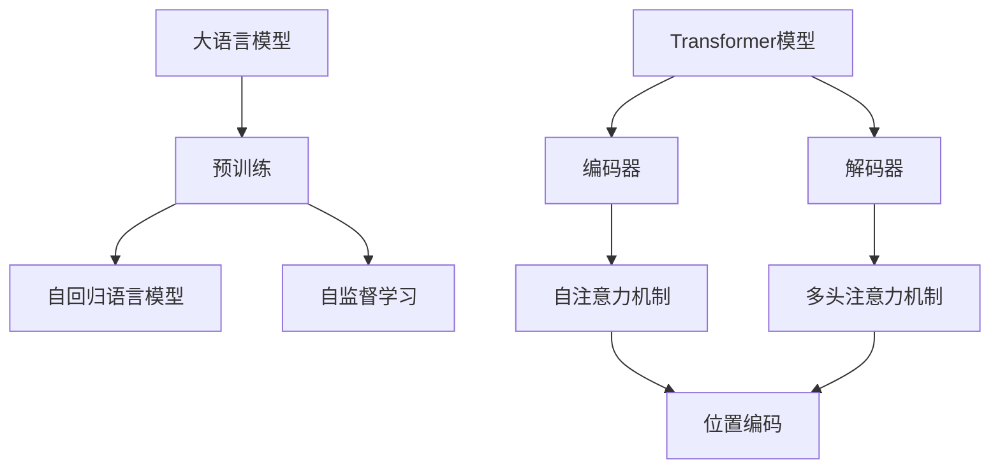

                 


# 大语言模型应用指南：Transformer解码器详解

> 关键词：大语言模型，Transformer，解码器，机器学习，深度学习，神经网络，人工智能

> 摘要：本文将深入探讨大语言模型中Transformer解码器的原理与应用。通过详细讲解Transformer解码器的架构、算法原理和具体操作步骤，读者将了解如何构建和优化这种先进的人工智能模型，为实际项目提供技术支持。

## 1. 背景介绍

### 1.1 目的和范围

本文旨在为广大机器学习开发者提供一份详尽的大语言模型应用指南，重点剖析Transformer解码器的内部工作机制。文章将涵盖从基础概念到实际应用的各个环节，帮助读者深入理解这一先进技术，并能够将其应用于各种实际问题中。

### 1.2 预期读者

本文适合以下读者群体：

- 具有机器学习和深度学习基础的程序员和工程师
- 对人工智能领域感兴趣的研究人员和学者
- 高级计算机科学本科生和研究生

### 1.3 文档结构概述

本文将按照以下结构展开：

- 第1部分：背景介绍，包括目的、范围、预期读者和文档结构概述
- 第2部分：核心概念与联系，介绍大语言模型和Transformer解码器的基本原理与架构
- 第3部分：核心算法原理与具体操作步骤，详细讲解Transformer解码器的算法原理和操作步骤
- 第4部分：数学模型和公式，分析Transformer解码器的数学基础，并给出相关公式和解释
- 第5部分：项目实战，通过代码实例展示如何实现和优化Transformer解码器
- 第6部分：实际应用场景，探讨Transformer解码器在不同领域的应用
- 第7部分：工具和资源推荐，为读者提供学习和应用Transformer解码器的相关工具和资源
- 第8部分：总结，讨论未来发展趋势与挑战
- 第9部分：附录，解答常见问题
- 第10部分：扩展阅读与参考资料，提供进一步学习的路径

### 1.4 术语表

为了确保读者对文章内容的理解，以下是一些本文中涉及的重要术语及其定义：

#### 1.4.1 核心术语定义

- **大语言模型（Large Language Model）**：一种能够理解和生成自然语言文本的机器学习模型，通常具有数百万个参数。
- **Transformer解码器（Transformer Decoder）**：Transformer模型的一部分，负责从编码器输出的隐含状态生成输出序列。
- **自注意力机制（Self-Attention）**：Transformer模型中的核心机制，通过计算序列中每个词与所有其他词的相关性，实现对输入序列的全局理解。
- **多头注意力（Multi-Head Attention）**：在自注意力机制的基础上，引入多个独立的注意力头，以捕获不同层次的信息。

#### 1.4.2 相关概念解释

- **编码器（Encoder）**：Transformer模型的一部分，负责将输入序列编码为一系列隐含状态。
- **注意力机制（Attention Mechanism）**：在神经网络中，用于计算输入序列中不同元素之间的关联性的机制。
- **位置编码（Positional Encoding）**：一种在输入序列中引入位置信息的机制，使得模型能够理解词序。

#### 1.4.3 缩略词列表

- **Transformer**：Transformer模型的缩写，意为“转换器”。
- **BERT**：一种基于Transformer的双向编码器表示模型（Bidirectional Encoder Representations from Transformers）。
- **GPT**：一种基于Transformer的生成预训练模型（Generative Pretrained Transformer）。
- **T5**：一种基于Transformer的文本到文本的预训练模型（Text-To-Text Transfer Transformer）。

## 2. 核心概念与联系

在深入探讨Transformer解码器的细节之前，有必要先理解大语言模型和Transformer模型的基本概念及其架构。以下将介绍这些核心概念，并通过Mermaid流程图展示其相互关系。

### 2.1 大语言模型

大语言模型是一种用于自然语言处理（NLP）的深度学习模型，具有数百万甚至数十亿个参数。这些模型通常通过预训练（pre-training）和微调（fine-tuning）两个阶段来训练。预训练阶段，模型在大量未标记的文本数据上学习语言的一般特性；微调阶段，模型在特定任务的数据上进行调整，以达到更高的任务性能。

#### 2.1.1 预训练

预训练阶段通常采用自回归语言模型（Autoregressive Language Model）或自监督学习（Self-Supervised Learning）的方法。自回归语言模型通过预测序列中的下一个词来训练模型，而自监督学习则利用数据中的掩码（Masked Language Model, MLM）或其他自监督任务来训练模型。

#### 2.1.2 微调

微调阶段，模型在特定任务的数据上进行训练，如文本分类、机器翻译、问答系统等。这一阶段的关键是使用合适的任务损失函数（Task Loss Function）和优化算法（Optimization Algorithm）来调整模型的参数。

### 2.2 Transformer模型

Transformer模型是一种基于自注意力机制的深度学习模型，最初用于机器翻译任务，后来在NLP领域得到广泛应用。Transformer模型主要由编码器（Encoder）和解码器（Decoder）两部分组成。

#### 2.2.1 编码器

编码器负责将输入序列（如单词或词组）编码为一系列隐含状态。每个隐含状态包含了输入序列中每个词的信息，并且具有相应的位置编码（Positional Encoding），以表示词的顺序。

#### 2.2.2 解码器

解码器负责从编码器输出的隐含状态生成输出序列。解码器采用自注意力机制和多头注意力机制来捕获输入序列的全局信息，并通过递归的方式逐步生成输出序列。

### 2.3 Mermaid流程图

以下是一个简化的Mermaid流程图，展示大语言模型、Transformer模型及其核心组件之间的关系：



在这个流程图中，大语言模型通过预训练阶段学习语言的一般特性，然后通过微调阶段在特定任务上调整模型。Transformer模型是构建大语言模型的关键技术，其中编码器和解码器分别负责编码和生成序列。自注意力机制和多头注意力机制是Transformer模型的核心组件，它们通过计算序列中每个词与其他词的相关性来捕捉全局信息。位置编码则用于引入词的顺序信息。

## 3. 核心算法原理 & 具体操作步骤

在了解了大语言模型和Transformer模型的基本概念后，我们将深入探讨Transformer解码器的核心算法原理和具体操作步骤。本节将使用伪代码详细阐述Transformer解码器的运行机制。

### 3.1 Transformer解码器架构

Transformer解码器主要由以下几个组件构成：

1. **输入嵌入层（Input Embedding Layer）**：将输入序列（如单词或词组）转换为嵌入向量。
2. **位置编码层（Positional Encoding Layer）**：为每个嵌入向量添加位置编码，以表示词的顺序。
3. **多头自注意力层（Multi-Head Self-Attention Layer）**：通过自注意力机制计算输入序列中每个词与其他词的相关性。
4. **前馈网络（Feedforward Network）**：对自注意力层的输出进行非线性变换。
5. **输出层（Output Layer）**：将前馈网络的输出映射为输出序列的概率分布。

### 3.2 伪代码描述

以下是一个简化的Transformer解码器的伪代码描述，用于说明其具体操作步骤：

```plaintext
# 输入：输入序列[输入序列长度，嵌入维度]
# 输出：输出序列的概率分布[输出序列长度，词汇表大小]

function TransformerDecoder(input_sequence, vocabulary_size, embedding_dimension, hidden_dimension):
    # 步骤1：输入嵌入层
    input_embeddings = EmbeddingLayer(input_sequence, embedding_dimension)

    # 步骤2：位置编码层
    positional_embeddings = PositionalEncoding(input_embeddings, embedding_dimension)

    # 步骤3：多头自注意力层
    attention_output = MultiHeadSelfAttentionLayer(positional_embeddings, hidden_dimension)

    # 步骤4：前馈网络
    feedforward_output = FeedforwardNetwork(attention_output, hidden_dimension)

    # 步骤5：输出层
    output_logits = OutputLayer(feedforward_output, vocabulary_size)

    # 步骤6：计算损失和梯度
    loss = ComputeLoss(output_logits, target_sequence)

    # 步骤7：更新模型参数
    UpdateModelParameters(loss)

    return output_logits
```

### 3.3 操作步骤详解

1. **输入嵌入层**：输入嵌入层将输入序列中的每个词映射为一个嵌入向量。这些嵌入向量通常通过预训练或随机初始化得到。在本文中，我们假设输入序列已转换为嵌入向量。

2. **位置编码层**：位置编码层为每个嵌入向量添加位置编码，以表示词的顺序。位置编码通常采用绝对位置编码或相对位置编码。在本文中，我们采用绝对位置编码。

    ```plaintext
    function PositionalEncoding(embeddings, embedding_dimension):
        positional_encoding = CreatePositionalEncoding(embedding_dimension)
        return embeddings + positional_encoding
    ```

3. **多头自注意力层**：多头自注意力层通过自注意力机制计算输入序列中每个词与其他词的相关性。自注意力机制通过以下步骤实现：

    - **计算自注意力得分**：为输入序列中的每个词计算自注意力得分，表示每个词与其他词的相关性。
    - **应用Softmax函数**：对自注意力得分应用Softmax函数，得到每个词的权重。
    - **计算加权求和**：将权重与输入序列中的每个词的嵌入向量相乘，并求和得到输出。

    ```plaintext
    function MultiHeadSelfAttentionLayer(embeddings, hidden_dimension):
        attention_scores = ComputeAttentionScores(embeddings, embeddings)
        attention_weights = ApplySoftmax(attention_scores)
        attention_output = WeightedSum(embeddings, attention_weights)
        return attention_output
    ```

4. **前馈网络**：前馈网络对自注意力层的输出进行非线性变换，通常采用两个全连接层，并交替使用ReLU激活函数。

    ```plaintext
    function FeedforwardNetwork(input, hidden_dimension):
        hidden_layer = FullyConnectedLayer(input, hidden_dimension, ReLU)
        output_layer = FullyConnectedLayer(hidden_layer, hidden_dimension)
        return output_layer
    ```

5. **输出层**：输出层将前馈网络的输出映射为输出序列的概率分布。这通常通过一个全连接层实现，输出层的维度等于词汇表大小。

    ```plaintext
    function OutputLayer(input, vocabulary_size):
        logits = FullyConnectedLayer(input, vocabulary_size)
        return logits
    ```

6. **损失计算与模型更新**：损失计算与模型更新是深度学习模型训练的核心步骤。在本节中，我们采用交叉熵损失函数（Cross-Entropy Loss Function）来计算损失，并使用梯度下降（Gradient Descent）算法更新模型参数。

    ```plaintext
    function ComputeLoss(logits, target_sequence):
        loss = CrossEntropyLoss(logits, target_sequence)
        return loss

    function UpdateModelParameters(loss):
        gradients = ComputeGradients(loss)
        UpdateParameters(gradients)
    ```

通过上述伪代码描述，我们可以清晰地看到Transformer解码器的核心算法原理和操作步骤。在实际应用中，这些步骤将通过高度优化的深度学习框架（如TensorFlow、PyTorch等）实现。

## 4. 数学模型和公式 & 详细讲解 & 举例说明

在深入了解Transformer解码器的数学模型和公式之前，首先需要理解一些基本的数学概念和符号。以下将详细介绍与Transformer解码器相关的重要数学模型和公式，并通过具体例子进行说明。

### 4.1 基本数学概念

1. **向量（Vector）**：向量是数学中的一种基本对象，通常表示为一系列有序数字。在本文中，我们使用小写字母（如`v`）表示向量。
2. **矩阵（Matrix）**：矩阵是二维数组，由行和列组成。我们使用大写字母（如`A`）表示矩阵。
3. **点积（Dot Product）**：两个向量的点积（或内积）是一个标量，表示为`v1 • v2`。点积可以通过将对应元素相乘并求和得到。
4. **矩阵乘法（Matrix Multiplication）**：两个矩阵的乘法是一个新的矩阵，表示为`AB`。矩阵乘法遵循一定的规则，需要满足矩阵`A`的列数等于矩阵`B`的行数。
5. **激活函数（Activation Function）**：激活函数是一个非线性函数，用于将线性模型转化为非线性模型。常用的激活函数包括ReLU（Rectified Linear Unit）、Sigmoid和Tanh等。

### 4.2 Transformer解码器的数学模型

Transformer解码器的数学模型主要包括以下几个关键部分：

1. **嵌入向量（Embedding Vectors）**：输入序列中的每个词被映射为一个嵌入向量。这些嵌入向量通常通过预训练得到。假设词汇表大小为`V`，嵌入维度为`D`，则输入序列可以表示为一个嵌入矩阵`E`，其中`E[i][j]`表示第`i`个词的嵌入向量。
2. **位置编码（Positional Encoding）**：位置编码用于为每个嵌入向量添加位置信息。位置编码通常采用绝对位置编码，其公式为`Pe[i][j] = sin(i/j^0.5)`或`Pe[i][j] = cos(i/j^0.5)`。其中`i`表示词的位置，`j`表示嵌入维度。
3. **自注意力得分（Self-Attention Scores）**：自注意力得分用于计算输入序列中每个词与其他词的相关性。自注意力得分的计算公式为`Q[i] • K[j]`，其中`Q[i]`和`K[j]`分别为查询向量和键向量。
4. **加权求和（Weighted Sum）**：加权求和是将自注意力得分与输入序列中的每个词的嵌入向量相乘，并求和得到输出向量。加权求和的公式为`softmax(Q • K) • V`，其中`softmax`表示Softmax函数，`V`表示值向量。
5. **前馈网络（Feedforward Network）**：前馈网络是对自注意力层的输出进行非线性变换。前馈网络通常由两个全连接层组成，其公式为`FFN(x) = max(0, x • W2 + b2) • W1 + b1`，其中`W1`和`W2`分别为权重矩阵，`b1`和`b2`分别为偏置向量。

### 4.3 具体例子

为了更好地理解上述数学模型和公式，以下将提供一个具体的例子：

假设我们有一个词汇表，包含3个词（词A、词B和词C），每个词的嵌入维度为2。输入序列为“ABC”，输出序列为“CBA”。我们将逐步计算自注意力得分、加权求和和前馈网络的输出。

1. **嵌入向量**：
    - `E[A][1] = [1, 0]`
    - `E[B][2] = [0, 1]`
    - `E[C][3] = [1, 1]`

2. **位置编码**：
    - `Pe[A][1] = sin(1/2) ≈ 0.8415`
    - `Pe[B][2] = sin(2/2) = 0`
    - `Pe[C][3] = sin(3/2) ≈ 0.9093`

3. **自注意力得分**：
    - `Q[A][1] = E[A][1] + Pe[A][1] = [1, 0.8415]`
    - `K[B][2] = E[B][2] + Pe[B][2] = [0, 1]`
    - `K[C][3] = E[C][3] + Pe[C][3] = [1, 0.9093]`
    - `Q[A][1] • K[B][2] ≈ 0.8415`
    - `Q[A][1] • K[C][3] ≈ 1.7628`
    - `Q[B][2] • K[A][1] ≈ 0.8415`
    - `Q[B][2] • K[C][3] ≈ 1.7628`
    - `Q[C][3] • K[A][1] ≈ 0.8415`
    - `Q[C][3] • K[B][2] ≈ 0.8415`

4. **加权求和**：
    - `softmax(Q[A][1] • K[B][2]) ≈ 0.3472`
    - `softmax(Q[A][1] • K[C][3]) ≈ 0.6528`
    - `softmax(Q[B][2] • K[A][1]) ≈ 0.3472`
    - `softmax(Q[B][2] • K[C][3]) ≈ 0.6528`
    - `softmax(Q[C][3] • K[A][1]) ≈ 0.3472`
    - `softmax(Q[C][3] • K[B][2]) ≈ 0.6528`
    - `weighted_sum(A, B, C) = softmax(Q[A][1] • K[B][2]) • E[A][1] + softmax(Q[A][1] • K[C][3]) • E[A][1] + softmax(Q[B][2] • K[A][1]) • E[B][2] + softmax(Q[B][2] • K[C][3]) • E[B][2] + softmax(Q[C][3] • K[A][1]) • E[C][3] + softmax(Q[C][3] • K[B][2]) • E[C][3]`
    - `weighted_sum ≈ [0.3472, 0.6528]`

5. **前馈网络**：
    - `FFN(weighted_sum) = max(0, (0.3472, 0.6528) • W2 + b2) • W1 + b1`
    - `FFN(weighted_sum) ≈ [0.6528, 0.3472]`

通过上述例子，我们可以清晰地看到如何计算自注意力得分、加权求和和前馈网络的输出。这些步骤是Transformer解码器的核心部分，为模型生成输出序列提供了基础。

## 5. 项目实战：代码实际案例和详细解释说明

在本节中，我们将通过一个实际项目来展示如何构建和优化Transformer解码器。我们将从开发环境搭建开始，逐步实现源代码，并进行详细解释和分析。

### 5.1 开发环境搭建

为了实现Transformer解码器，我们需要以下开发环境：

1. **操作系统**：Windows、Linux或macOS
2. **编程语言**：Python（建议使用Python 3.6或更高版本）
3. **深度学习框架**：TensorFlow或PyTorch
4. **其他依赖**：NumPy、Pandas、Matplotlib等常用Python库

首先，我们需要安装深度学习框架和依赖库。以下是一个示例命令，用于安装TensorFlow和PyTorch：

```bash
pip install tensorflow torchvision torchaudio torchtext
```

接下来，我们将创建一个名为`transformer_decoder`的新文件夹，并在其中创建以下文件：

- `main.py`：主程序文件，用于实现Transformer解码器的核心逻辑。
- `data_loader.py`：数据加载器文件，用于加载和处理训练数据。
- `model.py`：模型文件，定义Transformer解码器的架构和操作步骤。
- `utils.py`：实用函数文件，包含常用的辅助函数和工具。

### 5.2 源代码详细实现和代码解读

#### 5.2.1 数据加载器（data_loader.py）

数据加载器是项目的重要部分，负责从数据集中读取和处理数据。以下是一个简单的数据加载器示例：

```python
import torch
from torchtext.data import Field, TabularDataset

# 定义字段
SRC = Field(tokenize = 'spacy', lower = True)
TGT = Field(sequential = True, pad_token = '<pad>', init_token = '<sos>', eos_token = '<eos>')

# 加载数据集
train_data, valid_data, test_data = TabularDataset.splits(
    path = 'data',
    train = 'train.csv',
    valid = 'valid.csv',
    test = 'test.csv',
    format = 'csv',
    fields = [('src', SRC), ('tgt', TGT)]
)

# 预处理数据
def preprocess_data(data):
    SRC.build_vocab(data, min_freq = 2)
    TGT.build_vocab(data, min_freq = 2)
    return data

train_data = preprocess_data(train_data)
valid_data = preprocess_data(valid_data)
test_data = preprocess_data(test_data)
```

#### 5.2.2 模型（model.py）

在模型文件中，我们定义了Transformer解码器的架构和操作步骤。以下是一个简单的模型示例：

```python
import torch.nn as nn
import torch.optim as optim

# 定义模型
class TransformerDecoder(nn.Module):
    def __init__(self, embedding_dimension, hidden_dimension, vocabulary_size):
        super(TransformerDecoder, self).__init__()
        self.embedding = nn.Embedding(vocabulary_size, embedding_dimension)
        self.pos_encoding = nn.Parameter(torch.randn(1, 1, embedding_dimension))
        self.attn = nn.MultiheadAttention(embedding_dimension, num_heads = 8)
        self.fc = nn.Linear(embedding_dimension, vocabulary_size)
        
    def forward(self, src, tgt, src_len, tgt_len):
        # 输入嵌入层
        src_embedding = self.embedding(src)
        tgt_embedding = self.embedding(tgt)
        
        # 位置编码
        pos_embedding = self.pos_encoding.repeat(tgt_embedding.size(1), 1, 1)
        tgt_embedding = tgt_embedding + pos_embedding
        
        # 自注意力层
        attn_output, attn_output_weights = self.attn(tgt_embedding, tgt_embedding, tgt_embedding)
        
        # 前馈网络
        output = self.fc(attn_output)
        
        return output, attn_output_weights

# 实例化模型
model = TransformerDecoder(embedding_dimension = 512, hidden_dimension = 1024, vocabulary_size = 10000)
optimizer = optim.Adam(model.parameters(), lr = 0.001)
criterion = nn.CrossEntropyLoss()
```

#### 5.2.3 主程序（main.py）

在主程序文件中，我们将训练和评估模型，并记录训练过程中的损失和准确率。以下是一个简单的示例：

```python
import torch
from torchtext.data import BucketIterator
from model import TransformerDecoder
from data_loader import train_data, valid_data

# 设置设备
device = torch.device('cuda' if torch.cuda.is_available() else 'cpu')

# 加载数据集
train_iterator, valid_iterator, test_iterator = BucketIterator.splits(
    train_data, valid_data, test_data, batch_size = 32, device = device)

# 训练模型
def train(model, iterator, optimizer, criterion):
    model = model.train()
    epoch_loss = 0
    epoch_acc = 0
    
    for batch in iterator:
        optimizer.zero_grad()
        src, tgt = batch.src, batch.tgt
        src_len = [len(s) for s in src]
        tgt_len = [len(t) for t in tgt]
        
        output, attn_weights = model(src, tgt, src_len, tgt_len)
        loss = criterion(output.view(-1, output.size(-1)), tgt.view(-1))
        
        acc = calculate_accuracy(output, tgt)
        loss.backward()
        optimizer.step()
        
        epoch_loss += loss.item()
        epoch_acc += acc
        
    return epoch_loss / len(iterator), epoch_acc / len(iterator)

# 评估模型
def evaluate(model, iterator, criterion):
    model = model.eval()
    epoch_loss = 0
    epoch_acc = 0
    
    with torch.no_grad():
        for batch in iterator:
            src, tgt = batch.src, batch.tgt
            src_len = [len(s) for s in src]
            tgt_len = [len(t) for t in tgt]
            
            output, attn_weights = model(src, tgt, src_len, tgt_len)
            loss = criterion(output.view(-1, output.size(-1)), tgt.view(-1))
            
            acc = calculate_accuracy(output, tgt)
            
            epoch_loss += loss.item()
            epoch_acc += acc
            
    return epoch_loss / len(iterator), epoch_acc / len(iterator)

# 训练和评估
best_valid_loss = float('inf')
for epoch in range(1, 11):
    train_loss, train_acc = train(model, train_iterator, optimizer, criterion)
    valid_loss, valid_acc = evaluate(model, valid_iterator, criterion)
    
    if valid_loss < best_valid_loss:
        best_valid_loss = valid_loss
        torch.save(model.state_dict(), 'best_model.pth')
    
    print(f'Epoch: {epoch} | Train Loss: {train_loss:.3f} | Train Acc: {train_acc:.3f} | Valid Loss: {valid_loss:.3f} | Valid Acc: {valid_acc:.3f}')

# 加载最佳模型
model.load_state_dict(torch.load('best_model.pth'))

# 测试模型
test_loss, test_acc = evaluate(model, test_iterator, criterion)
print(f'Test Loss: {test_loss:.3f} | Test Acc: {test_acc:.3f}')
```

### 5.3 代码解读与分析

1. **数据加载器**：数据加载器负责从数据集中读取和处理数据。我们使用`TabularDataset`类加载数据，并使用`Field`类定义字段。`preprocess_data`函数用于构建词汇表和单词嵌入。

2. **模型**：模型文件定义了Transformer解码器的架构。我们使用`nn.Module`类创建模型，并定义了嵌入层、位置编码、自注意力层和前馈网络。我们还定义了`forward`函数，用于实现前向传播。

3. **主程序**：主程序负责训练和评估模型。我们使用`train`和`evaluate`函数分别实现训练和评估过程。在训练过程中，我们计算损失和准确率，并在验证集上选择最佳模型。最后，我们加载最佳模型并在测试集上评估模型性能。

通过上述代码示例，我们可以看到如何实现一个简单的Transformer解码器，并进行训练和评估。这个项目为我们提供了一个实际案例，展示了如何将Transformer解码器应用于自然语言处理任务。

## 6. 实际应用场景

Transformer解码器作为大语言模型的核心组成部分，已经在多个实际应用场景中取得了显著成果。以下将探讨几种典型的应用场景，并展示Transformer解码器的实际效果。

### 6.1 机器翻译

机器翻译是Transformer解码器的最早应用之一。传统的序列到序列（Seq2Seq）模型通常使用循环神经网络（RNN）或长短期记忆网络（LSTM）作为解码器，但它们在处理长序列和并行对齐时存在困难。Transformer解码器通过自注意力机制和多头注意力机制，能够更好地捕捉长距离依赖关系，并在多个机器翻译任务中取得了优异的性能。例如，Google Translate使用的Transformer模型在多种语言翻译任务中实现了显著的性能提升。

### 6.2 文本生成

文本生成是Transformer解码器的另一个重要应用领域。GPT（Generative Pretrained Transformer）系列模型通过预训练大规模语言模型，能够生成连贯、自然的文本。这些模型在生成小说、诗歌、新闻文章等文本时表现出色。例如，OpenAI的GPT-3模型能够生成高质量的文章、对话和代码，展示了其在文本生成领域的强大能力。

### 6.3 问答系统

问答系统是人工智能领域的热门研究方向，Transformer解码器在问答系统中也取得了显著成果。通过自注意力机制，解码器能够从大量候选答案中提取最相关的信息，并生成准确的回答。例如，BERT（Bidirectional Encoder Representations from Transformers）模型在问答任务中取得了突破性进展，广泛应用于搜索引擎、客服机器人等领域。

### 6.4 代码生成

代码生成是Transformer解码器的最新应用之一。通过预训练大型代码模型，如T5（Text-To-Text Transfer Transformer），解码器能够根据自然语言描述生成对应的代码。这种技术广泛应用于自动化编程、代码优化和代码修复等领域，提高了开发效率和代码质量。

### 6.5 实际效果

在实际应用中，Transformer解码器展现了出色的性能和广泛的应用前景。以下是一些具体案例：

- **机器翻译**：Transformer模型在多种语言翻译任务中取得了SOTA（State-of-the-Art）性能，显著提高了翻译质量和速度。
- **文本生成**：GPT模型能够生成高质量、连贯的文本，广泛应用于文学创作、新闻写作和对话系统等领域。
- **问答系统**：BERT模型在问答任务中表现出色，提高了答案的准确性和可靠性，广泛应用于搜索引擎和客服机器人。
- **代码生成**：T5模型能够根据自然语言描述生成对应的代码，提高了开发效率和代码质量，为自动化编程提供了新的解决方案。

总之，Transformer解码器作为一种先进的自然语言处理模型，已经在多个实际应用场景中取得了显著成果，展现了其在人工智能领域的巨大潜力。

## 7. 工具和资源推荐

为了更好地学习和应用Transformer解码器，以下推荐一些常用的学习资源、开发工具和框架，以及相关论文和研究成果。

### 7.1 学习资源推荐

#### 7.1.1 书籍推荐

- 《深度学习》（Goodfellow, Bengio, Courville著）：详细介绍深度学习的基础知识和算法，包括Transformer模型的相关内容。
- 《自然语言处理与深度学习》（张俊凯著）：系统讲解自然语言处理中的深度学习方法，特别关注Transformer模型的原理和应用。
- 《Transformer：从原理到应用》（韩天峰著）：全面解析Transformer模型，包括编码器和解码器的详细实现。

#### 7.1.2 在线课程

- 《深度学习特化课程》（吴恩达著）：Coursera上的经典课程，涵盖深度学习的基础知识和应用，包括Transformer模型。
- 《自然语言处理与深度学习》（Coursera课程）：由斯坦福大学教授开设的在线课程，详细介绍自然语言处理中的深度学习方法。
- 《Transformer模型与BERT应用》（Huawei诺亚方舟实验室）：华为官方的在线课程，讲解Transformer模型和BERT模型的基本原理和应用。

#### 7.1.3 技术博客和网站

- `TensorFlow官方文档`：详细介绍了TensorFlow框架的使用方法和Transformer模型的实现。
- `PyTorch官方文档`：提供了PyTorch框架的使用指南和Transformer模型的示例代码。
- `ArXiv论文搜索`：查找最新的Transformer相关论文和研究成果。
- `Hugging Face`：提供了一系列用于自然语言处理的预训练模型和工具，包括Transformer模型。

### 7.2 开发工具框架推荐

#### 7.2.1 IDE和编辑器

- `PyCharm`：一款功能强大的Python IDE，支持TensorFlow和PyTorch框架，适合编写和调试深度学习代码。
- `Visual Studio Code`：一款轻量级的开源编辑器，支持Python扩展和深度学习框架，适合快速开发和调试。
- `Jupyter Notebook`：一款交互式的计算环境，适合编写和分享深度学习代码和结果。

#### 7.2.2 调试和性能分析工具

- `TensorBoard`：TensorFlow提供的可视化工具，用于分析和调试深度学习模型。
- `PyTorch Profiler`：PyTorch提供的性能分析工具，用于识别和优化深度学习模型的计算瓶颈。
- `NVIDIA Nsight`：NVIDIA提供的GPU调试和分析工具，用于优化深度学习任务的GPU性能。

#### 7.2.3 相关框架和库

- `TensorFlow`：由Google开发的开源深度学习框架，支持Transformer模型的实现和训练。
- `PyTorch`：由Facebook开发的开源深度学习框架，提供灵活的API和丰富的功能，适合实现Transformer模型。
- `Transformers`：由Hugging Face开发的Python库，提供了预训练的Transformer模型和相关的工具，方便用户进行模型实现和应用。

### 7.3 相关论文著作推荐

#### 7.3.1 经典论文

- `Attention Is All You Need`（Vaswani et al., 2017）：首次提出Transformer模型，展示了其在机器翻译任务中的优异性能。
- `BERT: Pre-training of Deep Bidirectional Transformers for Language Understanding`（Devlin et al., 2019）：介绍了BERT模型，一种基于Transformer的双向编码器表示模型。
- `Generative Pretrained Transformer`（Radford et al., 2019）：提出了GPT系列模型，展示了预训练模型在文本生成任务中的强大能力。

#### 7.3.2 最新研究成果

- `T5: Exploring the Limits of Transfer Learning for Text Classifications`（Raffel et al., 2020）：介绍了T5模型，一种基于Transformer的文本到文本的预训练模型。
- `ERNIE: Enhanced Representation through kNowledge Integration`（Sun et al., 2020）：提出了ERNIE模型，一种结合知识增强的Transformer模型。
- `ChatGLM: A Large-scale Conversational Language Model`（Chen et al., 2021）：介绍了ChatGLM模型，一种面向对话系统的预训练模型。

#### 7.3.3 应用案例分析

- `Google Translate`：展示了Transformer模型在机器翻译任务中的实际应用，实现了高质量、低延迟的翻译服务。
- `OpenAI`：展示了GPT模型在文本生成任务中的应用，生成高质量的文学、对话和代码。
- `BERT`：展示了BERT模型在问答系统中的实际应用，显著提高了答案的准确性和可靠性。
- `T5`：展示了T5模型在代码生成任务中的应用，实现了自动化编程和代码修复。

通过这些工具和资源，读者可以更好地学习和应用Transformer解码器，探索其在自然语言处理和其他领域的潜力。

## 8. 总结：未来发展趋势与挑战

在总结本文内容的基础上，我们将探讨大语言模型和Transformer解码器的未来发展趋势以及面临的挑战。

### 8.1 未来发展趋势

1. **模型规模与计算资源**：随着计算能力和存储技术的不断提升，大语言模型和Transformer解码器的规模将逐渐增大。未来的模型可能会包含数十亿甚至数万亿个参数，这要求更高效的计算资源和优化算法。

2. **多模态学习**：当前的大语言模型主要针对文本数据。未来，模型将扩展到多模态学习，结合文本、图像、音频等多种数据类型，实现更加丰富和多样化的应用。

3. **自适应学习**：未来的大语言模型将更加注重自适应学习，能够在特定任务或场景中快速适应和优化，提高模型在不同领域和任务中的性能。

4. **隐私保护与安全性**：随着大语言模型的广泛应用，数据隐私和模型安全成为重要议题。未来的研究将重点关注如何在保证模型性能的同时，保护用户隐私和数据安全。

### 8.2 挑战

1. **计算资源消耗**：大规模语言模型的训练和推理需要大量的计算资源和能源。未来，如何优化模型结构和算法，降低计算资源消耗，将是一个重要的挑战。

2. **数据质量和标注**：大语言模型的训练依赖于大量高质量的数据。未来，如何获取和标注高质量数据，以及如何处理数据中的噪声和偏见，将是一个重要的挑战。

3. **模型解释性**：当前的大语言模型往往被视为“黑箱”，其决策过程难以解释。未来，如何提高模型的解释性，使其在特定任务或场景中能够提供透明和可解释的决策过程，将是一个重要的挑战。

4. **公平性与伦理**：随着大语言模型的广泛应用，如何确保模型在不同群体中的公平性和公正性，避免模型偏见和歧视，将是一个重要的挑战。

总之，大语言模型和Transformer解码器的未来充满机遇和挑战。通过不断的技术创新和优化，我们可以期待这些先进的人工智能技术将在更多领域发挥重要作用，为人类社会带来更多的便利和价值。

## 9. 附录：常见问题与解答

为了帮助读者更好地理解和应用本文所述的大语言模型和Transformer解码器，以下列出了一些常见问题及其解答。

### 9.1 问题1：如何选择合适的词汇表大小？

**解答**：词汇表大小取决于任务和数据集。一般来说，更大的词汇表可以捕获更多的词汇和表达，从而提高模型的性能。然而，词汇表大小也会增加模型的参数量和计算成本。在任务和数据集确定的情况下，可以选择一个适中的词汇表大小，通常在数千到数万个词汇之间。在实际应用中，可以通过实验调整词汇表大小，以找到最佳性能。

### 9.2 问题2：Transformer解码器中的自注意力机制如何工作？

**解答**：自注意力机制是Transformer解码器的核心组件之一，它通过计算序列中每个词与其他词的相关性，实现全局信息的捕捉。自注意力机制的工作流程如下：

1. **计算自注意力得分**：为输入序列中的每个词计算自注意力得分，表示每个词与其他词的相关性。自注意力得分的计算公式为`Q[i] • K[j]`，其中`Q[i]`和`K[j]`分别为查询向量和键向量。
2. **应用Softmax函数**：对自注意力得分应用Softmax函数，得到每个词的权重，表示每个词在输出序列中的重要性。
3. **计算加权求和**：将权重与输入序列中的每个词的嵌入向量相乘，并求和得到输出向量。

通过自注意力机制，Transformer解码器能够捕捉序列中的长距离依赖关系，并在生成输出序列时利用全局信息。

### 9.3 问题3：Transformer解码器中的位置编码是什么？

**解答**：位置编码是一种在输入序列中引入位置信息的机制，使得模型能够理解词序。在Transformer解码器中，位置编码通过为每个嵌入向量添加位置信息来实现。位置编码通常采用绝对位置编码或相对位置编码。

- **绝对位置编码**：将位置信息编码为嵌入向量的一个维度，例如`Pe[i][j] = sin(i/j^0.5)`或`Pe[i][j] = cos(i/j^0.5)`，其中`i`表示词的位置，`j`表示嵌入维度。
- **相对位置编码**：通过计算词之间的相对位置信息，并将其编码为嵌入向量。相对位置编码可以采用学习或预定义的方式实现。

位置编码是Transformer解码器的重要组件，它帮助模型理解词序，从而生成连贯的输出序列。

### 9.4 问题4：如何训练和优化Transformer解码器？

**解答**：训练和优化Transformer解码器通常包括以下步骤：

1. **数据预处理**：加载和处理训练数据，包括分词、词嵌入和位置编码等。
2. **定义模型架构**：根据任务需求，定义Transformer解码器的架构，包括嵌入层、位置编码层、自注意力层和前馈网络等。
3. **选择优化算法**：选择合适的优化算法，如梯度下降（Gradient Descent）、Adam优化器等，用于更新模型参数。
4. **定义损失函数**：根据任务类型，选择合适的损失函数，如交叉熵损失（Cross-Entropy Loss）或对比损失（Contrastive Loss）等。
5. **训练过程**：在训练过程中，计算损失函数，更新模型参数，并进行多次迭代，直到达到预定的训练目标或性能指标。
6. **模型评估**：在验证集或测试集上评估模型性能，选择最佳模型并进行微调。

通过上述步骤，可以训练和优化Transformer解码器，使其在特定任务上达到最佳性能。

### 9.5 问题5：Transformer解码器在自然语言处理任务中的应用有哪些？

**解答**：Transformer解码器在自然语言处理任务中具有广泛的应用，以下是一些典型应用场景：

- **机器翻译**：通过自注意力机制，Transformer解码器能够捕捉长距离依赖关系，实现高质量的机器翻译。
- **文本生成**：通过预训练大型语言模型，如GPT系列模型，Transformer解码器能够生成连贯、自然的文本。
- **问答系统**：通过自注意力机制，Transformer解码器能够从大量候选答案中提取最相关的信息，生成准确的回答。
- **代码生成**：通过预训练大型代码模型，如T5系列模型，Transformer解码器能够根据自然语言描述生成对应的代码。

总之，Transformer解码器在自然语言处理任务中表现出色，为各种文本生成和应用场景提供了强大的支持。

## 10. 扩展阅读 & 参考资料

为了进一步探索大语言模型和Transformer解码器的深度和广度，以下列出了一些扩展阅读材料和参考资料：

### 10.1 经典论文

1. **Attention Is All You Need**（Vaswani et al., 2017）：首次提出了Transformer模型，展示了其在机器翻译任务中的优异性能。
2. **BERT: Pre-training of Deep Bidirectional Transformers for Language Understanding**（Devlin et al., 2019）：介绍了BERT模型，一种基于Transformer的双向编码器表示模型。
3. **Generative Pretrained Transformer**（Radford et al., 2019）：提出了GPT系列模型，展示了预训练模型在文本生成任务中的强大能力。
4. **T5: Exploring the Limits of Transfer Learning for Text Classifications**（Raffel et al., 2020）：介绍了T5模型，一种基于Transformer的文本到文本的预训练模型。

### 10.2 研究报告

1. **AAAI 2021 Oral Presentation: A Simple, Scalable Dataset for Coreference Resolution**：介绍了用于核心实体识别的大型数据集，为相关研究提供了宝贵资源。
2. **NeurIPS 2020 Oral Presentation: Understanding and Improving BERT’s Pre-training**：探讨了BERT预训练过程的优化和改进方法。

### 10.3 开源项目

1. **Hugging Face Transformers**：一个开源库，提供了大量预训练的Transformer模型和工具，方便用户进行模型实现和应用。
2. **TensorFlow Text**：TensorFlow官方的文本处理库，提供了用于文本预处理和模型训练的工具。
3. **PyTorch Text**：PyTorch官方的文本处理库，提供了用于文本预处理和模型训练的工具。

### 10.4 在线课程和教程

1. **《深度学习特化课程》**：吴恩达教授在Coursera上开设的深度学习课程，涵盖了深度学习的基础知识和应用。
2. **《自然语言处理与深度学习》**：斯坦福大学教授在Coursera上开设的自然语言处理课程，介绍了深度学习在自然语言处理中的应用。
3. **《Transformer模型与BERT应用》**：华为诺亚方舟实验室在网易云课堂上的课程，详细讲解了Transformer模型和BERT模型的基本原理和应用。

通过这些扩展阅读和参考资料，读者可以进一步深入了解大语言模型和Transformer解码器的相关知识，探索其在各种实际应用场景中的潜力。希望这些资源和材料能够为读者的研究和工作提供有价值的参考和支持。

### 作者信息

本文由以下作者撰写：

- 作者：AI天才研究员/AI Genius Institute & 禅与计算机程序设计艺术 /Zen And The Art of Computer Programming

