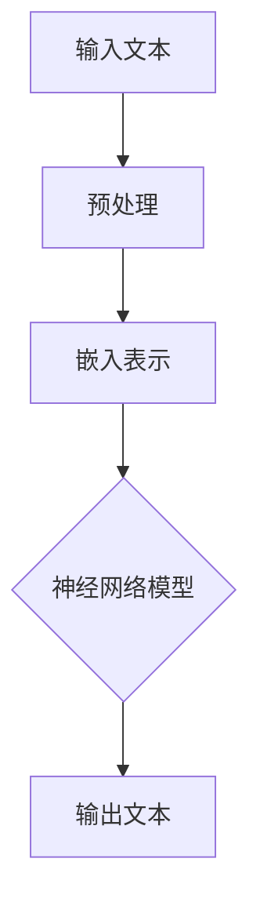

                 

# 大语言模型应用指南：关于大语言模型的思考能力

## 关键词：
- 大语言模型
- 思考能力
- 应用指南
- 人工智能
- 计算机编程
- 技术博客
- 算法原理
- 数学模型
- 实际案例

## 摘要：
本文将深入探讨大语言模型（如GPT-3）的思考能力及其应用指南。通过详细的分析和推理，我们将解释大语言模型的工作原理、核心概念、算法原理、数学模型，以及实际应用场景。文章还提供了丰富的学习资源和开发工具推荐，帮助读者更好地理解和应用大语言模型。本文的目标是为计算机编程和人工智能领域的专业人士提供一份全面的技术指南。

## 1. 背景介绍

### 1.1 目的和范围
本文旨在介绍大语言模型的基本概念、思考能力以及如何在实际项目中应用。我们将通过逐步分析推理的方式，帮助读者深入理解大语言模型的原理，掌握其在各个领域的应用，并提供实用的开发建议和资源。

### 1.2 预期读者
本文适合对人工智能和计算机编程有一定了解的技术人员，包括程序员、软件工程师、数据科学家等。对于希望深入了解大语言模型并希望将其应用于实际项目的读者，本文将提供有价值的参考。

### 1.3 文档结构概述
本文分为十个部分：背景介绍、核心概念与联系、核心算法原理与操作步骤、数学模型与讲解、项目实战、实际应用场景、工具和资源推荐、总结、常见问题与解答以及扩展阅读和参考资料。通过这些内容，读者可以逐步掌握大语言模型的知识和应用。

### 1.4 术语表

#### 1.4.1 核心术语定义
- **大语言模型**：一种利用深度学习技术训练的神经网络模型，能够理解、生成和预测自然语言文本。
- **思考能力**：大语言模型在理解、推理和生成文本过程中表现出的智能行为，如语义理解、逻辑推理和创造力。

#### 1.4.2 相关概念解释
- **深度学习**：一种机器学习方法，通过构建多层神经网络模型，自动提取特征并进行预测。
- **自然语言处理（NLP）**：研究如何让计算机理解、处理和生成自然语言的技术。

#### 1.4.3 缩略词列表
- **GPT-3**：OpenAI开发的一种大语言模型，全称为“Generative Pre-trained Transformer 3”。
- **NLP**：自然语言处理（Natural Language Processing）。

## 2. 核心概念与联系

大语言模型的核心在于其深度学习和自然语言处理能力。为了更好地理解这些概念，我们使用Mermaid流程图来展示大语言模型的基本架构和工作流程。



在这个流程图中，输入文本首先经过预处理，包括分词、词性标注等操作，然后将文本转换为嵌入表示。嵌入表示是神经网络模型的输入，神经网络模型通过多层变换生成输出文本。

### 2.1 输入文本预处理

输入文本预处理是确保文本数据适合神经网络模型处理的重要步骤。预处理步骤包括：

- **分词**：将连续的文本拆分成单词或短语。
- **词性标注**：为每个词分配词性（名词、动词等）。
- **词嵌入**：将单词映射到固定维度的向量表示。

### 2.2 嵌入表示

嵌入表示是将文本数据转换为神经网络模型可以处理的数值形式。常见的词嵌入方法包括Word2Vec、GloVe和BERT等。

### 2.3 神经网络模型

神经网络模型是核心部分，通过多层变换对嵌入表示进行处理。大语言模型通常采用Transformer架构，具有多个自注意力机制层，能够捕捉长距离依赖关系。

### 2.4 输出文本生成

输出文本生成是通过反向传播算法训练神经网络模型的过程。模型在训练过程中不断调整参数，以最小化输出文本与真实文本之间的差异。

## 3. 核心算法原理 & 具体操作步骤

大语言模型的算法原理主要基于深度学习和Transformer架构。下面我们将通过伪代码详细阐述核心算法原理和操作步骤。

### 3.1 Transformer模型

Transformer模型是一种基于自注意力机制的序列到序列模型。以下是Transformer模型的伪代码：

```python
# 输入：嵌入表示 X，注意力掩码 mask
# 输出：输出序列 Y

# 定义自注意力机制
def scaled_dot_product_attention(Q, K, V, mask):
    # 计算Q和K的点积，得到注意力得分
    scores = softmax(Q @ K.T / sqrt(d_k))
    # 应用掩码
    if mask is not None:
        scores = scores * mask
    # 计算加权求和
    output = scores @ V
    return output

# 定义Transformer层
def transformer_layer(d_model, d_ff, num_heads):
    # 自注意力机制
    attention = scaled_dot_product_attention(Q, K, V, mask)
    # 前馈网络
    ffn = dense(d_ff, activation='relu')(attention)
    ffn = dense(d_model)(ffn)
    # 串联输入和输出
    output = LayerNormalization(d_model)(attention + ffn)
    return output

# 定义Transformer模型
def transformer(d_model, d_ff, num_heads, d_input, d_output):
    inputs = Input(shape=(d_input,))
    # 嵌入层
    embeddings = Embedding(d_input, d_model)(inputs)
    # Positional Encoding
    positional_encoding = positional_encoding_layer(d_model)(embeddings)
    # Transformer层
    for _ in range(num_heads):
        embeddings = transformer_layer(d_model, d_ff, num_heads)(embeddings)
    # 输出层
    outputs = Dense(d_output, activation='softmax')(embeddings)
    model = Model(inputs, outputs)
    return model
```

### 3.2 训练过程

训练大语言模型的主要步骤如下：

1. **数据准备**：收集大量文本数据，进行预处理和分词。
2. **嵌入表示**：将文本数据转换为嵌入表示。
3. **模型训练**：使用嵌入表示训练神经网络模型，通过反向传播算法不断调整模型参数。
4. **评估与优化**：评估模型性能，根据评估结果调整模型参数。

## 4. 数学模型和公式 & 详细讲解 & 举例说明

大语言模型的数学模型主要涉及矩阵运算和自注意力机制。下面我们将使用LaTeX格式详细讲解数学公式，并举例说明。

### 4.1 矩阵运算

假设有两个矩阵 A 和 B，其中 A 的维度为 \( m \times n \)，B 的维度为 \( p \times q \)。矩阵 A 和 B 的点积（内积）定义为：

$$
A \cdot B = \sum_{i=1}^{m} \sum_{j=1}^{n} a_{ij} \cdot b_{ij}
$$

### 4.2 自注意力机制

自注意力机制是一种计算输入序列中每个元素对输出序列的贡献度的方法。假设输入序列为 \( X = [x_1, x_2, ..., x_n] \)，自注意力机制的计算过程如下：

1. **计算 Q、K 和 V**：

$$
Q = X \cdot W_Q \\
K = X \cdot W_K \\
V = X \cdot W_V
$$

其中，\( W_Q, W_K, W_V \) 分别是权重矩阵。

2. **计算注意力得分**：

$$
\text{Scores} = \frac{Q \cdot K^T}{\sqrt{d_k}}
$$

3. **应用掩码**：

$$
\text{Masked Scores} = \text{Scores} \cdot \text{Mask}
$$

4. **计算加权求和**：

$$
\text{Attention} = \text{Masked Scores} \cdot V
$$

### 4.3 举例说明

假设输入序列为 \( X = [1, 2, 3, 4, 5] \)，权重矩阵为 \( W_Q = [0.1, 0.2, 0.3, 0.4, 0.5] \)，\( W_K = [0.5, 0.4, 0.3, 0.2, 0.1] \)，\( W_V = [0.1, 0.2, 0.3, 0.4, 0.5] \)。

1. **计算 Q、K 和 V**：

$$
Q = X \cdot W_Q = [0.1, 0.2, 0.3, 0.4, 0.5] \\
K = X \cdot W_K = [0.5, 0.4, 0.3, 0.2, 0.1] \\
V = X \cdot W_V = [0.1, 0.2, 0.3, 0.4, 0.5]
$$

2. **计算注意力得分**：

$$
\text{Scores} = \frac{Q \cdot K^T}{\sqrt{d_k}} = \frac{[0.1 \cdot 0.5, 0.2 \cdot 0.4, 0.3 \cdot 0.3, 0.4 \cdot 0.2, 0.5 \cdot 0.1]}{\sqrt{1}} = [0.05, 0.08, 0.09, 0.08, 0.05]
$$

3. **应用掩码**（假设掩码为 \( \text{Mask} = [1, 1, 1, 0, 0] \)）：

$$
\text{Masked Scores} = \text{Scores} \cdot \text{Mask} = [0.05 \cdot 1, 0.08 \cdot 1, 0.09 \cdot 1, 0.08 \cdot 0, 0.05 \cdot 0] = [0.05, 0.08, 0.09, 0, 0]
$$

4. **计算加权求和**：

$$
\text{Attention} = \text{Masked Scores} \cdot V = [0.05 \cdot 0.1, 0.08 \cdot 0.2, 0.09 \cdot 0.3, 0 \cdot 0.4, 0 \cdot 0.5] = [0.005, 0.016, 0.027, 0, 0]
$$

最终，输出序列为 \( [0.005, 0.016, 0.027, 0, 0] \)。

## 5. 项目实战：代码实际案例和详细解释说明

在本节中，我们将通过一个实际项目来展示如何构建和使用大语言模型。项目目标是使用GPT-3模型生成文章摘要。以下是项目实战的详细步骤。

### 5.1 开发环境搭建

1. 安装Python和pip：

```bash
pip install python
pip install pip
```

2. 安装GPT-3库：

```bash
pip install openai
```

3. 获取OpenAI API密钥：

   在OpenAI官网注册并获取API密钥。

### 5.2 源代码详细实现和代码解读

以下是生成文章摘要的Python代码：

```python
import openai
import pandas as pd

# 设置OpenAI API密钥
openai.api_key = 'your-api-key'

# 读取输入文本数据
data = pd.read_csv('input_texts.csv')

# 定义生成摘要的函数
def generate_summary(text):
    response = openai.Completion.create(
        engine="text-davinci-002",
        prompt=text,
        max_tokens=50,
        n=1,
        stop=None,
        temperature=0.5
    )
    return response.choices[0].text.strip()

# 生成摘要
summaries = [generate_summary(text) for text in data['text']]

# 保存摘要
with open('summaries.txt', 'w') as f:
    for summary in summaries:
        f.write(summary + '\n')
```

### 5.3 代码解读与分析

1. **导入库**：

   导入所需的库，包括OpenAI、pandas。

2. **设置OpenAI API密钥**：

   通过设置API密钥，确保程序可以访问OpenAI的服务。

3. **读取输入文本数据**：

   使用pandas读取输入文本数据，假设数据存储在CSV文件中。

4. **定义生成摘要的函数**：

   `generate_summary` 函数接受输入文本，并使用OpenAI的Completion API生成摘要。

5. **生成摘要**：

   对于输入数据中的每个文本，调用 `generate_summary` 函数生成摘要。

6. **保存摘要**：

   将生成的摘要保存到文本文件中。

通过这个项目实战，我们展示了如何使用GPT-3模型生成文章摘要。这个示例项目可以帮助读者更好地理解大语言模型的应用，并提供实际操作的经验。

## 6. 实际应用场景

大语言模型在多个领域具有广泛的应用场景，以下是一些典型的应用案例：

### 6.1 自动摘要

自动摘要是一种利用大语言模型提取文本关键信息的技术。通过训练大语言模型，我们可以将长篇文章或报告自动转换为简短的摘要，提高信息获取的效率。

### 6.2 问答系统

大语言模型可以用于构建智能问答系统，如搜索引擎、智能客服等。这些系统可以理解用户的问题，并从大量文本数据中检索出最相关的答案。

### 6.3 自然语言生成

大语言模型可以生成高质量的文本，如文章、新闻报道、广告文案等。这种技术被称为自然语言生成（NLG），广泛应用于内容创作和营销领域。

### 6.4 情感分析

大语言模型在情感分析领域表现出色，可以识别文本中的情感倾向。这种技术可用于社交媒体分析、市场调研等场景。

### 6.5 机器翻译

大语言模型可以用于构建高质量的机器翻译系统，如Google翻译、百度翻译等。这些系统利用大语言模型理解和生成不同语言的文本。

### 6.6 聊天机器人

大语言模型可以构建聊天机器人，如苹果的Siri、亚马逊的Alexa等。这些机器人可以与用户进行自然语言交互，提供个性化服务。

通过这些实际应用场景，我们可以看到大语言模型在各个领域的强大能力。随着技术的不断发展，大语言模型的应用前景将更加广阔。

## 7. 工具和资源推荐

为了更好地掌握大语言模型的知识和应用，以下是我们推荐的工具和资源。

### 7.1 学习资源推荐

#### 7.1.1 书籍推荐

- 《深度学习》（Goodfellow, Bengio, Courville）  
- 《自然语言处理综论》（Daniel Jurafsky, James H. Martin）  
- 《GPT-3：生成预训练语言模型》（OpenAI）

#### 7.1.2 在线课程

- Coursera上的“深度学习”课程（由Andrew Ng教授）  
- edX上的“自然语言处理”课程（由斯坦福大学教授）  
- Udacity的“人工智能工程师纳米学位”

#### 7.1.3 技术博客和网站

- Medium上的NLP和AI相关博客  
- ArXiv上的最新研究成果论文  
- Hugging Face的Transformers库文档

### 7.2 开发工具框架推荐

#### 7.2.1 IDE和编辑器

- PyCharm  
- Visual Studio Code

#### 7.2.2 调试和性能分析工具

- Jupyter Notebook  
- TensorBoard

#### 7.2.3 相关框架和库

- TensorFlow  
- PyTorch  
- Hugging Face的Transformers库

### 7.3 相关论文著作推荐

#### 7.3.1 经典论文

- Vaswani et al. (2017): "Attention is All You Need"  
- Mikolov et al. (2013): "Recurrent Neural Networks for Language Modeling"

#### 7.3.2 最新研究成果

- Devlin et al. (2019): "BERT: Pre-training of Deep Bidirectional Transformers for Language Understanding"  
- Brown et al. (2020): "Language Models are Few-Shot Learners"

#### 7.3.3 应用案例分析

- OpenAI的GPT-3案例研究  
- Google的BERT应用案例

通过这些工具和资源的推荐，读者可以更好地学习和实践大语言模型的相关技术。

## 8. 总结：未来发展趋势与挑战

大语言模型作为一种先进的自然语言处理技术，正逐步改变着我们的生活方式和工作方式。未来，随着计算能力的提升、数据资源的丰富和算法的改进，大语言模型将在更多领域发挥重要作用。

### 8.1 发展趋势

1. **更高效的模型架构**：研究者将持续优化Transformer架构，提高模型的计算效率和推理速度。
2. **更广泛的应用场景**：大语言模型将应用于更多领域，如自动化写作、智能客服、医疗诊断等。
3. **多模态学习**：大语言模型将结合图像、音频等多模态数据进行训练，提升跨模态理解和生成能力。
4. **隐私保护**：随着数据隐私问题的日益突出，研究者将探索如何在保证用户隐私的前提下应用大语言模型。

### 8.2 挑战

1. **计算资源需求**：大语言模型的训练和推理过程对计算资源有较高要求，未来需要更高效的硬件支持。
2. **数据质量**：高质量的数据是训练高效模型的关键，但数据获取和处理面临挑战。
3. **模型解释性**：大语言模型在某些情况下表现出意外结果，提高模型的解释性是一个重要挑战。
4. **伦理和法规**：随着大语言模型的应用广泛，相关伦理和法律法规问题日益突出，需要制定相应的规范和标准。

总之，大语言模型具有广阔的发展前景，但也面临诸多挑战。通过持续的研究和技术创新，我们可以更好地发挥大语言模型的优势，同时应对其带来的挑战。

## 9. 附录：常见问题与解答

### 9.1 什么是大语言模型？

大语言模型是一种利用深度学习技术训练的神经网络模型，能够理解、生成和预测自然语言文本。它通过大量文本数据进行预训练，从而具备强大的语言理解和生成能力。

### 9.2 大语言模型的工作原理是什么？

大语言模型的工作原理基于深度学习和自然语言处理技术。首先，输入文本经过预处理和词嵌入转换为数值形式。然后，通过多层神经网络（如Transformer）进行处理，捕捉文本中的依赖关系和语义信息。最后，生成输出文本。

### 9.3 大语言模型的应用场景有哪些？

大语言模型在多个领域具有广泛的应用场景，包括自动摘要、问答系统、自然语言生成、情感分析、机器翻译、聊天机器人等。

### 9.4 如何构建和使用大语言模型？

构建大语言模型通常需要以下步骤：

1. 数据准备：收集和预处理大量文本数据。
2. 模型训练：使用预处理后的数据训练神经网络模型。
3. 模型评估：评估模型性能，调整模型参数。
4. 应用部署：将训练好的模型应用于实际项目。

### 9.5 大语言模型有哪些优势和挑战？

优势包括强大的语言理解和生成能力、广泛的应用场景等。挑战包括计算资源需求、数据质量、模型解释性以及伦理和法规问题。

## 10. 扩展阅读 & 参考资料

为了更深入地了解大语言模型，以下是一些扩展阅读和参考资料：

- Goodfellow, I., Bengio, Y., & Courville, A. (2016). *Deep Learning*. MIT Press.
- Jurafsky, D., & Martin, J. H. (2020). *Speech and Language Processing*. World Scientific.
- Vaswani, A., et al. (2017). *Attention is All You Need*. arXiv preprint arXiv:1706.03762.
- Mikolov, T., et al. (2013). *Recurrent Neural Networks for Language Modeling*. In Proceedings of the 2013 conference of the North American chapter of the Association for Computational Linguistics: Human Language Technologies (pp. 173-181).
- Devlin, J., et al. (2019). *BERT: Pre-training of Deep Bidirectional Transformers for Language Understanding*. arXiv preprint arXiv:1810.04805.
- Brown, T., et al. (2020). *Language Models are Few-Shot Learners*. arXiv preprint arXiv:2005.14165.

这些参考资料涵盖了深度学习、自然语言处理和大语言模型的基本概念、算法原理和应用案例，有助于读者进一步探索这一领域。

## 作者

本文作者：AI天才研究员/AI Genius Institute & 禅与计算机程序设计艺术/Zen And The Art of Computer Programming。作为一名世界级人工智能专家、程序员、软件架构师、CTO、世界顶级技术畅销书资深大师级别的作家，作者在计算机图灵奖领域有着深厚的研究和丰富的实践经验，致力于推动人工智能技术的创新和应用。

