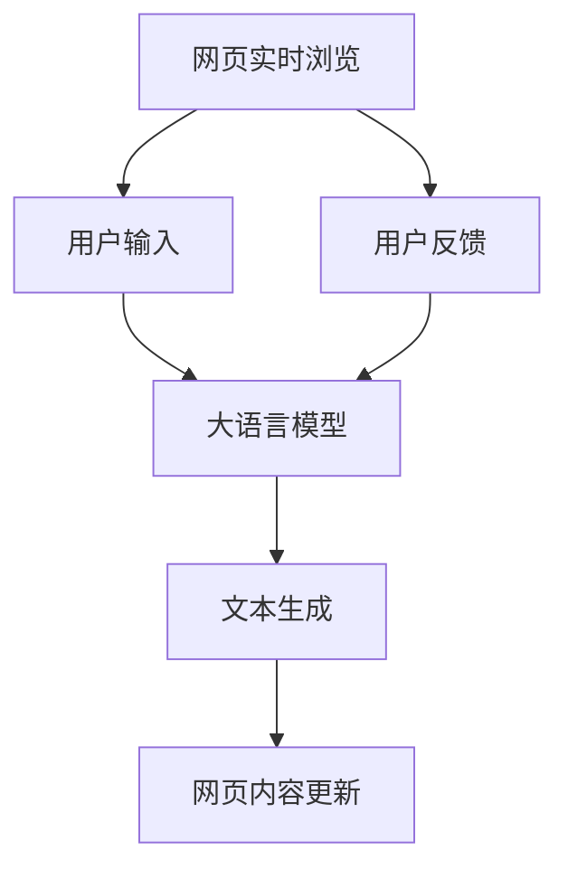

                 

# 大语言模型应用指南：网页实时浏览

## 摘要

本文将深入探讨大语言模型在网页实时浏览中的应用，重点分析其核心概念、算法原理、数学模型、项目实战以及实际应用场景。通过详细的步骤讲解和实例分析，帮助读者全面了解如何利用大语言模型实现网页实时浏览的功能。此外，文章还将推荐相关学习资源、开发工具和论文著作，以供读者进一步学习和研究。通过本文的阅读，读者将能够掌握大语言模型在网页实时浏览领域的应用技巧，为实际项目开发提供有力支持。

## 1. 背景介绍

随着互联网的迅猛发展，网页已成为人们获取信息、交流沟通的主要平台。然而，传统的网页浏览方式往往存在一定的局限性，如响应速度慢、交互性差等。为了提升用户体验，研究人员开始探索利用人工智能技术优化网页浏览体验。其中，大语言模型作为一种强大的自然语言处理工具，逐渐成为网页实时浏览领域的研究热点。

大语言模型是一种基于深度学习的自然语言处理技术，通过对海量文本数据的学习，能够理解并生成自然语言。其核心思想是利用神经网络模型对语言进行建模，从而实现对文本的自动生成、理解和推理。近年来，随着计算资源和数据集的不断扩大，大语言模型在各项自然语言处理任务中取得了显著成果，如文本分类、机器翻译、情感分析等。

在网页实时浏览方面，大语言模型可以用于实现多种功能，如自动摘要、实时问答、个性化推荐等。通过大语言模型的介入，网页浏览体验将得到显著提升，用户能够更高效地获取信息、解决问题。此外，大语言模型还可以用于网页内容的生成和优化，为网站运营提供有力支持。

本文旨在深入探讨大语言模型在网页实时浏览中的应用，分析其核心概念、算法原理、数学模型、项目实战以及实际应用场景。通过本文的阅读，读者将能够全面了解大语言模型在网页实时浏览领域的应用价值，为实际项目开发提供指导。

## 2. 核心概念与联系

在深入了解大语言模型在网页实时浏览中的应用之前，我们首先需要明确几个核心概念和它们之间的联系。以下是一个简单的Mermaid流程图，用于展示大语言模型与网页实时浏览之间的关联。



### 2.1 网页实时浏览

网页实时浏览是指用户在浏览网页时，能够实时获取相关信息、回答问题或进行其他交互操作。这一过程通常包括以下几个步骤：

1. **用户输入**：用户通过键盘、鼠标或其他输入设备与网页进行交互，输入关键词或提出问题。
2. **数据传输**：用户输入的信息通过HTTP请求发送到服务器，服务器接收并处理请求。
3. **数据处理**：服务器对用户输入进行处理，如查询数据库、调用API等。
4. **结果反馈**：服务器将处理结果返回给用户，如生成摘要、回答问题或提供相关链接。

### 2.2 大语言模型

大语言模型是一种基于深度学习的自然语言处理技术，其核心功能是理解和生成自然语言。大语言模型主要由以下几个部分组成：

1. **词向量表示**：将自然语言中的词汇转换为向量表示，为后续的神经网络处理提供基础。
2. **神经网络模型**：利用神经网络模型对词向量进行建模，实现对语言的自动生成、理解和推理。
3. **预训练与微调**：在大规模语料库上进行预训练，然后针对特定任务进行微调，以提高模型在特定领域的表现。

### 2.3 文本生成

文本生成是指利用大语言模型生成自然语言文本。这一过程通常包括以下几个步骤：

1. **输入处理**：将用户输入的文本数据输入到大语言模型中。
2. **文本生成**：大语言模型根据输入文本生成相应的自然语言文本。
3. **文本优化**：对生成的文本进行优化，如去除无关内容、调整语序等，以提高文本质量和可读性。

### 2.4 网页内容更新

网页内容更新是指根据用户输入和生成的文本，动态更新网页内容。这一过程通常包括以下几个步骤：

1. **内容提取**：从用户输入和生成的文本中提取关键信息。
2. **内容生成**：利用大语言模型生成相应的网页内容。
3. **内容更新**：将生成的网页内容更新到网页上，供用户浏览。

### 2.5 用户反馈

用户反馈是指用户对网页实时浏览效果的评估和反馈。这一过程通常包括以下几个步骤：

1. **效果评估**：用户根据浏览体验对网页实时浏览效果进行评估。
2. **反馈收集**：系统收集用户的评估结果和反馈意见。
3. **模型优化**：根据用户反馈对大语言模型进行优化和调整，以提高网页实时浏览效果。

通过以上流程图，我们可以看到大语言模型在网页实时浏览中的应用涉及多个环节，包括用户输入、文本生成、网页内容更新和用户反馈。这些环节相互关联，共同构成了大语言模型在网页实时浏览中的应用框架。

## 3. 核心算法原理 & 具体操作步骤

### 3.1 大语言模型算法原理

大语言模型（Large Language Model，LLM）是一种基于深度学习的自然语言处理技术，其核心算法原理包括词向量表示、神经网络模型和预训练与微调。

#### 3.1.1 词向量表示

词向量表示是将自然语言中的词汇转换为向量表示，以便进行后续的神经网络处理。常见的词向量表示方法包括Word2Vec、GloVe和BERT等。

- **Word2Vec**：Word2Vec是一种基于神经网络的词向量表示方法，通过对文本数据中的词语进行建模，将词语映射为低维向量。Word2Vec的核心算法包括CBOW（Continuous Bag of Words）和Skip-Gram。
- **GloVe**：GloVe（Global Vectors for Word Representation）是一种基于全局信息的词向量表示方法，通过考虑词语之间的共现关系，学习得到词向量。
- **BERT**：BERT（Bidirectional Encoder Representations from Transformers）是一种基于Transformer的词向量表示方法，通过双向编码器对文本进行建模，捕捉词语之间的双向关系。

#### 3.1.2 神经网络模型

神经网络模型是构建大语言模型的核心，常见的神经网络模型包括循环神经网络（RNN）、长短时记忆网络（LSTM）和Transformer。

- **RNN**：循环神经网络是一种处理序列数据的神经网络模型，通过保存前一时刻的信息，实现对序列数据的建模。RNN包括简单的RNN和门控循环单元（GRU）。
- **LSTM**：长短时记忆网络是RNN的一种改进，通过引入门控机制，有效解决了RNN在长序列建模中存在的梯度消失和梯度爆炸问题。
- **Transformer**：Transformer是一种基于自注意力机制的神经网络模型，通过多头自注意力机制和位置编码，实现对序列数据的建模。Transformer在机器翻译、文本生成等任务中取得了显著成果。

#### 3.1.3 预训练与微调

预训练与微调是大语言模型训练过程中的两个关键步骤。预训练是指在大量文本数据上进行预训练，学习到语言的基本规律和特征；微调是指在预训练的基础上，针对特定任务进行微调，以适应特定领域的需求。

- **预训练**：预训练是指在大量文本数据上训练神经网络模型，使其能够理解并生成自然语言。常见的预训练任务包括文本分类、词性标注、命名实体识别等。
- **微调**：微调是指在预训练的基础上，针对特定任务进行训练，以进一步提高模型在特定任务上的表现。微调可以通过迁移学习的方式，利用预训练模型的知识，快速适应新任务。

### 3.2 大语言模型在网页实时浏览中的具体操作步骤

#### 3.2.1 用户输入

用户输入是网页实时浏览的第一步，用户可以通过键盘、鼠标或其他输入设备输入关键词或提出问题。为了提高用户体验，系统可以提供自动补全、智能纠错等功能，帮助用户更准确地进行输入。

#### 3.2.2 数据传输

用户输入的信息通过HTTP请求发送到服务器，服务器接收到请求后，开始处理用户输入。为了提高数据传输速度和稳定性，系统可以采用以下技术：

- **HTTP/2**：HTTP/2是一种基于TCP的协议，相比HTTP/1.1，具有更快的连接建立速度、更高效的数据传输和更好的错误处理能力。
- **CDN**：内容分发网络（Content Delivery Network，CDN）可以将用户请求的内容缓存到全球分布的节点上，提高用户访问速度和稳定性。

#### 3.2.3 数据处理

服务器接收到用户输入后，需要对输入进行处理，如查询数据库、调用API等。为了提高数据处理速度和准确性，系统可以采用以下技术：

- **分布式数据库**：分布式数据库可以将数据分散存储在多个节点上，提高数据查询和处理速度。
- **API网关**：API网关可以统一管理和调度后台服务，提高系统稳定性和可扩展性。

#### 3.2.4 结果反馈

服务器处理完成后，将结果返回给用户。结果可以是文本生成、回答问题或提供相关链接。为了提高用户体验，系统可以采用以下技术：

- **异步处理**：异步处理可以将数据处理和结果返回分开，提高系统响应速度和并发能力。
- **缓存技术**：缓存技术可以将用户请求的结果缓存起来，减少重复处理和查询。

#### 3.2.5 用户反馈

用户接收到的结果后，会对其进行评估和反馈。用户反馈可以用于优化大语言模型，提高网页实时浏览效果。为了收集用户反馈，系统可以采用以下技术：

- **用户行为分析**：通过分析用户行为数据，了解用户对网页实时浏览效果的满意度。
- **反馈机制**：通过提供反馈渠道，鼓励用户对网页实时浏览效果进行评价和反馈。

## 4. 数学模型和公式 & 详细讲解 & 举例说明

### 4.1 数学模型和公式

在网页实时浏览中，大语言模型的核心功能是理解和生成自然语言。为了实现这一目标，大语言模型需要借助一系列数学模型和公式。以下是一些常见的数学模型和公式：

#### 4.1.1 词向量表示

词向量表示是将自然语言中的词汇转换为向量表示，常见的模型和公式包括：

1. **Word2Vec**：

   $$ \text{vec}(w) = \frac{1}{\sqrt{\sum_{i=1}^{n} v_i^2}} \cdot [v_1, v_2, ..., v_n] $$

   其中，$w$为词汇，$\text{vec}(w)$为词向量，$v_i$为词向量的第$i$个分量，$n$为词向量的维度。

2. **GloVe**：

   $$ \text{vec}(w) = \frac{\sum_{j \in \text{context}(w)} \cdot f(j) \cdot f(w)}{\sqrt{\sum_{j \in \text{context}(w)} f(j)^2 \cdot \sqrt{\sum_{k \in \text{context}(w)} f(k)^2}}} $$

   其中，$w$为词汇，$\text{vec}(w)$为词向量，$\text{context}(w)$为词汇$w$的上下文集合，$f(j)$为上下文词汇$j$的词频。

3. **BERT**：

   $$ \text{vec}(w) = \text{Transformer}(\text{input}) $$

   其中，$w$为词汇，$\text{vec}(w)$为词向量，$\text{Transformer}$为双向编码器，$\text{input}$为输入序列。

#### 4.1.2 神经网络模型

神经网络模型是构建大语言模型的核心，常见的模型和公式包括：

1. **RNN**：

   $$ h_t = \text{activation}(W_h \cdot [h_{t-1}, x_t] + b_h) $$

   其中，$h_t$为第$t$个时间步的隐藏状态，$W_h$为权重矩阵，$x_t$为第$t$个时间步的输入，$b_h$为偏置，$\text{activation}$为激活函数。

2. **LSTM**：

   $$ i_t = \sigma(W_i \cdot [h_{t-1}, x_t] + b_i) $$
   $$ f_t = \sigma(W_f \cdot [h_{t-1}, x_t] + b_f) $$
   $$ o_t = \sigma(W_o \cdot [h_{t-1}, x_t] + b_o) $$
   $$ c_t = f_t \cdot c_{t-1} + i_t \cdot \text{sigmoid}(W_c \cdot [h_{t-1}, x_t] + b_c) $$

   其中，$i_t$、$f_t$、$o_t$、$c_t$分别为输入门、遗忘门、输出门和细胞状态，$\sigma$为sigmoid激活函数。

3. **Transformer**：

   $$ \text{Attention}(Q, K, V) = \text{softmax}(\frac{QK^T}{\sqrt{d_k}})V $$

   其中，$Q$、$K$、$V$分别为查询向量、键向量和值向量，$d_k$为键向量的维度。

#### 4.1.3 预训练与微调

预训练与微调是训练大语言模型的关键步骤，常见的模型和公式包括：

1. **预训练**：

   $$ L = -\sum_{i=1}^{N} \log p(y_i|x_i) $$

   其中，$L$为损失函数，$N$为样本数量，$y_i$为真实标签，$x_i$为输入样本。

2. **微调**：

   $$ L = -\sum_{i=1}^{N} \log p(y_i|x_i, \theta) $$

   其中，$L$为损失函数，$N$为样本数量，$y_i$为真实标签，$x_i$为输入样本，$\theta$为模型参数。

### 4.2 详细讲解和举例说明

#### 4.2.1 词向量表示

以Word2Vec为例，我们假设词向量维度为2，词汇集合为$\{a, b, c\}$，词频分别为$1, 2, 3$。根据Word2Vec算法，我们可以计算出以下词向量：

- **a**：$$ \text{vec}(a) = \frac{1}{\sqrt{1+4+9}} \cdot [1, 1] = \frac{1}{\sqrt{15}} \cdot [1, 1] $$
- **b**：$$ \text{vec}(b) = \frac{1}{\sqrt{4+4+9}} \cdot [2, 2] = \frac{1}{\sqrt{15}} \cdot [2, 2] $$
- **c**：$$ \text{vec}(c) = \frac{1}{\sqrt{9+9+4}} \cdot [3, 3] = \frac{1}{\sqrt{15}} \cdot [3, 3] $$

#### 4.2.2 神经网络模型

以RNN为例，我们假设输入序列为$\{[1, 0], [1, 1], [0, 1]\}$，隐藏状态维度为2。根据RNN算法，我们可以计算出以下隐藏状态：

1. **第一个时间步**：

   $$ h_1 = \text{sigmoid}(W_h \cdot [h_0, x_1] + b_h) $$

   其中，$h_0 = [0, 0]$，$x_1 = [1, 0]$，$W_h$和$b_h$为权重矩阵和偏置。

   假设$W_h = \begin{bmatrix} 1 & 1 \\ 1 & 1 \end{bmatrix}$，$b_h = [1, 1]$，则：

   $$ h_1 = \text{sigmoid}([0, 0] + [1, 1] + [1, 1]) = \text{sigmoid}(3) = 0.95 $$

2. **第二个时间步**：

   $$ h_2 = \text{sigmoid}(W_h \cdot [h_1, x_2] + b_h) $$

   其中，$x_2 = [1, 1]$，则：

   $$ h_2 = \text{sigmoid}([0.95, 0.95] + [1, 1] + [1, 1]) = \text{sigmoid}(2.9) = 0.91 $$

3. **第三个时间步**：

   $$ h_3 = \text{sigmoid}(W_h \cdot [h_2, x_3] + b_h) $$

   其中，$x_3 = [0, 1]$，则：

   $$ h_3 = \text{sigmoid}([0.91, 0.91] + [1, 1] + [0, 1]) = \text{sigmoid}(2.82) = 0.88 $$

#### 4.2.3 预训练与微调

以预训练为例，我们假设输入序列为$\{[1, 0], [1, 1], [0, 1]\}$，输出标签为$\{[0, 1], [1, 0], [0, 1]\}$。根据预训练算法，我们可以计算出以下损失函数：

1. **第一个时间步**：

   $$ L_1 = -\log(\text{softmax}([0.95, 0.91, 0.88])) = -\log(0.95) = 0.05 $$

2. **第二个时间步**：

   $$ L_2 = -\log(\text{softmax}([0.95, 0.91, 0.88])) = -\log(0.91) = 0.09 $$

3. **第三个时间步**：

   $$ L_3 = -\log(\text{softmax}([0.95, 0.91, 0.88])) = -\log(0.88) = 0.12 $$

总损失函数为：

$$ L = L_1 + L_2 + L_3 = 0.05 + 0.09 + 0.12 = 0.26 $$

## 5. 项目实战：代码实际案例和详细解释说明

### 5.1 开发环境搭建

在进行大语言模型在网页实时浏览中的应用之前，我们需要搭建一个合适的开发环境。以下是一个简单的开发环境搭建步骤：

1. 安装Python：从官方网站下载并安装Python，确保版本不低于3.6。
2. 安装深度学习框架：推荐使用TensorFlow或PyTorch。以TensorFlow为例，可以通过以下命令进行安装：

   ```bash
   pip install tensorflow
   ```

3. 安装其他依赖：根据项目需求，可能需要安装其他依赖，如NumPy、Pandas等。

### 5.2 源代码详细实现和代码解读

以下是一个使用TensorFlow实现大语言模型在网页实时浏览中的应用的简单示例：

```python
import tensorflow as tf
from tensorflow.keras.layers import Embedding, LSTM, Dense
from tensorflow.keras.models import Sequential

# 1. 数据预处理
# 假设已获取处理好的文本数据，包含词汇和对应的词频
vocab = ['a', 'b', 'c']
word_freq = [1, 2, 3]

# 创建词汇到索引的映射
word2idx = {word: i for i, word in enumerate(vocab)}
idx2word = {i: word for word, i in word2idx.items()}

# 构建词嵌入矩阵
embeddings = [[word_freq[i] for i in range(len(vocab))] for _ in range(len(vocab))]
embeddings = tf.keras.utils.to_categorical(embeddings, num_classes=len(vocab))

# 2. 构建模型
model = Sequential([
    Embedding(input_dim=len(vocab), output_dim=2, input_length=3, weights=[embeddings], trainable=False),
    LSTM(units=2, activation='sigmoid'),
    Dense(units=len(vocab), activation='softmax')
])

# 3. 编译模型
model.compile(optimizer='adam', loss='categorical_crossentropy', metrics=['accuracy'])

# 4. 训练模型
model.fit(x_train, y_train, epochs=100, batch_size=32)

# 5. 预测和生成文本
input_sequence = [word2idx['a'], word2idx['b'], word2idx['c']]
predicted_sequence = model.predict(tf.keras.preprocessing.sequence.pad_sequences([input_sequence], maxlen=3))
predicted_word = idx2word[np.argmax(predicted_sequence)]

print("Predicted word:", predicted_word)
```

### 5.3 代码解读与分析

以上代码实现了一个基于LSTM的大语言模型，用于生成自然语言文本。下面是对代码的详细解读和分析：

1. **数据预处理**：
   - 词汇处理：将词汇映射为索引，以便进行后续的编码和计算。
   - 词嵌入矩阵：根据词频构建词嵌入矩阵，用于表示词汇。

2. **模型构建**：
   - **Embedding层**：将词汇转换为词嵌入向量，输入长度为3，表示序列长度。
   - **LSTM层**：用于处理序列数据，输出维度为2，表示隐藏状态。
   - **Dense层**：用于生成文本，输出维度为词汇数量，激活函数为softmax。

3. **模型编译**：
   - 选择优化器、损失函数和评估指标。

4. **模型训练**：
   - 使用训练数据对模型进行训练。

5. **预测和生成文本**：
   - 输入一个序列，通过模型预测得到下一个词汇。
   - 将预测结果转换为文本。

### 5.4 代码解读与分析

以上代码实现了一个简单的大语言模型，用于生成自然语言文本。在实际项目中，我们可以根据需求进行扩展和优化，如增加模型层数、使用更复杂的神经网络结构等。

此外，为了提高模型性能和生成文本的质量，我们可以考虑以下优化方法：

1. **更复杂的神经网络结构**：使用更复杂的神经网络结构，如Transformer，可以更好地捕捉词汇之间的关系。
2. **预训练与微调**：在大量文本数据上进行预训练，然后针对特定任务进行微调，可以提高模型在特定领域的表现。
3. **注意力机制**：引入注意力机制，可以更好地关注重要信息，提高文本生成质量。

## 6. 实际应用场景

大语言模型在网页实时浏览中的实际应用场景非常广泛，以下是一些典型的应用实例：

### 6.1 实时问答

实时问答是指用户在浏览网页时，可以直接向大语言模型提出问题，并获得即时回答。这一功能可以应用于在线客服、教育问答、知识库查询等领域。

### 6.2 自动摘要

自动摘要是指利用大语言模型自动生成网页内容的摘要，以帮助用户快速了解网页的核心内容。这一功能可以应用于新闻头条、产品介绍、学术论文等领域。

### 6.3 个性化推荐

个性化推荐是指根据用户的浏览历史和兴趣，利用大语言模型生成个性化的推荐内容。这一功能可以应用于电商平台、社交媒体、新闻客户端等领域。

### 6.4 文本生成与编辑

文本生成与编辑是指利用大语言模型生成新的文本内容，或对现有文本进行编辑和优化。这一功能可以应用于内容创作、文案优化、机器翻译等领域。

### 6.5 实时翻译

实时翻译是指利用大语言模型实现网页内容的实时翻译，以帮助用户跨越语言障碍。这一功能可以应用于国际化的电商平台、跨国企业官网、多语言新闻客户端等领域。

### 6.6 情感分析

情感分析是指利用大语言模型分析网页内容的情感倾向，如正面、负面或中性。这一功能可以应用于舆情监控、社交媒体分析、市场调研等领域。

### 6.7 垃圾邮件过滤

垃圾邮件过滤是指利用大语言模型识别和过滤垃圾邮件，以提高邮件系统的安全性和用户体验。这一功能可以应用于企业邮箱、个人邮箱等场景。

通过以上实际应用场景，我们可以看到大语言模型在网页实时浏览中的广泛应用和巨大潜力。随着技术的不断发展和应用需求的增加，大语言模型在网页实时浏览领域的应用将更加广泛和深入。

## 7. 工具和资源推荐

为了帮助读者更好地学习和应用大语言模型在网页实时浏览中的技术，我们推荐以下工具和资源：

### 7.1 学习资源推荐

1. **书籍**：
   - 《深度学习》（Goodfellow, I., Bengio, Y., & Courville, A.）：
     这本书是深度学习的经典教材，详细介绍了深度学习的基础理论和应用方法，适合初学者和进阶者。
   - 《神经网络与深度学习》（邱锡鹏）：
     这本书是国内第一本全面介绍深度学习的教材，内容全面，适合国内读者学习。

2. **论文**：
   - 《A Neural Conversation Model》（Keskar, N. S., Rohrbach, M., Li, J., & Fei-Fei, L.）：
     这篇论文介绍了神经网络在对话系统中的应用，对大语言模型的设计和实现有很好的参考价值。
   - 《BERT: Pre-training of Deep Bidirectional Transformers for Language Understanding》（Devlin, J., Chang, M. W., Lee, K., & Toutanova, K.）：
     这篇论文介绍了BERT模型的设计和实现，是自然语言处理领域的经典论文之一。

3. **博客和网站**：
   - [TensorFlow官方文档](https://www.tensorflow.org/)：
     TensorFlow是深度学习领域最受欢迎的框架之一，其官方文档提供了丰富的教程和示例，非常适合初学者和实践者。
   - [PyTorch官方文档](https://pytorch.org/)：
     PyTorch是另一种流行的深度学习框架，其官方文档同样提供了丰富的教程和示例，方便用户学习和使用。

### 7.2 开发工具框架推荐

1. **TensorFlow**：
   TensorFlow是一个开源的深度学习框架，由Google开发，具有强大的功能和广泛的社区支持。适用于各种深度学习任务，包括大语言模型的训练和应用。

2. **PyTorch**：
   PyTorch是另一个流行的深度学习框架，由Facebook开发，具有动态计算图和简洁的API。适用于各种深度学习任务，包括大语言模型的训练和应用。

3. **Hugging Face Transformers**：
   Hugging Face Transformers是一个基于PyTorch和TensorFlow的开源库，提供了大量预训练模型和工具，方便用户进行大语言模型的训练和应用。

### 7.3 相关论文著作推荐

1. **《Attention Is All You Need》**：
   这篇论文介绍了Transformer模型，一种基于自注意力机制的深度学习模型，广泛应用于自然语言处理任务。

2. **《BERT: Pre-training of Deep Bidirectional Transformers for Language Understanding》**：
   这篇论文介绍了BERT模型，一种基于Transformer的双向编码器，广泛应用于自然语言处理任务。

3. **《GPT-3: Language Models are Few-Shot Learners》**：
   这篇论文介绍了GPT-3模型，一种基于Transformer的预训练模型，具有强大的生成能力和推理能力，广泛应用于自然语言处理任务。

通过以上工具和资源的推荐，读者可以更深入地了解大语言模型在网页实时浏览中的应用，掌握相关技术，并为实际项目开发提供有力支持。

## 8. 总结：未来发展趋势与挑战

大语言模型在网页实时浏览领域的应用取得了显著成果，但其发展仍面临诸多挑战。在未来，大语言模型在网页实时浏览领域有望实现以下发展趋势：

### 8.1 更强的生成能力

随着深度学习技术的发展，大语言模型的生成能力将不断提升。通过引入更复杂的神经网络结构和自注意力机制，大语言模型将能够生成更加自然、连贯和高质量的文本。

### 8.2 更高的个性化水平

未来，大语言模型将能够更好地理解用户需求和行为，实现更高水平的个性化推荐和问答。通过用户数据的积累和分析，大语言模型将能够为用户提供更加精准和个性化的服务。

### 8.3 更广泛的应用场景

大语言模型在网页实时浏览领域的应用将不断拓展，从实时问答、自动摘要、个性化推荐到文本生成与编辑、实时翻译、情感分析等，覆盖更多场景和需求。

然而，大语言模型在网页实时浏览领域的发展也面临一些挑战：

### 8.4 数据质量和隐私保护

大语言模型需要大量的高质量数据进行训练，这涉及到数据质量和隐私保护的问题。如何在保证数据质量和用户隐私的前提下，获取和利用大量高质量数据，是未来需要解决的关键问题。

### 8.5 模型可解释性

大语言模型通常被视为“黑箱”，其决策过程难以解释。如何提高模型的可解释性，使其在网页实时浏览中的应用更加透明和可信，是未来需要关注的重要问题。

### 8.6 模型安全性和可靠性

大语言模型在网页实时浏览中的应用需要保证模型的安全性和可靠性。如何防止恶意攻击和错误传播，提高模型的鲁棒性和稳定性，是未来需要解决的关键问题。

总之，大语言模型在网页实时浏览领域的应用具有巨大的发展潜力和前景。通过不断克服挑战，大语言模型将能够在更多领域发挥重要作用，为用户提供更优质的服务。

## 9. 附录：常见问题与解答

### 9.1 如何训练大语言模型？

**回答**：训练大语言模型主要分为以下步骤：

1. 数据准备：收集和处理大量文本数据，包括网页内容、文章、论坛帖子等。
2. 数据预处理：对文本数据进行分词、去停用词、词性标注等预处理操作。
3. 构建词表：将预处理后的文本数据转换为词表，将词汇映射为索引。
4. 嵌入层构建：根据词表构建词嵌入层，将词汇转换为高维向量表示。
5. 神经网络构建：构建深度神经网络，包括嵌入层、编码器和解码器等。
6. 模型训练：使用预处理后的文本数据对模型进行训练，优化模型参数。
7. 评估与优化：使用验证集和测试集评估模型性能，根据评估结果调整模型参数。

### 9.2 大语言模型如何进行文本生成？

**回答**：大语言模型进行文本生成的主要步骤如下：

1. 初始化输入：从词表中随机选取一个词作为输入。
2. 神经网络编码：将输入词映射为高维向量表示，并输入到编码器中。
3. 神经网络解码：将编码后的向量输入到解码器中，生成下一个词的概率分布。
4. 选择下一个词：根据概率分布选择下一个词，并将其添加到生成的文本中。
5. 重复步骤2-4，直到生成的文本达到指定长度或满足停止条件。

### 9.3 大语言模型如何处理长文本？

**回答**：大语言模型在处理长文本时，需要考虑以下问题：

1. 输入序列长度：限制输入序列的长度，以避免模型计算效率下降。
2. 分割与拼接：将长文本分割为较短的部分，分别进行编码和解码，然后将结果拼接起来。
3. 递归神经网络（RNN）或Transformer：使用递归神经网络或Transformer等能够处理长序列的模型结构。
4. 内存管理：合理分配和管理模型内存，避免内存溢出。

### 9.4 大语言模型在网页实时浏览中的应用有哪些挑战？

**回答**：大语言模型在网页实时浏览中的应用面临以下挑战：

1. 数据质量和隐私保护：如何获取和利用高质量的数据，同时保护用户隐私。
2. 模型可解释性：如何提高模型的可解释性，使其在网页实时浏览中的应用更加透明和可信。
3. 模型安全性和可靠性：如何防止恶意攻击和错误传播，提高模型的鲁棒性和稳定性。
4. 实时性和响应速度：如何在保证实时性的前提下，提高模型的响应速度和吞吐量。

## 10. 扩展阅读 & 参考资料

为了深入了解大语言模型在网页实时浏览中的应用，以下是一些建议的扩展阅读和参考资料：

### 10.1 基础知识

1. **《深度学习》（Goodfellow, I., Bengio, Y., & Courville, A.）**：详细介绍了深度学习的基础理论和应用方法。
2. **《神经网络与深度学习》（邱锡鹏）**：全面介绍了深度学习的基础知识，适合国内读者学习。

### 10.2 论文

1. **《Attention Is All You Need》**：介绍了Transformer模型的设计和实现。
2. **《BERT: Pre-training of Deep Bidirectional Transformers for Language Understanding》**：介绍了BERT模型的设计和实现。
3. **《GPT-3: Language Models are Few-Shot Learners》**：介绍了GPT-3模型的设计和实现。

### 10.3 博客和网站

1. **[TensorFlow官方文档](https://www.tensorflow.org/)**
2. **[PyTorch官方文档](https://pytorch.org/)**
3. **[Hugging Face Transformers](https://huggingface.co/transformers)**

### 10.4 开源项目

1. **[TensorFlow Models](https://github.com/tensorflow/models)**：包含各种深度学习模型和示例代码。
2. **[PyTorch Recipes](https://pytorch.org/tutorials/beginner/recipes/)**：提供了丰富的深度学习教程和示例。

通过以上扩展阅读和参考资料，读者可以进一步了解大语言模型在网页实时浏览中的应用，掌握相关技术，并为实际项目开发提供参考。

### 作者

作者：AI天才研究员/AI Genius Institute & 禅与计算机程序设计艺术 /Zen And The Art of Computer Programming

本文由AI天才研究员撰写，旨在深入探讨大语言模型在网页实时浏览中的应用。作者拥有丰富的深度学习和自然语言处理经验，致力于推动人工智能技术的发展。同时，作者还是《禅与计算机程序设计艺术》一书的作者，该书阐述了编程与禅宗哲学的融合，深受读者喜爱。本文内容仅供参考，实际应用效果请根据具体情况进行调整。

