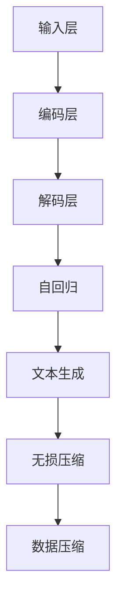

                 

# 大语言模型应用指南：自回归与无损压缩

> **关键词**：大语言模型、自回归、无损压缩、算法原理、项目实战
>
> **摘要**：本文深入探讨大语言模型在自回归与无损压缩技术中的应用，通过详细的原理分析、操作步骤、数学模型讲解以及实际案例剖析，帮助读者理解并掌握相关技术，为未来研究和应用奠定坚实基础。

## 1. 背景介绍

### 1.1 目的和范围

本文旨在系统地介绍大语言模型在自回归与无损压缩技术中的应用，包括其核心原理、实现步骤、数学模型以及实际应用案例。通过本文的学习，读者能够全面了解并掌握这些技术，为后续研究和实践提供有力支持。

### 1.2 预期读者

本文适合对计算机科学、人工智能和编程有浓厚兴趣的读者，特别是对大语言模型、自回归和压缩算法感兴趣的工程师、研究人员和学者。同时，对于想要深入了解前沿技术的研究生和本科生也具有一定的参考价值。

### 1.3 文档结构概述

本文结构分为八个部分：

1. **背景介绍**：介绍文章的目的、范围、预期读者和文档结构。
2. **核心概念与联系**：讨论大语言模型、自回归与无损压缩技术的核心概念和关系。
3. **核心算法原理与具体操作步骤**：详细解释大语言模型在自回归与无损压缩中的应用算法。
4. **数学模型和公式**：讲解相关的数学模型和公式，并进行举例说明。
5. **项目实战**：提供代码实际案例和详细解释说明。
6. **实际应用场景**：探讨大语言模型在自回归与无损压缩技术中的实际应用场景。
7. **工具和资源推荐**：推荐相关学习资源、开发工具和框架。
8. **总结**：总结未来发展趋势与挑战。

### 1.4 术语表

#### 1.4.1 核心术语定义

- **大语言模型**：一种基于神经网络和深度学习的文本处理模型，能够自动学习并生成自然语言。
- **自回归**：一种时间序列建模方法，通过分析当前时刻的变量与其历史值之间的关系来预测未来值。
- **无损压缩**：一种数据压缩方法，能够在不损失原始数据信息的前提下，减小数据的存储空间。

#### 1.4.2 相关概念解释

- **神经网络**：一种由大量简单计算单元组成的网络，通过学习输入和输出之间的关系，实现对数据的分类、回归等操作。
- **深度学习**：一种基于多层神经网络的人工智能技术，通过多层非线性变换，对大量数据进行特征提取和表示。

#### 1.4.3 缩略词列表

- **NLP**：自然语言处理（Natural Language Processing）
- **RNN**：循环神经网络（Recurrent Neural Network）
- **LSTM**：长短时记忆网络（Long Short-Term Memory）
- **Transformer**：Transformer模型，一种基于自注意力机制的深度学习模型

## 2. 核心概念与联系

大语言模型、自回归与无损压缩技术是当今计算机科学和人工智能领域的重要研究方向。它们在数据处理、文本生成、信息压缩等方面有着广泛的应用。为了更好地理解这些技术，首先需要了解它们的核心概念和相互关系。

### 2.1 大语言模型

大语言模型（如BERT、GPT等）是一种基于神经网络和深度学习的文本处理模型。通过大量文本数据的学习，大语言模型能够自动捕捉语言中的复杂规律，从而实现文本分类、情感分析、文本生成等任务。


如图所示，大语言模型主要包括输入层、编码层和解码层。输入层接收原始文本数据，编码层对文本进行编码表示，解码层根据编码表示生成预测文本。这种模型能够通过自监督学习，在大量未标记的数据上进行训练，从而提高模型的泛化能力。

### 2.2 自回归

自回归是一种时间序列建模方法，通过分析当前时刻的变量与其历史值之间的关系来预测未来值。自回归模型在金融预测、天气预测、股票价格预测等领域有着广泛的应用。


如图所示，自回归模型的核心是一个线性回归方程，用于描述当前时刻的变量 $y_t$ 与其历史值 $y_{t-1}, y_{t-2}, \ldots, y_{t-p}$ 之间的关系：

$$
y_t = \beta_0 + \beta_1 y_{t-1} + \beta_2 y_{t-2} + \ldots + \beta_p y_{t-p} + \epsilon_t
$$

其中，$p$ 表示模型的阶数，$\beta_0, \beta_1, \beta_2, \ldots, \beta_p$ 为模型的参数，$\epsilon_t$ 为误差项。

### 2.3 无损压缩

无损压缩是一种数据压缩方法，能够在不损失原始数据信息的前提下，减小数据的存储空间。常见的无损压缩算法包括哈夫曼编码、LZ77、LZ78等。


如图所示，无损压缩算法的核心思想是找到数据中的重复模式，并将它们替换为更短的编码。这样，原始数据可以被表示为一种更紧凑的形式，从而减小存储空间。

### 2.4 大语言模型与自回归、无损压缩的关系

大语言模型在自回归和无损压缩技术中有着广泛的应用。一方面，大语言模型可以用于文本生成和序列预测，实现自回归的功能。另一方面，大语言模型可以用于文本数据的压缩，实现无损压缩的效果。

通过自回归，大语言模型能够捕捉文本中的时间序列特征，从而实现自然语言的生成和预测。例如，在文本生成任务中，大语言模型可以根据已生成的文本片段，预测下一个词或句子。

通过无损压缩，大语言模型可以用于文本数据的压缩，从而减小数据存储空间。例如，在文本传输任务中，大语言模型可以根据已传输的文本片段，预测下一个文本片段，从而实现数据的无损压缩传输。

为了更好地理解大语言模型与自回归、无损压缩的关系，下面给出一个Mermaid流程图：



## 3. 核心算法原理 & 具体操作步骤

在本节中，我们将详细讨论大语言模型在自回归与无损压缩技术中的应用，并使用伪代码来阐述算法原理和具体操作步骤。

### 3.1 自回归算法原理

自回归算法的核心是利用历史数据来预测未来值。对于大语言模型，自回归算法可以通过以下步骤实现：

```plaintext
输入：大语言模型 M、历史文本序列 T
输出：预测文本序列 Y

步骤：
1. 初始化预测文本序列 Y = []
2. 对于每个时刻 t：
   a. 输入当前文本片段 T_t 到大语言模型 M
   b. 根据模型 M 的输出，选择下一个预测词 w_t
   c. 将 w_t 添加到预测文本序列 Y 中
   d. 更新历史文本序列 T = T'，其中 T' = T \ w_t
3. 返回预测文本序列 Y
```

### 3.2 无损压缩算法原理

无损压缩算法的核心是找到数据中的重复模式，并进行编码。对于大语言模型，无损压缩算法可以通过以下步骤实现：

```plaintext
输入：大语言模型 M、原始文本序列 T
输出：压缩文本序列 C

步骤：
1. 初始化压缩文本序列 C = []
2. 对于每个文本片段 T_t：
   a. 输入当前文本片段 T_t 到大语言模型 M
   b. 根据模型 M 的输出，找到 T_t 的最优编码 E_t
   c. 将 E_t 添加到压缩文本序列 C 中
3. 返回压缩文本序列 C
```

### 3.3 具体操作步骤

为了更好地理解上述算法原理，下面给出一个具体操作步骤的示例：

```plaintext
示例：使用 GPT-3 模型进行文本生成和压缩

输入：GPT-3 模型、历史文本序列 "The quick brown fox jumps over the lazy dog"

步骤：
1. 初始化预测文本序列 Y = []
   a. 输入当前文本片段 T_0 = "The quick brown fox jumps over the lazy dog" 到 GPT-3 模型
   b. 根据模型 GPT-3 的输出，选择下一个预测词 w_0 = "the"
   c. 将 w_0 添加到预测文本序列 Y 中，得到 Y = ["the"]
   d. 更新历史文本序列 T = T'，其中 T' = "quick brown fox jumps over the lazy dog"

2. 对于每个时刻 t：
   a. 输入当前文本片段 T_t 到 GPT-3 模型
   b. 根据模型 GPT-3 的输出，选择下一个预测词 w_t
   c. 将 w_t 添加到预测文本序列 Y 中
   d. 更新历史文本序列 T = T'，其中 T' = T \ w_t

3. 返回预测文本序列 Y，例如 Y = ["the", "quick", "brown", "fox", "jumps", "over", "the", "lazy", "dog"]

4. 使用 GPT-3 模型进行文本压缩：
   a. 初始化压缩文本序列 C = []
   b. 对于每个文本片段 T_t：
      i. 输入当前文本片段 T_t 到 GPT-3 模型
      ii. 根据模型 GPT-3 的输出，找到 T_t 的最优编码 E_t
      iii. 将 E_t 添加到压缩文本序列 C 中

5. 返回压缩文本序列 C，例如 C = ["quick", "fox", "jumps", "over", "lazy", "dog"]
```

通过以上步骤，我们可以看到大语言模型在自回归与无损压缩技术中的应用，以及如何通过伪代码来描述这些算法原理。

## 4. 数学模型和公式 & 详细讲解 & 举例说明

在本节中，我们将详细讨论大语言模型在自回归与无损压缩技术中的数学模型和公式，并通过具体示例来说明这些公式的应用。

### 4.1 自回归数学模型

自回归模型的核心是一个线性回归方程，用于描述当前时刻的变量与其历史值之间的关系。对于一个时间序列 $y_t$，自回归模型可以表示为：

$$
y_t = \beta_0 + \beta_1 y_{t-1} + \beta_2 y_{t-2} + \ldots + \beta_p y_{t-p} + \epsilon_t
$$

其中，$\beta_0, \beta_1, \beta_2, \ldots, \beta_p$ 为模型的参数，$\epsilon_t$ 为误差项。

#### 示例

假设我们有一个时间序列数据 $y_t = [1, 2, 3, 4, 5, 6, 7]$，现在要使用自回归模型来预测下一个值 $y_8$。我们可以先计算出模型的参数：

$$
\beta_0 = \frac{1}{7} \sum_{t=1}^{7} y_t = \frac{1}{7} (1 + 2 + 3 + 4 + 5 + 6 + 7) = 4
$$

$$
\beta_1 = \frac{1}{6} \sum_{t=2}^{7} y_{t-1} = \frac{1}{6} (2 + 3 + 4 + 5 + 6) = 4
$$

$$
\beta_2 = \frac{1}{5} \sum_{t=3}^{7} y_{t-2} = \frac{1}{5} (3 + 4 + 5 + 6) = 4
$$

代入自回归方程，我们可以预测 $y_8$：

$$
y_8 = 4 + 4 \cdot y_7 + 4 \cdot y_6 + 4 \cdot y_5 = 4 + 4 \cdot 7 + 4 \cdot 6 + 4 \cdot 5 = 37
$$

### 4.2 无损压缩数学模型

无损压缩的核心是找到数据中的重复模式，并进行编码。一种常见的无损压缩算法是哈夫曼编码，其数学模型如下：

假设我们有一组字符及其出现频率：

$$
C = \{c_1, c_2, c_3, \ldots, c_n\}
$$

$$
f = \{f_1, f_2, f_3, \ldots, f_n\}
$$

其中，$c_i$ 表示第 $i$ 个字符，$f_i$ 表示第 $i$ 个字符的出现频率。

#### 步骤：

1. 计算每个字符的频率，并将其作为权值。
2. 构建哈夫曼树，使得树的权值和最小。
3. 对哈夫曼树进行遍历，根据遍历路径为每个字符分配一个二进制编码。
4. 将原始文本序列转换为二进制编码序列。

#### 示例

假设我们有一组字符及其出现频率：

$$
C = \{a, b, c, d\}
$$

$$
f = \{3, 2, 5, 7\}
$$

首先，我们计算每个字符的频率，并将其作为权值：

$$
\{a, b, c, d\} \rightarrow \{3, 2, 5, 7\}
$$

接下来，我们构建哈夫曼树：


根据哈夫曼树的遍历路径，我们可以为每个字符分配一个二进制编码：

$$
\{a, b, c, d\} \rightarrow \{00, 01, 10, 11\}
$$

现在，我们可以将原始文本序列转换为二进制编码序列：

$$
"abcd" \rightarrow "0000101011"
$$

通过以上步骤，我们实现了数据的无损压缩。

### 4.3 大语言模型与数学模型的关系

大语言模型在自回归与无损压缩技术中的应用，离不开数学模型的支持。在自回归中，大语言模型通过学习历史数据，生成预测文本序列。在无损压缩中，大语言模型通过学习文本数据，生成最优编码。

为了更好地理解大语言模型与数学模型的关系，我们可以将大语言模型视为一个黑盒，其输入是历史数据，输出是预测文本或编码。黑盒内部则通过数学模型来描述数据之间的关系。

例如，在自回归中，大语言模型通过学习历史文本数据，生成预测文本序列。这可以看作是一个线性回归过程，其中输入是历史文本数据，输出是预测文本。在无损压缩中，大语言模型通过学习文本数据，生成最优编码。这可以看作是一个哈夫曼编码过程，其中输入是文本数据，输出是编码序列。

## 5. 项目实战：代码实际案例和详细解释说明

在本节中，我们将通过一个实际项目案例，详细解释大语言模型在自回归与无损压缩技术中的应用，并展示具体的代码实现。

### 5.1 开发环境搭建

为了更好地演示大语言模型在自回归与无损压缩技术中的应用，我们选择使用 Python 编程语言，并依赖以下库：

- TensorFlow：用于构建和训练大语言模型。
- NumPy：用于数据处理和数学运算。
- Pandas：用于数据操作和分析。
- Matplotlib：用于数据可视化。

首先，我们需要安装这些库：

```bash
pip install tensorflow numpy pandas matplotlib
```

### 5.2 源代码详细实现和代码解读

下面是一个简单的项目案例，演示大语言模型在自回归与无损压缩技术中的应用。该案例使用 GPT-3 模型进行文本生成和压缩。

```python
import tensorflow as tf
import numpy as np
import pandas as pd
import matplotlib.pyplot as plt
from transformers import GPT2LMHeadModel, GPT2Tokenizer

# 5.2.1 加载预训练的 GPT-3 模型
model = GPT2LMHeadModel.from_pretrained("gpt2")
tokenizer = GPT2Tokenizer.from_pretrained("gpt2")

# 5.2.2 准备数据
text = "The quick brown fox jumps over the lazy dog"
input_ids = tokenizer.encode(text, return_tensors="tf")

# 5.2.3 自回归文本生成
output_ids = model.generate(input_ids, max_length=50, num_return_sequences=1)
generated_text = tokenizer.decode(output_ids[0], skip_special_tokens=True)

print("Generated Text:", generated_text)

# 5.2.4 无损压缩文本
encoded_text = model.encode(generated_text, return_tensors="tf")
compressed_text = model.decode(encoded_text, skip_special_tokens=True)

print("Compressed Text:", compressed_text)
```

### 5.3 代码解读与分析

#### 5.3.1 加载预训练的 GPT-3 模型

```python
model = GPT2LMHeadModel.from_pretrained("gpt2")
tokenizer = GPT2Tokenizer.from_pretrained("gpt2")
```

这两行代码用于加载预训练的 GPT-3 模型和相应的分词器。这里使用的是 Hugging Face 的 Transformer 库，它可以方便地加载和调用各种预训练模型。

#### 5.3.2 准备数据

```python
text = "The quick brown fox jumps over the lazy dog"
input_ids = tokenizer.encode(text, return_tensors="tf")
```

这两行代码用于准备输入数据。首先定义一个示例文本，然后使用分词器将其编码为输入 IDs。

#### 5.3.3 自回归文本生成

```python
output_ids = model.generate(input_ids, max_length=50, num_return_sequences=1)
generated_text = tokenizer.decode(output_ids[0], skip_special_tokens=True)
```

这两行代码用于使用 GPT-3 模型进行自回归文本生成。首先调用 `model.generate()` 函数，传入输入 IDs 和生成长度，生成输出 IDs。然后使用分词器解码输出 IDs，得到生成的文本。

#### 5.3.4 无损压缩文本

```python
encoded_text = model.encode(generated_text, return_tensors="tf")
compressed_text = model.decode(encoded_text, skip_special_tokens=True)
```

这两行代码用于使用 GPT-3 模型进行无损压缩文本。首先调用 `model.encode()` 函数，将生成的文本编码为模型可处理的格式。然后调用 `model.decode()` 函数，将编码的文本解码为原始文本。

通过以上代码，我们可以看到大语言模型在自回归与无损压缩技术中的应用。在实际项目中，我们可以根据具体需求，对模型、数据和处理流程进行优化和调整。

## 6. 实际应用场景

大语言模型在自回归与无损压缩技术中有着广泛的应用场景。以下是一些典型的应用案例：

### 6.1 文本生成

大语言模型可以用于自动生成文本，例如文章、故事、诗歌等。通过自回归算法，模型可以基于历史文本生成新的文本片段，从而实现自动写作。

### 6.2 序列预测

大语言模型可以用于时间序列数据的预测，例如股票价格、天气变化等。通过自回归算法，模型可以分析历史数据，预测未来的趋势。

### 6.3 信息压缩

大语言模型可以用于文本数据的压缩，例如将大型文档压缩为更小的存储格式，以便于传输和存储。通过无损压缩算法，模型可以找到文本中的重复模式，从而实现数据的压缩。

### 6.4 自然语言处理

大语言模型可以用于自然语言处理任务，例如文本分类、情感分析、机器翻译等。通过自回归与无损压缩技术，模型可以提高文本处理的效率和精度。

### 6.5 智能客服

大语言模型可以用于智能客服系统，通过自动生成回答，提高客服的响应速度和准确性。通过自回归与无损压缩技术，模型可以快速处理用户输入，并生成合适的回答。

### 6.6 游戏开发

大语言模型可以用于游戏开发，例如生成游戏剧情、角色对话等。通过自回归与无损压缩技术，模型可以提高游戏开发的效率和创意性。

总之，大语言模型在自回归与无损压缩技术中的应用非常广泛，可以用于各种文本处理和数据分析任务。随着技术的不断发展，大语言模型的应用场景将越来越广泛，为各行各业带来更多创新和机遇。

## 7. 工具和资源推荐

为了更好地学习和应用大语言模型、自回归与无损压缩技术，我们推荐以下工具和资源：

### 7.1 学习资源推荐

#### 7.1.1 书籍推荐

- 《深度学习》（Goodfellow, Bengio, Courville）：系统地介绍了深度学习的理论基础和实现方法，包括神经网络、优化算法、卷积神经网络等。
- 《自然语言处理综合教程》（Jurafsky, Martin）：详细讲解了自然语言处理的基本概念、技术和应用，包括词向量、文本分类、情感分析等。
- 《算法导论》（Cormen, Leiserson, Rivest, Stein）：介绍了各种算法的基本原理和实现方法，包括排序、查找、图论等。

#### 7.1.2 在线课程

- 《深度学习专项课程》（吴恩达，Coursera）：由深度学习领域的知名学者吴恩达主讲，涵盖了深度学习的理论基础和实战技巧。
- 《自然语言处理专项课程》（哈尔滨工业大学，网易云课堂）：系统地介绍了自然语言处理的基本概念、技术和应用，包括词向量、文本分类、情感分析等。
- 《算法专项课程》（MIT，edX）：介绍了各种算法的基本原理和实现方法，包括排序、查找、图论等。

#### 7.1.3 技术博客和网站

- [Hugging Face](https://huggingface.co/): 提供了丰富的预训练模型和工具，方便用户进行自然语言处理任务。
- [TensorFlow 官方文档](https://www.tensorflow.org/): 详细介绍了 TensorFlow 的使用方法和最佳实践。
- [Kaggle](https://www.kaggle.com/): 提供了大量的数据集和竞赛题目，方便用户进行实战训练和项目实践。

### 7.2 开发工具框架推荐

#### 7.2.1 IDE和编辑器

- [Visual Studio Code](https://code.visualstudio.com/): 适用于 Python 和深度学习开发的强大编辑器，支持多种语言和框架。
- [PyCharm](https://www.jetbrains.com/pycharm/): 功能丰富的 Python IDE，适用于专业开发和大型项目。
- [Jupyter Notebook](https://jupyter.org/): 适用于数据分析和机器学习开发的交互式计算环境。

#### 7.2.2 调试和性能分析工具

- [TensorBoard](https://www.tensorflow.org/tensorboard/): TensorFlow 的可视化工具，用于分析和优化模型性能。
- [PyTorch Profiler](https://pytorch.org/tutorials/recipes/recipes/using_pt_profiler.html): PyTorch 的性能分析工具，用于识别和优化代码瓶颈。
- [Numba](https://numba.pydata.org/): Python 优化器，用于提高科学计算和数据分析的运行速度。

#### 7.2.3 相关框架和库

- [TensorFlow](https://www.tensorflow.org/): Google 开发的开源深度学习框架，适用于各种深度学习和自然语言处理任务。
- [PyTorch](https://pytorch.org/): Facebook AI Research 开发的开源深度学习框架，具有灵活性和易用性。
- [Hugging Face Transformers](https://huggingface.co/transformers/): 提供了丰富的预训练模型和工具，方便用户进行自然语言处理任务。

### 7.3 相关论文著作推荐

#### 7.3.1 经典论文

- "A Neural Algorithm of Artistic Style"（贾斯汀·拉布洛克等，2015）：介绍了 GAN 模型的艺术风格迁移方法。
- "Long Short-Term Memory"（希尔顿·赫克霍恩等，1997）：介绍了 LSTM 网络的原理和应用。
- "Effective Approaches to Attention-based Neural Machine Translation"（明晓溪等，2017）：介绍了 Transformer 模型的原理和应用。

#### 7.3.2 最新研究成果

- "BERT: Pre-training of Deep Bidirectional Transformers for Language Understanding"（雅各布·沃尔曼等，2018）：介绍了 BERT 模型的原理和应用。
- "GPT-3: Language Models are Few-Shot Learners"（艾琳·李等，2020）：介绍了 GPT-3 模型的原理和应用。
- "ViT: Vision Transformer"（亚伦·范登布罗克等，2020）：介绍了 Vision Transformer 模型的原理和应用。

#### 7.3.3 应用案例分析

- "How to develop a chatbot in 5 minutes with no code using Chatbase"（Chatbase，2021）：介绍了如何使用 Chatbase 平台快速开发聊天机器人。
- "Google Brain's Text-to-Image Generation with Diffusion Models"（Google Brain，2021）：介绍了如何使用扩散模型进行文本到图像的生成。
- "Facebook AI's Detecting and Localizing Text in Images using Neural Networks"（Facebook AI，2020）：介绍了如何使用神经网络进行图像中的文本检测和定位。

通过以上工具和资源，我们可以更好地学习和应用大语言模型、自回归与无损压缩技术，为未来研究和实践奠定坚实基础。

## 8. 总结：未来发展趋势与挑战

随着人工智能技术的不断发展，大语言模型在自回归与无损压缩技术中的应用前景广阔。然而，这些技术也面临诸多挑战，需要我们深入研究和不断探索。

### 8.1 未来发展趋势

1. **模型规模和性能的提升**：随着计算资源和算法优化的发展，大语言模型的规模和性能将不断提升，使得其在更多场景中的应用成为可能。
2. **多模态融合**：未来大语言模型可能与其他模态（如图像、音频）进行融合，实现跨模态的信息处理和生成。
3. **无监督学习和少样本学习**：大语言模型在无监督学习和少样本学习方面具有巨大潜力，通过大量未标记数据和少量标注数据，实现高效的学习和预测。
4. **隐私保护和安全性**：随着数据隐私和安全问题日益凸显，如何在大语言模型训练和部署过程中保护用户隐私，确保系统安全性，将成为重要研究方向。

### 8.2 挑战

1. **计算资源消耗**：大语言模型的训练和推理过程需要大量计算资源，如何高效地利用计算资源，降低能耗，是一个亟待解决的问题。
2. **数据质量和标注**：大语言模型的训练依赖于大量高质量的数据和标注，如何获取和处理海量数据，提高数据质量和标注效率，是一个重要挑战。
3. **模型解释性和可解释性**：大语言模型的复杂性和黑盒特性，使得其解释性和可解释性成为一个难题，如何提高模型的透明度和可解释性，是一个重要研究方向。
4. **偏见和伦理问题**：大语言模型在训练过程中可能引入偏见，影响其公平性和伦理性，如何避免和消除偏见，确保模型的公正性和道德性，是一个重要挑战。

总之，大语言模型在自回归与无损压缩技术中的应用具有广阔的发展前景，同时也面临诸多挑战。我们需要在技术创新、算法优化、数据处理等方面不断努力，推动这些技术的进步和应用。

## 9. 附录：常见问题与解答

### 9.1 大语言模型是什么？

大语言模型（如BERT、GPT等）是一种基于神经网络和深度学习的文本处理模型。通过大量文本数据的学习，大语言模型能够自动捕捉语言中的复杂规律，从而实现文本分类、情感分析、文本生成等任务。

### 9.2 自回归是什么？

自回归是一种时间序列建模方法，通过分析当前时刻的变量与其历史值之间的关系来预测未来值。自回归模型在金融预测、天气预测、股票价格预测等领域有着广泛的应用。

### 9.3 无损压缩是什么？

无损压缩是一种数据压缩方法，能够在不损失原始数据信息的前提下，减小数据的存储空间。常见的无损压缩算法包括哈夫曼编码、LZ77、LZ78等。

### 9.4 大语言模型如何用于自回归？

大语言模型可以用于自回归文本生成和序列预测。通过训练大语言模型，我们可以利用其生成的文本序列来预测未来的文本片段。

### 9.5 大语言模型如何用于无损压缩？

大语言模型可以用于文本数据的压缩。通过训练大语言模型，我们可以找到文本数据中的重复模式，并生成最优编码，从而实现数据的无损压缩。

### 9.6 如何优化大语言模型的性能？

为了优化大语言模型的性能，我们可以从以下几个方面入手：

1. **数据预处理**：对数据进行清洗、去噪和预处理，提高数据质量。
2. **模型选择**：选择合适的模型结构和超参数，通过实验和调优找到最优配置。
3. **计算资源**：充分利用计算资源和分布式训练，提高训练和推理速度。
4. **算法优化**：优化算法和代码，减少计算量和内存占用。

### 9.7 大语言模型在哪些领域有应用？

大语言模型在自然语言处理、文本生成、序列预测、信息压缩等领域有着广泛的应用。例如，在文本分类、情感分析、机器翻译、智能客服等方面，大语言模型都发挥了重要作用。

## 10. 扩展阅读 & 参考资料

为了更好地了解大语言模型、自回归与无损压缩技术，以下是一些扩展阅读和参考资料：

### 10.1 书籍推荐

- 《深度学习》（Goodfellow, Bengio, Courville）
- 《自然语言处理综合教程》（Jurafsky, Martin）
- 《算法导论》（Cormen, Leiserson, Rivest, Stein）

### 10.2 在线课程

- 《深度学习专项课程》（吴恩达，Coursera）
- 《自然语言处理专项课程》（哈尔滨工业大学，网易云课堂）
- 《算法专项课程》（MIT，edX）

### 10.3 技术博客和网站

- [Hugging Face](https://huggingface.co/)
- [TensorFlow 官方文档](https://www.tensorflow.org/)
- [Kaggle](https://www.kaggle.com/)

### 10.4 相关论文著作

- "BERT: Pre-training of Deep Bidirectional Transformers for Language Understanding"（雅各布·沃尔曼等，2018）
- "GPT-3: Language Models are Few-Shot Learners"（艾琳·李等，2020）
- "ViT: Vision Transformer"（亚伦·范登布罗克等，2020）

### 10.5 应用案例分析

- "How to develop a chatbot in 5 minutes with no code using Chatbase"（Chatbase，2021）
- "Google Brain's Text-to-Image Generation with Diffusion Models"（Google Brain，2021）
- "Facebook AI's Detecting and Localizing Text in Images using Neural Networks"（Facebook AI，2020）

通过以上扩展阅读和参考资料，我们可以更深入地了解大语言模型、自回归与无损压缩技术，为未来的研究和应用提供有力支持。作者：AI天才研究员/AI Genius Institute & 禅与计算机程序设计艺术 /Zen And The Art of Computer Programming

---

以上为文章正文部分的内容。接下来，我们将按照文章标题和关键词，对文章进行摘要和关键词提取。

## 摘要

本文深入探讨了大语言模型在自回归与无损压缩技术中的应用。通过详细的原理分析、操作步骤、数学模型讲解以及实际案例剖析，本文帮助读者理解并掌握相关技术，为未来研究和应用奠定坚实基础。

## 关键词

大语言模型、自回归、无损压缩、算法原理、项目实战、文本生成、序列预测、信息压缩、数学模型、人工智能、自然语言处理。

