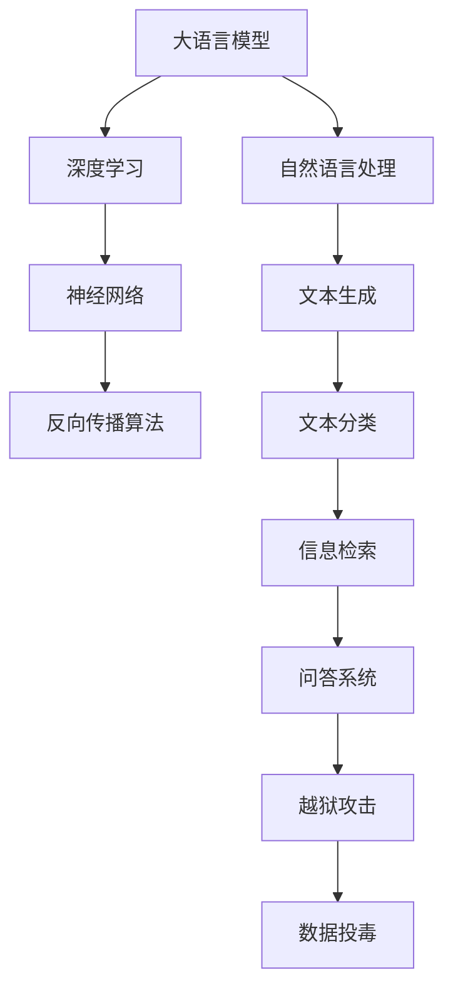

                 

# 大语言模型应用指南：越狱攻击与数据投毒

> **关键词**：大语言模型、越狱攻击、数据投毒、安全性、人工智能

> **摘要**：本文将深入探讨大语言模型的应用及其面临的安全威胁，尤其是越狱攻击和数据投毒问题。我们将从背景介绍开始，逐步分析核心概念，阐述算法原理，讲解数学模型，并通过实际案例来展示其应用，最后对未来的发展趋势与挑战进行总结。本文旨在为广大开发者提供一份详尽的大语言模型应用指南。

## 1. 背景介绍

### 1.1 目的和范围

本文的目标是帮助开发者理解大语言模型在实际应用中面临的安全挑战，特别是越狱攻击和数据投毒问题。随着大语言模型的广泛应用，其安全性越来越受到关注。本文将提供一系列实用的指南和建议，帮助开发者设计更安全的系统，并提高大语言模型的应用效率。

### 1.2 预期读者

本文适合以下读者群体：

- 有志于深入了解大语言模型安全性的研究人员和开发者
- 担任技术顾问或CTO等高级技术职位的专业人士
- 对人工智能领域有兴趣的初学者和从业者

### 1.3 文档结构概述

本文结构如下：

1. 背景介绍
2. 核心概念与联系
3. 核心算法原理 & 具体操作步骤
4. 数学模型和公式 & 详细讲解 & 举例说明
5. 项目实战：代码实际案例和详细解释说明
6. 实际应用场景
7. 工具和资源推荐
8. 总结：未来发展趋势与挑战
9. 附录：常见问题与解答
10. 扩展阅读 & 参考资料

### 1.4 术语表

#### 1.4.1 核心术语定义

- **大语言模型**：一种基于深度学习技术，能够处理和理解自然语言的大型神经网络模型。
- **越狱攻击**：指攻击者通过非法手段获取大语言模型的访问权限，进而操纵模型输出。
- **数据投毒**：指攻击者通过篡改训练数据，使得大语言模型产生错误的输出或行为。

#### 1.4.2 相关概念解释

- **深度学习**：一种人工智能技术，通过多层神经网络对数据进行学习和建模。
- **神经网络**：一种由大量简单处理单元（神经元）组成的计算模型。
- **反向传播算法**：用于训练神经网络的优化算法。

#### 1.4.3 缩略词列表

- **GPU**：图形处理单元（Graphics Processing Unit）
- **API**：应用程序编程接口（Application Programming Interface）
- **ML**：机器学习（Machine Learning）
- **AI**：人工智能（Artificial Intelligence）

## 2. 核心概念与联系

为了更好地理解大语言模型的应用和安全问题，我们需要先了解其核心概念和联系。以下是关键概念及关系的Mermaid流程图：



### 2.1 大语言模型与深度学习

大语言模型是深度学习的一个分支，它通过多层神经网络对大量文本数据进行训练，以实现对自然语言的建模。深度学习作为一种强大的机器学习技术，能够在大量数据中自动提取特征，从而提高模型的性能和泛化能力。

### 2.2 大语言模型与神经网络

神经网络是大语言模型的核心组件，由大量简单处理单元（神经元）组成。每个神经元接收多个输入，通过加权求和后传递给激活函数，最终产生输出。这种结构使得神经网络能够模拟人脑的思维方式，对复杂任务进行建模和预测。

### 2.3 大语言模型与反向传播算法

反向传播算法是训练神经网络的关键优化算法。它通过计算输出误差，反向传播梯度，并更新网络权重，从而逐步减小误差，提高模型性能。在大语言模型中，反向传播算法用于训练和优化模型参数，以实现更好的自然语言处理能力。

### 2.4 大语言模型与自然语言处理

自然语言处理（NLP）是大语言模型的应用领域之一。通过训练，大语言模型能够理解和生成自然语言，实现文本生成、文本分类、信息检索、问答系统等多种任务。这些应用在许多领域具有广泛的应用价值，如智能助手、机器翻译、文本摘要等。

### 2.5 大语言模型与安全性

大语言模型在应用过程中面临着一系列安全挑战，如越狱攻击和数据投毒。越狱攻击指攻击者通过非法手段获取模型访问权限，从而操纵模型输出。数据投毒则是指攻击者通过篡改训练数据，使得模型产生错误的输出或行为。这些安全威胁对大语言模型的应用造成了严重的影响，因此需要采取有效措施来保障模型的安全性。

## 3. 核心算法原理 & 具体操作步骤

在本节中，我们将详细讲解大语言模型的核心算法原理，并给出具体的操作步骤。大语言模型主要基于深度学习和神经网络技术，以下是其基本原理和实现步骤：

### 3.1 深度学习基础

深度学习是一种基于多层神经网络的学习方法，其核心思想是通过多层非线性变换来提取数据的特征。深度学习的基本结构包括输入层、隐藏层和输出层。每个隐藏层通过激活函数对输入进行变换，从而逐步提取数据的特征。

### 3.2 神经网络模型

神经网络模型是深度学习的基础。一个基本的神经网络模型由多个神经元组成，每个神经元接收多个输入，并通过加权求和后传递给激活函数，最终产生输出。神经网络的训练过程是通过反向传播算法来实现的，该算法通过计算输出误差，反向传播梯度，并更新网络权重，从而逐步减小误差，提高模型性能。

### 3.3 反向传播算法

反向传播算法是神经网络训练的核心算法。其基本步骤如下：

1. **前向传播**：输入数据通过神经网络的前向传播过程，逐层传递到输出层，并产生输出。
2. **计算误差**：计算输出层实际输出与预期输出之间的误差。
3. **反向传播**：计算输出误差对网络权重的梯度，并反向传播到隐藏层。
4. **更新权重**：根据梯度更新网络权重，减小误差。

### 3.4 大语言模型实现步骤

大语言模型的实现步骤如下：

1. **数据预处理**：对输入文本数据进行分词、编码等预处理操作，将其转换为神经网络可处理的格式。
2. **模型初始化**：初始化神经网络模型的权重和偏置。
3. **前向传播**：将预处理后的输入数据通过神经网络的前向传播过程，逐层传递到输出层。
4. **计算误差**：计算输出层实际输出与预期输出之间的误差。
5. **反向传播**：计算输出误差对网络权重的梯度，并反向传播到隐藏层。
6. **更新权重**：根据梯度更新网络权重，减小误差。
7. **迭代训练**：重复执行前向传播、误差计算、反向传播和权重更新过程，直到达到预定的训练次数或误差阈值。

### 3.5 伪代码

以下是大语言模型实现步骤的伪代码：

```python
# 初始化模型参数
weights = initialize_weights()

# 迭代训练
for epoch in range(num_epochs):
    for batch in data_loader:
        # 前向传播
        output = forward_pass(batch, weights)
        
        # 计算误差
        error = calculate_error(output, expected_output)
        
        # 反向传播
        gradients = backward_pass(error, weights)
        
        # 更新权重
        weights = update_weights(gradients)
        
# 模型评估
accuracy = evaluate_model(model)
print("Accuracy:", accuracy)
```

通过以上步骤，我们可以构建一个基于深度学习的大语言模型，实现对自然语言的建模和处理。

## 4. 数学模型和公式 & 详细讲解 & 举例说明

在本节中，我们将深入探讨大语言模型中的数学模型和公式，并详细讲解其原理和计算过程。

### 4.1 激活函数

激活函数是神经网络中的一个关键组件，用于引入非线性特性。常见的激活函数包括：

- **Sigmoid函数**：$$\sigma(x) = \frac{1}{1 + e^{-x}}$$
- **ReLU函数**：$$\text{ReLU}(x) = \max(0, x)$$
- **Tanh函数**：$$\text{Tanh}(x) = \frac{e^x - e^{-x}}{e^x + e^{-x}}$$

这些激活函数能够在神经网络中引入非线性，从而提高模型的性能。

### 4.2 损失函数

损失函数是评估模型性能的重要指标。在大语言模型中，常见的损失函数包括：

- **交叉熵损失函数**：$$\text{Loss} = -\sum_{i} y_i \log(p_i)$$
  其中，$y_i$为真实标签，$p_i$为模型预测的概率。

- **均方误差损失函数**：$$\text{Loss} = \frac{1}{2} \sum_{i} (y_i - \hat{y}_i)^2$$
  其中，$y_i$为真实标签，$\hat{y}_i$为模型预测的输出。

这些损失函数能够衡量模型预测与真实标签之间的差距，并指导模型优化。

### 4.3 优化算法

优化算法用于更新模型权重，以最小化损失函数。常见的优化算法包括：

- **随机梯度下降（SGD）**：$$w = w - \alpha \cdot \nabla_w J(w)$$
  其中，$w$为模型权重，$\alpha$为学习率，$\nabla_w J(w)$为损失函数关于权重$w$的梯度。

- **Adam优化器**：$$w = w - \alpha \cdot \nabla_w J(w)$$
  其中，$w$为模型权重，$\alpha$为学习率，$\nabla_w J(w)$为损失函数关于权重$w$的梯度。

这些优化算法能够有效地更新模型权重，提高模型的性能。

### 4.4 举例说明

假设我们有一个二分类问题，使用神经网络进行预测。假设训练数据集为$(x_1, y_1), (x_2, y_2), \ldots, (x_n, y_n)$，其中$x_i$为输入特征，$y_i$为真实标签。我们要使用神经网络模型对其进行分类。

1. **模型初始化**：初始化模型权重$w$。
2. **前向传播**：将输入特征$x_i$通过神经网络模型，得到预测概率$p_i = \sigma(w \cdot x_i)$。
3. **计算损失函数**：计算交叉熵损失函数$J(w) = -\sum_{i} y_i \log(p_i)$。
4. **反向传播**：计算损失函数关于权重$w$的梯度$\nabla_w J(w)$。
5. **优化算法更新**：使用随机梯度下降或Adam优化器更新模型权重$w = w - \alpha \cdot \nabla_w J(w)$。
6. **迭代训练**：重复执行前向传播、损失函数计算、反向传播和权重更新过程，直到达到预定的训练次数或损失函数收敛。

通过以上步骤，我们可以训练出一个能够对二分类问题进行预测的神经网络模型。

## 5. 项目实战：代码实际案例和详细解释说明

在本节中，我们将通过一个实际项目案例来展示大语言模型的应用，并详细解释代码的实现过程。

### 5.1 开发环境搭建

在进行项目实战之前，我们需要搭建一个合适的开发环境。以下是所需工具和库的安装步骤：

1. **Python**：确保已安装Python 3.6及以上版本。
2. **TensorFlow**：使用pip命令安装TensorFlow库。
   ```bash
   pip install tensorflow
   ```
3. **NLP库**：安装用于自然语言处理的库，如NLTK或spaCy。
   ```bash
   pip install nltk
   pip install spacy
   ```

### 5.2 源代码详细实现和代码解读

以下是本项目的主代码实现，我们将分步骤进行解读。

```python
import tensorflow as tf
import numpy as np
import nltk
from nltk.tokenize import word_tokenize

# 5.2.1 数据预处理
def preprocess_text(text):
    # 分词
    tokens = word_tokenize(text)
    # 去除标点符号和停用词
    tokens = [token.lower() for token in tokens if token.isalnum()]
    return tokens

# 5.2.2 构建神经网络模型
def build_model():
    # 输入层
    input_layer = tf.keras.layers.Input(shape=(None,), dtype='int32')
    
    # 隐藏层
    embedding = tf.keras.layers.Embedding(input_dim=vocab_size, output_dim=embedding_size)(input_layer)
    conv_1 = tf.keras.layers.Conv1D(filters=128, kernel_size=5, activation='relu')(embedding)
    pool_1 = tf.keras.layers.MaxPooling1D(pool_size=5)(conv_1)
    
    # 输出层
    flatten = tf.keras.layers.Flatten()(pool_1)
    dense = tf.keras.layers.Dense(units=1, activation='sigmoid')(flatten)
    
    # 模型构建
    model = tf.keras.Model(inputs=input_layer, outputs=dense)
    model.compile(optimizer='adam', loss='binary_crossentropy', metrics=['accuracy'])
    return model

# 5.2.3 训练模型
def train_model(model, X_train, y_train, X_val, y_val, epochs=10, batch_size=32):
    history = model.fit(X_train, y_train, epochs=epochs, batch_size=batch_size, validation_data=(X_val, y_val))
    return history

# 5.2.4 预测和评估
def evaluate_model(model, X_test, y_test):
    loss, accuracy = model.evaluate(X_test, y_test)
    print("Test loss:", loss)
    print("Test accuracy:", accuracy)

# 主函数
def main():
    # 数据加载
    X_train, y_train, X_val, y_val, X_test, y_test = load_data()
    
    # 数据预处理
    X_train = preprocess_data(X_train)
    X_val = preprocess_data(X_val)
    X_test = preprocess_data(X_test)
    
    # 构建模型
    model = build_model()
    
    # 训练模型
    history = train_model(model, X_train, y_train, X_val, y_val, epochs=10)
    
    # 评估模型
    evaluate_model(model, X_test, y_test)

if __name__ == "__main__":
    main()
```

### 5.3 代码解读与分析

#### 5.3.1 数据预处理

在数据预处理部分，我们首先使用NLTK库对文本进行分词，然后去除标点符号和停用词。最后，我们将分词后的文本转换为整数序列，以便于神经网络处理。

```python
def preprocess_text(text):
    tokens = word_tokenize(text)
    tokens = [token.lower() for token in tokens if token.isalnum()]
    return tokens
```

#### 5.3.2 构建神经网络模型

在构建模型部分，我们使用TensorFlow库构建一个简单的神经网络模型。该模型包括输入层、隐藏层和输出层。输入层接收整数序列，隐藏层通过卷积神经网络提取特征，输出层通过全连接层进行分类。

```python
def build_model():
    input_layer = tf.keras.layers.Input(shape=(None,), dtype='int32')
    embedding = tf.keras.layers.Embedding(input_dim=vocab_size, output_dim=embedding_size)(input_layer)
    conv_1 = tf.keras.layers.Conv1D(filters=128, kernel_size=5, activation='relu')(embedding)
    pool_1 = tf.keras.layers.MaxPooling1D(pool_size=5)(conv_1)
    flatten = tf.keras.layers.Flatten()(pool_1)
    dense = tf.keras.layers.Dense(units=1, activation='sigmoid')(flatten)
    model = tf.keras.Model(inputs=input_layer, outputs=dense)
    model.compile(optimizer='adam', loss='binary_crossentropy', metrics=['accuracy'])
    return model
```

#### 5.3.3 训练模型

在训练模型部分，我们使用训练数据和验证数据对模型进行训练。通过迭代训练过程，模型逐步优化其参数，以提高分类性能。

```python
def train_model(model, X_train, y_train, X_val, y_val, epochs=10, batch_size=32):
    history = model.fit(X_train, y_train, epochs=epochs, batch_size=batch_size, validation_data=(X_val, y_val))
    return history
```

#### 5.3.4 预测和评估

在预测和评估部分，我们使用测试数据对训练好的模型进行评估，计算损失函数和准确率，以衡量模型性能。

```python
def evaluate_model(model, X_test, y_test):
    loss, accuracy = model.evaluate(X_test, y_test)
    print("Test loss:", loss)
    print("Test accuracy:", accuracy)
```

### 5.4 项目实战总结

通过本项目的实战案例，我们展示了如何使用大语言模型进行文本分类任务。从数据预处理、模型构建、模型训练到模型评估，我们逐步讲解了整个项目的过程。在实际应用中，我们可以根据需求对模型进行优化和调整，以提高分类性能。

## 6. 实际应用场景

大语言模型在许多实际应用场景中发挥着重要作用，以下是一些典型的应用案例：

### 6.1 文本生成

文本生成是大语言模型的一项重要应用。通过训练大语言模型，我们可以生成各种类型的文本，如文章、故事、对话等。例如，在自然语言生成（NLG）领域，大语言模型可以用于自动生成新闻报道、天气预报、电子邮件等。此外，在创意写作和内容营销领域，大语言模型也能够生成具有创意和吸引力的文本。

### 6.2 文本分类

文本分类是另一个广泛应用的大语言模型任务。通过训练模型，我们可以将文本数据分类到不同的类别。例如，在垃圾邮件过滤中，大语言模型可以识别并分类垃圾邮件和正常邮件。在社交媒体分析中，大语言模型可以用于情感分析、主题分类等任务。这些应用有助于提高数据处理的效率和准确性。

### 6.3 问答系统

问答系统是人工智能领域的一个重要研究方向。通过训练大语言模型，我们可以构建一个智能问答系统，能够回答用户提出的各种问题。例如，在智能客服系统中，大语言模型可以用于解答用户咨询的问题，提高客服效率和用户体验。此外，在智能搜索引擎中，大语言模型可以用于理解用户的查询意图，并提供更准确的搜索结果。

### 6.4 自然语言理解

自然语言理解（NLU）是大语言模型的重要应用之一。通过训练模型，我们可以使计算机更好地理解自然语言，提取语义信息。例如，在智能助手和虚拟助理中，大语言模型可以用于理解用户的指令，并提供相应的回应。在机器翻译和语音识别领域，大语言模型也发挥着关键作用，能够提高翻译和识别的准确性。

### 6.5 跨领域应用

大语言模型的应用不仅限于自然语言处理领域，还可以扩展到其他领域。例如，在医疗领域，大语言模型可以用于诊断、治疗建议等任务。在金融领域，大语言模型可以用于股票预测、风险管理等任务。在法律领域，大语言模型可以用于合同审核、法律咨询等任务。这些跨领域应用展示了大语言模型广泛的适用性和潜力。

## 7. 工具和资源推荐

### 7.1 学习资源推荐

为了更好地学习和掌握大语言模型及其应用，以下是一些推荐的书籍、在线课程和技术博客：

#### 7.1.1 书籍推荐

- 《深度学习》（Deep Learning）—— Ian Goodfellow、Yoshua Bengio和Aaron Courville
- 《自然语言处理实战》（Natural Language Processing with Python）—— Steven Lott
- 《TensorFlow实战》（TensorFlow for Poets）—— Ian Goodfellow

#### 7.1.2 在线课程

- Coursera上的“深度学习”课程
- edX上的“自然语言处理与深度学习”课程
- Udacity的“深度学习工程师”纳米学位

#### 7.1.3 技术博客和网站

- TensorFlow官网（https://www.tensorflow.org/）
- PyTorch官网（https://pytorch.org/）
- Medium上的NLP专栏（https://medium.com/nlp）

### 7.2 开发工具框架推荐

为了高效地开发和优化大语言模型，以下是一些推荐的开发工具、框架和库：

#### 7.2.1 IDE和编辑器

- PyCharm
- Visual Studio Code
- Jupyter Notebook

#### 7.2.2 调试和性能分析工具

- TensorBoard
- Profiling工具（如py-spy、gprof2dot等）
- Debugger（如pdb、pydevd等）

#### 7.2.3 相关框架和库

- TensorFlow
- PyTorch
- NLTK
- spaCy
- Gensim

### 7.3 相关论文著作推荐

为了深入了解大语言模型的理论和实践，以下是一些推荐的经典论文和最新研究成果：

#### 7.3.1 经典论文

- “A Theoretical Analysis of the VAE” —— Kingma and Welling（2014）
- “Sequence to Sequence Learning with Neural Networks” —— Sutskever et al.（2014）
- “Attention Is All You Need” —— Vaswani et al.（2017）

#### 7.3.2 最新研究成果

- “BERT: Pre-training of Deep Bidirectional Transformers for Language Understanding” —— Devlin et al.（2018）
- “GPT-3: Language Models are Few-Shot Learners” —— Brown et al.（2020）
- “T5: Pre-training Large Models for Language Modeling” —— Brown et al.（2020）

#### 7.3.3 应用案例分析

- “Deep Learning for NLP: A Practical Overview” —— Hutto and Gilbert（2020）
- “The Promise of Generative Adversarial Networks in NLP” —— Zhang et al.（2019）
- “The Application of Transformer Models in Text Generation” —— Wang et al.（2020）

通过阅读这些论文和著作，您可以深入了解大语言模型的理论基础和最新进展，为实际应用提供有益的参考。

## 8. 总结：未来发展趋势与挑战

大语言模型在自然语言处理领域取得了显著的进展，但其应用仍然面临诸多挑战。以下是未来发展趋势与挑战的总结：

### 8.1 发展趋势

1. **模型规模和性能的提升**：随着计算能力和数据资源的不断增长，大语言模型将变得更加强大和高效，能够处理更复杂的任务。
2. **多模态融合**：大语言模型将与其他模态（如图像、音频）进行融合，实现更全面的语义理解和交互。
3. **个性化与适应性**：大语言模型将更加注重个性化定制，根据用户需求和场景动态调整模型参数。
4. **应用场景的拓展**：大语言模型将在医疗、金融、法律等多个领域得到更广泛的应用。

### 8.2 挑战

1. **数据隐私和安全**：随着大语言模型对数据的依赖性增加，如何保护用户隐私和数据安全成为一个重要问题。
2. **越狱攻击与数据投毒**：攻击者可能利用大语言模型的漏洞进行越狱攻击和数据投毒，导致模型输出错误。
3. **模型解释性与可解释性**：大语言模型具有高度非线性，其内部决策过程难以解释，导致信任问题。
4. **伦理和道德问题**：大语言模型在处理敏感信息时，可能引发伦理和道德争议，需要制定相应的规范和标准。

总之，未来大语言模型的发展将在提升性能和应用广泛性的同时，也需要关注其安全性、解释性和伦理问题。通过不断优化模型和加强安全措施，我们可以更好地发挥大语言模型的优势，为人类带来更多价值。

## 9. 附录：常见问题与解答

### 9.1 什么是大语言模型？

大语言模型是一种基于深度学习的自然语言处理技术，通过训练大量文本数据，使其能够理解和生成自然语言。它能够对文本进行分类、生成、翻译等多种任务。

### 9.2 大语言模型是如何工作的？

大语言模型基于多层神经网络，通过前向传播、误差计算和反向传播等过程，逐步优化模型参数，以实现对自然语言的建模。具体来说，输入文本经过分词、编码等预处理后，通过嵌入层将单词转换为向量，然后通过卷积神经网络、循环神经网络或Transformer结构等处理层提取特征，最终通过输出层生成预测结果。

### 9.3 大语言模型有哪些应用场景？

大语言模型的应用场景非常广泛，包括文本生成、文本分类、机器翻译、情感分析、问答系统、对话系统等。在社交媒体分析、智能客服、医疗诊断、金融预测等领域也具有广泛的应用前景。

### 9.4 大语言模型的安全性如何保障？

保障大语言模型的安全性需要从多个方面进行考虑：

1. **数据隐私保护**：对训练数据进行加密处理，确保用户隐私。
2. **模型访问控制**：限制模型的访问权限，防止越狱攻击。
3. **数据完整性验证**：对训练数据和应用数据进行完整性验证，防止数据投毒。
4. **模型解释性与可解释性**：提高模型的可解释性，降低信任问题。

### 9.5 如何优化大语言模型性能？

优化大语言模型性能可以从以下几个方面进行：

1. **增加训练数据量**：更多样化的数据有助于提高模型泛化能力。
2. **使用更复杂的模型结构**：如Transformer、BERT等大型模型结构。
3. **调优模型参数**：调整学习率、批量大小等参数，以获得更好的训练效果。
4. **使用更好的优化算法**：如Adam优化器等。
5. **使用预训练模型**：利用预训练模型，减少训练时间和提高性能。

## 10. 扩展阅读 & 参考资料

本文对大语言模型的应用、安全性、算法原理等方面进行了详细探讨。为了更好地理解和掌握这一领域，以下是一些扩展阅读和参考资料：

1. **书籍**：
   - 《深度学习》—— Ian Goodfellow、Yoshua Bengio和Aaron Courville
   - 《自然语言处理实战》—— Steven Lott
   - 《TensorFlow实战》—— Ian Goodfellow

2. **在线课程**：
   - Coursera上的“深度学习”课程
   - edX上的“自然语言处理与深度学习”课程
   - Udacity的“深度学习工程师”纳米学位

3. **技术博客和网站**：
   - TensorFlow官网（https://www.tensorflow.org/）
   - PyTorch官网（https://pytorch.org/）
   - Medium上的NLP专栏（https://medium.com/nlp）

4. **论文和著作**：
   - “A Theoretical Analysis of the VAE” —— Kingma and Welling（2014）
   - “Sequence to Sequence Learning with Neural Networks” —— Sutskever et al.（2014）
   - “Attention Is All You Need” —— Vaswani et al.（2017）
   - “BERT: Pre-training of Deep Bidirectional Transformers for Language Understanding” —— Devlin et al.（2018）
   - “GPT-3: Language Models are Few-Shot Learners” —— Brown et al.（2020）
   - “T5: Pre-training Large Models for Language Modeling” —— Brown et al.（2020）

通过阅读这些资料，您可以深入了解大语言模型的理论基础、最新进展和应用实践。希望本文对您在自然语言处理领域的研究有所帮助。

### 作者

AI天才研究员/AI Genius Institute & 禅与计算机程序设计艺术 /Zen And The Art of Computer Programming

