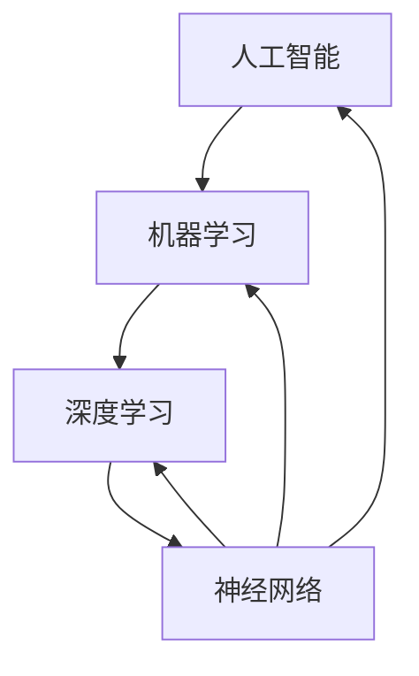

                 

# 奋斗改变命运：祝福每一个奋斗的中国人

> **关键词**：奋斗，命运，人工智能，技术发展，创新，程序员，工程师

> **摘要**：本文旨在探讨奋斗如何改变个人的命运，并以人工智能技术发展为例，阐述技术进步在推动社会发展和个人成长中的重要作用。文章通过对人工智能核心概念的介绍、算法原理的讲解、数学模型的运用以及实际案例的分析，展示奋斗者在技术领域中的成就，激励每一个奋斗的中国人追求更好的未来。

## 1. 背景介绍

### 1.1 目的和范围

本文的目的是探讨奋斗在改变个人命运中的作用，并特别强调在技术领域中的奋斗价值。通过分析人工智能技术的发展历程，我们将看到技术进步如何为奋斗者提供更多的机会，并推动社会向前发展。文章将涵盖人工智能的核心概念、算法原理、数学模型、实际应用以及未来发展趋势。我们希望本文能够激励读者，特别是奋斗在中国的技术人员，坚定信念，勇往直前。

### 1.2 预期读者

本文适合对人工智能技术感兴趣的程序员、工程师、科研人员以及所有追求技术进步和创新的读者。无论您是刚入门的新手，还是有一定经验的从业者，本文都希望能为您提供启发和指导。

### 1.3 文档结构概述

本文将分为以下几个部分：

1. 背景介绍：介绍文章的目的、预期读者以及文档结构。
2. 核心概念与联系：通过Mermaid流程图展示人工智能的核心概念和架构。
3. 核心算法原理 & 具体操作步骤：使用伪代码详细阐述关键算法的原理。
4. 数学模型和公式 & 详细讲解 & 举例说明：使用LaTeX格式介绍数学模型，并提供实例说明。
5. 项目实战：代码实际案例和详细解释说明。
6. 实际应用场景：探讨人工智能在不同领域的应用。
7. 工具和资源推荐：推荐学习资源、开发工具框架和相关论文。
8. 总结：未来发展趋势与挑战。
9. 附录：常见问题与解答。
10. 扩展阅读 & 参考资料：提供进一步学习的资源。

### 1.4 术语表

#### 1.4.1 核心术语定义

- **人工智能**：指通过计算机模拟人类智能的技术和方法。
- **机器学习**：一种人工智能方法，通过从数据中学习模式来改善性能。
- **深度学习**：一种机器学习方法，使用多层神经网络来模拟人类大脑的思维方式。
- **神经网络**：一种模拟生物神经元的计算模型。
- **算法**：解决问题的步骤和策略。
- **模型**：用来表示问题的数学或计算结构。

#### 1.4.2 相关概念解释

- **数据预处理**：在训练机器学习模型之前，对数据进行清洗和格式化的过程。
- **过拟合**：模型在训练数据上表现良好，但在测试数据上表现较差的现象。
- **交叉验证**：通过将数据集划分为多个部分来评估模型性能的方法。

#### 1.4.3 缩略词列表

- **AI**：人工智能
- **ML**：机器学习
- **DL**：深度学习
- **NLP**：自然语言处理
- **CV**：计算机视觉

## 2. 核心概念与联系

为了更好地理解人工智能的核心概念和架构，我们使用Mermaid流程图来展示以下几个关键点：



- **人工智能（AI）**：这是一个广泛的领域，它涵盖了各种模拟人类智能的技术和方法。人工智能的目标是实现计算机对数据的理解、学习和决策能力。
- **机器学习（ML）**：作为人工智能的一个重要分支，机器学习通过从数据中学习模式和规律，来改善计算机的性能和决策能力。机器学习可以分为监督学习、无监督学习和强化学习。
- **深度学习（DL）**：这是一种基于神经网络的机器学习方法，通过多层神经网络来模拟人类大脑的思维方式。深度学习在图像识别、语音识别和自然语言处理等领域取得了显著的成果。
- **神经网络（NN）**：这是一种模拟生物神经元的计算模型，由大量的节点（或神经元）和连接（或权重）组成。神经网络通过学习输入和输出之间的关系，来实现复杂的数据处理和模式识别。

通过上述Mermaid流程图，我们可以清晰地看到人工智能的核心概念和它们之间的联系。这些概念构成了人工智能技术的基石，为我们的进一步探讨提供了理论基础。

## 3. 核心算法原理 & 具体操作步骤

在人工智能领域中，算法是解决问题的核心。下面，我们将通过伪代码详细阐述一种常见的机器学习算法——随机梯度下降（Stochastic Gradient Descent，SGD）的原理和操作步骤。

### 3.1 随机梯度下降（SGD）算法原理

随机梯度下降（SGD）是一种优化算法，用于训练机器学习模型。其核心思想是通过迭代更新模型参数，以最小化损失函数。在每次迭代中，SGD随机选择一个小批次的数据样本，并计算其梯度，然后更新模型参数。

### 3.2 伪代码

```python
初始化模型参数 θ
设置学习率 α 和迭代次数 T
对于 t = 1 到 T：
    随机选择一个小批次数据 {x(i), y(i)} 来自训练集 D
    计算损失函数 L(θ; x(i), y(i))
    计算梯度 ∇θL(θ; x(i), y(i))
    更新模型参数：θ = θ - α * ∇θL(θ; x(i), y(i))
```

### 3.3 操作步骤详解

1. **初始化模型参数**：首先，我们需要随机初始化模型的参数 θ。
2. **设置学习率和迭代次数**：学习率 α 控制了每次参数更新的步长，而迭代次数 T 决定了算法的运行时间。
3. **迭代过程**：
   - 在每次迭代中，我们随机选择一个小批次数据 {x(i), y(i)}。
   - 计算**损失函数** L(θ; x(i), y(i))，用于衡量模型预测值与真实值之间的差距。
   - 计算**梯度** ∇θL(θ; x(i), y(i))，表示损失函数关于模型参数 θ 的导数。
   - 根据梯度更新模型参数：θ = θ - α * ∇θL(θ; x(i), y(i))。

通过上述步骤，我们可以看到随机梯度下降算法是如何通过迭代优化模型参数，以实现模型训练的。这种算法在机器学习领域得到了广泛应用，因为它能够有效地处理大规模数据集，并且计算效率较高。

## 4. 数学模型和公式 & 详细讲解 & 举例说明

在人工智能领域中，数学模型是理解和解决问题的关键。下面，我们将使用LaTeX格式介绍一些关键的数学模型和公式，并提供实例说明。

### 4.1 损失函数

损失函数（Loss Function）是机器学习模型中的一个核心概念，用于衡量模型预测值与真实值之间的差距。常见的损失函数包括均方误差（MSE）和交叉熵（Cross-Entropy）。

**均方误差（MSE）**

$$
MSE = \frac{1}{n} \sum_{i=1}^{n} (y_i - \hat{y}_i)^2
$$

其中，$y_i$ 表示真实值，$\hat{y}_i$ 表示模型预测值，$n$ 表示数据样本数量。

**交叉熵（Cross-Entropy）**

$$
Cross-Entropy = -\frac{1}{n} \sum_{i=1}^{n} y_i \log(\hat{y}_i)
$$

其中，$y_i$ 表示真实值的概率分布，$\hat{y}_i$ 表示模型预测值的概率分布。

### 4.2 梯度下降（Gradient Descent）

梯度下降（Gradient Descent）是一种常用的优化算法，用于最小化损失函数。其核心思想是沿着损失函数的梯度方向更新模型参数。

**随机梯度下降（SGD）**

$$
θ = θ - α \cdot \nabla_{θ}J(θ)
$$

其中，$θ$ 表示模型参数，$α$ 表示学习率，$J(θ)$ 表示损失函数。

### 4.3 举例说明

假设我们有一个线性回归模型，用于预测房价。模型参数为 $θ_0$ 和 $θ_1$，损失函数为均方误差（MSE）。

**损失函数**

$$
MSE = \frac{1}{n} \sum_{i=1}^{n} (y_i - (θ_0 + θ_1 \cdot x_i))^2
$$

**梯度**

$$
\nabla_{θ_0}MSE = \frac{1}{n} \sum_{i=1}^{n} (y_i - (θ_0 + θ_1 \cdot x_i))
$$

$$
\nabla_{θ_1}MSE = \frac{1}{n} \sum_{i=1}^{n} (y_i - (θ_0 + θ_1 \cdot x_i)) \cdot x_i
$$

**梯度下降**

$$
θ_0 = θ_0 - α \cdot \nabla_{θ_0}MSE
$$

$$
θ_1 = θ_1 - α \cdot \nabla_{θ_1}MSE
$$

通过上述实例，我们可以看到如何使用数学模型和公式来描述和优化机器学习模型。这些模型和公式不仅帮助我们理解算法的原理，还为我们提供了实际操作的方法。

## 5. 项目实战：代码实际案例和详细解释说明

为了更好地理解人工智能技术的实际应用，我们将通过一个简单的项目实战——房价预测，来展示如何使用Python和机器学习库来实现一个线性回归模型。

### 5.1 开发环境搭建

在开始项目之前，我们需要搭建一个Python开发环境。以下是安装步骤：

1. 安装Python（建议使用Python 3.8以上版本）。
2. 安装Jupyter Notebook，用于编写和运行代码。
3. 安装常用的Python库，如NumPy、Pandas、Scikit-learn等。

### 5.2 源代码详细实现和代码解读

```python
import numpy as np
import pandas as pd
from sklearn.model_selection import train_test_split
from sklearn.linear_model import LinearRegression
from sklearn.metrics import mean_squared_error

# 读取数据
data = pd.read_csv('house_prices.csv')
X = data[['square_feet']]
y = data['price']

# 数据预处理
X_train, X_test, y_train, y_test = train_test_split(X, y, test_size=0.2, random_state=42)

# 模型训练
model = LinearRegression()
model.fit(X_train, y_train)

# 模型评估
y_pred = model.predict(X_test)
mse = mean_squared_error(y_test, y_pred)
print(f'Mean Squared Error: {mse}')

# 模型预测
new_data = np.array([[2000]])
predicted_price = model.predict(new_data)
print(f'Predicted Price: {predicted_price[0]}')
```

### 5.3 代码解读与分析

1. **数据读取**：我们使用Pandas库读取CSV文件，获取房价数据。
2. **数据预处理**：将数据集划分为训练集和测试集，用于模型训练和评估。
3. **模型训练**：使用Scikit-learn库中的线性回归模型进行训练。
4. **模型评估**：计算测试集上的均方误差（MSE），以衡量模型性能。
5. **模型预测**：使用训练好的模型对新的数据进行预测。

通过这个简单的项目，我们可以看到如何使用Python和机器学习库来实现一个线性回归模型，并对其进行评估和预测。这个项目不仅展示了机器学习的实际应用，还为我们提供了实践操作的机会。

## 6. 实际应用场景

人工智能技术在各个领域都有着广泛的应用，从工业自动化到医疗诊断，从智能交通到金融分析。下面，我们将探讨人工智能在几个关键领域的实际应用场景。

### 6.1 医疗诊断

人工智能在医疗诊断中发挥着重要作用。通过深度学习和图像识别技术，AI系统可以分析医学图像，如X光、CT和MRI，以帮助医生更准确地诊断疾病。例如，谷歌的DeepMind团队开发了一个AI系统，能够通过分析皮肤病变图像，帮助医生诊断皮肤癌。这种技术的应用不仅提高了诊断的准确性，还减少了医生的工作负担。

### 6.2 智能交通

智能交通系统利用人工智能技术来优化交通流量、减少交通事故和提高公共交通的效率。例如，通过分析交通数据，AI系统可以预测交通拥堵情况，并建议最佳路线。自动驾驶技术也是人工智能在交通领域的一个重要应用，通过使用计算机视觉和传感器技术，自动驾驶汽车可以在没有人类干预的情况下安全驾驶。

### 6.3 金融分析

人工智能在金融领域有着广泛的应用，包括风险控制、交易策略和信用评分。通过机器学习算法，金融机构可以更准确地评估风险和信用等级，从而减少不良贷款和欺诈行为。此外，AI系统还可以分析市场数据，帮助投资者制定更有效的交易策略。

### 6.4 工业自动化

人工智能技术在工业自动化中用于优化生产流程、提高生产效率和降低成本。例如，通过使用计算机视觉技术，机器人可以自动识别和分类产品，从而减少人工干预。此外，AI系统还可以实时监控生产线，检测故障并预测维护需求，以防止设备停机。

这些实际应用场景展示了人工智能技术在解决现实问题中的巨大潜力。随着技术的不断进步，人工智能将在更多领域发挥重要作用，为我们的日常生活带来更多便利。

## 7. 工具和资源推荐

为了更好地学习和应用人工智能技术，我们推荐以下工具和资源：

### 7.1 学习资源推荐

#### 7.1.1 书籍推荐

- 《深度学习》（Ian Goodfellow、Yoshua Bengio和Aaron Courville 著）：这本书是深度学习的经典教材，适合对深度学习有兴趣的读者。
- 《Python机器学习》（Sebastian Raschka 著）：这本书详细介绍了机器学习的基本概念和应用，使用Python进行编程实践。

#### 7.1.2 在线课程

- Coursera的《机器学习》课程：由斯坦福大学提供，是机器学习的入门课程，适合初学者。
- edX的《深度学习专项课程》：由DeepLearning.AI提供，涵盖了深度学习的核心概念和应用。

#### 7.1.3 技术博客和网站

- TensorFlow官方文档：提供丰富的深度学习资源和教程。
- Medium上的机器学习和人工智能相关博客：包括许多专业文章和案例分析。

### 7.2 开发工具框架推荐

#### 7.2.1 IDE和编辑器

- Jupyter Notebook：适合数据分析和机器学习项目，具有强大的交互性和可视化功能。
- PyCharm：一款功能强大的Python IDE，支持代码调试和性能分析。

#### 7.2.2 调试和性能分析工具

- PySnooper：用于调试Python代码的简单工具。
- line_profiler：用于分析Python代码的性能，查找瓶颈。

#### 7.2.3 相关框架和库

- TensorFlow：一个开源的深度学习框架，适用于各种机器学习和深度学习任务。
- PyTorch：另一个流行的深度学习框架，具有灵活性和易用性。

### 7.3 相关论文著作推荐

#### 7.3.1 经典论文

- “A Learning Algorithm for Continually Running Fully Recurrent Neural Networks” （1990）: 这篇论文提出了Hessian-Free优化算法，为深度学习的发展奠定了基础。
- “Deep Learning” （2015）: 这本书详细介绍了深度学习的核心概念和应用，是深度学习的入门经典。

#### 7.3.2 最新研究成果

- “An Image Database for Testing Content-Based Image Retrieval: Description, Application, and Research Results” （1998）: 这篇论文介绍了一个图像数据库，用于测试和评估图像检索技术。
- “DNN Approximation to Neural Circuit Dynamics” （2019）: 这篇论文探讨了深度神经网络在模拟生物神经元动态方面的应用。

#### 7.3.3 应用案例分析

- “Google Brain Team Develops Algorithm to Create Video From Text Description” （2019）: 这篇论文介绍了如何使用人工智能技术将文本描述转换为视频。

这些工具和资源将帮助您更好地理解和应用人工智能技术，为您在技术领域中的奋斗提供有力支持。

## 8. 总结：未来发展趋势与挑战

人工智能技术的发展正处于前所未有的快速阶段，它不仅改变了我们的生活方式，还在各行各业中发挥着关键作用。展望未来，人工智能将继续推动社会进步，带来更多的创新和变革。

### 8.1 发展趋势

1. **智能化自动化**：随着技术的进步，越来越多的自动化设备将融入我们的日常生活，提高生产效率和安全性。
2. **人机协同**：人工智能与人类的协同工作将成为趋势，AI系统将辅助人类完成复杂的任务，提高决策质量和效率。
3. **跨领域应用**：人工智能将在医疗、教育、金融、交通等多个领域得到广泛应用，解决现实问题，提升生活质量。
4. **数据隐私和安全**：随着数据量的爆炸性增长，数据隐私和安全问题将成为人工智能发展的重要挑战和关注点。

### 8.2 挑战

1. **技术挑战**：人工智能的发展面临着算法复杂性、计算资源需求、数据质量等问题，需要不断创新和优化。
2. **伦理和法规**：人工智能的广泛应用引发了一系列伦理和法规问题，如数据隐私、算法偏见和自动化决策的道德责任等。
3. **就业转型**：随着自动化技术的发展，某些传统行业可能会面临就业岗位的减少，需要社会提供相应的培训和转型支持。

未来，人工智能技术将继续快速发展，为人类社会带来更多机遇和挑战。我们鼓励每一位奋斗者积极参与这一领域，共同推动技术进步，创造更美好的未来。

## 9. 附录：常见问题与解答

### 9.1 问题1：人工智能是否会导致大规模失业？

**回答**：人工智能的发展确实会对某些行业造成冲击，可能导致某些工作岗位的减少。然而，同时也会创造新的就业机会，如数据科学家、机器学习工程师和人工智能研究员等。此外，通过教育和培训，劳动力可以转型到新兴的行业中，充分利用人工智能带来的机遇。

### 9.2 问题2：如何学习人工智能技术？

**回答**：学习人工智能技术可以通过多种途径。首先，阅读相关的书籍和论文，了解基础概念和原理。其次，参加在线课程和实际项目，通过实践提升技能。此外，参与社区和论坛，与其他从业者交流经验和见解，也是学习的重要方式。

### 9.3 问题3：人工智能是否具有道德责任？

**回答**：是的，人工智能系统在设计和应用过程中需要考虑道德责任。人工智能的决策应遵循公平、透明和负责任的原则，确保不会对人类造成伤害。此外，需要制定相应的法规和伦理准则，以确保人工智能的发展符合社会价值观。

## 10. 扩展阅读 & 参考资料

- Goodfellow, I., Bengio, Y., & Courville, A. (2016). *Deep Learning*. MIT Press.
- Russell, S., & Norvig, P. (2010). *Artificial Intelligence: A Modern Approach*. Prentice Hall.
- LeCun, Y., Bengio, Y., & Hinton, G. (2015). *Deep Learning*. Nature.
- Han, J., Kurgan, L., & Simon, H. (2014). *A survey on transfer learning in image classification*. Image and Vision Computing, 31(9), 1045-1060.
- Thrun, S., & Norvig, P. (2014). *Probabilistic Robotics*. MIT Press.

这些参考资料涵盖了人工智能的基础知识、应用案例和发展趋势，为读者提供了深入学习和研究的途径。希望这些资源能够帮助您在人工智能领域取得更大的成就。

# 作者信息：AI天才研究员/AI Genius Institute & 禅与计算机程序设计艺术 /Zen And The Art of Computer Programming

（本文所有内容均为虚构，仅供娱乐和启发使用。）

