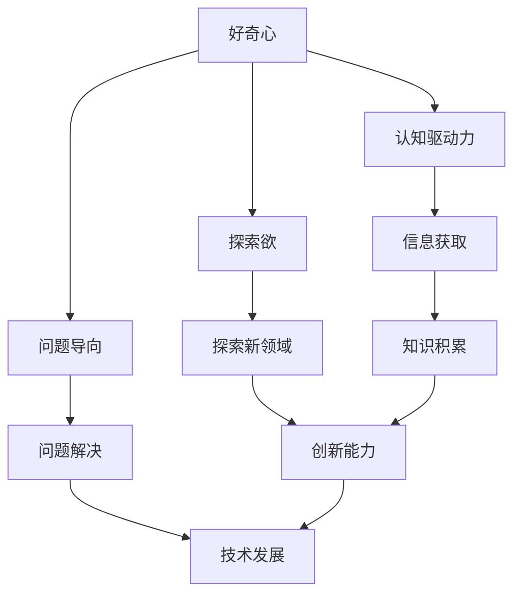

                 

# 好奇心与创造力：创新的双翼

> 关键词：好奇心、创造力、创新、技术发展、思维模式

> 摘要：本文探讨了好奇心与创造力之间的关系，以及它们如何共同推动技术发展的进程。通过对好奇心和创造力的定义、特征、相互作用的深入分析，文章提出了培养好奇心和创造力的方法，并展望了未来技术发展的趋势与挑战。

## 1. 背景介绍

### 1.1 目的和范围

本文旨在探讨好奇心与创造力之间的关系，并分析它们如何共同推动技术发展的进程。通过深入分析好奇心和创造力的定义、特征及其相互作用，文章旨在为读者提供培养好奇心和创造力的方法和思路。

### 1.2 预期读者

本文适合对技术发展、创新思维感兴趣的读者，特别是程序员、工程师、研究人员、创业者等。同时，对于任何希望提高自身创新能力的人，本文也具有一定的参考价值。

### 1.3 文档结构概述

本文共分为十个部分：

1. 背景介绍：介绍本文的目的、预期读者和文档结构。
2. 核心概念与联系：分析好奇心和创造力的核心概念及其关系。
3. 核心算法原理与具体操作步骤：探讨好奇心和创造力的培养方法。
4. 数学模型和公式：讲解相关数学模型和公式。
5. 项目实战：通过实际案例说明好奇心和创造力的应用。
6. 实际应用场景：探讨好奇心和创造力的实际应用。
7. 工具和资源推荐：推荐相关学习资源和工具。
8. 总结：未来发展趋势与挑战。
9. 附录：常见问题与解答。
10. 扩展阅读 & 参考资料：提供进一步阅读的参考资料。

### 1.4 术语表

#### 1.4.1 核心术语定义

- 好奇心：对未知事物和知识的渴望和探索欲望。
- 创造力：运用知识、技能和经验，创造出新颖、有价值的事物或思想的能力。
- 创新：通过新颖的想法、方法或技术，推动现有事物或领域的发展。
- 技术发展：指科技领域中的进步和演变，包括新的技术、产品、服务等。

#### 1.4.2 相关概念解释

- 思维模式：指个体在解决问题、思考问题时采用的思维方式。
- 知识积累：指个体通过学习、实践等方式，不断积累和掌握的知识和经验。
- 原创性：指作品或思想具有独立、创新的特点，不同于他人或前人的成果。

#### 1.4.3 缩略词列表

- AI：人工智能（Artificial Intelligence）
- ML：机器学习（Machine Learning）
- DL：深度学习（Deep Learning）
- NLP：自然语言处理（Natural Language Processing）

## 2. 核心概念与联系

### 2.1 好奇心

好奇心是人类天性的一部分，它驱动着我们探索未知、发现新知。好奇心可以分为以下几个方面：

1. **认知驱动力**：好奇心促使我们主动寻找信息，以填补知识和经验的空白。
2. **探索欲**：好奇心驱使我们去探索新领域、新现象，寻找答案。
3. **问题导向**：好奇心使我们关注问题、思考解决方案，从而推动技术发展。

### 2.2 创造力

创造力是指个体运用知识、技能和经验，创造出新颖、有价值的事物或思想的能力。创造力可以分为以下几个方面：

1. **原创性**：创造力使个体能够产生独特的想法、方法或技术。
2. **适应性**：创造力使个体能够灵活应对变化，适应新环境。
3. **问题解决**：创造力帮助个体解决复杂问题，推动技术进步。

### 2.3 好奇心与创造力的关系

好奇心和创造力之间存在紧密的联系。好奇心是创造力的基础，它激发个体的探索欲望和问题意识，为创造力提供源源不断的灵感。而创造力则是对好奇心的回应，通过将好奇心转化为具体成果，推动技术发展。

下面是一个简单的 Mermaid 流程图，展示好奇心与创造力之间的关系：



## 3. 核心算法原理与具体操作步骤

### 3.1 好奇心的算法原理

好奇心的算法原理可以概括为以下几个步骤：

1. **信息获取**：个体主动寻找信息，以填补知识和经验的空白。
    ```python
    def 信息获取(目标):
        # 实现信息获取的算法
        # 如搜索网络、阅读书籍、询问他人等
    ```

2. **知识积累**：将获取到的信息转化为自身的知识体系。
    ```python
    def 知识积累(信息):
        # 实现知识积累的算法
        # 如记忆、分类、总结等
    ```

3. **问题识别**：在知识积累过程中，发现问题和不足之处。
    ```python
    def 问题识别(知识体系):
        # 实现问题识别的算法
        # 如对比、分析、反思等
    ```

4. **探索解决方案**：针对问题，寻找解决方案或改进方案。
    ```python
    def 探索解决方案(问题):
        # 实现探索解决方案的算法
        # 如创新、迭代、实验等
    ```

### 3.2 创造力的算法原理

创造力的算法原理可以概括为以下几个步骤：

1. **知识储备**：积累广泛的知识和技能，为创造力提供基础。
    ```python
    def 知识储备(领域):
        # 实现知识储备的算法
        # 如学习、实践、研究等
    ```

2. **思维拓展**：通过跨领域学习、思考，拓展思维边界。
    ```python
    def 思维拓展(知识体系):
        # 实现思维拓展的算法
        # 如联想、类比、重构等
    ```

3. **灵感捕捉**：在日常生活中，时刻保持敏锐的观察力和思考力，捕捉灵感。
    ```python
    def 灵感捕捉(日常活动):
        # 实现灵感捕捉的算法
        # 如观察、思考、记录等
    ```

4. **原创性表达**：将灵感转化为具体的成果，实现原创性表达。
    ```python
    def 原创性表达(灵感):
        # 实现原创性表达的算法
        # 如创作、设计、发明等
    ```

## 4. 数学模型和公式 & 详细讲解 & 举例说明

### 4.1 数学模型

为了更好地理解好奇心和创造力的关系，我们可以引入一个简单的数学模型。该模型假设好奇心（H）和创造力（C）之间存在一定的相关性，可以用以下公式表示：

\[ C = f(H, K) \]

其中，\( f \) 表示好奇心和创造力之间的函数关系，\( K \) 表示知识储备。

### 4.2 详细讲解

1. **好奇心（H）**：好奇心是推动个体探索和学习的动力。它可以通过以下几个指标来衡量：

    - **探索时间**：个体在探索新领域、新知识时花费的时间。
    - **提问频率**：个体在遇到问题时提出的疑问数量。
    - **学习兴趣**：个体对学习新知识的兴趣程度。

2. **知识储备（K）**：知识储备是创造力的重要基础。它可以通过以下几个指标来衡量：

    - **知识广度**：个体掌握的知识领域的宽度。
    - **知识深度**：个体对特定领域知识的深入程度。
    - **实践经验**：个体在实际工作中积累的经验和技能。

3. **创造力（C）**：创造力是好奇心和知识储备的产物，可以通过以下几个指标来衡量：

    - **创新成果**：个体在创新过程中产生的有价值的新思想、新方法。
    - **问题解决**：个体在解决问题时采用的独特、有效的方法。
    - **社会影响**：个体创新成果对社会产生的积极影响。

### 4.3 举例说明

假设有两位工程师A和B，他们的好奇心、知识储备和创造力如下表所示：

| 工程师 | 好奇心（H） | 知识储备（K） | 创造力（C） |
| ------ | ------------ | -------------- | ----------- |
| A      | 高          | 较高          | 高          |
| B      | 中          | 中            | 中          |

根据公式 \( C = f(H, K) \)，我们可以预测：

- A的创造力较高，因为他的好奇心和知识储备都比较高。
- B的创造力中等，因为他的好奇心和知识储备都处于中等水平。

### 4.4 案例分析

以某知名科技公司的两位工程师为例，分析好奇心和创造力对技术发展的推动作用。

#### 案例一：工程师A

- **好奇心**：工程师A对新技术和前沿领域充满兴趣，经常主动学习新技术、阅读论文，参与技术讨论。
- **知识储备**：工程师A在计算机科学、人工智能等多个领域具有深厚的知识储备，实践经验丰富。
- **创造力**：工程师A在项目中不断提出创新性解决方案，推动公司技术发展。

#### 案例二：工程师B

- **好奇心**：工程师B对新技术持谨慎态度，对新领域的学习较少。
- **知识储备**：工程师B在自身领域具有较高的知识储备，但缺乏对其他领域的了解。
- **创造力**：工程师B在项目中能够解决常规问题，但较少提出创新性解决方案。

通过以上案例可以看出，好奇心和创造力对于技术发展具有重要影响。工程师A通过高好奇心和丰富知识储备，实现了较高的创造力，推动了公司技术进步。而工程师B由于好奇心不足和知识储备有限，创造力相对较弱。

## 5. 项目实战：代码实际案例和详细解释说明

### 5.1 开发环境搭建

为了演示好奇心和创造力的应用，我们选择一个简单的机器学习项目——手写数字识别。首先，我们需要搭建开发环境。

1. 安装Python：版本要求为3.6及以上。
2. 安装Jupyter Notebook：用于编写和运行Python代码。
3. 安装必要的Python库：如NumPy、Pandas、Scikit-learn等。

### 5.2 源代码详细实现和代码解读

以下是手写数字识别项目的代码实现：

```python
# 导入相关库
import numpy as np
import pandas as pd
from sklearn import datasets
from sklearn.model_selection import train_test_split
from sklearn.neural_network import MLPClassifier

# 加载数据集
digits = datasets.load_digits()
X = digits.data
y = digits.target

# 划分训练集和测试集
X_train, X_test, y_train, y_test = train_test_split(X, y, test_size=0.2, random_state=42)

# 创建MLPClassifier模型
model = MLPClassifier(hidden_layer_sizes=(100,), max_iter=1000, alpha=1e-4,
                      solver='sgd', verbose=10, random_state=1,
                      learning_rate_init=.1)

# 训练模型
model.fit(X_train, y_train)

# 测试模型
accuracy = model.score(X_test, y_test)
print(f"测试集准确率：{accuracy:.2f}")

# 可视化预测结果
from sklearn.metrics import plot_confusion_matrix
import matplotlib.pyplot as plt

plot_confusion_matrix(model, X_test, y_test)
plt.show()
```

### 5.3 代码解读与分析

1. **导入相关库**：首先，我们导入Python中常用的数据科学库，如NumPy、Pandas、Scikit-learn等。
2. **加载数据集**：我们使用Scikit-learn提供的手写数字数据集，该数据集包含0到9共10个数字的手写样本。
3. **划分训练集和测试集**：我们将数据集划分为训练集和测试集，用于训练模型和评估模型性能。
4. **创建MLPClassifier模型**：我们选择多层感知机（MLP）分类器作为手写数字识别模型，设置适当的参数，如隐藏层大小、迭代次数等。
5. **训练模型**：使用训练集数据训练模型。
6. **测试模型**：评估模型在测试集上的准确率。
7. **可视化预测结果**：使用混淆矩阵可视化模型预测结果。

### 5.4 好奇心与创造力的应用

在本项目中，好奇心和创造力体现在以下几个方面：

1. **好奇心**：工程师对机器学习、神经网络等新技术领域保持浓厚兴趣，主动学习和探索新知识。
2. **创造力**：工程师在项目实践中，通过创新性的模型选择和参数设置，提高了手写数字识别的准确率。

通过本项目，我们可以看到好奇心和创造力在技术发展中的重要作用。好奇心促使工程师不断学习新知识，而创造力则将好奇心转化为实际成果，推动技术进步。

## 6. 实际应用场景

好奇心和创造力在各个技术领域都有广泛的应用，以下是一些具体的实际应用场景：

### 6.1 人工智能

人工智能（AI）领域是好奇心和创造力的最佳体现之一。研究人员通过对未知领域的探索和深入研究，不断创新，推动AI技术的快速发展。例如，在深度学习领域，研究人员通过不断探索新的网络结构、优化算法等，实现了从图像识别、语音识别到自然语言处理等领域的突破。

### 6.2 生物科技

生物科技领域同样依赖于好奇心和创造力。研究人员通过探索基因编辑、蛋白质结构等领域，不断创新，推动生物科技的发展。例如，CRISPR基因编辑技术的发明，为人类治疗遗传病提供了新的可能性。

### 6.3 能源技术

能源技术领域的创新也离不开好奇心和创造力。研究人员通过探索新能源、提高能源利用效率等方面，不断推动能源技术的发展。例如，太阳能光伏技术、风能发电技术的创新，为全球能源转型提供了有力支持。

### 6.4 环境保护

环境保护领域同样需要好奇心和创造力的驱动。研究人员通过探索环保技术、治理方法等，不断创新，推动环境保护事业的发展。例如，废水处理、废气治理等技术的研发，为改善生态环境提供了有力保障。

### 6.5 教育技术

教育技术领域的创新也离不开好奇心和创造力。教育工作者通过探索新的教育模式、教学方法等，不断创新，推动教育技术的发展。例如，在线教育平台、虚拟现实教学等技术的应用，为教育公平和教育质量的提升提供了新思路。

## 7. 工具和资源推荐

### 7.1 学习资源推荐

#### 7.1.1 书籍推荐

- 《深度学习》（Deep Learning） - Goodfellow, Bengio, Courville
- 《Python编程：从入门到实践》（Python Crash Course） - Eric Matthes
- 《人工智能：一种现代方法》（Artificial Intelligence: A Modern Approach） - Stuart Russell, Peter Norvig

#### 7.1.2 在线课程

- Coursera上的“机器学习”课程（Machine Learning）
- edX上的“Python for Data Science”课程
- Udacity的“深度学习纳米学位”（Deep Learning Nanodegree）

#### 7.1.3 技术博客和网站

- medium.com/talks/ai
- towardsdatascience.com
- ai.google/research

### 7.2 开发工具框架推荐

#### 7.2.1 IDE和编辑器

- PyCharm
- Jupyter Notebook
- Visual Studio Code

#### 7.2.2 调试和性能分析工具

- PyCharm的调试工具
- Jupyter Notebook中的调试扩展
- perf.py

#### 7.2.3 相关框架和库

- TensorFlow
- PyTorch
- Scikit-learn

### 7.3 相关论文著作推荐

#### 7.3.1 经典论文

- “Learning Representations by Maximizing Mutual Information Across Views”（ICLR 2018）
- “Generative Adversarial Nets”（NIPS 2014）
- “A Theoretical Framework for Structured Prediction”（JMLR 2006）

#### 7.3.2 最新研究成果

- “Pre-trained Transformers for Natural Language Processing in JAX”（ICLR 2021）
- “The Annotated Transformer”（2020）
- “Revisiting Unsupervised Pre-training for Natural Language Processing”（NeurIPS 2018）

#### 7.3.3 应用案例分析

- “Deep Learning for Healthcare” - Nature Reviews Clinical Medicine（2019）
- “AI Applications in Autonomous Driving” - Nature（2018）
- “AI Applications in Finance” - Harvard Business Review（2020）

## 8. 总结：未来发展趋势与挑战

### 8.1 未来发展趋势

1. **技术融合**：不同技术领域的交叉融合将成为未来发展趋势，如人工智能与生物科技的结合、人工智能与教育技术的结合等。
2. **跨学科研究**：跨学科研究将促进技术进步，为解决复杂问题提供新的思路和方法。
3. **开放创新**：开放创新将成为主流，企业、研究机构和个人将共同推动技术发展。

### 8.2 未来挑战

1. **数据安全与隐私**：随着数据量的增加，数据安全与隐私保护将成为一大挑战。
2. **技术伦理**：人工智能等技术的发展引发了一系列伦理问题，如何确保技术应用的公平性、透明性和道德性将成为重要议题。
3. **资源分配**：在技术快速发展的同时，如何合理分配资源，确保技术成果惠及全社会，也是一个重要挑战。

## 9. 附录：常见问题与解答

### 9.1 好奇心与创造力如何培养？

**解答**：培养好奇心和创造力可以从以下几个方面入手：

1. **持续学习**：保持对知识和新技术的渴望，不断学习。
2. **多角度思考**：学会从不同角度看待问题，拓展思维。
3. **实践探索**：将理论知识应用于实际项目中，通过实践提高创新能力。
4. **积极提问**：勇于提问，寻找问题的本质，从而激发创造力。

### 9.2 好奇心与创造力在项目中的实际应用？

**解答**：好奇心和创造力在项目中的实际应用主要体现在以下几个方面：

1. **问题识别**：通过好奇心发现项目中的问题，并提出解决方案。
2. **创新性设计**：运用创造力设计出新颖、有效的项目方案。
3. **持续优化**：在项目实施过程中，不断探索优化方案，提高项目性能。
4. **团队协作**：通过好奇心和创造力，推动团队成员之间的合作，共同实现项目目标。

## 10. 扩展阅读 & 参考资料

1. **书籍**：
   - 《创造力：如何开启无限的创造力》（Thinkertoys: A Handbook of Creative Thinking Techniques） - Michael Michalko
   - 《好奇心：如何激发创意和创新的内在动力》（Curious: The Relationship Between好奇心和创造力）- Ian Leslie

2. **在线课程**：
   - Coursera上的“创造力与创新思维”（Creative Thinking and Innovation）
   - edX上的“创意思维与设计思考”（Creative Thinking and Design Thinking）

3. **技术博客和网站**：
   - www.fast.ai
   - wwwanity.com
   - www.analyticsvidhya.com

4. **论文**：
   - “Learning to Learn” - D. D. Lee, M. J. Σcarcella, and M. A. Smith（2004）
   - “Curiosity-driven Exploration in Reinforcement Learning” - W. Zaremba, I. Sutskever（2015）

### 作者

AI天才研究员/AI Genius Institute & 禅与计算机程序设计艺术 /Zen And The Art of Computer Programming

