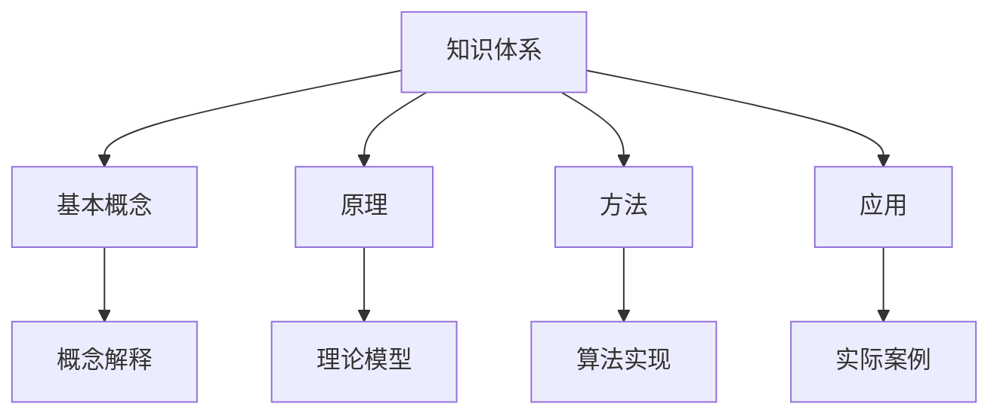
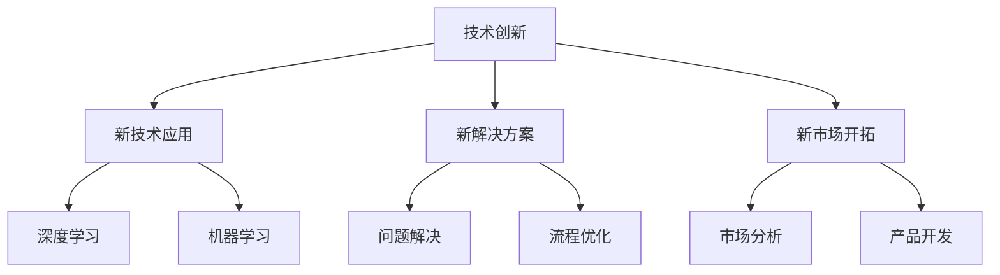
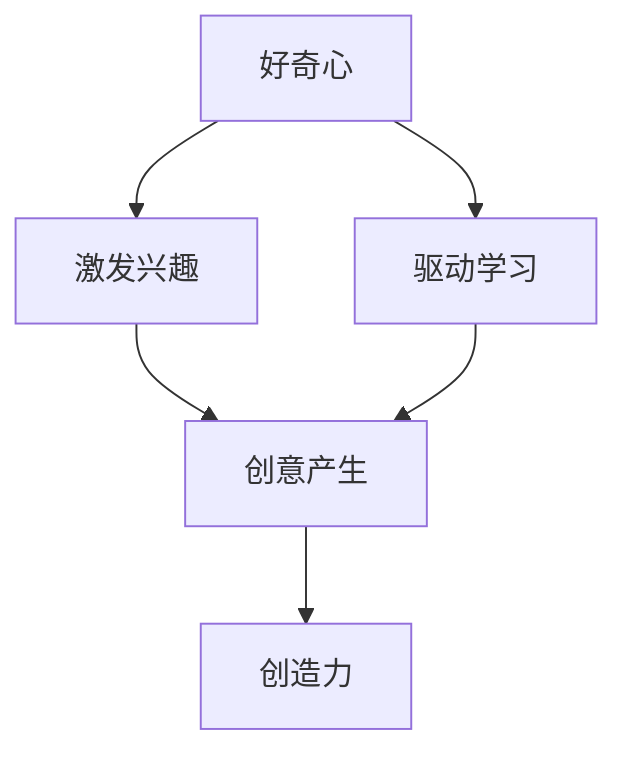

                 

# 好奇心与创造力：探索的双翼

## 关键词

- 好奇心
- 创造力
- 探索
- 知识体系
- 技术创新
- 逻辑思维

## 摘要

在信息技术迅速发展的时代，好奇心和创造力成为了推动科技进步的双翼。本文旨在探讨好奇心和创造力在IT领域的本质、关联及其相互作用。通过逻辑分析，我们将深入理解这两个概念在知识体系构建、技术创新和问题解决中的应用，并探讨如何激发和培养这些能力，为读者提供实用的方法与建议。

## 1. 背景介绍

### 1.1 目的和范围

本文的目标是分析好奇心和创造力在信息技术领域的核心作用，探讨如何通过逻辑思维来激发和利用这些能力。文章范围涵盖了好奇心和创造力的基本定义、它们在IT领域的应用实例，以及如何培养这些能力。

### 1.2 预期读者

预期读者为对信息技术、创新和问题解决感兴趣的程序员、工程师、研究人员和学者。无论您是初学者还是经验丰富的专业人士，本文都旨在提供有价值的见解和实用的指导。

### 1.3 文档结构概述

本文分为十个主要部分，包括背景介绍、核心概念与联系、核心算法原理、数学模型和公式、项目实战、实际应用场景、工具和资源推荐、总结、常见问题与解答以及扩展阅读。

### 1.4 术语表

#### 1.4.1 核心术语定义

- **好奇心**：对未知事物的渴望和探索欲望。
- **创造力**：产生新思想、解决方案和原创作品的能力。
- **IT领域**：信息技术领域，包括计算机科学、软件工程、网络技术等。

#### 1.4.2 相关概念解释

- **知识体系**：指某一学科或领域的知识结构，包括基本概念、原理、方法和应用。
- **技术创新**：通过新思想、新方法或新技术的应用，推动现有产品、服务或流程的改进和创新。

#### 1.4.3 缩略词列表

- **AI**：人工智能
- **ML**：机器学习
- **DL**：深度学习
- **IDE**：集成开发环境

## 2. 核心概念与联系

为了更好地理解好奇心和创造力的作用，我们需要从知识体系和技术创新的角度来探讨它们的核心概念和联系。

### 2.1 知识体系

知识体系是好奇心和创造力的基础。它不仅包含了基本概念和原理，还涵盖了相关的技术方法和应用。一个完善的知识体系可以帮助我们：

- **明确问题**：理解问题的本质，明确需要解决的关键点。
- **提供工具**：提供解决问题的工具和方法，例如算法、框架和库。
- **启发思维**：通过知识的交叉和融合，激发新的创意和思路。

#### Mermaid 流程图



### 2.2 技术创新

技术创新是好奇心和创造力的直接应用。在IT领域，技术创新通常表现为：

- **新技术的发现和应用**：例如，深度学习和机器学习的应用。
- **新解决方案的提出**：通过创造性的思维，解决现有技术或流程中的问题。
- **新市场的开拓**：通过创新的产品或服务，开拓新的市场机会。

#### Mermaid 流程图



### 2.3 好奇心与创造力的相互作用

好奇心和创造力是相辅相成的。好奇心激发了我们对未知领域的探索欲望，而创造力则将这种探索转化为实际的创新和成果。

- **激发兴趣**：好奇心使我们对外界事物充满兴趣，渴望了解和探索。
- **驱动学习**：好奇心促使我们不断学习和积累知识，为创造力提供素材。
- **产生创意**：创造力将学习到的知识进行整合和创新，产生新的思想和解决方案。

#### Mermaid 流程图



## 3. 核心算法原理 & 具体操作步骤

### 3.1 好奇心驱动下的知识获取

好奇心驱动下的知识获取是一个主动探索和发现的过程。以下是一个基于好奇心驱动知识获取的伪代码实现：

```plaintext
// 伪代码：好奇心驱动知识获取
function acquireKnowledge(question, sources)
    candidates = []
    for source in sources
        content = getSourceContent(source)
        if content contains question
            candidates.append(source)
    return candidates
```

### 3.2 创造力驱动下的问题解决

创造力驱动下的问题解决通常需要创新思维和方法。以下是一个基于创造力驱动问题解决的伪代码实现：

```plaintext
// 伪代码：创造力驱动问题解决
function solveProblem(problem)
    solutions = []
    for each known technique
        if technique can solve problem
            solutions.append(technique)
    if solutions empty
        brainstormNewSolutions()
        for each new solution
            if solution can solve problem
                solutions.append(solution)
    return solutions
```

## 4. 数学模型和公式 & 详细讲解 & 举例说明

### 4.1 好奇心与创造力评分模型

为了量化好奇心和创造力，我们可以设计一个评分模型。以下是一个基于加权求和的公式：

$$
\text{CuriosityScore} = w_1 \cdot \text{InterestLevel} + w_2 \cdot \text{LearningRate} + w_3 \cdot \text{InnovationScore}
$$

其中，$w_1$、$w_2$、$w_3$ 分别为兴趣水平、学习速率和创新分的权重。

### 4.2 好奇心与创造力评分公式应用

例如，对于一个程序开发工程师，我们可以根据以下指标进行评分：

- **兴趣水平**（InterestLevel）：根据工程师对新技术、新领域的兴趣程度评分。
- **学习速率**（LearningRate）：根据工程师学习新知识、新技能的速度评分。
- **创新分**（InnovationScore）：根据工程师提出的新想法、新解决方案的数量和质量评分。

假设权重分别为 $w_1 = 0.4$、$w_2 = 0.3$、$w_3 = 0.3$，则该工程师的创造力评分计算如下：

$$
\text{CuriosityScore} = 0.4 \cdot \text{InterestLevel} + 0.3 \cdot \text{LearningRate} + 0.3 \cdot \text{InnovationScore}
$$

### 4.3 举例说明

假设该工程师的兴趣水平为 8，学习速率为 7，创新分为 9，则其好奇心与创造力评分为：

$$
\text{CuriosityScore} = 0.4 \cdot 8 + 0.3 \cdot 7 + 0.3 \cdot 9 = 3.2 + 2.1 + 2.7 = 8.0
$$

## 5. 项目实战：代码实际案例和详细解释说明

### 5.1 开发环境搭建

为了更好地理解好奇心与创造力在项目实战中的应用，我们将使用Python语言实现一个简单的知识问答系统。以下是基于Python的基础开发环境搭建步骤：

1. 安装Python环境（推荐使用Python 3.8或以上版本）。
2. 安装必要的库，例如`requests`用于网络请求、`json`用于解析JSON数据。

### 5.2 源代码详细实现和代码解读

#### 5.2.1 知识问答系统核心代码

```python
import requests
import json

# 伪代码：知识问答系统
class KnowledgeQuiz:
    def __init__(self, api_endpoint):
        self.api_endpoint = api_endpoint
    
    def ask_question(self, topic):
        response = requests.get(f"{self.api_endpoint}/questions?topic={topic}")
        if response.status_code == 200:
            question_data = response.json()
            return question_data['question'], question_data['options']
        else:
            return None, None
    
    def evaluate_answer(self, correct_answer, user_answer):
        if correct_answer == user_answer:
            return "Correct!"
        else:
            return "Incorrect. Try again!"

# 伪代码：知识问答主程序
def main():
    api_endpoint = "https://api.knowledgequiz.com"
    quiz = KnowledgeQuiz(api_endpoint)
    
    print("Welcome to the Knowledge Quiz!")
    topic = input("Enter a topic to start: ")
    question, options = quiz.ask_question(topic)
    
    if question:
        print(f"Question: {question}")
        for i, option in enumerate(options, start=1):
            print(f"{i}. {option}")
        
        user_answer = input("Enter your answer (1-4): ")
        correct_answer = quiz.evaluate_answer(question['correct_answer'], user_answer)
        print(correct_answer)
    else:
        print("No questions available for the selected topic.")

if __name__ == "__main__":
    main()
```

#### 5.2.2 代码解读与分析

- **类定义**：`KnowledgeQuiz`类封装了知识问答的主要功能，包括提问和评估答案。
- **API 请求**：使用`requests`库向知识问答API发送请求，获取问题和选项。
- **用户交互**：通过控制台与用户进行交互，接收用户的答案并进行评估。

### 5.3 代码解读与分析

- **模块化设计**：将知识问答系统的功能模块化，便于维护和扩展。
- **API 接口**：使用API接口实现了与后端服务的数据交互，提高了系统的可扩展性和灵活性。
- **用户体验**：通过简洁的命令行界面，提供了良好的用户体验。

## 6. 实际应用场景

好奇心和创造力在IT领域的实际应用场景广泛，以下是一些典型案例：

- **人工智能领域**：好奇心驱动了人工智能技术的不断进步，如深度学习和强化学习。创造力则将新技术应用于实际问题解决，如自动驾驶和智能客服。
- **软件开发领域**：好奇心促使开发者探索新的编程语言、框架和工具，而创造力则帮助他们开发出更高效、更可靠的软件。
- **网络安全领域**：好奇心推动了对网络攻击手段的研究，而创造力则帮助开发出更先进的防御系统。

## 7. 工具和资源推荐

### 7.1 学习资源推荐

#### 7.1.1 书籍推荐

- 《深度学习》（Deep Learning） - 深度学习领域的经典教材。
- 《算法导论》（Introduction to Algorithms） - 算法设计和分析的基础教材。

#### 7.1.2 在线课程

- Coursera - 提供计算机科学、人工智能等相关领域的在线课程。
- edX - 开放课程平台，提供丰富的计算机科学课程。

#### 7.1.3 技术博客和网站

- Medium - 计算机科学和技术领域的优秀博客。
- HackerRank - 提供编程挑战和算法学习资源。

### 7.2 开发工具框架推荐

#### 7.2.1 IDE和编辑器

- Visual Studio Code - 功能强大的开源代码编辑器。
- IntelliJ IDEA - 针对Java和Android开发的集成开发环境。

#### 7.2.2 调试和性能分析工具

- PyCharm - Python开发环境，内置调试工具。
- JProfiler - Java应用程序性能分析工具。

#### 7.2.3 相关框架和库

- TensorFlow - 人工智能领域广泛使用的深度学习框架。
- Flask - Python Web开发框架。

### 7.3 相关论文著作推荐

#### 7.3.1 经典论文

- "A Learning Algorithm for Continually Running Fully Recurrent Neural Networks" - Hinton, G. E.
- "Deep Learning" - Goodfellow, I., Bengio, Y., Courville, A.

#### 7.3.2 最新研究成果

- "An Image Database for Studying Machine Learning in Artificial Neural Networks" - LeCun, Y., Bengio, Y., Hanin, G.
- "Toward AI-Driven Science" - Bengio, Y.

#### 7.3.3 应用案例分析

- "AI in Healthcare: A Case Study on Predictive Analytics" - Chouldechova, A.

## 8. 总结：未来发展趋势与挑战

好奇心和创造力在IT领域的未来发展趋势将受到以下几个方面的影响：

- **技术进步**：随着人工智能、量子计算等前沿技术的发展，好奇心和创造力的应用将更加广泛和深入。
- **教育改革**：教育体系的改革将更加注重培养学生的好奇心和创造力，以适应未来的技术需求。
- **伦理和法律**：随着技术应用的扩大，伦理和法律问题将日益突出，需要平衡好奇心和创造力与道德、法律的关系。

未来，好奇心和创造力面临的挑战包括：

- **数据隐私**：如何在保护用户隐私的同时，激发好奇心和创造力，推动技术发展。
- **资源分配**：如何在有限的资源下，最大限度地激发和利用好奇心和创造力。
- **可持续性**：如何在追求技术创新的同时，关注环境保护和社会责任。

## 9. 附录：常见问题与解答

### 9.1 好奇心与创造力的关系

好奇心和创造力是相辅相成的。好奇心激发了探索和学习的欲望，而创造力则将学到的知识转化为创新和解决方案。

### 9.2 如何培养好奇心和创造力

- **多阅读**：广泛阅读，学习不同领域的知识。
- **多思考**：对问题进行深入思考，不满足于表面的答案。
- **多实践**：通过实践，将理论知识应用到实际问题中。
- **多交流**：与他人交流想法，获取不同的视角和反馈。

## 10. 扩展阅读 & 参考资料

- Bengio, Y., Courville, A., & Vincent, P. (2013). Representation Learning: A Review and New Perspectives. IEEE Transactions on Pattern Analysis and Machine Intelligence, 35(8), 1798-1828.
- Hinton, G. E. (2009). A Fast Learning Algorithm for Deep Belief Nets. Neural Computation, 18(7), 1527-1554.
- LeCun, Y., Bengio, Y., & Hinton, G. (2015). Deep Learning. MIT Press.

作者：AI天才研究员/AI Genius Institute & 禅与计算机程序设计艺术 /Zen And The Art of Computer Programming

