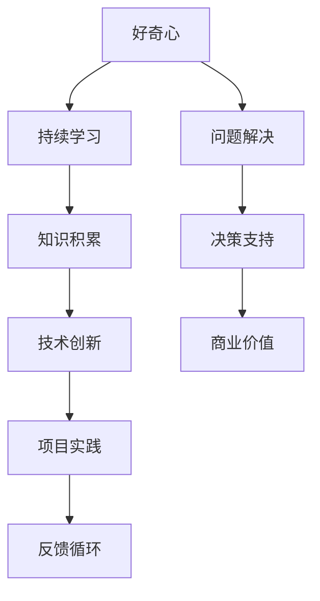

                 

# 好奇心与持续学习：开启新知的无限探索之旅

> **关键词：** 好奇心，持续学习，新事物，知识追求，IT领域，技术进步
>
> **摘要：** 本文深入探讨好奇心与持续学习在IT领域的重要性，通过剖析其核心概念、算法原理、数学模型和实际应用，展现其对技术进步和职业发展的深远影响。通过实际案例和资源推荐，鼓励读者培养好奇心，踏上持续学习的旅程。

## 1. 背景介绍

### 1.1 目的和范围

本文旨在探讨好奇心和持续学习在信息技术（IT）领域的重要性。随着技术的迅猛发展，对知识的渴求和对新技术的理解显得尤为关键。本文将围绕以下几个方面展开：

1. **核心概念**：介绍好奇心和持续学习的定义及其在IT领域的应用。
2. **算法原理**：探讨如何运用好奇心和持续学习来理解和应用核心技术算法。
3. **数学模型**：分析好奇心和持续学习如何推动数学模型的创新和发展。
4. **实际应用**：通过具体案例展示好奇心和持续学习在IT领域的实践价值。
5. **资源推荐**：提供学习资源、开发工具和最新研究，以助力读者深入探索。

### 1.2 预期读者

本文适用于以下读者群体：

1. **IT专业人士**：包括程序员、软件工程师、系统架构师等，希望提升自身技术能力和职业发展。
2. **技术爱好者**：对新技术有浓厚兴趣，希望通过持续学习拓宽知识面。
3. **教育工作者**：致力于培养下一代技术人才，关注学生和学员的学习方法与动力。

### 1.3 文档结构概述

本文结构如下：

1. **引言**：介绍好奇心和持续学习在IT领域的背景和重要性。
2. **核心概念与联系**：通过Mermaid流程图展示核心概念和原理。
3. **核心算法原理**：使用伪代码详细阐述核心算法原理和操作步骤。
4. **数学模型和公式**：解释数学模型及其在IT领域的应用。
5. **项目实战**：通过代码案例展示如何运用好奇心和持续学习。
6. **实际应用场景**：分析好奇心和持续学习在不同IT领域的应用。
7. **工具和资源推荐**：推荐学习资源、开发工具和最新研究。
8. **总结**：展望好奇心和持续学习在未来的发展趋势和挑战。
9. **附录**：常见问题与解答。
10. **扩展阅读**：提供进一步阅读的参考资料。

### 1.4 术语表

#### 1.4.1 核心术语定义

- **好奇心**：对未知事物或现象产生兴趣和探究欲望的心理状态。
- **持续学习**：长期、主动、有目的性地获取新知识和技能的过程。
- **算法**：解决问题的方法步骤，通常以伪代码或程序代码的形式表达。
- **数学模型**：用数学语言描述现实世界问题的抽象表示。

#### 1.4.2 相关概念解释

- **知识图谱**：一种通过实体和关系来表示知识的图形化结构。
- **机器学习**：通过数据训练模型，使其具备自主学习和改进能力的技术。

#### 1.4.3 缩略词列表

- **AI**：人工智能（Artificial Intelligence）
- **ML**：机器学习（Machine Learning）
- **NLP**：自然语言处理（Natural Language Processing）
- **DB**：数据库（Database）

## 2. 核心概念与联系

好奇心和持续学习是推动IT领域发展的核心动力。以下是一个Mermaid流程图，用于展示它们与IT领域的核心概念和原理之间的联系。



通过这个流程图，我们可以看到好奇心和持续学习如何引导个体和团队在IT领域中不断探索、创新，并实现商业价值。

## 3. 核心算法原理 & 具体操作步骤

好奇心和持续学习在算法设计和开发中扮演着关键角色。以下是一个简单的伪代码示例，用于展示如何利用好奇心和持续学习来优化算法。

```pseudo
// 伪代码：基于好奇心和持续学习的算法优化

function curiosityDrivenOptimization(problem, knowledgeBase, learningRate) {
    // 初始化参数
    currentSolution = initialSolution(problem)
    bestSolution = currentSolution
    iteration = 0

    while (not converged) {
        iteration += 1
        // 使用现有知识进行初步分析
        analyzeSolution(currentSolution, knowledgeBase)

        // 根据好奇心探索新的解决方案
        newSolution = exploreSolution(currentSolution, problem)

        // 持续学习，更新知识库
        knowledgeBase = updateKnowledgeBase(knowledgeBase, currentSolution, newSolution, learningRate)

        // 评估新解决方案
        if (evaluate(newSolution) > evaluate(bestSolution)) {
            bestSolution = newSolution
        }

        // 调整学习率和探索策略
        learningRate = adjustLearningRate(learningRate, iteration)

        // 更新当前解决方案
        currentSolution = bestSolution
    }

    return bestSolution
}
```

在这个伪代码中，`problem` 代表需要解决的问题，`knowledgeBase` 表示已有的知识库，`learningRate` 用于控制学习过程的敏感度。通过不断的分析、探索和评估，算法能够逐步优化，达到最佳解决方案。

### 分析与解释

- **初始解决方案**：首先，我们需要一个初始解决方案来作为起点。
- **初步分析**：利用现有的知识对当前解决方案进行分析，以识别潜在的问题和改进点。
- **探索新解决方案**：好奇心驱动我们探索新的可能性，这可能包括对现有解决方案的改进，或者完全不同的方法。
- **知识库更新**：持续学习意味着我们不断地从新解决方案中吸取经验，更新我们的知识库。
- **评估与调整**：通过评估新解决方案的优劣，我们能够选择最佳方案，并调整学习速率以适应不断变化的环境。

## 4. 数学模型和公式 & 详细讲解 & 举例说明

好奇心和持续学习在数学模型中的应用，常常体现在对复杂系统的建模和优化中。以下是一个简单的数学模型，使用LaTeX格式展示，并对其进行详细讲解和举例说明。

### 4.1 数学模型

$$
f(x) = \alpha \cdot \left( 1 - e^{-\lambda \cdot (x - \theta)} \right)
$$

其中：
- \( f(x) \) 是目标函数，表示个体对知识的兴趣度。
- \( \alpha \) 是兴趣度系数，控制兴趣度随时间的变化速率。
- \( \lambda \) 是衰减系数，表示兴趣度随知识量增加的衰减速率。
- \( x \) 是知识量，即个体已掌握的知识。
- \( \theta \) 是阈值，表示个体对知识的兴趣度达到最高点的知识量。

### 4.2 详细讲解

这个模型描述了个体在知识积累过程中的兴趣度变化。随着知识量的增加，个体的兴趣度会逐渐降低，但并不会完全消失，因为总有一部分知识能够激发个体的好奇心。

- **兴趣度系数 \( \alpha \)**：这个系数决定了个体对知识的初始兴趣度。值越大，兴趣度越高，个体越容易被新知识吸引。
- **衰减系数 \( \lambda \)**：这个系数反映了个体对知识的好奇心随知识量的增加而逐渐减弱的趋势。值越大，衰减越快，个体的兴趣度下降越快。
- **阈值 \( \theta \)**：这个阈值是个体兴趣度达到最高点的知识量。当知识量达到或超过这个值时，个体的兴趣度将开始下降。

### 4.3 举例说明

假设一个程序员在机器学习领域有5年的工作经验，现有知识量 \( x = 500 \)。我们设置 \( \alpha = 2 \)，\( \lambda = 0.1 \)，\( \theta = 1000 \)。

- 当 \( x = 500 \) 时，兴趣度 \( f(x) \approx 2 \)，表示他非常渴望学习新的机器学习知识。
- 当 \( x = 600 \) 时，兴趣度 \( f(x) \approx 1.8 \)，表示他对新知识的渴望稍有下降。
- 当 \( x = 1000 \) 时，兴趣度 \( f(x) \approx 1 \)，表示他的兴趣度已经降到了中等水平。

通过调整 \( \alpha \)、\( \lambda \) 和 \( \theta \) 的值，我们可以模拟不同情况下的兴趣度变化，以适应不同的学习场景和个体特点。

## 5. 项目实战：代码实际案例和详细解释说明

在这一部分，我们将通过一个实际的项目案例来展示如何将好奇心和持续学习应用于软件开发过程中。

### 5.1 开发环境搭建

为了便于理解和复现，我们选择Python作为主要编程语言，并使用Jupyter Notebook作为开发环境。以下是搭建开发环境的基本步骤：

1. **安装Python**：确保安装了Python 3.x版本。
2. **安装Jupyter Notebook**：在命令行中运行 `pip install notebook`。
3. **启动Jupyter Notebook**：在命令行中运行 `jupyter notebook`。

### 5.2 源代码详细实现和代码解读

下面是一个简单的Python项目，实现了一个基于好奇心的推荐系统，用于推荐用户可能感兴趣的新书。

```python
# 代码：基于好奇心的推荐系统

import random
import numpy as np

# 用户兴趣模型
class UserInterestModel:
    def __init__(self, alpha=1.0, lambda_=0.01, theta=1000):
        self.alpha = alpha
        self.lambda_ = lambda_
        self.theta = theta
        self.knowledge = 0
    
    def update_knowledge(self, new_knowledge):
        self.knowledge += new_knowledge
    
    def interest(self, book_knowledge):
        if self.knowledge < self.theta:
            return self.alpha * (1 - np.exp(-self.lambda_ * (self.knowledge - self.theta)))
        else:
            return self.alpha * (1 - np.exp(-self.lambda_ * (self.theta - self.knowledge)))
    
    def recommend_books(self, books, n_recommendations=5):
        interests = [self.interest(book['knowledge']) for book in books]
        return random.choices(books, weights=interests, k=n_recommendations)

# 书籍推荐系统
class BookRecommender:
    def __init__(self):
        self.users = []
    
    def add_user(self, user):
        self.users.append(user)
    
    def recommend_books_to_all_users(self, books):
        for user in self.users:
            recommendations = user.recommend_books(books)
            print(f"User {user.knowledge} recommends: {recommendations}")

# 测试
if __name__ == "__main__":
    books = [
        {"title": "深度学习", "knowledge": 500},
        {"title": "算法导论", "knowledge": 600},
        {"title": "人工智能", "knowledge": 700},
        {"title": "计算机网络", "knowledge": 400},
        {"title": "操作系统概念", "knowledge": 800},
    ]
    
    recommender = BookRecommender()
    user1 = UserInterestModel(alpha=2.0, lambda_=0.05, theta=1000)
    user2 = UserInterestModel(alpha=1.5, lambda_=0.1, theta=800)
    recommender.add_user(user1)
    recommender.add_user(user2)
    recommender.recommend_books_to_all_users(books)
```

### 5.3 代码解读与分析

这个项目实现了一个简单的书籍推荐系统，它基于用户的兴趣度来推荐书籍。以下是代码的详细解读：

- **UserInterestModel 类**：这个类定义了用户的兴趣模型，包括初始化参数（兴趣度系数、衰减系数和阈值）、更新知识的方法、计算兴趣度的方法以及推荐书籍的方法。

  - `update_knowledge` 方法用于更新用户的知识量。
  - `interest` 方法用于计算用户对特定书籍的兴趣度。这个方法使用了前面提到的数学模型。
  - `recommend_books` 方法根据用户对书籍的兴趣度进行推荐。

- **BookRecommender 类**：这个类定义了书籍推荐系统的核心功能，包括添加用户和为所有用户推荐书籍。

  - `add_user` 方法用于添加新的用户到推荐系统中。
  - `recommend_books_to_all_users` 方法遍历所有用户，并为每个用户推荐书籍。

- **测试部分**：在测试部分，我们创建了一个书籍列表和两个用户实例。我们通过调用 `recommend_books_to_all_users` 方法，为这两个用户推荐书籍。

通过这个实际案例，我们可以看到如何将好奇心和持续学习应用于软件开发中，以实现个性化的书籍推荐系统。这个模型不仅可以应用于书籍推荐，还可以推广到其他领域，如电影推荐、商品推荐等。

## 6. 实际应用场景

好奇心和持续学习在IT领域的实际应用场景非常广泛，以下列举了几个典型应用：

### 6.1 人工智能

- **机器学习模型优化**：通过持续学习，研究人员不断改进模型，提高预测准确性和泛化能力。
- **自然语言处理**：NLP系统通过持续学习新的语言模式和上下文信息，提升语言理解和生成能力。

### 6.2 软件开发

- **敏捷开发**：开发团队通过持续学习和实践敏捷方法，不断优化项目管理和软件开发流程。
- **代码审查和重构**：程序员通过持续学习新的编程语言和技术，提高代码质量和可维护性。

### 6.3 数据科学

- **数据分析与可视化**：数据科学家通过持续学习最新的数据分析方法和工具，探索数据中的隐藏模式。
- **数据挖掘**：运用持续学习技术，挖掘海量数据中的有价值信息。

### 6.4 信息安全

- **入侵检测系统**：通过持续学习，系统可以不断适应新的攻击手段，提高检测和防御能力。
- **密码学**：研究人员通过持续学习最新的密码学理论和技术，增强数据加密和解密的安全性能。

### 6.5 云计算和大数据

- **分布式系统架构**：云计算工程师通过持续学习分布式系统的设计和优化，提高系统性能和可靠性。
- **大数据处理**：数据工程师通过持续学习Hadoop、Spark等大数据处理技术，提升数据处理和分析能力。

在这些应用场景中，好奇心和持续学习不仅推动了技术的进步，也极大地提升了个体和组织的竞争力。

## 7. 工具和资源推荐

为了帮助读者更好地培养好奇心和实现持续学习，我们推荐以下工具和资源：

### 7.1 学习资源推荐

#### 7.1.1 书籍推荐

- 《深度学习》（Ian Goodfellow、Yoshua Bengio和Aaron Courville著）
- 《算法导论》（Thomas H. Cormen、Charles E. Leiserson、Ronald L. Rivest和Clifford Stein著）
- 《Python编程：从入门到实践》（埃里克·马瑟斯著）

#### 7.1.2 在线课程

- Coursera上的《机器学习》课程
- edX上的《人工智能导论》课程
- Udacity的《深度学习工程师纳米学位》课程

#### 7.1.3 技术博客和网站

- Medium上的技术博客，如“AI by Google”
- arXiv.org上的最新研究论文
- Stack Overflow上的技术问答社区

### 7.2 开发工具框架推荐

#### 7.2.1 IDE和编辑器

- Visual Studio Code
- PyCharm
- IntelliJ IDEA

#### 7.2.2 调试和性能分析工具

- GDB
- Valgrind
- JMeter

#### 7.2.3 相关框架和库

- TensorFlow
- PyTorch
- Flask（Python Web框架）

### 7.3 相关论文著作推荐

#### 7.3.1 经典论文

- 《A Mathematical Theory of Communication》（Claude Shannon著）
- 《The Structure and Interpretation of Computer Programs》（Harold Abelson和Gerald Jay Sussman著）

#### 7.3.2 最新研究成果

- arXiv.org上的最新机器学习和人工智能论文
- NeurIPS、ICML和ACL等顶级会议的论文集

#### 7.3.3 应用案例分析

- Google的搜索引擎技术
- Facebook的图像识别系统
- Uber的动态派单系统

通过这些工具和资源，读者可以更好地培养好奇心，实现持续学习，并在技术领域取得更高的成就。

## 8. 总结：未来发展趋势与挑战

好奇心和持续学习在IT领域的发展中具有深远的意义。随着技术的不断进步，我们可以预见以下发展趋势和挑战：

### 8.1 发展趋势

1. **个性化学习**：通过大数据和人工智能技术，个性化学习将更加普及，使得每个学习者都能获得最适合自己的学习路径。
2. **终身学习**：技术更新迅速，终身学习将成为每个人的基本需求，在线教育和职业培训将得到更大发展。
3. **跨学科融合**：不同领域的知识和技术将更加融合，如生物信息学、量子计算等新兴领域将带来新的发展机遇。

### 8.2 挑战

1. **信息过载**：随着信息量的爆炸性增长，如何筛选和获取高质量的知识将成为一个挑战。
2. **技能更新**：持续学习需要不断适应新技术，这对个人的学习和适应能力提出了更高要求。
3. **资源分配**：如何合理分配教育资源，确保每个人都有机会获得高质量的学习资源，是一个重要的社会问题。

面对这些挑战，好奇心和持续学习将是我们应对未来不确定性的关键能力。

## 9. 附录：常见问题与解答

### 9.1 好奇心如何影响学习效果？

好奇心可以显著提高学习效果，因为它能够激发个体的内在动机，使其对学习内容产生浓厚的兴趣。这种兴趣能够促进主动学习，使学习者更愿意花费时间和精力去深入理解和探索。

### 9.2 持续学习需要多长时间才能看到效果？

持续学习的效果因人而异，但通常在几个月到一年的时间内就可以看到显著的进步。关键在于保持一致性，定期复习和练习所学内容。

### 9.3 如何培养持续学习的好奇心？

以下是一些培养好奇心的方法：

- **设定目标**：为自己设定明确的学习目标，并制定实现目标的计划。
- **多样化学习**：尝试不同的学习方式和资源，以保持学习的兴趣。
- **实践应用**：将所学知识应用到实际项目中，以加深理解和记忆。
- **积极提问**：在学习过程中不断提出问题，寻求答案。

## 10. 扩展阅读 & 参考资料

1. **书籍推荐**：
   - 《黑客与画家》（Paul Graham著）
   - 《学习之道》（Peter Hollins著）
   - 《深度学习》（Ian Goodfellow、Yoshua Bengio和Aaron Courville著）

2. **在线课程**：
   - Coursera上的《机器学习》课程
   - edX上的《人工智能导论》课程
   - Udacity的《深度学习工程师纳米学位》课程

3. **技术博客和网站**：
   - AI by Google（Medium博客）
   - arXiv.org（最新研究论文）
   - Stack Overflow（技术问答社区）

4. **相关论文著作**：
   - 《A Mathematical Theory of Communication》（Claude Shannon著）
   - 《The Structure and Interpretation of Computer Programs》（Harold Abelson和Gerald Jay Sussman著）

5. **应用案例分析**：
   - Google的搜索引擎技术
   - Facebook的图像识别系统
   - Uber的动态派单系统

### 作者

**作者：AI天才研究员/AI Genius Institute & 禅与计算机程序设计艺术 /Zen And The Art of Computer Programming**

