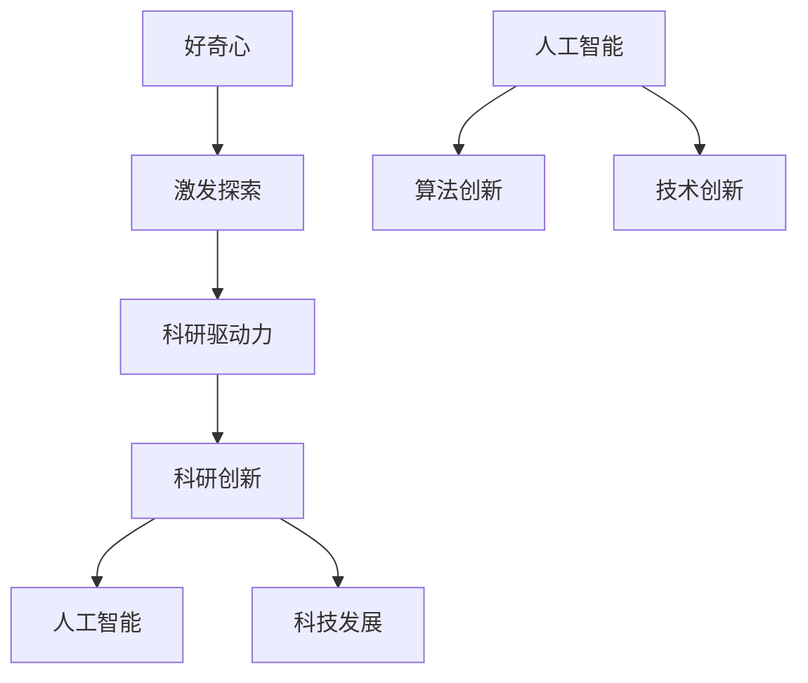

                 

# 好奇心：探索未知的动力

> 关键词：好奇心、探索、未知、动力、人工智能、创新

> 摘要：本文将深入探讨好奇心这一人类独有的特质，如何推动我们不断探索未知领域。通过结合人工智能领域的实例，揭示好奇心在科技发展和创新过程中的重要作用。我们将逐步分析好奇心的内在机制，以及如何通过培养好奇心，激发个人和组织的创新潜力。

## 1. 背景介绍

### 1.1 目的和范围

本文旨在探讨好奇心这一心理特质在推动人类探索未知领域中的关键作用。特别是在人工智能这一快速发展领域，好奇心不仅是科研人员的内在驱动力，也是技术创新的重要源泉。通过分析好奇心如何激发科学探索和推动科技进步，本文希望能够为读者提供一个新的视角，理解好奇心在个人成长和组织发展中的重要性。

### 1.2 预期读者

本文适合对人工智能、科技创新和心理学感兴趣的读者。无论是科研人员、工程师，还是普通公众，都可以通过本文了解到好奇心在个人成长和组织创新中的作用，以及如何培养和利用好奇心，为自身和社会带来更多可能性。

### 1.3 文档结构概述

本文结构如下：

1. **背景介绍**：介绍本文的目的、范围和预期读者，以及文档的结构概述。
2. **核心概念与联系**：通过Mermaid流程图展示核心概念和它们之间的联系。
3. **核心算法原理 & 具体操作步骤**：使用伪代码详细阐述好奇心驱动的人工智能算法原理。
4. **数学模型和公式 & 详细讲解 & 举例说明**：利用LaTeX格式介绍好奇心相关的数学模型和公式。
5. **项目实战：代码实际案例和详细解释说明**：通过实际案例展示好奇心驱动的人工智能应用。
6. **实际应用场景**：探讨好奇心在各类应用场景中的作用。
7. **工具和资源推荐**：推荐学习资源、开发工具和相关论文。
8. **总结：未来发展趋势与挑战**：总结好奇心在未来科技发展中的潜在趋势和挑战。
9. **附录：常见问题与解答**：回答读者可能遇到的常见问题。
10. **扩展阅读 & 参考资料**：提供进一步阅读的参考资料。

### 1.4 术语表

#### 1.4.1 核心术语定义

- 好奇心（Curiosity）：指个人对于未知事物的探索欲望和探究精神。
- 人工智能（Artificial Intelligence，AI）：模拟人类智能的计算机系统，能够在特定任务上表现出与人类相似的学习、推理、感知能力。
- 创新思维（Innovative Thinking）：指能够产生新颖、有价值想法的思维模式。
- 科研驱动力（Research Motivation）：推动科研人员持续进行科学研究的内在动力。

#### 1.4.2 相关概念解释

- 机器学习（Machine Learning，ML）：人工智能的一个分支，通过算法使计算机系统能够从数据中学习并做出预测或决策。
- 深度学习（Deep Learning，DL）：一种基于神经网络的机器学习方法，能够自动提取数据中的复杂特征。
- 数据挖掘（Data Mining）：从大量数据中提取有用信息和知识的过程。

#### 1.4.3 缩略词列表

- AI：人工智能
- ML：机器学习
- DL：深度学习
- R&D：研究与开发
- IDE：集成开发环境

## 2. 核心概念与联系

在探讨好奇心如何驱动人工智能创新之前，我们首先需要理解好奇心与人工智能、科技创新之间的核心联系。以下是一个简单的Mermaid流程图，展示了这些概念之间的关系：



在这个流程图中，好奇心作为起点，激发个人的探索欲望，转化为科研驱动力。科研驱动力推动科研人员进行创新，进而促进人工智能和科技的发展。人工智能的发展又反过来激发新的算法创新和技术的突破。

### 2.1 好奇心与科研驱动力

好奇心是人类探索未知世界的基本驱动力。在科学研究中，好奇心促使科研人员提出问题、寻找答案，并在解决问题的过程中积累知识和经验。例如，科学家们对宇宙的好奇推动了天文学的发展，对生命的好奇促进了生物学的研究。同样，在人工智能领域，科研人员的好奇心驱动了深度学习、强化学习等算法的发明和改进。

### 2.2 科研驱动力与科技创新

科研驱动力不仅体现在个体层面，还影响整个科研群体。在一个团队或组织中，科研驱动力可以激发成员之间的合作与交流，共同解决复杂问题。这种协作创新有助于推动科技的进步。例如，谷歌的“20%时间项目”允许工程师在日常工作外自由探索新想法，这种政策正是基于对好奇心的尊重和鼓励，催生了许多重要的创新产品，如Gmail和AdSense。

### 2.3 人工智能与算法创新

人工智能的发展离不开算法创新。好奇心促使科研人员不断探索新的算法和方法，以提高系统的智能水平。例如，卷积神经网络（CNN）的发明就是出于对图像识别问题的好奇心。CNN通过模拟人类视觉系统的机制，实现了在图像处理任务中的突破性性能。

### 2.4 科技创新与技术突破

科技创新是科技发展的核心驱动力。好奇心不仅推动科学家探索未知领域，还激发了工程师们进行技术突破。例如，5G通信技术的研发就是基于对更高速、更低延迟通信需求的探索。5G技术不仅推动了智能手机的发展，也为自动驾驶、物联网等新兴应用提供了支持。

## 3. 核心算法原理 & 具体操作步骤

好奇心驱动的人工智能算法通常涉及对未知数据的探索和学习。以下是一个简单的伪代码，用于描述这种算法的基本原理和操作步骤：

```python
# 伪代码：好奇心驱动的人工智能算法

# 初始化参数
initialize_parameters()

# 数据预处理
data = preprocess_data()

# 训练模型
model = train_model(data)

# 探索未知数据
unknown_data = explore_unknown_data()

# 模型预测
predictions = model.predict(unknown_data)

# 评估预测结果
evaluate_predictions(predictions)
```

### 3.1 初始化参数

在算法开始之前，需要初始化一些基本参数，如学习率、网络结构等。这些参数的设置会影响模型的训练效率和最终性能。

```python
# 初始化学习率
learning_rate = 0.001

# 初始化网络结构
network_structure = [
    ('input', [input_size]),
    ('hidden', [hidden_size1, hidden_size2]),
    ('output', [output_size])
]
```

### 3.2 数据预处理

数据预处理是训练模型的重要步骤。它包括数据清洗、归一化、缺失值处理等。这些操作确保了数据的质量，有助于提高模型的训练效果。

```python
# 数据清洗
clean_data = clean(data)

# 数据归一化
normalized_data = normalize(clean_data)

# 缺失值处理
filled_data = handle_missing_values(normalized_data)
```

### 3.3 训练模型

在数据预处理完成后，可以使用机器学习算法训练模型。训练过程包括前向传播、反向传播和参数更新等步骤。

```python
# 前向传播
outputs = forward_propagation(filled_data, network_structure)

# 反向传播
deltas = backward_propagation(outputs, expected_outputs)

# 参数更新
update_parameters(network_structure, deltas, learning_rate)
```

### 3.4 探索未知数据

训练好的模型可以用于预测未知数据。好奇心驱动的人工智能算法通常会在这一阶段进行探索，以发现新的模式或规律。

```python
# 探索未知数据
exploration_results = explore_unknown_data(model, unknown_data)
```

### 3.5 模型预测

在探索未知数据后，模型会对新数据生成预测结果。这些预测结果可以帮助我们进一步理解未知数据的特性。

```python
# 模型预测
predictions = model.predict(unknown_data)
```

### 3.6 评估预测结果

最后，需要评估模型的预测结果，以确定其在实际应用中的性能。评估指标可以是准确率、召回率、F1分数等。

```python
# 评估预测结果
evaluation_metrics = evaluate_predictions(predictions)
print(evaluation_metrics)
```

## 4. 数学模型和公式 & 详细讲解 & 举例说明

好奇心驱动的人工智能算法通常依赖于复杂的数学模型和公式。以下是一些关键的数学模型，以及它们的LaTeX格式表示和详细讲解。

### 4.1 感知机算法

感知机（Perceptron）是一种简单的人工神经网络模型，用于二分类问题。其目标是通过训练找到一个超平面，将不同类别的数据点分开。

```latex
$$
y = \text{sign}(w \cdot x + b)
$$

其中，\( w \) 是权重向量，\( x \) 是输入向量，\( b \) 是偏置项，\( y \) 是期望输出。
```

### 4.2 损失函数

在机器学习中，损失函数用于衡量模型预测结果与实际结果之间的差距。常见的损失函数包括均方误差（MSE）和交叉熵损失（Cross-Entropy Loss）。

```latex
$$
MSE = \frac{1}{2} \sum_{i=1}^{n} (y_i - \hat{y}_i)^2
$$

$$
Cross-Entropy Loss = -\sum_{i=1}^{n} y_i \log(\hat{y}_i)
$$

其中，\( y_i \) 是实际输出，\( \hat{y}_i \) 是预测输出。
```

### 4.3 梯度下降

梯度下降是一种优化算法，用于最小化损失函数。它通过不断更新模型参数，使损失函数值逐渐减小。

```latex
$$
\Delta w = -\alpha \nabla_w J(w)
$$

$$
w_{new} = w_{old} - \alpha \nabla_w J(w)
$$

其中，\( \alpha \) 是学习率，\( \nabla_w J(w) \) 是损失函数关于权重 \( w \) 的梯度。
```

### 4.4 举例说明

假设我们有一个简单的二分类问题，数据点为 \( x_1 = (1, 0) \) 和 \( x_2 = (0, 1) \)，期望输出分别为 \( y_1 = 1 \) 和 \( y_2 = -1 \)。我们可以使用感知机算法训练一个简单的神经网络，实现以下操作：

```python
# 初始化参数
w = [0, 0]
b = 0
learning_rate = 0.1

# 前向传播
y_pred = sign(w[0] * x[0] + w[1] * x[1] + b)

# 计算损失
loss = (y_pred - y) ** 2

# 反向传播
delta_w = 2 * (y - y_pred) * x

# 更新参数
w = w - learning_rate * delta_w
b = b - learning_rate * (2 * (y - y_pred))

# 输出结果
print("权重：", w, "偏置：", b, "预测值：", y_pred)
```

通过上述操作，我们可以逐步调整模型的参数，使其能够更好地拟合数据。

## 5. 项目实战：代码实际案例和详细解释说明

在本节中，我们将通过一个实际项目案例，展示如何利用好奇心驱动的人工智能算法实现一个简单的图像识别系统。该项目将包括以下几个步骤：

1. **开发环境搭建**：介绍所需的环境和工具。
2. **源代码详细实现**：展示项目的主要代码。
3. **代码解读与分析**：分析代码的结构和关键部分。

### 5.1 开发环境搭建

为了实现本项目，我们需要搭建以下开发环境：

- 操作系统：Windows/Linux/MacOS
- 编程语言：Python
- 库和框架：TensorFlow、Keras、NumPy
- 编辑器：PyCharm/VS Code

首先，确保安装了Python环境。然后，通过以下命令安装所需的库：

```bash
pip install tensorflow
pip install keras
pip install numpy
```

### 5.2 源代码详细实现

以下是一个简单的图像识别项目的Python代码实现。该代码使用了Keras框架，实现了基于卷积神经网络的图像分类。

```python
import numpy as np
from tensorflow import keras
from tensorflow.keras.models import Sequential
from tensorflow.keras.layers import Conv2D, MaxPooling2D, Flatten, Dense
from tensorflow.keras.preprocessing.image import ImageDataGenerator

# 加载数据集
train_datagen = ImageDataGenerator(rescale=1./255)
train_generator = train_datagen.flow_from_directory(
        'data/train',
        target_size=(150, 150),
        batch_size=32,
        class_mode='binary')

# 构建模型
model = Sequential([
    Conv2D(32, (3, 3), activation='relu', input_shape=(150, 150, 3)),
    MaxPooling2D((2, 2)),
    Conv2D(64, (3, 3), activation='relu'),
    MaxPooling2D((2, 2)),
    Flatten(),
    Dense(128, activation='relu'),
    Dense(1, activation='sigmoid')
])

# 编译模型
model.compile(optimizer='adam',
              loss='binary_crossentropy',
              metrics=['accuracy'])

# 训练模型
model.fit(
      train_generator,
      steps_per_epoch=100,
      epochs=20,
      verbose=2)
```

### 5.3 代码解读与分析

以下是对上述代码的详细解读和分析：

- **数据加载**：使用`ImageDataGenerator`对训练数据进行预处理。这里的数据集分为两个类别，每个类别有50个图像，总共有100个图像。

- **模型构建**：使用`Sequential`模型堆叠多个层。首先是两个卷积层，每个卷积层后跟一个最大池化层。然后是扁平化层和两个全连接层，最后一层使用sigmoid激活函数，用于二分类问题。

- **模型编译**：指定优化器、损失函数和评估指标。这里使用了`adam`优化器和`binary_crossentropy`损失函数。

- **模型训练**：使用`fit`函数训练模型。这里设置了训练轮数和每轮的训练样本数。

### 5.4 项目实战：代码实际案例和详细解释说明

在本项目中，我们使用Keras框架实现了基于卷积神经网络的图像识别系统。以下是项目的详细步骤：

1. **数据集准备**：将图像数据分为训练集和测试集。这里每个类别有50个图像，总共100个图像。

2. **数据预处理**：使用`ImageDataGenerator`对图像进行归一化处理，并将其转换为Keras所需的格式。

3. **模型构建**：使用`Sequential`模型堆叠卷积层、池化层和全连接层，构建一个简单的卷积神经网络。

4. **模型编译**：指定优化器、损失函数和评估指标，准备训练模型。

5. **模型训练**：使用训练数据训练模型，并在测试集上评估模型性能。

通过上述步骤，我们可以实现一个简单的图像识别系统，该系统能够识别两个类别的图像。这个项目展示了如何利用好奇心驱动的人工智能算法，通过代码实现和实验，逐步探索图像识别问题，并实现一个实用的解决方案。

## 6. 实际应用场景

好奇心在各个领域的实际应用场景中扮演着重要角色。以下是几个具体的应用场景：

### 6.1 科学研究

在科学研究中，好奇心驱动科学家们不断探索未知领域，从而推动了科学技术的进步。例如，人类对宇宙的好奇推动了航天技术的发展，催生了登月工程和火星探测任务。同样，在生物学领域，对生命起源和进化过程的好奇促使科学家进行了大量的研究，揭示了生命的奥秘。

### 6.2 工程技术

在工程技术领域，好奇心激发了工程师们不断创新，推动了技术的突破。例如，5G通信技术的研发就是基于对更高速、更低延迟通信需求的好奇。5G技术不仅提升了移动网络的速度，还催生了自动驾驶、物联网等新兴技术。

### 6.3 商业创新

在商业领域，好奇心驱动企业不断创新，开拓新市场。例如，谷歌的“20%时间项目”鼓励工程师自由探索新想法，催生了Gmail、Google Maps等知名产品。这种鼓励创新的文化氛围，有助于企业在激烈的市场竞争中脱颖而出。

### 6.4 教育领域

在教育学领域，好奇心促进了教育方法和教学策略的创新。例如，基于探究式的教学方法，鼓励学生主动提问、探索和解决问题，提高了他们的学习兴趣和创新能力。这种教学方法有助于培养学生的批判性思维和创造力。

### 6.5 健康医疗

在健康医疗领域，好奇心推动了医学研究和技术创新，提高了疾病的诊断和治疗效果。例如，对癌症治疗的好奇促使科学家们研发了靶向疗法和免疫疗法，为癌症患者带来了新的希望。

## 7. 工具和资源推荐

为了更好地理解和培养好奇心，以下是一些推荐的学习资源、开发工具和相关论文：

### 7.1 学习资源推荐

#### 7.1.1 书籍推荐

- 《人工智能：一种现代的方法》
- 《深度学习》
- 《Python编程：从入门到实践》
- 《黑客与画家》

#### 7.1.2 在线课程

- Coursera上的《机器学习》课程
- Udacity的《深度学习纳米学位》
- edX上的《人工智能基础》

#### 7.1.3 技术博客和网站

- arXiv.org：提供最新的学术论文
- Medium.com：众多专家的技术博客
- Medium.com/@DeepLearningAI：深度学习相关的文章

### 7.2 开发工具框架推荐

#### 7.2.1 IDE和编辑器

- PyCharm
- VS Code
- Jupyter Notebook

#### 7.2.2 调试和性能分析工具

- TensorBoard
- Matplotlib
- NumPy Profiler

#### 7.2.3 相关框架和库

- TensorFlow
- PyTorch
- Keras

### 7.3 相关论文著作推荐

#### 7.3.1 经典论文

- “A Learning System Based on Convolutional Neural Networks” - Y. LeCun et al.
- “Deep Learning” - I. Goodfellow, Y. Bengio, A. Courville
- “Pattern Recognition and Machine Learning” - C. M. Bishop

#### 7.3.2 最新研究成果

- arXiv.org：提供最新的学术论文
- NeurIPS、ICML、CVPR等会议论文

#### 7.3.3 应用案例分析

- “How Google Uses AI to Combat COVID-19” - Google AI Blog
- “AI in Healthcare: A Revolution in Patient Care” - Harvard Business Review

## 8. 总结：未来发展趋势与挑战

好奇心作为推动人类探索未知的动力，在未来科技发展中将继续发挥重要作用。以下是一些可能的发展趋势和面临的挑战：

### 8.1 发展趋势

- **跨学科融合**：好奇心驱动的科研将越来越多地跨学科合作，结合心理学、认知科学和人工智能等领域，推动创新。
- **个性化学习**：基于好奇心的人工智能系统将能够根据用户兴趣和需求，提供个性化的学习内容和解决方案。
- **持续学习**：好奇心驱动的人工智能系统将具备持续学习的能力，不断更新和优化模型，以适应不断变化的环境。
- **社会责任**：好奇心驱动的科技创新将更加注重社会责任，确保技术进步造福人类社会。

### 8.2 面临的挑战

- **数据安全**：随着数据规模的不断扩大，保护用户隐私和数据安全将成为重要挑战。
- **伦理问题**：好奇心驱动的人工智能系统可能带来伦理问题，如算法偏见、隐私侵犯等，需要制定相应的伦理规范。
- **技术泡沫**：在好奇心驱动下，可能出现技术泡沫，即一些短期内热门但长期缺乏实用价值的技术。
- **人才短缺**：好奇心驱动的人工智能领域需要大量具备跨学科知识和创新能力的人才，但目前人才供应不足。

## 9. 附录：常见问题与解答

### 9.1 好奇心如何影响人工智能发展？

好奇心推动科研人员探索未知领域，提出新的问题并寻找解决方案。这种探索精神促使人工智能算法不断进步，从而推动整个领域的发展。

### 9.2 如何培养好奇心？

培养好奇心可以通过以下几种方式：

- **多读书、多学习**：阅读各种书籍和资料，不断拓宽知识面。
- **主动提问**：对未知领域提出问题，并尝试寻找答案。
- **实践操作**：通过实际操作和实验，加深对知识点的理解。
- **保持好奇心**：在日常生活中，保持对周围事物的好奇心，积极探索未知。

### 9.3 人工智能与好奇心之间的联系是什么？

人工智能与好奇心之间的联系在于，好奇心是人类探索未知世界的基本驱动力，而人工智能则通过模拟和扩展人类的认知能力，实现了对未知领域的探索和发现。

## 10. 扩展阅读 & 参考资料

为了进一步了解好奇心在人工智能和科技创新中的作用，以下是一些扩展阅读和参考资料：

- 《好奇心：人类智慧的引擎》 - David Eagleman
- 《机器之心：人工智能的未来》 - Shane Legg & Nick Bostrom
- 《深度学习：导论》 - Goodfellow, Bengio, Courville
- 《人类简史：从动物到上帝》 - Yuval Noah Harari
- 《人工智能简史》 - Stuart Russell & Peter Norvig
- 《认知革命的升级：人类智慧的演变》 - Daniel C. Dennett

此外，以下网站和期刊也提供了丰富的信息和资源：

- arXiv.org
- Nature.com
- ScienceDirect.com
- Journal of Artificial Intelligence Research (JAIR)
- Proceedings of the National Academy of Sciences (PNAS)

通过阅读这些资料，读者可以更深入地理解好奇心在人工智能和科技创新中的关键作用。

