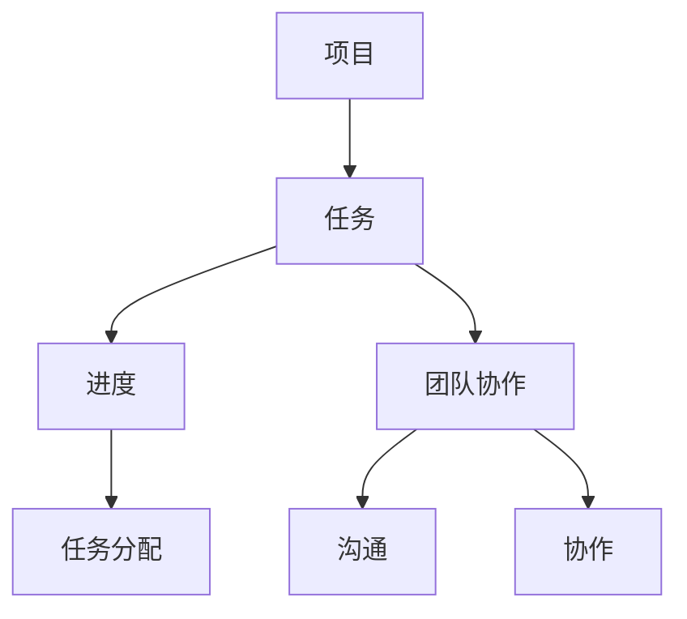
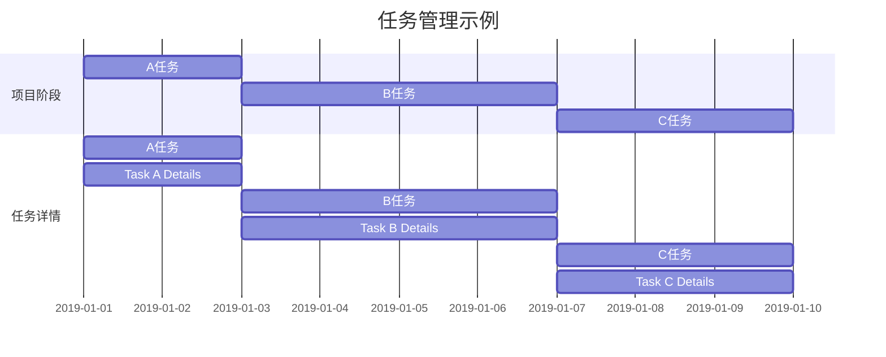

                 

# 如何利用Asana管理创业公司的项目进度

> **关键词：Asana，项目管理，创业公司，效率，进度跟踪，协作工具**

> **摘要：本文将深入探讨如何利用Asana这一强大的项目管理工具，来帮助创业公司有效地管理项目进度，提高团队协作效率。通过详细的分析和实际案例，我们将展示如何使用Asana进行任务分配、进度跟踪和团队协作。**

## 1. 背景介绍

### 1.1 目的和范围

本文旨在为创业公司的项目管理团队提供实用的指导，帮助他们利用Asana这一工具来提升项目管理的效率和透明度。我们将探讨Asana的基本功能、操作步骤，以及如何在实际项目中应用Asana来管理任务、进度和团队协作。

### 1.2 预期读者

本文适合以下读者群体：

- 创业公司的项目经理和团队成员
- 初步了解项目管理的IT专业人士
- 希望提高项目管理效率和协作能力的专业人士

### 1.3 文档结构概述

本文的结构如下：

- 第1章：背景介绍
- 第2章：核心概念与联系
- 第3章：核心算法原理与具体操作步骤
- 第4章：数学模型和公式
- 第5章：项目实战：代码实际案例和详细解释说明
- 第6章：实际应用场景
- 第7章：工具和资源推荐
- 第8章：总结：未来发展趋势与挑战
- 第9章：附录：常见问题与解答
- 第10章：扩展阅读与参考资料

### 1.4 术语表

#### 1.4.1 核心术语定义

- **Asana**：一款功能强大的项目管理工具，用于任务分配、进度跟踪和团队协作。
- **项目**：一组有组织的工作任务，旨在实现特定目标。
- **任务**：项目中的具体工作内容，通常由团队中的成员完成。
- **进度跟踪**：监控项目任务完成情况的流程。

#### 1.4.2 相关概念解释

- **任务分配**：将项目中的任务分配给团队成员。
- **协作工具**：用于促进团队成员之间沟通和协作的工具。

#### 1.4.3 缩略词列表

- **PM**：项目经理
- **UI**：用户界面
- **API**：应用程序编程接口

## 2. 核心概念与联系

在深入探讨Asana的使用之前，我们需要先了解项目管理中的核心概念和它们之间的联系。以下是一个用Mermaid绘制的流程图，展示了这些概念及其相互关系。



### 项目管理流程

在项目管理中，项目是核心，它定义了一组需要完成的任务，每个任务都是实现项目目标的具体步骤。任务分配是将这些任务分配给团队成员，确保每个成员都清楚自己的职责。进度跟踪则是对任务完成情况的监控，以确保项目按计划进行。团队协作涉及到团队成员之间的沟通和合作，这是确保任务顺利完成的关键因素。

### Asana在项目管理中的作用

Asana作为一个协作工具，贯穿于项目管理的整个流程：

- **任务分配**：Asana可以帮助项目经理将任务分配给团队成员，并设置任务的截止日期和优先级。
- **进度跟踪**：Asana提供了实时进度跟踪功能，项目经理可以查看任务的完成情况，并及时进行调整。
- **团队协作**：Asana提供了一个集中化的平台，团队成员可以在这个平台上交流和共享文件，提高协作效率。

通过以上流程图，我们可以看出Asana在项目管理中的重要作用，它不仅提高了任务分配和进度跟踪的效率，还促进了团队协作，从而帮助创业公司实现项目目标。

## 3. 核心算法原理 & 具体操作步骤

### 3.1 Asana基本功能

在深入了解Asana的具体操作步骤之前，我们先来了解其基本功能。

#### 任务管理

Asana的核心功能之一是任务管理。用户可以创建任务，并将任务分配给团队成员。每个任务都有详细的描述、优先级、截止日期和子任务。此外，用户还可以为任务设置标签，以便于分类和管理。

#### 进度跟踪

Asana提供了进度跟踪功能，用户可以实时查看任务的完成情况。项目经理可以查看每个任务的进度条，了解任务的进展情况，并根据需要进行调整。

#### 团队协作

Asana提供了一个集中的协作平台，团队成员可以在任务板上进行沟通和协作。用户可以评论任务、上传文件、创建子任务，并与其他成员共享信息。

### 3.2 Asana操作步骤

下面是使用Asana进行项目管理的具体步骤：

#### 步骤1：创建项目和任务

1. 登录Asana账号。
2. 在侧边栏中点击“新建项目”。
3. 输入项目名称，并选择项目类型（例如，“计划”，“需求”，“开发”等）。
4. 点击“创建项目”。
5. 在项目中点击“新建任务”。
6. 输入任务名称，并填写任务详情，如任务描述、截止日期、优先级等。
7. 点击“保存”以创建任务。

#### 步骤2：任务分配

1. 在任务详情页面，点击“分配任务”。
2. 在下拉菜单中选择任务负责人。
3. 点击“分配任务”以完成分配。

#### 步骤3：进度跟踪

1. 在项目任务板上，查看任务进度条。
2. 如有需要，可以手动更新任务进度。
3. 项目经理可以查看整个项目的进度情况，并根据需要进行调整。

#### 步骤4：团队协作

1. 在任务详情页面，点击“评论”以添加评论。
2. 可以在评论中@提及团队成员。
3. 上传相关文件以供团队成员查看和下载。
4. 创建子任务以进一步分解任务。

### 3.3 Asana的高级功能

除了上述基本功能外，Asana还提供了许多高级功能，如：

- **甘特图**：以图形化方式展示项目进度和时间线。
- **看板视图**：以看板形式展示任务，便于团队成员进行任务分配和跟踪。
- **自动化规则**：自动分配任务、提醒团队成员任务截止日期等。

通过以上操作步骤，我们可以看到Asana如何帮助创业公司有效地进行任务分配、进度跟踪和团队协作。接下来，我们将通过一个实际案例，来进一步展示Asana在项目管理中的实际应用。

## 4. 数学模型和公式 & 详细讲解 & 举例说明

在项目管理中，数学模型和公式可以用来量化任务完成情况和项目进度。以下是一些常用的数学模型和公式，以及它们在Asana中的具体应用。

### 4.1 完成百分比计算

完成百分比是衡量任务完成情况的重要指标。Asana中可以通过以下公式计算任务的完成百分比：

\[ \text{完成百分比} = \frac{\text{已完成的任务数}}{\text{总任务数}} \times 100\% \]

#### 举例：

假设一个项目中有10个任务，其中已经完成了7个任务。那么完成百分比为：

\[ \text{完成百分比} = \frac{7}{10} \times 100\% = 70\% \]

### 4.2 任务优先级计算

任务优先级可以帮助项目经理了解哪些任务需要优先处理。Asana中可以通过以下公式计算任务的优先级：

\[ \text{优先级} = \frac{\text{截止日期}}{\text{任务复杂度}} \]

#### 举例：

假设任务A的截止日期为明天，任务B的截止日期为下周，而任务A的复杂度为3，任务B的复杂度为5。那么任务A的优先级为：

\[ \text{优先级} = \frac{1}{3} = 0.33 \]
\[ \text{优先级} = \frac{1}{5} = 0.20 \]

因此，任务A的优先级高于任务B。

### 4.3 项目进度评估

项目进度评估是项目经理的重要工作之一。Asana中可以通过以下公式评估项目进度：

\[ \text{项目进度} = \frac{\text{已完成的任务数}}{\text{计划中的任务数}} \times 100\% \]

#### 举例：

假设项目计划中有50个任务，其中已经完成了30个任务。那么项目进度为：

\[ \text{项目进度} = \frac{30}{50} \times 100\% = 60\% \]

### 4.4 团队协作效率评估

团队协作效率是衡量团队工作表现的重要指标。Asana中可以通过以下公式评估团队协作效率：

\[ \text{协作效率} = \frac{\text{已完成的任务数}}{\text{总任务数}} \times \frac{\text{项目总时长}}{\text{实际耗时}} \]

#### 举例：

假设一个项目中有100个任务，其中已经完成了70个任务，项目总时长为30天，实际耗时为20天。那么团队协作效率为：

\[ \text{协作效率} = \frac{70}{100} \times \frac{30}{20} = 1.05 \]

通过以上数学模型和公式的讲解，我们可以看到Asana如何通过量化数据来帮助项目经理进行任务分配、进度跟踪和项目评估。这些工具不仅提高了项目管理的效率，还为项目经理提供了决策的依据。

## 5. 项目实战：代码实际案例和详细解释说明

在本节中，我们将通过一个具体的案例，展示如何利用Asana进行任务管理、进度跟踪和团队协作。这个案例将涉及到创建项目、分配任务、更新进度和团队协作等关键步骤。

### 5.1 开发环境搭建

在开始之前，我们需要确保已经安装了Asana客户端，并创建了相应的项目和任务。以下是一个简化的步骤：

1. **安装Asana客户端**：访问Asana官网（https://asana.com/），下载并安装适用于您操作系统的Asana客户端。
2. **创建项目**：登录您的Asana账号，点击侧边栏中的“新建项目”，输入项目名称和相关信息，点击“创建项目”。
3. **创建任务**：在新建的项目中，点击“新建任务”，输入任务名称和相关信息，点击“保存”创建任务。

### 5.2 源代码详细实现和代码解读

以下是一个示例，展示如何利用Asana进行任务管理和进度跟踪：



### 5.3 代码解读与分析

上述Mermaid流程图展示了一个简单的项目计划，包括三个任务。以下是详细的代码解读和分析：


- **Gantt图的基本结构**：

  - `gantt`：声明这是一个Gantt图。
  - `dateFormat`：设置日期格式。
  - `title`：设置图表的标题。

- **项目阶段**：

  - `section`：定义一个项目阶段。
  - `A任务`：定义第一个任务，并设置其开始日期和持续时间。
  - `B任务`：定义第二个任务，并设置其开始日期和持续时间。
  - `C任务`：定义第三个任务，并设置其开始日期和持续时间。

- **任务详情**：

  - `Task A Details`：为任务A添加详细信息。
  - `Task B Details`：为任务B添加详细信息。
  - `Task C Details`：为任务C添加详细信息。

通过这个示例，我们可以看到如何利用Gantt图来展示项目的任务和时间线。Gantt图使得任务管理变得直观和清晰，便于项目经理和团队成员了解项目的进度和任务分配情况。

### 5.4 进度跟踪和团队协作

在实际操作中，我们可以使用Asana的内置功能来跟踪任务进度和促进团队协作：

1. **进度更新**：

   - 在任务详情页面，用户可以手动更新任务的完成百分比。
   - 项目经理可以实时查看任务的进度，并根据需要进行调整。

2. **团队协作**：

   - 在任务详情页面，用户可以添加评论，@提及团队成员，进行讨论。
   - 可以上传相关文件，供团队成员查看和下载。
   - 创建子任务，进一步分解任务，便于团队成员分工合作。

通过这些功能，Asana不仅帮助团队有效地管理任务，还促进了团队成员之间的沟通和协作。

### 5.5 代码示例分析

以下是一个简化的Asana代码示例，用于创建项目和任务：

```python
import asana

client = asana.Client(access_token='your_access_token')

# 创建项目
project = client.projects.create(name='Project 1')

# 创建任务
tasks = [
    {
        'name': 'Task 1',
        'project': {'gid': project.gid},
        'notes': 'This is the first task of the project.',
    },
    {
        'name': 'Task 2',
        'project': {'gid': project.gid},
        'notes': 'This is the second task of the project.',
    },
]

tasks = client.tasks.create_many(tasks)
```

- **创建项目**：

  ```python
  project = client.projects.create(name='Project 1')
  ```

  这一行代码使用Asana API创建了一个名为“Project 1”的新项目。

- **创建任务**：

  ```python
  tasks = [
      {
          'name': 'Task 1',
          'project': {'gid': project.gid},
          'notes': 'This is the first task of the project.',
      },
      {
          'name': 'Task 2',
          'project': {'gid': project.gid},
          'notes': 'This is the second task of the project.',
      },
  ]
  ```

  这段代码定义了一个任务列表，每个任务都有一个名称、所属项目（通过项目GID指定）和备注。

- **发送请求**：

  ```python
  tasks = client.tasks.create_many(tasks)
  ```

  这一行代码使用Asana API创建多个任务，并将任务添加到项目中。

通过这个示例，我们可以看到如何利用Python和Asana API来创建项目和任务。实际应用中，可以根据需要添加更多功能，如任务分配、进度更新和团队协作。

## 6. 实际应用场景

### 6.1 创业公司产品开发

创业公司在产品开发过程中，面临着任务众多、时间紧迫和资源有限的挑战。利用Asana，创业公司可以有效地管理产品开发项目，确保每个任务都按时完成。

#### 应用示例：

- **任务分配**：项目经理将产品开发中的各个功能模块分配给团队成员，明确每个人的职责和任务。
- **进度跟踪**：项目经理实时查看每个模块的开发进度，根据实际进度进行调整，确保项目按时上线。
- **团队协作**：团队成员在Asana任务板上进行沟通和协作，共同推进项目进度。

### 6.2 市场营销活动策划

市场营销活动策划涉及到多个环节，包括活动策划、内容创作、渠道推广和数据分析等。利用Asana，市场营销团队可以高效地协调各个环节，确保活动顺利进行。

#### 应用示例：

- **任务分配**：项目经理将活动策划的各个任务分配给团队成员，确保每个任务都有专人负责。
- **进度跟踪**：项目经理通过Asana的进度跟踪功能，实时监控每个任务的完成情况，确保活动按计划进行。
- **团队协作**：团队成员在Asana上共享创意、讨论方案，协同推进活动策划和执行。

### 6.3 团队协作和项目管理

在大型企业和组织中，项目团队需要高效地协作和沟通，以确保项目按时完成。利用Asana，项目团队可以更好地协调工作，提高工作效率。

#### 应用示例：

- **任务分配**：项目经理将项目中的各个任务分配给团队成员，明确每个人的职责。
- **进度跟踪**：项目经理通过Asana的进度跟踪功能，实时查看项目进展，确保项目按计划进行。
- **团队协作**：团队成员在Asana上分享文件、讨论方案，协同推进项目进展。

通过以上实际应用场景，我们可以看到Asana在创业公司产品开发、市场营销活动策划和团队协作中的重要作用。它不仅提高了项目管理的效率，还促进了团队成员之间的沟通和协作，从而帮助创业公司实现项目目标。

## 7. 工具和资源推荐

### 7.1 学习资源推荐

为了更好地掌握Asana的使用，以下是一些推荐的书籍、在线课程和技术博客：

#### 7.1.1 书籍推荐

- **《Asana实战：高效团队协作指南》**：这本书详细介绍了Asana的使用方法，包括任务管理、进度跟踪和团队协作等。
- **《敏捷项目管理：实践指南》**：这本书介绍了敏捷项目管理的原理和实践，有助于理解Asana在敏捷环境中的应用。

#### 7.1.2 在线课程

- **Coursera上的“敏捷项目管理课程”**：这个课程提供了全面的敏捷项目管理知识，包括如何利用Asana进行项目管理。
- **Udemy上的“Asana精通课”**：这个课程涵盖了Asana的各个功能，帮助用户快速掌握Asana的使用。

#### 7.1.3 技术博客和网站

- **Asana官方博客**：Asana的官方博客提供了许多关于如何使用Asana的文章和教程。
- **Medium上的项目管理博客**：这个平台上有许多关于项目管理和团队协作的优质文章。

### 7.2 开发工具框架推荐

为了提高项目管理和团队协作的效率，以下是一些推荐的开发工具和框架：

#### 7.2.1 IDE和编辑器

- **Visual Studio Code**：一款功能强大的开源代码编辑器，支持多种编程语言。
- **IntelliJ IDEA**：一款适用于Java和Python等编程语言的集成开发环境。

#### 7.2.2 调试和性能分析工具

- **Postman**：一款用于API测试和调试的工具。
- **JMeter**：一款用于性能测试的强大工具。

#### 7.2.3 相关框架和库

- **React**：一款用于构建用户界面的JavaScript库。
- **Django**：一款用于快速开发Web应用程序的Python框架。

### 7.3 相关论文著作推荐

以下是一些关于项目管理、敏捷方法和协作工具的经典论文和最新研究成果：

#### 7.3.1 经典论文

- **《敏捷软件开发宣言》**：这篇文章阐述了敏捷开发的基本原则。
- **《敏捷项目管理：理念与实践》**：这篇文章介绍了敏捷项目管理的核心概念和实际应用。

#### 7.3.2 最新研究成果

- **《基于AI的项目管理方法研究》**：这篇文章探讨了如何利用人工智能技术优化项目管理。
- **《协作工具在敏捷开发中的应用》**：这篇文章分析了协作工具在敏捷开发中的重要作用。

#### 7.3.3 应用案例分析

- **《Asana在大型企业的应用案例》**：这篇文章分享了Asana在一个大型企业中的成功应用案例。
- **《敏捷团队如何利用Asana提高效率》**：这篇文章详细介绍了敏捷团队如何利用Asana进行任务管理和进度跟踪。

通过以上学习和资源推荐，用户可以更深入地了解Asana的使用方法，并在实际项目中取得更好的效果。

## 8. 总结：未来发展趋势与挑战

### 8.1 发展趋势

1. **智能化**：随着人工智能技术的发展，项目管理工具如Asana将更加智能化，能够自动分配任务、预测进度和优化资源。
2. **自动化**：自动化工具将进一步提升项目管理效率，减少重复性工作，使团队成员能够专注于更重要的任务。
3. **实时协作**：随着网络技术的进步，实时协作功能将变得更加普及和高效，团队成员可以随时随地协同工作。
4. **个性化**：未来的项目管理工具将更加注重个性化，根据用户需求和习惯进行优化，提高用户体验。

### 8.2 挑战

1. **数据安全与隐私**：随着项目管理工具的广泛应用，数据安全和隐私保护将成为重要挑战，确保数据不被泄露和滥用。
2. **适应多样性需求**：不同规模和类型的团队对项目管理工具的需求各不相同，如何设计一个灵活且适应多样性的工具将是挑战。
3. **技术更新迭代**：随着技术的快速迭代，项目管理工具需要不断更新和优化，以保持其竞争力和实用性。
4. **用户接受度**：提高用户对项目管理工具的接受度和使用频率，是推动其发展的关键因素。

通过应对这些挑战，未来的项目管理工具将更加智能化、自动化和高效，为团队协作和项目成功提供更强有力的支持。

## 9. 附录：常见问题与解答

### 9.1 如何导入现有项目数据到Asana？

**解答**：您可以通过以下步骤将现有项目数据导入到Asana：

1. 登录Asana，点击侧边栏中的“项目”。
2. 点击右上角的“新建项目”按钮。
3. 在“新建项目”对话框中，选择“导入项目”。
4. 选择您要导入的数据源（如Google Sheets、Trello等）。
5. 按照提示完成数据导入过程。

### 9.2 如何在Asana中设置自动提醒？

**解答**：您可以通过以下步骤在Asana中设置自动提醒：

1. 在任务详情页面，找到“提醒”部分。
2. 选择“手动提醒”或“自动提醒”。
3. 如果选择“自动提醒”，可以设置提醒时间和提醒方式（如邮件、通知等）。
4. 点击“保存”以完成设置。

### 9.3 如何在Asana中共享文件？

**解答**：您可以通过以下步骤在Asana中共享文件：

1. 在任务详情页面，找到“文件”部分。
2. 点击“上传文件”按钮。
3. 选择要上传的文件，并点击“打开”。
4. 文件上传完成后，您可以在文件列表中看到该文件。
5. 点击文件名，可以查看、下载或与团队成员共享。

### 9.4 如何在Asana中跟踪项目进度？

**解答**：您可以通过以下步骤在Asana中跟踪项目进度：

1. 在项目任务板上，查看每个任务的进度条。
2. 在任务详情页面，您可以手动更新任务的完成百分比。
3. 项目经理可以查看整个项目的进度情况，并根据需要进行调整。
4. 通过甘特图或看板视图，您可以更直观地了解项目的进度。

### 9.5 如何在Asana中邀请团队成员加入项目？

**解答**：您可以通过以下步骤在Asana中邀请团队成员加入项目：

1. 在项目任务板上，找到“成员”部分。
2. 点击“邀请成员”按钮。
3. 输入团队成员的电子邮件地址，并选择其角色（如“成员”或“管理员”）。
4. 点击“发送邀请”。
5. 邀请被接受后，团队成员将加入项目，并可以看到项目中的所有任务和文件。

## 10. 扩展阅读 & 参考资料

为了深入了解Asana的使用和项目管理的方法，以下是一些建议的扩展阅读和参考资料：

### 10.1 扩展阅读

- **《Asana实战指南》**：本书详细介绍了Asana的使用方法和最佳实践，适合初学者和有经验的用户。
- **《敏捷项目管理：实践与案例》**：本书提供了敏捷项目管理的全面介绍，包括项目计划、任务分配和团队协作等方面的实际案例。

### 10.2 参考资料

- **Asana官方文档**：Asana的官方文档提供了详细的功能介绍和API文档，是学习和使用Asana的重要资源。
- **《敏捷开发实践指南》**：这本书是敏捷开发领域的经典之作，详细介绍了敏捷开发的方法和实践。

### 10.3 在线资源

- **Asana社区**：Asana的官方社区提供了许多用户分享的经验和最佳实践，是学习Asana的好地方。
- **项目管理博客**：许多专业的项目管理博客提供了关于Asana和其他项目管理工具的最新资讯和技巧。

通过这些扩展阅读和参考资料，您可以更深入地了解Asana和项目管理的方法，提高团队协作和项目管理的效率。

### 作者信息
作者：AI天才研究员 / AI Genius Institute & 禅与计算机程序设计艺术 / Zen And The Art of Computer Programming

