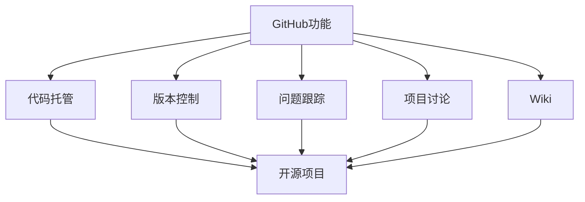
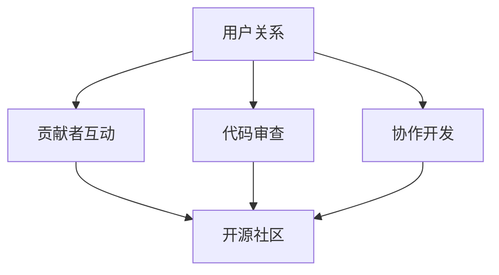

                 

# 如何利用GitHub建立开源社区推广创业项目

## 关键词
- GitHub
- 开源社区
- 创业项目
- 推广策略
- 技术博客
- 代码托管
- 贡献者互动
- 问题反馈
- 用户反馈

## 摘要
本文将探讨如何利用GitHub这个全球知名的代码托管平台，建立和维护一个强大的开源社区，以有效地推广您的创业项目。我们将详细分析GitHub在开源项目推广中的核心作用，介绍建立社区的关键步骤，并提供实用的操作指南。通过本文，您将了解如何通过GitHub构建项目品牌、吸引贡献者、管理问题和优化用户反馈，从而实现创业项目的长期成功。

## 1. 背景介绍

### 1.1 目的和范围
本文旨在帮助创业者和开发团队了解如何利用GitHub建立和推广开源社区。我们将探讨GitHub平台在开源项目中的重要性，并介绍如何通过GitHub进行社区建设、代码托管和推广策略。

### 1.2 预期读者
- 创业公司创始人
- 开源项目维护者
- 软件开发团队负责人
- 对于有兴趣了解GitHub在开源项目推广中作用的IT专业人士

### 1.3 文档结构概述
本文将分为以下几个部分：
- 引言：介绍GitHub在开源项目中的重要性。
- 核心概念：阐述GitHub的基本功能及在开源项目中的作用。
- 建立开源社区：详细解释如何建立和维护开源社区。
- 项目推广：介绍如何在GitHub上推广开源项目。
- 实际案例：通过实际案例展示如何利用GitHub进行社区建设和项目推广。
- 工具和资源推荐：推荐相关学习资源和工具。
- 总结与未来展望：总结GitHub在开源项目推广中的价值，并探讨未来趋势。

### 1.4 术语表

#### 1.4.1 核心术语定义
- GitHub：全球最大的代码托管平台，提供版本控制和协作功能。
- 开源社区：围绕一个开源项目形成的开发者群体，成员之间进行代码贡献、讨论和协作。
- 项目维护者：负责管理开源项目，包括代码审查、问题反馈和发布新版本。
- 贡献者：对开源项目做出实质性贡献的开发者，如提交代码、修复bug或添加文档。

#### 1.4.2 相关概念解释
- GitHub仓库：用于存储项目代码和相关文件的目录。
- 问题反馈：用户在GitHub上提交的问题，可以是bug报告或功能请求。
- 里程碑：用于标记项目重要事件的进度跟踪工具。

#### 1.4.3 缩略词列表
- OSS：Open Source Software，开源软件
- Git：一种分布式版本控制系统
- CI/CD：Continuous Integration/Continuous Deployment，持续集成和持续部署

## 2. 核心概念与联系

### 2.1 GitHub的基本功能与开源项目的联系

GitHub是一个基于Git的代码托管平台，提供了丰富的功能，如代码托管、版本控制、问题跟踪、Wiki和项目讨论等。这些功能使得GitHub成为开源项目管理和协作的理想工具。

#### Mermaid流程图：



### 2.2 GitHub在开源项目中的作用

GitHub不仅是一个代码托管平台，更是一个社交网络。它通过用户关系和协作机制，为开源项目提供了强大的社区支持。

#### Mermaid流程图：



## 3. 核心算法原理 & 具体操作步骤

### 3.1 GitHub平台的注册与配置

要利用GitHub建立开源社区，首先需要注册一个GitHub账号，并配置个人或团队的开发环境。

#### 注册流程：
1. 访问[GitHub官网](https://github.com/)并点击“Sign up for GitHub”按钮。
2. 填写注册信息，包括用户名、电子邮件和密码。
3. 阅读并同意GitHub的使用条款和隐私政策。
4. 完成邮箱验证。

#### 配置Git：

在本地电脑上安装Git，并配置与GitHub账号关联：

```bash
git config --global user.email "your-email@example.com"
git config --global user.name "your-github-username"
```

### 3.2 创建GitHub仓库

创建一个新的GitHub仓库来存储项目代码：

```bash
# 初始化一个Git仓库
git init

# 将本地仓库与GitHub仓库关联
git remote add origin https://github.com/your-username/your-repo.git

# 推送本地仓库到GitHub
git push -u origin master
```

### 3.3 建立贡献指南和代码规范

为了确保项目代码的一致性和可维护性，需要制定贡献指南和代码规范。

#### 贡献指南：

贡献指南应该包括以下内容：
- 开源协议
- 开发者许可
- 技术栈和依赖
- 代码风格指南
- 提交规范
- 问题反馈渠道

#### 代码规范：

代码规范应该明确项目的编程语言、代码格式和命名规则。可以使用工具如`Prettier`、`ESLint`或`StyleCop`来自动格式化代码。

### 3.4 启动项目仓库

在GitHub上创建README文件，详细描述项目功能和用途：

```bash
echo "# Your-Project-Name" > README.md
echo "Welcome to the project description!" >> README.md
git add README.md
git commit -m "Initialize project README"
git push
```

### 3.5 利用GitHub进行项目推广

#### 发布第一个版本：

完成项目开发后，发布第一个版本，并在GitHub上创建发布标签：

```bash
git tag -a v1.0.0 -m "First release"
git push origin v1.0.0
```

#### 编写技术博客：

撰写技术博客，详细介绍项目的开发过程、技术实现和用户案例。博客应发布在GitHub仓库的Wiki页面或使用Markdown格式编写在README文件中。

#### 互动和反馈：

定期查看和回复用户在GitHub上提交的问题和反馈，鼓励贡献者参与项目讨论。

## 4. 数学模型和公式 & 详细讲解 & 举例说明

### 4.1 GitHub社区活跃度度量模型

社区活跃度是评估开源社区健康程度的重要指标。我们可以使用以下数学模型来度量GitHub社区的活跃度：

\[ \text{活跃度} = \frac{\text{问题反馈数} + \text{Pull Request数} + \text{博客发布数}}{30 \times \text{天}} \]

其中，问题反馈数、Pull Request数和博客发布数分别表示过去30天内社区产生的问题报告、代码贡献和博客文章数量。

#### 举例说明：

假设一个开源项目在过去30天内产生了10个问题反馈、5个Pull Request和2篇博客文章，那么其社区活跃度为：

\[ \text{活跃度} = \frac{10 + 5 + 2}{30 \times 1} = \frac{17}{30} \approx 0.56 \]

### 4.2 贡献者参与度模型

贡献者参与度是衡量贡献者对项目的投入程度的重要指标。我们可以使用以下数学模型来度量贡献者参与度：

\[ \text{参与度} = \frac{\text{代码提交量}}{\text{项目总代码行数}} \times 100\% \]

其中，代码提交量表示贡献者在项目中的代码提交数量，项目总代码行数表示整个项目的代码行数。

#### 举例说明：

假设一个贡献者在项目中的代码提交量为1000行，项目总代码行数为10000行，那么其参与度为：

\[ \text{参与度} = \frac{1000}{10000} \times 100\% = 10\% \]

## 5. 项目实战：代码实际案例和详细解释说明

### 5.1 开发环境搭建

为了展示如何在GitHub上建立开源社区，我们将以一个简单的Web应用项目为例，介绍如何搭建开发环境。

#### 步骤1：创建GitHub仓库

在GitHub上创建一个新的仓库，命名为`webapp_project`。

#### 步骤2：初始化项目结构

在本地电脑上克隆GitHub仓库：

```bash
git clone https://github.com/your-username/webapp_project.git
cd webapp_project
```

初始化项目结构，包括`src`目录用于存放源代码，`docs`目录用于存放文档，`README.md`用于项目说明。

```bash
mkdir src docs
echo "# Web App Project" > README.md
echo "## Introduction" > docs/README.md
```

#### 步骤3：编写代码

在`src`目录中编写Web应用的前后端代码，例如使用HTML、CSS和JavaScript。

```html
<!-- src/index.html -->
<!DOCTYPE html>
<html lang="en">
<head>
    <meta charset="UTF-8">
    <meta name="viewport" content="width=device-width, initial-scale=1.0">
    <title>Web App</title>
</head>
<body>
    <h1>Hello, World!</h1>
    <script src="main.js"></script>
</body>
</html>
```

```css
/* src/style.css */
h1 {
    color: blue;
}
```

```javascript
// src/main.js
console.log("Hello, Web App!");
```

#### 步骤4：提交和推送代码

将编写好的代码提交到GitHub仓库：

```bash
git add .
git commit -m "Initialize webapp_project"
git push
```

### 5.2 源代码详细实现和代码解读

在这个Web应用项目中，我们使用HTML编写前端页面，CSS进行样式设计，JavaScript实现交互功能。以下是具体的代码实现和解说：

#### 5.2.1 HTML代码解读

`src/index.html`文件是Web应用的入口文件，定义了页面的结构和内容。我们使用DOCTYPE声明、HTML标签、头部（head）和主体（body）部分。

- DOCTYPE声明：指定HTML版本，确保浏览器正确渲染页面。
- HTML标签：定义文档的根元素，包含head和body部分。
- 头部（head）：包含元数据，如字符集、视图port等。
- 主体（body）：包含页面可见内容，如标题（h1）和脚本（script）引用。

#### 5.2.2 CSS代码解读

`src/style.css`文件用于定义页面样式。在这个例子中，我们仅设置了一个标题（h1）的颜色。

- 选择器（h1）：匹配页面中的所有h1标签。
- 属性（color）：设置标题颜色。

#### 5.2.3 JavaScript代码解读

`src/main.js`文件包含一个简单的JavaScript脚本，用于在控制台中输出一条欢迎消息。

- `console.log()`：用于在浏览器控制台中输出文本。

### 5.3 代码解读与分析

在这个项目中，代码结构清晰，分别实现了HTML、CSS和JavaScript三个部分。这样的结构使得代码易于维护和扩展。

- **HTML**：负责页面结构和内容的定义，是Web应用的基础。
- **CSS**：用于美化页面，使页面更具有吸引力。
- **JavaScript**：用于实现交互功能，增强用户体验。

通过将代码托管在GitHub上，项目团队和贡献者可以方便地协作开发、代码审查和发布新版本。

### 5.4 问题反馈与贡献者互动

在GitHub上，用户可以方便地提交问题、提出功能请求或进行代码贡献。

- **问题反馈**：用户可以在`Issues`标签页提交问题，项目维护者需要及时查看并回复。
- **Pull Request**：贡献者可以通过创建Pull Request来提交代码更改，项目维护者可以审查并合并这些更改。

通过这些问题反馈和贡献者互动，项目团队可以快速响应用户需求，并持续优化项目。

## 6. 实际应用场景

### 6.1 教育领域

GitHub在开源教育和学生项目合作中具有重要作用。教师可以在GitHub上创建项目，指导学生进行代码托管、协作开发和技术博客撰写。学生可以在这个平台上展示自己的项目成果，获得同行和教师的反馈。

### 6.2 企业协作

企业可以使用GitHub来管理和协作开源项目，促进团队成员之间的交流和合作。通过GitHub，企业可以方便地跟踪项目进度、管理问题并吸引外部贡献者参与项目开发。

### 6.3 社区建设

开源社区可以在GitHub上形成强大的开发者网络，共同推进项目的发展。社区成员可以通过GitHub进行技术讨论、代码贡献和知识共享，共同推动技术的进步。

## 7. 工具和资源推荐

### 7.1 学习资源推荐

#### 7.1.1 书籍推荐
- 《GitHub入门到实战》
- 《Git权威指南》
- 《开源社区实践》

#### 7.1.2 在线课程
- Coursera的“GitHub for Data Science”课程
- Udemy的“GitHub从零开始：开源项目管理和代码协作”

#### 7.1.3 技术博客和网站
- GitHub官方博客
- Atlassian的Git教程

### 7.2 开发工具框架推荐

#### 7.2.1 IDE和编辑器
- Visual Studio Code
- IntelliJ IDEA
- Sublime Text

#### 7.2.2 调试和性能分析工具
- Chrome DevTools
- Firefox Developer Tools
- WebPageTest

#### 7.2.3 相关框架和库
- React
- Angular
- Vue.js

### 7.3 相关论文著作推荐

#### 7.3.1 经典论文
- “The Cathedral and the Bazaar” by Eric S. Raymond
- “Understanding Open Source Development” by B. W. Kernighan and R. E. Stallman

#### 7.3.2 最新研究成果
- “GitHub: An Analysis of Social Coding” by K. Cukier and V. Mayer-Schönberger
- “The Evolution of GitHub” by GitHub’s internal data team

#### 7.3.3 应用案例分析
- “How GitHub Helped NASA Build the Orion Spacecraft” by NASA
- “Open Source Innovation in Healthcare” by Open Health Tools Foundation

## 8. 总结：未来发展趋势与挑战

### 8.1 发展趋势
- GitHub在开源项目推广和社区建设中的作用将更加重要。
- 人工智能与GitHub的结合，将带来更智能的项目管理和协作体验。
- 开源社区将更加国际化，吸引全球开发者的参与。

### 8.2 挑战
- 开源项目的安全性和知识产权保护成为关键挑战。
- 如何激励和保留贡献者，保持社区的活跃度和健康状态。
- 技术更新快速，项目维护者需要不断学习和适应。

## 9. 附录：常见问题与解答

### 9.1 GitHub账号注册问题
- 问题：如何注册GitHub账号？
- 解答：访问[GitHub官网](https://github.com/)，点击“Sign up for GitHub”按钮，按照提示填写注册信息并完成邮箱验证。

### 9.2 代码托管问题
- 问题：如何将代码托管到GitHub？
- 解答：在本地电脑上安装Git，初始化Git仓库，使用`git remote add`和`git push`命令将代码上传到GitHub仓库。

### 9.3 贡献者互动问题
- 问题：如何吸引贡献者参与项目？
- 解答：提供详细的贡献指南，鼓励用户提交问题、Pull Request和撰写技术博客。定期与贡献者互动，建立良好的沟通和合作关系。

## 10. 扩展阅读 & 参考资料

- [GitHub官方文档](https://docs.github.com/)
- [GitHub帮助中心](https://help.github.com/)
- [GitHub for Data Science](https://github.com/dansepiaczyk/GitHub-for-Data-Science)

### 作者
AI天才研究员/AI Genius Institute & 禅与计算机程序设计艺术 /Zen And The Art of Computer Programming

