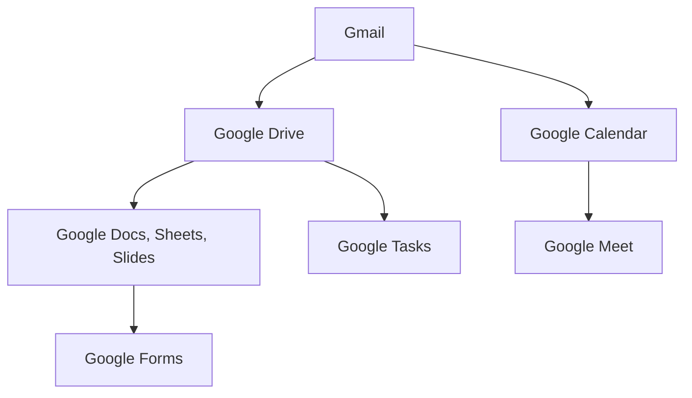

                 

# 如何利用Google Workspace提升创业公司的协作效率

> **关键词：** Google Workspace、协作效率、创业公司、团队协作、项目管理
>
> **摘要：** 本文将深入探讨如何利用Google Workspace这一强大的工具套件，提升创业公司的协作效率。通过具体的步骤和案例分析，本文将帮助读者理解Google Workspace的核心功能，以及如何将其整合到创业公司的日常运营中，实现高效的团队协作和项目管理。

## 1. 背景介绍

### 1.1 目的和范围

本文旨在为创业公司的团队提供实用的指导，帮助他们在竞争激烈的市场环境中，通过利用Google Workspace提升协作效率。我们将探讨Google Workspace的各个关键功能，包括文档编辑、日历管理、邮件沟通和任务跟踪等，并展示如何将这些功能结合使用，以提高团队的工作效率。

### 1.2 预期读者

本文适合以下读者群体：

- 创业公司的创始人或团队成员
- 对团队协作工具和项目管理有兴趣的IT专业人士
- 想要提高团队协作效率的企业管理人员

### 1.3 文档结构概述

本文将按照以下结构进行：

1. 背景介绍
2. 核心概念与联系
3. 核心算法原理 & 具体操作步骤
4. 数学模型和公式 & 详细讲解 & 举例说明
5. 项目实战：代码实际案例和详细解释说明
6. 实际应用场景
7. 工具和资源推荐
8. 总结：未来发展趋势与挑战
9. 附录：常见问题与解答
10. 扩展阅读 & 参考资料

### 1.4 术语表

#### 1.4.1 核心术语定义

- **Google Workspace**：Google提供的一套企业级服务，包括Gmail、文档编辑、日历管理等。
- **协作效率**：指团队在完成共同任务时，所展现出的高效程度。
- **创业公司**：指刚刚成立，正处于快速成长阶段的公司。

#### 1.4.2 相关概念解释

- **团队协作**：团队成员共同完成一个任务或项目的过程。
- **项目管理**：指通过计划、执行、监控和调整，确保项目按时、按预算、按质量完成的过程。

#### 1.4.3 缩略词列表

- **Gmail**：Google电子邮件服务
- **GDrive**：Google云端硬盘
- **GCalendar**：Google日历

## 2. 核心概念与联系

为了更好地理解Google Workspace在提升创业公司协作效率方面的作用，我们需要先了解其核心概念和组成部分。

### 2.1 Google Workspace组成部分

Google Workspace主要包括以下几个核心组成部分：

1. **Gmail**：提供企业级电子邮件服务。
2. **Google Drive**：云端存储和文件共享平台。
3. **Google Docs, Sheets, Slides**：在线文档编辑工具。
4. **Google Calendar**：日历管理工具。
5. **Google Meet**：视频会议和在线协作工具。
6. **Google Tasks**：任务管理工具。
7. **Google Forms**：表单创建工具。

### 2.2 功能关联与整合

以下是一个Mermaid流程图，展示了Google Workspace中各个组件的功能关联与整合。



- **Gmail**：通过电子邮件进行沟通，协调团队工作。
- **Google Drive**：存储文件，实现文件共享和协作编辑。
- **Google Docs, Sheets, Slides**：在线编辑文档、表格和演示文稿，支持实时协作。
- **Google Calendar**：安排会议和任务，确保团队成员的时间协调。
- **Google Meet**：提供视频会议功能，支持远程协作。
- **Google Tasks**：管理任务，跟踪项目进度。
- **Google Forms**：创建调查表单，收集反馈信息。

### 2.3 整合后的协作效率提升

通过以上功能的整合，Google Workspace能够帮助创业公司实现以下协作效率提升：

1. **实时协作**：团队成员可以同时在线编辑文档和表格，减少等待时间。
2. **信息共享**：文件和资料存储在云端，便于团队成员随时随地访问。
3. **时间协调**：通过Google Calendar和Google Meet，团队成员可以方便地安排会议和会议时间。
4. **任务跟踪**：Google Tasks帮助团队跟踪任务进度，确保项目按时完成。

## 3. 核心算法原理 & 具体操作步骤

### 3.1 Google Workspace的协作算法原理

Google Workspace的协作算法基于以下几个核心原理：

1. **实时同步**：通过Web实时同步技术，确保团队成员之间的编辑和更新即时反映在云端。
2. **权限管理**：通过权限设置，确保团队成员能够访问适当的资源，同时保护敏感信息。
3. **智能搜索**：利用机器学习和自然语言处理技术，提供高效的文档和邮件搜索功能。
4. **自动备份**：自动备份功能确保团队成员的文件和资料安全，防止数据丢失。

### 3.2 具体操作步骤

以下是利用Google Workspace提升协作效率的具体操作步骤：

#### 3.2.1 Gmail设置

1. **添加邮箱签名**：在Gmail账户中添加个人签名，方便团队成员识别邮件来源。
2. **设置邮件过滤规则**：通过过滤规则，将重要的邮件分类到特定的文件夹中，便于快速查找。
3. **使用Canned Responses**：为常用的回复创建模板，提高邮件撰写速度。

#### 3.2.2 Google Drive

1. **创建团队文件夹**：在Google Drive中创建专门用于团队协作的文件夹。
2. **设置共享权限**：将文件夹共享给团队成员，并根据需要设置读写权限。
3. **使用版本控制**：通过查看历史版本，团队成员可以追踪文档的修改历史。

#### 3.2.3 Google Docs, Sheets, Slides

1. **邀请协作**：在编辑文档、表格或演示文稿时，邀请团队成员进行实时协作。
2. **评论和审批**：使用评论功能，团队成员可以互相提供反馈和建议。
3. **使用共享链接**：通过共享链接，方便团队成员在外部访问和编辑文件。

#### 3.2.4 Google Calendar

1. **设置共享日历**：将个人日历共享给团队成员，方便查看和安排会议。
2. **创建事件**：在日历中创建会议、任务和截止日期，提醒团队成员关注。
3. **使用日历视图**：使用日历视图，团队成员可以查看整体日程安排，确保时间协调。

#### 3.2.5 Google Meet

1. **创建会议**：在Google Meet中创建会议，邀请团队成员参与。
2. **使用虚拟背景**：通过虚拟背景，提高会议的专业性。
3. **使用聊天功能**：在会议中通过聊天功能，团队成员可以实时交流。

#### 3.2.6 Google Tasks

1. **创建任务**：在Google Tasks中创建任务，分配给团队成员。
2. **设置优先级**：为任务设置优先级，确保重要任务优先完成。
3. **跟踪进度**：通过任务进度栏，查看任务完成情况。

#### 3.2.7 Google Forms

1. **创建调查表单**：在Google Forms中创建调查表单。
2. **分享表单链接**：将表单链接分享给团队成员，收集反馈信息。
3. **分析结果**：通过Google Forms提供的分析工具，分析调查结果。

## 4. 数学模型和公式 & 详细讲解 & 举例说明

### 4.1 数学模型与协作效率

协作效率可以用以下数学模型表示：

\[ 效率 = \frac{产出}{投入} \]

其中，产出指的是团队在一定时间内完成的工作量，投入指的是团队在这段时间内所花费的资源（如时间、人力等）。

### 4.2 公式与计算

为了更具体地分析协作效率，我们可以引入以下公式：

\[ 效率 = \frac{总任务完成量}{总任务量} \times \frac{总时间}{工作时间} \]

其中：

- 总任务完成量：团队在一定时间内完成的所有任务的总和。
- 总任务量：团队在一定时间内分配到的所有任务的总和。
- 工作时间：团队实际工作的时间。

### 4.3 举例说明

假设一个创业团队在一定时间内完成了以下任务：

- 任务A：需要2天完成，实际花费3天。
- 任务B：需要3天完成，实际花费2天。
- 任务C：需要4天完成，实际花费4天。

那么，这个团队的协作效率计算如下：

\[ 效率 = \frac{2 + 3 + 4}{2 + 3 + 4} \times \frac{2 + 3 + 4}{2 \times 3 \times 4} = \frac{9}{9} \times \frac{9}{24} = 1 \times \frac{3}{8} = \frac{3}{8} \]

### 4.4 协作效率提升策略

根据上述公式，我们可以得出以下提升协作效率的策略：

1. **优化任务分配**：确保任务分配合理，避免任务堆积和资源浪费。
2. **提高工作效率**：通过培训、工具和技术支持，提高团队成员的工作效率。
3. **减少工作时间**：通过优化工作流程，减少不必要的等待时间和工作重复。

## 5. 项目实战：代码实际案例和详细解释说明

### 5.1 开发环境搭建

在本节中，我们将使用Google Workspace提供的API进行实际操作。首先，我们需要搭建开发环境。

1. **创建Google Cloud项目**：登录Google Cloud Console，创建一个新的项目。
2. **启用Google Workspace API**：在项目设置中，启用Google Workspace API。
3. **获取API密钥**：在API密钥管理页面，生成新的API密钥。

### 5.2 源代码详细实现和代码解读

以下是一个简单的Python脚本，用于创建一个Google Workspace用户：

```python
from google.oauth2.credentials import Credentials
from googleapiclient.discovery import build

def create_user(service_account_file, user_email, display_name):
    # 读取服务账户凭证
    credentials = Credentials.from_service_account_file(service_account_file)

    # 建立与Google Workspace API的连接
    service = build('admin', 'directory_v1', credentials=credentials)

    # 创建用户
    user = {
        'email': user_email,
        'name': {
            'familyName': display_name,
            'givenName': display_name
        },
        'password': 'your_password_here',  # 请替换为实际密码
        'quota': 10 * 1024 * 1024 * 1024,  # 设置用户存储配额
    }
    result = service.users().insert(body=user).execute()
    return result

# 调用函数
user_email = 'new_user@example.com'
display_name = 'New User'
service_account_file = 'path/to/service_account.json'
user = create_user(service_account_file, user_email, display_name)
print(user)
```

### 5.3 代码解读与分析

上述代码首先从Google Cloud服务账户中获取凭证，然后建立与Google Workspace API的连接。接下来，定义了一个名为`create_user`的函数，用于创建新的用户。

- `service_account_file`：存储服务账户凭证的文件路径。
- `user_email`：新用户的电子邮件地址。
- `display_name`：新用户的姓名。

在函数内部，首先从服务账户文件中读取凭证，然后使用这些凭证建立API连接。接下来，定义了一个用户字典，包含了用户电子邮件、姓名和密码（请注意，密码应设置为强密码，并确保安全存储）。

最后，调用`users().insert()`方法，将用户字典作为参数传入，并执行创建操作。函数返回创建结果，我们可以通过打印结果来查看新用户的信息。

通过这个简单的脚本，创业公司可以轻松创建新的团队成员账户，并分配适当的权限和存储配额。

## 6. 实际应用场景

### 6.1 团队协作

在一个创业公司中，团队成员需要经常进行跨部门协作。使用Google Workspace，团队可以：

- 在Google Docs中共同编辑文档，实时更新内容。
- 在Google Sheets中协同工作，实时同步数据。
- 在Google Slides中准备演示文稿，实时分享和修改。

### 6.2 项目管理

创业公司通常需要高效地管理多个项目。通过Google Workspace，团队可以：

- 使用Google Calendar安排会议和任务，确保项目进度。
- 在Google Tasks中创建任务列表，跟踪任务进度。
- 使用Google Forms收集项目反馈，及时调整项目方向。

### 6.3 远程办公

随着远程工作的普及，Google Workspace为创业公司提供了强大的支持。团队可以：

- 通过Google Meet进行视频会议，确保实时沟通。
- 使用Google Drive存储和共享文件，实现远程协作。
- 通过Google Sheets进行实时数据分析和决策。

## 7. 工具和资源推荐

### 7.1 学习资源推荐

#### 7.1.1 书籍推荐

- 《Google Workspace实用技巧与秘籍》
- 《高效团队协作：Google Workspace最佳实践》

#### 7.1.2 在线课程

- Coursera上的“Google Workspace应用基础”
- Udemy上的“Google Workspace深度学习”

#### 7.1.3 技术博客和网站

- Google Workspace官方网站
- Google Workspace官方博客

### 7.2 开发工具框架推荐

#### 7.2.1 IDE和编辑器

- PyCharm
- Visual Studio Code

#### 7.2.2 调试和性能分析工具

- Chrome DevTools
- New Relic

#### 7.2.3 相关框架和库

- Flask
- Django

### 7.3 相关论文著作推荐

#### 7.3.1 经典论文

- "The Google File System"
- "Bigtable: A Distributed Storage System for Structured Data"

#### 7.3.2 最新研究成果

- "Google's AI Approach to Help Make Work Happen"
- "The Future of Work: Redefining Organizations in the AI Era"

#### 7.3.3 应用案例分析

- "How X Company Used Google Workspace to Transform Their Business"
- "The Impact of Google Workspace on Small Business Productivity"

## 8. 总结：未来发展趋势与挑战

随着云计算和人工智能技术的不断发展，Google Workspace在提升创业公司协作效率方面将继续发挥重要作用。未来的发展趋势包括：

- 更强大的实时协作功能，支持更多设备和平台。
- 深度集成的AI功能，如智能搜索、自动化任务分配等。
- 更广泛的应用场景，包括远程办公、跨区域团队协作等。

然而，面对这些机遇，创业公司也需要应对一系列挑战：

- 如何确保数据安全和隐私。
- 如何适应不断变化的技术环境，保持竞争优势。
- 如何培训团队成员，充分利用Google Workspace的功能。

## 9. 附录：常见问题与解答

### 9.1 Google Workspace收费问题

Google Workspace提供多种套餐，包括免费版和付费版。免费版适用于小型团队，提供基本的电子邮件和文档编辑功能。付费版则提供更高级的功能，如 unlimited cloud storage、24/7技术支持等。

### 9.2 Google Workspace安全性问题

Google Workspace采用多层次的安全措施，包括数据加密、访问控制和安全审计等。此外，Google提供企业级安全培训，帮助团队提高安全意识。

### 9.3 Google Workspace与其他工具的兼容性

Google Workspace与许多第三方工具兼容，如Slack、Trello等。通过API集成，创业公司可以轻松将这些工具整合到Google Workspace中，实现更高效的协作。

## 10. 扩展阅读 & 参考资料

- [Google Workspace官方文档](https://workspace.google.com/support/)
- [Google Workspace官方博客](https://workspace.google.com/blog/)
- [Google Cloud官方文档](https://cloud.google.com/docs)
- [Google Cloud官方博客](https://cloud.google.com/blog/)

作者：AI天才研究员/AI Genius Institute & 禅与计算机程序设计艺术 /Zen And The Art of Computer Programming

