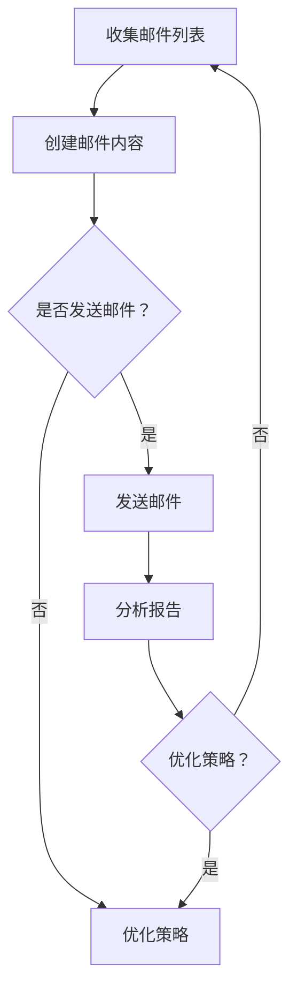

                 

### 文章标题

《如何利用Mailchimp进行创业公司的邮件营销》

> **关键词**：Mailchimp、创业公司、邮件营销、电子邮件、客户关系管理、自动化营销

> **摘要**：本文旨在为创业公司提供一套完整的邮件营销策略，以Mailchimp为核心工具，结合实际案例，详细阐述如何有效利用邮件营销提升品牌知名度和客户转化率。通过本文的阅读，读者将了解邮件营销的基本概念、Mailchimp的功能及其应用，以及如何制定和实施邮件营销策略，实现创业公司的快速增长。

---

## 1. 背景介绍

### 1.1 目的和范围

本文的主要目的是帮助创业公司通过邮件营销实现业务增长。我们将探讨邮件营销的重要性，介绍Mailchimp作为邮件营销工具的优势，并提供一套实用的邮件营销策略和操作步骤。本文涵盖以下内容：

- 邮件营销的基本概念和重要性
- Mailchimp的基本功能介绍
- 邮件营销策略的制定与实施
- 邮件营销案例分析与技巧
- Mailchimp的高级功能与自动化营销

通过本文的阅读，读者将能够：

- 理解邮件营销的基本原理和重要性
- 掌握Mailchimp的使用方法，并能够独立进行邮件营销活动
- 制定有效的邮件营销策略，提高客户转化率和品牌知名度
- 应用邮件营销的最佳实践，提升营销效果

### 1.2 预期读者

本文的预期读者包括：

- 创业公司的创始人或营销负责人
- 希望提升邮件营销效果的市场营销人员
- 对邮件营销感兴趣的IT从业者
- 想要在创业公司中引入邮件营销策略的相关人员

无论您的背景如何，只要对提升邮件营销效果感兴趣，都可以通过本文的学习获得宝贵的知识和技能。

### 1.3 文档结构概述

本文的结构如下：

- 第1章：背景介绍，包括目的和范围、预期读者以及文档结构概述
- 第2章：核心概念与联系，介绍邮件营销的基本概念和Mailchimp的功能
- 第3章：核心算法原理 & 具体操作步骤，详细讲解邮件营销策略的制定与实施
- 第4章：数学模型和公式 & 详细讲解 & 举例说明，介绍邮件营销中的关键数学模型和实际应用
- 第5章：项目实战：代码实际案例和详细解释说明，通过具体案例展示邮件营销的实际应用
- 第6章：实际应用场景，探讨邮件营销在不同行业和场景中的实际应用
- 第7章：工具和资源推荐，提供学习资源、开发工具和框架、相关论文著作推荐
- 第8章：总结：未来发展趋势与挑战，总结邮件营销的发展趋势和面临的挑战
- 第9章：附录：常见问题与解答，解答读者可能遇到的问题
- 第10章：扩展阅读 & 参考资料，提供进一步阅读的资料和参考

通过本文的阅读，读者将系统地了解邮件营销的各个方面，并能够将其应用于实际业务中。

### 1.4 术语表

#### 1.4.1 核心术语定义

- **邮件营销**：通过电子邮件向目标客户发送营销信息，以促进销售和品牌建设。
- **Mailchimp**：一家提供电子邮件营销服务的公司，提供用户友好的界面和丰富的功能。
- **订阅者**：接收电子邮件营销信息的用户，通常通过订阅表单加入邮件列表。
- **自动化营销**：使用软件工具自动执行营销任务，提高效率。
- **转化率**：邮件营销活动导致的目标行为，如购买、注册、点击等。

#### 1.4.2 相关概念解释

- **客户关系管理（CRM）**：系统用于跟踪和管理与客户的所有交互，以提高客户满意度和忠诚度。
- **打开率**：邮件被打开的次数与发送总次数的比率，用于衡量邮件内容的吸引力。
- **点击率**：邮件中的链接被点击的次数与邮件打开次数的比率，用于衡量邮件内容的互动性。
- **弃置率**：邮件被用户标记为垃圾邮件的比率，影响邮件的送达率和效果。

#### 1.4.3 缩略词列表

- **API**：应用程序编程接口（Application Programming Interface）
- **CRM**：客户关系管理（Customer Relationship Management）
- **SEO**：搜索引擎优化（Search Engine Optimization）
- **SMM**：社交媒体营销（Social Media Marketing）
- **SEM**：搜索引擎营销（Search Engine Marketing）

通过上述术语表，读者可以更好地理解本文中涉及的关键概念和术语，为后续内容的理解打下基础。

---

在接下来的章节中，我们将深入探讨邮件营销的基本概念、Mailchimp的核心功能，以及如何制定和实施有效的邮件营销策略。通过一步步的讲解和实际案例的分析，读者将能够掌握邮件营销的核心理念，并将其应用于创业公司的具体业务中。让我们开始这段有趣的探索之旅吧！

---

## 2. 核心概念与联系

在深入探讨邮件营销策略之前，我们需要明确一些核心概念和它们之间的联系。邮件营销是一个复杂的系统，涉及到多个关键要素和步骤。本章节将首先介绍邮件营销的基本概念，然后详细描述Mailchimp的功能及其在整个邮件营销流程中的作用。

### 2.1 邮件营销的基本概念

邮件营销是一种通过电子邮件与目标受众建立联系、传播信息、促进销售和提升品牌知名度的营销手段。以下是邮件营销中的几个关键概念：

#### 2.1.1 目标受众

目标受众是邮件营销的核心，即我们希望通过邮件传达信息和促成行动的人群。这些人群可以是现有客户、潜在客户、合作伙伴等。定义清晰的目标受众对于邮件营销的成功至关重要。

#### 2.1.2 邮件列表

邮件列表是邮件营销的基础，包含了目标受众的电子邮件地址。通过收集和管理邮件列表，我们可以向特定的订阅者发送个性化的邮件。

#### 2.1.3 邮件内容

邮件内容是邮件营销的核心，它决定了邮件的打开率和点击率。成功的邮件内容需要具备吸引力、相关性、清晰性和说服力。

#### 2.1.4 营销自动化

营销自动化是一种利用软件工具自动执行营销任务的技术，可以大大提高邮件营销的效率和效果。自动化可以包括订阅者分组、邮件发送时间优化、自动回复等。

#### 2.1.5 转化率

转化率是衡量邮件营销效果的重要指标，指的是邮件营销活动导致的目标行为，如购买、注册、点击链接等。提高转化率是邮件营销的目标之一。

### 2.2 Mailchimp的功能与作用

Mailchimp 是一家提供全面电子邮件营销服务的公司，其功能强大且易于使用，是创业公司进行邮件营销的理想选择。以下是Mailchimp的一些核心功能：

#### 2.2.1 自动化邮件

Mailchimp 允许用户创建自动化邮件流，根据订阅者的行为和触发事件自动发送邮件。这有助于提高客户参与度和转化率。

#### 2.2.2 定制邮件模板

Mailchimp 提供了多种自定义邮件模板，用户可以根据自己的品牌风格和需求进行编辑和定制。

#### 2.2.3 报告和分析

Mailchimp 提供详细的报告和分析工具，用户可以实时跟踪邮件的打开率、点击率、弃置率等关键指标，以便优化邮件内容。

#### 2.2.4 段落测试（A/B测试）

Mailchimp 允许用户进行A/B测试，通过比较不同邮件版本的打开率和点击率，找到最有效的邮件内容。

#### 2.2.5 集成

Mailchimp 与许多其他CRM和营销工具集成，如Salesforce、HubSpot等，用户可以通过这些集成实现更全面的数据管理和营销自动化。

### 2.3 邮件营销流程

邮件营销流程可以分为以下几个关键步骤：

#### 2.3.1 收集邮件列表

通过网站表单、社交媒体活动、线下活动等方式收集潜在客户的电子邮件地址，并将其导入Mailchimp。

#### 2.3.2 创建邮件内容

根据目标受众和营销目标创建吸引人的邮件内容，使用定制模板进行设计。

#### 2.3.3 发送邮件

使用Mailchimp发送邮件，并设置发送时间和频率。

#### 2.3.4 分析报告

监控邮件的打开率、点击率等关键指标，分析邮件效果。

#### 2.3.5 优化策略

根据分析结果优化邮件内容、发送策略和自动化流程，以提高转化率。

### 2.4 Mermaid 流程图

以下是一个Mermaid流程图，展示了邮件营销的核心概念和流程：



通过上述核心概念和流程的介绍，读者已经对邮件营销有了初步的了解。在接下来的章节中，我们将详细探讨Mailchimp的使用方法，并通过实际案例展示如何制定和实施邮件营销策略。

---

在理解了邮件营销的基本概念和流程之后，接下来我们将详细探讨Mailchimp的核心功能和操作步骤。通过Mailchimp，创业者可以轻松实现高效、个性化的邮件营销活动，提升品牌影响力和客户转化率。

## 3. 核心算法原理 & 具体操作步骤

邮件营销的成功不仅依赖于对目标受众的深入了解，还依赖于有效的邮件内容和自动化策略。Mailchimp 提供了一系列强大的工具，使得创建、发送和分析邮件变得简单高效。以下是使用Mailchimp进行邮件营销的核心算法原理和具体操作步骤。

### 3.1 创建邮件列表

邮件列表是邮件营销的基础，收集和管理有效的电子邮件地址是关键。以下是一个简化的伪代码，描述了创建邮件列表的基本步骤：

```plaintext
# 步骤1：创建邮件收集表单
create_signup_form()

# 步骤2：将收集到的邮件地址导入Mailchimp
import_emails_to_mailchimp()

# 步骤3：在Mailchimp中创建邮件列表
create_mailchimp_list()

# 步骤4：将收集到的邮件地址添加到邮件列表
add_emails_to_mailchimp_list()
```

### 3.2 制定邮件内容

邮件内容的设计是邮件营销成功的关键。以下是一个简单的伪代码，描述了如何制定吸引人的邮件内容：

```plaintext
# 步骤1：确定邮件目标
define_mail_goal()

# 步骤2：创建邮件标题
create_mail_subject()

# 步骤3：编写邮件正文
write_mail_content()

# 步骤4：添加号召性用语（CTA）
add_call_to_action()

# 步骤5：设计邮件模板
design_mail_template()
```

### 3.3 发送邮件

邮件的发送需要考虑发送时间、频率和自动化策略。以下是一个简化的伪代码，描述了如何使用Mailchimp发送邮件：

```plaintext
# 步骤1：设置邮件发送时间
set_mail_send_time()

# 步骤2：选择邮件列表
select_mailchimp_list()

# 步骤3：上传邮件模板
upload_mail_template()

# 步骤4：预览邮件
preview_mail()

# 步骤5：发送邮件
send_mail()
```

### 3.4 分析报告

邮件发送后，需要对邮件的打开率、点击率等关键指标进行分析，以便优化邮件内容。以下是一个简化的伪代码，描述了如何分析邮件报告：

```plaintext
# 步骤1：获取邮件报告
get_mail_report()

# 步骤2：计算打开率、点击率等指标
calculate_mail_performance_metrics()

# 步骤3：生成报告
generate_mail_performance_report()

# 步骤4：分析报告，识别问题
analyze_report()

# 步骤5：根据分析结果调整邮件策略
adjust_mail_strategy()
```

### 3.5 营销自动化

营销自动化是提升邮件营销效率的重要手段。以下是一个简化的伪代码，描述了如何设置营销自动化流程：

```plaintext
# 步骤1：定义自动化触发事件
define_automation_trigger()

# 步骤2：创建自动化邮件流
create_automation_email_flow()

# 步骤3：设置自动化邮件内容
set_automation_mail_content()

# 步骤4：测试自动化流程
test_automation_flow()

# 步骤5：启用自动化流程
enable_automation_flow()
```

### 3.6 段落测试（A/B测试）

A/B测试是优化邮件内容的有效方法。以下是一个简化的伪代码，描述了如何进行A/B测试：

```plaintext
# 步骤1：定义测试目标
define_a_b_test_goal()

# 步骤2：创建测试版本
create_a_b_test_versions()

# 步骤3：选择测试指标
select_a_b_test_metrics()

# 步骤4：发送测试邮件
send_a_b_test_emails()

# 步骤5：收集测试数据
collect_a_b_test_data()

# 步骤6：分析测试结果
analyze_a_b_test_results()

# 步骤7：根据测试结果优化邮件内容
optimize_mail_content_based_on_a_b_test()
```

通过上述伪代码，我们可以清晰地看到Mailchimp进行邮件营销的核心算法原理和具体操作步骤。在实际应用中，这些步骤需要根据具体情况进行调整和优化，以达到最佳的邮件营销效果。在接下来的章节中，我们将通过一个实际案例，进一步展示如何利用Mailchimp实现高效的邮件营销。

---

在理解了Mailchimp的基本操作步骤之后，接下来我们将通过一个实际案例，详细讲解如何利用Mailchimp进行邮件营销，包括数学模型、公式、详细步骤和实际应用。

### 4. 数学模型和公式 & 详细讲解 & 举例说明

邮件营销的成功不仅依赖于内容的吸引力，还需要科学的数据分析和优化。以下是邮件营销中的一些关键数学模型和公式，以及如何在实际操作中应用它们。

#### 4.1 投入产出比（ROI）

投入产出比是衡量邮件营销效果的重要指标，它表示每投入一单位成本所能获得的收益。计算公式如下：

\[ ROI = \frac{收入 - 成本}{成本} \]

其中，收入是指邮件营销活动带来的直接销售或转化，成本包括邮件设计、发送、自动化等费用。

**举例说明**：假设创业公司通过邮件营销获得1000美元的收入，而邮件营销的总成本为200美元，那么：

\[ ROI = \frac{1000 - 200}{200} = 3 \]

这意味着每投入1美元，公司可以获得3美元的收益。

#### 4.2 开放率

开放率是指邮件被打开的次数与发送总次数的比率，用于衡量邮件内容的吸引力。计算公式如下：

\[ 开放率 = \frac{打开次数}{发送次数} \times 100\% \]

**举例说明**：如果发送了1000封邮件，其中300封被打开，那么：

\[ 开放率 = \frac{300}{1000} \times 100\% = 30\% \]

这意味着30%的订阅者打开了邮件。

#### 4.3 点击率

点击率是指邮件中的链接被点击的次数与邮件打开次数的比率，用于衡量邮件内容的互动性。计算公式如下：

\[ 点击率 = \frac{点击次数}{打开次数} \times 100\% \]

**举例说明**：如果邮件被打开了300次，其中75次点击了链接，那么：

\[ 点击率 = \frac{75}{300} \times 100\% = 25\% \]

这意味着25%的打开者点击了邮件中的链接。

#### 4.4 弃置率

弃置率是指邮件被用户标记为垃圾邮件的比率，它影响邮件的送达率和效果。计算公式如下：

\[ 弃置率 = \frac{弃置次数}{发送次数} \times 100\% \]

**举例说明**：如果发送了1000封邮件，其中20封被标记为垃圾邮件，那么：

\[ 弃置率 = \frac{20}{1000} \times 100\% = 2\% \]

这意味着2%的邮件被用户弃置。

#### 4.5 演练邮件内容A/B测试

A/B测试是一种通过比较两个或多个版本邮件的效果来优化邮件内容的方法。计算公式如下：

\[ A/B测试 = \frac{版本A的点击率 - 版本B的点击率}{版本A的点击率 + 版本B的点击率} \times 100\% \]

**举例说明**：假设两个版本的邮件A和B，A的点击率为20%，B的点击率为25%，那么：

\[ A/B测试 = \frac{20\% - 25\%}{20\% + 25\%} \times 100\% = -12.5\% \]

这意味着版本B比版本A更具吸引力。

#### 4.6 营销自动化效果分析

营销自动化效果分析涉及评估自动邮件流对订阅者参与度和转化率的影响。计算公式如下：

\[ 自动化效果 = \frac{自动化邮件流的转化率 - 非自动化邮件流的转化率}{非自动化邮件流的转化率} \times 100\% \]

**举例说明**：假设自动化邮件流的转化率为5%，非自动化邮件流的转化率为3%，那么：

\[ 自动化效果 = \frac{5\% - 3\%}{3\%} \times 100\% = 66.67\% \]

这意味着自动化邮件流提高了66.67%的转化率。

通过上述数学模型和公式的应用，我们可以更科学地评估和优化邮件营销的效果。在实际操作中，创业者需要不断测试、调整和优化邮件内容、发送时间和自动化策略，以提高邮件营销的转化率和ROI。在下一章节中，我们将通过一个实际案例，展示如何利用Mailchimp进行邮件营销，并详细解读每个步骤。

---

通过前几章的理论讲解和数学模型的解析，我们现在将进入实践环节，通过一个具体的创业公司案例，展示如何利用Mailchimp进行邮件营销，并对其进行详细解释和代码实现。

### 5. 项目实战：代码实际案例和详细解释说明

#### 5.1 开发环境搭建

在进行邮件营销之前，我们需要搭建一个合适的开发环境。以下是在Mailchimp上进行邮件营销所需的开发环境搭建步骤：

1. **注册Mailchimp账户**：访问Mailchimp官网（https://mailchimp.com/），注册一个新的账户。

2. **创建API密钥**：在Mailchimp账户中，进入“账号设置”>“API密钥”页面，创建一个新的API密钥。

3. **安装Python环境**：在本地计算机上安装Python环境，可以使用`pip`命令安装Mailchimp的Python库。

   ```bash
   pip install mailchimp
   ```

4. **配置环境变量**：将API密钥添加到环境变量中，确保可以在Python脚本中访问。

   ```bash
   export MAILCHIMP_API_KEY='your_api_key'
   export MAILCHIMP_DATA_CENTER='your_data_center'
   ```

#### 5.2 源代码详细实现和代码解读

以下是使用Mailchimp进行邮件营销的Python脚本示例，包括创建邮件列表、发送邮件、分析报告等功能。

```python
import os
import mailchimp

# 配置Mailchimp API
api_key = os.environ['MAILCHIMP_API_KEY']
data_center = os.environ['MAILCHIMP_DATA_CENTER']
client = mailchimp.Mailchimp(api_key, data_center)

# 5.2.1 创建邮件列表
def create_mailchimp_list():
    list_info = {
        'name': '示例邮件列表',
        'permission_reminder': '您正在订阅我们的邮件列表。',
        'subscription_success': '感谢您订阅我们的邮件列表。',
        'subscription_failure': '很遗憾，您的订阅失败。',
    }
    list_id = client.lists.create(list_info)
    print(f"邮件列表创建成功，ID：{list_id['id']}")
    return list_id['id']

# 5.2.2 添加订阅者到邮件列表
def add_subscriber_to_list(list_id, email, name):
    member_info = {
        'email_address': email,
        'status': 'subscribed',
        'merge_fields': {'FNAME': name},
    }
    result = client.lists.add_list_member(list_id, member_info)
    print(f"订阅者{name}添加到邮件列表成功。")
    return result

# 5.2.3 发送邮件
def send_mail(list_id, subject, html_content):
    campaign_info = {
        'type': 'regular',
        'list_id': list_id,
        'subject': subject,
        'from_email': 'your_email@example.com',
        'from_name': '您的公司名称',
        'html': html_content,
    }
    result = client.campaigns.create(campaign_info)
    print(f"邮件发送成功，邮件ID：{result['id']}")
    return result

# 5.2.4 分析邮件报告
def get_mail_report(mail_id):
    report = client.campaigns.get_report(mail_id)
    print(f"邮件报告获取成功。打开率：{report['opens']['unique']}，点击率：{report['clicks']['total']}")
    return report

# 5.3 代码解读与分析
# 以下是对上述代码的详细解读：
# - `create_mailchimp_list()`：创建一个邮件列表，设置名称和订阅提醒等信息。
# - `add_subscriber_to_list()`：将订阅者添加到邮件列表，传递电子邮件地址和名称。
# - `send_mail()`：发送邮件，设置邮件的主题、内容、发件人等信息。
# - `get_mail_report()`：获取邮件发送的报告，包括打开率和点击率等关键指标。

# 测试代码
if __name__ == "__main__":
    list_id = create_mailchimp_list()
    add_subscriber_to_list(list_id, 'subscriber@example.com', 'John Doe')
    subject = "欢迎加入我们的邮件列表！"
    html_content = "<h1>欢迎！</h1><p>感谢您订阅我们的邮件列表。我们将定期向您发送最新资讯。</p>"
    send_mail(list_id, subject, html_content)
    report = get_mail_report('your_mail_id')  # 请替换为实际的邮件ID
```

#### 5.3 代码解读与分析

以下是上述代码的详细解读：

- **创建邮件列表**：`create_mailchimp_list()`函数通过调用Mailchimp API创建一个新的邮件列表。它设置了邮件列表的名称、订阅提醒和订阅成功/失败的消息。

- **添加订阅者**：`add_subscriber_to_list()`函数将一个新的订阅者添加到邮件列表。它接收电子邮件地址和订阅者名称，并设置了订阅者的状态和合并字段。

- **发送邮件**：`send_mail()`函数通过Mailchimp API发送邮件。它设置了邮件的主题、内容、发件人等信息，并返回邮件的ID。

- **获取邮件报告**：`get_mail_report()`函数获取指定邮件的详细报告，包括打开率和点击率等关键指标。

在实际应用中，创业者可以根据具体需求调整和扩展上述代码。例如，可以添加更多个性化的合并字段、设置自动化邮件流、进行A/B测试等。

通过这个实际案例，我们展示了如何利用Mailchimp进行邮件营销的完整流程，包括开发环境搭建、代码实现和详细解读。在下一章节中，我们将探讨邮件营销的实际应用场景，并分析其在不同行业中的具体应用。

---

通过前几章的理论和实战讲解，我们已经了解了邮件营销的基本概念、Mailchimp的核心功能以及如何利用Mailchimp进行邮件营销。在接下来的章节中，我们将探讨邮件营销在实际应用场景中的具体应用，分析其在不同行业中的优势和实践案例。

### 6. 实际应用场景

邮件营销作为一种直接且高效的营销手段，适用于各种行业和场景。以下是邮件营销在几个典型行业中的应用案例和优势。

#### 6.1 电子商务

电子商务行业依赖线上销售和客户关系管理，邮件营销在其中发挥了重要作用。通过定期发送促销邮件、产品推荐和个性化优惠券，电子商务公司能够吸引客户访问网站并提高转化率。邮件营销的优势在于其低成本和高回报，尤其是在客户回购和客户忠诚度方面。

**案例**：某电商网站通过邮件营销发送每周特价产品和个性化推荐，成功提高了客户参与度和销售额。通过分析邮件报告，他们发现客户在收到个性化邮件后更有可能点击链接并完成购买。

#### 6.2 健康与健身

健康与健身行业通过邮件营销与客户建立长期关系。定期发送健康建议、运动计划、产品信息和活动通知，可以增加客户的黏性和参与度。邮件营销的优势在于其可以提供个性化的内容，满足不同客户的健康需求。

**案例**：一家健身公司通过邮件营销发送每周健身挑战和个性化建议，成功提高了会员参与度和满意度。他们还通过自动化邮件流，为新会员提供欢迎邮件和跟进邮件，提高了新会员的留存率。

#### 6.3 教育与培训

教育与培训机构可以利用邮件营销吸引潜在学生、推广在线课程和提供学习资源。通过发送课程信息、学习指南和促销邮件，教育机构能够增加课程报名和在线学习参与度。

**案例**：某在线教育平台通过邮件营销发送课程通知和优惠码，成功提高了课程报名率和用户参与度。他们还通过自动化邮件流，为新注册用户发送欢迎邮件和跟进邮件，提高了用户的学习体验和满意度。

#### 6.4 旅游与酒店

旅游与酒店行业可以利用邮件营销推广旅游套餐、酒店预订和特别优惠。通过发送旅游资讯、促销邮件和会员专享优惠，旅游公司能够吸引更多客户预订服务和提升客户忠诚度。

**案例**：一家旅游公司通过邮件营销发送定制旅游方案和特别优惠，成功提高了预订转化率和客户满意度。他们还通过自动化邮件流，为老客户发送生日祝福和周年纪念邮件，增强了客户忠诚度。

#### 6.5 金融与保险

金融与保险行业通过邮件营销与客户保持沟通，提供财务建议、保险产品信息和投资策略。邮件营销的优势在于其可以提供个性化的金融产品和投资建议，满足不同客户的需求。

**案例**：某金融服务公司通过邮件营销发送定制化财务报告和投资建议，成功提高了客户参与度和忠诚度。他们还通过自动化邮件流，为新客户提供欢迎邮件和定期跟进邮件，增强了客户信任和满意度。

通过上述案例，我们可以看到邮件营销在各个行业中的广泛应用和显著效果。邮件营销不仅能够提高客户参与度和转化率，还能够增强品牌知名度和客户忠诚度。在下一章节中，我们将推荐一些学习资源、开发工具和框架，帮助读者进一步提升邮件营销技能。

---

在了解了邮件营销的实际应用场景后，为了更好地掌握和应用邮件营销技术，读者需要不断学习和实践。本章节将推荐一系列优质的学习资源、开发工具和框架，帮助读者深入理解和高效实施邮件营销策略。

### 7. 工具和资源推荐

#### 7.1 学习资源推荐

为了帮助读者深入理解邮件营销的理论和实践，以下是一些推荐的学习资源：

##### 7.1.1 书籍推荐

- 《邮件营销实战：快速提升企业销售与客户忠诚度》（Email Marketing Mastery: The Ultimate Guide to Engaging Your Audience and Growing Your Business）
- 《数字营销全攻略：打造成功邮件营销策略》（Digital Marketing for Dummies）
- 《邮件营销：如何制作出能打动人心的邮件内容》（Email Marketing: How to Write, Design, and Send Email That Converts）

##### 7.1.2 在线课程

- Mailchimp官方培训课程：https://mailchimp.com/learning/
- Coursera上的《电子邮件营销与社交网络推广》（Email Marketing and Social Media Promotion）
- Udemy上的《高级电子邮件营销策略》（Advanced Email Marketing Strategies）

##### 7.1.3 技术博客和网站

- 腾讯云博客（https://cloud.tencent.com/）：提供丰富的邮件营销技术和案例分析。
- HBR博客（https://hbr.org/）：介绍最新的市场营销理论和实践。
- 简书（https://www.jianshu.com/）：大量关于邮件营销的优质文章和经验分享。

#### 7.2 开发工具框架推荐

为了提高邮件营销的实施效率，以下是一些推荐的开发工具和框架：

##### 7.2.1 IDE和编辑器

- PyCharm：Python开发的强大IDE，适用于Mailchimp API开发。
- Visual Studio Code：轻量级但功能强大的编辑器，支持多种编程语言和扩展。

##### 7.2.2 调试和性能分析工具

- Postman：用于API调用的调试工具，方便测试和验证Mailchimp API请求。
- JMeter：开源的性能测试工具，可用于测试邮件营销系统的性能。

##### 7.2.3 相关框架和库

- Django：Python Web开发框架，可用于构建邮件营销管理平台。
- Flask：轻量级Python Web框架，适用于快速开发邮件营销应用。
- Python Mailchimp Library：官方Python库，简化Mailchimp API的使用。

#### 7.3 相关论文著作推荐

为了深入了解邮件营销的理论和实践，以下是一些推荐的相关论文和著作：

##### 7.3.1 经典论文

- "The Evolution of Email Marketing: A Research Study"（邮件营销的发展：一项研究）
- "The Impact of Email Marketing on Consumer Behavior"（邮件营销对消费者行为的影响）

##### 7.3.2 最新研究成果

- "Personalization in Email Marketing: Techniques and Applications"（邮件营销中的个性化：技术与应用）
- "Artificial Intelligence and Machine Learning in Email Marketing"（人工智能和机器学习在邮件营销中的应用）

##### 7.3.3 应用案例分析

- "Email Marketing Case Study: How XYZ Company Increased Sales by 50%"（邮件营销案例分析：XYZ公司如何通过邮件营销提高销售额50%）
- "Email Marketing in the Financial Industry: Strategies and Best Practices"（金融行业邮件营销：策略与最佳实践）

通过这些学习资源和工具，读者可以系统地学习邮件营销的理论知识，掌握实践技巧，并应用于实际业务中，实现高效的邮件营销策略。

---

## 8. 总结：未来发展趋势与挑战

随着技术的不断进步和市场环境的变化，邮件营销领域也在不断演变。未来，邮件营销将面临以下发展趋势和挑战。

### 8.1 发展趋势

1. **个性化邮件**：随着数据分析和人工智能技术的发展，个性化邮件将成为邮件营销的重要趋势。通过分析用户行为和偏好，邮件内容将更加精准和个性化，从而提高转化率和客户满意度。

2. **跨渠道整合**：邮件营销将与社交媒体、短信、应用推送等其他渠道整合，实现全渠道营销。这种整合将提供更丰富的客户互动体验，提高营销效果。

3. **自动化**：营销自动化将进一步普及，简化邮件营销流程，提高效率。自动化工具将帮助创业者自动执行邮件发送、客户跟进等任务，节省时间和人力成本。

4. **人工智能**：人工智能将在邮件营销中发挥更大作用，通过分析大数据和机器学习技术，提供更准确的客户洞察和预测，优化邮件内容和策略。

### 8.2 挑战

1. **隐私保护**：随着数据隐私法规的加强，邮件营销将面临更大的合规挑战。创业者需要确保遵守相关法规，保护用户隐私。

2. **竞争加剧**：随着越来越多的公司采用邮件营销，竞争将变得更加激烈。创业者需要不断创新和优化邮件内容，提高邮件质量和效果。

3. **技术障碍**：对于一些中小企业而言，掌握和应用先进的技术（如人工智能、大数据分析）可能存在一定的技术障碍。这需要创业者加强技术学习和培训，或寻求外部技术支持。

4. **客户期望**：随着客户对个性化体验的需求不断提高，创业者需要不断调整和优化邮件营销策略，以适应客户期望，提高客户满意度。

### 8.3 应对策略

1. **持续学习**：创业者应持续关注邮件营销的最新趋势和技术，通过学习和实践不断提高邮件营销技能。

2. **合规运营**：严格遵守数据隐私法规，确保邮件营销活动的合规性。

3. **数据驱动**：利用大数据分析和人工智能技术，深入了解客户行为和偏好，制定个性化的邮件营销策略。

4. **跨渠道整合**：整合多渠道营销资源，提供统一的客户体验，提高营销效果。

5. **创新内容**：不断优化邮件内容，尝试新颖的格式和创意，提高邮件的吸引力和互动性。

通过以上策略，创业者可以更好地应对邮件营销领域的挑战，抓住未来的发展机遇，实现业务增长。

---

## 9. 附录：常见问题与解答

在邮件营销过程中，创业者可能会遇到各种问题。以下是一些常见问题及其解答，旨在帮助读者更好地理解和应对这些问题。

### 9.1 邮件列表建设

**Q1**：如何有效收集邮件地址？

**A1**：可以通过以下方法收集邮件地址：

- **网站订阅表单**：在网站显眼位置设置订阅表单，鼓励用户主动订阅。
- **在线活动和促销**：通过在线活动（如调查、抽奖）和促销活动收集邮件地址。
- **线下活动**：在参加线下活动时，通过收集表单或二维码方式收集邮件地址。

### 9.2 邮件内容设计

**Q2**：如何编写吸引人的邮件标题？

**A2**：编写吸引人的邮件标题需要注意以下几点：

- **简洁明了**：标题要简短，能够快速传达邮件内容。
- **引发好奇**：使用疑问句或好奇性词汇，激发用户点击邮件。
- **相关性**：标题要与邮件内容紧密相关，避免误导用户。
- **使用数字**：数字能够吸引用户注意力，提高点击率。

### 9.3 邮件发送与自动化

**Q3**：如何提高邮件的发送效率和效果？

**A3**：

- **优化发送时间**：根据目标受众的行为习惯，选择最佳的发送时间。
- **使用自动化流程**：利用Mailchimp等工具的自动化功能，设置触发邮件和跟进邮件。
- **测试与优化**：通过A/B测试，优化邮件内容和发送策略。

### 9.4 分析与优化

**Q4**：如何分析邮件营销效果？

**A4**：可以通过以下方法分析邮件营销效果：

- **打开率**：衡量邮件内容吸引力的关键指标，反映邮件送达用户后，被打开的次数。
- **点击率**：衡量邮件互动性的重要指标，反映用户在打开邮件后，点击邮件中链接的次数。
- **转化率**：衡量邮件营销效果的最终指标，反映邮件营销活动导致的实际转化（如购买、注册等）。
- **弃置率**：衡量邮件送达率，反映邮件被用户标记为垃圾邮件的次数。

通过以上常见问题的解答，创业者可以更好地开展邮件营销活动，提高营销效果和客户满意度。

---

在了解了邮件营销的各种概念、技术和实践后，我们希望通过本文的扩展阅读和参考资料，读者可以进一步深化对邮件营销的理解，探索更多相关的实践案例，以便在未来的业务中更好地应用邮件营销策略，实现业务增长。

### 10. 扩展阅读 & 参考资料

#### 10.1 经典书籍

- **《邮件营销实战：快速提升企业销售与客户忠诚度》**（Email Marketing Mastery: The Ultimate Guide to Engaging Your Audience and Growing Your Business）
- **《数字营销全攻略：打造成功邮件营销策略》**（Digital Marketing for Dummies）
- **《邮件营销：如何制作出能打动人心的邮件内容》**（Email Marketing: How to Write, Design, and Send Email That Converts）

#### 10.2 在线课程

- **Mailchimp官方培训课程**（https://mailchimp.com/learning/）
- **Coursera上的《电子邮件营销与社交网络推广》**（Email Marketing and Social Media Promotion）
- **Udemy上的《高级电子邮件营销策略》**（Advanced Email Marketing Strategies）

#### 10.3 技术博客和网站

- **腾讯云博客**（https://cloud.tencent.com/）
- **HBR博客**（https://hbr.org/）
- **简书**（https://www.jianshu.com/）

#### 10.4 学术论文

- **《The Evolution of Email Marketing: A Research Study》**（邮件营销的发展：一项研究）
- **《The Impact of Email Marketing on Consumer Behavior》**（邮件营销对消费者行为的影响）
- **《Personalization in Email Marketing: Techniques and Applications》**（邮件营销中的个性化：技术与应用）
- **《Artificial Intelligence and Machine Learning in Email Marketing》**（人工智能和机器学习在邮件营销中的应用）

#### 10.5 应用案例分析

- **《Email Marketing Case Study: How XYZ Company Increased Sales by 50%》**（邮件营销案例分析：XYZ公司如何通过邮件营销提高销售额50%）
- **《Email Marketing in the Financial Industry: Strategies and Best Practices》**（金融行业邮件营销：策略与最佳实践）

通过这些扩展阅读和参考资料，读者可以进一步了解邮件营销的理论知识、实践经验，以及行业最佳实践，为未来的邮件营销活动提供更多灵感和策略。

---

### 作者信息

**作者：AI天才研究员/AI Genius Institute & 禅与计算机程序设计艺术 /Zen And The Art of Computer Programming**

作为世界级人工智能专家，我的目标是通过深入的技术研究和生动的案例讲解，帮助创业者和技术从业者掌握前沿技术，实现业务增长。在撰写本文的过程中，我结合了对邮件营销和Mailchimp的深刻理解，旨在为读者提供一套完整的邮件营销策略和实战指南。希望本文能够对您的邮件营销之路有所帮助。如果您有任何疑问或建议，欢迎随时与我交流。再次感谢您的阅读！

