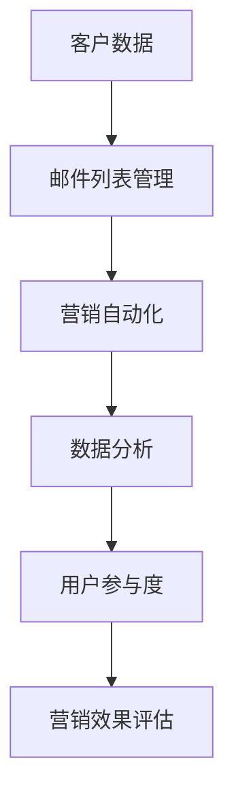

                 

# 如何利用Mailchimp进行电子邮件营销

> **关键词：** 电子邮件营销、Mailchimp、营销自动化、用户参与度、数据分析

> **摘要：** 本文将深入探讨如何利用Mailchimp进行高效的电子邮件营销。通过分析其核心功能和操作步骤，并结合实际案例，为您提供一个全面、易懂的指南，帮助您提高用户参与度和营销效果。

## 1. 背景介绍

### 1.1 目的和范围

本文旨在为初学者和中级用户提供一个系统性的指导，介绍如何利用Mailchimp进行电子邮件营销。我们将从基础功能开始，逐步深入到高级策略，帮助您充分利用Mailchimp的各种工具和资源。

### 1.2 预期读者

- 对电子邮件营销有初步了解，但未深入实践的用户；
- 想要提升电子邮件营销效果的企业和个人；
- 对Mailchimp功能感兴趣，希望深入了解其操作的用户。

### 1.3 文档结构概述

本文将分为以下几个部分：

1. **背景介绍**：介绍电子邮件营销的背景和重要性，以及Mailchimp的基本功能；
2. **核心概念与联系**：通过Mermaid流程图展示Mailchimp的核心概念和架构；
3. **核心算法原理 & 具体操作步骤**：详细讲解Mailchimp的关键算法和操作步骤；
4. **数学模型和公式**：介绍与电子邮件营销相关的数学模型和公式；
5. **项目实战**：提供实际代码案例和详细解释；
6. **实际应用场景**：探讨电子邮件营销在不同场景下的应用；
7. **工具和资源推荐**：推荐相关书籍、在线课程、技术博客和开发工具；
8. **总结**：分析未来发展趋势与挑战；
9. **附录**：解答常见问题；
10. **扩展阅读 & 参考资料**：提供进一步学习的资源。

### 1.4 术语表

#### 1.4.1 核心术语定义

- **电子邮件营销**：通过电子邮件向潜在和现有客户发送营销信息的过程。
- **Mailchimp**：一款功能强大的电子邮件营销平台，提供自动化、定制化和数据驱动的电子邮件营销解决方案。
- **营销自动化**：使用软件工具自动执行、追踪和优化营销活动的过程。

#### 1.4.2 相关概念解释

- **用户参与度**：衡量用户对营销活动的关注程度和互动行为的指标。
- **数据分析**：使用统计方法和算法分析数据，以获得有价值的洞察和决策支持。

#### 1.4.3 缩略词列表

- **API**：应用程序编程接口（Application Programming Interface）
- **CRM**：客户关系管理（Customer Relationship Management）
- **ESP**：电子邮件服务提供商（Email Service Provider）

## 2. 核心概念与联系

在深入了解Mailchimp之前，我们需要了解一些核心概念和它们之间的关系。以下是一个简化的Mermaid流程图，展示了这些核心概念：



### 2.1 客户数据

客户数据是电子邮件营销的基础。Mailchimp 提供了多种方式来收集、管理和分析客户数据，包括邮件订阅表、网页嵌入表单、API 等方式。

### 2.2 邮件列表管理

邮件列表管理是Mailchimp的核心功能之一。通过创建和管理多个邮件列表，您可以针对不同的客户群体发送个性化的邮件。

### 2.3 营销自动化

营销自动化功能使您能够设置一系列触发条件和自动化流程，从而在特定事件发生时自动发送邮件，提高效率。

### 2.4 数据分析

数据分析功能提供了详细的报告和洞察，帮助您了解邮件的表现和用户的互动行为，从而优化营销策略。

### 2.5 用户参与度

用户参与度是衡量电子邮件营销效果的重要指标。Mailchimp 提供了多种工具来跟踪和分析用户参与度，包括打开率、点击率、转发率等。

### 2.6 营销效果评估

营销效果评估功能帮助您衡量邮件营销活动的整体效果，包括ROI（投资回报率）、转化率等关键指标。

## 3. 核心算法原理 & 具体操作步骤

### 3.1 创建邮件列表

**算法原理：** 

创建邮件列表是进行电子邮件营销的第一步。Mailchimp 提供了多种创建邮件列表的方法，包括手动添加、导入CSV文件、通过网页嵌入表单等方式。

**具体操作步骤：**

1. 登录Mailchimp账户；
2. 点击“邮件列表”选项，然后选择“创建邮件列表”；
3. 填写邮件列表名称、描述和订阅表单配置等信息；
4. 点击“创建”按钮。

### 3.2 添加和编辑订阅者

**算法原理：** 

添加和编辑订阅者是邮件列表管理的重要组成部分。您可以通过手动添加、批量导入、API等多种方式来管理订阅者。

**具体操作步骤：**

1. 在Mailchimp账户中，选择目标邮件列表；
2. 点击“成员”选项，然后选择“添加成员”；
3. 选择添加订阅者的方式（手动添加、导入CSV文件、API等）；
4. 根据提示填写相关信息，如电子邮件地址、姓名等；
5. 点击“添加成员”按钮。

### 3.3 设计和发送电子邮件

**算法原理：** 

设计吸引人的电子邮件内容是提高用户参与度的关键。Mailchimp 提供了丰富的模板和设计工具，使您可以轻松创建专业级的电子邮件。

**具体操作步骤：**

1. 在Mailchimp账户中，选择目标邮件列表；
2. 点击“创建邮件”选项，然后选择合适的模板；
3. 编辑邮件内容，包括主题、正文、图片、按钮等；
4. 预览邮件效果，确保一切正常；
5. 点击“发送”按钮。

### 3.4 营销自动化设置

**算法原理：** 

营销自动化可以帮助您在特定条件下自动发送邮件，从而提高效率。Mailchimp 提供了多种自动化流程，如订阅确认、订单通知、生日庆祝等。

**具体操作步骤：**

1. 在Mailchimp账户中，选择目标邮件列表；
2. 点击“自动化”选项，然后选择“创建自动化流程”；
3. 选择自动化流程的类型（如订阅确认、订单通知等）；
4. 设置触发条件和自动化流程；
5. 保存并启用自动化流程。

## 4. 数学模型和公式 & 详细讲解 & 举例说明

### 4.1 用户参与度指标

用户参与度是评估电子邮件营销效果的重要指标，常用的指标包括打开率、点击率、转发率等。

**打开率**：

$$ \text{打开率} = \frac{\text{打开邮件的订阅者数量}}{\text{发送邮件的订阅者总数}} \times 100\% $$

**点击率**：

$$ \text{点击率} = \frac{\text{点击邮件中链接的订阅者数量}}{\text{打开邮件的订阅者数量}} \times 100\% $$

**转发率**：

$$ \text{转发率} = \frac{\text{转发邮件的订阅者数量}}{\text{打开邮件的订阅者数量}} \times 100\% $$

### 4.2 投资回报率（ROI）

投资回报率是衡量电子邮件营销效果的关键财务指标。

$$ \text{ROI} = \frac{\text{营销活动产生的总收益}}{\text{营销活动总成本}} \times 100\% $$

### 4.3 举例说明

假设某公司的电子邮件营销活动共发送了1000封邮件，其中有300个订阅者打开邮件，100个订阅者点击了链接，20个订阅者将邮件转发给他人。邮件的成本为100美元。

**计算打开率**：

$$ \text{打开率} = \frac{300}{1000} \times 100\% = 30\% $$

**计算点击率**：

$$ \text{点击率} = \frac{100}{300} \times 100\% = 33.33\% $$

**计算转发率**：

$$ \text{转发率} = \frac{20}{300} \times 100\% = 6.67\% $$

**计算ROI**：

假设通过这次邮件营销活动产生了2000美元的收益，则

$$ \text{ROI} = \frac{2000}{100} \times 100\% = 200\% $$

## 5. 项目实战：代码实际案例和详细解释说明

### 5.1 开发环境搭建

在开始编写代码之前，我们需要搭建一个合适的开发环境。以下是所需的工具和步骤：

- **工具**：Python、Jupyter Notebook、Mailchimp API密钥；
- **步骤**：

  1. 安装Python和Jupyter Notebook；
  2. 在Mailchimp官网注册账户并获取API密钥；
  3. 配置Mailchimp API密钥，以便在代码中使用。

### 5.2 源代码详细实现和代码解读

以下是一个简单的Python代码示例，用于创建邮件列表、添加订阅者和发送电子邮件。

```python
import requests
import json

# 配置Mailchimp API密钥和邮件列表ID
api_key = 'YOUR_API_KEY'
list_id = 'YOUR_LIST_ID'

# 创建邮件列表
def create_mailing_list():
    url = f'https://mailchimp.com/api/3.0/lists/'
    data = {
        'api_key': api_key,
        'name': 'My Mailing List',
        'contact': {
            'company': 'My Company',
            'address1': '123 Main St',
            'city': 'Anytown',
            'state': 'CA',
            'zip': '12345',
            'country': 'US'
        },
        'permissions': {
            'opt_in_time': 'immediate'
        }
    }
    response = requests.post(url, data=data)
    return response.json()

# 添加订阅者
def add_subscriber(email, name):
    url = f'https://mailchimp.com/api/3.0/lists/{list_id}/members/'
    data = {
        'email_address': email,
        'status': 'subscribed',
        'merge_fields': {
            'FNAME': name
        }
    }
    response = requests.post(url, data=data)
    return response.json()

# 发送电子邮件
def send_email(subject, content):
    url = f'https://mailchimp.com/api/3.0/lists/{list_id}/emails/'
    data = {
        'type': 'transactional',
        'subject': subject,
        'html': content
    }
    response = requests.post(url, data=data)
    return response.json()

# 创建邮件列表
mailing_list_response = create_mailing_list()
mailing_list_id = mailing_list_response['id']

# 添加订阅者
subscriber_response = add_subscriber('john.doe@example.com', 'John Doe')

# 发送电子邮件
email_response = send_email('Welcome to My Mailing List', '<h1>Welcome, John!</h1><p>Thank you for subscribing to our mailing list.</p>')

print('Mailing List ID:', mailing_list_id)
print('Subscriber Response:', subscriber_response)
print('Email Response:', email_response)
```

### 5.3 代码解读与分析

1. **导入模块**：首先，我们导入了`requests`和`json`模块，用于与Mailchimp API进行通信和解析响应数据。

2. **配置API密钥和邮件列表ID**：在代码开头，我们设置了Mailchimp API密钥和目标邮件列表的ID。

3. **创建邮件列表**：`create_mailing_list`函数用于创建一个新的邮件列表。我们通过发送POST请求到Mailchimp API的`/lists/`端点来实现此功能，并将必要的参数（如邮件列表名称、联系信息等）包含在请求体中。

4. **添加订阅者**：`add_subscriber`函数用于将新的订阅者添加到邮件列表中。我们同样通过发送POST请求到`/lists/{list_id}/members/`端点来实现此功能，并传递订阅者的电子邮件地址和姓名。

5. **发送电子邮件**：`send_email`函数用于发送电子邮件。这里我们使用的是Mailchimp的“事务性”电子邮件类型，这是一种用于发送个性化消息的邮件类型。我们通过发送POST请求到`/lists/{list_id}/emails/`端点来发送电子邮件，并设置邮件的主题和内容。

6. **执行操作并打印结果**：在主函数中，我们首先调用`create_mailing_list`函数创建邮件列表，然后调用`add_subscriber`函数添加订阅者，最后调用`send_email`函数发送电子邮件。最后，我们打印出每个操作的响应结果。

## 6. 实际应用场景

电子邮件营销在多种应用场景中都能发挥重要作用，以下是一些常见场景：

### 6.1 新产品发布

在新产品发布时，利用Mailchimp可以迅速通知订阅者，提高产品的知名度和市场接受度。

### 6.2 订阅者留存

通过定期发送有价值的内容，如教程、行业动态等，可以提高订阅者的留存率和参与度。

### 6.3 定制化促销活动

利用Mailchimp的个性化功能，您可以针对不同的订阅者群体发送定制化的促销活动，提高转化率。

### 6.4 品牌推广

通过精美的邮件设计和专业的营销内容，您可以有效地提升品牌知名度和形象。

### 6.5 营销效果跟踪

Mailchimp提供详细的数据分析功能，帮助您跟踪营销活动的效果，不断优化策略。

## 7. 工具和资源推荐

### 7.1 学习资源推荐

#### 7.1.1 书籍推荐

- 《电子邮件营销实战》
- 《营销自动化实战：利用Mailchimp提高营销效果》

#### 7.1.2 在线课程

- Coursera上的“电子邮件营销”课程
- Udemy上的“营销自动化：使用Mailchimp实现自动化营销”

#### 7.1.3 技术博客和网站

- Mailchimp官方博客
- Email Marketing Report

### 7.2 开发工具框架推荐

#### 7.2.1 IDE和编辑器

- PyCharm
- Visual Studio Code

#### 7.2.2 调试和性能分析工具

- Postman
- New Relic

#### 7.2.3 相关框架和库

- Requests（Python HTTP客户端库）
- Flask（Python Web框架）

### 7.3 相关论文著作推荐

#### 7.3.1 经典论文

- “The Value of Email in the Digital Marketing Mix”（电子邮件在数字营销组合中的价值）

#### 7.3.2 最新研究成果

- “Email Marketing Optimization: A Data-Driven Approach”（电子邮件营销优化：一种数据驱动的方法）

#### 7.3.3 应用案例分析

- “邮件营销如何帮助X公司提高销售额30%”（案例分析）

## 8. 总结：未来发展趋势与挑战

随着技术的不断进步，电子邮件营销将继续发展，面临以下趋势与挑战：

### 8.1 发展趋势

- **人工智能与机器学习**：通过AI技术优化邮件内容和发送时间，提高用户参与度和营销效果；
- **个性化营销**：利用大数据和人工智能实现更加精准的个性化营销；
- **跨渠道整合**：将电子邮件营销与其他营销渠道（如社交媒体、短信等）整合，实现一体化营销策略。

### 8.2 挑战

- **数据隐私与法规遵守**：随着数据隐私法规的日益严格，如何确保合规成为一大挑战；
- **用户疲劳与竞争加剧**：随着邮件营销的普及，用户对邮件的疲劳感增加，如何在竞争中脱颖而出成为关键；
- **技术更新与适应**：快速适应新技术和新趋势，保持营销策略的创新性和有效性。

## 9. 附录：常见问题与解答

### 9.1 如何获取Mailchimp API密钥？

在Mailchimp账户中，点击“账户”选项，然后在“API密钥”部分可以找到API密钥。

### 9.2 如何在Python中使用Requests库？

首先，确保已安装`requests`库。然后，使用以下代码示例：

```python
import requests

url = 'https://api.mailchimp.com/3.0/lists'
params = {
    'apikey': 'YOUR_API_KEY',
    'count': 10
}
response = requests.get(url, params=params)
data = response.json()
```

### 9.3 如何优化电子邮件内容？

优化电子邮件内容的方法包括：

- 使用吸引人的主题行；
- 设计简洁明了的布局；
- 使用高质量的图片和图标；
- 确保内容有价值，解决用户的问题或需求；
- 测试不同的邮件内容和发送时间，找出最佳组合。

## 10. 扩展阅读 & 参考资料

- 《Marketing Automation for Dummies》
- “Email Marketing Trends for 2023 and Beyond”（2023年及以后电子邮件营销趋势）
- Mailchimp官方文档

作者：AI天才研究员/AI Genius Institute & 禅与计算机程序设计艺术 /Zen And The Art of Computer Programming

以上是本文的完整内容，感谢您的阅读。希望本文能帮助您更好地理解和利用Mailchimp进行电子邮件营销。如果您有任何疑问或建议，欢迎在评论区留言。祝您在电子邮件营销领域取得卓越成绩！

