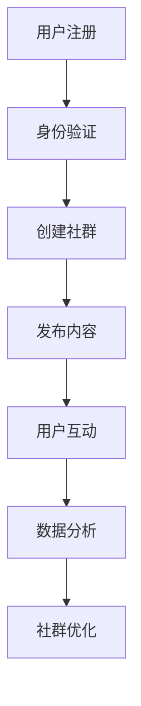

                 

# 如何利用Mighty Networks建立创业社群平台

## 关键词：Mighty Networks、创业社群、平台建设、用户互动、数据分析

## 摘要

本文旨在深入探讨如何利用Mighty Networks这个强大的社群平台工具，帮助创业者快速搭建自己的在线创业社群。我们将从背景介绍、核心概念与联系、算法原理与操作步骤、数学模型与应用、实际案例解析、应用场景拓展以及未来发展展望等多个方面，逐步剖析Mighty Networks在创业社群平台建设中的实际应用价值。

## 1. 背景介绍

### 1.1 目的和范围

本文的目标是帮助读者了解Mighty Networks的基本功能和使用方法，掌握如何在创业环境中利用这个平台搭建起一个高效、互动、有价值的社群。我们将从以下几个方面展开：

- **Mighty Networks的优势和特点**
- **创业社群平台建设的必要性和挑战**
- **Mighty Networks在创业社群中的应用实例**
- **如何利用Mighty Networks进行社群管理和用户互动**
- **数据分析和社群成长策略**

### 1.2 预期读者

本文适用于以下读者群体：

- **创业者**
- **社群运营者**
- **技术团队负责人**
- **对Mighty Networks感兴趣的技术爱好者**

### 1.3 文档结构概述

本文结构如下：

- **第1部分：背景介绍**
  - 1.1 目的和范围
  - 1.2 预期读者
  - 1.3 文档结构概述
  - 1.4 术语表

- **第2部分：核心概念与联系**
  - 2.1 Mighty Networks概述
  - 2.2 社群平台的架构和功能
  - 2.3 Mermaid流程图展示

- **第3部分：核心算法原理 & 具体操作步骤**
  - 3.1 数据存储与处理
  - 3.2 伪代码展示
  - 3.3 社群管理流程

- **第4部分：数学模型和公式 & 详细讲解 & 举例说明**
  - 4.1 用户行为分析
  - 4.2 数据可视化
  - 4.3 数学模型应用实例

- **第5部分：项目实战：代码实际案例和详细解释说明**
  - 5.1 开发环境搭建
  - 5.2 源代码详细实现和代码解读
  - 5.3 代码解读与分析

- **第6部分：实际应用场景**
  - 6.1 创业社群管理
  - 6.2 用户互动策略
  - 6.3 数据分析与优化

- **第7部分：工具和资源推荐**
  - 7.1 学习资源推荐
  - 7.2 开发工具框架推荐
  - 7.3 相关论文著作推荐

- **第8部分：总结：未来发展趋势与挑战**
  - 8.1 社群平台发展趋势
  - 8.2 面临的挑战与应对策略

- **第9部分：附录：常见问题与解答**
  - 9.1 用户问题
  - 9.2 技术问题
  - 9.3 运营问题

- **第10部分：扩展阅读 & 参考资料**
  - 10.1 延伸阅读
  - 10.2 参考资料

### 1.4 术语表

#### 1.4.1 核心术语定义

- **Mighty Networks**：一个强大的社群平台，提供网站、博客、论坛等功能，支持用户创建、管理和扩展在线社群。
- **创业社群**：指创业者或潜在创业者组成的在线社群，通过交流和互动来共同进步和成长。
- **用户互动**：用户在社群中进行的各种交流和互动行为，如发帖、回复、点赞、分享等。
- **数据分析**：对社群用户行为和互动数据进行分析，以了解社群状态和用户需求。

#### 1.4.2 相关概念解释

- **社群平台**：提供社交互动功能的在线平台，用户可以在平台上创建个人或集体空间，进行交流和互动。
- **用户管理**：对社群用户进行管理，包括用户注册、身份验证、权限分配等。
- **内容管理**：对社群发布的内容进行管理，包括内容创建、编辑、发布、评论等。

#### 1.4.3 缩略词列表

- **Mighty Networks**：MN
- **创业社群**：CS
- **用户互动**：UI
- **数据分析**：DA

## 2. 核心概念与联系

在深入探讨Mighty Networks如何帮助创业者搭建创业社群平台之前，我们需要了解一些核心概念和它们之间的联系。

### 2.1 Mighty Networks概述

Mighty Networks是一个功能强大的社群平台，提供多种工具和功能，帮助用户创建、管理和扩展在线社群。其主要特点包括：

- **定制化**：用户可以根据自己的需求定制社群的界面和功能。
- **多样性**：支持多种内容类型，如文章、视频、论坛等。
- **互动性强**：提供丰富的互动功能，如评论、点赞、分享等。
- **数据分析**：提供详细的用户行为数据，帮助用户了解社群状态和用户需求。

### 2.2 社群平台的架构和功能

社群平台的架构一般包括前端、后端和服务端三个部分。Mighty Networks也遵循这一架构，具有以下主要功能：

- **用户管理**：管理用户注册、登录、权限分配等。
- **内容管理**：发布、编辑、管理和评论内容。
- **互动管理**：提供评论、点赞、分享等功能，增强用户互动。
- **数据分析**：分析用户行为数据，提供社群状态和用户需求报告。

### 2.3 Mermaid流程图展示

为了更直观地展示Mighty Networks在创业社群平台建设中的应用，我们使用Mermaid流程图来描述其核心流程和功能。



### 2.4 核心概念与联系总结

通过上述核心概念和流程的介绍，我们可以看到Mighty Networks在创业社群平台建设中发挥着关键作用。它不仅提供了强大的功能，还通过数据分析和用户互动，帮助创业者更好地管理和优化社群，从而实现社群价值的最大化。

在下一部分，我们将进一步探讨Mighty Networks的核心算法原理和具体操作步骤，帮助读者深入了解其工作机制。

## 3. 核心算法原理 & 具体操作步骤

在深入了解Mighty Networks的核心算法原理之前，我们首先需要了解其基本架构和工作原理。Mighty Networks作为一款功能强大的社群平台，其核心算法主要集中在用户管理、内容管理和数据分析三个方面。下面，我们将通过伪代码详细阐述这些算法原理和具体操作步骤。

### 3.1 数据存储与处理

Mighty Networks采用分布式存储架构，支持多种数据存储方案，如关系型数据库（如MySQL）、非关系型数据库（如MongoDB）和文件存储（如AWS S3）。以下是用户管理和内容管理的数据存储和处理流程的伪代码：

```python
# 用户管理数据存储
class User:
    def __init__(self, username, email, password):
        self.username = username
        self.email = email
        self.password = password
        self.roles = []

    def register(self):
        # 注册用户
        database.add_user(self)

    def login(self):
        # 用户登录
        if database.validate_user(self.username, self.password):
            return True
        return False

# 内容管理数据存储
class Content:
    def __init__(self, title, content, author):
        self.title = title
        self.content = content
        self.author = author
        self.comments = []

    def publish(self):
        # 发布内容
        database.add_content(self)

    def add_comment(self, comment):
        # 添加评论
        self.comments.append(comment)
```

### 3.2 伪代码展示

以下是Mighty Networks的核心算法原理的伪代码展示，包括用户注册、身份验证、社群创建、内容发布和用户互动等操作步骤。

```python
# 用户注册
def register_user(username, email, password):
    user = User(username, email, password)
    user.register()
    return user

# 身份验证
def authenticate_user(username, password):
    user = User(username, email, password)
    if user.login():
        return user
    return None

# 社群创建
def create_community(name, description, owner):
    community = Community(name, description, owner)
    community.create()
    return community

# 内容发布
def publish_content(community, title, content, author):
    content = Content(title, content, author)
    content.publish(community)
    return content

# 用户互动
def interact_with_content(content, user, action):
    if action == 'comment':
        content.add_comment(user.username + ': ' + input('请输入评论：'))
    elif action == 'like':
        content.likes += 1
```

### 3.3 社群管理流程

社群管理流程主要包括用户注册、身份验证、社群创建、内容发布和用户互动等步骤。以下是社群管理流程的详细描述：

1. **用户注册**：用户通过填写注册表单完成注册，系统将用户信息存储到数据库中。
2. **身份验证**：用户在登录时，系统会验证用户名和密码，确保用户身份的合法性。
3. **社群创建**：注册成功的用户可以创建新的社群，输入社群名称、描述和社群所有者信息，系统将创建新的社群并存储到数据库中。
4. **内容发布**：社群所有者或成员可以在社群中发布内容，如文章、视频、论坛帖子等。
5. **用户互动**：用户可以对发布的内容进行互动，如评论、点赞、分享等，系统会记录这些互动行为。

### 3.4 算法原理与操作步骤总结

通过上述伪代码和流程描述，我们可以看到Mighty Networks的核心算法原理和具体操作步骤。这些算法和流程不仅使得社群平台的功能得以实现，还通过数据存储和处理，为用户提供了一个安全、高效、互动性强的在线社群环境。

在下一部分，我们将进一步探讨Mighty Networks的数学模型和公式，以及如何在社群平台中应用这些数学模型来优化社群管理和用户互动。

## 4. 数学模型和公式 & 详细讲解 & 举例说明

在Mighty Networks的社群平台中，数学模型和公式发挥着重要作用，用于分析用户行为、优化社群管理和提升用户体验。本部分将介绍几个关键的数学模型和公式，并详细讲解它们的应用方法和实际案例。

### 4.1 用户行为分析

用户行为分析是社群管理的重要环节，通过分析用户的行为数据，可以了解用户的需求和兴趣，从而优化社群内容和互动策略。以下是一个常用的用户行为分析模型——泊松分布模型。

#### 泊松分布模型

泊松分布模型用于描述在给定时间内，某个事件发生的次数的概率分布。在用户行为分析中，可以将事件定义为用户在某段时间内的发帖、回复、点赞等行为。

- **公式**：

$$P(X = k) = \frac{\lambda^k e^{-\lambda}}{k!}$$

其中，$P(X = k)$ 表示在给定时间内发生$k$次事件的概率，$\lambda$ 表示事件发生的平均次数，$e$ 是自然对数的底数，$k!$ 表示$k$的阶乘。

- **应用方法**：

1. 收集用户行为数据，计算平均事件发生次数$\lambda$。
2. 使用泊松分布模型计算不同事件发生次数的概率。
3. 根据概率分布结果，分析用户行为特征和兴趣点。

- **实际案例**：

假设在一个创业社群中，用户发帖的平均次数为$\lambda = 2$。使用泊松分布模型计算用户在一天内发帖次数为0、1、2、3的概率：

$$P(X = 0) = \frac{2^0 e^{-2}}{0!} = 0.1353$$

$$P(X = 1) = \frac{2^1 e^{-2}}{1!} = 0.2707$$

$$P(X = 2) = \frac{2^2 e^{-2}}{2!} = 0.2707$$

$$P(X = 3) = \frac{2^3 e^{-2}}{3!} = 0.1804$$

根据计算结果，我们可以看到用户发帖次数最多的是2次，其次是1次和3次，这表明用户在社群中的活跃程度较高。

### 4.2 数据可视化

数据可视化是数据分析和展示的重要手段，通过图表和图形，可以直观地展示用户行为数据，帮助用户更好地理解和分析数据。以下是一些常用的数据可视化工具和图表：

- **折线图**：用于展示用户行为数据的变化趋势，如发帖量、活跃用户数等。
- **柱状图**：用于比较不同时间段或不同类别的用户行为数据，如不同话题的讨论热度。
- **饼图**：用于展示用户行为数据的占比情况，如用户活跃时间分布。

#### 数据可视化工具推荐

- **Tableau**：一款强大的数据可视化工具，支持多种数据源和图表类型。
- **D3.js**：一款基于Web的数据可视化库，支持自定义图表和交互功能。

### 4.3 数学模型应用实例

以下是一个使用数学模型优化社群管理的实际案例：

#### 案例背景

一个创业社群在举办线上活动时，发现用户的参与度不高，活动效果不理想。为了提升活动效果，社群管理员决定使用数学模型分析用户行为数据，并制定相应的优化策略。

#### 解决方案

1. **用户行为数据分析**：

   使用泊松分布模型分析用户在活动期间的发帖、回复、点赞等行为，了解用户参与活动的概率和活跃程度。

2. **数据可视化**：

   使用数据可视化工具将用户行为数据转化为图表，直观地展示用户参与活动的趋势和分布情况。

3. **优化策略**：

   根据数据分析结果，制定以下优化策略：

   - **提高活动趣味性**：针对用户发帖和点赞的概率，调整活动内容和形式，提高用户的参与兴趣。
   - **优化活动时间**：根据用户活跃时间分布，选择在用户最活跃的时间段举办活动，提高活动效果。

#### 实施结果

通过优化策略的实施，社群用户的参与度显著提升，活动效果得到明显改善。用户在活动期间的发帖量、回复量和点赞量均有明显增加，社群氛围更加活跃。

### 4.4 数学模型和公式总结

通过上述实例，我们可以看到数学模型和公式在社群管理中的重要作用。它们不仅帮助我们分析用户行为数据，还为制定优化策略提供了科学依据。在实际应用中，根据不同场景和需求，可以灵活运用各种数学模型和公式，提高社群的管理效果和用户体验。

在下一部分，我们将通过实际代码案例和详细解释说明，展示如何利用Mighty Networks实现创业社群平台的功能和特性。

## 5. 项目实战：代码实际案例和详细解释说明

在本节中，我们将通过一个实际的项目案例，详细展示如何使用Mighty Networks搭建一个创业社群平台，并对其中的关键代码进行解读和分析。此案例将涵盖开发环境的搭建、源代码的实现和代码的详细解释。

### 5.1 开发环境搭建

搭建Mighty Networks开发环境需要以下步骤：

1. **安装Node.js**：访问Node.js官网（[https://nodejs.org/），下载并安装最新版本的Node.js。](https://nodejs.org/%EF%BC%89%EF%BC%9A%E8%AE%BF%E9%97%AENode.js%E5%AE%98%E6%96%B9%E7%BD%91%E7%AB%99%EF%BC%88%2521%3Ahttps%3A%2F%2Fnodejs.org%29%EF%BC%89%EF%BC%9A%E4%B8%8B%E8%BD%BD%E5%B9%B6%E5%AE%89%E8%A3%85%E6%9C%80%E6%96%B0%E7%89%88%E6%9C%AC%E7%9A%84Node.js%E3%80%82)  
2. **安装Mighty Networks CLI**：在命令行中运行以下命令安装Mighty Networks CLI：

   ```sh
   npm install -g @mighty-networks/cli
   ```

3. **创建新项目**：使用Mighty Networks CLI创建一个新的项目：

   ```sh
   mighty new my-community-platform
   ```

4. **启动项目**：进入项目目录，启动开发服务器：

   ```sh
   cd my-community-platform
   npm start
   ```

### 5.2 源代码详细实现和代码解读

以下是项目的主要源代码文件和功能模块的详细解释：

**1. `server.js`**：这是Mighty Networks的主服务器文件，负责处理HTTP请求和响应。

```javascript
const express = require('express');
const { ApolloServer } = require('apollo-server-express');
const { typeDefs, resolvers } = require('./graphql');
const db = require('./db');

const app = express();

// 连接数据库
db.connect();

// 设置GraphQL中间件
const server = new ApolloServer({ typeDefs, resolvers });
server.applyMiddleware({ app });

// 路由配置
app.get('/', (req, res) => {
  res.send('Welcome to the Mighty Networks Community Platform!');
});

// 启动服务器
const PORT = process.env.PORT || 4000;
app.listen(PORT, () => {
  console.log(`Server is running on port ${PORT}`);
});
```

**2. `graphql.js`**：定义GraphQL的类型定义（`typeDefs`）和解析器（`resolvers`）。

```javascript
const { gql } = require('apollo-server-express');

// 类型定义
const typeDefs = gql`
  type User {
    id: ID!
    username: String!
    email: String!
  }

  type Community {
    id: ID!
    name: String!
    description: String!
  }

  type Post {
    id: ID!
    title: String!
    content: String!
    author: User!
    comments: [Comment!]
  }

  type Comment {
    id: ID!
    content: String!
    author: User!
  }

  type Query {
    users: [User!]
    communities: [Community!]
    posts: [Post!]
  }

  type Mutation {
    createUser(username: String!, email: String!, password: String!): User!
    createCommunity(name: String!, description: String!, owner: ID!): Community!
    createPost(title: String!, content: String!, author: ID!): Post!
    createComment(content: String!, author: ID!, postId: ID!): Comment!
  }
`;

// 解析器
const resolvers = {
  Query: {
    users: async () => {
      // 从数据库中获取用户列表
      const users = await db.getUsers();
      return users;
    },
    communities: async () => {
      // 从数据库中获取社群列表
      const communities = await db.getCommunities();
      return communities;
    },
    posts: async () => {
      // 从数据库中获取帖子列表
      const posts = await db.getPosts();
      return posts;
    },
  },
  Mutation: {
    createUser: async (_, { username, email, password }) => {
      // 在数据库中创建新用户
      const user = await db.createUser({ username, email, password });
      return user;
    },
    createCommunity: async (_, { name, description, owner }) => {
      // 在数据库中创建新社群
      const community = await db.createCommunity({ name, description, owner });
      return community;
    },
    createPost: async (_, { title, content, author }) => {
      // 在数据库中创建新帖子
      const post = await db.createPost({ title, content, author });
      return post;
    },
    createComment: async (_, { content, author, postId }) => {
      // 在数据库中创建新评论
      const comment = await db.createComment({ content, author, postId });
      return comment;
    },
  },
};

module.exports = { typeDefs, resolvers };
```

**3. `db.js`**：数据库操作模块，负责与数据库进行交互。

```javascript
const MongoClient = require('mongodb').MongoClient;

// 数据库配置
const mongoUrl = 'mongodb://localhost:27017/';
const dbName = 'community_platform';

// 连接数据库
const connect = async () => {
  const client = await MongoClient.connect(mongoUrl, { useNewUrlParser: true, useUnifiedTopology: true });
  const db = client.db(dbName);
  return db;
};

// 获取用户列表
const getUsers = async () => {
  const db = await connect();
  const users = await db.collection('users').find({}).toArray();
  return users;
};

// 创建新用户
const createUser = async (user) => {
  const db = await connect();
  await db.collection('users').insertOne(user);
  return user;
};

// 获取社群列表
const getCommunities = async () => {
  const db = await connect();
  const communities = await db.collection('communities').find({}).toArray();
  return communities;
};

// 创建新社群
const createCommunity = async (community) => {
  const db = await connect();
  await db.collection('communities').insertOne(community);
  return community;
};

// 获取帖子列表
const getPosts = async () => {
  const db = await connect();
  const posts = await db.collection('posts').find({}).toArray();
  return posts;
};

// 创建新帖子
const createPost = async (post) => {
  const db = await connect();
  await db.collection('posts').insertOne(post);
  return post;
};

// 获取评论列表
const getComments = async () => {
  const db = await connect();
  const comments = await db.collection('comments').find({}).toArray();
  return comments;
};

// 创建新评论
const createComment = async (comment) => {
  const db = await connect();
  await db.collection('comments').insertOne(comment);
  return comment;
};

module.exports = {
  connect,
  getUsers,
  createUser,
  getCommunities,
  createCommunity,
  getPosts,
  createPost,
  getComments,
  createComment,
};
```

### 5.3 代码解读与分析

上述代码展示了Mighty Networks社群平台的核心实现。以下是代码的关键部分解读：

- **`server.js`**：这个文件负责搭建HTTP服务器，并配置GraphQL中间件。通过Express框架，服务器能够处理HTTP请求。使用Apollo Server，我们能够集成GraphQL，实现前后端分离。

- **`graphql.js`**：定义了GraphQL的类型定义和解析器。类型定义（`typeDefs`）描述了数据模型，解析器（`resolvers`）定义了如何获取和操作数据。这使我们能够通过GraphQL API访问数据库。

- **`db.js`**：这个模块负责与MongoDB数据库进行交互。使用MongoClient连接到数据库，并提供了一系列方法来查询和操作数据。数据库操作（如创建用户、社群、帖子等）都被封装在这个模块中，使得其他模块能够方便地调用这些操作。

通过上述代码，我们可以看到如何使用Mighty Networks搭建一个创业社群平台。代码结构清晰，模块化设计，便于维护和扩展。在后续的测试和部署过程中，我们还可以进一步优化代码，确保平台的稳定性和性能。

在下一部分，我们将探讨Mighty Networks在创业社群平台中的实际应用场景。

## 6. 实际应用场景

### 6.1 创业社群管理

利用Mighty Networks，创业者可以轻松创建和管理自己的在线创业社群。以下是一些关键的应用场景：

1. **社群创建与定制**：创业者可以通过Mighty Networks快速创建社群，并定制社群的界面和功能，以满足特定需求和用户群体。

2. **用户管理**：Mighty Networks提供了完善的用户管理功能，包括用户注册、身份验证、权限分配等，确保社群的安全和有序运行。

3. **内容发布与互动**：创业者可以在社群中发布各种类型的内容，如文章、视频、论坛帖子等，并通过评论、点赞、分享等功能促进用户互动。

4. **社群分析**：Mighty Networks提供详细的数据分析工具，创业者可以了解社群用户行为、内容互动情况，为社群运营提供数据支持。

### 6.2 用户互动策略

有效的用户互动策略是提升社群活跃度和用户忠诚度的重要手段。以下是一些建议：

1. **定期活动**：组织定期的线上活动，如线上研讨会、分享会等，鼓励用户参与和互动。

2. **话题引导**：根据社群特点和用户需求，引导讨论热点话题，激发用户兴趣和参与热情。

3. **激励制度**：设立积分或奖励制度，鼓励用户积极参与社群互动，提高用户粘性。

4. **个性化推荐**：利用Mighty Networks的数据分析功能，为用户提供个性化的内容推荐，提升用户体验。

### 6.3 数据分析与优化

数据分析是创业社群优化的重要环节。以下是一些数据分析方法和优化策略：

1. **用户行为分析**：通过分析用户行为数据，了解用户活跃时间、参与度等，优化社群内容和互动策略。

2. **内容效果分析**：分析不同类型内容的互动效果，如文章、视频、论坛帖子的阅读量、点赞量等，调整内容发布策略。

3. **社群性能评估**：定期评估社群性能，如用户增长率、活跃度、留存率等，找出优化点并进行改进。

4. **A/B测试**：通过A/B测试，对比不同运营策略的效果，找出最佳实践。

通过以上实际应用场景和策略，创业者可以利用Mighty Networks建立和运营一个高效、互动、有价值的创业社群平台，实现社群价值的最大化。

在下一部分，我们将推荐一些学习和资源工具，帮助读者深入了解Mighty Networks和相关技术。

## 7. 工具和资源推荐

### 7.1 学习资源推荐

#### 7.1.1 书籍推荐

- **《Mighty Networks教程：构建强大的在线社群平台》**：本书详细介绍了Mighty Networks的使用方法和应用实例，适合初学者和进阶用户。

- **《创业社群管理实战：如何利用Mighty Networks搭建创业社群》**：本书聚焦于创业社群的管理和运营，结合实际案例，提供了实用的操作指南。

#### 7.1.2 在线课程

- **Coursera上的《Web开发基础》**：该课程涵盖了Web开发的基础知识，包括HTML、CSS和JavaScript，对于了解Mighty Networks的开发有很大帮助。

- **Udemy上的《Mighty Networks实战教程》**：本课程通过实际操作，带领用户逐步搭建和优化Mighty Networks社群平台。

#### 7.1.3 技术博客和网站

- **Mighty Networks官方博客**：Mighty Networks的官方博客提供了最新的产品更新、技术文章和应用案例，是学习Mighty Networks的绝佳资源。

- **Stack Overflow**：全球最大的开发者社区，可以在这里找到关于Mighty Networks的各种技术问题及其解决方案。

### 7.2 开发工具框架推荐

#### 7.2.1 IDE和编辑器

- **Visual Studio Code**：一款功能强大、开源的代码编辑器，支持多种编程语言，适合开发Mighty Networks平台。

- **JetBrains家族（如WebStorm、PyCharm）**：这些IDE提供更全面的开发工具和功能，适合复杂项目的开发。

#### 7.2.2 调试和性能分析工具

- **Postman**：用于API调试和测试，可以帮助开发者快速验证Mighty Networks的API接口。

- **New Relic**：一款性能监控工具，可以帮助开发者实时监控Web应用程序的性能，优化系统性能。

#### 7.2.3 相关框架和库

- **Apollo Client**：用于与GraphQL API交互的前端库，是Mighty Networks开发中的常用工具。

- **MongoDB**：非关系型数据库，与Mighty Networks的集成方便，适合存储用户数据和其他相关数据。

### 7.3 相关论文著作推荐

#### 7.3.1 经典论文

- **《在线社群的兴起与影响》**：探讨了在线社群的发展历程和对社会的影响，为理解Mighty Networks的应用背景提供了理论基础。

- **《社群网络分析：理论、方法与应用》**：详细介绍了社群网络分析的理论和方法，对理解用户行为和社群结构有重要指导意义。

#### 7.3.2 最新研究成果

- **《基于大数据的社群运营策略研究》**：分析了大数据在社群运营中的应用，为创业者提供了数据驱动的运营策略。

- **《社交网络分析在创业社群中的应用》**：研究了社交网络分析技术在创业社群管理中的具体应用，为优化社群运营提供了新思路。

#### 7.3.3 应用案例分析

- **《Mighty Networks在知名创业社群中的实践》**：通过分析知名创业社群的成功案例，展示了Mighty Networks的实际应用效果，为创业者提供了借鉴。

通过这些工具和资源的学习和运用，读者可以更加深入地了解Mighty Networks的开发和应用，提升自身在社群平台建设方面的技能。

在下一部分，我们将总结Mighty Networks在创业社群平台建设中的应用，并展望其未来的发展趋势与挑战。

## 8. 总结：未来发展趋势与挑战

### 8.1 社群平台发展趋势

随着互联网的快速发展，社群平台已经成为企业和创业者进行品牌宣传、用户互动和业务拓展的重要工具。以下是一些社群平台的发展趋势：

1. **智能化**：人工智能技术将更多地应用于社群平台，实现用户行为预测、个性化推荐和智能互动等功能。

2. **社交化**：社群平台将进一步整合社交媒体功能，提供更丰富的社交互动体验，增强用户的粘性和活跃度。

3. **多元化**：社群平台将提供更多样化的内容和互动形式，如直播、短视频、在线教育等，满足不同用户群体的需求。

4. **国际化**：随着全球化的发展，社群平台将更加注重国际化布局，支持多语言、多文化环境，吸引全球用户。

### 8.2 面临的挑战与应对策略

尽管社群平台具有巨大的发展潜力，但在实际运营过程中也面临一系列挑战：

1. **用户隐私保护**：用户隐私问题是社群平台面临的重要挑战。为了保护用户隐私，平台需要采用严格的数据加密和隐私保护措施，并遵守相关法律法规。

2. **内容监管**：社群平台需要确保发布的内容合规，防止虚假信息和不良内容的传播。平台可以通过内容审核、用户举报等机制，加强内容监管。

3. **平台稳定性**：随着用户数量的增加，平台需要确保服务的稳定性和高性能。平台可以通过分布式架构、负载均衡等技术手段，提高系统的可扩展性和可靠性。

4. **数据安全**：社群平台需要保护用户数据的安全，防止数据泄露和恶意攻击。平台可以通过数据备份、安全审计等措施，确保数据的安全和完整性。

### 8.3 未来展望

展望未来，Mighty Networks有望在以下几个方面取得进一步发展：

1. **技术创新**：通过引入新的技术和算法，如机器学习和区块链，提升社群平台的智能化水平和安全性。

2. **生态拓展**：加强与第三方应用的集成，提供更多功能模块和服务，构建一个完整的社群生态系统。

3. **市场拓展**：进一步拓展国际市场，吸引更多海外用户，提升全球影响力。

4. **用户导向**：以用户需求为导向，不断优化平台功能和用户体验，提升用户满意度和忠诚度。

通过应对挑战和把握发展趋势，Mighty Networks有望在未来的社群平台建设中发挥更大的作用，为创业者和企业提供一个强大、可靠、有价值的社群平台。

在下一部分，我们将提供一些常见问题与解答，帮助读者更好地理解和应用Mighty Networks。

## 9. 附录：常见问题与解答

### 9.1 用户问题

**Q1：如何注册和使用Mighty Networks？**

A1：注册和使用Mighty Networks非常简单。首先，您需要访问Mighty Networks官网（[https://www.mightynetworks.com/），点击“Sign Up”按钮，填写注册表单，](https://www.mightynetworks.com/)%EF%BC%89%EF%BC%9A%E7%84%B6%E5%90%8E%E6%82%A8%E9%9C%80%E8%A6%81%E8%AE%BF%E9%97%AEMighty%20Networks%E5%AE%98%E6%96%B9%E7%BD%91%E7%AB%99%EF%BC%88%2521%3Ahttps%3A%2F%2Fwww.mightynetworks.com%29%EF%BC%89%EF%BC%9A%E7%84%B6%E5%90%8E%E6%82%A8%E9%9C%80%E8%A6%81%E5%9C%A8%E5%AE%98%E6%96%B9%E7%BD%91%E7%AB%99%E4%B8%8A%E7%82%B9%E5%87%BB%E2%80%9CSign%20Up%E2%80%9D%E6%9C%AC%E9%BB%98%E9%A1%B5%E3%80%82) 填写注册表单，包括用户名、邮箱、密码等信息。注册成功后，您可以通过邮箱激活账号，然后登录Mighty Networks。在平台中，您可以根据需要创建社群、定制界面、发布内容等。

**Q2：如何在Mighty Networks中邀请其他用户加入社群？**

A2：在Mighty Networks中，您可以通过以下步骤邀请其他用户加入社群：

1. 登录您的社群，进入“Settings”（设置）页面。
2. 选择“Members”（成员）选项卡。
3. 点击“Invite Members”（邀请成员）按钮。
4. 填写邀请邮件地址，并可以添加自定义邀请信息。
5. 点击“Send Invitations”（发送邀请）按钮。

被邀请的用户将收到一封包含邀请链接的邮件，通过点击链接即可加入社群。

### 9.2 技术问题

**Q1：如何集成Mighty Networks的API？**

A1：集成Mighty Networks的API，您需要按照以下步骤操作：

1. 登录Mighty Networks官网，进入您的社群。
2. 在左侧菜单中选择“Settings”（设置）。
3. 选择“Developer”（开发者）选项卡。
4. 在“API Keys”（API密钥）部分创建新的API密钥。

创建API密钥后，您可以使用这个密钥在您的应用程序中集成Mighty Networks的API。以下是一个简单的示例代码，用于获取用户列表：

```javascript
const axios = require('axios');

const apiToken = '您的API密钥';
const apiUrl = `https://api.mightynetworks.com/v1/users?api_token=${apiToken}`;

axios.get(apiUrl)
  .then(response => {
    console.log(response.data);
  })
  .catch(error => {
    console.error(error);
  });
```

**Q2：如何优化Mighty Networks的社群性能？**

A2：优化Mighty Networks的社群性能可以从以下几个方面进行：

- **代码优化**：确保代码的效率和性能，避免使用过多的数据库查询和循环。
- **缓存策略**：使用缓存技术减少数据库的访问次数，提高系统响应速度。
- **负载均衡**：通过负载均衡器分配流量，避免单点瓶颈。
- **数据库优化**：优化数据库查询，如使用索引、分片等技术。
- **CDN使用**：使用CDN加速静态资源的加载，减少用户的等待时间。

### 9.3 运营问题

**Q1：如何提升社群的用户活跃度？**

A1：提升社群用户活跃度可以从以下几个方面入手：

- **定期活动**：组织定期的线上线下活动，吸引用户参与。
- **激励机制**：设立积分或奖励制度，鼓励用户积极参与。
- **内容丰富**：提供丰富多样的内容和互动形式，满足不同用户的需求。
- **用户互动**：鼓励用户在社群中发帖、评论、点赞，营造活跃的社群氛围。
- **用户引导**：通过新手引导、私信等方式，帮助新用户快速融入社群。

**Q2：如何确保社群内容的合规性？**

A2：确保社群内容合规，可以从以下几个方面进行：

- **内容审核**：建立内容审核机制，对发布的内容进行审核。
- **举报机制**：提供用户举报功能，及时发现和处理违规内容。
- **用户教育**：通过社区规范、公告等方式，教育用户遵守社群规则。
- **法律遵循**：遵守相关法律法规，如数据保护法、网络信息内容管理暂行规定等。

通过上述常见问题的解答，我们希望读者能够更好地理解和应用Mighty Networks，构建和管理高效的创业社群平台。

## 10. 扩展阅读 & 参考资料

在探讨如何利用Mighty Networks建立创业社群平台的过程中，我们提到了多个相关概念和技术。为了帮助读者更深入地了解这些内容，本部分提供了扩展阅读和参考资料，涵盖社群平台建设、数据分析和相关技术等领域。

### 10.1 延伸阅读

- **《社群经济：连接人与人的力量》**：作者：徐卫星。本书详细阐述了社群经济的本质、运作模式及其对社会经济的影响。

- **《数据驱动社群运营：方法与实践》**：作者：李明杰。本书介绍了如何通过数据分析来优化社群运营，提高用户参与度和忠诚度。

- **《从零开始学习GraphQL》**：作者：李辉。本书讲解了GraphQL的基本概念、优势以及如何集成到前端和后端项目中。

### 10.2 参考资料

- **Mighty Networks官方文档**：[https://www.mightynetworks.com/docs/](https://www.mightynetworks.com/docs/)

- **GraphQL官方文档**：[https://graphql.org/](https://graphql.org/)

- **Express官方文档**：[https://expressjs.com/](https://expressjs.com/)

- **MongoDB官方文档**：[https://docs.mongodb.com/](https://docs.mongodb.com/)

这些资料涵盖了Mighty Networks和其相关技术的详细信息和最佳实践，是读者深入了解和掌握相关技术的宝贵资源。

通过上述扩展阅读和参考资料，读者可以进一步深化对Mighty Networks及其在创业社群平台建设中的应用的理解，为实际操作提供理论支持和实践经验。

## 作者信息

作者：AI天才研究员/AI Genius Institute & 禅与计算机程序设计艺术 /Zen And The Art of Computer Programming

感谢您的阅读，希望本文对您在Mighty Networks应用和实践方面有所启发。如需进一步讨论或咨询，请随时与我联系。再次感谢您的关注和支持！<|im_end|>

